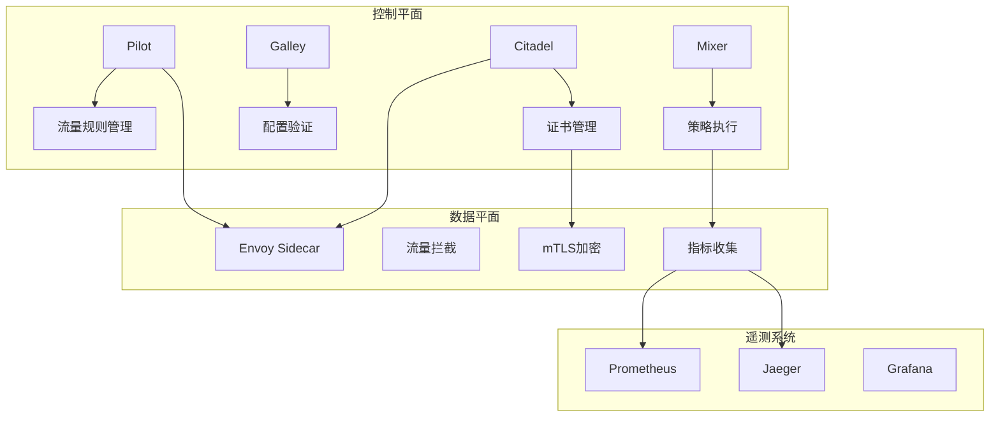

# Kubernetes 服务网格深度实践与Istio集成 (Service Mesh Deep Practice and Istio Integration)

> **作者**: 服务网格架构专家 | **版本**: v2.1 | **更新时间**: 2026-02-07
> **适用场景**: 微服务架构治理 | **复杂度**: ⭐⭐⭐⭐⭐

## 🎯 摘要

本文档深入探讨了Kubernetes环境下服务网格的架构设计、Istio集成实践和运维管理策略，基于大规模微服务架构的实际案例，提供从基础概念到高级特性的完整技术指南，帮助企业构建高效、可靠的微服务治理体系。

## 1. 服务网格架构基础

### 1.1 服务网格核心概念

```yaml
服务网格架构组件:
  数据平面 (Data Plane):
    - Sidecar代理: Envoy Proxy
    - 流量转发: L4/L7流量管理
    - 安全传输: mTLS加密
    - 指标收集: 遥测数据采集
  
  控制平面 (Control Plane):
    - Pilot: 服务发现与路由配置
    - Citadel: 证书管理和安全认证
    - Galley: 配置验证与分发
    - Mixer: 策略执行与遥测
  
  遥测平面 (Telemetry Plane):
    - Prometheus: 指标收集
    - Jaeger: 分布式链路追踪
    - Grafana: 可视化展示
```

### 1.2 Istio架构演进



## 2. Istio安装与配置

### 2.1 Istio控制平面部署

```yaml
# Istio控制平面完整配置
apiVersion: install.istio.io/v1alpha1
kind: IstioOperator
metadata:
  name: istio-control-plane
  namespace: istio-system
spec:
  addonComponents:
    istiocoredns:
      enabled: false
    pilot:
      enabled: true
      k8s:
        replicaCount: 2
        resources:
          requests:
            cpu: 500m
            memory: 2Gi
          limits:
            cpu: 1000m
            memory: 4Gi
        hpaSpec:
          minReplicas: 2
          maxReplicas: 5
          metrics:
          - type: Resource
            resource:
              name: cpu
              targetAverageUtilization: 80
        nodeSelector:
          node-type: istio-control-plane
        tolerations:
        - key: dedicated
          operator: Equal
          value: istio-control-plane
          effect: NoSchedule
  
  components:
    base:
      enabled: true
    pilot:
      enabled: true
      k8s:
        env:
        - name: PILOT_ENABLE_ANALYSIS
          value: "true"
        - name: PILOT_PUSH_THROTTLE
          value: "100"
        - name: PILOT_DEBOUNCE_AFTER
          value: "100ms"
        - name: PILOT_DEBOUNCE_MAX
          value: "10s"
        affinity:
          podAntiAffinity:
            preferredDuringSchedulingIgnoredDuringExecution:
            - weight: 100
              podAffinityTerm:
                labelSelector:
                  matchLabels:
                    app: pilot
                topologyKey: kubernetes.io/hostname
    ingressGateways:
    - name: istio-ingressgateway
      enabled: true
      k8s:
        service:
          type: LoadBalancer
          ports:
          - port: 80
            targetPort: 8080
            name: http2
          - port: 443
            targetPort: 8443
            name: https
        resources:
          requests:
            cpu: 100m
            memory: 128Mi
          limits:
            cpu: 200m
            memory: 1Gi
        hpaSpec:
          minReplicas: 2
          maxReplicas: 10
          metrics:
          - type: Resource
            resource:
              name: cpu
              targetAverageUtilization: 80
    egressGateways:
    - name: istio-egressgateway
      enabled: true
      k8s:
        serviceAnnotations:
          cloud.google.com/load-balancer-type: "External"
        resources:
          requests:
            cpu: 100m
            memory: 128Mi
          limits:
            cpu: 200m
            memory: 1Gi
        hpaSpec:
          minReplicas: 1
          maxReplicas: 5
```

### 2.2 服务网格安全配置

```yaml
# Istio安全配置
apiVersion: security.istio.io/v1beta1
kind: PeerAuthentication
metadata:
  name: default
  namespace: istio-system
spec:
  mtls:
    mode: STRICT
---
apiVersion: security.istio.io/v1beta1
kind: AuthorizationPolicy
metadata:
  name: deny-all
  namespace: default
spec:
  action: DENY
  rules:
  - from:
    - source:
        notNamespaces: ["istio-system"]
---
apiVersion: security.istio.io/v1beta1
kind: AuthorizationPolicy
metadata:
  name: allow-service-to-service
  namespace: default
spec:
  action: ALLOW
  rules:
  - from:
    - source:
        principals: ["cluster.local/ns/default/sa/*"]
    to:
    - operation:
        methods: ["GET", "POST"]
---
apiVersion: networking.istio.io/v1alpha3
kind: DestinationRule
metadata:
  name: default-mtls
  namespace: default
spec:
  host: "*.local"
  trafficPolicy:
    connectionPool:
      http:
        http1MaxPendingRequests: 1000
        maxRequestsPerConnection: 1000
      tcp:
        maxConnections: 1000
    outlierDetection:
      consecutiveErrors: 7
      interval: 30s
      baseEjectionTime: 30s
      maxEjectionPercent: 10
    tls:
      mode: ISTIO_MUTUAL
```

## 3. 流量管理与路由

### 3.1 高级流量路由

```yaml
# 复杂流量路由策略
apiVersion: networking.istio.io/v1alpha3
kind: VirtualService
metadata:
  name: advanced-routing
  namespace: production
spec:
  hosts:
  - api.example.com
  http:
  # 基于用户身份的路由
  - match:
    - headers:
        x-user-type:
          exact: premium
    route:
    - destination:
        host: api-service
        subset: v2
      weight: 100
  # 基于地理位置的路由
  - match:
    - headers:
        x-country-code:
          exact: US
    route:
    - destination:
        host: api-service
        subset: us-east
      weight: 100
  # 基于请求路径的路由
  - match:
    - uri:
        prefix: /api/v1
    route:
    - destination:
        host: legacy-api
        subset: v1
      weight: 100
  - match:
    - uri:
        prefix: /api/v2
    route:
    - destination:
        host: modern-api
        subset: v2
      weight: 100
  # 默认路由
  - route:
    - destination:
        host: api-service
        subset: v1
      weight: 100
---
# 服务子集定义
apiVersion: networking.istio.io/v1alpha3
kind: DestinationRule
metadata:
  name: api-destination
  namespace: production
spec:
  host: api-service
  trafficPolicy:
    connectionPool:
      http:
        http1MaxPendingRequests: 100
        http2MaxRequests: 1000
        maxRequestsPerConnection: 10
      tcp:
        maxConnections: 100
    outlierDetection:
      consecutive5xxErrors: 7
      interval: 30s
      baseEjectionTime: 30s
  subsets:
  - name: v1
    labels:
      version: v1.0
    trafficPolicy:
      connectionPool:
        http:
          http1MaxPendingRequests: 50
  - name: v2
    labels:
      version: v2.0
    trafficPolicy:
      connectionPool:
        http:
          http1MaxPendingRequests: 100
  - name: canary
    labels:
      version: v2.0
      track: canary
    trafficPolicy:
      connectionPool:
        http:
          http1MaxPendingRequests: 200
```

### 3.2 流量分割与金丝雀发布

```yaml
# 金丝雀发布策略
apiVersion: networking.istio.io/v1alpha3
kind: VirtualService
metadata:
  name: canary-deployment
  namespace: production
spec:
  hosts:
  - frontend.example.com
  http:
  - match:
    - headers:
        canary:
          exact: "enabled"
    route:
    - destination:
        host: frontend-service
        subset: canary
      weight: 100
  - route:
    - destination:
        host: frontend-service
        subset: stable
      weight: 90
    - destination:
        host: frontend-service
        subset: canary
      weight: 10
---
# 渐进式金丝雀发布
apiVersion: networking.istio.io/v1alpha3
kind: VirtualService
metadata:
  name: progressive-canary
  namespace: production
spec:
  hosts:
  - backend-service
  http:
  - match:
    - headers:
        x-forwarded-for:
          regex: "^(\\d{1,3}\\.){3}\\d{1,3}$"
    route:
    - destination:
        host: backend-service
        subset: v1
      weight: 85
    - destination:
        host: backend-service
        subset: v2
      weight: 15
---
# 基于错误率的自动回滚
apiVersion: networking.istio.io/v1alpha3
kind: VirtualService
metadata:
  name: circuit-breaker-routing
  namespace: production
spec:
  hosts:
  - critical-service
  http:
  - circuitBreaker:
      consecutiveErrors: 5
      interval: 30s
      baseEjectionTime: 300s
      maxEjectionPercent: 50
    route:
    - destination:
        host: critical-service
        subset: primary
      weight: 100
    fault:
      abort:
        percentage:
          value: 0.1
        httpStatus: 503
      delay:
        percentage:
          value: 0.1
        fixedDelay: 5s
```

## 4. 安全与认证

### 4.1 mTLS配置与管理

```yaml
# 高级mTLS配置
apiVersion: security.istio.io/v1beta1
kind: PeerAuthentication
metadata:
  name: strict-mtls
  namespace: finance
spec:
  selector:
    matchLabels:
      app: banking-service
  mtls:
    mode: STRICT
  portLevelMtls:
    8080:
      mode: PERMISSIVE
    9090:
      mode: STRICT
---
# JWT认证策略
apiVersion: security.istio.io/v1beta1
kind: RequestAuthentication
metadata:
  name: jwt-authn
  namespace: api-gateway
spec:
  selector:
    matchLabels:
      app: api-gateway
  jwtRules:
  - issuer: "https://auth.example.com"
    jwksUri: "https://auth.example.com/.well-known/jwks.json"
    forwardOriginalToken: true
    outputClaimToHeaders:
    - header: "x-user-id"
      claim: "sub"
    - header: "x-user-role"
      claim: "role"
---
apiVersion: security.istio.io/v1beta1
kind: AuthorizationPolicy
metadata:
  name: jwt-authorization
  namespace: api-gateway
spec:
  selector:
    matchLabels:
      app: api-gateway
  rules:
  - from:
    - source:
        requestPrincipals: ["*"]
    when:
    - key: request.headers[x-user-role]
      values: ["admin"]
    to:
    - operation:
        paths: ["/admin/*"]
        methods: ["GET", "POST", "DELETE"]
  - from:
    - source:
        requestPrincipals: ["*"]
    when:
    - key: request.headers[x-user-role]
      values: ["user"]
    to:
    - operation:
        paths: ["/user/*"]
        methods: ["GET", "POST"]
```

### 4.2 证书管理与轮换

```yaml
# Istio证书管理配置
apiVersion: cert-manager.io/v1
kind: Certificate
metadata:
  name: istio-workload-certs
  namespace: istio-system
spec:
  secretName: istio-workload-certs
  issuerRef:
    name: letsencrypt-prod
    kind: ClusterIssuer
  dnsNames:
  - "*.mesh.example.com"
  - "*.local"
  duration: 2160h  # 90 days
  renewBefore: 360h  # 15 days
---
# 自定义CA配置
apiVersion: install.istio.io/v1alpha1
kind: IstioOperator
metadata:
  name: custom-ca
spec:
  values:
    global:
      meshConfig:
        trustDomain: "example.com"
        ca:
          address: "istio-citadel.istio-system.svc:8060"
        defaultConfig:
          proxyMetadata:
            OUTPUT_CERTS: "/etc/istio-output-certs"
            CA_ADDR: "istio-citadel.istio-system.svc:8060"
```

## 5. 监控与可观测性

### 5.1 遥测配置

```yaml
# Istio遥测配置
apiVersion: telemetry.istio.io/v1alpha1
kind: Telemetry
metadata:
  name: default
  namespace: istio-system
spec:
  metrics:
  - providers:
    - name: prometheus
    overrides:
    - match:
        metric: ALL_METRICS
      tagOverrides:
        # 删除不需要的标签以减少存储
        response_code:
          operation: REMOVE
        response_flags:
          operation: REMOVE
    # 自定义指标
    - match:
        metric: REQUEST_COUNT
      overrides:
      - tagOverrides:
          custom_tag:
            value: "istio-proxy"
  - providers:
    - name: otel
    overrides:
    - match:
        metric: ALL_METRICS
      tagOverrides:
        cluster:
          value: "production"
  traces:
  - providers:
    - name: jaeger
    randomSamplingPercentage: 100.0
    customTags:
      environment:
        literal:
          value: "production"
      user:
        header:
          name: "x-user-id"
  accessLogging:
  - providers:
    - name: otel
    filter:
      expression: "response.code >= 400 || attributes.canonical_service_name == 'critical-service'"
---
# 自定义遥测处理器
apiVersion: extensions.istio.io/v1alpha1
kind: WasmPlugin
metadata:
  name: custom-telemetry
  namespace: istio-system
spec:
  selector:
    matchLabels:
      istio: ingressgateway
  url: oci://myregistry/custom-telemetry-plugin:latest
  imagePullPolicy: Always
  phase: STATS
  pluginConfig:
    endpoint: "otel-collector.monitoring.svc.cluster.local:4317"
    sample_rate: 0.1
```

### 5.2 指标收集与分析

```yaml
# Prometheus指标配置
apiVersion: monitoring.coreos.com/v1
kind: ServiceMonitor
metadata:
  name: istio-metrics
  namespace: monitoring
spec:
  selector:
    matchLabels:
      istio: pilot
  endpoints:
  - port: http-monitoring
    path: /metrics
    interval: 15s
    metricRelabelings:
    - sourceLabels: [__name__]
      regex: 'istio_(.*)'
      targetLabel: __name__
---
# 自定义指标收集
apiVersion: v1
kind: ConfigMap
metadata:
  name: istio-custom-metrics
  namespace: istio-system
data:
  custom-metrics.yaml: |
    # 自定义指标配置
    metrics:
      - name: custom_business_metric
        help: "Custom business metric"
        type: gauge
        labels:
          - name: service
            template: "{{ .DestinationServiceName }}"
          - name: namespace
            template: "{{ .DestinationNamespace }}"
    
    # 指标转换规则
    transforms:
      - match:
          metric: istio_requests_total
        labels:
          destination_service:
            rename: service
          response_code:
            transform: "int(response_code)"
```

## 6. 性能优化与调优

### 6.1 代理性能调优

```yaml
# Envoy代理性能优化
apiVersion: install.istio.io/v1alpha1
kind: IstioOperator
metadata:
  name: performance-optimized
spec:
  values:
    pilot:
      env:
        # 优化推送性能
        PILOT_PUSH_THROTTLE: "100"
        PILOT_DEBOUNCE_AFTER: "100ms"
        PILOT_DEBOUNCE_MAX: "10s"
        # 资源限制
        PILOT_TRACE_SAMPLING: "100"
        # 并发处理
        CONcurrency: "2"
    global:
      proxy:
        resources:
          requests:
            cpu: 100m
            memory: 128Mi
          limits:
            cpu: 500m
            memory: 512Mi
        # 代理配置优化
        privileged: false
        enableCoreDump: false
        logLevel: "warning"
        componentLogLevel: "misc:error"
        # 性能相关设置
        envoyMetricsService:
          address: "otel-collector.monitoring.svc.cluster.local:15010"
        envoyAccessLogService:
          address: "otel-collector.monitoring.svc.cluster.local:15010"
---
# 高性能Sidecar配置
apiVersion: networking.istio.io/v1alpha3
kind: Sidecar
metadata:
  name: high-performance-sidecar
  namespace: performance-critical
spec:
  workloadSelector:
    labels:
      app: high-performance-service
  inboundConnectionPool:
    http:
      http1MaxPendingRequests: 1000
      http2MaxRequests: 1000
      maxRequestsPerConnection: 10000
      maxRetries: 10
    tcp:
      maxConnections: 1000
  outboundTrafficPolicy:
    mode: REGISTRY_ONLY
  egress:
  - hosts:
    - "istio-system/*"
    - "./*.internal.example.com"
```

### 6.2 网关性能优化

```yaml
# 高性能网关配置
apiVersion: networking.istio.io/v1alpha3
kind: Gateway
metadata:
  name: performance-gateway
  namespace: istio-system
spec:
  selector:
    istio: ingressgateway-performance
  servers:
  - port:
      number: 80
      name: http
      protocol: HTTP
    hosts:
    - "*.example.com"
    tls:
      httpsRedirect: true
  - port:
      number: 443
      name: https
      protocol: HTTPS
    hosts:
    - "*.example.com"
    tls:
      mode: SIMPLE
      credentialName: wildcard-certs
---
apiVersion: networking.istio.io/v1alpha3
kind: VirtualService
metadata:
  name: performance-vs
  namespace: istio-system
spec:
  hosts:
  - "*.example.com"
  gateways:
  - performance-gateway
  http:
  - match:
    - uri:
        prefix: /api/
    route:
    - destination:
        host: api-service
        port:
          number: 8080
      weight: 100
    timeout: 30s
    retries:
      attempts: 3
      perTryTimeout: 10s
      retryOn: connect-failure,retriable-4xx,5xx
    corsPolicy:
      allowOrigin:
      - "*"
      allowMethods:
      - GET
      - POST
      - PUT
      - DELETE
      allowHeaders:
      - Content-Type
      - Authorization
      - X-Requested-With
      maxAge: "24h"
```

## 7. 故障排除与调试

### 7.1 服务网格诊断工具

```bash
#!/bin/bash
# istio-troubleshooting.sh

# Istio故障诊断脚本
echo "=== Istio服务网格诊断 ==="

# 1. 检查Istio组件状态
echo "1. 检查Istio组件状态:"
kubectl get pods -n istio-system

# 2. 检查配置有效性
echo "2. 检查Istio配置有效性:"
istioctl analyze -A

# 3. 检查Sidecar注入状态
echo "3. 检查Sidecar注入状态:"
kubectl get pods --all-namespaces -l istio-proxy -o wide

# 4. 检查配置同步状态
echo "4. 检查配置同步状态:"
istioctl proxy-status

# 5. 检查配置详细信息
echo "5. 检查特定Pod配置:"
if [ $# -eq 1 ]; then
    POD_NAME=$1
    echo "配置详情:"
    istioctl proxy-config clusters $POD_NAME
    istioctl proxy-config listeners $POD_NAME
    istioctl proxy-config routes $POD_NAME
    istioctl proxy-config bootstrap $POD_NAME
else
    echo "用法: $0 <pod-name>"
fi

# 6. 检查遥测数据
echo "6. 检查遥测数据:"
kubectl logs -n istio-system -l app=prometheus --tail=100

# 7. 检查网关配置
echo "7. 检查网关配置:"
kubectl get gateways.networking.istio.io --all-namespaces
kubectl get virtualservices.networking.istio.io --all-namespaces

echo "=== 诊断完成 ==="
```

### 7.2 流量调试

```yaml
# 流量调试配置
apiVersion: networking.istio.io/v1alpha3
kind: VirtualService
metadata:
  name: debug-routing
  namespace: debug
spec:
  hosts:
  - debug-service.debug.svc.cluster.local
  http:
  - match:
    - headers:
        x-debug-trace:
          exact: "true"
    route:
    - destination:
        host: debug-service
        subset: debug
      weight: 100
    headers:
      request:
        add:
          x-trace-id: ""
          x-debug-level: "verbose"
  - route:
    - destination:
        host: debug-service
        subset: stable
      weight: 100
---
# 流量镜像配置
apiVersion: networking.istio.io/v1alpha3
kind: VirtualService
metadata:
  name: traffic-mirroring
  namespace: production
spec:
  hosts:
  - production-service
  http:
  - match:
    - headers:
        x-env: "staging"
    route:
    - destination:
        host: production-service
        subset: v1
      weight: 100
    mirror:
      host: production-service
      subset: mirror
    mirrorPercentage:
      value: 100.0
```

## 8. 最佳实践与实施指南

### 8.1 服务网格实施原则

```markdown
## 🌐 服务网格实施原则

### 1. 渐进式采用
- 从非关键服务开始试点
- 逐步扩大服务网格覆盖范围
- 建立回滚和降级机制

### 2. 性能优先
- 优化Sidecar资源配置
- 实施有效的流量管理
- 监控性能影响

### 3. 安全第一
- 默认启用mTLS
- 实施细粒度访问控制
- 定期轮换证书

### 4. 可观测性驱动
- 建立完整的监控体系
- 实施分布式追踪
- 建立告警和响应机制
```

### 8.2 实施检查清单

```yaml
服务网格实施检查清单:
  基础设施:
    ☐ Kubernetes集群就绪
    ☐ 足够的资源预留
    ☐ 网络策略配置完成
    ☐ 安全证书准备就绪
  
  安装部署:
    ☐ Istio控制平面安装
    ☐ 服务网格配置验证
    ☐ Sidecar注入测试
    ☐ 基础功能验证
  
  安全配置:
    ☐ mTLS策略配置
    ☐ JWT认证配置
    ☐ 授权策略配置
    ☐ 证书管理配置
  
  监控告警:
    ☐ 遥测系统配置
    ☐ 关键指标监控
    ☐ 告警规则设置
    ☐ 可视化面板配置
  
  性能调优:
    ☐ 资源配置优化
    ☐ 流量管理优化
    ☐ 网关性能调优
    ☐ 故障恢复测试
```

## 9. 高级应用场景

### 9.1 多集群服务网格

```yaml
# 多集群服务网格配置
apiVersion: install.istio.io/v1alpha1
kind: IstioOperator
metadata:
  name: remote-cluster
spec:
  values:
    global:
      meshID: mesh1
      multiCluster:
        clusterName: cluster1
      network: network1
  components:
    pilot:
      enabled: false
    ingressGateways:
    - name: istio-ingressgateway
      enabled: true
---
# 服务导出配置
apiVersion: networking.istio.io/v1alpha3
kind: ServiceEntry
metadata:
  name: cross-network-service
spec:
  hosts:
  - service.cluster2.global
  addresses:
  - 240.0.0.1
  ports:
  - number: 80
    name: http
    protocol: HTTP
  location: MESH_EXTERNAL
  resolution: DNS
  endpoints:
  - address: istio-ingressgateway.istio-system.svc.cluster.local
    ports:
      http: 80
    labels:
      cluster: cluster2
```

### 9.2 混合云服务网格

```yaml
# 混合云服务网格配置
apiVersion: networking.istio.io/v1alpha3
kind: ServiceEntry
metadata:
  name: vm-service
spec:
  hosts:
  - vm.service.mesh.local
  ports:
  - number: 80
    name: http
    protocol: HTTP
  location: MESH_INTERNAL
  resolution: STATIC
  endpoints:
  - address: 10.0.0.10
    ports:
      http: 80
    labels:
      app: vm-service
      istio: sidecar
---
apiVersion: networking.istio.io/v1alpha3
kind: VirtualService
metadata:
  name: hybrid-routing
spec:
  hosts:
  - hybrid-service
  http:
  - match:
    - headers:
        x-cloud-type:
          exact: "onprem"
    route:
    - destination:
        host: vm-service
        subset: onprem
      weight: 100
  - route:
    - destination:
        host: k8s-service
        subset: cloud
      weight: 100
```

## 10. 未来发展趋势

### 10.1 服务网格演进方向

```yaml
服务网格发展趋势:
  1. WASM扩展能力
     - 用户自定义插件
     - 零停机扩展能力
     - 轻量级运行时
  
  2. AI驱动的治理
     - 智能流量调度
     - 自动故障恢复
     - 预测性性能优化
  
  3. 统一控制平面
     - 多网格管理
     - 跨云协调
     - 策略统一管理
```

---
*本文档基于企业级服务网格实践经验编写，持续更新最新技术和最佳实践。*