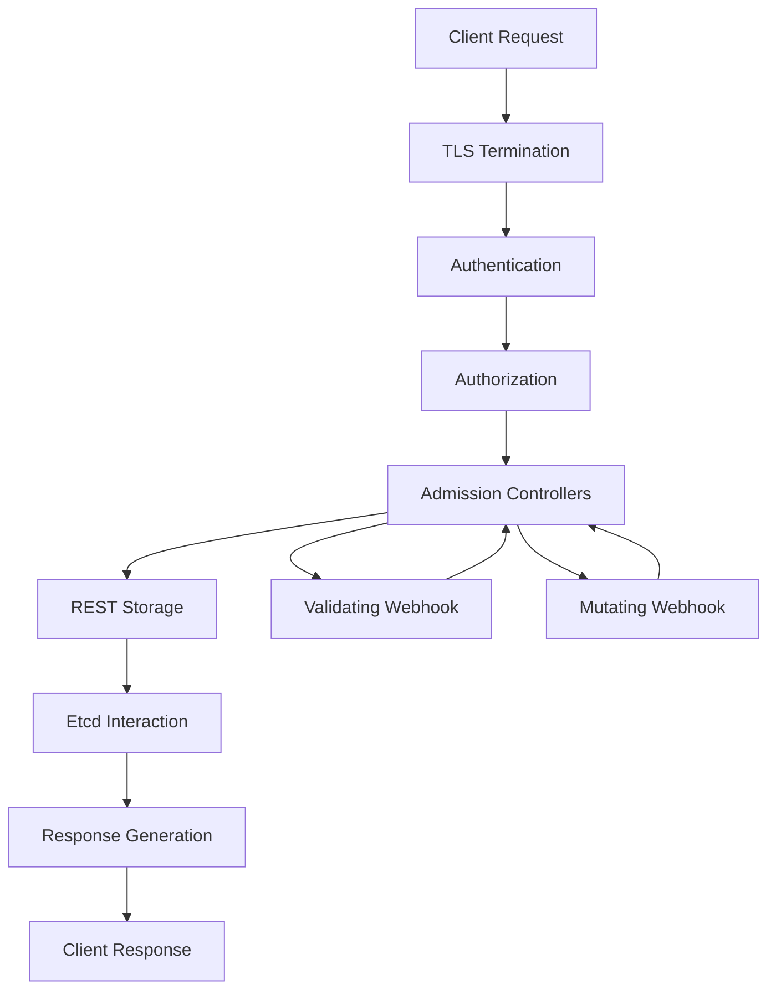

# Kubernetes API Server 深度优化与扩展 (API Server Deep Optimization and Extension)

> **作者**: Kubernetes核心组件专家 | **版本**: v1.6 | **更新时间**: 2026-02-07
> **适用场景**: 大规模集群控制平面优化 | **复杂度**: ⭐⭐⭐⭐⭐

## 🎯 摘要

本文档深入探讨了Kubernetes API Server的架构原理、性能优化和扩展机制，基于大规模生产环境的实践经验，提供从基础配置到高级扩展的完整技术指南，帮助企业构建高性能、高可用的API Server架构。

## 1. API Server 架构原理

### 1.1 API Server 核心组件

```yaml
API Server架构组件:
  核心服务层:
    - Authentication: 身份认证模块
    - Authorization: 授权检查模块
    - Admission Controllers: 准入控制器
    - REST Storage: 存储接口层
    - Etcd Client: etcd交互层
  
  网络层:
    - HTTP Server: HTTP服务接口
    - TLS Termination: TLS终止
    - Rate Limiting: 限流控制
    - Connection Management: 连接管理
  
  扩展层:
    - Aggregation Layer: API聚合层
    - CRD Handler: 自定义资源处理
    - Webhook: Webhook调用
```

### 1.2 请求处理流程



## 2. 性能优化策略

### 2.1 API Server 参数调优

```yaml
# 高性能API Server配置
apiVersion: v1
kind: Pod
metadata:
  name: kube-apiserver-high-performance
  namespace: kube-system
spec:
  containers:
  - name: kube-apiserver
    image: k8s.gcr.io/kube-apiserver:v1.28.5
    command:
    - kube-apiserver
    # 性能优化参数
    - --max-requests-inflight=1000
    - --max-mutating-requests-inflight=500
    - --request-timeout=1m0s
    - --min-request-timeout=1800
    - --enable-priority-and-fairness=true
    - --api-audiences=kubernetes.default.svc
    - --authorization-mode=RBAC
    - --enable-admission-plugins=NamespaceLifecycle,LimitRanger,ServiceAccount,ResourceQuota,Priority,DefaultTolerationSeconds,TaintNodesByCondition,NodeRestriction,MutatingAdmissionWebhook,ValidatingAdmissionWebhook
    # etcd连接优化
    - --etcd-servers=https://127.0.0.1:2379
    - --etcd-cafile=/etc/ssl/etcd/ssl/ca.pem
    - --etcd-certfile=/etc/ssl/etcd/ssl/node-{}.pem
    - --etcd-keyfile=/etc/ssl/etcd/ssl/node-{}-key.pem
    # TLS优化
    - --tls-cert-file=/etc/ssl/apiserver.pem
    - --tls-private-key-file=/etc/ssl/apiserver-key.pem
    - --client-ca-file=/etc/ssl/ca.pem
    - --kubelet-certificate-authority=/etc/ssl/ca.pem
    - --kubelet-client-certificate=/etc/ssl/apiserver.pem
    - --kubelet-client-key=/etc/ssl/apiserver-key.pem
    # 聚合层配置
    - --requestheader-client-ca-file=/etc/ssl/front-proxy-ca.pem
    - --requestheader-allowed-names=front-proxy-client
    - --requestheader-extra-headers-prefix=X-Remote-Extra-
    - --requestheader-group-headers=X-Remote-Group
    - --requestheader-username-headers=X-Remote-User
    - --proxy-client-cert-file=/etc/ssl/front-proxy-client.pem
    - --proxy-client-key-file=/etc/ssl/front-proxy-client-key.pem
    # 性能监控
    - --profiling=true
    - --enable-swagger-ui=true
    # 缓存优化
    - --watch-cache=true
    - --watch-cache-sizes=replicationcontroller:2000,service:2000,namespace:2000
    # 资源限制
    resources:
      requests:
        cpu: 2000m
        memory: 4Gi
      limits:
        cpu: 4000m
        memory: 8Gi
    # 健康检查
    livenessProbe:
      httpGet:
        path: /livez
        port: 6443
        scheme: HTTPS
      initialDelaySeconds: 15
      timeoutSeconds: 15
    readinessProbe:
      httpGet:
        path: /readyz
        port: 6443
        scheme: HTTPS
      initialDelaySeconds: 10
      timeoutSeconds: 15
```

### 2.2 高可用部署配置

```yaml
# API Server高可用配置
apiVersion: v1
kind: Service
metadata:
  name: kube-apiserver-lb
  namespace: kube-system
spec:
  type: LoadBalancer
  ports:
  - port: 6443
    targetPort: 6443
    protocol: TCP
    name: https
  selector:
    component: kube-apiserver
---
apiVersion: v1
kind: Endpoints
metadata:
  name: kube-apiserver-lb
  namespace: kube-system
subsets:
- addresses:
  - ip: 10.0.1.10
  - ip: 10.0.1.11
  - ip: 10.0.1.12
  ports:
  - port: 6443
    name: https
---
apiVersion: apps/v1
kind: DaemonSet
metadata:
  name: kube-apiserver
  namespace: kube-system
spec:
  selector:
    matchLabels:
      component: kube-apiserver
  template:
    metadata:
      labels:
        component: kube-apiserver
    spec:
      hostNetwork: true
      nodeSelector:
        node-role.kubernetes.io/control-plane: ""
      tolerations:
      - key: node-role.kubernetes.io/control-plane
        operator: Exists
        effect: NoSchedule
      - key: node.cloudprovider.kubernetes.io/uninitialized
        value: "true"
        effect: NoSchedule
      containers:
      - name: kube-apiserver
        image: k8s.gcr.io/kube-apiserver:v1.28.5
        # ... (配置如上)
```

## 3. 扩展机制与API聚合

### 3.1 API聚合层配置

```yaml
# API服务注册配置
apiVersion: apiregistration.k8s.io/v1
kind: APIService
metadata:
  name: v1beta1.custom.metrics.k8s.io
spec:
  service:
    name: custom-metrics-apiserver
    namespace: monitoring
  group: custom.metrics.k8s.io
  version: v1beta1
  insecureSkipTLSVerify: true
  groupPriorityMinimum: 100
  versionPriority: 100
---
apiVersion: apiregistration.k8s.io/v1
kind: APIService
metadata:
  name: v1beta1.metrics.k8s.io
spec:
  service:
    name: metrics-server
    namespace: kube-system
  group: metrics.k8s.io
  version: v1beta1
  insecureSkipTLSVerify: true
  groupPriorityMinimum: 100
  versionPriority: 100
```

### 3.2 自定义API服务器开发

```go
// 自定义API服务器示例
package main

import (
    "context"
    "flag"
    "os"
    "time"

    "k8s.io/apimachinery/pkg/runtime"
    "k8s.io/apimachinery/pkg/runtime/schema"
    "k8s.io/apimachinery/pkg/util/wait"
    "k8s.io/apiserver/pkg/endpoints/openapi"
    "k8s.io/apiserver/pkg/server"
    "k8s.io/apiserver/pkg/server/options"
    "k8s.io/client-go/kubernetes"
    "k8s.io/client-go/tools/clientcmd"
    "k8s.io/klog/v2"
    
    customapis "example.com/apis/custom/v1"
    customscheme "example.com/apis/custom/v1"
    customstorage "example.com/apis/custom/v1/storage"
)

var (
    masterURL  string
    kubeconfig string
)

func init() {
    flag.StringVar(&kubeconfig, "kubeconfig", "", "Path to a kubeconfig. Only required if out-of-cluster.")
    flag.StringVar(&masterURL, "master", "", "The address of the Kubernetes API server. Overrides any value in kubeconfig. Only required if out-of-cluster.")
}

func main() {
    flag.Set("logtostderr", "true")
    flag.Parse()

    cfg, err := clientcmd.BuildConfigFromFlags(masterURL, kubeconfig)
    if err != nil {
        klog.Fatalf("Error building kubeconfig: %s", err.Error())
    }

    // 创建Kubernetes客户端
    kubeClient, err := kubernetes.NewForConfig(cfg)
    if err != nil {
        klog.Fatalf("Error building kubernetes clientset: %s", err.Error())
    }

    // 创建API服务器配置
    s := NewServer()

    // 启动服务器
    if err := s.PrepareRun().Run(wait.NeverStop); err != nil {
        klog.Fatalf("Error running server: %v", err)
    }
}

func NewServer() *CustomAPIServer {
    scheme := runtime.NewScheme()
    customscheme.AddToScheme(scheme)

    serverConfig := options.NewServerRunOptions()
    serverConfig.SecureServing.BindPort = 8443
    serverConfig.Authentication.Anonymous.Allow = false
    serverConfig.Authorization.Mode = "RBAC"

    config, err := serverConfig.Complete()
    if err != nil {
        panic(err)
    }

    config.OpenAPIConfig = genericapiserver.DefaultOpenAPIConfig(
        customapis.GetOpenAPIDefinitions,
        openapi.NewDefinitionNamer(scheme),
    )
    config.OpenAPIConfig.Info.Title = "Custom API Server"
    config.OpenAPIConfig.Info.Version = "1.0.0"

    server, err := config.New("custom-apiserver", genericapiserver.NewEmptyDelegate())
    if err != nil {
        panic(err)
    }

    // 注册自定义API
    if err := registerCustomAPIs(server); err != nil {
        panic(err)
    }

    return &CustomAPIServer{GenericAPIServer: server}
}

func registerCustomAPIs(s *genericapiserver.GenericAPIServer) error {
    storage := customstorage.NewStorage()
    
    apiGroupInfo := genericapiserver.APIGroupInfo{
        GroupMeta: metav1.GroupMeta{
            GroupVersion: customapis.SchemeGroupVersion,
            VersionPreferenceOrder: []string{customapis.SchemeGroupVersion.Version},
        },
        OptionsExternalVersion: &schema.GroupVersion{Version: "v1"},
        MetaGroupVersion: &schema.GroupVersion{Group: customapis.SchemeGroupVersion.Group, Version: "v1"},
        Scheme: customscheme.Scheme,
        ParameterCodec: customscheme.ParameterCodec,
        NegotiatedSerializer: customscheme.Codecs,
        SubresourceGroupVersionKind: map[string]schema.GroupVersionKind{},
        SubresourceEncoderFn: func(targetGV schema.GroupVersion) runtime.Encoder { return customscheme.Codecs.LegacyCodec(targetGV) },
    }

    apiGroupInfo.VersionedResourcesStorageMap = map[string]map[string]rest.Storage{
        customapis.SchemeGroupVersion.Version: storage,
    }

    return s.InstallAPIGroup(&apiGroupInfo)
}

type CustomAPIServer struct {
    *genericapiserver.GenericAPIServer
}
```

## 4. 准入控制器开发

### 4.1 准入控制器实现

```go
// 自定义准入控制器
package main

import (
    "context"
    "encoding/json"
    "fmt"
    "net/http"

    admissionv1 "k8s.io/api/admission/v1"
    corev1 "k8s.io/api/core/v1"
    metav1 "k8s.io/apimachinery/pkg/apis/meta/v1"
    "k8s.io/apimachinery/pkg/runtime"
    "k8s.io/apimachinery/pkg/runtime/serializer"
    "k8s.io/klog/v2"
)

type AdmissionController struct {
    decoder runtime.Decoder
}

func NewAdmissionController() *AdmissionController {
    scheme := runtime.NewScheme()
    corev1.AddToScheme(scheme)
    
    codecs := serializer.NewCodecFactory(scheme)
    decoder := codecs.UniversalDecoder(corev1.SchemeGroupVersion)
    
    return &AdmissionController{
        decoder: decoder,
    }
}

func (ac *AdmissionController) HandleAdmission(w http.ResponseWriter, r *http.Request) {
    var body []byte
    if r.Body != nil {
        body, _ = io.ReadAll(r.Body)
    }
    
    if len(body) == 0 {
        http.Error(w, "empty body", http.StatusBadRequest)
        return
    }

    var admissionReview admissionv1.AdmissionReview
    if err := json.Unmarshal(body, &admissionReview); err != nil {
        klog.Errorf("Could not unmarshal admission review: %v", err)
        ac.writeAdmissionResponse(w, &admissionv1.AdmissionResponse{
            Result: &metav1.Status{
                Message: err.Error(),
            },
        })
        return
    }

    var response *admissionv1.AdmissionResponse
    if admissionReview.Request.Kind.Kind == "Pod" {
        response = ac.admitPod(admissionReview.Request)
    } else {
        response = &admissionv1.AdmissionResponse{
            UID:     admissionReview.Request.UID,
            Allowed: true,
        }
    }

    ac.writeAdmissionResponse(w, response)
}

func (ac *AdmissionController) admitPod(req *admissionv1.AdmissionRequest) *admissionv1.AdmissionResponse {
    response := &admissionv1.AdmissionResponse{
        UID: req.UID,
    }

    // 解码Pod对象
    var pod corev1.Pod
    if err := json.Unmarshal(req.Object.Raw, &pod); err != nil {
        return &admissionv1.AdmissionResponse{
            UID: req.UID,
            Result: &metav1.Status{
                Message: err.Error(),
            },
        }
    }

    // 验证Pod配置
    if !ac.validatePod(&pod) {
        return &admissionv1.AdmissionResponse{
            UID:     req.UID,
            Allowed: false,
            Result: &metav1.Status{
                Message: "Pod configuration validation failed",
            },
        }
    }

    // 修改Pod配置
    patchBytes, err := ac.mutatePod(&pod)
    if err != nil {
        return &admissionv1.AdmissionResponse{
            UID: req.UID,
            Result: &metav1.Status{
                Message: err.Error(),
            },
        }
    }

    response.Allowed = true
    if len(patchBytes) > 0 {
        response.Patch = patchBytes
        patchType := admissionv1.PatchTypeJSONPatch
        response.PatchType = &patchType
    }

    return response
}

func (ac *AdmissionController) validatePod(pod *corev1.Pod) bool {
    // 验证Pod配置
    for _, container := range pod.Spec.Containers {
        // 检查特权容器
        if container.SecurityContext != nil && 
           container.SecurityContext.Privileged != nil && 
           *container.SecurityContext.Privileged {
            klog.Warningf("Privileged container detected: %s", container.Name)
            return false
        }

        // 检查hostPID
        if pod.Spec.HostPID {
            klog.Warningf("HostPID enabled for pod: %s", pod.Name)
            return false
        }

        // 检查hostNetwork
        if pod.Spec.HostNetwork {
            klog.Warningf("HostNetwork enabled for pod: %s", pod.Name)
            return false
        }
    }

    return true
}

func (ac *AdmissionController) mutatePod(pod *corev1.Pod) ([]byte, error) {
    // 添加默认安全上下文
    if pod.Spec.SecurityContext == nil {
        pod.Spec.SecurityContext = &corev1.PodSecurityContext{}
    }

    if pod.Spec.SecurityContext.RunAsNonRoot == nil {
        runAsNonRoot := true
        pod.Spec.SecurityContext.RunAsNonRoot = &runAsNonRoot
    }

    // 为所有容器添加安全上下文
    for i := range pod.Spec.Containers {
        container := &pod.Spec.Containers[i]
        if container.SecurityContext == nil {
            container.SecurityContext = &corev1.SecurityContext{}
        }

        if container.SecurityContext.RunAsNonRoot == nil {
            runAsNonRoot := true
            container.SecurityContext.RunAsNonRoot = &runAsNonRoot
        }

        if container.SecurityContext.AllowPrivilegeEscalation == nil {
            allowPrivilegeEscalation := false
            container.SecurityContext.AllowPrivilegeEscalation = &allowPrivilegeEscalation
        }
    }

    // 生成patch
    original, err := json.Marshal(pod)
    if err != nil {
        return nil, err
    }

    // 重新创建Pod对象以生成patch
    newPod := pod.DeepCopy()
    modified, err := json.Marshal(newPod)
    if err != nil {
        return nil, err
    }

    return ac.createPatch(original, modified)
}

func (ac *AdmissionController) createPatch(original, modified []byte) ([]byte, error) {
    // 创建JSON Patch
    patch, err := strategicpatch.CreateTwoWayMergePatch(original, modified, corev1.Pod{})
    if err != nil {
        return nil, err
    }

    return patch, nil
}

func (ac *AdmissionController) writeAdmissionResponse(w http.ResponseWriter, response *admissionv1.AdmissionResponse) {
    admissionReview := admissionv1.AdmissionReview{
        TypeMeta: metav1.TypeMeta{
            Kind:       "AdmissionReview",
            APIVersion: "admission.k8s.io/v1",
        },
        Response: response,
    }

    respBytes, err := json.Marshal(admissionReview)
    if err != nil {
        klog.Errorf("Could not marshal admission response: %v", err)
        return
    }

    w.Header().Set("Content-Type", "application/json")
    w.Write(respBytes)
}
```

### 4.2 Webhook配置

```yaml
# Validating Webhook配置
apiVersion: admissionregistration.k8s.io/v1
kind: ValidatingWebhookConfiguration
metadata:
  name: pod-validation-webhook
webhooks:
- name: pod-validation.example.com
  rules:
  - apiGroups: [""]
    apiVersions: ["v1"]
    operations: ["CREATE", "UPDATE"]
    resources: ["pods"]
    scope: "Namespaced"
  clientConfig:
    service:
      name: pod-validation-webhook
      namespace: kube-system
      path: "/validate/pod"
    caBundle: <CA_BUNDLE_BASE64_ENCODED>
  admissionReviewVersions: ["v1"]
  sideEffects: None
  timeoutSeconds: 10
  failurePolicy: Fail
  matchPolicy: Equivalent
---
# Mutating Webhook配置
apiVersion: admissionregistration.k8s.io/v1
kind: MutatingWebhookConfiguration
metadata:
  name: pod-mutation-webhook
webhooks:
- name: pod-mutation.example.com
  rules:
  - apiGroups: [""]
    apiVersions: ["v1"]
    operations: ["CREATE"]
    resources: ["pods"]
    scope: "Namespaced"
  clientConfig:
    service:
      name: pod-mutation-webhook
      namespace: kube-system
      path: "/mutate/pod"
    caBundle: <CA_BUNDLE_BASE64_ENCODED>
  admissionReviewVersions: ["v1"]
  sideEffects: None
  timeoutSeconds: 10
  failurePolicy: Fail
  reinvocationPolicy:IfNeeded
```

## 5. 监控与性能分析

### 5.1 API Server 监控指标

```yaml
# API Server监控配置
apiVersion: monitoring.coreos.com/v1
kind: ServiceMonitor
metadata:
  name: kube-apiserver-monitor
  namespace: monitoring
spec:
  selector:
    matchLabels:
      component: kube-apiserver
  endpoints:
  - port: https
    path: /metrics
    scheme: https
    interval: 30s
    tlsConfig:
      caFile: /var/run/secrets/kubernetes.io/serviceaccount/ca.crt
      insecureSkipVerify: true
    bearerTokenFile: /var/run/secrets/kubernetes.io/serviceaccount/token
    metricRelabelings:
    - sourceLabels: [__name__]
      regex: 'apiserver_(.*)'
      targetLabel: __name__
    - sourceLabels: [__name__]
      regex: 'rest_client_(.*)'
      targetLabel: __name__
    - sourceLabels: [__name__]
      regex: 'etcd_(.*)'
      targetLabel: __name__
```

### 5.2 关键性能指标

```prometheus
# API Server关键指标
# 请求延迟
histogram_quantile(0.99, rate(apiserver_request_duration_seconds_bucket{verb!~"WATCH"}[5m])) > 1
histogram_quantile(0.95, rate(apiserver_request_duration_seconds_bucket{verb!~"WATCH"}[5m])) > 0.5

# 请求速率
sum(rate(apiserver_request_total[5m])) by (verb, resource) > 1000

# 错误率
sum(rate(apiserver_request_total{code=~"5.."}[5m])) by (verb, resource) / 
sum(rate(apiserver_request_total[5m])) by (verb, resource) > 0.01

# etcd性能
histogram_quantile(0.99, rate(etcd_disk_backend_commit_duration_seconds_bucket[5m])) > 0.1
histogram_quantile(0.99, rate(etcd_network_peer_round_trip_time_seconds_bucket[5m])) > 0.1

# 连接数
apiserver_current_inflight_requests > 500
apiserver_current_mutating_requests > 250

# 认证授权性能
histogram_quantile(0.99, rate(apiserver_authn_duration_seconds_bucket[5m])) > 0.1
histogram_quantile(0.99, rate(apiserver_authz_duration_seconds_bucket[5m])) > 0.1
```

### 5.3 性能分析工具

```bash
#!/bin/bash
# apiserver-performance-analyzer.sh

# API Server性能分析脚本
echo "=== API Server性能分析 ==="

# 1. 检查API Server状态
echo "1. 检查API Server状态:"
kubectl get componentstatuses

# 2. 获取API Server指标
echo "2. 获取API Server指标:"
kubectl get --raw /metrics | grep apiserver | head -20

# 3. 分析请求延迟
echo "3. 分析请求延迟分布:"
kubectl get --raw /metrics | grep "apiserver_request_duration_seconds_bucket" | \
    grep -v "WATCH" | sort

# 4. 检查认证授权性能
echo "4. 检查认证授权性能:"
kubectl get --raw /metrics | grep -E "(authn|authz)_duration_seconds"

# 5. 分析etcd性能
echo "5. 分析etcd性能:"
kubectl get --raw /metrics | grep -E "etcd_(disk|network|request|wal)_"

# 6. 检查连接数
echo "6. 检查当前连接数:"
kubectl get --raw /metrics | grep inflight_requests

# 7. 分析请求速率
echo "7. 分析请求速率:"
kubectl get --raw /metrics | grep "apiserver_request_total" | head -10

# 8. 生成性能报告
echo "8. 生成性能报告:"
cat << EOF > /tmp/apiserver-performance-report.txt
API Server Performance Report - $(date)
=====================================

Request Latency (99th percentile):
- GET: $(kubectl get --raw /metrics | grep 'apiserver_request_duration_seconds_bucket{verb="GET"' | grep 'le="+Inf"}' | cut -d' ' -f2)
- POST: $(kubectl get --raw /metrics | grep 'apiserver_request_duration_seconds_bucket{verb="POST"' | grep 'le="+Inf"}' | cut -d' ' -f2)
- PUT: $(kubectl get --raw /metrics | grep 'apiserver_request_duration_seconds_bucket{verb="PUT"' | grep 'le="+Inf"}' | cut -d' ' -f2)
- DELETE: $(kubectl get --raw /metrics | grep 'apiserver_request_duration_seconds_bucket{verb="DELETE"' | grep 'le="+Inf"}' | cut -d' ' -f2)

Current Inflight Requests: $(kubectl get --raw /metrics | grep 'apiserver_current_inflight_requests ' | cut -d' ' -f2)

Etcd Backend Commit Duration (99th percentile): $(kubectl get --raw /metrics | grep 'etcd_disk_backend_commit_duration_seconds_bucket' | grep 'le="+Inf"}' | cut -d' ' -f2)

EOF

echo "性能报告已生成: /tmp/apiserver-performance-report.txt"
```

## 6. 安全加固与最佳实践

### 6.1 安全配置

```yaml
# API Server安全配置
apiVersion: v1
kind: Pod
metadata:
  name: kube-apiserver-secure
  namespace: kube-system
spec:
  containers:
  - name: kube-apiserver
    image: k8s.gcr.io/kube-apiserver:v1.28.5
    command:
    - kube-apiserver
    # 认证配置
    - --oidc-issuer-url=https://dex.example.com
    - --oidc-client-id=kubernetes
    - --oidc-username-claim=email
    - --oidc-groups-claim=groups
    - --oidc-ca-file=/etc/ssl/ca.pem
    # 授权配置
    - --authorization-mode=RBAC,Node
    - --authorization-webhook-config-file=/etc/kubernetes/webhook-config.yaml
    # 审计配置
    - --audit-policy-file=/etc/kubernetes/audit/policy.yaml
    - --audit-log-path=/var/log/kubernetes/audit.log
    - --audit-log-maxage=30
    - --audit-log-maxbackup=10
    - --audit-log-maxsize=100
    # TLS安全
    - --tls-min-version=VersionTLS12
    - --tls-cipher-suites=TLS_ECDHE_RSA_WITH_AES_128_GCM_SHA256,TLS_ECDHE_RSA_WITH_AES_256_GCM_SHA384
    # 安全头
    - --anonymous-auth=false
    - --basic-auth-file=/etc/kubernetes/basic_auth.csv
    # 准入控制器
    - --enable-admission-plugins=NamespaceLifecycle,LimitRanger,ServiceAccount,ResourceQuota,Priority,DefaultTolerationSeconds,TaintNodesByCondition,NodeRestriction,MutatingAdmissionWebhook,ValidatingAdmissionWebhook
    - --disable-admission-plugins=AlwaysPurge,DenyEscalatingExec
    # 安全参数
    - --allow-privileged=false
    - --enable-bootstrap-token-auth=true
    securityContext:
      privileged: false
      runAsNonRoot: true
      runAsUser: 65534
      readOnlyRootFilesystem: true
      capabilities:
        drop:
        - ALL
    resources:
      requests:
        cpu: 500m
        memory: 1Gi
      limits:
        cpu: 1000m
        memory: 2Gi
```

### 6.2 审计策略

```yaml
# API Server审计策略
apiVersion: audit.k8s.io/v1
kind: Policy
metadata:
  name: apiserver-audit-policy
rules:
# 记录所有请求
- level: Metadata
  resources:
  - group: ""
    resources: ["pods", "secrets", "configmaps", "serviceaccounts", "persistentvolumeclaims"]
  verbs: ["create", "update", "patch", "delete"]

# 记录所有RBAC操作
- level: RequestResponse
  resources:
  - group: "rbac.authorization.k8s.io"
    resources: ["roles", "rolebindings", "clusterroles", "clusterrolebindings"]
  verbs: ["create", "update", "patch", "delete"]

# 记录所有对敏感资源的访问
- level: RequestResponse
  resources:
  - group: ""
    resources: ["secrets", "configmaps"]
  verbs: ["get", "list", "watch"]

# 记录所有对节点的操作
- level: Metadata
  resources:
  - group: ""
    resources: ["nodes"]
  verbs: ["create", "update", "patch", "delete"]

# 记录所有对命名空间的操作
- level: Metadata
  resources:
  - group: ""
    resources: ["namespaces"]
  verbs: ["create", "update", "patch", "delete"]

# 记录所有认证失败的请求
- level: Metadata
  userGroups: ["system:unauthenticated"]
  verbs: ["*"]

# 忽略健康检查请求
- level: None
  users: ["system:kube-proxy"]
  verbs: ["watch"]
  resources:
  - group: ""
    resources: ["endpoints", "services", "services/status"]