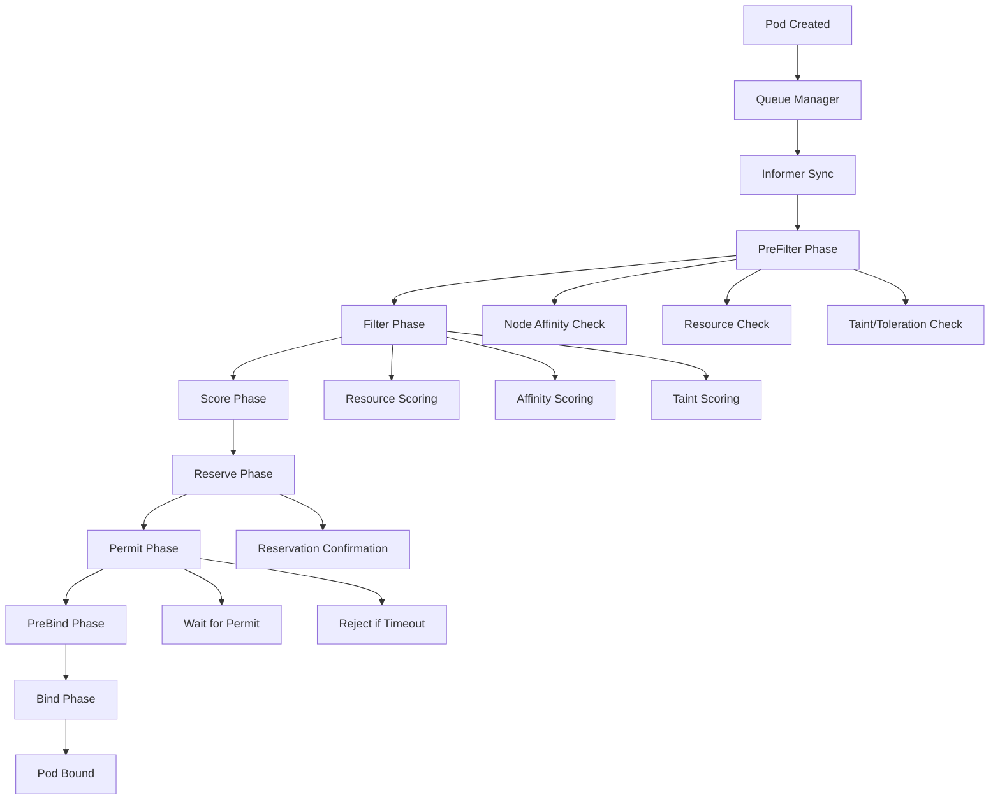

# Kubernetes 调度器深度优化与自定义调度 (Scheduler Deep Optimization and Custom Scheduling)

> **作者**: Kubernetes调度专家 | **版本**: v1.5 | **更新时间**: 2026-02-07
> **适用场景**: 高性能调度与资源优化 | **复杂度**: ⭐⭐⭐⭐⭐

## 🎯 摘要

本文档深入探讨了Kubernetes调度器的架构原理、调度算法和扩展机制，基于大规模生产环境的调度优化实践经验，提供从基础调度策略到自定义调度器开发的完整技术指南，帮助企业实现高效的资源调度和应用部署。

## 1. 调度器架构原理

### 1.1 调度器核心组件

```yaml
调度器架构组件:
  核心调度流程:
    - Informer: 监听Pod和Node事件
    - Queue: 待调度Pod队列管理
    - Scheduler Cache: 集群状态缓存
    - Framework: 调度框架扩展
    - Algorithm: 预选和优选算法
  
  调度算法:
    - PreFilter: 预过滤阶段
    - Filter: 过滤阶段
    - Score: 评分阶段
    - Reserve: 预留阶段
    - Permit: 许可阶段
    - PreBind: 预绑定阶段
    - Bind: 绑定阶段
```

### 1.2 调度流程详解



## 2. 调度策略优化

### 2.1 高性能调度器配置

```yaml
# 高性能调度器配置
apiVersion: v1
kind: ConfigMap
metadata:
  name: scheduler-config
  namespace: kube-system
data:
  scheduler-config.yaml: |
    apiVersion: kubescheduler.config.k8s.io/v1beta3
    kind: KubeSchedulerConfiguration
    leaderElection:
      leaderElect: true
      resourceName: kube-scheduler
      resourceNamespace: kube-system
    profiles:
    - schedulerName: default-scheduler
      plugins:
        queueSort:
          enabled:
          - name: PrioritySort
          disabled:
          - name: ""
        preFilter:
          enabled:
          - name: NodeResourcesFit
          - name: NodePorts
          - name: PodTopologySpread
          - name: InterPodAffinity
          - name: VolumeBinding
        filter:
          enabled:
          - name: NodeUnschedulable
          - name: NodeResourcesFit
          - name: NodePorts
          - name: NodeAffinity
          - name: VolumeRestrictions
          - name: TaintToleration
          - name: CheckVolumeBinding
          - name: InterPodAffinity
          - name: NodeVolumeLimits
          - name: EvenPodsSpread
          - name: PodTopologySpread
        score:
          enabled:
          - name: NodeResourcesBalancedAllocation
            weight: 1
          - name: ImageLocality
            weight: 1
          - name: InterPodAffinity
            weight: 2
          - name: NodeResourcesLeastAllocated
            weight: 1
          - name: NodeAffinity
            weight: 2
          - name: PodTopologySpread
            weight: 2
          - name: TaintToleration
            weight: 1
        reserve:
          enabled:
          - name: VolumeBinding
        permit:
          enabled:
          - name: DefaultBinder
        bind:
          enabled:
          - name: DefaultBinder
      pluginConfig:
      - name: NodeResourcesFit
        args:
          apiVersion: kubescheduler.config.k8s.io/v1beta3
          kind: NodeResourcesFitArgs
          ignoredResources:
          - "example.com/dummy-resource"
          scoringStrategy:
            type: LeastAllocated
            resources:
            - name: cpu
              weight: 1
            - name: memory
              weight: 1
      - name: PodTopologySpread
        args:
          apiVersion: kubescheduler.config.k8s.io/v1beta3
          kind: PodTopologySpreadArgs
          defaultConstraints:
          - maxSkew: 1
            topologyKey: topology.kubernetes.io/zone
            whenUnsatisfiable: ScheduleAnyway
          defaultingType: List
      - name: NodeResourcesBalancedAllocation
        args:
          apiVersion: kubescheduler.config.k8s.io/v1beta3
          kind: NodeResourcesBalancedAllocationArgs
          resources:
          - name: cpu
            weight: 1
          - name: memory
            weight: 1
---
apiVersion: apps/v1
kind: Deployment
metadata:
  name: kube-scheduler
  namespace: kube-system
spec:
  replicas: 2
  selector:
    matchLabels:
      component: kube-scheduler
  template:
    metadata:
      labels:
        component: kube-scheduler
    spec:
      hostNetwork: true
      priorityClassName: system-node-critical
      containers:
      - name: kube-scheduler
        image: k8s.gcr.io/kube-scheduler:v1.28.5
        command:
        - kube-scheduler
        - --config=/etc/kubernetes/scheduler-config.yaml
        - --leader-elect=true
        - --bind-address=0.0.0.0
        - --secure-port=10259
        - --profiling=false
        - --v=2
        livenessProbe:
          httpGet:
            path: /healthz
            port: 10259
            scheme: HTTPS
          initialDelaySeconds: 15
        readinessProbe:
          httpGet:
            path: /healthz
            port: 10259
            scheme: HTTPS
          initialDelaySeconds: 5
        resources:
          requests:
            cpu: 500m
            memory: 512Mi
          limits:
            cpu: 1000m
            memory: 1Gi
        volumeMounts:
        - name: scheduler-config
          mountPath: /etc/kubernetes
          readOnly: true
      volumes:
      - name: scheduler-config
        configMap:
          name: scheduler-config
      nodeSelector:
        node-role.kubernetes.io/control-plane: ""
      tolerations:
      - key: node-role.kubernetes.io/control-plane
        operator: Exists
        effect: NoSchedule
```

### 2.2 调度算法优化

```go
// 自定义调度器插件示例
package main

import (
    "context"
    "fmt"
    "math"

    v1 "k8s.io/api/core/v1"
    "k8s.io/apimachinery/pkg/runtime"
    "k8s.io/kubernetes/pkg/scheduler/framework"
)

const (
    Name = "CustomResourceOptimizer"
)

type CustomResourceOptimizer struct {
    handle framework.Handle
}

var _ framework.FilterPlugin = &CustomResourceOptimizer{}
var _ framework.ScorePlugin = &CustomResourceOptimizer{}

func (c *CustomResourceOptimizer) Name() string {
    return Name
}

// Filter方法实现资源过滤逻辑
func (c *CustomResourceOptimizer) Filter(ctx context.Context, state *framework.CycleState, pod *v1.Pod, nodeInfo *framework.NodeInfo) *framework.Status {
    // 检查节点资源是否满足Pod请求
    node := nodeInfo.Node()
    if node == nil {
        return framework.NewStatus(framework.Error, "node not found")
    }

    // 自定义资源检查逻辑
    if !c.checkCustomResources(pod, nodeInfo) {
        return framework.NewStatus(framework.Unschedulable, "insufficient custom resources")
    }

    return framework.NewStatus(framework.Success, "")
}

// Score方法实现评分逻辑
func (c *CustomResourceOptimizer) Score(ctx context.Context, state *framework.CycleState, pod *v1.Pod, nodeName string) (int64, *framework.Status) {
    nodeInfo, err := c.handle.SnapshotSharedLister().NodeInfos().Get(nodeName)
    if err != nil {
        return 0, framework.AsStatus(err)
    }

    score := c.calculateScore(pod, nodeInfo)
    return score, framework.NewStatus(framework.Success, "")
}

// ScoreExtensions返回评分扩展
func (c *CustomResourceOptimizer) ScoreExtensions() framework.ScoreExtensions {
    return c
}

// NormalizeScore标准化评分
func (c *CustomResourceOptimizer) NormalizeScore(ctx context.Context, state *framework.CycleState, pod *v1.Pod, scores framework.NodeScoreList) *framework.Status {
    var highestScore int64 = 0
    var lowestScore int64 = math.MaxInt64

    for _, nodeScore := range scores {
        if nodeScore.Score > highestScore {
            highestScore = nodeScore.Score
        }
        if nodeScore.Score < lowestScore {
            lowestScore = nodeScore.Score
        }
    }

    if highestScore == lowestScore {
        return framework.NewStatus(framework.Success, "")
    }

    for i := range scores {
        if highestScore == lowestScore {
            scores[i].Score = 0
        } else {
            scores[i].Score = ((scores[i].Score - lowestScore) * framework.MaxNodeScore) / (highestScore - lowestScore)
        }
    }

    return framework.NewStatus(framework.Success, "")
}

// 检查自定义资源
func (c *CustomResourceOptimizer) checkCustomResources(pod *v1.Pod, nodeInfo *framework.NodeInfo) bool {
    // 实现自定义资源检查逻辑
    // 例如GPU、FPGA等特殊资源
    for _, container := range pod.Spec.Containers {
        if container.Resources.Requests != nil {
            // 检查特定资源需求
            if gpuReq, ok := container.Resources.Requests["nvidia.com/gpu"]; ok {
                if nodeInfo.Allocatable.GPU <= 0 || gpuReq.Value() > nodeInfo.Allocatable.GPU {
                    return false
                }
            }
        }
    }
    return true
}

// 计算评分
func (c *CustomResourceOptimizer) calculateScore(pod *v1.Pod, nodeInfo *framework.NodeInfo) int64 {
    score := int64(0)

    // 资源分配评分
    cpuFraction := c.resourceFraction(nodeInfo.Requested.Pods, nodeInfo.Allocatable.Pods)
    memoryFraction := c.resourceFraction(nodeInfo.Requested.Memory, nodeInfo.Allocatable.Memory)
    
    // 资源均衡评分
    resourceBalance := (1 - (cpuFraction + memoryFraction) / 2) * 100
    score += int64(resourceBalance)

    // 亲和性评分
    if c.hasNodeAffinity(pod, nodeInfo.Node()) {
        score += 50
    }

    // 拓扑评分
    if c.hasPodSpreadConstraints(pod, nodeInfo) {
        score += 30
    }

    // 最终评分限制在0-100范围内
    if score < 0 {
        score = 0
    } else if score > 100 {
        score = 100
    }

    return score
}

// 计算资源分数
func (c *CustomResourceOptimizer) resourceFraction(requested, capacity int64) float64 {
    if capacity == 0 {
        return 1
    }
    return float64(requested) / float64(capacity)
}

// 检查节点亲和性
func (c *CustomResourceOptimizer) hasNodeAffinity(pod *v1.Pod, node *v1.Node) bool {
    if pod.Spec.Affinity == nil || pod.Spec.Affinity.NodeAffinity == nil {
        return true
    }
    // 实现节点亲和性检查逻辑
    return true
}

// 检查Pod分布约束
func (c *CustomResourceOptimizer) hasPodSpreadConstraints(pod *v1.Pod, nodeInfo *framework.NodeInfo) bool {
    // 实现Pod分布约束检查逻辑
    return true
}

// 插件工厂函数
func New(obj runtime.Object, handle framework.Handle) (framework.Plugin, error) {
    return &CustomResourceOptimizer{handle: handle}, nil
}
```

## 3. 高级调度策略

### 3.1 拓扑感知调度

```yaml
# 拓扑感知调度配置
apiVersion: scheduling.k8s.io/v1
kind: PodTopologySpreadConstraint
metadata:
  name: topology-aware-scheduling
spec:
  topologyKey: topology.kubernetes.io/zone
  maxSkew: 1
  whenUnsatisfiable: ScheduleAnyway
  labelSelector:
    matchLabels:
      app: distributed-app
---
# 多维度拓扑调度
apiVersion: v1
kind: Pod
metadata:
  name: topology-aware-pod
  labels:
    app: distributed-app
spec:
  topologySpreadConstraints:
  - maxSkew: 1
    topologyKey: topology.kubernetes.io/zone
    whenUnsatisfiable: DoNotSchedule
    labelSelector:
      matchLabels:
        app: distributed-app
  - maxSkew: 1
    topologyKey: kubernetes.io/hostname
    whenUnsatisfiable: ScheduleAnyway
    labelSelector:
      matchLabels:
        app: distributed-app
  containers:
  - name: app
    image: myapp:latest
    resources:
      requests:
        cpu: "1"
        memory: "2Gi"
      limits:
        cpu: "2"
        memory: "4Gi"
```

### 3.2 亲和性与反亲和性调度

```yaml
# 节点亲和性调度
apiVersion: v1
kind: Pod
metadata:
  name: node-affinity-pod
spec:
  affinity:
    nodeAffinity:
      requiredDuringSchedulingIgnoredDuringExecution:
        nodeSelectorTerms:
        - matchExpressions:
          - key: kubernetes.io/arch
            operator: In
            values:
            - amd64
          - key: node-type
            operator: In
            values:
            - high-performance
      preferredDuringSchedulingIgnoredDuringExecution:
      - weight: 10
        preference:
          matchExpressions:
          - key: node-type
            operator: In
            values:
            - gpu-node
  containers:
  - name: app
    image: myapp:latest
---
# Pod亲和性调度
apiVersion: v1
kind: Pod
metadata:
  name: pod-affinity-pod
spec:
  affinity:
    podAffinity:
      requiredDuringSchedulingIgnoredDuringExecution:
      - labelSelector:
          matchExpressions:
          - key: app
            operator: In
            values:
            - database
        topologyKey: kubernetes.io/hostname
    podAntiAffinity:
      preferredDuringSchedulingIgnoredDuringExecution:
      - weight: 100
        podAffinityTerm:
          labelSelector:
            matchLabels:
              app: database
          topologyKey: topology.kubernetes.io/zone
  containers:
  - name: app
    image: myapp:latest
```

## 4. 资源优化调度

### 4.1 资源均衡调度

```yaml
# 资源均衡调度配置
apiVersion: v1
kind: ConfigMap
metadata:
  name: balanced-scheduler-config
  namespace: kube-system
data:
  scheduler-config.yaml: |
    apiVersion: kubescheduler.config.k8s.io/v1beta3
    kind: KubeSchedulerConfiguration
    profiles:
    - schedulerName: balanced-scheduler
      plugins:
        score:
          enabled:
          - name: NodeResourcesBalancedAllocation
            weight: 2
          - name: NodeResourcesLeastAllocated
            weight: 1
          - name: ImageLocality
            weight: 1
          - name: InterPodAffinity
            weight: 1
      pluginConfig:
      - name: NodeResourcesBalancedAllocation
        args:
          apiVersion: kubescheduler.config.k8s.io/v1beta3
          kind: NodeResourcesBalancedAllocationArgs
          resources:
          - name: cpu
            weight: 1
          - name: memory
            weight: 1
          - name: nvidia.com/gpu
            weight: 2
```

### 4.2 优先级和抢占调度

```yaml
# 优先级类定义
apiVersion: scheduling.k8s.io/v1
kind: PriorityClass
metadata:
  name: high-priority
value: 1000000
globalDefault: false
description: "High priority class for critical applications"
---
apiVersion: scheduling.k8s.io/v1
kind: PriorityClass
metadata:
  name: medium-priority
value: 500000
globalDefault: false
description: "Medium priority class for regular applications"
---
apiVersion: scheduling.k8s.io/v1
kind: PriorityClass
metadata:
  name: low-priority
value: 100000
globalDefault: true
description: "Low priority class for batch jobs"
---
# 高优先级Pod配置
apiVersion: v1
kind: Pod
metadata:
  name: high-priority-pod
spec:
  priorityClassName: high-priority
  containers:
  - name: app
    image: myapp:latest
    resources:
      requests:
        cpu: "1"
        memory: "1Gi"
      limits:
        cpu: "2"
        memory: "2Gi"
  preemptionPolicy: PreemptLowerPriority
```

## 5. 自定义调度器开发

### 5.1 自定义调度器实现

```go
// 自定义调度器实现
package main

import (
    "context"
    "fmt"
    "time"

    v1 "k8s.io/api/core/v1"
    metav1 "k8s.io/apimachinery/pkg/apis/meta/v1"
    "k8s.io/apimachinery/pkg/fields"
    "k8s.io/client-go/kubernetes"
    "k8s.io/client-go/rest"
    "k8s.io/client-go/tools/cache"
    "k8s.io/client-go/tools/clientcmd"
    "k8s.io/klog/v2"
)

type CustomScheduler struct {
    clientset kubernetes.Interface
}

func NewCustomScheduler(kubeconfig string) (*CustomScheduler, error) {
    var config *rest.Config
    var err error

    if kubeconfig != "" {
        config, err = clientcmd.BuildConfigFromFlags("", kubeconfig)
    } else {
        config, err = rest.InClusterConfig()
    }

    if err != nil {
        return nil, err
    }

    clientset, err := kubernetes.NewForConfig(config)
    if err != nil {
        return nil, err
    }

    return &CustomScheduler{
        clientset: clientset,
    }, nil
}

func (cs *CustomScheduler) Run() {
    // 创建Pod监听器
    podListWatch := cache.NewListWatchFromClient(
        cs.clientset.CoreV1().RESTClient(),
        "pods",
        v1.NamespaceAll,
        fields.OneTermEqualSelector("spec.schedulerName", "custom-scheduler"),
    )

    _, controller := cache.NewInformer(
        podListWatch,
        &v1.Pod{},
        time.Second*30,
        cache.ResourceEventHandlerFuncs{
            AddFunc: cs.schedulePod,
        },
    )

    stopCh := make(chan struct{})
    go controller.Run(stopCh)

    // 等待缓存同步
    for !controller.HasSynced() {
        time.Sleep(time.Second)
    }

    <-stopCh
}

func (cs *CustomScheduler) schedulePod(obj interface{}) {
    pod := obj.(*v1.Pod)

    if pod.Spec.NodeName != "" {
        // Pod已经被调度
        return
    }

    // 实现调度逻辑
    nodeName, err := cs.selectBestNode(pod)
    if err != nil {
        klog.Errorf("Failed to select node for pod %s/%s: %v", pod.Namespace, pod.Name, err)
        return
    }

    // 绑定Pod到节点
    err = cs.bindPod(pod, nodeName)
    if err != nil {
        klog.Errorf("Failed to bind pod %s/%s to node %s: %v", pod.Namespace, pod.Name, nodeName, err)
        return
    }

    klog.Infof("Successfully scheduled pod %s/%s to node %s", pod.Namespace, pod.Name, nodeName)
}

func (cs *CustomScheduler) selectBestNode(pod *v1.Pod) (string, error) {
    // 获取所有节点
    nodeList, err := cs.clientset.CoreV1().Nodes().List(context.TODO(), metav1.ListOptions{})
    if err != nil {
        return "", err
    }

    var bestNode string
    var bestScore int64 = -1

    for _, node := range nodeList.Items {
        // 检查节点是否准备好
        if !cs.isNodeReady(&node) {
            continue
        }

        // 检查节点资源是否满足Pod需求
        if !cs.checkNodeResources(&node, pod) {
            continue
        }

        // 计算节点评分
        score := cs.calculateNodeScore(&node, pod)
        if score > bestScore {
            bestScore = score
            bestNode = node.Name
        }
    }

    if bestNode == "" {
        return "", fmt.Errorf("no suitable node found for pod %s/%s", pod.Namespace, pod.Name)
    }

    return bestNode, nil
}

func (cs *CustomScheduler) isNodeReady(node *v1.Node) bool {
    for _, condition := range node.Status.Conditions {
        if condition.Type == v1.NodeReady && condition.Status == v1.ConditionTrue {
            return true
        }
    }
    return false
}

func (cs *CustomScheduler) checkNodeResources(node *v1.Node, pod *v1.Pod) bool {
    // 检查CPU资源
    allocatableCPU := node.Status.Allocatable.Cpu().MilliValue()
    requestedCPU := int64(0)

    for _, container := range pod.Spec.Containers {
        if cpu := container.Resources.Requests.Cpu(); cpu != nil {
            requestedCPU += cpu.MilliValue()
        }
    }

    if requestedCPU > allocatableCPU {
        return false
    }

    // 检查内存资源
    allocatableMemory := node.Status.Allocatable.Memory().Value()
    requestedMemory := int64(0)

    for _, container := range pod.Spec.Containers {
        if memory := container.Resources.Requests.Memory(); memory != nil {
            requestedMemory += memory.Value()
        }
    }

    if requestedMemory > allocatableMemory {
        return false
    }

    return true
}

func (cs *CustomScheduler) calculateNodeScore(node *v1.Node, pod *v1.Pod) int64 {
    score := int64(0)

    // CPU利用率评分
    cpuAllocatable := node.Status.Allocatable.Cpu().MilliValue()
    cpuRequested := int64(0)

    // 获取节点上已有Pod的资源请求
    pods, err := cs.clientset.CoreV1().Pods("").List(context.TODO(), metav1.ListOptions{
        FieldSelector: fmt.Sprintf("spec.nodeName=%s", node.Name),
    })
    if err == nil {
        for _, pod := range pods.Items {
            for _, container := range pod.Spec.Containers {
                if cpu := container.Resources.Requests.Cpu(); cpu != nil {
                    cpuRequested += cpu.MilliValue()
                }
            }
        }
    }

    cpuUtilization := float64(cpuRequested) / float64(cpuAllocatable)
    cpuScore := int64((1 - cpuUtilization) * 50) // CPU越空闲得分越高

    // 内存利用率评分
    memoryAllocatable := node.Status.Allocatable.Memory().Value()
    memoryRequested := int64(0)

    if err == nil {
        for _, pod := range pods.Items {
            for _, container := range pod.Spec.Containers {
                if memory := container.Resources.Requests.Memory(); memory != nil {
                    memoryRequested += memory.Value()
                }
            }
        }
    }

    memoryUtilization := float64(memoryRequested) / float64(memoryAllocatable)
    memoryScore := int64((1 - memoryUtilization) * 30) // 内存越空闲得分越高

    // 亲和性评分
    affinityScore := cs.calculateAffinityScore(node, pod)

    score = cpuScore + memoryScore + affinityScore

    // 确保评分在合理范围内
    if score < 0 {
        score = 0
    } else if score > 100 {
        score = 100
    }

    return score
}

func (cs *CustomScheduler) calculateAffinityScore(node *v1.Node, pod *v1.Pod) int64 {
    score := int64(0)

    // 实现亲和性评分逻辑
    if pod.Spec.Affinity != nil {
        // 节点亲和性评分
        if nodeAffinity := pod.Spec.Affinity.NodeAffinity; nodeAffinity != nil {
            if required := nodeAffinity.RequiredDuringSchedulingIgnoredDuringExecution; required != nil {
                for _, term := range required.NodeSelectorTerms {
                    for _, expr := range term.MatchExpressions {
                        if cs.matchesNodeLabel(node, expr) {
                            score += 20
                        }
                    }
                }
            }
        }

        // Pod亲和性评分
        if podAffinity := pod.Spec.Affinity.PodAffinity; podAffinity != nil {
            for _, term := range podAffinity.RequiredDuringSchedulingIgnoredDuringExecution {
                if cs.matchesPodAffinity(node, pod, term.LabelSelector) {
                    score += 15
                }
            }
        }
    }

    return score
}

func (cs *CustomScheduler) matchesNodeLabel(node *v1.Node, expr v1.NodeSelectorRequirement) bool {
    for key, value := range node.Labels {
        if key == expr.Key {
            switch expr.Operator {
            case v1.NodeSelectorOpIn:
                for _, val := range expr.Values {
                    if val == value {
                        return true
                    }
                }
            case v1.NodeSelectorOpNotIn:
                for _, val := range expr.Values {
                    if val == value {
                        return false
                    }
                }
                return true
            }
        }
    }
    return false
}

func (cs *CustomScheduler) matchesPodAffinity(node *v1.Node, pod *v1.Pod, selector *metav1.LabelSelector) bool {
    // 实现Pod亲和性匹配逻辑
    return true
}

func (cs *CustomScheduler) bindPod(pod *v1.Pod, nodeName string) error {
    binding := &v1.Binding{
        ObjectMeta: metav1.ObjectMeta{
            Name:      pod.Name,
            Namespace: pod.Namespace,
        },
        Target: v1.ObjectReference{
            Kind: "Node",
            Name: nodeName,
        },
    }

    return cs.clientset.CoreV1().Pods(pod.Namespace).Bind(context.TODO(), binding, metav1.CreateOptions{})
}

func main() {
    scheduler, err := NewCustomScheduler("")
    if err != nil {
        klog.Fatal("Failed to create scheduler: ", err)
    }

    klog.Info("Starting custom scheduler...")
    scheduler.Run()
}
```

### 5.2 调度器扩展插件

```yaml
# 调度器扩展配置
apiVersion: v1
kind: ConfigMap
metadata:
  name: scheduler-extender-config
  namespace: kube-system
data:
  scheduler-extender.json: |
    {
      "kind": "SchedulerExtender",
      "apiVersion": "v1",
      "extenders": [
        {
          "urlPrefix": "http://scheduler-extender-service:8000",
          "filterVerb": "filter",
          "prioritizeVerb": "prioritize",
          "weight": 5,
          "bindVerb": "bind",
          "enableHttps": false,
          "nodeCacheCapable": false,
          "managedResources": [
            {
              "name": "example.com/custom-resource",
              "ignoredByScheduler": false
            }
          ],
          "ignorable": false
        }
      ],
      "predicates": [
        {"name": "GeneralPredicates"},
        {"name": "PodToleratesNodeTaints"},
        {"name": "CheckNodeUnschedulablePredicate"},
        {"name": "CheckNodeLabelPresence"},
        {"name": "CheckServiceAffinity"}
      ],
      "priorities": [
        {"name": "LeastRequestedPriority", "weight": 1},
        {"name": "BalancedResourceAllocation", "weight": 1},
        {"name": "NodePreferAvoidPodsPriority", "weight": 10000},
        {"name": "NodeAffinityPriority", "weight": 1},
        {"name": "TaintTolerationPriority", "weight": 1},
        {"name": "ImageLocalityPriority", "weight": 1}
      ]
    }
```

## 6. 监控与性能分析

### 6.1 调度性能监控

```yaml
# 调度器监控配置
apiVersion: monitoring.coreos.com/v1
kind: ServiceMonitor
metadata:
  name: kube-scheduler-monitor
  namespace: monitoring
spec:
  selector:
    matchLabels:
      component: kube-scheduler
  endpoints:
  - port: https
    path: /metrics
    scheme: https
    interval: 30s
    tlsConfig:
      caFile: /var/run/secrets/kubernetes.io/serviceaccount/ca.crt
      insecureSkipVerify: true
    bearerTokenFile: /var/run/secrets/kubernetes.io/serviceaccount/token
    metricRelabelings:
    - sourceLabels: [__name__]
      regex: 'scheduler_(.*)'
      targetLabel: __name__
    - sourceLabels: [__name__]
      regex: 'workqueue_(.*)'
      targetLabel: __name__
    - sourceLabels: [__name__]
      regex: 'rest_client_(.*)'
      targetLabel: __name__
```

### 6.2 调度性能指标

```prometheus
# 调度器关键性能指标
# 调度延迟
histogram_quantile(0.99, rate(scheduler_e2e_scheduling_duration_seconds_bucket[5m])) > 5
histogram_quantile(0.95, rate(scheduler_e2e_scheduling_duration_seconds_bucket[5m])) > 2

# 队列积压
scheduler_pending_pods > 100
scheduler_queue_incoming_pods_rate > 50

# 调度过滤失败
increase(scheduler_framework_extension_point_duration_seconds_count{extension_point="Filter",result="Error"}[5m]) > 0

# 调度评分分布
histogram_quantile(0.95, rate(scheduler_node_score_duration_seconds_bucket[5m])) > 0.1

# 节点缓存同步
increase(scheduler_cache_adds_total[5m]) > 1000
increase(scheduler_cache_updates_total[5m]) > 500

# 绑定性能
histogram_quantile(0.99, rate(scheduler_binding_duration_seconds_bucket[5m])) > 1
```

### 6.3 调度分析工具

```bash
#!/bin/bash
# scheduler-performance-analyzer.sh

# 调度器性能分析脚本
echo "=== 调度器性能分析 ==="

# 1. 检查调度器状态
echo "1. 检查调度器状态:"
kubectl get pods -n kube-system -l component=kube-scheduler

# 2. 获取调度器指标
echo "2. 获取调度器指标:"
kubectl get --raw /metrics | grep scheduler | head -20

# 3. 分析调度延迟
echo "3. 分析调度延迟:"
kubectl get --raw /metrics | grep "scheduler_e2e_scheduling_duration_seconds_bucket" | sort

# 4. 检查队列状态
echo "4. 检查队列状态:"
kubectl get --raw /metrics | grep "scheduler_pending_pods"

# 5. 分析调度失败原因
echo "5. 分析调度失败原因:"
kubectl get --raw /metrics | grep "scheduler_framework_extension_point_duration_seconds_count" | grep "Error"

# 6. 检查节点缓存状态
echo "6. 检查节点缓存状态:"
kubectl get --raw /metrics | grep "scheduler_cache_"

# 7. 生成调度性能报告
echo "7. 生成调度性能报告:"
cat << EOF > /tmp/scheduler-performance-report.txt
Scheduler Performance Report - $(date)
====================================

Scheduling Latency (99th percentile): $(kubectl get --raw /metrics | grep 'scheduler_e2e_scheduling_duration_seconds_bucket' | grep 'le="+Inf"}' | cut -d' ' -f2)

Pending Pods: $(kubectl get --raw /metrics | grep 'scheduler_pending_pods ' | cut -d' ' -f2)

Filter Error Count (last 5m): $(kubectl get --raw /metrics | grep 'scheduler_framework_extension_point_duration_seconds_count{extension_point="Filter",result="Error"}' | cut -d' ' -f2)

Cache Adds (last 5m): $(kubectl get --raw /metrics | grep 'scheduler_cache_adds_total' | cut -d' ' -f2)

Binding Duration (99th percentile): $(kubectl get --raw /metrics | grep 'scheduler_binding_duration_seconds_bucket' | grep 'le="+Inf"}' | cut -d' ' -f2)

EOF

echo "调度性能报告已生成: /tmp/scheduler-performance-report.txt"

# 8. 调度事件分析
echo "8. 调度相关事件分析:"
kubectl get events --all-namespaces --field-selector involvedObject.kind=Pod -o json | \
    jq -r '.items[] | select(.reason == "Scheduled") | "\(.firstTimestamp) \(.involvedObject.namespace)/\(.involvedObject.name) \(.message)"' | \
    tail -20
```

## 7. 最佳实践与优化策略

### 7.1 调度优化原则

```markdown
## ⚡ 调度优化原则

### 1. 资源规划
- 合理设置资源请求和限制
- 使用垂直Pod自动扩缩容(VPA)
- 实施资源配额管理

### 2. 调度策略
- 启用Pod拓扑分布约束
- 配置节点亲和性和反亲和性
- 使用优先级和抢占机制

### 3. 性能调优
- 优化调度器配置参数
- 调整调度器并发度
- 启用调度器缓存优化

### 4. 监控告警
- 建立调度延迟监控
- 设置队列积压告警
- 监控调度失败率
```

### 7.2 实施检查清单

```yaml
调度优化实施清单:
  资源配置:
    ☐ 设置合理的资源请求/限制
    ☐ 启用VPA推荐器
    ☐ 配置资源配额
    ☐ 实施QoS等级
  
  调度策略:
    ☐ 配置Pod拓扑分布约束
    ☐ 设置节点亲和性规则
    ☐ 定义优先级类
    ☐ 启用抢占策略
  
  性能优化:
    ☐ 调度器参数调优
    ☐ 并发度配置优化
    ☐ 缓存策略调整
    ☐ 调度算法优化
  
  监控告警:
    ☐ 调度延迟监控
    ☐ 队列状态监控
    ☐ 调度失败告警
    ☐ 节点资源监控
```

## 8. 未来发展趋势

### 8.1 智能调度

```yaml
智能调度发展趋势:
  1. AI驱动的调度优化
     - 机器学习资源预测
     - 智能调度策略
     - 自适应调度算法
  
  2. 多维度资源调度
     - GPU/FPGA等异构资源
     - 网络带宽资源
     - 存储性能资源
  
  3. 混合云调度
     - 跨云资源调度
     - 边缘计算调度
     - 混合部署优化
```

---
*本文档基于企业级调度优化实践经验编写，持续更新最新技术和最佳实践。*