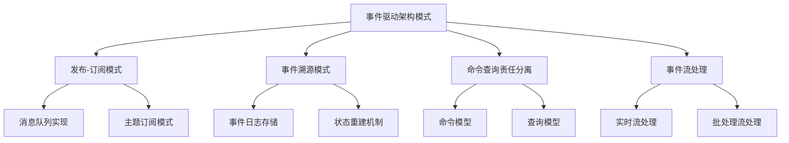

# Kubernetes 事件驱动架构与异步处理 (Event-Driven Architecture and Asynchronous Processing)

> **作者**: 云原生架构专家 | **版本**: v1.3 | **更新时间**: 2026-02-07
> **适用场景**: 微服务事件驱动架构 | **复杂度**: ⭐⭐⭐⭐⭐

## 🎯 摘要

本文档深入探讨了Kubernetes环境下事件驱动架构的设计模式、实现技术和最佳实践，基于大规模微服务架构的实际案例，提供从事件建模到异步处理的完整技术指南，帮助企业构建高弹性、低耦合的现代化应用架构。

## 1. 事件驱动架构基础

### 1.1 核心概念与模式

```yaml
事件驱动架构核心组件:
  事件源 (Event Source):
    - 产生业务事件的组件
    - 负责事件的创建和发布
    - 保证事件的可靠性和一致性
  
  事件总线 (Event Bus):
    - 事件传输的中间件
    - 提供事件路由和分发
    - 支持多种传输协议
  
  事件处理器 (Event Handler):
    - 消费和处理事件的组件
    - 实现业务逻辑处理
    - 支持异步和同步处理
  
  事件存储 (Event Store):
    - 持久化事件数据
    - 支持事件回溯和重放
    - 提供事件查询能力
```

### 1.2 架构模式分类



## 2. Kubernetes事件系统

### 2.1 内置事件机制

```yaml
# Kubernetes事件配置
apiVersion: v1
kind: Event
metadata:
  name: pod-scheduled-event
  namespace: default
involvedObject:
  kind: Pod
  name: my-app-pod
  namespace: default
reason: Scheduled
message: "Successfully assigned default/my-app-pod to node-1"
source:
  component: default-scheduler
firstTimestamp: "2024-01-15T10:00:00Z"
lastTimestamp: "2024-01-15T10:00:00Z"
count: 1
type: Normal
---
# 事件监听器配置
apiVersion: v1
kind: Pod
metadata:
  name: event-listener
  namespace: monitoring
spec:
  containers:
  - name: event-listener
    image: event-listener:latest
    command:
    - /event-listener
    - --watch-events
    - --namespace=default
    - --event-types=Pod,Scheduled,Failed
    env:
    - name: EVENT_WEBHOOK_URL
      value: "https://webhook.example.com/events"
    resources:
      requests:
        memory: "64Mi"
        cpu: "100m"
      limits:
        memory: "128Mi"
        cpu: "200m"
```

### 2.2 自定义事件处理

```go
// Kubernetes事件处理器实现
package main

import (
    "context"
    "encoding/json"
    "fmt"
    "log"
    "net/http"
    "time"

    corev1 "k8s.io/api/core/v1"
    metav1 "k8s.io/apimachinery/pkg/apis/meta/v1"
    "k8s.io/apimachinery/pkg/runtime"
    "k8s.io/apimachinery/pkg/watch"
    "k8s.io/client-go/kubernetes"
    "k8s.io/client-go/rest"
    "k8s.io/client-go/tools/cache"
    "k8s.io/client-go/tools/clientcmd"
)

type EventProcessor struct {
    clientset kubernetes.Interface
    webhookURL string
}

func NewEventProcessor(kubeconfig, webhookURL string) (*EventProcessor, error) {
    var config *rest.Config
    var err error

    if kubeconfig != "" {
        config, err = clientcmd.BuildConfigFromFlags("", kubeconfig)
    } else {
        config, err = rest.InClusterConfig()
    }

    if err != nil {
        return nil, err
    }

    clientset, err := kubernetes.NewForConfig(config)
    if err != nil {
        return nil, err
    }

    return &EventProcessor{
        clientset: clientset,
        webhookURL: webhookURL,
    }, nil
}

func (ep *EventProcessor) StartEventProcessing() {
    // 监听Pod事件
    ep.watchPodEvents()
    
    // 监听Deployment事件
    ep.watchDeploymentEvents()
    
    // 监听Service事件
    ep.watchServiceEvents()
}

func (ep *EventProcessor) watchPodEvents() {
    listWatch := &cache.ListWatch{
        ListFunc: func(options metav1.ListOptions) (runtime.Object, error) {
            return ep.clientset.CoreV1().Events("").List(context.TODO(), options)
        },
        WatchFunc: func(options metav1.ListOptions) (watch.Interface, error) {
            return ep.clientset.CoreV1().Events("").Watch(context.TODO(), options)
        },
    }

    _, controller := cache.NewInformer(
        listWatch,
        &corev1.Event{},
        time.Second*30,
        cache.ResourceEventHandlerFuncs{
            AddFunc: func(obj interface{}) {
                ep.handleEvent(obj.(*corev1.Event))
            },
            UpdateFunc: func(oldObj, newObj interface{}) {
                ep.handleEvent(newObj.(*corev1.Event))
            },
        },
    )

    stopCh := make(chan struct{})
    go controller.Run(stopCh)
    <-stopCh
}

func (ep *EventProcessor) handleEvent(event *corev1.Event) {
    // 过滤事件类型
    if !ep.shouldProcessEvent(event) {
        return
    }

    // 处理事件
    processedEvent := ep.processEvent(event)
    
    // 发送到Webhook
    ep.sendToWebhook(processedEvent)
    
    // 记录处理日志
    log.Printf("Processed event: %s/%s - %s", 
        event.InvolvedObject.Namespace, 
        event.InvolvedObject.Name, 
        event.Reason)
}

func (ep *EventProcessor) shouldProcessEvent(event *corev1.Event) bool {
    // 定义需要处理的事件类型
    importantReasons := map[string]bool{
        "Scheduled": true,
        "Failed": true,
        "Killing": true,
        "BackOff": true,
        "Unhealthy": true,
        "Created": true,
        "Started": true,
    }

    return importantReasons[event.Reason]
}

func (ep *EventProcessor) processEvent(event *corev1.Event) map[string]interface{} {
    return map[string]interface{}{
        "timestamp": event.FirstTimestamp.Time,
        "namespace": event.InvolvedObject.Namespace,
        "object": map[string]interface{}{
            "kind": event.InvolvedObject.Kind,
            "name": event.InvolvedObject.Name,
            "uid":  string(event.InvolvedObject.UID),
        },
        "reason":   event.Reason,
        "message":  event.Message,
        "source": map[string]interface{}{
            "component": event.Source.Component,
            "host":      event.Source.Host,
        },
        "count":    event.Count,
        "type":     event.Type,
        "metadata": event.ObjectMeta,
    }
}

func (ep *EventProcessor) sendToWebhook(eventData map[string]interface{}) {
    if ep.webhookURL == "" {
        return
    }

    jsonData, err := json.Marshal(eventData)
    if err != nil {
        log.Printf("Error marshaling event data: %v", err)
        return
    }

    resp, err := http.Post(ep.webhookURL, "application/json", bytes.NewBuffer(jsonData))
    if err != nil {
        log.Printf("Error sending webhook: %v", err)
        return
    }
    defer resp.Body.Close()

    if resp.StatusCode != http.StatusOK {
        log.Printf("Webhook returned status: %d", resp.StatusCode)
    }
}

func main() {
    webhookURL := os.Getenv("EVENT_WEBHOOK_URL")
    if webhookURL == "" {
        log.Fatal("EVENT_WEBHOOK_URL environment variable is required")
    }

    processor, err := NewEventProcessor("", webhookURL)
    if err != nil {
        log.Fatal("Failed to create event processor:", err)
    }

    log.Println("Starting Kubernetes event processor...")
    processor.StartEventProcessing()
}
```

## 3. 消息队列集成

### 3.1 Kafka集成方案

```yaml
# Kafka Operator部署
apiVersion: v1
kind: Namespace
metadata:
  name: kafka-system
---
apiVersion: kafka.strimzi.io/v1beta2
kind: Kafka
metadata:
  name: event-bus-cluster
  namespace: kafka-system
spec:
  kafka:
    version: 3.4.0
    replicas: 3
    listeners:
    - name: plain
      port: 9092
      type: internal
      tls: false
    - name: tls
      port: 9093
      type: internal
      tls: true
    - name: external
      port: 9094
      type: loadbalancer
      tls: true
    config:
      offsets.topic.replication.factor: 3
      transaction.state.log.replication.factor: 3
      transaction.state.log.min.isr: 2
      default.replication.factor: 3
      min.insync.replicas: 2
      inter.broker.protocol.version: "3.4"
    storage:
      type: jbod
      volumes:
      - id: 0
        type: persistent-claim
        size: 100Gi
        deleteClaim: false
  zookeeper:
    replicas: 3
    storage:
      type: persistent-claim
      size: 100Gi
      deleteClaim: false
  entityOperator:
    topicOperator: {}
    userOperator: {}
---
# Kafka主题配置
apiVersion: kafka.strimzi.io/v1beta2
kind: KafkaTopic
metadata:
  name: pod-events
  namespace: kafka-system
  labels:
    strimzi.io/cluster: event-bus-cluster
spec:
  partitions: 6
  replicas: 3
  config:
    retention.ms: 604800000  # 7天
    segment.bytes: 1073741824  # 1GB
---
apiVersion: kafka.strimzi.io/v1beta2
kind: KafkaTopic
metadata:
  name: deployment-events
  namespace: kafka-system
  labels:
    strimzi.io/cluster: event-bus-cluster
spec:
  partitions: 3
  replicas: 3
  config:
    retention.ms: 2592000000  # 30天
    segment.bytes: 1073741824
```

### 3.2 事件生产者实现

```go
// Kubernetes事件生产者
package main

import (
    "context"
    "encoding/json"
    "fmt"
    "log"
    "time"

    "github.com/segmentio/kafka-go"
    corev1 "k8s.io/api/core/v1"
    metav1 "k8s.io/apimachinery/pkg/apis/meta/v1"
    "k8s.io/apimachinery/pkg/runtime"
    "k8s.io/apimachinery/pkg/watch"
    "k8s.io/client-go/kubernetes"
    "k8s.io/client-go/rest"
    "k8s.io/client-go/tools/cache"
)

type KafkaEventProducer struct {
    clientset kubernetes.Interface
    kafkaWriter *kafka.Writer
    topic string
}

func NewKafkaEventProducer(kafkaBrokers []string, topic string) (*KafkaEventProducer, error) {
    // 创建Kubernetes客户端
    config, err := rest.InClusterConfig()
    if err != nil {
        return nil, err
    }

    clientset, err := kubernetes.NewForConfig(config)
    if err != nil {
        return nil, err
    }

    // 创建Kafka写入器
    writer := &kafka.Writer{
        Addr:     kafka.TCP(kafkaBrokers...),
        Topic:    topic,
        Balancer: &kafka.LeastBytes{},
        BatchTimeout: 10 * time.Millisecond,
        BatchSize: 100,
    }

    return &KafkaEventProducer{
        clientset: clientset,
        kafkaWriter: writer,
        topic: topic,
    }, nil
}

func (kep *KafkaEventProducer) StartProducing() {
    // 监听不同类型的事件
    kep.watchPodEvents()
    kep.watchDeploymentEvents()
    kep.watchServiceEvents()
}

func (kep *KafkaEventProducer) watchPodEvents() {
    listWatch := &cache.ListWatch{
        ListFunc: func(options metav1.ListOptions) (runtime.Object, error) {
            return kep.clientset.CoreV1().Events("").List(context.TODO(), options)
        },
        WatchFunc: func(options metav1.ListOptions) (watch.Interface, error) {
            return kep.clientset.CoreV1().Events("").Watch(context.TODO(), options)
        },
    }

    _, controller := cache.NewInformer(
        listWatch,
        &corev1.Event{},
        time.Second*30,
        cache.ResourceEventHandlerFuncs{
            AddFunc: func(obj interface{}) {
                kep.produceEvent("pod", obj.(*corev1.Event))
            },
            UpdateFunc: func(oldObj, newObj interface{}) {
                kep.produceEvent("pod", newObj.(*corev1.Event))
            },
        },
    )

    stopCh := make(chan struct{})
    go controller.Run(stopCh)
    <-stopCh
}

func (kep *KafkaEventProducer) produceEvent(eventType string, event *corev1.Event) {
    // 构建事件消息
    eventMessage := map[string]interface{}{
        "eventType": eventType,
        "timestamp": time.Now().Unix(),
        "kubernetes": map[string]interface{}{
            "namespace": event.InvolvedObject.Namespace,
            "object": map[string]interface{}{
                "kind": event.InvolvedObject.Kind,
                "name": event.InvolvedObject.Name,
                "uid":  string(event.InvolvedObject.UID),
            },
            "reason":  event.Reason,
            "message": event.Message,
            "source": map[string]interface{}{
                "component": event.Source.Component,
                "host":      event.Source.Host,
            },
            "count": event.Count,
            "type":  event.Type,
        },
    }

    // 序列化消息
    messageBytes, err := json.Marshal(eventMessage)
    if err != nil {
        log.Printf("Error marshaling event: %v", err)
        return
    }

    // 发送到Kafka
    err = kep.kafkaWriter.WriteMessages(context.Background(),
        kafka.Message{
            Key:   []byte(fmt.Sprintf("%s-%s", event.InvolvedObject.Kind, event.InvolvedObject.Name)),
            Value: messageBytes,
        },
    )

    if err != nil {
        log.Printf("Error writing to Kafka: %v", err)
        return
    }

    log.Printf("Event produced to Kafka: %s/%s - %s", 
        event.InvolvedObject.Namespace, 
        event.InvolvedObject.Name, 
        event.Reason)
}

func (kep *KafkaEventProducer) Close() {
    if kep.kafkaWriter != nil {
        kep.kafkaWriter.Close()
    }
}

func main() {
    kafkaBrokers := []string{"kafka-cluster-kafka-bootstrap.kafka-system:9092"}
    topic := "kubernetes-events"

    producer, err := NewKafkaEventProducer(kafkaBrokers, topic)
    if err != nil {
        log.Fatal("Failed to create Kafka producer:", err)
    }
    defer producer.Close()

    log.Println("Starting Kafka event producer...")
    producer.StartProducing()
}
```

## 4. 事件处理与消费

### 4.1 事件消费者实现

```go
// Kubernetes事件消费者
package main

import (
    "context"
    "encoding/json"
    "fmt"
    "log"
    "time"

    "github.com/segmentio/kafka-go"
    "k8s.io/client-go/kubernetes"
    "k8s.io/client-go/rest"
)

type EventConsumer struct {
    clientset kubernetes.Interface
    kafkaReader *kafka.Reader
    topic string
}

type KubernetesEvent struct {
    EventType   string `json:"eventType"`
    Timestamp   int64  `json:"timestamp"`
    Kubernetes  struct {
        Namespace string `json:"namespace"`
        Object    struct {
            Kind string `json:"kind"`
            Name string `json:"name"`
            UID  string `json:"uid"`
        } `json:"object"`
        Reason  string `json:"reason"`
        Message string `json:"message"`
        Source  struct {
            Component string `json:"component"`
            Host      string `json:"host"`
        } `json:"source"`
        Count int    `json:"count"`
        Type  string `json:"type"`
    } `json:"kubernetes"`
}

func NewEventConsumer(kafkaBrokers []string, topic, groupID string) (*EventConsumer, error) {
    // 创建Kubernetes客户端
    config, err := rest.InClusterConfig()
    if err != nil {
        return nil, err
    }

    clientset, err := kubernetes.NewForConfig(config)
    if err != nil {
        return nil, err
    }

    // 创建Kafka读取器
    reader := kafka.NewReader(kafka.ReaderConfig{
        Brokers:   kafkaBrokers,
        Topic:     topic,
        GroupID:   groupID,
        MinBytes:  10e3,  // 10KB
        MaxBytes:  10e6,  // 10MB
        MaxWait:   time.Second,
    })

    return &EventConsumer{
        clientset:   clientset,
        kafkaReader: reader,
        topic:       topic,
    }, nil
}

func (ec *EventConsumer) StartConsuming() {
    ctx := context.Background()
    
    for {
        msg, err := ec.kafkaReader.ReadMessage(ctx)
        if err != nil {
            log.Printf("Error reading message: %v", err)
            continue
        }

        // 处理事件消息
        if err := ec.processEventMessage(msg.Value); err != nil {
            log.Printf("Error processing event: %v", err)
            continue
        }

        log.Printf("Processed event from partition %d at offset %d", msg.Partition, msg.Offset)
    }
}

func (ec *EventConsumer) processEventMessage(message []byte) error {
    var event KubernetesEvent
    if err := json.Unmarshal(message, &event); err != nil {
        return fmt.Errorf("failed to unmarshal event: %w", err)
    }

    // 根据事件类型执行不同的处理逻辑
    switch event.Kubernetes.Reason {
    case "Scheduled":
        return ec.handlePodScheduled(event)
    case "Failed":
        return ec.handlePodFailed(event)
    case "Created":
        return ec.handleResourceCreated(event)
    case "Deleted":
        return ec.handleResourceDeleted(event)
    default:
        return ec.handleGenericEvent(event)
    }
}

func (ec *EventConsumer) handlePodScheduled(event KubernetesEvent) error {
    log.Printf("Pod scheduled: %s/%s", event.Kubernetes.Namespace, event.Kubernetes.Object.Name)
    
    // 可以在这里实现自定义逻辑，如：
    // - 发送通知
    // - 更新监控指标
    // - 触发其他自动化流程
    
    return nil
}

func (ec *EventConsumer) handlePodFailed(event KubernetesEvent) error {
    log.Printf("Pod failed: %s/%s - %s", 
        event.Kubernetes.Namespace, 
        event.Kubernetes.Object.Name, 
        event.Kubernetes.Message)
    
    // 实现故障处理逻辑
    // - 发送告警通知
    // - 自动重启Pod
    // - 记录故障日志
    
    return nil
}

func (ec *EventConsumer) handleResourceCreated(event KubernetesEvent) error {
    log.Printf("Resource created: %s/%s/%s", 
        event.Kubernetes.Object.Kind,
        event.Kubernetes.Namespace, 
        event.Kubernetes.Object.Name)
    
    // 实现资源创建后的处理逻辑
    return nil
}

func (ec *EventConsumer) handleResourceDeleted(event KubernetesEvent) error {
    log.Printf("Resource deleted: %s/%s/%s", 
        event.Kubernetes.Object.Kind,
        event.Kubernetes.Namespace, 
        event.Kubernetes.Object.Name)
    
    // 实现资源删除后的清理逻辑
    return nil
}

func (ec *EventConsumer) handleGenericEvent(event KubernetesEvent) error {
    log.Printf("Generic event: %s - %s/%s/%s", 
        event.Kubernetes.Reason,
        event.Kubernetes.Object.Kind,
        event.Kubernetes.Namespace, 
        event.Kubernetes.Object.Name)
    
    return nil
}

func (ec *EventConsumer) Close() {
    if ec.kafkaReader != nil {
        ec.kafkaReader.Close()
    }
}

func main() {
    kafkaBrokers := []string{"kafka-cluster-kafka-bootstrap.kafka-system:9092"}
    topic := "kubernetes-events"
    groupID := "kubernetes-event-processor"

    consumer, err := NewEventConsumer(kafkaBrokers, topic, groupID)
    if err != nil {
        log.Fatal("Failed to create event consumer:", err)
    }
    defer consumer.Close()

    log.Println("Starting event consumer...")
    consumer.StartConsuming()
}
```

### 4.2 事件驱动的自动化流程

```yaml
# 事件驱动的自动化工作流
apiVersion: argoproj.io/v1alpha1
kind: Workflow
metadata:
  name: event-driven-deployment-workflow
  namespace: automation
spec:
  entrypoint: event-handler
  templates:
  - name: event-handler
    steps:
    - - name: process-event
        template: process-kubernetes-event
    - - name: trigger-actions
        template: trigger-automated-actions
        when: "{{steps.process-event.outputs.result}} == true"
  
  - name: process-kubernetes-event
    inputs:
      parameters:
      - name: event-data
    script:
      image: python:3.9
      command: [python]
      source: |
        import json
        import sys
        
        event_data = json.loads('{{inputs.parameters.event-data}}')
        
        # 分析事件类型和内容
        event_type = event_data.get('kubernetes', {}).get('reason')
        namespace = event_data.get('kubernetes', {}).get('namespace')
        object_name = event_data.get('kubernetes', {}).get('object', {}).get('name')
        
        print(f"Processing {event_type} event for {namespace}/{object_name}")
        
        # 根据事件类型决定是否触发自动化
        automation_triggers = {
            'Failed': True,
            'BackOff': True,
            'Unhealthy': True,
            'Scheduled': False
        }
        
        should_trigger = automation_triggers.get(event_type, False)
        print(f"Should trigger automation: {should_trigger}")
        
        # 输出结果供后续步骤使用
        result = {
            'should_trigger': should_trigger,
            'event_info': {
                'type': event_type,
                'namespace': namespace,
                'object': object_name
            }
        }
        
        print(json.dumps(result))
  
  - name: trigger-automated-actions
    inputs:
      parameters:
      - name: event-info
    steps:
    - - name: send-alert
        template: send-slack-alert
        arguments:
          parameters:
          - name: message
            value: "Critical event detected: {{inputs.parameters.event-info}}"
    - - name: auto-recovery
        template: auto-recovery-workflow
        arguments:
          parameters:
          - name: namespace
            value: "{{inputs.parameters.event-info.namespace}}"
          - name: object-name
            value: "{{inputs.parameters.event-info.object}}"
---
# Slack通知模板
apiVersion: batch/v1
kind: Job
metadata:
  name: slack-notifier
  namespace: automation
spec:
  template:
    spec:
      containers:
      - name: notifier
        image: curlimages/curl:latest
        command:
        - sh
        - -c
        - |
          curl -X POST -H 'Content-type: application/json' \
          --data '{
            "text": "🚨 Kubernetes Event Alert\nNamespace: $NAMESPACE\nObject: $OBJECT_NAME\nEvent: $EVENT_REASON\nMessage: $EVENT_MESSAGE",
            "channel": "#kubernetes-alerts",
            "username": "Kubernetes Bot"
          }' $SLACK_WEBHOOK_URL
        env:
        - name: SLACK_WEBHOOK_URL
          valueFrom:
            secretKeyRef:
              name: slack-webhook
              key: webhook-url
        - name: NAMESPACE
          value: "{{workflow.parameters.namespace}}"
        - name: OBJECT_NAME
          value: "{{workflow.parameters.object-name}}"
        - name: EVENT_REASON
          value: "{{workflow.parameters.event-reason}}"
        - name: EVENT_MESSAGE
          value: "{{workflow.parameters.event-message}}"
      restartPolicy: Never
```

## 5. 事件溯源与CQRS

### 5.1 事件存储设计

```yaml
# 事件存储配置
apiVersion: apps/v1
kind: StatefulSet
metadata:
  name: event-store
  namespace: event-driven
spec:
  serviceName: event-store
  replicas: 3
  selector:
    matchLabels:
      app: event-store
  template:
    metadata:
      labels:
        app: event-store
    spec:
      containers:
      - name: event-store
        image: eventstore/eventstore:21.10.2-buster-slim
        ports:
        - containerPort: 1113
          name: tcp
        - containerPort: 2113
          name: http
        env:
        - name: EVENTSTORE_CLUSTER_SIZE
          value: "3"
        - name: EVENTSTORE_RUN_PROJECTIONS
          value: "All"
        - name: EVENTSTORE_START_STANDARD_PROJECTIONS
          value: "true"
        - name: EVENTSTORE_EXT_TCP_PORT
          value: "1113"
        - name: EVENTSTORE_HTTP_PORT
          value: "2113"
        - name: EVENTSTORE_EXT_HTTP_PORT
          value: "2113"
        - name: EVENTSTORE_INT_TCP_PORT
          value: "1112"
        - name: EVENTSTORE_INT_HTTP_PORT
          value: "2112"
        volumeMounts:
        - name: eventstore-data
          mountPath: /var/lib/eventstore
  volumeClaimTemplates:
  - metadata:
      name: eventstore-data
    spec:
      accessModes: [ "ReadWriteOnce" ]
      storageClassName: fast-ssd
      resources:
        requests:
          storage: 100Gi
---
# 事件模式定义
apiVersion: v1
kind: ConfigMap
metadata:
  name: event-schemas
  namespace: event-driven
data:
  pod-event-schema.json: |
    {
      "type": "object",
      "properties": {
        "eventId": {"type": "string"},
        "eventType": {"type": "string"},
        "timestamp": {"type": "string", "format": "date-time"},
        "version": {"type": "string"},
        "data": {
          "type": "object",
          "properties": {
            "namespace": {"type": "string"},
            "podName": {"type": "string"},
            "reason": {"type": "string"},
            "message": {"type": "string"},
            "source": {
              "type": "object",
              "properties": {
                "component": {"type": "string"},
                "host": {"type": "string"}
              }
            }
          },
          "required": ["namespace", "podName", "reason"]
        }
      },
      "required": ["eventId", "eventType", "timestamp", "data"]
    }
```

### 5.2 CQRS查询模型

```go
// CQRS查询处理器
package main

import (
    "database/sql"
    "encoding/json"
    "fmt"
    "log"
    "net/http"
    "time"

    _ "github.com/lib/pq"
    "github.com/gorilla/mux"
)

type QueryHandler struct {
    db *sql.DB
}

type PodEventView struct {
    ID        string    `json:"id"`
    Namespace string    `json:"namespace"`
    PodName   string    `json:"podName"`
    Reason    string    `json:"reason"`
    Message   string    `json:"message"`
    Timestamp time.Time `json:"timestamp"`
    Status    string    `json:"status"`
}

func NewQueryHandler(connectionString string) (*QueryHandler, error) {
    db, err := sql.Open("postgres", connectionString)
    if err != nil {
        return nil, err
    }

    if err := db.Ping(); err != nil {
        return nil, err
    }

    return &QueryHandler{db: db}, nil
}

func (qh *QueryHandler) InitializeSchema() error {
    schema := `
    CREATE TABLE IF NOT EXISTS pod_events_view (
        id UUID PRIMARY KEY,
        namespace VARCHAR(255) NOT NULL,
        pod_name VARCHAR(255) NOT NULL,
        reason VARCHAR(100) NOT NULL,
        message TEXT,
        event_timestamp TIMESTAMP NOT NULL,
        status VARCHAR(50) NOT NULL,
        created_at TIMESTAMP DEFAULT CURRENT_TIMESTAMP
    );

    CREATE INDEX IF NOT EXISTS idx_pod_events_namespace ON pod_events_view(namespace);
    CREATE INDEX IF NOT EXISTS idx_pod_events_timestamp ON pod_events_view(event_timestamp);
    CREATE INDEX IF NOT EXISTS idx_pod_events_status ON pod_events_view(status);
    `

    _, err := qh.db.Exec(schema)
    return err
}

func (qh *QueryHandler) HandleEvent(eventData map[string]interface{}) error {
    query := `
    INSERT INTO pod_events_view (id, namespace, pod_name, reason, message, event_timestamp, status)
    VALUES ($1, $2, $3, $4, $5, $6, $7)
    ON CONFLICT (id) DO UPDATE SET
        reason = EXCLUDED.reason,
        message = EXCLUDED.message,
        status = EXCLUDED.status
    `

    id := eventData["eventId"].(string)
    data := eventData["data"].(map[string]interface{})
    
    _, err := qh.db.Exec(query,
        id,
        data["namespace"],
        data["podName"],
        data["reason"],
        data["message"],
        eventData["timestamp"],
        determineStatus(data["reason"].(string)),
    )

    return err
}

func determineStatus(reason string) string {
    criticalReasons := map[string]bool{
        "Failed":    true,
        "BackOff":   true,
        "Unhealthy": true,
        "OOMKilled": true,
    }

    if criticalReasons[reason] {
        return "CRITICAL"
    }
    return "NORMAL"
}

// HTTP查询接口
func (qh *QueryHandler) RegisterRoutes(router *mux.Router) {
    router.HandleFunc("/api/v1/pod-events", qh.getPodEvents).Methods("GET")
    router.HandleFunc("/api/v1/pod-events/{namespace}", qh.getPodEventsByNamespace).Methods("GET")
    router.HandleFunc("/api/v1/pod-events/status/{status}", qh.getPodEventsByStatus).Methods("GET")
}

func (qh *QueryHandler) getPodEvents(w http.ResponseWriter, r *http.Request) {
    rows, err := qh.db.Query("SELECT id, namespace, pod_name, reason, message, event_timestamp, status FROM pod_events_view ORDER BY event_timestamp DESC LIMIT 100")
    if err != nil {
        http.Error(w, err.Error(), http.StatusInternalServerError)
        return
    }
    defer rows.Close()

    var events []PodEventView
    for rows.Next() {
        var event PodEventView
        if err := rows.Scan(&event.ID, &event.Namespace, &event.PodName, &event.Reason, &event.Message, &event.Timestamp, &event.Status); err != nil {
            http.Error(w, err.Error(), http.StatusInternalServerError)
            return
        }
        events = append(events, event)
    }

    w.Header().Set("Content-Type", "application/json")
    json.NewEncoder(w).Encode(events)
}

func (qh *QueryHandler) getPodEventsByNamespace(w http.ResponseWriter, r *http.Request) {
    vars := mux.Vars(r)
    namespace := vars["namespace"]

    rows, err := qh.db.Query("SELECT id, namespace, pod_name, reason, message, event_timestamp, status FROM pod_events_view WHERE namespace = $1 ORDER BY event_timestamp DESC", namespace)
    if err != nil {
        http.Error(w, err.Error(), http.StatusInternalServerError)
        return
    }
    defer rows.Close()

    var events []PodEventView
    for rows.Next() {
        var event PodEventView
        if err := rows.Scan(&event.ID, &event.Namespace, &event.PodName, &event.Reason, &event.Message, &event.Timestamp, &event.Status); err != nil {
            http.Error(w, err.Error(), http.StatusInternalServerError)
            return
        }
        events = append(events, event)
    }

    w.Header().Set("Content-Type", "application/json")
    json.NewEncoder(w).Encode(events)
}

func (qh *QueryHandler) getPodEventsByStatus(w http.ResponseWriter, r *http.Request) {
    vars := mux.Vars(r)
    status := vars["status"]

    rows, err := qh.db.Query("SELECT id, namespace, pod_name, reason, message, event_timestamp, status FROM pod_events_view WHERE status = $1 ORDER BY event_timestamp DESC", status)
    if err != nil {
        http.Error(w, err.Error(), http.StatusInternalServerError)
        return
    }
    defer rows.Close()

    var events []PodEventView
    for rows.Next() {
        var event PodEventView
        if err := rows.Scan(&event.ID, &event.Namespace, &event.PodName, &event.Reason, &event.Message, &event.Timestamp, &event.Status); err != nil {
            http.Error(w, err.Error(), http.StatusInternalServerError)
            return
        }
        events = append(events, event)
    }

    w.Header().Set("Content-Type", "application/json")
    json.NewEncoder(w).Encode(events)
}

func main() {
    connectionString := "host=eventstore-db port=5432 user=eventuser dbname=eventstore sslmode=disable"
    
    handler, err := NewQueryHandler(connectionString)
    if err != nil {
        log.Fatal("Failed to create query handler:", err)
    }

    if err := handler.InitializeSchema(); err != nil {
        log.Fatal("Failed to initialize schema:", err)
    }

    router := mux.NewRouter()
    handler.RegisterRoutes(router)

    log.Println("Starting CQRS query service on :8080")
    log.Fatal(http.ListenAndServe(":8080", router))
}
```

## 6. 监控与可观测性

### 6.1 事件监控指标

```yaml
# 事件监控配置
apiVersion: monitoring.coreos.com/v1
kind: ServiceMonitor
metadata:
  name: event-driven-monitoring
  namespace: monitoring
spec:
  selector:
    matchLabels:
      app: event-driven-system
  endpoints:
  - port: metrics
    path: /metrics
    interval: 30s
    metricRelabelings:
    - sourceLabels: [__name__]
      regex: 'event_(.*)'
      targetLabel: __name__
---
# Prometheus告警规则
apiVersion: monitoring.coreos.com/v1
kind: PrometheusRule
metadata:
  name: event-driven-alerts
  namespace: monitoring
spec:
  groups:
  - name: event.rules
    rules:
    # 事件处理延迟告警
    - alert: EventProcessingDelayHigh
      expr: |
        histogram_quantile(0.99, rate(event_processing_duration_seconds_bucket[5m])) > 2
      for: 5m
      labels:
        severity: warning
      annotations:
        summary: "事件处理延迟过高 (p99 > 2秒)"
        description: "99%的事件处理延迟超过2秒"
    
    # 积压事件告警
    - alert: EventBacklogHigh
      expr: |
        rate(event_backlog_size[5m]) > 1000
      for: 3m
      labels:
        severity: critical
      annotations:
        summary: "事件积压数量过多 (> 1000)"
        description: "未处理事件积压超过阈值"
    
    # 事件处理失败告警
    - alert: EventProcessingFailure
      expr: |
        increase(event_processing_failures_total[5m]) > 10
      for: 2m
      labels:
        severity: critical
      annotations:
        summary: "事件处理失败过多 (> 10)"
        description: "过去5分钟内事件处理失败超过10次"
    
    # Kafka消费者延迟
    - alert: KafkaConsumerLagHigh
      expr: |
        kafka_consumergroup_lag > 10000
      for: 10m
      labels:
        severity: warning
      annotations:
        summary: "Kafka消费者滞后过大 (> 10000)"
        description: "Kafka消费者滞后消息数超过10000条"
```

### 6.2 分布式追踪配置

```yaml
# OpenTelemetry追踪配置
apiVersion: v1
kind: ConfigMap
metadata:
  name: opentelemetry-collector-config
  namespace: monitoring
data:
  collector.yaml: |
    receivers:
      otlp:
        protocols:
          grpc:
          http:
    
    processors:
      batch:
        timeout: 10s
        send_batch_size: 1000
      attributes:
        actions:
        - key: event.namespace
          action: upsert
          from_attribute: namespace
        - key: event.kind
          action: upsert
          from_attribute: object_kind
        - key: event.name
          action: upsert
          from_attribute: object_name
    
    exporters:
      jaeger:
        endpoint: jaeger-collector.observability.svc.cluster.local:14250
        tls:
          insecure: true
      prometheus:
        endpoint: 0.0.0.0:9090
        const_labels:
          service: kubernetes-event-system
        send_timestamps: true
        metric_expiration: 180m
    
    service:
      pipelines:
        traces:
          receivers: [otlp]
          processors: [batch, attributes]
          exporters: [jaeger]
        metrics:
          receivers: [otlp]
          processors: [batch, attributes]
          exporters: [prometheus]
```

## 7. 最佳实践与实施指南

### 7.1 事件驱动设计原则

```markdown
## 🎯 事件驱动设计原则

### 1. 事件粒度
- 设计有意义的事件
- 避免事件过于细化或粗糙
- 考虑业务场景的需求

### 2. 异步处理
- 利用事件队列的缓冲能力
- 实现错误处理和重试机制
- 注意顺序一致性保证

### 3. 最终一致性
- 接受最终一致性模型
- 设计补偿机制
- 实现幂等性处理

### 4. 可观测性
- 建立完整的监控指标
- 实现分布式追踪
- 建立告警机制
```

### 7.2 实施检查清单

```yaml
事件驱动架构实施清单:
  架构设计:
    ☐ 事件建模完成
    ☐ 消息队列选型
    ☐ 事件存储策略确定
    ☐ CQRS模式设计
  
  技术实现:
    ☐ 事件生产者开发
    ☐ 事件消费者开发
    ☐ 事件处理逻辑实现
    ☐ 错误处理机制
  
  运维监控:
    ☐ 监控指标配置
    ☐ 告警规则设置
    ☐ 分布式追踪集成
    ☐ 日志收集配置
  
  安全合规:
    ☐ 事件加密传输
    ☐ 访问控制配置
    ☐ 审计日志记录
    ☐ 数据保留策略
```

## 8. 未来发展趋势

### 8.1 云原生事件系统

```yaml
云原生事件发展趋势:
  1. Serverless事件处理
     - 事件驱动的函数计算
     - 自动扩缩容能力
     - 按需付费模式
  
  2. 边缘事件处理
     - 边缘节点事件收集
     - 本地事件处理
     - 断网自治能力
  
  3. AI驱动的事件分析
     - 智能事件分类
     - 异常检测预警
     - 自动化响应决策
```

---
*本文档基于企业级事件驱动架构实践经验编写，持续更新最新技术和最佳实践。*