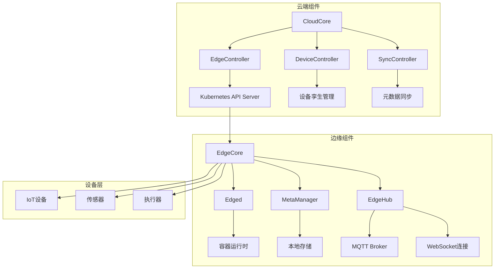

# Kubernetes 边缘计算与KubeEdge实践 (Edge Computing and KubeEdge Practice)

> **作者**: 边缘计算架构专家 | **版本**: v1.5 | **更新时间**: 2026-02-07
> **适用场景**: 边缘计算平台架构 | **复杂度**: ⭐⭐⭐⭐⭐

## 🎯 摘要

本文档深入探讨了Kubernetes边缘计算架构和KubeEdge的实践应用，基于大规模边缘计算平台的部署经验，提供从边缘节点管理到应用部署的完整技术指南，帮助企业构建高效、可靠的边缘计算解决方案。

## 1. 边缘计算架构基础

### 1.1 边缘计算核心概念

```yaml
边缘计算架构要素:
  边缘节点 (Edge Nodes):
    - 资源受限的计算设备
    - 地理位置分散
    - 网络连接不稳定
    - 本地数据处理需求
  
  云端控制平面 (Cloud Control Plane):
    - 集中的管理控制
    - 全局资源调度
    - 统一的安全策略
    - 集中的监控告警
  
  边缘自治能力 (Edge Autonomy):
    - 离线运行能力
    - 本地决策处理
    - 缓存和预取机制
    - 故障自愈能力
```

### 1.2 KubeEdge架构组件



## 2. KubeEdge安装部署

### 2.1 云端组件部署

```yaml
# KubeEdge云端组件部署
apiVersion: v1
kind: Namespace
metadata:
  name: kubeedge
---
apiVersion: apps/v1
kind: Deployment
metadata:
  name: cloudcore
  namespace: kubeedge
spec:
  replicas: 1
  selector:
    matchLabels:
      k8s-app: kubeedge
      kubeedge: cloudcore
  template:
    metadata:
      labels:
        k8s-app: kubeedge
        kubeedge: cloudcore
    spec:
      hostNetwork: true
      containers:
      - name: cloudcore
        image: kubeedge/cloudcore:v1.12.0
        imagePullPolicy: IfNotPresent
        resources:
          limits:
            cpu: 1000m
            memory: 1Gi
          requests:
            cpu: 500m
            memory: 512Mi
        volumeMounts:
        - name: certs
          mountPath: /etc/kubeedge/certs
        - name: config
          mountPath: /etc/kubeedge/config
        ports:
        - containerPort: 10000
          name: websocket
          protocol: TCP
        - containerPort: 10001
          name: quic
          protocol: UDP
        livenessProbe:
          httpGet:
            path: /v1/kubeedge/healthz
            port: 10002
          initialDelaySeconds: 10
          periodSeconds: 10
        readinessProbe:
          httpGet:
            path: /v1/kubeedge/healthz
            port: 10002
          initialDelaySeconds: 5
          periodSeconds: 10
      volumes:
      - name: certs
        secret:
          secretName: cloudcore
      - name: config
        configMap:
          name: cloudcore
---
apiVersion: v1
kind: Service
metadata:
  name: cloudcore
  namespace: kubeedge
spec:
  type: LoadBalancer
  ports:
  - name: websocket
    port: 10000
    protocol: TCP
    targetPort: 10000
  - name: quic
    port: 10001
    protocol: UDP
    targetPort: 10001
  selector:
    k8s-app: kubeedge
    kubeedge: cloudcore
---
apiVersion: v1
kind: ConfigMap
metadata:
  name: cloudcore
  namespace: kubeedge
data:
  cloudcore.yaml: |
    apiVersion: cloudcore.config.kubeedge.io/v1alpha1
    kind: CloudCore
    kubeAPIConfig:
      kubeConfig: ""
      master: ""
    modules:
      cloudHub:
        advertiseAddress:
        - 192.168.1.100
        nodeLimit: 1000
        tlsCAFile: /etc/kubeedge/certs/ca.crt
        tlsCertFile: /etc/kubeedge/certs/server.crt
        tlsPrivateKeyFile: /etc/kubeedge/certs/server.key
        unixsocket:
          address: unix:///var/lib/kubeedge/cloudcore.sock
          enable: true
      edgeController:
        buffer:
          updatePodStatus: 1024
          updateNodeStatus: 1024
          queryConfigMap: 1024
          querySecret: 1024
          queryService: 1024
          queryEndpoints: 1024
          podEvent: 1
          configMapEvent: 1
          secretEvent: 1
          serviceEvent: 1
          endpointsEvent: 1
          queryPersistentVolume: 1024
          queryPersistentVolumeClaim: 1024
          queryVolumeAttachment: 1024
          persistentVolumeEvent: 1
          persistentVolumeClaimEvent: 1
          volumeAttachmentEvent: 1
        contextSendGroup: edgecontroller
        contextSendModule: controller
        enable: true
        loadBalancer:
          defaultLB: 0
        messageLayer: context
        nodeUpdateFrequency: 10
        queryHistoryEvent: false
      deviceController:
        buffer:
          updateDeviceStatus: 1024
          deviceEvent: 1
          deviceModelEvent: 1
        contextSendGroup: devicecontroller
        contextSendModule: controller
        enable: true
        messageLayer: context
      syncController:
        enable: true
```

### 2.2 边缘节点部署

```bash
#!/bin/bash
# edge-node-installer.sh

# KubeEdge边缘节点安装脚本
set -e

EDGE_NODE_NAME=${1:-"edge-node-$(date +%s)"}
CLOUDCORE_IP=${2:-"192.168.1.100"}
CLOUDCORE_PORT=${3:-"10000"}

echo "=== KubeEdge边缘节点安装 ==="
echo "节点名称: $EDGE_NODE_NAME"
echo "云端地址: $CLOUDCORE_IP:$CLOUDCORE_PORT"

# 1. 安装必要依赖
echo "1. 安装依赖包..."
apt-get update
apt-get install -y socat conntrack ipset

# 2. 下载KubeEdge
echo "2. 下载KubeEdge..."
KE_VERSION="v1.12.0"
wget https://github.com/kubeedge/kubeedge/releases/download/$KE_VERSION/keadm-$KE_VERSION-linux-amd64.tar.gz
tar -xzf keadm-$KE_VERSION-linux-amd64.tar.gz

# 3. 安装容器运行时
echo "3. 安装容器运行时..."
curl -fsSL https://get.docker.com | sh
systemctl enable docker
systemctl start docker

# 4. 初始化边缘节点
echo "4. 初始化边缘节点..."
./keadm/keadm join \
  --cloudcore-ipport=$CLOUDCORE_IP:$CLOUDCORE_PORT \
  --edgenode-name=$EDGE_NODE_NAME \
  --token=`cat /tmp/token` \
  --remote-runtime-endpoint=unix:///var/run/containerd/containerd.sock \
  --cgroup-driver=cgroupfs

# 5. 验证安装
echo "5. 验证安装..."
kubectl get nodes -o wide | grep $EDGE_NODE_NAME

echo "边缘节点 $EDGE_NODE_NAME 安装完成!"
```

## 3. 边缘应用部署管理

### 3.1 边缘应用部署策略

```yaml
# 边缘应用部署配置
apiVersion: apps/v1
kind: Deployment
metadata:
  name: edge-app
  namespace: edge-apps
spec:
  replicas: 1
  selector:
    matchLabels:
      app: edge-app
  template:
    metadata:
      labels:
        app: edge-app
        node-type: edge
    spec:
      nodeSelector:
        node-role.kubernetes.io/edge: ""
      tolerations:
      - key: node-role.kubernetes.io/edge
        operator: Exists
        effect: NoSchedule
      containers:
      - name: app
        image: edge-app:v1.0.0
        ports:
        - containerPort: 8080
        resources:
          requests:
            cpu: 100m
            memory: 128Mi
          limits:
            cpu: 500m
            memory: 512Mi
        volumeMounts:
        - name: data
          mountPath: /data
        env:
        - name: EDGE_NODE_NAME
          valueFrom:
            fieldRef:
              fieldPath: spec.nodeName
        - name: LOCAL_STORAGE_PATH
          value: "/data/local"
      volumes:
      - name: data
        hostPath:
          path: /var/lib/edge-app/data
---
# 边缘服务配置
apiVersion: v1
kind: Service
metadata:
  name: edge-app-service
  namespace: edge-apps
spec:
  selector:
    app: edge-app
  ports:
  - protocol: TCP
    port: 8080
    targetPort: 8080
  type: NodePort
---
# 边缘路由配置
apiVersion: networking.k8s.io/v1
kind: Ingress
metadata:
  name: edge-app-ingress
  namespace: edge-apps
  annotations:
    nginx.ingress.kubernetes.io/rewrite-target: /
spec:
  rules:
  - host: edge-app.local
    http:
      paths:
      - path: /
        pathType: Prefix
        backend:
          service:
            name: edge-app-service
            port:
              number: 8080
```

### 3.2 本地存储管理

```yaml
# 边缘节点本地存储配置
apiVersion: v1
kind: PersistentVolume
metadata:
  name: edge-local-pv
spec:
  capacity:
    storage: 10Gi
  accessModes:
  - ReadWriteOnce
  persistentVolumeReclaimPolicy: Retain
  storageClassName: edge-local-storage
  local:
    path: /mnt/edge-storage
  nodeAffinity:
    required:
      nodeSelectorTerms:
      - matchExpressions:
        - key: kubernetes.io/hostname
          operator: In
          values:
          - edge-node-1
---
apiVersion: v1
kind: PersistentVolumeClaim
metadata:
  name: edge-app-pvc
  namespace: edge-apps
spec:
  accessModes:
  - ReadWriteOnce
  storageClassName: edge-local-storage
  resources:
    requests:
      storage: 5Gi
---
# 边缘存储类配置
apiVersion: storage.k8s.io/v1
kind: StorageClass
metadata:
  name: edge-local-storage
provisioner: kubernetes.io/no-provisioner
volumeBindingMode: WaitForFirstConsumer
```

## 4. 设备管理与物联网集成

### 4.1 设备孪生管理

```yaml
# 设备模型定义
apiVersion: devices.kubeedge.io/v1alpha2
kind: DeviceModel
metadata:
  name: temperature-sensor-model
  namespace: edge-devices
spec:
  properties:
  - name: temperature
    description: temperature in degree celsius
    type:
      int:
        accessMode: ReadOnly
        defaultValue: 0
  - name: humidity
    description: humidity in percentage
    type:
      int:
        accessMode: ReadOnly
        defaultValue: 0
  - name: status
    description: device status
    type:
      string:
        accessMode: ReadOnly
        defaultValue: "online"
---
# 设备实例配置
apiVersion: devices.kubeedge.io/v1alpha2
kind: Device
metadata:
  name: temperature-sensor-01
  namespace: edge-devices
  labels:
    model: temperature-sensor-model
    location: factory-floor-1
spec:
  deviceModelRef:
    name: temperature-sensor-model
  protocol:
    modbus:
      rtu:
        serialPort: /dev/ttyS0
        baudRate: 9600
        dataBits: 8
        parity: even
        stopBits: 1
        slaveID: 1
  nodeSelector:
    nodeSelectorTerms:
    - matchExpressions:
      - key: kubernetes.io/hostname
        operator: In
        values:
        - edge-node-1
---
# 设备数据采集配置
apiVersion: apps/v1
kind: DaemonSet
metadata:
  name: device-collector
  namespace: edge-devices
spec:
  selector:
    matchLabels:
      app: device-collector
  template:
    metadata:
      labels:
        app: device-collector
    spec:
      containers:
      - name: collector
        image: kubeedge/device-collector:v1.0.0
        env:
        - name: DEVICE_NAMESPACE
          value: "edge-devices"
        - name: COLLECT_INTERVAL
          value: "30s"
        volumeMounts:
        - name: device-config
          mountPath: /etc/device-collector
        - name: serial-devices
          mountPath: /dev
      volumes:
      - name: device-config
        configMap:
          name: device-collector-config
      - name: serial-devices
        hostPath:
          path: /dev
```

### 4.2 MQTT消息集成

```yaml
# MQTT网关配置
apiVersion: apps/v1
kind: Deployment
metadata:
  name: mqtt-gateway
  namespace: edge-messaging
spec:
  replicas: 1
  selector:
    matchLabels:
      app: mqtt-gateway
  template:
    metadata:
      labels:
        app: mqtt-gateway
    spec:
      containers:
      - name: mqtt-broker
        image: eclipse-mosquitto:2.0
        ports:
        - containerPort: 1883
          name: mqtt
        - containerPort: 9001
          name: websocket
        volumeMounts:
        - name: mosquitto-config
          mountPath: /mosquitto/config
        - name: mosquitto-data
          mountPath: /mosquitto/data
        - name: mosquitto-log
          mountPath: /mosquitto/log
      volumes:
      - name: mosquitto-config
        configMap:
          name: mosquitto-config
      - name: mosquitto-data
        emptyDir: {}
      - name: mosquitto-log
        emptyDir: {}
---
apiVersion: v1
kind: ConfigMap
metadata:
  name: mosquitto-config
  namespace: edge-messaging
data:
  mosquitto.conf: |
    persistence true
    persistence_location /mosquitto/data/
    log_dest file /mosquitto/log/mosquitto.log
    
    listener 1883
    protocol mqtt
    
    listener 9001
    protocol websockets
    
    allow_anonymous false
    password_file /mosquitto/config/mosquitto.passwd
    
    # 桥接配置
    connection cloud-mqtt
    address mqtt.cloud.example.com:1883
    topic # out 0
    topic # in 0
    cleansession true
---
# MQTT客户端应用
apiVersion: apps/v1
kind: Deployment
metadata:
  name: mqtt-client-app
  namespace: edge-apps
spec:
  replicas: 1
  selector:
    matchLabels:
      app: mqtt-client-app
  template:
    metadata:
      labels:
        app: mqtt-client-app
        node-type: edge
    spec:
      nodeSelector:
        node-role.kubernetes.io/edge: ""
      containers:
      - name: mqtt-client
        image: mqtt-client:v1.0.0
        env:
        - name: MQTT_BROKER_HOST
          value: "mqtt-gateway.edge-messaging.svc.cluster.local"
        - name: MQTT_BROKER_PORT
          value: "1883"
        - name: MQTT_TOPIC
          value: "sensor/temperature"
        - name: CLIENT_ID
          valueFrom:
            fieldRef:
              fieldPath: metadata.name
        resources:
          requests:
            cpu: 50m
            memory: 64Mi
          limits:
            cpu: 200m
            memory: 256Mi
```

## 5. 边缘自治与断网处理

### 5.1 边缘自治配置

```yaml
# 边缘节点自治配置
apiVersion: apps/v1
kind: DaemonSet
metadata:
  name: edge-autonomy-agent
  namespace: kubeedge
spec:
  selector:
    matchLabels:
      app: edge-autonomy-agent
  template:
    metadata:
      labels:
        app: edge-autonomy-agent
    spec:
      hostNetwork: true
      containers:
      - name: autonomy-agent
        image: kubeedge/autonomy-agent:v1.0.0
        env:
        - name: NODE_NAME
          valueFrom:
            fieldRef:
              fieldPath: spec.nodeName
        - name: CLOUD_CONNECTION_TIMEOUT
          value: "300"  # 5分钟
        - name: LOCAL_DECISION_THRESHOLD
          value: "0.8"  # 80%置信度
        volumeMounts:
        - name: edge-config
          mountPath: /etc/edge-autonomy
        - name: local-storage
          mountPath: /var/lib/edge-autonomy
      volumes:
      - name: edge-config
        configMap:
          name: edge-autonomy-config
      - name: local-storage
        hostPath:
          path: /var/lib/edge-autonomy
---
apiVersion: v1
kind: ConfigMap
metadata:
  name: edge-autonomy-config
  namespace: kubeedge
data:
  autonomy-policy.yaml: |
    # 边缘自治策略
    autonomyRules:
    - name: network-disconnect
      condition: "cloud_connection_lost > 300s"
      action: "enable_local_decision"
      recovery: "cloud_connection_restored"
    
    - name: resource-pressure
      condition: "local_resources < 20%"
      action: "reduce_workload"
      recovery: "resources_sufficient"
    
    - name: critical-failure
      condition: "critical_service_failure"
      action: "activate_fallback_mode"
      recovery: "service_recovery"
    
    localDecisionModels:
    - name: predictive-maintenance
      modelPath: "/models/predictive-maintenance.onnx"
      inputFeatures: ["temperature", "vibration", "operating_hours"]
      outputActions: ["maintenance_schedule", "part_replacement"]
    
    - name: anomaly-detection
      modelPath: "/models/anomaly-detection.tflite"
      inputFeatures: ["sensor_data", "operational_metrics"]
      outputActions: ["alert_generation", "automatic_shutdown"]
```

### 5.2 断网恢复机制

```python
#!/usr/bin/env python3
# edge-recovery-manager.py

import asyncio
import logging
from typing import Dict, List, Optional
from dataclasses import dataclass
from datetime import datetime, timedelta
import json
import time
from kubernetes import client, config
import requests

@dataclass
class EdgeNodeStatus:
    node_name: str
    cloud_connected: bool
    last_heartbeat: datetime
    local_workload: int
    resource_usage: Dict[str, float]
    autonomous_mode: bool

class EdgeRecoveryManager:
    def __init__(self):
        config.load_incluster_config()
        self.v1 = client.CoreV1Api()
        self.apps_v1 = client.AppsV1Api()
        self.logger = logging.getLogger(__name__)
        self.edge_nodes = {}
        self.recovery_policies = self.load_recovery_policies()
    
    def load_recovery_policies(self) -> Dict:
        """加载恢复策略配置"""
        return {
            "network_recovery": {
                "timeout": 300,  # 5分钟超时
                "retry_intervals": [30, 60, 120, 300],
                "max_retries": 10
            },
            "workload_recovery": {
                "scale_down_threshold": 0.3,
                "scale_up_threshold": 0.7,
                "emergency_scale_down": 0.1
            },
            "data_sync": {
                "sync_interval": 300,  # 5分钟同步间隔
                "batch_size": 100,
                "retry_count": 3
            }
        }
    
    async def monitor_edge_nodes(self):
        """监控边缘节点状态"""
        while True:
            try:
                nodes = self.v1.list_node(label_selector="node-role.kubernetes.io/edge")
                
                for node in nodes.items:
                    node_status = await self.check_node_status(node)
                    self.edge_nodes[node.metadata.name] = node_status
                    
                    # 检查是否需要恢复操作
                    if not node_status.cloud_connected:
                        await self.handle_network_disruption(node_status)
                    
                await asyncio.sleep(30)  # 30秒检查一次
                
            except Exception as e:
                self.logger.error(f"监控边缘节点失败: {e}")
                await asyncio.sleep(60)
    
    async def check_node_status(self, node) -> EdgeNodeStatus:
        """检查节点状态"""
        node_name = node.metadata.name
        
        # 检查云连接状态
        cloud_connected = await self.check_cloud_connection(node_name)
        
        # 获取心跳时间
        last_heartbeat = self.get_last_heartbeat(node)
        
        # 获取本地工作负载
        local_workload = await self.get_local_workload(node_name)
        
        # 获取资源使用情况
        resource_usage = await self.get_resource_usage(node_name)
        
        # 检查自治模式状态
        autonomous_mode = await self.check_autonomous_mode(node_name)
        
        return EdgeNodeStatus(
            node_name=node_name,
            cloud_connected=cloud_connected,
            last_heartbeat=last_heartbeat,
            local_workload=local_workload,
            resource_usage=resource_usage,
            autonomous_mode=autonomous_mode
        )
    
    async def check_cloud_connection(self, node_name: str) -> bool:
        """检查云连接状态"""
        try:
            # 通过EdgeCore的健康检查端点检查
            response = requests.get(
                f"http://{node_name}:10255/healthz",
                timeout=5
            )
            return response.status_code == 200
        except:
            return False
    
    async def handle_network_disruption(self, node_status: EdgeNodeStatus):
        """处理网络中断"""
        self.logger.warning(f"检测到节点 {node_status.node_name} 网络中断")
        
        # 启用本地自治模式
        await self.enable_autonomous_mode(node_status.node_name)
        
        # 调整本地工作负载
        await self.adjust_local_workload(node_status)
        
        # 启动连接恢复尝试
        asyncio.create_task(self.attempt_connection_recovery(node_status))
    
    async def enable_autonomous_mode(self, node_name: str):
        """启用自治模式"""
        try:
            # 更新节点标签
            body = {
                "metadata": {
                    "labels": {
                        "edge.autonomy.mode": "enabled"
                    }
                }
            }
            self.v1.patch_node(node_name, body)
            
            self.logger.info(f"节点 {node_name} 自治模式已启用")
            
        except Exception as e:
            self.logger.error(f"启用自治模式失败: {e}")
    
    async def adjust_local_workload(self, node_status: EdgeNodeStatus):
        """调整本地工作负载"""
        try:
            # 根据资源使用情况调整部署
            if node_status.resource_usage.get('cpu', 0) > 80:
                # CPU使用率过高，缩减非关键服务
                await self.scale_down_non_critical_services(node_status.node_name)
            
            elif node_status.resource_usage.get('memory', 0) > 85:
                # 内存使用率过高，清理缓存
                await self.cleanup_local_cache(node_status.node_name)
            
            # 确保关键服务正常运行
            await self.ensure_critical_services(node_status.node_name)
            
        except Exception as e:
            self.logger.error(f"调整工作负载失败: {e}")
    
    async def attempt_connection_recovery(self, node_status: EdgeNodeStatus):
        """尝试连接恢复"""
        policy = self.recovery_policies["network_recovery"]
        retry_count = 0
        
        while retry_count < policy["max_retries"]:
            # 等待重试间隔
            wait_time = policy["retry_intervals"][min(retry_count, len(policy["retry_intervals"]) - 1)]
            await asyncio.sleep(wait_time)
            
            # 尝试重新连接
            if await self.check_cloud_connection(node_status.node_name):
                self.logger.info(f"节点 {node_status.node_name} 连接已恢复")
                
                # 同步本地数据
                await self.sync_local_data(node_status.node_name)
                
                # 退出自治模式
                await self.disable_autonomous_mode(node_status.node_name)
                
                break
            
            retry_count += 1
            self.logger.info(f"连接恢复尝试 {retry_count}/{policy['max_retries']}")
        
        if retry_count >= policy["max_retries"]:
            self.logger.error(f"节点 {node_status.node_name} 连接恢复失败，进入紧急模式")
            await self.enter_emergency_mode(node_status.node_name)
    
    async def sync_local_data(self, node_name: str):
        """同步本地数据到云端"""
        try:
            policy = self.recovery_policies["data_sync"]
            
            # 获取待同步数据
            pending_data = await self.get_pending_data(node_name)
            
            # 分批同步数据
            for i in range(0, len(pending_data), policy["batch_size"]):
                batch = pending_data[i:i + policy["batch_size"]]
                await self.upload_data_batch(batch)
                
                # 更新同步状态
                await self.update_sync_status(node_name, len(batch))
                
        except Exception as e:
            self.logger.error(f"数据同步失败: {e}")
    
    async def enter_emergency_mode(self, node_name: str):
        """进入紧急模式"""
        try:
            # 只保留最关键的服务
            await self.maintain_minimal_services(node_name)
            
            # 启用本地告警
            await self.enable_local_alerting(node_name)
            
            # 记录紧急状态
            await self.log_emergency_state(node_name)
            
        except Exception as e:
            self.logger.error(f"进入紧急模式失败: {e}")

async def main():
    manager = EdgeRecoveryManager()
    await manager.monitor_edge_nodes()

if __name__ == "__main__":
    asyncio.run(main())
```

## 6. 监控与运维管理

### 6.1 边缘监控架构

```yaml
# 边缘监控配置
apiVersion: monitoring.coreos.com/v1
kind: ServiceMonitor
metadata:
  name: edge-node-monitor
  namespace: monitoring
spec:
  selector:
    matchLabels:
      app: edge-monitoring
  endpoints:
  - port: metrics
    path: /metrics
    interval: 60s
    relabelings:
    - sourceLabels: [__meta_kubernetes_pod_node_name]
      targetLabel: node
    metricRelabelings:
    - sourceLabels: [__name__]
      regex: 'edge_(.*)'
      targetLabel: __name__
---
# 边缘节点Exporter
apiVersion: apps/v1
kind: DaemonSet
metadata:
  name: edge-node-exporter
  namespace: monitoring
spec:
  selector:
    matchLabels:
      app: edge-node-exporter
  template:
    metadata:
      labels:
        app: edge-node-exporter
    spec:
      hostNetwork: true
      containers:
      - name: node-exporter
        image: prom/node-exporter:v1.5.0
        ports:
        - containerPort: 9100
          name: metrics
        volumeMounts:
        - name: proc
          mountPath: /host/proc
          readOnly: true
        - name: sys
          mountPath: /host/sys
          readOnly: true
      volumes:
      - name: proc
        hostPath:
          path: /proc
      - name: sys
        hostPath:
          path: /sys
---
# 边缘应用监控
apiVersion: v1
kind: ConfigMap
metadata:
  name: edge-app-monitoring
  namespace: monitoring
data:
  edge-app-rules.yaml: |
    # 边缘应用监控规则
    groups:
    - name: edge-app.rules
      rules:
      # 应用健康检查
      - record: edge_app:health_status
        expr: up{job="edge-app"} == 1
      
      # 资源使用率
      - record: edge_app:cpu_usage
        expr: rate(container_cpu_usage_seconds_total{container="app"}[5m])
      
      - record: edge_app:memory_usage
        expr: container_memory_working_set_bytes{container="app"}
      
      # 网络性能
      - record: edge_app:network_receive_bytes
        expr: rate(container_network_receive_bytes_total{container="app"}[5m])
      
      - record: edge_app:network_transmit_bytes
        expr: rate(container_network_transmit_bytes_total{container="app"}[5m])
```

### 6.2 边缘日志管理

```yaml
# 边缘日志收集配置
apiVersion: apps/v1
kind: DaemonSet
metadata:
  name: edge-fluentbit
  namespace: logging
spec:
  selector:
    matchLabels:
      app: edge-fluentbit
  template:
    metadata:
      labels:
        app: edge-fluentbit
    spec:
      containers:
      - name: fluentbit
        image: fluent/fluent-bit:1.9
        env:
        - name: FLUENT_ELASTICSEARCH_HOST
          value: "elasticsearch.logging.svc.cluster.local"
        - name: FLUENT_ELASTICSEARCH_PORT
          value: "9200"
        - name: NODE_NAME
          valueFrom:
            fieldRef:
              fieldPath: spec.nodeName
        volumeMounts:
        - name: varlog
          mountPath: /var/log
        - name: varlibdockercontainers
          mountPath: /var/lib/docker/containers
          readOnly: true
        - name: fluentbit-config
          mountPath: /fluent-bit/etc/
      volumes:
      - name: varlog
        hostPath:
          path: /var/log
      - name: varlibdockercontainers
        hostPath:
          path: /var/lib/docker/containers
      - name: fluentbit-config
        configMap:
          name: edge-fluentbit-config
---
apiVersion: v1
kind: ConfigMap
metadata:
  name: edge-fluentbit-config
  namespace: logging
data:
  fluent-bit.conf: |
    [SERVICE]
        Flush         1
        Log_Level     info
        Daemon        off
        Parsers_File  parsers.conf
        HTTP_Server   On
        HTTP_Listen   0.0.0.0
        HTTP_Port     2020
    
    [INPUT]
        Name              tail
        Path              /var/log/containers/*.log
        Parser            docker
        Tag               kube.*
        Refresh_Interval  5
        Mem_Buf_Limit     5MB
        Skip_Long_Lines   On
    
    [INPUT]
        Name              systemd
        Tag               host.*
        Systemd_Filter    _SYSTEMD_UNIT=docker.service
        Systemd_Filter    _SYSTEMD_UNIT=kubelet.service
        Systemd_Filter    _SYSTEMD_UNIT=edgecore.service
    
    [FILTER]
        Name                kubernetes
        Match               kube.*
        Kube_URL            https://kubernetes.default.svc:443
        Kube_CA_File        /var/run/secrets/kubernetes.io/serviceaccount/ca.crt
        Kube_Token_File     /var/run/secrets/kubernetes.io/serviceaccount/token
        Kube_Tag_Prefix     kube.var.log.containers.
        Merge_Log           On
        Merge_Log_Key       log_processed
        K8S-Logging.Parser  On
        K8S-Logging.Exclude Off
    
    [OUTPUT]
        Name            es
        Match           *
        Host            ${FLUENT_ELASTICSEARCH_HOST}
        Port            ${FLUENT_ELASTICSEARCH_PORT}
        Logstash_Format On
        Logstash_Prefix edge-logs
        Retry_Limit     False
```

## 7. 安全与合规管理

### 7.1 边缘安全策略

```yaml
# 边缘节点安全配置
apiVersion: security.kubeedge.io/v1alpha1
kind: EdgeSecurityPolicy
metadata:
  name: edge-security-policy
  namespace: kubeedge
spec:
  nodeSelector:
    matchLabels:
      node-role.kubernetes.io/edge: ""
  securityRules:
  - name: network-isolation
    type: network
    action: isolate
    config:
      allowedCIDRs:
      - 192.168.0.0/16
      - 10.0.0.0/8
      blockedPorts:
      - 22
      - 3389
      allowedProtocols:
      - TCP
      - UDP
  
  - name: runtime-security
    type: runtime
    action: monitor
    config:
      allowedImages:
      - registry.example.com/edge/*
      - kubeedge/*
      disallowedCapabilities:
      - NET_ADMIN
      - SYS_ADMIN
      readOnlyRootFilesystem: true
  
  - name: data-protection
    type: data
    action: encrypt
    config:
      encryptionAlgorithm: AES-256-GCM
      keyRotation: 24h
      dataAtRest: true
      dataInTransit: true
---
# 边缘证书管理
apiVersion: cert-manager.io/v1
kind: Certificate
metadata:
  name: edge-node-cert
  namespace: kubeedge
spec:
  secretName: edge-node-tls
  issuerRef:
    name: edge-ca-issuer
    kind: Issuer
  commonName: "{{ .NodeName }}.edge.example.com"
  dnsNames:
  - "{{ .NodeName }}.edge.example.com"
  - "*.edge.example.com"
  duration: 2160h  # 90天
  renewBefore: 360h  # 15天
  usages:
  - server auth
  - client auth
```

### 7.2 合规性检查

```python
#!/usr/bin/env python3
# edge-compliance-checker.py

import yaml
import json
from datetime import datetime
import logging
from kubernetes import client, config

class EdgeComplianceChecker:
    def __init__(self):
        config.load_incluster_config()
        self.v1 = client.CoreV1Api()
        self.apps_v1 = client.AppsV1Api()
        self.logger = logging.getLogger(__name__)
        self.compliance_standards = self.load_compliance_standards()
    
    def load_compliance_standards(self):
        """加载合规标准"""
        return {
            "cis_benchmark": {
                "version": "1.6",
                "categories": {
                    "control_plane": ["1.1", "1.2", "1.3", "1.4"],
                    "etcd": ["2.1", "2.2", "2.3"],
                    "control_plane_configuration": ["3.1", "3.2"],
                    "worker_nodes": ["4.1", "4.2", "4.3"],
                    "policies": ["5.1", "5.2", "5.3", "5.4", "5.5", "5.6", "5.7"]
                }
            },
            "nist_csf": {
                "version": "1.1",
                "functions": ["identify", "protect", "detect", "respond", "recover"]
            },
            "iso_27001": {
                "version": "2013",
                "controls": ["A.6.1.2", "A.6.1.3", "A.6.1.4", "A.6.1.5"]
            }
        }
    
    def check_edge_compliance(self, namespace="kubeedge"):
        """检查边缘合规性"""
        compliance_report = {
            "timestamp": datetime.now().isoformat(),
            "checks": {},
            "violations": [],
            "score": 0
        }
        
        # 检查CIS基准
        cis_violations = self.check_cis_benchmark()
        compliance_report["checks"]["cis_benchmark"] = {
            "violations": len(cis_violations),
            "details": cis_violations
        }
        compliance_report["violations"].extend(cis_violations)
        
        # 检查NIST CSF
        nist_violations = self.check_nist_csf()
        compliance_report["checks"]["nist_csf"] = {
            "violations": len(nist_violations),
            "details": nist_violations
        }
        compliance_report["violations"].extend(nist_violations)
        
        # 检查ISO 27001
        iso_violations = self.check_iso_27001()
        compliance_report["checks"]["iso_27001"] = {
            "violations": len(iso_violations),
            "details": iso_violations
        }
        compliance_report["violations"].extend(iso_violations)
        
        # 计算合规分数
        total_checks = sum(len(check["violations"]) for check in compliance_report["checks"].values())
        compliance_report["score"] = max(0, 100 - (total_checks * 5))  # 每个违规扣5分
        
        return compliance_report
    
    def check_cis_benchmark(self):
        """检查CIS基准合规性"""
        violations = []
        
        # 检查控制平面配置
        try:
            pods = self.v1.list_pod_for_all_namespaces(
                label_selector="component=kube-apiserver"
            ).items
            
            for pod in pods:
                # 检查匿名认证
                if self.check_anonymous_auth_enabled(pod):
                    violations.append({
                        "standard": "CIS",
                        "control": "1.2.1",
                        "issue": "Anonymous authentication enabled",
                        "severity": "HIGH"
                    })
                
                # 检查基本认证
                if self.check_basic_auth_enabled(pod):
                    violations.append({
                        "standard": "CIS",
                        "control": "1.2.2",
                        "issue": "Basic authentication enabled",
                        "severity": "HIGH"
                    })
                
                # 检查RBAC配置
                if not self.check_rbac_enabled(pod):
                    violations.append({
                        "standard": "CIS",
                        "control": "1.2.3",
                        "issue": "RBAC not enabled",
                        "severity": "HIGH"
                    })
        
        except Exception as e:
            self.logger.error(f"CIS基准检查失败: {e}")
        
        return violations
    
    def check_nist_csf(self):
        """检查NIST CSF合规性"""
        violations = []
        
        # 检查身份识别功能
        if not self.check_asset_inventory():
            violations.append({
                "standard": "NIST CSF",
                "function": "Identify",
                "issue": "Asset inventory not maintained",
                "severity": "MEDIUM"
            })
        
        # 检查保护功能
        if not self.check_access_control():
            violations.append({
                "standard": "NIST CSF",
                "function": "Protect",
                "issue": "Access controls not properly implemented",
                "severity": "HIGH"
            })
        
        # 检查检测功能
        if not self.check_monitoring_enabled():
            violations.append({
                "standard": "NIST CSF",
                "function": "Detect",
                "issue": "Insufficient monitoring capabilities",
                "severity": "MEDIUM"
            })
        
        return violations
    
    def check_iso_27001(self):
        """检查ISO 27001合规性"""
        violations = []
        
        # 检查信息安全策略
        if not self.check_security_policy_exists():
            violations.append({
                "standard": "ISO 27001",
                "control": "A.5.1.1",
                "issue": "Information security policy not documented",
                "severity": "HIGH"
            })
        
        # 检查风险管理
        if not self.check_risk_assessment_performed():
            violations.append({
                "standard": "ISO 27001",
                "control": "A.6.1.2",
                "issue": "Risk assessment not performed",
                "severity": "HIGH"
            })
        
        return violations
    
    def generate_compliance_report(self, report):
        """生成合规报告"""
        print("=== 边缘计算合规性报告 ===")
        print(f"检查时间: {report['timestamp']}")
        print(f"总体合规分数: {report['score']}/100")
        print("\n各标准检查结果:")
        
        for standard, check in report["checks"].items():
            print(f"\n{standard.upper()}:")
            print(f"  违规项数: {check['violations']}")
            if check['details']:
                print("  详细违规:")
                for violation in check['details']:
                    print(f"    - {violation['issue']} ({violation['severity']})")
        
        if report["violations"]:
            print("\n=== 建议整改措施 ===")
            self.generate_remediation_plan(report["violations"])

if __name__ == "__main__":
    checker = EdgeComplianceChecker()
    report = checker.check_edge_compliance()
    checker.generate_compliance_report(report)
```

## 8. 最佳实践与实施指南

### 8.1 边缘计算实施原则

```markdown
## 🌐 边缘计算实施原则

### 1. 本地化处理
- 数据就近处理，减少传输延迟
- 实施边缘缓存和预取策略
- 建立本地决策机制

### 2. 资源优化
- 合理分配计算和存储资源
- 实施动态资源调度
- 优化能耗管理

### 3. 可靠性保障
- 建立边缘自治能力
- 实施故障自愈机制
- 确保断网情况下正常运行

### 4. 安全防护
- 实施多层次安全防护
- 建立设备身份认证体系
- 实施数据加密传输
```

### 8.2 实施检查清单

```yaml
边缘计算实施检查清单:
  基础设施:
    ☐ 边缘节点硬件选型完成
    ☐ 网络连接方案确定
    ☐ 电源和环境条件满足
    ☐ 物理安全措施到位
  
  软件部署:
    ☐ KubeEdge云端组件部署
    ☐ 边缘节点Agent安装
    ☐ 设备驱动和协议适配
    ☐ 应用容器化改造
  
  安全配置:
    ☐ 节点身份认证配置
    ☐ 网络安全策略实施
    ☐ 数据加密方案部署
    ☐ 访问控制策略制定
  
  监控运维:
    ☐ 监控告警体系建立
    ☐ 日志收集分析配置
    ☐ 自动化运维工具部署
    ☐ 故障处理流程制定
```

## 9. 未来发展趋势

### 9.1 边缘计算演进方向

```yaml
边缘计算发展趋势:
  1. AI边缘化
     - 边缘AI推理能力
     - 联邦学习支持
     - 实时智能决策
  
  2. 5G融合
     - 5G网络切片集成
     - 超低延迟应用支持
     - 移动边缘计算
  
  3. 边缘自治
     - 更强的本地决策能力
     - 自适应资源调度
     - 智能故障预测
```

---
*本文档基于企业级边缘计算实践经验编写，持续更新最新技术和最佳实践。*