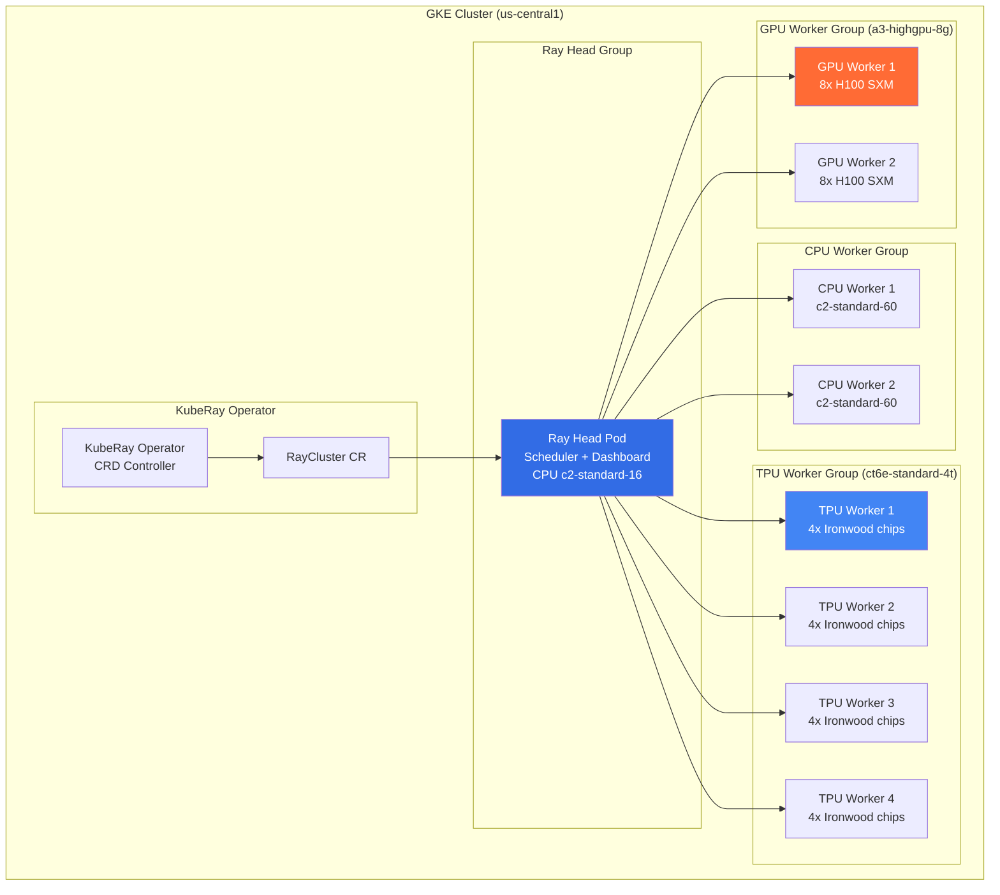

# GKE Autopilot 与 Google Cloud AI 基础设施 (GKE Autopilot and Google Cloud AI Infrastructure)

> 作者: Google Cloud架构专家 | 版本: v1.0 | 更新时间: 2026-03-03
> 适用场景: GKE 生产部署、AI/ML 训练推理、TPU 工作负载、成本优化 | 复杂度: ⭐⭐⭐⭐⭐

---

## 摘要

GKE（Google Kubernetes Engine）在 2026 年已成为全球最成熟的托管 Kubernetes 平台，尤其在 AI/ML 基础设施领域形成了显著的技术领先优势。第六代 TPU Ironwood 的 GA 发布、KubeRay 与 TPU 的深度集成、Gemini CLI 的 AI 辅助运维，以及 Autopilot 模式的持续演进，共同构成了 Google Cloud AI 超级计算基础设施。

本文深度探讨 GKE Autopilot 的 2026 年状态、TPU Ironwood 在 Kubernetes 上的训练实践、Ray on GKE 分布式训练架构、Container-Optimized OS 安全特性，以及精细化的成本优化策略。通过完整的 YAML 配置示例和生产实践指南，帮助 MLOps 工程师和平台架构师在 GKE 上构建高效、经济的 AI 超算平台。

---

## 目录

1. [GKE Autopilot 2026 状态](#1-gke-autopilot-2026-状态)
2. [GKE Autopilot 核心特性](#2-gke-autopilot-核心特性)
3. [TPU Ironwood on GKE](#3-tpu-ironwood-on-gke)
4. [Ray on GKE with TPU](#4-ray-on-gke-with-tpu)
5. [Gemini CLI 与 GKE 运维](#5-gemini-cli-与-gke-运维)
6. [Autopilot GPU 工作负载](#6-autopilot-gpu-工作负载)
7. [Container-Optimized OS](#7-container-optimized-os)
8. [成本优化策略](#8-成本优化策略)
9. [未来趋势](#9-未来趋势)

---

## 1. GKE Autopilot 2026 状态

### 1.1 Standard vs Autopilot 全面对比

GKE 提供两种运维模式，满足不同用户需求：

| 对比维度 | GKE Standard | GKE Autopilot |
|---------|-------------|--------------|
| **节点管理** | 用户负责 (创建/升级/修复) | Google 全托管 |
| **计费模型** | 按节点 VM 计费 | 按 Pod 资源请求计费 |
| **节点池** | 用户自定义 | 自动按需创建 |
| **操作系统** | 可选多种 OS | Container-Optimized OS |
| **Pod 安全** | 用户配置 | Baseline PSS 强制执行 |
| **特权容器** | 允许 | 默认禁止 |
| **GPU/TPU 支持** | 完整支持 | GPU 完整支持，TPU 2026 GA |
| **自动扩缩** | HPA + Cluster Autoscaler | 内置，无需配置 |
| **节点升级** | 维护窗口 | 蓝绿滚动升级 |
| **空闲资源浪费** | 存在 (节点预留) | 最小化 |
| **控制平面成本** | 免费 (Zonal), $0.10/h (Regional) | 与 Standard 相同 |
| **适用场景** | 需要特权/自定义OS | 大多数无状态工作负载 |
| **SLA 保证** | 99.95% (Regional) | 99.95% (Regional) |
| **DaemonSet** | 完整支持 | 受限支持 |
| **HostPath Volume** | 支持 | 不支持 |

### 1.2 Dynamic Defaults 机制

GKE Autopilot 的 Dynamic Defaults 是 2025 年引入的智能资源管理机制：

```
Dynamic Defaults 工作原理：

用户提交 Pod (只有 requests.cpu=100m):
         ↓
Autopilot Admission Controller 拦截
         ↓
分析工作负载类型和历史数据:
  - 检测 Java 应用 → 建议内存 limits 为 requests 的 2x
  - 检测 GPU 工作负载 → 自动设置 nvidia.com/gpu limits
  - 检测 Spot 标注 → 启用中断处理配置
         ↓
Dynamic Defaults 填充:
  requests.memory: "256Mi"   (根据 CPU/内存比推断)
  limits.cpu: "200m"         (自动设置 limit = 2x requests)
  limits.memory: "512Mi"
  terminationGracePeriodSeconds: 30

注意: 用户显式设置的值不会被覆盖
```

### 1.3 GKE Autopilot 演进时间线

```
GKE Autopilot 发展历程：
─────────────────────────────────────────────────────────────
2021-02  Autopilot GA
         基础 Pod 调度，按 Pod 计费，节点全托管

2022-06  GPU 支持 GA
         L4/A100 GPU 工作负载，GPU 时间片支持

2023-09  Spot Pod 支持
         Spot VM 与 On-demand 混合调度

2024-03  TPU v5e/v5p 预览版
         AI/ML 训练工作负载支持

2024-11  Dynamic Defaults
         智能资源推断，减少配置错误

2025-06  蓝绿节点升级 GA
         零中断节点升级，更好 SLO 保障

2025-11  TPU Ironwood (v6) 预览版
         第六代 TPU，Google AI 超算级别

2026-01  TPU Ironwood GA on GKE Autopilot
         完整 AI 超算工作负载支持

2026-03  Gemini CLI for GKE GA
         AI 辅助 Kubernetes 运维
─────────────────────────────────────────────────────────────
```

---

## 2. GKE Autopilot 核心特性

### 2.1 自动节点供应

Autopilot 根据 Pod 的资源请求和约束自动选择最合适的节点类型：

```yaml
# Pod 声明 GPU 资源，Autopilot 自动创建 GPU 节点
apiVersion: v1
kind: Pod
metadata:
  name: gpu-training-job
spec:
  containers:
  - name: trainer
    image: pytorch/pytorch:2.4.0-cuda12.1-cudnn9-devel
    resources:
      requests:
        nvidia.com/gpu: "1"
        cpu: "4"
        memory: "16Gi"
      limits:
        nvidia.com/gpu: "1"
        cpu: "4"
        memory: "16Gi"
  # Autopilot 自动选择 L4 GPU 节点 (最经济)
  # 无需手动创建节点池！
```

```yaml
# 通过 nodeSelector 指定 GPU 型号
apiVersion: v1
kind: Pod
spec:
  nodeSelector:
    cloud.google.com/gke-accelerator: "nvidia-tesla-a100"
  containers:
  - name: large-model-trainer
    resources:
      requests:
        nvidia.com/gpu: "8"
        cpu: "96"
        memory: "640Gi"
```

### 2.2 Pod Security Baseline 强制执行

Autopilot 强制执行 Kubernetes Pod Security Standards (PSS) Baseline 级别：

```yaml
# ❌ 以下配置在 Autopilot 中被禁止
spec:
  securityContext:
    runAsUser: 0         # 禁止以 root 运行
  containers:
  - name: app
    securityContext:
      privileged: true    # 禁止特权容器
      allowPrivilegeEscalation: true  # 禁止权限提升
    volumeMounts:
    - name: host-path
      mountPath: /host    # 禁止 HostPath volume
  hostNetwork: true       # 禁止 hostNetwork
  hostPID: true           # 禁止 hostPID

# ✅ Autopilot 兼容配置
spec:
  securityContext:
    runAsNonRoot: true
    runAsUser: 1000
    fsGroup: 2000
    seccompProfile:
      type: RuntimeDefault
  containers:
  - name: app
    securityContext:
      allowPrivilegeEscalation: false
      readOnlyRootFilesystem: true
      capabilities:
        drop: ["ALL"]
    volumeMounts:
    - name: data
      mountPath: /data
  volumes:
  - name: data
    persistentVolumeClaim:
      claimName: data-pvc
```

### 2.3 蓝绿节点升级

```
蓝绿节点升级流程 (零中断)：

现有集群状态:
  Blue NodePool (K8s 1.29): Node-1 Node-2 Node-3
  [Pod-A] [Pod-B] [Pod-C] [Pod-D] [Pod-E]

步骤 1: 创建 Green 节点池 (K8s 1.30)
  Blue NodePool (1.29): Node-1 Node-2 Node-3
  Green NodePool (1.30): Node-4 Node-5 Node-6 (新创建)

步骤 2: 新 Pod 调度到 Green 节点池
  Blue NodePool (1.29): [Pod-A] [Pod-B]
  Green NodePool (1.30): [Pod-C] [Pod-D] [Pod-E] [新Pod-F]

步骤 3: 迁移 Blue 节点上的 Pod (Cordon + Drain)
  Blue NodePool (1.29): Node-1(Cordoned) Node-2(Draining)
  Green NodePool (1.30): [Pod-A] [Pod-B] [Pod-C] [Pod-D] [Pod-E]

步骤 4: 删除 Blue 节点池
  Green NodePool (1.30): Node-4 Node-5 Node-6
  所有 Pod 正常运行，零停机时间
```

### 2.4 跨 AZ 反亲和性

```yaml
# Autopilot 最佳实践：配置跨可用区分散
apiVersion: apps/v1
kind: Deployment
metadata:
  name: production-api
spec:
  replicas: 6
  template:
    spec:
      # 跨 AZ 反亲和性
      topologySpreadConstraints:
      - maxSkew: 1
        topologyKey: topology.kubernetes.io/zone
        whenUnsatisfiable: DoNotSchedule
        labelSelector:
          matchLabels:
            app: production-api
      # 节点反亲和性 (同一节点不超过 2 个副本)
      affinity:
        podAntiAffinity:
          preferredDuringSchedulingIgnoredDuringExecution:
          - weight: 100
            podAffinityTerm:
              labelSelector:
                matchExpressions:
                - key: app
                  operator: In
                  values: [production-api]
              topologyKey: kubernetes.io/hostname
```

---

## 3. TPU Ironwood on GKE

### 3.1 TPU Ironwood 规格详解

第六代 TPU Ironwood 于 2026 年 1 月 GA，是 Google 专为大规模 AI 训练设计的超级芯片：

| 规格参数 | TPU v5e | TPU v5p | TPU Ironwood (v6) |
|---------|---------|---------|------------------|
| **HBM 容量** | 16GB/chip | 95GB/chip | 192GB/chip |
| **HBM 带宽** | 819GB/s | 2765GB/s | 7TB/s |
| **FLOPS (BF16)** | 197 TFLOPS | 459 TFLOPS | 2,614 TFLOPS |
| **互连带宽** | 1.6Tbps | 4.8Tbps | 13.1Tbps |
| **最大 Pod 规模** | 256 chips | 6144 chips | 9216 chips |
| **GA 时间** | 2023-Q4 | 2024-Q1 | 2026-Q1 |
| **适用场景** | 推理/小模型训练 | 大模型训练 | 超大规模 LLM 训练 |
| **GKE 支持** | ✅ | ✅ | ✅ (Autopilot 2026 GA) |

### 3.2 TPU Pod Slice 配置

```yaml
# tpu-ironwood-training-job.yaml
apiVersion: batch/v1
kind: Job
metadata:
  name: llm-ironwood-training
  namespace: ai-workloads
spec:
  parallelism: 256    # 256 个 TPU worker Pod
  completions: 256
  template:
    metadata:
      labels:
        app: llm-training
        tpu-type: ironwood
    spec:
      restartPolicy: Never

      # 节点选择 TPU Ironwood 节点
      nodeSelector:
        cloud.google.com/gke-tpu-accelerator: tpu-v6e-slice
        cloud.google.com/gke-tpu-topology: 16x16  # 256 chips

      tolerations:
      - key: "cloud.google.com/tpu"
        operator: "Exists"
        effect: "NoSchedule"

      # TPU 访问需要的服务账号
      serviceAccountName: tpu-training-sa

      volumes:
      # GCS 挂载 (训练数据和 Checkpoint)
      - name: gcs-data
        csi:
          driver: gcsfuse.csi.storage.gke.io
          readOnly: false
          volumeAttributes:
            bucketName: my-training-data-bucket
            mountOptions: "implicit-dirs,file-cache:enable-o-direct:true"
      # TPU 共享内存
      - name: dshm
        emptyDir:
          medium: Memory
          sizeLimit: 128Gi

      containers:
      - name: tpu-trainer
        image: us-docker.pkg.dev/deeplearning-platform-release/jax-tpu:latest
        command:
        - python3
        - /app/train_llm.py
        - --model-size=70b
        - --tpu-topology=16x16
        - --checkpoint-dir=/gcs/checkpoints/llm-70b
        - --dataset-dir=/gcs/datasets/fineweb
        - --max-steps=1000000
        - --checkpoint-interval=5000

        env:
        - name: TPU_WORKER_ID
          valueFrom:
            fieldRef:
              fieldPath: metadata.annotations['batch.kubernetes.io/job-completion-index']
        - name: TPU_WORKER_HOSTNAMES
          value: "llm-ironwood-training-$(TPU_WORKER_ID).ai-workloads"
        - name: XLA_USE_BF16
          value: "1"
        - name: LIBTPU_INIT_ARGS
          value: "--xla_tpu_enable_async_collective_fusion_fuse_all_gather=true"

        resources:
          requests:
            google.com/tpu: "4"    # 每 Pod 4 个 TPU chips
            cpu: "112"
            memory: "192Gi"
          limits:
            google.com/tpu: "4"
            cpu: "112"
            memory: "192Gi"

        volumeMounts:
        - name: gcs-data
          mountPath: /gcs
        - name: dshm
          mountPath: /dev/shm
---
# TPU 节点池配置 (Standard 模式)
# gcloud container node-pools create tpu-ironwood-pool \
#   --cluster=ai-cluster \
#   --machine-type=ct6e-standard-4t \
#   --tpu-topology=16x16 \
#   --num-nodes=64 \
#   --node-locations=us-central1-a
```

### 3.3 Checkpoint 容错训练

TPU 训练中断是常见问题，自动 Checkpoint 是关键容错机制：

```python
# train_llm.py - TPU 容错训练核心逻辑
import jax
import jax.numpy as jnp
import orbax.checkpoint as ocp
from flax.training import train_state
import os

class FaultTolerantTPUTrainer:
    def __init__(self, model, checkpoint_dir: str, checkpoint_interval: int = 5000):
        self.model = model
        self.checkpoint_dir = checkpoint_dir
        self.checkpoint_interval = checkpoint_interval

        # Orbax 异步 Checkpoint 管理器
        options = ocp.CheckpointManagerOptions(
            max_to_keep=3,           # 保留最近 3 个 checkpoint
            async_options=ocp.AsyncOptions(
                timeout_secs=600     # 异步写入超时 10 分钟
            ),
            save_interval_steps=checkpoint_interval,
        )
        self.ckpt_manager = ocp.CheckpointManager(
            checkpoint_dir,
            options=options
        )

    def restore_or_initialize(self, init_state):
        """从最新 checkpoint 恢复，或初始化训练"""
        latest_step = self.ckpt_manager.latest_step()
        if latest_step is not None:
            print(f"Restoring from checkpoint at step {latest_step}")
            restored = self.ckpt_manager.restore(
                latest_step,
                args=ocp.args.StandardRestore(init_state)
            )
            return restored, latest_step
        else:
            print("No checkpoint found, initializing from scratch")
            return init_state, 0

    def train(self, dataset, num_steps: int):
        """主训练循环，带自动 checkpoint"""
        # 初始化 JAX TPU 分布式训练
        jax.distributed.initialize()
        num_devices = jax.device_count()
        print(f"Training on {num_devices} TPU chips")

        # 初始化模型状态
        init_state = self._create_initial_state()
        state, start_step = self.restore_or_initialize(init_state)

        # 数据并行分片
        replicated_state = jax.device_put_replicated(state, jax.devices())

        for step in range(start_step, num_steps):
            batch = next(dataset)
            # TPU 分布式训练步骤
            replicated_state, metrics = self._train_step(replicated_state, batch)

            # 异步保存 checkpoint (不阻塞训练)
            if step % self.checkpoint_interval == 0:
                unreplicated_state = jax.tree_util.tree_map(
                    lambda x: x[0], replicated_state
                )
                self.ckpt_manager.save(
                    step,
                    args=ocp.args.StandardSave(unreplicated_state)
                )

            if step % 100 == 0 and jax.process_index() == 0:
                print(f"Step {step}: loss={metrics['loss']:.4f}, "
                      f"throughput={metrics['tokens_per_sec']:.0f} tok/s")

        # 等待所有异步 checkpoint 完成
        self.ckpt_manager.wait_until_finished()
```

---

## 4. Ray on GKE with TPU

### 4.1 KubeRay + TPU 架构



### 4.2 GKE TPU Ray Cluster YAML

```yaml
# ray-cluster-tpu-gpu.yaml
apiVersion: ray.io/v1
kind: RayCluster
metadata:
  name: llm-training-cluster
  namespace: ai-workloads
spec:
  rayVersion: '2.40.0'

  # Ray 版本与 GKE 兼容性配置
  enableInTreeAutoscaling: true

  # Head Node (CPU)
  headGroupSpec:
    rayStartParams:
      dashboard-host: "0.0.0.0"
      num-cpus: "0"         # Head 不参与计算
      resources: '{"head": 1}'
    template:
      spec:
        serviceAccountName: ray-training-sa
        nodeSelector:
          cloud.google.com/gke-nodepool: cpu-pool
        containers:
        - name: ray-head
          image: rayproject/ray:2.40.0-py311
          ports:
          - containerPort: 6379   # GCS (Redis) 端口
            name: gcs
          - containerPort: 8265   # Dashboard
            name: dashboard
          - containerPort: 10001  # Ray Client
            name: client
          resources:
            requests:
              cpu: "8"
              memory: "32Gi"
            limits:
              cpu: "16"
              memory: "64Gi"
          volumeMounts:
          - name: gcs-bucket
            mountPath: /gcs
        volumes:
        - name: gcs-bucket
          csi:
            driver: gcsfuse.csi.storage.gke.io
            volumeAttributes:
              bucketName: ray-training-artifacts

  workerGroupSpecs:
  # TPU Worker Group
  - groupName: tpu-ironwood-workers
    replicas: 4
    minReplicas: 4
    maxReplicas: 64
    rayStartParams:
      resources: '{"TPU": 4, "TPU-v6e-4": 4}'
      num-cpus: "112"
    template:
      spec:
        serviceAccountName: ray-training-sa
        nodeSelector:
          cloud.google.com/gke-tpu-accelerator: tpu-v6e-slice
          cloud.google.com/gke-tpu-topology: 2x2
        tolerations:
        - key: "cloud.google.com/tpu"
          operator: "Exists"
          effect: "NoSchedule"
        containers:
        - name: ray-worker-tpu
          image: us-docker.pkg.dev/deeplearning-platform-release/ray-tpu:2.40.0-py311
          resources:
            requests:
              google.com/tpu: "4"
              cpu: "112"
              memory: "192Gi"
            limits:
              google.com/tpu: "4"
              cpu: "112"
              memory: "192Gi"
          env:
          - name: JAX_PLATFORMS
            value: "tpu"
          - name: PJRT_DEVICE
            value: "TPU"
          volumeMounts:
          - name: dshm
            mountPath: /dev/shm
          - name: gcs-bucket
            mountPath: /gcs
        volumes:
        - name: dshm
          emptyDir:
            medium: Memory
            sizeLimit: 128Gi
        - name: gcs-bucket
          csi:
            driver: gcsfuse.csi.storage.gke.io
            volumeAttributes:
              bucketName: ray-training-artifacts

  # GPU Worker Group (H100)
  - groupName: gpu-h100-workers
    replicas: 2
    minReplicas: 0
    maxReplicas: 16
    rayStartParams:
      num-gpus: "8"
      resources: '{"GPU": 8}'
    template:
      spec:
        nodeSelector:
          cloud.google.com/gke-accelerator: nvidia-h100-80gb
        tolerations:
        - key: "nvidia.com/gpu"
          operator: "Exists"
          effect: "NoSchedule"
        containers:
        - name: ray-worker-gpu
          image: rayproject/ray-ml:2.40.0-py311-gpu
          resources:
            requests:
              nvidia.com/gpu: "8"
              cpu: "160"
              memory: "1760Gi"
            limits:
              nvidia.com/gpu: "8"
              cpu: "160"
              memory: "1760Gi"
```

### 4.3 JAX 分布式训练示例

```python
# distributed_llm_training.py - JAX + Ray on TPU
import ray
import jax
import jax.numpy as jnp
from jax.experimental import mesh_utils
from jax.sharding import Mesh, PartitionSpec as P, NamedSharding

ray.init("ray://ray-head:10001")

@ray.remote(resources={"TPU-v6e-4": 4})
class TPUTrainingWorker:
    def __init__(self, worker_id: int, num_workers: int):
        self.worker_id = worker_id
        self.num_workers = num_workers

        # 初始化 JAX 多设备
        jax.distributed.initialize(
            coordinator_address="ray-head:1234",
            num_processes=num_workers,
            process_id=worker_id
        )

        self.devices = jax.devices("tpu")
        print(f"Worker {worker_id}: {len(self.devices)} TPU devices")

    def setup_mesh(self, model_size: str = "70b"):
        """设置张量并行 + 数据并行 Mesh"""
        num_devices = len(self.devices)

        if model_size == "70b":
            # 70B 模型: 8向张量并行, N向数据并行
            mesh_shape = (num_devices // 8, 8)
            mesh_axes = ("data", "model")
        elif model_size == "405b":
            # 405B 模型: 32向张量并行, 4向流水线并行
            mesh_shape = (4, 32, num_devices // 128)
            mesh_axes = ("pipeline", "model", "data")

        device_mesh = mesh_utils.create_device_mesh(mesh_shape)
        self.mesh = Mesh(device_mesh, axis_names=mesh_axes)
        return self.mesh

    def train_step(self, params, batch):
        """单步训练，自动 TPU 分布式"""
        with self.mesh:
            # 参数分片到 model 轴
            param_sharding = NamedSharding(self.mesh, P(None, "model"))
            # 数据分片到 data 轴
            data_sharding = NamedSharding(self.mesh, P("data", None))

            params = jax.device_put(params, param_sharding)
            batch = jax.device_put(batch, data_sharding)

            # JIT 编译的训练步骤
            @jax.jit
            def _train_step(params, batch):
                def loss_fn(params):
                    logits = self.model.apply(params, batch["input_ids"])
                    return cross_entropy_loss(logits, batch["labels"])

                loss, grads = jax.value_and_grad(loss_fn)(params)
                # 跨设备梯度同步 (pmean)
                grads = jax.lax.pmean(grads, axis_name="data")
                return loss, grads

            loss, grads = _train_step(params, batch)
            return loss, grads


# 主训练协调器
@ray.remote
def coordinate_training():
    num_workers = 16  # 16 个 TPU Worker (64 chips total)

    # 创建分布式 Worker
    workers = [
        TPUTrainingWorker.remote(i, num_workers)
        for i in range(num_workers)
    ]

    # 并行训练
    futures = [w.train_step.remote(params, batch) for w in workers]
    results = ray.get(futures)

    losses = [r[0] for r in results]
    avg_loss = sum(losses) / len(losses)
    print(f"Average loss: {avg_loss:.4f}")

ray.get(coordinate_training.remote())
```

---

## 5. Gemini CLI 与 GKE 运维

### 5.1 AI 辅助 Kubernetes 运维

Gemini CLI 将大语言模型能力集成到 Kubernetes 运维工作流，2026 年 3 月 GA：

```bash
# Gemini CLI 安装
gcloud components install gemini

# 基础用法
gcloud gemini kubectl -- "列出所有 production 命名空间中 CPU 使用率超过 80% 的 Pod"

# Gemini 将自动转换为：
# kubectl top pods -n production --sort-by=cpu | awk 'NR>1 && $3+0>80'
# 并展示结果

# 自然语言到 kubectl 示例
gcloud gemini kubectl -- \
  "找出最近 1 小时内重启超过 3 次的容器，并显示其日志中的错误信息"

# Gemini 执行:
# 1. kubectl get pods -A --field-selector=status.phase=Running
# 2. kubectl get pods -A -o json | jq '.items[] | select(.status.containerStatuses[].restartCount > 3)'
# 3. 对找到的 Pod 执行 kubectl logs --since=1h | grep -i error
# 4. 整合结果并以可读格式展示
```

### 5.2 上下文感知故障诊断

```bash
# 场景：服务延迟突然升高，AI 辅助排查
gcloud gemini diagnose --cluster=production-cluster \
  "order-service 在过去 30 分钟内 P99 延迟从 50ms 升至 2000ms，请帮我诊断原因"

# Gemini CLI 自动执行诊断流程：
# ✅ 检查 Pod 状态和事件
#    kubectl describe pods -l app=order-service -n production
# ✅ 检查 HPA 状态
#    kubectl get hpa order-service-hpa -n production
# ✅ 检查 PodDisruptionBudget
# ✅ 检查相关 Deployment 最近变更
#    kubectl rollout history deployment/order-service -n production
# ✅ 检查依赖服务 (数据库连接池)
# ✅ 查询 Prometheus 指标
#    查询 db_pool_wait_time, cache_miss_rate
# ✅ 分析 OTel 追踪
# ✅ 综合分析并给出诊断报告：
#
# 🔍 诊断结果：
# 根因：14:32 发布的 order-service v2.3.1 引入了 N+1 查询问题
# 证据：
#   - 部署时间与延迟升高时间吻合 (14:32)
#   - DB 连接池等待时间从 2ms 升至 450ms
#   - Trace 显示 /api/orders 端点 DB 查询从 3次增至 N*3次
#
# 建议操作：
#   1. kubectl rollout undo deployment/order-service -n production
#   2. 查看 PR #1234 数据库查询变更
#   3. 添加数据库 N+1 监控告警
```

### 5.3 Gemini 辅助 YAML 生成

```bash
# 自然语言生成 Kubernetes YAML
gcloud gemini create -- \
  "创建一个 GPU 训练 Job：使用 PyTorch，4 个 L4 GPU，从 GCS bucket my-data 读取训练数据，
   保存 checkpoint 到 GCS bucket my-checkpoints，Spot VM，自动重试 3 次"

# 自动生成完整 YAML 并询问是否应用：
# Preview:
# apiVersion: batch/v1
# kind: Job
# metadata: ...
# spec:
#   backoffLimit: 3
#   template:
#     spec:
#       terminationGracePeriodSeconds: 60  # Spot 中断处理
#       nodeSelector:
#         cloud.google.com/gke-accelerator: nvidia-l4
#         cloud.google.com/gke-spot: "true"
#       containers:
#       - name: trainer
#         image: pytorch/pytorch:2.4.0-cuda12.1-cudnn9-devel
#         ...
#
# Apply this configuration? [y/N]
```

---

## 6. Autopilot GPU 工作负载

### 6.1 L4 GPU 推理配置

```yaml
# l4-gpu-inference-deployment.yaml
apiVersion: apps/v1
kind: Deployment
metadata:
  name: llm-inference-l4
  namespace: ai-serving
spec:
  replicas: 3
  selector:
    matchLabels:
      app: llm-inference-l4
  template:
    metadata:
      labels:
        app: llm-inference-l4
    spec:
      nodeSelector:
        # Autopilot 自动创建 g2-standard-4 (1x L4) 节点
        cloud.google.com/gke-accelerator: nvidia-l4
      tolerations:
      - key: "nvidia.com/gpu"
        operator: "Exists"
        effect: "NoSchedule"

      # GPU 初始化等待
      initContainers:
      - name: gpu-check
        image: nvidia/cuda:12.3.0-base-ubuntu22.04
        command: ["nvidia-smi"]
        resources:
          limits:
            nvidia.com/gpu: "1"

      containers:
      - name: vllm-server
        image: vllm/vllm-openai:v0.6.0
        args:
        - --model=google/gemma-2-9b-it
        - --tensor-parallel-size=1
        - --max-model-len=8192
        - --gpu-memory-utilization=0.90
        - --host=0.0.0.0
        - --port=8080
        ports:
        - containerPort: 8080
          name: http
        resources:
          requests:
            nvidia.com/gpu: "1"
            cpu: "4"
            memory: "20Gi"
          limits:
            nvidia.com/gpu: "1"
            cpu: "4"
            memory: "20Gi"
        readinessProbe:
          httpGet:
            path: /health
            port: 8080
          initialDelaySeconds: 60
          periodSeconds: 10
---
# H100 大模型训练配置
apiVersion: apps/v1
kind: Deployment
metadata:
  name: llm-training-h100
  namespace: ai-training
spec:
  replicas: 2
  template:
    spec:
      nodeSelector:
        # Autopilot 自动创建 a3-highgpu-8g (8x H100 80GB) 节点
        cloud.google.com/gke-accelerator: nvidia-h100-80gb
      tolerations:
      - key: "nvidia.com/gpu"
        operator: "Exists"
        effect: "NoSchedule"
      containers:
      - name: trainer
        image: nvcr.io/nvidia/pytorch:24.06-py3
        resources:
          requests:
            nvidia.com/gpu: "8"
            cpu: "160"
            memory: "1760Gi"
          limits:
            nvidia.com/gpu: "8"
            cpu: "160"
            memory: "1760Gi"
        env:
        - name: NCCL_DEBUG
          value: "INFO"
        - name: NCCL_IB_DISABLE
          value: "0"
```

### 6.2 Spot VM 混合部署

```yaml
# spot-ondemand-mixed-deployment.yaml
# 策略：基础副本 On-Demand，弹性副本 Spot

# On-Demand 基础副本
apiVersion: apps/v1
kind: Deployment
metadata:
  name: inference-ondemand
  namespace: ai-serving
spec:
  replicas: 2  # 始终保持 2 个 On-Demand 副本
  selector:
    matchLabels:
      app: inference
      tier: ondemand
  template:
    metadata:
      labels:
        app: inference
        tier: ondemand
    spec:
      nodeSelector:
        cloud.google.com/gke-accelerator: nvidia-l4
      # 不添加 spot taint tolerance，只调度到 On-Demand 节点
      containers:
      - name: inference
        image: myorg/inference:v1.0
        resources:
          requests:
            nvidia.com/gpu: "1"
---
# Spot 弹性副本
apiVersion: apps/v1
kind: Deployment
metadata:
  name: inference-spot
  namespace: ai-serving
spec:
  replicas: 4  # 弹性 Spot 副本，成本低 60-91%
  selector:
    matchLabels:
      app: inference
      tier: spot
  template:
    metadata:
      labels:
        app: inference
        tier: spot
    spec:
      nodeSelector:
        cloud.google.com/gke-accelerator: nvidia-l4
        cloud.google.com/gke-spot: "true"  # 指定 Spot 节点
      tolerations:
      - key: "cloud.google.com/gke-spot"
        operator: "Equal"
        value: "true"
        effect: "NoSchedule"
      # Spot 中断优雅处理
      terminationGracePeriodSeconds: 30
      containers:
      - name: inference
        image: myorg/inference:v1.0
        lifecycle:
          preStop:
            exec:
              command: ["/bin/sh", "-c", "sleep 5"]  # 给负载均衡时间感知
        resources:
          requests:
            nvidia.com/gpu: "1"
```

### 6.3 快速节点池创建 (<1 分钟)

GKE Autopilot 2026 的节点供应速度显著提升：

```
Autopilot 节点供应时间对比 (2026 vs 2023)：
────────────────────────────────────────────────
机器类型          2023 供应时间    2026 供应时间
CPU (e2-standard)     2-3分钟        < 30秒
GPU L4                5-8分钟        < 1分钟
GPU H100             10-15分钟       2-3分钟
TPU v5e              15-20分钟       3-5分钟
TPU Ironwood (v6)     N/A           5-8分钟
────────────────────────────────────────────────

并行节点创建：
  传统: 串行创建 (10个节点 = 10 × 单节点时间)
  2026: 并行创建 (10个节点 ≈ 单节点时间 × 1.2)
```

---

## 7. Container-Optimized OS

### 7.1 COS 安全架构

Container-Optimized OS (COS) 是 Google 专为运行容器而设计的 Linux 发行版，基于 Chromium OS：

```
COS 安全架构：
┌──────────────────────────────────────────────────────────┐
│                Container-Optimized OS                     │
│                                                           │
│  ┌─────────────────────────────────────────────────┐    │
│  │ 容器工作负载层 (用户态)                           │    │
│  │   [containerd] [kubelet] [应用容器]               │    │
│  └─────────────────────────────────────────────────┘    │
│                     │                                     │
│  ┌─────────────────────────────────────────────────┐    │
│  │ 安全强化层                                        │    │
│  │ ✅ 只读根文件系统 (/usr, /lib 只读挂载)           │    │
│  │ ✅ 验证启动 (Verified Boot - 完整性验证)          │    │
│  │ ✅ 内核强化 (CET, ASLR, Stack Canaries)          │    │
│  │ ✅ 最小化软件包 (攻击面极小)                      │    │
│  │ ✅ 自动安全更新 (无需手动干预)                    │    │
│  │ ✅ Seccomp-bpf 默认启用                          │    │
│  └─────────────────────────────────────────────────┘    │
│                     │                                     │
│  ┌─────────────────────────────────────────────────┐    │
│  │ Linux Kernel (Google 定制)                       │    │
│  │ ✅ eBPF 完整支持 (BTF, CO-RE)                   │    │
│  │ ✅ io_uring 支持                                 │    │
│  │ ✅ 内核实时补丁 (livepatching)                   │    │
│  └─────────────────────────────────────────────────┘    │
└──────────────────────────────────────────────────────────┘
```

### 7.2 COS vs Ubuntu 对比

| 特性 | Container-Optimized OS | Ubuntu (GKE Ubuntu) |
|-----|------------------------|---------------------|
| **根文件系统** | 只读 | 可写 |
| **默认 Shell** | 受限 (busybox) | bash 完整 |
| **软件包管理** | 不支持 apt/yum | 支持 apt |
| **SSH 访问** | 受限 (需要 IAP) | 标准 SSH |
| **内核版本** | Google 定制优化版 | Ubuntu 主线 |
| **eBPF 支持** | ✅ 完整 BTF/CO-RE | ✅ 完整 |
| **GPU 驱动** | 预装，自动管理 | 需要手动/DaemonSet |
| **安全基线** | 更高 | 标准 |
| **调试友好性** | 较低 | 较高 |
| **镜像大小** | ~1.1GB | ~2.5GB |
| **启动时间** | 更快 | 标准 |
| **适用场景** | 生产环境推荐 | 需要完整 Linux 环境 |

### 7.3 COS eBPF 能力

```yaml
# 在 COS 节点上部署 eBPF 工具 (需要 privileged)
# 注意: GKE Standard 支持，Autopilot 受限
apiVersion: apps/v1
kind: DaemonSet
metadata:
  name: ebpf-monitor
  namespace: monitoring
spec:
  template:
    spec:
      hostPID: true
      hostNetwork: true
      tolerations:
      - operator: Exists
      containers:
      - name: ebpf-monitor
        image: isovalent/tetragon:v1.3.0
        securityContext:
          privileged: true
        volumeMounts:
        # COS 的 BTF 文件路径
        - name: btf
          mountPath: /sys/kernel/btf
          readOnly: true
        - name: sys
          mountPath: /sys
          readOnly: true
      volumes:
      - name: btf
        hostPath:
          path: /sys/kernel/btf
      - name: sys
        hostPath:
          path: /sys
      nodeSelector:
        # COS 节点才有完整 BTF 支持
        cloud.google.com/gke-os-distribution: cos
```

---

## 8. 成本优化策略

### 8.1 Autopilot 计费模型

GKE Autopilot 按 Pod 请求的资源计费，而非按节点计费：

```
Autopilot 计费 = Pod 实际使用资源计费

标准按需价格 (us-central1, 2026):
  CPU:    $0.0415/vCPU/小时
  Memory: $0.00455/GB/小时
  GPU L4: $0.705/GPU/小时 (On-Demand)
        : $0.105/GPU/小时 (Spot, -85%)
  GPU H100 80GB: $4.595/GPU/小时 (On-Demand)
               : $1.379/GPU/小时 (Spot, -70%)

Committed Use Discount:
  1年: -37%
  3年: -55%
```

### 8.2 TCO 对比分析

| 场景 | GKE Standard | GKE Autopilot | 节省 |
|------|-------------|--------------|------|
| **Web 应用 (变化流量)** | 节点常驻 | 精确按需 | 40-60% |
| **AI 训练 (批处理)** | 节点预留 | Spot + 按需混合 | 50-70% |
| **AI 推理 (持续)** | GPU 节点常驻 | On-Demand 稳定 | 10-20% |
| **开发测试环境** | 手动管理 | Scale-to-Zero | 70-85% |

### 8.3 废弃资源消除策略

```yaml
# 使用 Vertical Pod Autoscaler (VPA) 优化资源请求
apiVersion: autoscaling.k8s.io/v1
kind: VerticalPodAutoscaler
metadata:
  name: api-service-vpa
  namespace: production
spec:
  targetRef:
    apiVersion: apps/v1
    kind: Deployment
    name: api-service
  updatePolicy:
    updateMode: "Auto"  # 自动调整 Pod 资源
  resourcePolicy:
    containerPolicies:
    - containerName: api
      minAllowed:
        cpu: "50m"
        memory: "64Mi"
      maxAllowed:
        cpu: "2"
        memory: "4Gi"
      controlledResources: ["cpu", "memory"]
      # 允许 VPA 调整 requests 但不超过 limits
      controlledValues: RequestsAndLimits
---
# 使用 HPA + VPA 组合 (KEDA 方式)
apiVersion: keda.sh/v1alpha1
kind: ScaledObject
metadata:
  name: api-service-scaledobject
spec:
  scaleTargetRef:
    name: api-service
  minReplicaCount: 0     # 允许 Scale to Zero
  maxReplicaCount: 100
  cooldownPeriod: 300    # 5分钟无请求后缩至0
  triggers:
  - type: prometheus
    metadata:
      serverAddress: http://prometheus:9090
      metricName: http_requests_per_second
      threshold: "50"
      query: sum(rate(http_requests_total{app="api-service"}[1m]))
```

### 8.4 成本优化检查清单

```
💰 Autopilot 成本优化
[ ] 精确设置 Pod resource requests (避免过度申请)
[ ] 配置 VPA 自动优化资源请求
[ ] 非生产环境使用 Scale-to-Zero (KEDA)
[ ] 批处理工作负载优先使用 Spot VM

🎯 GPU/TPU 成本优化
[ ] 开发/测试使用 Spot GPU (节省 60-91%)
[ ] 生产推理评估 Spot + On-Demand 混合
[ ] GPU 利用率监控 (目标 >70%)
[ ] 使用 GPU 时间片共享 (MIG/MPS)
[ ] 1年 CUD 评估 (稳定工作负载节省 37%)

📊 资源利用率优化
[ ] Pod Disruption Budget 配置验证
[ ] HPA/KEDA 响应时间优化
[ ] 节点缩容速度优化 (scaleDownDelay)
[ ] 跨 AZ 均衡避免单AZ资源浪费

🔍 成本监控
[ ] GKE Cost Allocation 已启用
[ ] Namespace/Label 成本标签已配置
[ ] 月度成本报告自动化
[ ] 成本异常告警已设置

🌐 网络成本
[ ] 跨 AZ 流量最小化 (服务亲和性)
[ ] 使用 Internal Load Balancer (避免外部流量费用)
[ ] Cloud CDN 缓存静态内容
[ ] Private Service Connect 替代 NAT Gateway
```

---

## 9. 未来趋势

### 9.1 AI 超算集群 (2026-2028)

```
Google Distributed Cloud + GKE AI 超算愿景：

2026 (当前):
  ✅ TPU Ironwood (v6) GA - 单芯片 2.6 PFLOPS
  ✅ 9216 TPU chips Pod 规模
  ✅ Ray on GKE + TPU 生产就绪
  ✅ Gemini CLI 运维助手 GA

2027:
  🔄 TPU Ironwood 多集群联邦训练
  🔄 GKE AI HyperCluster (跨区域超算调度)
  🔄 Autopilot TPU 时间片共享 (推理场景)
  🔄 智能 Checkpoint 管理 (Google DeepMind 合作)

2028:
  📋 AGI 训练级基础设施 (EXAscale 级别)
  📋 GKE + Google DeepMind 联合算法优化
  📋 全球分布式训练 (跨数据中心 TPU Pod)
```

### 9.2 Google Distributed Cloud

```yaml
# Google Distributed Cloud (GDC) - 本地运行 GKE
# 2026 年新功能：AI 工作负载支持

# GDC on-prem 集群注册
# gcloud container fleet memberships register my-onprem-cluster \
#   --gke-uri=https://onprem-k8s.internal:6443 \
#   --service-account-key-file=sa.json

# 跨 GDC + Cloud 联邦部署
apiVersion: apps/v1
kind: Deployment
metadata:
  name: federated-inference
  annotations:
    # 云上优先，本地备用
    fleet.google.com/placement-policy: "cloud-first"
spec:
  replicas: 10
  template:
    spec:
      # 自动在 Cloud GKE 和 GDC 间调度
      nodeSelector:
        cloud.google.com/fleet-cluster: "true"
```

### 9.3 跨领域关联

| 相关技术 | 关联点 | 参考文档 |
|---------|-------|---------|
| GPU 调度与 LLM | TPU/GPU 统一调度框架 | 文档 17: GPU 调度与 LLM 推理 |
| 供应链安全 | GKE Binary Authorization | 文档 20: 供应链安全 SBOM/SLSA |
| 可观测性 | GKE 集成 OTel + Cloud Monitoring | 文档 23: OpenTelemetry 可观测性 |
| 平台工程 | GKE 作为内部开发者平台基础 | 文档 21: 平台工程 |
| 策略管理 | GKE Config Controller + Policy Controller | 文档 24: Policy as Code |

---

## 参考资料

- [GKE Autopilot 官方文档](https://cloud.google.com/kubernetes-engine/docs/concepts/autopilot-overview)
- [TPU Ironwood on GKE](https://cloud.google.com/tpu/docs/tpu-v6e)
- [KubeRay 文档](https://docs.ray.io/en/latest/cluster/kubernetes/index.html)
- [Container-Optimized OS 文档](https://cloud.google.com/container-optimized-os/docs)
- [GKE Cost Optimization](https://cloud.google.com/kubernetes-engine/docs/best-practices/cost-optimization)
- [Gemini CLI for GKE](https://cloud.google.com/blog/products/containers-kubernetes/gemini-cli-kubernetes)
- [JAX 分布式训练](https://jax.readthedocs.io/en/latest/multi_process.html)
- [Google Cloud AI Infrastructure Blog](https://cloud.google.com/blog/topics/ai-infrastructure)

---

*文档版本: v1.0 | 最后更新: 2026-03-03 | 相关文档: 17 GPU调度 | 21 平台工程*
