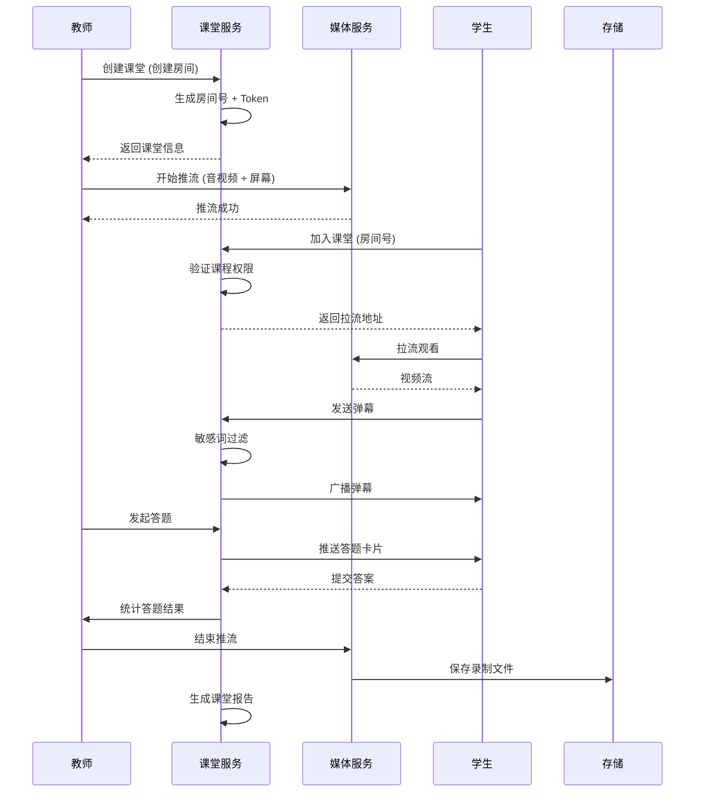
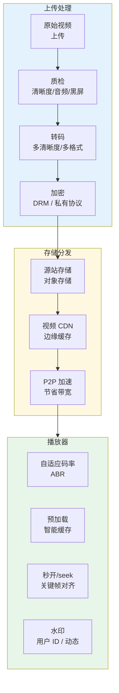
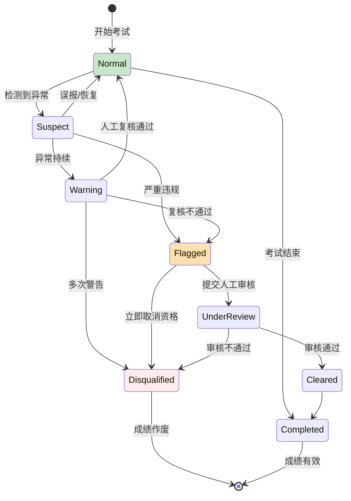

title: 在线教育平台 Kubernetes 生产架构设计
description: '# 在线教育平台 Kubernetes 生产架构设计'
category: application-architecture
tags:
- k8s
- architecture
- industry
- redis
- kafka
- hpa
- crd
- operator
- rag
last_updated: 2026-05-18
difficulty: advanced
reading_level: advanced
audience:
- 教育平台架构师
- 产品技术负责人
- SRE
estimated_read_time: 5min
intent_queries:
- 在线教育 Kubernetes 直播课堂
- 教育平台 RTC Kubernetes 部署
- 在线考试 防作弊 Kubernetes
- 互动白板 Kubernetes 实时同步
- 学习数据 推荐系统 K8s
trigger_keywords:
- 在线教育
- Kubernetes
- 直播课堂
- RTC
- 防作弊
- 互动白板
- 学习推荐
- Tekton
- HPA
related_domains:
- domain-01-cluster-fundamentals
- domain-11-production-operations
- domain-11-ai-infra
related_topics:
- [[domain-20-application-patterns/02-mini-program-architecture.md|02-mini-program-architecture]]
- [[domain-20-application-patterns/04-im-rtc-architecture.md|04-im-rtc-architecture]]
- 48-vocational-edtech
authors:
- name: KUDIG Team
  role: contributor
k8s_versions:
- '1.28'
- '1.29'
- '1.30'
- '1.31'
- '1.32'
---

# 在线教育平台 Kubernetes 生产架构设计

> **适用场景**: K12 教育 / 职业教育 / 企业培训 / 直播课堂 / 在线考试  
> **适用版本**: Kubernetes v1.29 - v1.33  
> **最后更新**: 2026-04-24  
> **目标读者**: 教育平台架构师、产品技术负责人

---

<!-- chunk: 📋 目录 -->## 📋 目录

- [一、整体架构全景](#一整体架构全景)
- [二、直播课堂架构](#二直播课堂架构)
- [三、录播课程架构](#三录播课程架构)
- [四、在线考试与防作弊架构](#四在线考试与防作弊架构)
- [五、互动白板架构](#五互动白板架构)
- [六、学习数据与推荐架构](#六学习数据与推荐架构)
- [七、内容安全与合规架构](#七内容安全与合规架构)
- [八、K8s 部署架构](#八k8s-部署架构)

---

<!-- chunk: 一、整体架构全景 -->## 一、整体架构全景

```mermaid
flowchart TB
    subgraph Users["用户角色"]
        STUDENT["学生<br/>听课/做题/互动"]
        TEACHER["教师<br/>授课/答疑/批改"]
        PARENT["家长<br/>督学/报告"]
        ADMIN["管理员<br/>课程/用户/数据"]
    end

    subgraph Frontend["前端层"]
        APP["移动 App<br/>iOS/Android"]
        WEB["Web 端<br/>PC/平板"]
        MINI["小程序<br/>轻量入口"]
        PAD["Pad 端<br/>大屏体验"]
    end

    subgraph Platform["平台服务层"]
        LIVE["直播服务<br/>RTC / CDN"]
        VOD["点播服务<br">转码/加密/播放"]
        CLASS["课堂服务<br/>签到/举手/答题"]
        EXAM["考试服务<br/>组卷/防作弊/批改"]
        WHITEBOARD["白板服务<br/>互动/录制"]
        MSG["消息服务<br/>IM / 通知"]
    end

    subgraph Business["业务中台"]
        COURSE["课程中心<br/>创建/管理/售卖"]
        USER["用户中心<br">注册/权限/画像"]
        ORDER["订单中心<br">支付/退款/对账"]
        DATA["数据中心<br">学习报告/分析"]
    end

    subgraph Infra["基础设施层"]
        DB[(数据库)]
        CACHE[(缓存)]
        OSS[(对象存储)]
        CDN[(CDN)]
    end

    Users --> Frontend --> Platform --> Business --> Infra

    style Platform fill:#e3f2fd
    style Business fill:#fff8e1
    style Infra fill:#e8f5e9
```

---

<!-- chunk: 二、直播课堂架构 -->## 二、直播课堂架构

```mermaid
flowchart TB
    subgraph Teacher["教师端"]
        T_CAMERA["摄像头<br/>1080P"]
        T_SCREEN["屏幕共享<br">课件/代码"]
        T_WHITEBOARD["白板<br">手写/标注"]
        T_CONTROL["课堂控制<br/>禁言/踢人/切换"]
    end

    subgraph MediaServer["媒体服务器"]
        INGEST["流接入<br/>RTMP / WebRTC"]
        TRANSCODE["实时转码<br">多清晰度"]
        RECORD["录制存储<br">MP4 / HLS"]
        MIX["混流<br">老师+学生+课件"]
    end

    subgraph Students["学生端"]
        S1["学生 1<br/>观看+聊天"]
        S2["学生 2<br/>连麦中"]
        S3["学生 3<br">观看"]
        S4["学生 N<br">观看"]
    end

    subgraph Interactive["互动层"]
        CHAT["弹幕/聊天<br/>文本/表情"]
        QUESTION["答题器<br/>选择题/判断题"]
        RAISE_HAND["举手<br/>连麦申请"]
        REWARD["奖励<br">虚拟礼物/积分"]
    end

    Teacher --> INGEST --> TRANSCODE --> Students
    INGEST --> RECORD --> OSS[(对象存储)]
    MIX --> TRANSCODE
    Students --> Interactive
    Interactive --> MediaServer

    style MediaServer fill:#e3f2fd
    style Interactive fill:#fff8e1
```

#<!-- chunk: 直播课堂时序 -->## 直播课堂时序



---

<!-- chunk: 三、录播课程架构 -->## 三、录播课程架构



#<!-- chunk: 视频加密 K8s 流水线 -->## 视频加密 K8s 流水线

```yaml
apiVersion: tekton.dev/v1beta1
kind: Pipeline
metadata:
  name: video-processing-pipeline
  namespace: edu-media
spec:
  workspaces:
    - name: source
  params:
    - name: video-url
      type: string
    - name: course-id
      type: string
  tasks:
    - name: download
      taskSpec:
        steps:
          - name: wget
            image: alpine
            script: |
              wget $(params.video-url) -O /workspace/source/video.mp4
      workspaces:
        - name: source
          workspace: source

    - name: inspect
      runAfter: [download]
      taskSpec:
        steps:
          - name: ffprobe
            image: jrottenberg/ffmpeg:latest
            script: |
              ffprobe -v error \
                -select_streams v:0 \
                -show_entries stream=width,height,bit_rate \
                -of csv /workspace/source/video.mp4
      workspaces:
        - name: source
          workspace: source

    - name: transcode
      runAfter: [inspect]
      taskSpec:
        steps:
          - name: ffmpeg
            image: jrottenberg/ffmpeg:latest
            script: |
              # 1080p
              ffmpeg -i /workspace/source/video.mp4 \
                -c:v libx264 -crf 23 -preset fast \
                -c:a aac -b:a 128k \
                -s 1920x1080 \
                /workspace/source/1080p.mp4
              # 720p
              ffmpeg -i /workspace/source/video.mp4 \
                -c:v libx264 -crf 26 -preset fast \
                -c:a aac -b:a 96k \
                -s 1280x720 \
                /workspace/source/720p.mp4
      workspaces:
        - name: source
          workspace: source

    - name: encrypt-and-upload
      runAfter: [transcode]
      taskSpec:
        steps:
          - name: encrypt
            image: edu/video-encryptor:v1.0
            script: |
              encrypt-video \
                --input /workspace/source/ \
                --output-prefix $(params.course-id) \
                --drm fairplay-widevine
          - name: upload
            image: ossutil:latest
            script: |
              ossutil cp -r /workspace/source/ \
                oss://edu-videos/courses/$(params.course-id)/
      workspaces:
        - name: source
          workspace: source
```

---

<!-- chunk: 四、在线考试与防作弊架构 -->## 四、在线考试与防作弊架构

```mermaid
flowchart TB
    subgraph ExamClient["考试客户端"]
        BROWSER["浏览器<br/>全屏锁定"]
        DESKTOP["桌面端<br">屏幕监控"]
        MOBILE["移动端<br">APP 监考"]
    end

    subgraph AntiCheat["防作弊系统"]
        FACE["人脸识别<br/>活体检测"]
        GAZE["视线追踪<br">异常行为"]
        AUDIO["音频监控<br">环境音检测"]
        SCREEN["屏幕监控<br">切屏检测"]
        PHONE["手机检测<br">第二设备"]
        IP["IP 检测<br">异地/代理"]
    end

    subgraph ExamServer["考试服务端"]
        PAPER["智能组卷<br/>随机抽题"]
        TIMER["倒计时<br/>时间控制"]
        ANSWER["答案管理<br/>客观题自动批改"]
        SCORE["成绩统计<br">分析/排名"]
    end

    ExamClient --> AntiCheat --> ExamServer

    style AntiCheat fill:#ffebee
    style ExamServer fill:#e3f2fd
```

#<!-- chunk: 防作弊检测状态机 -->## 防作弊检测状态机



---

<!-- chunk: 五、互动白板架构 -->## 五、互动白板架构

```mermaid
flowchart TB
    subgraph WhiteboardCore["白板核心"]
        CANVAS["Canvas 渲染<br/>2D / WebGL"]
        SYNC["实时同步<br">OT / CRDT"]
        HISTORY["历史记录<br">Undo/Redo"]
        EXPORT["导出<br">图片/PDF/SVG"]
    end

    subgraph Tools["工具层"]
        PEN["画笔<br">多种笔触"]
        SHAPE["几何图形<br">矩形/圆形/直线"]
        TEXT["文本<br">富文本/公式"]
        MEDIA["媒体<br">图片/视频嵌入"]
        LASER["激光笔<br">演示"]
    end

    subgraph Collaboration["协作层"]
        CURSOR["光标同步<br">多用户位置"]
        SELECT["选区<br">框选/移动"]
        LOCK["对象锁定<br">权限控制"]
        RECORD["录制回放<br">课堂还原"]
    end

    Tools --> WhiteboardCore --> Collaboration

    style WhiteboardCore fill:#e3f2fd
    style Collaboration fill:#e8f5e9
```

---

<!-- chunk: 六、学习数据与推荐架构 -->## 六、学习数据与推荐架构

```mermaid
flowchart TB
    subgraph DataCollection["数据采集"]
        WATCH["观看行为<br">进度/暂停/倍速"]
        INTERACT["互动行为<br">答题/讨论/笔记"]
        TEST["测验结果<br">正确率/用时"]
        ENGAGE["参与度<br">登录频次/时长"]
    end

    subgraph Processing["数据处理"]
        STREAM["流处理<br">Flink / Kafka Streams"]
        BATCH["批处理<br">Spark / Hive"]
        FEATURE["特征工程<br">用户画像/知识图谱"]
    end

    subgraph Intelligence["智能层"]
        KNOWLEDGE["知识图谱<br">概念/关联/难度"]
        RECOMMEND["推荐引擎<br">内容/路径/教师"]
        ADAPTIVE["自适应学习<br">动态调整难度"]
        PREDICT["学习预测<br">成绩/辍学风险"]
    end

    subgraph Output["输出应用"]
        REPORT["学情报告<br">家长/教师"]
        PATH["学习路径<br">个性化规划"]
        PUSH["内容推送<br">薄弱点强化"]
    end

    DataCollection --> Processing --> Intelligence --> Output

    style Processing fill:#e3f2fd
    style Intelligence fill:#fff8e1
    style Output fill:#e8f5e9
```

---

<!-- chunk: 七、内容安全与合规架构 -->## 七、内容安全与合规架构

```mermaid
flowchart TB
    subgraph ContentTypes["内容类型"]
        VIDEO["视频内容<br">直播/录播"]
        AUDIO["音频内容<br">语音/音乐"]
        TEXT["文本内容<br">弹幕/评论/笔记"]
        IMAGE["图片内容<br">头像/课件/截图"]
    end

    subgraph Detection["检测引擎"]
        ASR["语音识别<br">敏感词/违规"]
        OCR["文字识别<br">图片文字"]
        NLP["自然语言处理<br">语义分析"]
        CV["计算机视觉<br">色情/暴力/政治"]
    end

    subgraph Action["处置措施"]
        BLOCK["实时阻断<br">中断/下播"]
        REVIEW["人工复核<br">标注/确认"]
        WARN["警告提示<br">限流/降权"]
        RECORD["记录存档<br">追溯/报备"]
    end

    ContentTypes --> Detection --> Action

    style Detection fill:#ffebee
    style Action fill:#fff8e1
```

---

<!-- chunk: 八、K8s 部署架构 -->## 八、K8s 部署架构

```yaml
apiVersion: apps/v1
kind: Deployment
metadata:
  name: edu-live-classroom
  namespace: edu-platform
spec:
  replicas: 5
  selector:
    matchLabels:
      app: edu-live-classroom
  template:
    metadata:
      labels:
        app: edu-live-classroom
    spec:
      affinity:
        podAntiAffinity:
          requiredDuringSchedulingIgnoredDuringExecution:
            - labelSelector:
                matchExpressions:
                  - key: app
                    operator: In
                    values:
                      - edu-live-classroom
              topologyKey: kubernetes.io/hostname
      containers:
        - name: classroom
          image: edu/live-classroom:v2.0
          ports:
            - containerPort: 8080
            - containerPort: 9090
              name: grpc
          env:
            - name: RTC_SERVER_URL
              value: "wss://rtc.edu.com"
            - name: MAX_STUDENTS_PER_CLASS
              value: "500"
            - name: REDIS_URL
              value: "redis://redis-cluster:6379"
          resources:
            requests:
              cpu: "1"
              memory: "2Gi"
            limits:
              cpu: "4"
              memory: "8Gi"
---
# HPA 配置（根据在线课堂数扩缩容）
apiVersion: autoscaling/v2
kind: HorizontalPodAutoscaler
metadata:
  name: edu-live-hpa
  namespace: edu-platform
spec:
  scaleTargetRef:
    apiVersion: apps/v1
    kind: Deployment
    name: edu-live-classroom
  minReplicas: 3
  maxReplicas: 50
  metrics:
    - type: Pods
      pods:
        metric:
          name: active_classrooms
        target:
          type: AverageValue
          averageValue: "10"
    - type: Resource
      resource:
        name: cpu
        target:
          type: Utilization
          averageUtilization: 70
```

---

<!-- chunk: 参考链接 -->## 参考链接

- [声网 Agora 教育方案](https://www.agora.io/cn/solutions/education)
- [腾讯云 TRTC 教育](https://cloud.tencent.com/document/product/647/45458)
- [Kubernetes HPA 自定义指标](https://kubernetes.io/docs/tasks/run-application/horizontal-pod-autoscale/)

---

<!-- chunk: Obsidian 相关文档 -->## Obsidian 相关文档

- [[domain-20-application-patterns/topic-application-architecture/MOC.md|topic-application-architecture MOC]]
- [[domain-20-application-patterns/topic-application-architecture/README.md|Topic 应用层架构设计最佳实践]]
- [[domain-20-application-patterns/topic-application-architecture/01-ecommerce-architecture.md|电商系统 Kubernetes 生产架构设计]]
- [[domain-20-application-patterns/topic-application-architecture/02-mini-program-architecture.md|小程序平台架构设计]]
- [[domain-20-application-patterns/topic-application-architecture/03-cms-architecture.md|内容管理系统 CMS 架构设计]]
- [[domain-20-application-patterns/topic-application-architecture/04-im-rtc-architecture.md|实时通信 IM/RTC 架构设计]]
- [[domain-20-application-patterns/topic-application-architecture/06-fintech-architecture.md|金融科技FinTech Kubernetes生产架构设计]]
- [[domain-20-application-patterns/topic-application-architecture/07-iot-platform-architecture.md|物联网 IoT 平台架构设计]]
- [[domain-20-application-patterns/topic-application-architecture/08-ai-ml-inference-architecture.md|AI/ML 推理服务 Kubernetes 生产架构设计]]
- [[domain-20-application-patterns/topic-application-architecture/09-gaming-backend-architecture.md|游戏后端 Kubernetes 生产架构设计]]
- [[domain-20-application-patterns/topic-application-architecture/10-social-media-architecture.md|社交媒体平台Kubernetes生产架构设计]]
- [[domain-20-application-patterns/topic-application-architecture/11-smart-retail-architecture.md|智慧零售与新零售Kubernetes生产架构设计]]

## See Also

- [[domain-20-application-patterns/03-cms-architecture.md|03-cms-architecture]]
- [[domain-20-application-patterns/04-im-rtc-architecture.md|04-im-rtc-architecture]]
- [[domain-20-application-patterns/06-fintech-architecture.md|06-fintech-architecture]]
- [[domain-20-application-patterns/07-iot-platform-architecture.md|07-iot-platform-architecture]]
