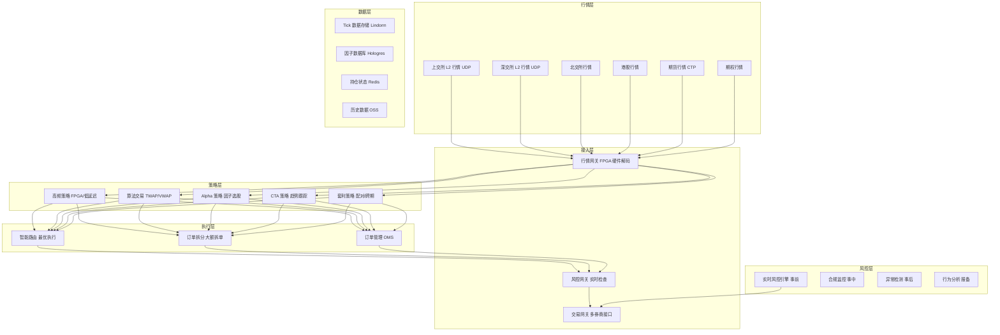
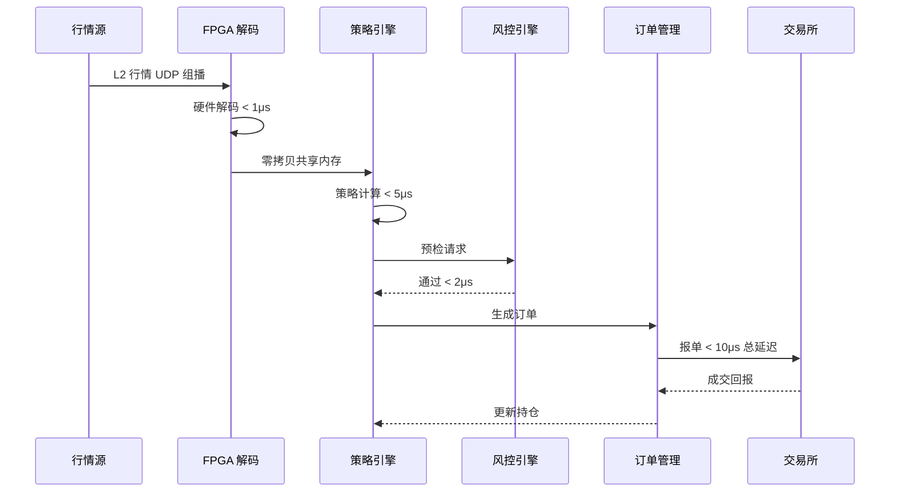
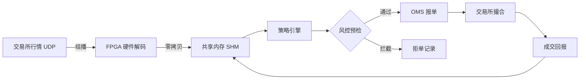

title: 证券量化交易架构设计
description: '# 证券量化交易架构设计 — 阿里云视角'
category: application-architecture
tags:
- k8s
- architecture
- industry
- [[Prometheus|prometheus]]
- grafana
- redis
- mysql
- kafka
- [[StatefulSet|statefulset]]
- [[DaemonSet|daemonset]]
last_updated: '2026-05-18'
difficulty: expert
reading_level: expert
audience:
- 量化交易架构师
- 金融科技开发者
- FPGA工程师
- 阿里云金融云架构师
estimated_read_time: 5min
intent_queries:
- 量化交易系统架构设计
- FPGA行情解码低延迟
- 高频交易策略引擎
- 实时风控引擎Flink
- Tick数据时序存储
trigger_keywords:
- 量化交易
- 高频交易
- HFT
- FPGA
- 低延迟
- 行情解码
- 策略引擎
- 风控
- Tick数据
- 做市
related_domains:
- domain-01-cluster-fundamentals
- domain-9-ai-ml
- domain-7-observability
- domain-03-networking-traffic
related_topics:
- domain-20-application-patterns/topic-application-architecture/58-web3-gamefi
- domain-20-application-patterns/topic-application-architecture/81-smart-customs
- domain-02-workloads-applications/topic-functions/04-high-concurrency-system
- domain-02-workloads-applications/topic-functions/03-observability-monitoring
authors:
- name: KUDIG Team
  role: contributor
k8s_versions:
- '1.28'
- '1.29'
- '1.30'
- '1.31'
- '1.32'
---

# 证券量化交易架构设计 — 阿里云视角

> **适用版本**: Kubernetes v1.29 - v1.33 | **最后更新**: 2026-04-24
> **作者**: 阿里云解决方案架构师 | **标签**: `#量化交易` `#低延迟` `#FPGA` `#高频交易` `#阿里云`

---

<!-- chunk: 目录 -->## 目录

1. [行业概述](#1-行业概述)
2. [业务场景](#2-业务场景)
3. [架构设计](#3-架构设计)
4. [核心技术栈](#4-核心技术栈)
5. [K8s 部署方案](#5-k8s-部署方案)
6. [数据架构](#6-数据架构)
7. [AI/ML 组件](#7-aiml-组件)
8. [安全合规](#8-安全合规)
9. [最佳实践](#9-最佳实践)
10. [反模式](#10-反模式)
11. [参考资源](#11-参考资源)

---

<!-- chunk: 1. 行业概述 -->## 1. 行业概述

#<!-- chunk: 1.1 行业背景 -->## 1.1 行业背景

量化交易是利用数学模型和计算机算法进行证券投资决策的交易方式，已成为全球资本市场的主流交易模式。美国市场中量化交易占比超过 70%，中国市场量化交易占比也在快速提升，已超过 25%。量化交易的核心优势在于：决策速度快（毫秒级响应）、情绪无干扰（规则化决策）、覆盖面广（全市场扫描）、回测可验证（策略历史表现量化评估）。

量化交易对信息系统的要求是所有金融场景中最为极致的：高频交易（HFT）端到端延迟要求 < 10μs（从行情接收到报单发出），需要 FPGA 硬件加速和内核旁路技术；算法交易（TWAP/VWAP）需要毫秒级策略计算和订单管理；策略回测需要海量历史数据处理（Tick 级数据数百亿条）和并行计算；实时风控需要每秒处理百万级事件并做出拦截决策。这些需求驱动着量化交易系统向硬件加速（FPGA/ASIC）、超低延迟网络（eRDMA/内核旁路）、分布式计算和高可用架构方向演进。

#<!-- chunk: 1.2 行业挑战 -->## 1.2 行业挑战

| 挑战 | 说明 | 架构影响 |
|:---|:---|:---|
| 超低延迟 | 高频交易端到端 < 10μs | FPGA/DPDK/内核旁路/共享内存 |
| 行情突发 | 开盘/收盘 10x 流量突增 | 弹性伸缩 + 预热 + 背压控制 |
| 策略保密 | 量化模型是核心资产，泄露损失巨大 | 代码加密 + 沙箱隔离 + 不落盘 |
| 回测数据量 | Tick 级历史数据数百亿条 | 分布式并行计算 + GPU 加速 |
| 合规风控 | 异常交易实时监控，闪崩熔断 | 流式计算 + 规则引擎 + 实时拦截 |
| 数据一致性 | 多市场/多品种持仓实时一致性 | 分布式事务 + 内存状态同步 |
| 监管趋严 | 证监会量化监管新规，报备要求 | 策略报备 + 交易行为监控 + 审计日志 |

#<!-- chunk: 1.3 市场格局 -->## 1.3 市场格局

中国量化私募管理规模已超过 1.5 万亿元，代表机构包括幻方量化、九坤投资、明汯投资、灵均投资等。量化交易技术服务商包括：恒生电子（交易系统）、迅投（XTP 交易接口）、艾扬软件（FPGA 行情解码）。阿里云金融云提供低延迟网络（eRDMA）、FPGA 实例（f3）、实时计算（Flink）等量化交易基础设施。国际上，Citadel Securities、Jump Trading、Two Sigma 等是量化交易和做市商的标杆。

---

<!-- chunk: 2. 业务场景 -->## 2. 业务场景

#<!-- chunk: 2.1 行情接收与处理 -->## 2.1 行情接收与处理

行情接收是量化交易系统的起点。中国 A 股市场提供 Level 1（快照行情，3 秒/5 档）和 Level 2（逐笔行情，毫秒级/10 档）两种行情数据。深交所和上交所的 Level 2 行情通过 UDP 组播分发，流量峰值可达 10 万笔/秒。高频策略需要在微秒级完成行情解码→策略计算→报单的全流程。FPGA 硬件解码是唯一能满足延迟要求的方案：L2 行情 UDP 组播→FPGA 硬件解码（< 1μs）→零拷贝共享内存→策略引擎读取。

#<!-- chunk: 2.2 策略执行 -->## 2.2 策略执行

策略执行引擎是量化交易的核心。策略类型包括：高频做市（双边报价赚取价差，持仓时间秒级）、统计套利（跨品种/跨期价差回归，持仓时间分钟级）、Alpha 策略（因子选股+量化组合优化，持仓时间天级）、CTA 策略（趋势跟踪/动量反转，持仓时间天-周级）、算法交易（大额订单拆分执行 TWAP/VWAP）。不同策略对延迟、吞吐、状态管理的要求差异极大。

#<!-- chunk: 2.3 实时风控 -->## 2.3 实时风控

交易行为实时监控与异常拦截是合规要求。风控引擎需要在每笔报单前进行检查：资金充足性检查（可用资金是否足够）、持仓限制检查（单票/行业/总持仓比例）、频率限制检查（撤单率/报单频率是否异常）、异常行为检测（自成交/幌骗/抢跑等违规模式）。风控引擎的延迟预算通常 < 5ms，不能成为交易链路的瓶颈。

#<!-- chunk: 2.4 策略回测 -->## 2.4 策略回测

历史数据策略验证是量化研究的基础。回测平台需要提供：Tick 级历史数据（数百亿条记录）、逐笔成交/委托数据、因子计算框架（技术指标/基本面因子/另类数据因子）、事件驱动回测引擎（模拟交易所撮合规则）、策略绩效分析（收益率/夏普比/最大回撤/换手率）。大规模回测需要分布式并行计算能力，将数年的 Tick 数据分片并行处理。

#<!-- chunk: 2.5 清算结算 -->## 2.5 清算结算

T+1 自动化清算处理。功能包括：成交回报处理、持仓成本计算（移动加权平均）、盈亏计算（已实现/未实现）、费用计算（佣金/印花税/过户费）、资金清算（可用/冻结/发生额）、对账（与券商/交易所数据核对）。清算系统需要保证数据的准确性和一致性，每笔交易的处理结果必须可审计。

---

<!-- chunk: 3. 架构设计 -->## 3. 架构设计

#<!-- chunk: 3.1 量化交易系统全景架构 -->## 3.1 量化交易系统全景架构



#<!-- chunk: 3.2 高频交易时序 -->## 3.2 高频交易时序



#<!-- chunk: 3.3 行情处理流水线 -->## 3.3 行情处理流水线



---

<!-- chunk: 4. 核心技术栈 -->## 4. 核心技术栈

| 类别 | 开源工具/技术 | 阿里云方案 | 说明 |
|:---|:---|:---|:---|
| 硬件加速 | FPGA, DPDK, RDMA | f3 FPGA 实例 + eRDMA | 超低延迟硬件加速 |
| 行情解码 | 自研/FPGA Bitstream | 阿里云金融云行情接入 | L2 行情硬件解码 |
| 低延迟通信 | Aeron, Chronicle Queue | 自研共享内存队列 | 进程间零拷贝通信 |
| 策略引擎 | 自研 C++/Rust | ACK + 低延迟节点池 | 策略计算核心 |
| 风控引擎 | Drools, 自研 | 实时计算 Flink + 规则引擎 | 实时风控拦截 |
| 回测框架 | Zipline, Backtrader | MaxCompute 分布式回测 | 海量历史数据回测 |
| 因子计算 | NumPy, Pandas, Polars | PAI-DSW + Hologres | 因子研究与计算 |
| 时序存储 | Arctic, QuestDB | Lindorm 时序引擎 | Tick 数据存储查询 |
| 实时分析 | Flink, Kafka Streams | 实时计算 Flink 版 | 实时行情/交易分析 |
| 订单管理 | 自研 OMS | ACK StatefulSet | 有状态订单管理 |
| 监控告警 | Prometheus, Grafana | ARMS + SLS | 全链路延迟监控 |

---

<!-- chunk: 5. K8s 部署方案 -->## 5. K8s 部署方案

#<!-- chunk: 5.1 行情处理 DaemonSet -->## 5.1 行情处理 DaemonSet

```yaml
apiVersion: apps/v1
kind: DaemonSet
metadata:
  name: market-data-processor
  namespace: quant
spec:
  selector:
    matchLabels:
      app: market-data-processor
  template:
    metadata:
      labels:
        app: market-data-processor
    spec:
      hostNetwork: true
      nodeSelector:
        hardware: fpga-alibaba-f3
      tolerations:
        - key: "dedicated"
          operator: "Equal"
          value: "fpga"
          effect: "NoSchedule"
      containers:
        - name: md-processor
          image: registry.cn-hangzhou.aliyuncs.com/quant/md-processor:v5.0.0
          securityContext:
            privileged: true
            capabilities:
              add: ["NET_ADMIN", "IPC_LOCK"]
          env:
            - name: FPGA_BITSTREAM_VERSION
              value: "v3.2-sh-sse-l2"
            - name: SHM_SIZE_BYTES
              value: "8589934592"
            - name: MULTICAST_GROUP
              value: "239.255.0.1"
          resources:
            requests:
              memory: "32Gi"
              cpu: "16000m"
              alibabacloud.com/fpga: 1
            limits:
              memory: "64Gi"
              cpu: "32000m"
              alibabacloud.com/fpga: 1
          volumeMounts:
            - name: hugepage
              mountPath: /dev/hugepages
            - name: fpga-bitstream
              mountPath: /fpga
      volumes:
        - name: hugepage
          emptyDir:
            medium: HugePages
        - name: fpga-bitstream
          configMap:
            name: fpga-bitstream-v3
```

#<!-- chunk: 5.2 策略执行 StatefulSet -->## 5.2 策略执行 StatefulSet

```yaml
apiVersion: apps/v1
kind: StatefulSet
metadata:
  name: strategy-engine
  namespace: quant
spec:
  serviceName: strategy-engine
  replicas: 2
  selector:
    matchLabels:
      app: strategy-engine
  template:
    metadata:
      labels:
        app: strategy-engine
    spec:
      nodeSelector:
        latency: ultra-low
      tolerations:
        - key: "dedicated"
          operator: "Equal"
          value: "quant-compute"
          effect: "NoSchedule"
      containers:
        - name: engine
          image: registry.cn-hangzhou.aliyuncs.com/quant/strategy-engine:v7.2.1
          ports:
            - containerPort: 8080
            - containerPort: 9090
              name: metrics
          env:
            - name: STRATEGY_MODE
              value: "production"
            - name: RISK_CHECK_URL
              value: "http://risk-engine:8080/pretrade"
            - name: SHARED_MEMORY_SIZE
              value: "8589934592"
            - name: ORDER_GATEWAY_URL
              value: "http://order-gateway:8080"
          resources:
            requests:
              memory: "64Gi"
              cpu: "32000m"
            limits:
              memory: "128Gi"
              cpu: "64000m"
          volumeMounts:
            - name: shared-mem
              mountPath: /dev/shm/strategy
      volumes:
        - name: shared-mem
          emptyDir:
            medium: Memory
            sizeLimit: 8Gi
```

#<!-- chunk: 5.3 实时风控引擎 -->## 5.3 实时风控引擎

```yaml
apiVersion: apps/v1
kind: Deployment
metadata:
  name: risk-engine
  namespace: quant
spec:
  replicas: 3
  selector:
    matchLabels:
      app: risk-engine
  template:
    metadata:
      labels:
        app: risk-engine
    spec:
      affinity:
        podAntiAffinity:
          requiredDuringSchedulingIgnoredDuringExecution:
            - labelSelector:
                matchExpressions:
                  - key: app
                    operator: In
                    values:
                      - risk-engine
              topologyKey: kubernetes.io/hostname
      containers:
        - name: risk
          image: registry.cn-hangzhou.aliyuncs.com/quant/risk-engine:v4.0.0
          ports:
            - containerPort: 8080
          env:
            - name: RULE_ENGINE_TYPE
              value: "drools"
            - name: REDIS_URL
              value: "redis://redis-cluster:6379"
            - name: MAX_LATENCY_US
              value: "2000"
          resources:
            requests:
              memory: "8Gi"
              cpu: "4000m"
            limits:
              memory: "16Gi"
              cpu: "8000m"
```

---

<!-- chunk: 6. 数据架构 -->## 6. 数据架构

#<!-- chunk: 6.1 数据分层 -->## 6.1 数据分层

| 数据类型 | 存储方案 | 保留策略 | 访问模式 | 数据量级 |
|:---|:---|:---|:---|:---|
| Tick 行情数据 | Lindorm 时序 | 5 年热 + 永久冷 | 超高频读写 | 百亿条 |
| 逐笔成交/委托 | Lindorm + OSS | 3 年热 + 永久冷 | 批量+实时 | 千亿条 |
| 因子数据 | Hologres | 3 年 | 交互式查询 | TB 级 |
| 持仓/资金 | Redis + PolarDB | 永久 | 超高频实时 | 内存级 |
| 策略参数 | PolarDB MySQL | 永久 | 低频读写 | GB 级 |
| 风控日志 | SLS | 10 年 | 写密集 | TB/天 |
| 审计日志 | OSS + SLS | 永久 | 写密集/低频读 | TB/月 |

---

<!-- chunk: 7. AI/ML 组件 -->## 7. AI/ML 组件

| AI 场景 | 模型/算法 | 输入 | 输出 | 说明 |
|:---|:---|:---|:---|:---|
| Alpha 因子挖掘 | 深度学习/遗传规划 | 量价/基本面/另类数据 | Alpha 因子 | 因子自动发现 |
| 波动率预测 | GARCH/LSTM | 历史波动率序列 | 未来波动率 | 期权定价/风控 |
| 订单流预测 | Transformer | Level 2 行情 | 短期价格方向 | HFT 信号 |
| 最优执行 | 强化学习 | 订单簿状态 | 执行策略 | 最小化滑点 |
| 异常交易检测 | Autoencoder + 规则 | 交易行为序列 | 异常告警 | 合规监控 |
| 组合优化 | 深度学习 + 优化器 | 因子暴露/约束 | 最优持仓权重 | 风险收益优化 |

---

<!-- chunk: 8. 安全合规 -->## 8. 安全合规

#<!-- chunk: 8.1 安全体系 -->## 8.1 安全体系

| 安全层级 | 措施 | 技术实现 |
|:---|:---|:---|
| 策略隔离 | 不同策略沙箱运行 | K8s Namespace + NetworkPolicy |
| 策略加密 | 策略代码加密存储运行 | AES-256 加密 + 内存解密 |
| 交易监控 | 异常交易行为实时告警 | Flink 实时计算 + 规则引擎 |
| 数据隔离 | 不同策略/团队数据隔离 | RBAC + 列级权限 + 加密 |
| 审计追踪 | 全链路操作不可篡改 | SLS 审计日志 + 区块链存证 |
| 网络安全 | 金融云 VPC 专用网络 | 专线 + VPC + 安全组 |

#<!-- chunk: 8.2 合规框架 -->## 8.2 合规框架

- **证券期货市场量化交易管理暂行规定**: 策略报备、风控要求、异常交易定义
- **等保三级**: 金融信息系统安全等级保护
- **证监会监管要求**: 自成交限制、撤单率限制、报备制度
- **交易所规则**: 报单频率限制、流量控制、异常交易处置

---

<!-- chunk: 9. 最佳实践 -->## 9. 最佳实践

- **硬件加速**: FPGA 行情解码 + eRDMA 低延迟网络 + HugePage 共享内存，三管齐下降低延迟
- **策略隔离**: 每个策略独立 Namespace 和资源配额，防止策略间信息泄露和资源竞争
- **回测可复现**: 使用版本控制管理策略代码和参数，DVC 管理历史数据版本，确保回测可复现
- **实时风控前置**: 风控引擎部署在交易链路上，每笔报单必须通过风控检查，延迟预算 < 5ms
- **弹性预热**: 开盘前预热 GPU 计算节点和策略引擎，应对开盘瞬间 10x 流量突增
- **灰度上线**: 新策略先在模拟环境测试，然后小仓位实盘验证，逐步放量

---

<!-- chunk: 10. 反模式 -->## 10. 反模式

#<!-- chunk: 10.1 风控旁路 -->## 10.1 风控旁路

风控引擎不部署在交易链路上，仅在事后审计检查。

**解决方案**: 风控引擎作为交易链路的必经环节（同步调用），每笔报单必须通过事前风控检查（资金/持仓/频率/异常行为）后才能发出。

#<!-- chunk: 10.2 忽视行情突发 -->## 10.2 忽视行情突发

系统按平均流量设计，开盘/收盘/重大消息发布时的流量突增导致系统崩溃。

**解决方案**: 行情处理采用背压控制机制，交易系统采用预热+弹性伸缩策略，开盘前将计算资源预热到峰值水平。

#<!-- chunk: 10.3 策略代码明文 -->## 10.3 策略代码明文

策略代码以明文形式存储在镜像和配置中，存在泄露风险。

**解决方案**: 策略代码编译后加密存储在镜像中，运行时内存解密不落盘。使用 Vault/KMS 管理加密密钥，镜像仓库启用加密存储。

---

<!-- chunk: 11. 参考资源 -->## 11. 参考资源

#<!-- chunk: 11.1 阿里云组件映射 -->## 11.1 阿里云组件映射

| 功能域 | 阿里云方案 | 说明 |
|:---|:---|:---|
| 容器平台 | **ACK Pro + FPGA 节点池** | 低延迟计算调度 |
| FPGA 加速 | **f3 实例** | L2 行情硬件解码 |
| 低延迟网络 | **eRDMA + 神龙架构** | 超低延迟网络通信 |
| 行情接入 | **金融云行情接入** | 交易所行情专线 |
| 实时计算 | **Flink + Hologres** | 实时风控/因子计算 |
| 时序存储 | **Lindorm** | Tick 数据存储查询 |
| 离线计算 | **MaxCompute** | 策略回测/因子研究 |
| AI 平台 | **PAI-DSW** | 因子挖掘/模型训练 |
| 对象存储 | **OSS** | 历史数据归档 |
| 可观测性 | **ARMS + SLS** | 全链路延迟监控 |
| 密钥管理 | **KMS + HSM** | 策略加密密钥管理 |

#<!-- chunk: 11.2 生产检查清单 -->## 11.2 生产检查清单

- [ ] FPGA bitstream 版本校验与回滚测试
- [ ] 行情端到端延迟 < 10μs 基准测试
- [ ] 交易时段零中断演练（切换/升级）
- [ ] 风控规则实时性与准确性验证
- [ ] 等保三级/证监会合规审计通过
- [ ] 策略隔离与数据安全测试
- [ ] 开盘流量突发压测（10x 峰值）
- [ ] 灾备切换 RTO < 30 秒验证

---

**维护者**: 阿里云解决方案架构师团队 | **许可证**: MIT

---

<!-- chunk: Obsidian 相关文档 -->## Obsidian 相关文档

- topic-application-architecture MOC
- [[domain-20-application-patterns/topic-application-architecture/README|Topic 应用层架构设计最佳实践]]
- [[domain-20-application-patterns/topic-application-architecture/01-ecommerce-architecture|电商系统 Kubernetes 生产架构设计]]
- [[domain-20-application-patterns/topic-application-architecture/02-mini-program-architecture|小程序平台架构设计]]
- [[domain-20-application-patterns/topic-application-architecture/03-cms-architecture|内容管理系统 CMS 架构设计]]
- [[domain-20-application-patterns/topic-application-architecture/04-im-rtc-architecture|实时通信 IM/RTC 架构设计]]
- [[domain-20-application-patterns/topic-application-architecture/05-online-education-architecture|在线教育平台 Kubernetes 生产架构设计]]
- [[domain-20-application-patterns/topic-application-architecture/06-fintech-architecture|金融科技FinTech Kubernetes生产架构设计]]
- [[domain-20-application-patterns/topic-application-architecture/07-iot-platform-architecture|物联网 IoT 平台架构设计]]
- [[domain-20-application-patterns/topic-application-architecture/08-ai-ml-inference-architecture|AI/ML 推理服务 Kubernetes 生产架构设计]]
- [[domain-20-application-patterns/topic-application-architecture/09-gaming-backend-architecture|游戏后端 Kubernetes 生产架构设计]]
- [[domain-20-application-patterns/topic-application-architecture/10-social-media-architecture|社交媒体平台Kubernetes生产架构设计]]

## See Also

- 23-xinchuang-it-innovation
- 24-insurtech
- 26-aviation-travel
- 27-hospitality-tourism
