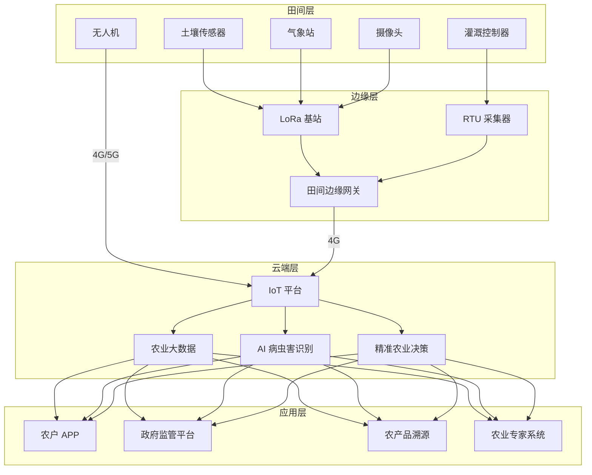
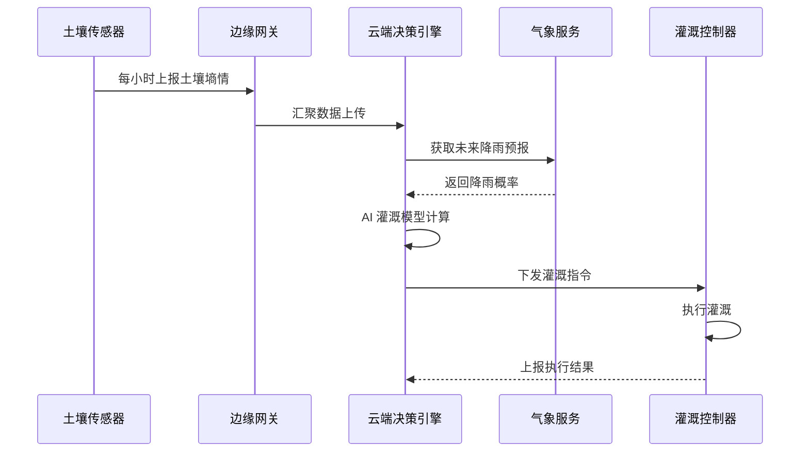
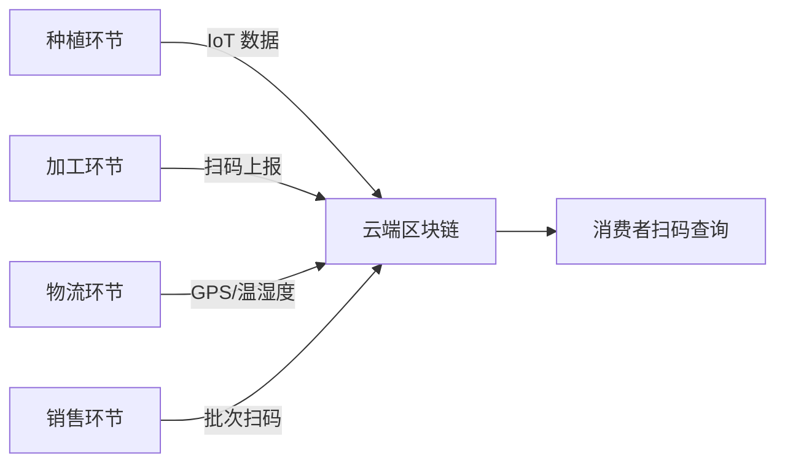

title: 农业物联网架构设计
description: '# 农业物联网架构设计 — 阿里云视角'
category: application-architecture
tags:
- k8s
- architecture
- industry
- mysql
- daemonset
- gateway
- operator
- agent
last_updated: '2026-05-18'
difficulty: advanced
reading_level: advanced
audience:
- 农业科技架构师
- IoT平台工程师
- 精准农业开发者
- 阿里云解决方案架构师
estimated_read_time: 5min
intent_queries:
- 农业物联网系统架构设计
- 智慧农业边缘网关K8s
- 精准灌溉AI决策
- 农产品溯源区块链
- 无人机植保系统
trigger_keywords:
- 农业物联网
- 智慧农业
- 精准农业
- LoRa
- 边缘网关
- 精准灌溉
- 溯源
- KubeEdge
- 无人机植保
- 农业大数据
related_domains:
- domain-01-cluster-fundamentals
- domain-5-iot-edge-computing
- domain-9-ai-ml
- domain-7-observability
related_topics:
- domain-20-application-patterns/topic-application-architecture/47-smart-mining
- domain-20-application-patterns/topic-application-architecture/12-smart-logistics-architecture
- domain-02-workloads-applications/topic-functions/05-iot-edge-computing
- domain-02-workloads-applications/topic-functions/09-data-security-privacy
authors:
- name: KUDIG Team
  role: contributor
k8s_versions:
- '1.28'
- '1.29'
- '1.30'
- '1.31'
- '1.32'
---

# 农业物联网架构设计 — 阿里云视角

> **适用版本**: Kubernetes v1.29 - v1.33 | **最后更新**: 2026-04-24
> **作者**: 阿里云解决方案架构师 | **标签**: `#农业物联网` `#智慧农业` `#精准农业` `#阿里云`

---

## 目录

1. [行业背景](#1-行业背景)
2. [业务架构](#2-业务架构)
3. [技术架构](#3-技术架构)
4. [核心数据流](#4-核心数据流)
5. [安全与合规](#5-安全与合规)
6. [可观测性](#6-可观测性)
7. [阿里云组件映射](#7-阿里云组件映射)
8. [生产检查清单](#8-生产检查清单)

---

## 1. 行业背景

### 1.1 业务特点

农业物联网面临环境复杂、网络覆盖差、设备分散等挑战：

| 挑战 | 说明 | 架构影响 |
|:---|:---|:---|
| 环境恶劣 | 田间高温高湿 | 工业级设备 + 边缘网关 |
| 网络覆盖 | 偏远地区 4G 弱 | 卫星通信 + LoRa |
| 设备分散 | 万亩农田设备分布 | 分区管理 + 边缘自治 |
| 数据低频 | 土壤数据小时级变化 | 低功耗采集 + 批量上报 |
| 季节性高峰 | 播种/收获期数据暴增 | 弹性伸缩 |

### 1.2 核心场景

- **环境监测**: 土壤墒情、气象、病虫害监测
- **精准灌溉**: 基于数据的智能水肥一体化
- **无人机植保**: 航线规划、施药量计算
- **农产品溯源**: 从田间到餐桌全链路追踪
- **智能温室**: 温湿度/光照/CO2 自动控制

---

## 2. 业务架构

### 2.1 智慧农业全景架构



### 2.2 精准灌溉决策流



---

## 3. 技术架构

### 3.1 K8s 部署

```yaml
# 农业 IoT 数据处理 Deployment
apiVersion: apps/v1
kind: Deployment
metadata:
  name: agri-iot-processor
  namespace: agritech
spec:
  replicas: 3
  selector:
    matchLabels:
      app: agri-iot-processor
  template:
    metadata:
      labels:
        app: agri-iot-processor
    spec:
      containers:
        - name: processor
          image: registry.cn-hangzhou.aliyuncs.com/agri/iot-processor:v1.5.0
          ports:
            - containerPort: 8080
          env:
            - name: MQTT_BROKER
              value: "mqtt://iot-platform:1883"
            - name: RULE_ENGINE_URL
              value: "http://rule-engine:8080"
          resources:
            requests:
              memory: "1Gi"
              cpu: "500m"
            limits:
              memory: "2Gi"
              cpu: "1000m"
```

```yaml
# 边缘节点 KubeEdge 配置
apiVersion: apps/v1
kind: DaemonSet
metadata:
  name: edge-gateway-agent
  namespace: agritech
spec:
  selector:
    matchLabels:
      app: edge-gateway-agent
  template:
    metadata:
      labels:
        app: edge-gateway-agent
    spec:
      hostNetwork: true
      nodeSelector:
        node-type: edge-gateway
      tolerations:
        - key: "dedicated"
          operator: "Equal"
          value: "edge"
          effect: "NoSchedule"
      containers:
        - name: edge-agent
          image: registry.cn-hangzhou.aliyuncs.com/agri/edge-agent:v1.0.0
          resources:
            requests:
              memory: "256Mi"
              cpu: "250m"
```

---

## 4. 核心数据流

### 4.1 农产品溯源数据流



---

## 5. 安全与合规

- **农产品安全**: 农药残留数据合规
- **数据安全**: 农户隐私保护
- **食品安全法**: 溯源数据不可篡改

---

## 6. 可观测性

- **传感器在线率**: > 95%
- **数据上报延迟**: < 5min
- **灌溉节水率**: > 20%

---

## 7. 阿里云组件映射

| 功能域 | **阿里云云原生方案** |
|:---|:---|
| 容器平台 | **ACK + ACK Edge** |
| IoT 平台 | **阿里云 IoT 平台** |
| 数据库 | **PolarDB MySQL + Lindorm** |
| 对象存储 | **OSS** |
| 实时计算 | **Flink** |
| AI | **PAI / 视觉智能** |
| 区块链 | **蚂蚁链 BaaS** |
| 可观测性 | **ARMS + SLS** |

---

## 8. 生产检查清单

- [ ] 田间网络覆盖测试
- [ ] 传感器数据校准验证
- [ ] 边缘网关离线自治测试
- [ ] 灌溉控制安全性验证
- [ ] 溯源数据上链完整性

---

**维护者**: 阿里云解决方案架构师团队 | **许可证**: MIT

---

## Obsidian 相关文档

- [[domain-20-application-patterns/topic-application-architecture/MOC.md|topic-application-architecture MOC]]
- [[domain-20-application-patterns/topic-application-architecture/README.md|Topic 应用层架构设计最佳实践]]
- [[domain-20-application-patterns/topic-application-architecture/01-ecommerce-architecture.md|电商系统 Kubernetes 生产架构设计]]
- [[domain-20-application-patterns/topic-application-architecture/02-mini-program-architecture.md|小程序平台架构设计]]
- [[domain-20-application-patterns/topic-application-architecture/03-cms-architecture.md|内容管理系统 CMS 架构设计]]
- [[domain-20-application-patterns/topic-application-architecture/04-im-rtc-architecture.md|实时通信 IM/RTC 架构设计]]
- [[domain-20-application-patterns/topic-application-architecture/05-online-education-architecture.md|在线教育平台 Kubernetes 生产架构设计]]
- [[domain-20-application-patterns/topic-application-architecture/06-fintech-architecture.md|金融科技FinTech Kubernetes生产架构设计]]
- [[domain-20-application-patterns/topic-application-architecture/07-iot-platform-architecture.md|物联网 IoT 平台架构设计]]
- [[domain-20-application-patterns/topic-application-architecture/08-ai-ml-inference-architecture.md|AI/ML 推理服务 Kubernetes 生产架构设计]]
- [[domain-20-application-patterns/topic-application-architecture/09-gaming-backend-architecture.md|游戏后端 Kubernetes 生产架构设计]]
- [[domain-20-application-patterns/topic-application-architecture/10-social-media-architecture.md|社交媒体平台Kubernetes生产架构设计]]

## See Also

- [[domain-20-application-patterns/27-hospitality-tourism.md|27-hospitality-tourism]]
- [[domain-20-application-patterns/28-proptech.md|28-proptech]]
- [[domain-20-application-patterns/30-hrtech-saas.md|30-hrtech-saas]]
- [[domain-20-application-patterns/31-instant-retail.md|31-instant-retail]]
