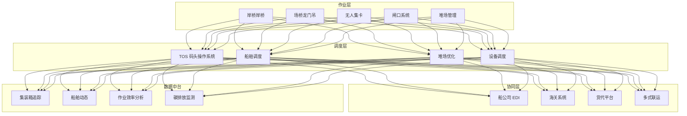
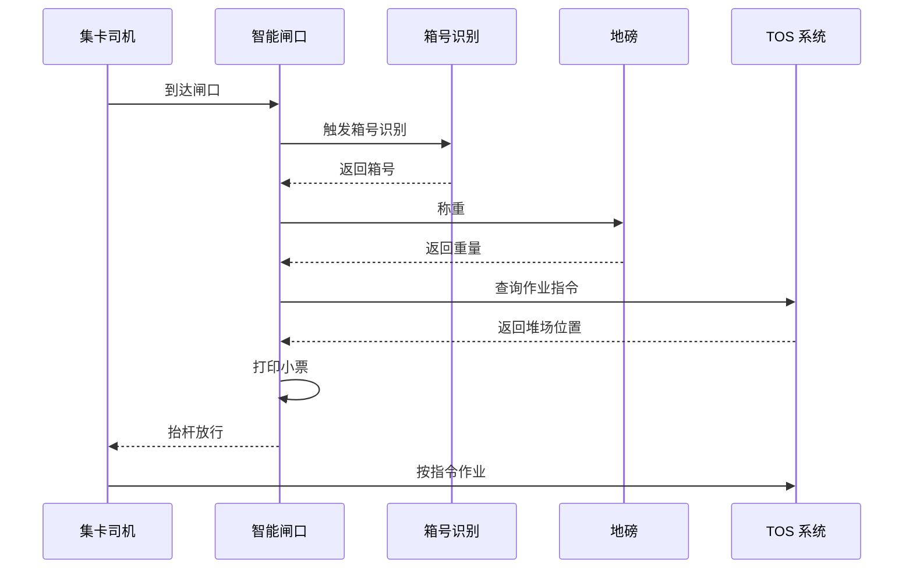
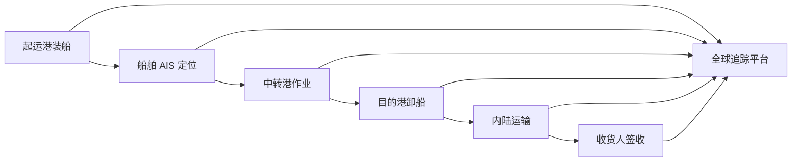

title: 智慧港口与航运架构设计
description: '# 智慧港口与航运架构设计 — 阿里云视角'
category: application-architecture
tags:
- k8s
- architecture
- industry
- [[DaemonSet|daemonset]]
last_updated: 2026-05-18
difficulty: advanced
reading_level: advanced
audience:
- 港口自动化架构师
- 物流系统工程师
- 云原生开发工程师
estimated_read_time: 5min
intent_queries:
- 智慧港口 TOS 系统 [[Kubernetes|Kubernetes]] 部署
- 集装箱码头自动化管理架构
- 无人集卡 AGV 调度系统
- 海关 EDI 电子数据交换
- 阿里云 ACK Edge 边缘计算港口
trigger_keywords:
- 智慧港口
- TOS码头操作系统
- 集装箱管理
- 无人集卡AGV
- 海关通关
- EDI数据交换
- 边缘计算
- 阿里云IoT
related_domains:
- domain-03-networking-traffic
- domain-10-troubleshooting-diagnostics
related_topics:
- topic-iot-platform-architecture
- topic-edge-computing
authors:
- name: KUDIG Team
  role: contributor
k8s_versions:
- '1.28'
- '1.29'
- '1.30'
- '1.31'
- '1.32'
---

# 智慧港口与航运架构设计 — 阿里云视角

> **适用版本**: Kubernetes v1.29 - v1.33 | **最后更新**: 2026-04-24
> **作者**: 阿里云解决方案架构师 | **标签**: `#智慧港口` `#航运` `#集装箱` `#阿里云`

---

## 目录

1. [行业背景](#1-行业背景)
2. [业务架构](#2-业务架构)
3. [技术架构](#3-技术架构)
4. [核心数据流](#4-核心数据流)
5. [安全与合规](#5-安全与合规)
6. [可观测性](#6-可观测性)
7. [阿里云组件映射](#7-阿里云组件映射)
8. [生产检查清单](#8-生产检查清单)

---

## 1. 行业背景

### 1.1 业务特点

智慧港口是航运物流的枢纽，涉及集装箱管理、船舶调度、海关通关：

| 挑战 | 说明 | 架构影响 |
|:---|:---|:---|
| 多系统协同 | TOS/海关/船公司/货代 | 数据交换平台 |
| 自动化作业 | 岸桥/场桥/无人集卡 | IoT + 边缘计算 |
| 全球追踪 | 集装箱全球位置追踪 | GPS + 卫星通信 |
| 海关合规 | 进出口申报与查验 | 电子口岸对接 |
| 环境监控 | 港口碳排放/噪音 | 环境监测 IoT |

### 1.2 核心场景

- **集装箱管理**: 箱位/状态/流转全程追踪
- **船舶调度**: 靠泊/装卸/离港计划优化
- **无人化作业**: 岸桥远程操控/无人集卡
- **海关通关**: 提前申报/智能审单/无感通关
- **多式联运**: 海铁/海陆联运衔接

---

## 2. 业务架构

### 2.1 智慧港口全景架构



### 2.2 集装箱进出闸时序



---

## 3. 技术架构

### 3.1 K8s 部署

```yaml
# TOS 核心服务 Deployment
apiVersion: apps/v1
kind: Deployment
metadata:
  name: tos-core
  namespace: smart-port
spec:
  replicas: 5
  selector:
    matchLabels:
      app: tos-core
  template:
    metadata:
      labels:
        app: tos-core
    spec:
      containers:
        - name: tos
          image: registry.cn-hangzhou.aliyuncs.com/port/tos-core:v4.0.0
          ports:
            - containerPort: 8080
          env:
            - name: YARD_OPTIMIZATION
              value: "enabled"
            - name: VESSEL_SCHEDULE_API
              value: "http://vessel-schedule:8080"
          resources:
            requests:
              memory: "4Gi"
              cpu: "2000m"
            limits:
              memory: "8Gi"
              cpu: "4000m"
```

```yaml
# 边缘节点无人集卡控制 DaemonSet
apiVersion: apps/v1
kind: DaemonSet
metadata:
  name: agv-controller
  namespace: smart-port
spec:
  selector:
    matchLabels:
      app: agv-controller
  template:
    metadata:
      labels:
        app: agv-controller
    spec:
      hostNetwork: true
      nodeSelector:
        node-type: edge-port
      containers:
        - name: controller
          image: registry.cn-hangzhou.aliyuncs.com/port/agv-controller:v2.0.0
          resources:
            requests:
              memory: "1Gi"
              cpu: "1000m"
```

---

## 4. 核心数据流

### 4.1 集装箱全球追踪



---

## 5. 安全与合规

- **作业安全**: 港口作业人员安全监控
- **海关合规**: 进出口数据准确申报
- **网络安全**: 港口关键基础设施保护

---

## 6. 可观测性

- **闸口通过时间**: < 30s
- **岸桥作业效率**: > 35 箱/小时
- **系统可用性**: 99.9%

---

## 7. 阿里云组件映射

| 功能域 | **阿里云云原生方案** |
|:---|:---|
| 容器平台 | **ACK Pro + ACK Edge** |
| IoT | **阿里云 IoT 平台** |
| 数据库 | **PolarDB + Lindorm** |
| 实时计算 | **Flink** |
| AI | **PAI / 视觉智能** |
| 对象存储 | **OSS** |
| 可观测性 | **ARMS + SLS** |
| 数字孪生 | **DataV** |

---

## 8. 生产检查清单

- [ ] 闸口自动化识别准确率 > 99%
- [ ] 无人集卡安全测试
- [ ] 海关 EDI 对接验证
- [ ] 集装箱追踪数据完整性
- [ ] 港口关键基础设施等保

---

**维护者**: 阿里云解决方案架构师团队 | **许可证**: MIT

---

## Obsidian 相关文档

- topic-application-architecture KUDIG Database — Global MOC
- [[domain-20-application-patterns/topic-application-architecture/README.md|Topic 应用层架构设计最佳实践]]
- [[domain-20-application-patterns/topic-application-architecture/01-ecommerce-architecture.md|电商系统 Kubernetes 生产架构设计]]
- [[domain-20-application-patterns/topic-application-architecture/02-mini-program-architecture.md|小程序平台架构设计]]
- [[domain-20-application-patterns/topic-application-architecture/03-cms-architecture.md|内容管理系统 CMS 架构设计]]
- [[domain-20-application-patterns/topic-application-architecture/04-im-rtc-architecture.md|实时通信 IM/RTC 架构设计]]
- [[domain-20-application-patterns/topic-application-architecture/05-online-education-architecture.md|在线教育平台 Kubernetes 生产架构设计]]
- [[domain-20-application-patterns/topic-application-architecture/06-fintech-architecture.md|金融科技FinTech Kubernetes生产架构设计]]
- [[domain-20-application-patterns/topic-application-architecture/07-iot-platform-architecture.md|物联网 IoT 平台架构设计]]
- [[domain-20-application-patterns/topic-application-architecture/08-ai-ml-inference-architecture.md|AI/ML 推理服务 Kubernetes 生产架构设计]]
- [[domain-20-application-patterns/topic-application-architecture/09-gaming-backend-architecture.md|游戏后端 Kubernetes 生产架构设计]]
- [[domain-20-application-patterns/topic-application-architecture/10-social-media-architecture.md|社交媒体平台Kubernetes生产架构设计]]

## See Also

- 43-enterprise-im
- 44-martech-adtech
- 46-satellite-internet
- 47-smart-mining
