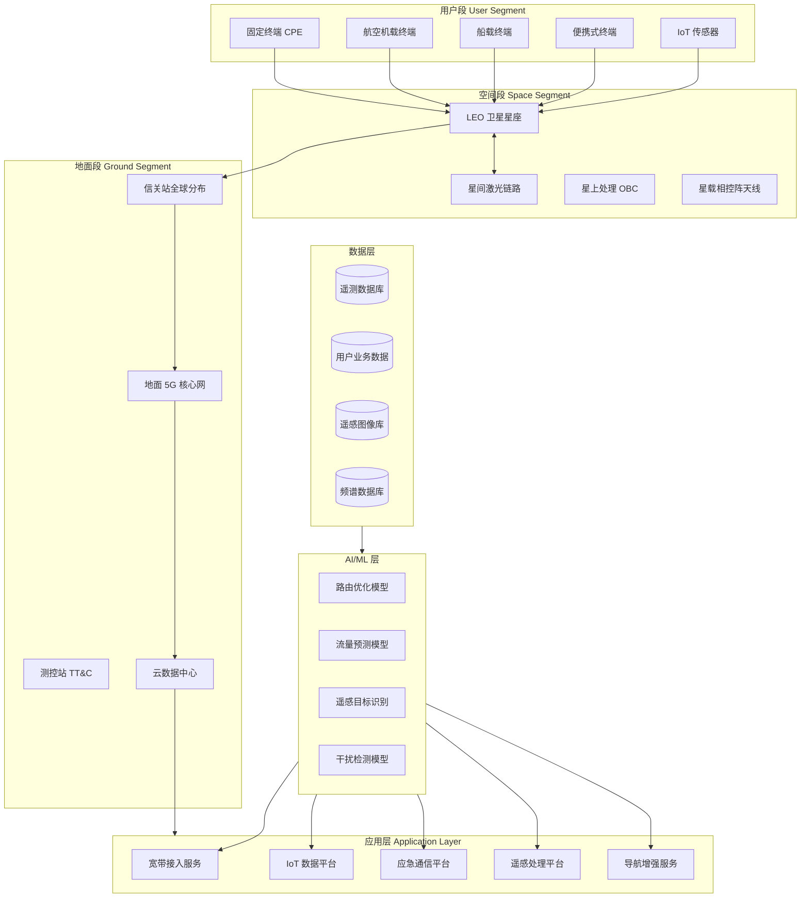
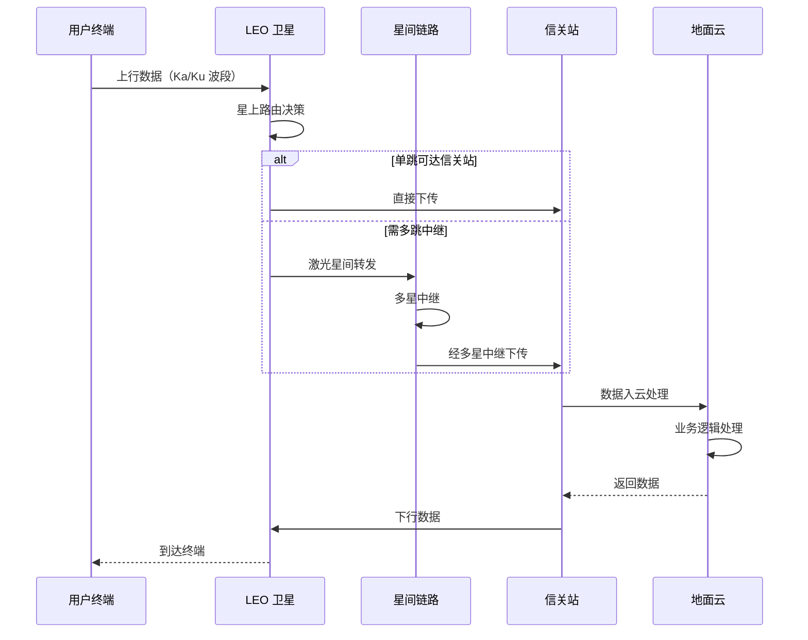
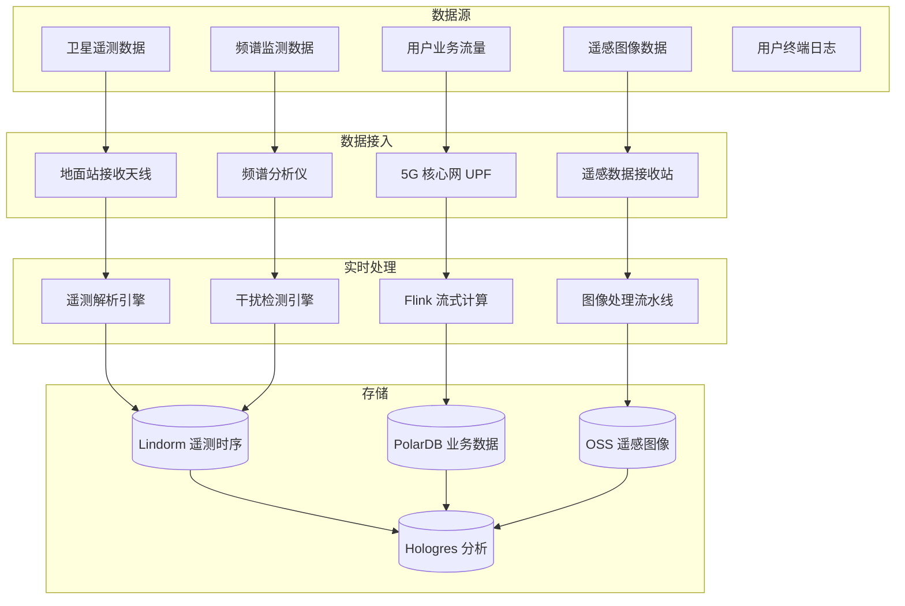
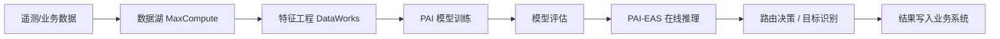

title: 卫星互联网架构设计
description: '# 卫星互联网架构设计 — 阿里云视角'
category: application-architecture
tags:
- k8s
- architecture
- industry
- [[Prometheus|prometheus]]
- grafana
- opa
- postgresql
- kafka
- operator
- gpu
last_updated: 2026-05-18
difficulty: advanced
reading_level: advanced
audience:
- 卫星通信架构师
- 遥感数据处理工程师
- 卫星物联网开发者
- 阿里云大数据解决方案架构师
estimated_read_time: 5min
intent_queries:
- 低轨卫星 LEO 星座 [[Kubernetes|Kubernetes]] 部署
- 卫星遥感数据处理 GPU 集群架构
- 卫星物联网 IoT 数据采集架构
- TLE 轨道预测数据处理
- 卫星网络仿真与地面站部署
trigger_keywords:
- 卫星互联网
- 低轨卫星
- LEO
- 遥感数据
- 卫星物联网
- 轨道预测
- 地面站
- 星间链路
- 卫星通信
- 天地一体
related_domains:
- domain-7-ai-ml-platform
- domain-03-networking-traffic
- domain-12-observability-comprehensive
- domain-5-edge-computing
related_topics:
- domain-20-application-patterns/topic-application-architecture/66-space-internet
- domain-20-application-patterns/topic-application-architecture/72-digital-twin-city
authors:
- name: KUDIG Team
  role: contributor
k8s_versions:
- '1.28'
- '1.29'
- '1.30'
- '1.31'
- '1.32'
---

# 卫星互联网架构设计 — 阿里云视角

> **适用版本**: Kubernetes v1.29 - v1.33 | **最后更新**: 2026-05-18
> **作者**: 阿里云解决方案架构师 | **标签**: `#卫星互联网` `#低轨卫星` `#天地一体` `#阿里云`

---

<!-- chunk: 目录 -->## 目录

1. [行业概述](#1-行业概述)
2. [业务场景](#2-业务场景)
3. [架构设计](#3-架构设计)
4. [核心技术栈](#4-核心技术栈)
5. [Kubernetes 部署方案](#5-kubernetes-部署方案)
6. [数据架构](#6-数据架构)
7. [AI/ML 组件](#7-aiml-组件)
8. [安全与合规](#8-安全与合规)
9. [最佳实践](#9-最佳实践)
10. [反模式](#10-反模式)
11. [参考资源](#11-参考资源)

---

<!-- chunk: 1. 行业概述 -->## 1. 行业概述

#<!-- chunk: 1.1 市场规模与趋势 -->## 1.1 市场规模与趋势

卫星互联网通过低轨（LEO）卫星星座提供全球覆盖的宽带通信服务，是 6G 天地一体化网络的核心组成部分。全球市场规模预计从 2024 年的 180 亿美元增长到 2030 年的 650 亿美元。Starlink 已部署超过 6000 颗卫星，中国星网（GW）计划部署约 13000 颗卫星，OneWeb、Amazon Kuiper 等也在加速布局。

| 指标 | 2024 年 | 2026 年（预测） | 2030 年（预测） |
|:---|:---|:---|:---|
| 全球 LEO 卫星数量 | ~8000 颗 | ~15000 颗 | ~50000 颗 |
| 市场规模 | $18B | $35B | $65B |
| 单星带宽 | 20 Gbps | 50 Gbps | 200 Gbps |
| 端到端延迟 | 40-60 ms | 20-40 ms | 10-20 ms |
| 用户终端成本 | $500-1000 | $200-500 | $100-200 |

#<!-- chunk: 1.2 行业痛点 -->## 1.2 行业痛点

| 痛点 | 说明 | 数字化转型驱动 |
|:---|:---|:---|
| 高动态拓扑 | 卫星以 7.5 km/s 运动，切换频繁 | 快速路由收敛算法 + AI 预测 |
| 长距离传输 | 星地距离 500-2000 km | 协议优化 + 边缘缓存 |
| 带宽受限 | 单星容量有限，用户密度不均 | 智能流量调度 + 压缩 |
| 覆盖连续 | 极地/海洋/沙漠无地面站覆盖 | 多星协同 + 星间链路 |
| 地面站分布 | 全球地面站网络运维复杂 | 云原生地面站管理平台 |
| 频谱管理 | 国际电联频谱协调复杂 | 数字化频谱管理平台 |

#<!-- chunk: 1.3 数字化转型架构影响 -->## 1.3 数字化转型架构影响

卫星互联网系统涉及空间段（卫星星座）、地面段（信关站/测控站/核心网）、用户段（终端设备）和运营支撑（计费/客服/网络管理）。架构需要支持全球分布式部署、高动态网络拓扑、海量遥测数据处理和实时业务编排。

---

<!-- chunk: 2. 业务场景 -->## 2. 业务场景

#<!-- chunk: 2.1 宽带接入服务 -->## 2.1 宽带接入服务

为偏远地区、海洋、航空提供高速互联网接入。用户终端通过卫星链路接入信关站，再经地面核心网连接互联网。系统需支持数千用户共享单星带宽，通过动态带宽分配和 QoS 策略保障服务质量。典型场景包括远洋航运、沙漠油田、偏远村落和航空机载 WiFi。

#<!-- chunk: 2.2 全球物联网数据采集 -->## 2.2 全球物联网数据采集

通过卫星窄带 IoT（NB-IoT over Satellite）采集全球范围内的传感器数据，应用于气象监测、海洋浮标、野生动物追踪、远洋渔业、管道监控等场景。终端功耗低，支持单次充电运行数月。

#<!-- chunk: 2.3 应急通信保障 -->## 2.3 应急通信保障

在地震、洪水、战争等地面通信基础设施损毁的灾害场景下，通过卫星互联网提供应急通信能力。系统需支持快速部署便携式信关站和终端，提供语音、数据和视频通信服务。

#<!-- chunk: 2.4 导航增强与高精度定位 -->## 2.4 导航增强与高精度定位

通过 LEO 卫星广播增强信号，提升 GNSS 定位精度至厘米级。应用于自动驾驶、精准农业、测绘工程、智能交通等领域。系统需要毫秒级时间同步和全球覆盖能力。

#<!-- chunk: 2.5 遥感数据传输与处理 -->## 2.5 遥感数据传输与处理

卫星遥感图像从卫星下传至地面站后，需要进行辐射校正、几何校正、目标识别等处理。单颗遥感卫星每日产生 TB 级数据，需要高性能并行处理流水线和 AI 目标检测能力。

---

<!-- chunk: 3. 架构设计 -->## 3. 架构设计

#<!-- chunk: 3.1 卫星互联网全景架构 -->## 3.1 卫星互联网全景架构



#<!-- chunk: 3.2 卫星数据传输时序 -->## 3.2 卫星数据传输时序



---

<!-- chunk: 4. 核心技术栈 -->## 4. 核心技术栈

| Component | Purpose | Technology | License |
|:---|:---|:---|:---|
| Container Orchestration | Ground station workload management | ACK Pro (Kubernetes 1.29+) | Proprietary |
| Stream Processing | Real-time telemetry & traffic | Apache Flink 1.18+ | Apache 2.0 |
| Batch Processing | Remote sensing image pipeline | MaxCompute / Apache Spark | Proprietary / Apache 2.0 |
| AI Platform | Route optimization & image analysis | PAI / PyTorch 2.x | Proprietary / BSD |
| Time-Series DB | Satellite telemetry storage | Lindorm TSDB | Proprietary |
| Relational DB | Business & subscriber data | PolarDB PostgreSQL | Proprietary |
| Object Storage | Remote sensing images & logs | Aliyun OSS | Proprietary |
| Message Queue | Event-driven telemetry pipeline | Apache RocketMQ 5.x | Apache 2.0 |
| CDN | Content delivery & acceleration | Aliyun DCDN | Proprietary |
| GIS Engine | Geospatial analysis & mapping | Aliyun GIS / PostGIS | Proprietary / PostgreSQL |
| Network Simulator | Satellite network simulation | NS-3 / STK | GPL / Proprietary |
| Monitoring | End-to-end observability | ARMS + SLS + Grafana | Proprietary / Apache 2.0 |
| DNS | Global DNS resolution | Aliyun DNS | Proprietary |

---

<!-- chunk: 5. Kubernetes 部署方案 -->## 5. Kubernetes 部署方案

#<!-- chunk: 5.1 卫星数据处理 Deployment -->## 5.1 卫星数据处理 Deployment

```yaml
apiVersion: apps/v1
kind: Deployment
metadata:
  name: satellite-data-processor
  namespace: satellite
  labels:
    app: satellite-data-processor
    tier: backend
spec:
  replicas: 5
  selector:
    matchLabels:
      app: satellite-data-processor
  strategy:
    rollingUpdate:
      maxSurge: 2
      maxUnavailable: 1
  template:
    metadata:
      labels:
        app: satellite-data-processor
        tier: backend
      annotations:
        prometheus.io/scrape: "true"
        prometheus.io/port: "9090"
    spec:
      affinity:
        podAntiAffinity:
          requiredDuringSchedulingIgnoredDuringExecution:
            - labelSelector:
                matchLabels:
                  app: satellite-data-processor
              topologyKey: topology.kubernetes.io/zone
      nodeSelector:
        region: ground-station
        node-pool: data-processor
      tolerations:
        - key: "dedicated"
          operator: "Equal"
          value: "satellite"
          effect: "NoSchedule"
      containers:
        - name: processor
          image: registry.cn-hangzhou.aliyuncs.com/satellite/data-processor:v2.1.0
          ports:
            - containerPort: 8080
              name: http
            - containerPort: 9090
              name: metrics
          env:
            - name: SATELLITE_TLE_PATH
              value: "/data/tle"
            - name: GROUND_STATION_ID
              value: "GS-BEIJING-01"
            - name: PROCESSING_MODE
              value: "realtime"
            - name: KAFKA_BOOTSTRAP
              valueFrom:
                configMapKeyRef:
                  name: satellite-config
                  key: kafka-bootstrap
            - name: DB_PASSWORD
              valueFrom:
                secretKeyRef:
                  name: satellite-secrets
                  key: db-password
          resources:
            requests:
              memory: "8Gi"
              cpu: "4000m"
            limits:
              memory: "16Gi"
              cpu: "8000m"
          readinessProbe:
            httpGet:
              path: /health/ready
              port: 8080
            initialDelaySeconds: 15
            periodSeconds: 10
          livenessProbe:
            httpGet:
              path: /health/live
              port: 8080
            initialDelaySeconds: 30
            periodSeconds: 15
          volumeMounts:
            - name: tle-data
              mountPath: /data/tle
              readOnly: true
            - name: processing-tmp
              mountPath: /tmp/processing
      volumes:
        - name: tle-data
          configMap:
            name: satellite-tle
        - name: processing-tmp
          emptyDir:
            medium: "Memory"
            sizeLimit: "8Gi"
```

#<!-- chunk: 5.2 遥感图像处理 GPU Deployment -->## 5.2 遥感图像处理 GPU Deployment

```yaml
apiVersion: apps/v1
kind: Deployment
metadata:
  name: remote-sensing-gpu
  namespace: satellite
spec:
  replicas: 3
  selector:
    matchLabels:
      app: remote-sensing-gpu
  template:
    metadata:
      labels:
        app: remote-sensing-gpu
    spec:
      nodeSelector:
        accelerator: nvidia-a10
      runtimeClassName: nvidia
      containers:
        - name: rs-processor
          image: registry.cn-hangzhou.aliyuncs.com/satellite/rs-gpu:v2.0.0
          ports:
            - containerPort: 8080
          env:
            - name: MODEL_PATH
              value: "/models/yolov8-remote-sensing"
            - name: GPU_MEMORY_LIMIT
              value: "12Gi"
            - name: BATCH_SIZE
              value: "8"
          resources:
            requests:
              nvidia.com/gpu: 1
              memory: "16Gi"
              cpu: "8000m"
            limits:
              nvidia.com/gpu: 1
              memory: "24Gi"
              cpu: "16000m"
```

#<!-- chunk: 5.3 ConfigMap 与 Service -->## 5.3 ConfigMap 与 Service

```yaml
apiVersion: v1
kind: ConfigMap
metadata:
  name: satellite-config
  namespace: satellite
data:
  kafka-bootstrap: "kafka-cluster.satellite.svc.cluster.local:9092"
  tle-update-interval: "300s"
  orbit-prediction-window: "3600s"
  max-handover-delay-ms: "50"
  ground-stations: |
    [
      {"id": "GS-BEIJING-01", "lat": 39.9, "lon": 116.4, "bands": ["Ka", "Ku"]},
      {"id": "GS-SHANGHAI-01", "lat": 31.2, "lon": 121.5, "bands": ["Ka", "Ku"]},
      {"id": "GS-KASHGAR-01", "lat": 39.5, "lon": 76.0, "bands": ["Ka"]}
    ]
  frequency-plan: |
    {
      "uplink_GHz": {"Ka": "29.5-30.0", "Ku": "14.0-14.5"},
      "downlink_GHz": {"Ka": "19.7-20.2", "Ku": "11.7-12.2"},
      "max_eirp_dbw": 55,
      "bandwidth_MHz": 500
    }
---
apiVersion: v1
kind: Service
metadata:
  name: satellite-data-processor
  namespace: satellite
spec:
  selector:
    app: satellite-data-processor
  ports:
    - name: http
      port: 8080
      targetPort: 8080
    - name: metrics
      port: 9090
      targetPort: 9090
  type: ClusterIP
---
apiVersion: v1
kind: Secret
metadata:
  name: satellite-secrets
  namespace: satellite
type: Opaque
stringData:
  db-password: "encrypted-password-placeholder"
  encryption-key: "aes-256-gcm-key-placeholder"
  satellite-control-key: "control-channel-key-placeholder"
```

---

<!-- chunk: 6. 数据架构 -->## 6. 数据架构

#<!-- chunk: 6.1 数据流全景 -->## 6.1 数据流全景



#<!-- chunk: 6.2 数据流说明 -->## 6.2 数据流说明

- **遥测数据**: 卫星以 1Hz 频率上报轨道参数、温度、功率等遥测数据，经地面站接收后实时写入 Lindorm 时序库
- **业务数据**: 用户上网流量经 5G 核心网 UPF 转发，元数据用于计费和 QoS 分析
- **遥感数据**: 单次过境可产生 100GB+ 图像数据，经辐射/几何校正后存入 OSS
- **频谱数据**: 实时监测各频段干扰情况，用于动态频谱分配和干扰源定位

---

<!-- chunk: 7. AI/ML 组件 -->## 7. AI/ML 组件

#<!-- chunk: 7.1 核心模型 -->## 7.1 核心模型

| 模型 | 用途 | 输入 | 输出 | 框架 |
|:---|:---|:---|:---|:---|
| 路由优化 | 星间/星地路由决策 | 拓扑状态 / 业务需求 | 最优路径 | DRL (PPO) |
| 流量预测 | 用户带宽需求预测 | 历史流量 / 位置 | 预测带宽需求 | LSTM |
| 遥感目标识别 | 地面目标自动识别 | 卫星图像 | 目标类别 + 位置 | YOLOv8 / SAM |
| 干扰检测 | 频谱干扰检测 | 频谱数据 | 干扰类型 + 定位 | CNN + Attention |
| 手over 预测 | 卫星切换时机预测 | 轨道参数 / 信号强度 | 切换时间 + 目标卫星 | GNN |
| 轨道预测 | 卫星轨道精确预测 | TLE / 遥测数据 | 轨道预报 | Kalman Filter + NN |

#<!-- chunk: 7.2 模型训练与推理 -->## 7.2 模型训练与推理



---

<!-- chunk: 8. 安全与合规 -->## 8. 安全与合规

#<!-- chunk: 8.1 行业法规与标准 -->## 8.1 行业法规与标准

| 法规/标准 | 适用范围 | 架构要求 |
|:---|:---|:---|
| ITU Radio Regulations | 国际频率协调 | 频谱管理系统 |
| 3GPP NTN | 非地面网络标准 | 5G NTN 协议栈 |
| CCSDS | 空间数据系统标准 | 遥测遥控协议 |
| 等保三级 | 电信基础设施安全 | 网络隔离 + 审计 |
| GDPR / PIPL | 用户数据隐私保护 | 数据脱敏 + 加密 |
| WRC 决议 | 世界无线电通信大会决议 | 频段合规管理 |
| 空间碎片减缓 | 轨道安全 | 碰撞预警系统 |

#<!-- chunk: 8.2 安全架构要点 -->## 8.2 安全架构要点

- **通信加密**: 星地链路采用 AES-256 加密，防止信号拦截和伪造
- **指令认证**: 卫星遥控指令需要数字签名验证，防止恶意操控
- **频谱安全**: 实时监测异常信号，定位并排除干扰源
- **数据安全**: 用户通信数据端到端加密，符合各国数据本地化要求
- **空间安全**: 轨道碰撞预警系统，自动规避空间碎片

---

<!-- chunk: 9. 最佳实践 -->## 9. 最佳实践

1. **多信关站负载均衡**: 全球部署多个信关站，根据卫星位置和信关站负载智能选择最优下行站，避免单站拥塞
2. **边缘缓存**: 在信关站侧缓存热门内容（视频/网页），减少回传带宽需求
3. **自适应编码调制（ACM）**: 根据天气和链路质量动态调整调制方式，雨衰时自动降级保障连通性
4. **星上处理卸载**: 将部分计算任务卸载至星上处理器（OBC），减少对地面站处理能力的依赖
5. **TLE 数据实时更新**: 每隔 5 分钟更新卫星轨道参数（TLE），保障路由计算的准确性
6. **分级 QoS 策略**: 对不同业务类型（语音/视频/数据/IoT）实施差异化 QoS 保障
7. **全球分布式部署**: 信关站和数据节点就近部署，降低回传延迟
8. **遥感数据分级存储**: 原始数据存 OSS 归档，处理后产品存标准 OSS，检索元数据存 PolarDB
9. **频谱动态共享**: 利用 AI 预测频谱使用模式，实现同频段多系统动态共享
10. **灾备切换演练**: 定期进行地面站故障切换演练，确保应急通信连续性

---

<!-- chunk: 10. 反模式 -->## 10. 反模式

1. **单地面站依赖**: 所有业务流量通过单一地面站处理，该站故障即导致大面积断网。应采用多站冗余 + 自动切换
2. **忽略雨衰影响**: Ka/Ku 波段信号在暴雨时严重衰减，未实现 ACM 导致业务中断。应部署链路质量监测和自适应调制
3. **静态路由表**: 使用静态路由表管理星间转发，无法适应卫星高速运动带来的拓扑变化。应采用动态路由 + AI 预测
4. **全量数据回传**: 遥感卫星将所有原始图像全量下传，消耗大量带宽。应在星上进行初步筛选和压缩，仅下传目标区域图像
5. **忽视轨道安全**: 不跟踪空间碎片和相邻星座轨道，存在碰撞风险。应部署碰撞预警和自动规避系统

---

<!-- chunk: 11. 参考资源 -->## 11. 参考资源

- [3GPP NTN (Non-Terrestrial Networks) Standards](https://www.3gpp.org/)
- [ITU Radio Regulations](https://www.itu.int/pub/R-REG-RR)
- [CCSDS Recommended Standards](https://public.ccsds.org/publications/BlueBooks.aspx)
- [Starlink 技术概述](https://www.starlink.com/technology)
- [OneWeb 系统架构](https://www.oneweb.net/technology)
- [NS-3 卫星网络模拟器](https://www.nsnam.org/)
- [阿里云 IoT 平台文档](https://help.aliyun.com/product/30520.html)
- [Apache Flink 官方文档](https://flink.apache.org/docs/stable/)

---

**维护者**: 阿里云解决方案架构师团队 | **许可证**: MIT

---

<!-- chunk: Obsidian 相关文档 -->## Obsidian 相关文档

- topic-application-architecture MOC
- [[domain-20-application-patterns/topic-application-architecture/README.md|Topic 应用层架构设计最佳实践]]
- [[domain-20-application-patterns/topic-application-architecture/01-ecommerce-architecture.md|电商系统 Kubernetes 生产架构设计]]
- [[domain-20-application-patterns/topic-application-architecture/02-mini-program-architecture.md|小程序平台架构设计]]
- [[domain-20-application-patterns/topic-application-architecture/03-cms-architecture.md|内容管理系统 CMS 架构设计]]
- [[domain-20-application-patterns/topic-application-architecture/04-im-rtc-architecture.md|实时通信 IM/RTC 架构设计]]
- [[domain-20-application-patterns/topic-application-architecture/05-online-education-architecture.md|在线教育平台 Kubernetes 生产架构设计]]
- [[domain-20-application-patterns/topic-application-architecture/06-fintech-architecture.md|金融科技FinTech Kubernetes生产架构设计]]
- [[domain-20-application-patterns/topic-application-architecture/07-iot-platform-architecture.md|物联网 IoT 平台架构设计]]
- [[domain-20-application-patterns/topic-application-architecture/08-ai-ml-inference-architecture.md|AI/ML 推理服务 Kubernetes 生产架构设计]]
- [[domain-20-application-patterns/topic-application-architecture/09-gaming-backend-architecture.md|游戏后端 Kubernetes 生产架构设计]]
- [[domain-20-application-patterns/topic-application-architecture/10-social-media-architecture.md|社交媒体平台Kubernetes生产架构设计]]

## See Also

- 44-martech-adtech
- 45-smart-port-shipping
- 47-smart-mining
- 48-vocational-edtech
