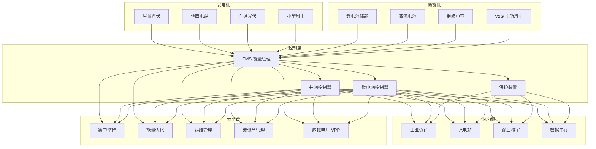
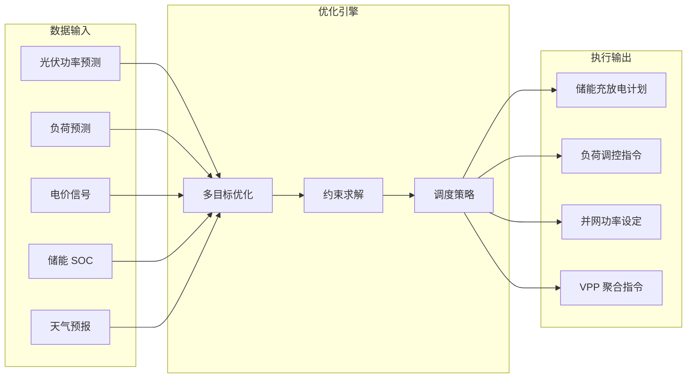
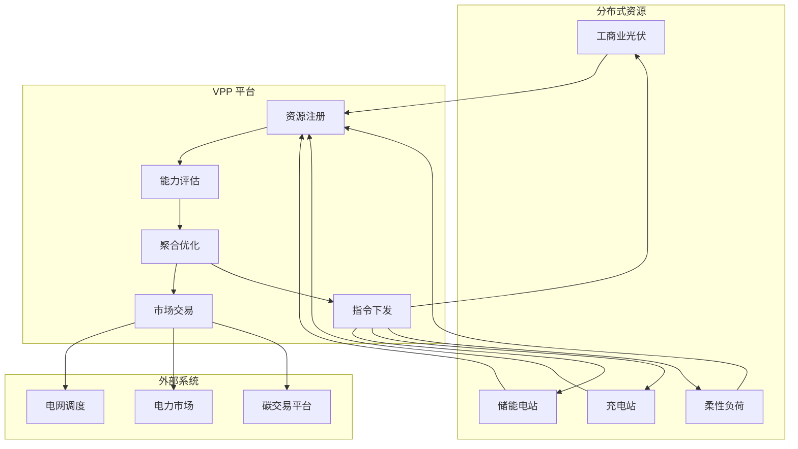

title: 分布式能源架构设计
description: '# 分布式能源架构设计 — 阿里云视角'
category: application-architecture
tags:
- k8s
- architecture
- industry
- scheduler
- [[Prometheus|prometheus]]
- mysql
- [[DaemonSet|daemonset]]
last_updated: 2026-05-18
difficulty: advanced
reading_level: advanced
audience:
- 能源互联网架构师
- 新能源系统工程师
- 电力系统专家
estimated_read_time: 5min
intent_queries:
- 分布式能源 [[Kubernetes|Kubernetes]] 边缘计算
- 光伏储能 EMS Kubernetes 部署
- 虚拟电厂 VPP Kubernetes
- 能源调度优化 AI Kubernetes
- 碳资产管理 绿电 Kubernetes
trigger_keywords:
- 分布式能源
- 光伏
- 储能
- 微电网
- EMS
- 虚拟电厂
- VPP
- 碳资产
- 阿里云
related_domains:
- domain-01-cluster-fundamentals
- domain-11-production-operations
- domain-11-ai-infra
- domain-7-observability
related_topics:
- 61-smart-grid
- 85-hydrogen-energy
- 36-carbon-esg-management
authors:
- name: KUDIG Team
  role: contributor
k8s_versions:
- '1.28'
- '1.29'
- '1.30'
- '1.31'
- '1.32'
---

# 分布式能源架构设计 — 阿里云视角

> **适用版本**: Kubernetes v1.29 - v1.33 | **最后更新**: 2026-04-24
> **作者**: 阿里云解决方案架构师 | **标签**: `#分布式能源` `#光伏` `#储能` `#微电网` `#阿里云`

---

<!-- chunk: 目录 -->## 目录

1. [概述](#1-概述)
2. [设计原则](#2-设计原则)
3. [架构模式](#3-架构模式)
4. [实现示例](#4-实现示例)
5. [在 Kubernetes 上的部署](#5-在-kubernetes-上的部署)
6. [最佳实践](#6-最佳实践)
7. [反模式](#7-反模式)
8. [参考资源](#8-参考资源)

---

<!-- chunk: 1. 概述 -->## 1. 概述

分布式能源（Distributed Energy Resources, DER）是指在用户侧或配电网层面部署的小型发电和储能设备，包括屋顶光伏、小型风电、电池储能、电动汽车充电桩、微电网等。与传统的集中式发电（大型火电/水电/核电）不同，分布式能源具有就近发电、就近消纳、灵活调节的特点，是能源转型的关键组成部分。

分布式能源系统的核心挑战在于"间歇性"和"分散性"：光伏发电受天气和日照影响，输出功率波动大（晴天中午满发、阴天或夜间为零）；储能系统的充放电需要精确管理（过充过放影响寿命和安全）；大量分布式站点（数万到数十万个）需要集中监控和统一调度；并网和离网模式的切换需要毫秒级响应以保证供电连续性。

从信息系统角度看，分布式能源是一个典型的工业物联网（IIoT）+ 边缘计算场景。每个分布式站点（工商业屋顶、储能电站、充电站）部署边缘计算网关，负责设备级实时控制和安全联锁；云平台负责全局监控、能量优化调度、数据分析和运维管理。AI 技术广泛应用于光伏功率预测、负荷预测、储能调度优化、故障诊断等场景。

#<!-- chunk: 1.1 行业背景 -->## 1.1 行业背景

| 挑战 | 说明 | 架构影响 |
|:---|:---|:---|
| 间歇性发电 | 光伏受天气影响，日间波动 20-80% | 储能平抑 + AI 功率预测 |
| 并网标准 | 各地电网接入要求不同 | 并网控制器 + 远程升级 |
| 能量管理 | 源储荷协调优化 | EMS 能量管理系统 |
| 运维分散 | 数万站点远程运维 | IoT 平台 + 数字孪生 |
| 收益计算 | 自发自用/余电上网/峰谷套利 | 精细化计量 + 结算系统 |

#<!-- chunk: 1.2 核心场景 -->## 1.2 核心场景

- **光伏电站监控**: 组串级监控、逆变器管理、发电效率分析
- **储能系统管理**: BMS（电池管理）/PCS（功率变换）/EMS（能量管理）协同
- **微电网控制**: 并网/离网无缝切换、黑启动、孤岛运行
- **能量优化**: 峰谷套利、需量控制、功率因数优化、虚拟电厂（VPP）
- **碳资产管理**: 绿电溯源、碳减排计算、碳交易对接

---

<!-- chunk: 2. 设计原则 -->## 2. 设计原则

#<!-- chunk: 2.1 云边协同原则 -->## 2.1 云边协同原则

分布式能源系统采用"边缘控制+云端优化"的协同模式。边缘侧负责设备级实时控制（毫秒级响应），包括 PCS 控制、BMS 管理、并网保护等；云端负责全局优化（分钟级/小时级），包括能量调度、功率预测、运维决策等。边缘节点必须具备离线自治能力，在通信中断时维持设备安全运行。

#<!-- chunk: 2.2 安全可靠原则 -->## 2.2 安全可靠原则

分布式能源涉及高压电气设备和电池储能系统，安全是首要考虑。架构设计需要：电气安全（并网保护、绝缘监测、防孤岛保护）、消防安全（储能热管理、灭火系统联动）、数据安全（远程控制命令加密认证）。关键控制链路采用硬接线或独立安全 PLC，不依赖通信网络。

#<!-- chunk: 2.3 数据驱动原则 -->## 2.3 数据驱动原则

分布式能源的优化依赖大量运行数据：光伏组串的 I-V 曲线、储能电池的 SOC/SOH 变化、负荷的时序特征等。通过建立数字孪生模型，实现发电预测、储能寿命预测、故障预警等高级功能。数据采集频率根据应用需求分级：实时控制数据 1s、监控数据 10s、分析数据 1min。

#<!-- chunk: 2.4 开放互联原则 -->## 2.4 开放互联原则

分布式能源系统需要与电网调度系统、电力交易平台、碳交易系统等外部系统互联。架构设计需要基于标准协议（IEC 61850、Modbus、MQTT、OpenADR），提供标准化 API，支持与上下游系统的数据互通和业务协同。

---

<!-- chunk: 3. 架构模式 -->## 3. 架构模式

#<!-- chunk: 3.1 分布式能源全景架构 -->## 3.1 分布式能源全景架构



#<!-- chunk: 3.2 EMS 能量管理系统架构 -->## 3.2 EMS 能量管理系统架构



#<!-- chunk: 3.3 虚拟电厂聚合架构 -->## 3.3 虚拟电厂聚合架构



---

<!-- chunk: 4. 实现示例 -->## 4. 实现示例

#<!-- chunk: 4.1 光伏功率预测 -->## 4.1 光伏功率预测

```python
import numpy as np
from sklearn.ensemble import GradientBoostingRegressor
from datetime import datetime, timedelta

class SolarPowerPredictor:
    def __init__(self, capacity_kw: float):
        self.capacity = capacity_kw
        self.model = GradientBoostingRegressor(
            n_estimators=200, max_depth=6, learning_rate=0.05
        )
        self.trained = False

    def train(self, historical_data):
        X = self._build_features(historical_data)
        y = historical_data['power_kw'].values
        self.model.fit(X, y)
        self.trained = True

    def predict(self, weather_forecast: dict,
                 horizon_hours: int = 24) -> list:
        if not self.trained:
            return self._clear_sky_model(weather_forecast, horizon_hours)

        predictions = []
        for h in range(horizon_hours):
            features = self._weather_to_features(weather_forecast, h)
            power = max(0, self.model.predict([features])[0])
            power = min(power, self.capacity)
            predictions.append({
                'hour_ahead': h,
                'power_kw': round(power, 1),
                'confidence': 0.85 if h < 6 else 0.7 if h < 12 else 0.5,
            })
        return predictions

    def _clear_sky_model(self, weather: dict, hours: int) -> list:
        predictions = []
        for h in range(hours):
            hour = (datetime.now().hour + h) % 24
            if 6 <= hour <= 18:
                solar_angle = np.sin(np.pi * (hour - 6) / 12)
                power = self.capacity * solar_angle * 0.85
            else:
                power = 0
            predictions.append({
                'hour_ahead': h,
                'power_kw': round(power, 1),
                'confidence': 0.3,
            })
        return predictions

    def _build_features(self, data) -> np.ndarray:
        features = np.column_stack([
            data['hour'], data['month'],
            data['temperature'], data['humidity'],
            data['cloud_cover'], data['wind_speed'],
            data['ghi'],
        ])
        return features

    def _weather_to_features(self, weather: dict, hour: int) -> list:
        return [
            (datetime.now().hour + hour) % 24,
            datetime.now().month,
            weather.get('temperature', 25),
            weather.get('humidity', 50),
            weather.get('cloud_cover', 0),
            weather.get('wind_speed', 3),
            weather.get('ghi', 800),
        ]
```

#<!-- chunk: 4.2 储能调度优化 -->## 4.2 储能调度优化

```python
from dataclasses import dataclass
from typing import List, Tuple
import numpy as np

@dataclass
class BatteryState:
    soc: float
    soh: float
    capacity_kwh: float
    max_charge_kw: float
    max_discharge_kw: float

class EnergyScheduler:
    def __init__(self, battery: BatteryState):
        self.battery = battery

    def optimize_daily(self, pv_forecast: List[float],
                        load_forecast: List[float],
                        prices: List[float]) -> List[dict]:
        n_hours = 24
        schedule = []
        soc = self.battery.soc
        capacity = self.battery.capacity_kwh

        for h in range(n_hours):
            pv = pv_forecast[h] if h < len(pv_forecast) else 0
            load = load_forecast[h] if h < len(load_forecast) else 0
            price = prices[h] if h < len(prices) else 0.5

            net_load = load - pv

            if price < 0.3 and soc < 0.9:
                charge_kw = min(self.battery.max_charge_kw,
                                (0.9 - soc) * capacity)
                charge_kw = max(0, charge_kw)
                grid_import = net_load + charge_kw
                soc += charge_kw / capacity
                action = "charge"
                battery_kw = -charge_kw
            elif price > 0.8 and soc > 0.2:
                discharge_kw = min(self.battery.max_discharge_kw,
                                   (soc - 0.2) * capacity, net_load)
                discharge_kw = max(0, discharge_kw)
                grid_import = net_load - discharge_kw
                soc -= discharge_kw / capacity
                action = "discharge"
                battery_kw = discharge_kw
            else:
                grid_import = net_load
                action = "idle"
                battery_kw = 0

            schedule.append({
                'hour': h,
                'pv_kw': round(pv, 1),
                'load_kw': round(load, 1),
                'battery_action': action,
                'battery_kw': round(battery_kw, 1),
                'grid_import_kw': round(max(0, grid_import), 1),
                'grid_export_kw': round(max(0, -grid_import), 1),
                'soc': round(soc, 3),
                'price': price,
                'cost': round(max(0, grid_import) * price, 2),
            })

        return schedule
```

#<!-- chunk: 4.3 站点监控数据采集 -->## 4.3 站点监控数据采集

```go
package energy

import (
    "context"
    "fmt"
    "sync"
    "time"
)

type DeviceType string

const (
    DevicePVInverter  DeviceType = "pv_inverter"
    DeviceBMS         DeviceType = "bms"
    DevicePCS         DeviceType = "pcs"
    DeviceMeter       DeviceType = "meter"
    DeviceWeather     DeviceType = "weather_station"
)

type TelemetryPoint struct {
    DeviceID   string
    DeviceType DeviceType
    Metric     string
    Value      float64
    Unit       string
    Timestamp  time.Time
    Quality    float64
}

type SiteCollector struct {
    siteID     string
    devices    map[string]*DeviceInfo
    buffer     []TelemetryPoint
    bufferMu   sync.Mutex
    bufferSize int
}

type DeviceInfo struct {
    ID         string
    Type       DeviceType
    Address    string
    Protocol   string
    PollInterval time.Duration
}

func NewSiteCollector(siteID string) *SiteCollector {
    return &SiteCollector{
        siteID:     siteID,
        devices:    make(map[string]*DeviceInfo),
        buffer:     make([]TelemetryPoint, 0),
        bufferSize: 10000,
    }
}

func (sc *SiteCollector) RegisterDevice(info *DeviceInfo) {
    sc.devices[info.ID] = info
}

func (sc *SiteCollector) Start(ctx context.Context) {
    var wg sync.WaitGroup

    for _, dev := range sc.devices {
        wg.Add(1)
        go func(d *DeviceInfo) {
            defer wg.Done()
            ticker := time.NewTicker(d.PollInterval)
            defer ticker.Stop()

            for {
                select {
                case <-ctx.Done():
                    return
                case <-ticker.C:
                    points := sc.pollDevice(d)
                    sc.bufferMu.Lock()
                    sc.buffer = append(sc.buffer, points...)
                    if len(sc.buffer) > sc.bufferSize {
                        sc.buffer = sc.buffer[len(sc.buffer)-sc.bufferSize:]
                    }
                    sc.bufferMu.Unlock()
                }
            }
        }(dev)
    }

    wg.Wait()
}

func (sc *SiteCollector) pollDevice(dev *DeviceInfo) []TelemetryPoint {
    now := time.Now()
    switch dev.Type {
    case DevicePVInverter:
        return []TelemetryPoint{
            {DeviceID: dev.ID, DeviceType: dev.Type, Metric: "active_power",
             Value: 0, Unit: "kW", Timestamp: now, Quality: 1.0},
            {DeviceID: dev.ID, DeviceType: dev.Type, Metric: "daily_energy",
             Value: 0, Unit: "kWh", Timestamp: now, Quality: 1.0},
        }
    case DeviceBMS:
        return []TelemetryPoint{
            {DeviceID: dev.ID, DeviceType: dev.Type, Metric: "soc",
             Value: 0, Unit: "%", Timestamp: now, Quality: 1.0},
            {DeviceID: dev.ID, DeviceType: dev.Type, Metric: "temperature",
             Value: 0, Unit: "C", Timestamp: now, Quality: 1.0},
        }
    default:
        return nil
    }
}

func (sc *SiteCollector) Flush() []TelemetryPoint {
    sc.bufferMu.Lock()
    defer sc.bufferMu.Unlock()
    data := sc.buffer
    sc.buffer = make([]TelemetryPoint, 0)
    return data
}
```

---

<!-- chunk: 5. 在 Kubernetes 上的部署 -->## 5. 在 Kubernetes 上的部署

#<!-- chunk: 5.1 EMS 能量管理核心服务 -->## 5.1 EMS 能量管理核心服务

```yaml
apiVersion: apps/v1
kind: Deployment
metadata:
  name: ems-core
  namespace: distributed-energy
  labels:
    app: ems-core
    tier: core
spec:
  replicas: 3
  selector:
    matchLabels:
      app: ems-core
  template:
    metadata:
      labels:
        app: ems-core
      annotations:
        prometheus.io/scrape: "true"
        prometheus.io/port: "9090"
    spec:
      containers:
        - name: ems
          image: registry.cn-hangzhou.aliyuncs.com/energy/ems-core:v2.0.0
          ports:
            - containerPort: 8080
            - containerPort: 9090
          env:
            - name: OPTIMIZATION_GOAL
              value: "cost-minimization"
            - name: GRID_TARIFF_PEAK
              value: "1.2"
            - name: GRID_TARIFF_VALLEY
              value: "0.3"
            - name: LINDORM_ENDPOINT
              valueFrom:
                configMapKeyRef:
                  name: energy-config
                  key: lindorm-endpoint
          resources:
            requests:
              memory: "2Gi"
              cpu: "1000m"
            limits:
              memory: "4Gi"
              cpu: "2000m"
```

#<!-- chunk: 5.2 边缘采集网关 DaemonSet -->## 5.2 边缘采集网关 DaemonSet

```yaml
apiVersion: apps/v1
kind: DaemonSet
metadata:
  name: site-collector
  namespace: distributed-energy
spec:
  selector:
    matchLabels:
      app: site-collector
  template:
    metadata:
      labels:
        app: site-collector
    spec:
      nodeSelector:
        node-type: energy-site
      hostNetwork: true
      containers:
        - name: collector
          image: registry.cn-hangzhou.aliyuncs.com/energy/site-collector:v2.0.0
          env:
            - name: CLOUD_ENDPOINT
              value: "https://energy-platform.aliyuncs.com"
            - name: UPLOAD_INTERVAL_S
              value: "60"
            - name: LOCAL_BUFFER_SIZE
              value: "10000"
          resources:
            requests:
              memory: "512Mi"
              cpu: "250m"
            limits:
              memory: "1Gi"
              cpu: "500m"
```

#<!-- chunk: 5.3 AI 功率预测服务 -->## 5.3 AI 功率预测服务

```yaml
apiVersion: apps/v1
kind: Deployment
metadata:
  name: power-predictor
  namespace: distributed-energy
spec:
  replicas: 2
  selector:
    matchLabels:
      app: power-predictor
  template:
    metadata:
      labels:
        app: power-predictor
    spec:
      containers:
        - name: predictor
          image: registry.cn-hangzhou.aliyuncs.com/energy/power-predictor:v2.0.0
          ports:
            - containerPort: 8080
          env:
            - name: MODEL_PATH
              value: "/models/pv-forecast-v3"
            - name: FORECAST_HORIZON_H
              value: "72"
          resources:
            requests:
              memory: "4Gi"
              cpu: "2000m"
            limits:
              memory: "8Gi"
              cpu: "4000m"
```

---

<!-- chunk: 6. 最佳实践 -->## 6. 最佳实践

#<!-- chunk: 6.1 能量管理优化 -->## 6.1 能量管理优化

- **多时间尺度调度**: 日前计划（24h）、日内修正（1h）、实时调整（5min）三层调度体系
- **电价响应**: 根据分时电价信号自动调整储能充放电策略，实现峰谷套利
- **需量控制**: 监控最大需量，通过储能放电削峰，降低基本电费
- **绿电优先**: 优先使用光伏等可再生能源，余电上网或储存

#<!-- chunk: 6.2 运维管理 -->## 6.2 运维管理

- **组串级监控**: 光伏系统监控到组串级别，及时发现遮挡、故障、衰减
- **SOC 均衡**: 多簇电池并联运行时，主动均衡各簇 SOC，延长整体寿命
- **热管理**: 储能系统温度监控，过高时降功率运行，触发灭火系统联动
- **远程运维**: 通过 VPN 安全通道实现远程诊断和参数调整

#<!-- chunk: 6.3 数据管理 -->## 6.3 数据管理

- **时序数据高效存储**: 使用 Lindorm TSDB 存储高频传感器数据
- **数据分级**: 实时数据 10s 精度保留 30 天、历史数据 1min 精度保留 2 年
- **碳足迹追踪**: 记录每 kWh 电力的来源和碳排放因子，支撑绿电认证

---

<!-- chunk: 7. 反模式 -->## 7. 反模式

#<!-- chunk: 7.1 忽视并网保护 -->## 7.1 忽视并网保护

储能或光伏系统未配置并网保护装置，电网故障时继续向电网送电，危害维修人员安全。

**解决方案**: 配置防孤岛保护装置，电网断电时 0.2s 内自动断开并网开关。定期测试并网保护功能的有效性。

#<!-- chunk: 7.2 储能过充过放 -->## 7.2 储能过充过放

储能系统缺乏 SOC 管理策略，长期过充过放导致电池加速衰减甚至热失控。

**解决方案**: BMS 严格限制 SOC 在 10%-90% 范围内运行。PCS 根据电池温度和 SOC 动态调整充放电功率。设置多级告警阈值。

#<!-- chunk: 7.3 忽视通信安全 -->## 7.3 忽视通信安全

边缘网关使用明文通信，远程控制命令未加密，存在被篡改和攻击的风险。

**解决方案**: 所有远程通信使用 TLS 加密。控制命令使用数字签名认证。实施网络安全分区，控制网络与管理网络隔离。

#<!-- chunk: 7.4 单一数据源预测 -->## 7.4 单一数据源预测

光伏功率预测仅依赖历史数据，未融合天气预报，预测精度低。

**解决方案**: 融合数值天气预报（NWP）、卫星云图、天空成像仪等多源数据。使用集成学习方法提升预测鲁棒性。

#<!-- chunk: 7.5 忽视电池衰减 -->## 7.5 忽视电池衰减

储能调度策略未考虑电池循环寿命衰减，频繁浅充浅放导致寿命缩短。

**解决方案**: 在优化目标中加入电池寿命成本（考虑 DOD-循环次数曲线）。平衡短期经济收益和长期电池寿命。

---

<!-- chunk: 8. 参考资源 -->## 8. 参考资源

#<!-- chunk: 8.1 阿里云组件映射 -->## 8.1 阿里云组件映射

| 功能域 | **阿里云云原生方案** |
|:---|:---|
| 容器平台 | **ACK Edge + ACK Pro** |
| IoT 平台 | **阿里云 IoT 企业实例** |
| 时序数据库 | **Lindorm TSDB** |
| 关系数据库 | **PolarDB MySQL** |
| AI 平台 | **PAI** |
| 消息队列 | **RocketMQ** |
| 可观测性 | **ARMS + SLS** |

#<!-- chunk: 8.2 生产检查清单 -->## 8.2 生产检查清单

- [ ] 并网保护功能验证（防孤岛保护 < 0.2s）
- [ ] 储能系统热管理测试（温升 < 5°C/h）
- [ ] EMS 优化策略回测验证
- [ ] 远程运维通道安全审计
- [ ] 碳减排计算方法合规
- [ ] 边缘网关离线自治测试
- [ ] 功率预测精度 > 85%（日前）
- [ ] 系统可用性 99.9% 验证

#<!-- chunk: 8.3 外部参考 -->## 8.3 外部参考

- IEC 61850 — 电力系统通信标准
- IEEE 2030.5 — 智能能源通信协议
- OpenADR — 自动需求响应标准
- Modbus TCP/RTU — 工业通信协议
- GB/T 19964 — 光伏电站接入电力系统技术规定

---

**维护者**: 阿里云解决方案架构师团队 | **许可证**: MIT

---

<!-- chunk: Obsidian 相关文档 -->## Obsidian 相关文档

- topic-application-architecture MOC
- [[domain-20-application-patterns/topic-application-architecture/README.md|Topic 应用层架构设计最佳实践]]
- [[domain-20-application-patterns/topic-application-architecture/01-ecommerce-architecture.md|电商系统 Kubernetes 生产架构设计]]
- [[domain-20-application-patterns/topic-application-architecture/02-mini-program-architecture.md|小程序平台架构设计]]
- [[domain-20-application-patterns/topic-application-architecture/03-cms-architecture.md|内容管理系统 CMS 架构设计]]
- [[domain-20-application-patterns/topic-application-architecture/04-im-rtc-architecture.md|实时通信 IM/RTC 架构设计]]
- [[domain-20-application-patterns/topic-application-architecture/05-online-education-architecture.md|在线教育平台 Kubernetes 生产架构设计]]
- [[domain-20-application-patterns/topic-application-architecture/06-fintech-architecture.md|金融科技FinTech Kubernetes生产架构设计]]
- [[domain-20-application-patterns/topic-application-architecture/07-iot-platform-architecture.md|物联网 IoT 平台架构设计]]
- [[domain-20-application-patterns/topic-application-architecture/08-ai-ml-inference-architecture.md|AI/ML 推理服务 Kubernetes 生产架构设计]]
- [[domain-20-application-patterns/topic-application-architecture/09-gaming-backend-architecture.md|游戏后端 Kubernetes 生产架构设计]]
- [[domain-20-application-patterns/topic-application-architecture/10-social-media-architecture.md|社交媒体平台Kubernetes生产架构设计]]

## See Also

- 60-v2x-autonomous-driving
- 61-smart-grid
- 63-industrial-visual-inspection
- 64-ai-drug-discovery

## Related

- topic-application-architecture MOC — Cross-reference
