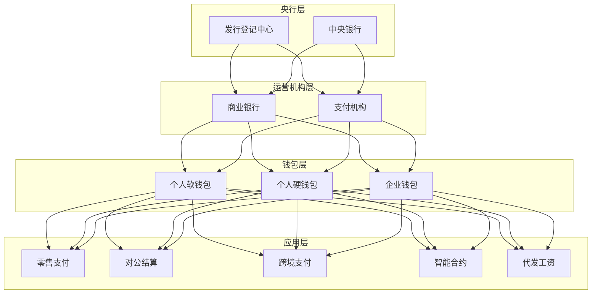
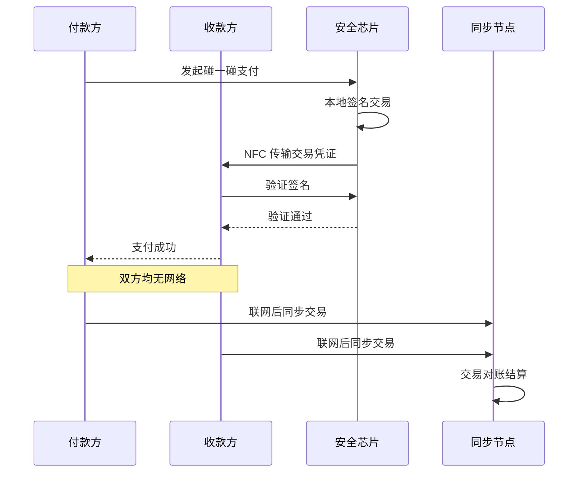
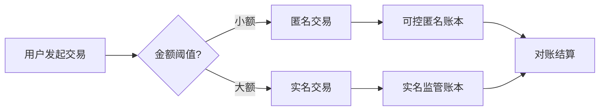

title: 数字人民币架构设计
description: '# 数字人民币架构设计 — 阿里云视角'
category: application-architecture
tags:
- k8s
- architecture
- industry
- redis
- [[StatefulSet|statefulset]]
- operator
- wasm
last_updated: 2026-05-18
difficulty: expert
reading_level: expert
audience:
- 金融科技架构师
- 区块链工程师
- 支付系统专家
estimated_read_time: 5min
intent_queries:
- 数字人民币 e-CNY [[Kubernetes|Kubernetes]] 架构
- 央行数字货币 CBDC 区块链 K8s
- 双离线支付 可信硬件 K8s
- 数字人民币智能合约 Kubernetes
- 金融级 Kubernetes 高可用
trigger_keywords:
- 数字人民币
- e-CNY
- CBDC
- 央行数字货币
- 区块链
- 双离线支付
- 智能合约
- 国密
- 阿里云
related_domains:
- domain-01-cluster-fundamentals
- domain-11-production-operations
- domain-03-networking-traffic
related_topics:
- 06-fintech-architecture
- 38-supply-chain-finance
- 25-quantitative-trading
authors:
- name: KUDIG Team
  role: contributor
k8s_versions:
- '1.28'
- '1.29'
- '1.30'
- '1.31'
- '1.32'
---

# 数字人民币架构设计 — 阿里云视角

> **适用版本**: Kubernetes v1.29 - v1.33 | **最后更新**: 2026-04-24
> **作者**: 阿里云解决方案架构师 | **标签**: `#数字人民币` `#e-CNY` `#CBDC` `#央行数字货币` `#阿里云`

---

## 目录

1. [行业背景](#1-行业背景)
2. [业务架构](#2-业务架构)
3. [技术架构](#3-技术架构)
4. [核心数据流](#4-核心数据流)
5. [安全与合规](#5-安全与合规)
6. [可观测性](#6-可观测性)
7. [阿里云组件映射](#7-阿里云组件映射)
8. [生产检查清单](#8-生产检查清单)

---

## 1. 行业背景

### 1.1 业务特点

数字人民币（e-CNY）是中国央行发行的法定数字货币：

| 挑战 | 说明 | 架构影响 |
|:---|:---|:---|
| 高并发交易 | 亿级用户高频小额支付 | 分布式架构 |
| 双离线支付 | 无网环境支付 | 可信硬件 + 本地加密 |
| 可控匿名 | 小额匿名/大额可追溯 | 分级身份 |
| 智能合约 | 可编程货币 | 合约安全 |
| 金融稳定 | M0 替代不引发通胀 | 额度管控 |

### 1.2 核心场景

- **个人钱包**: 软钱包/硬钱包管理
- **商户收款**: 扫码/碰一碰收款
- **对公业务**: 企业钱包/代发工资
- **跨境支付**: mBridge 多边央行数字货币桥
- **智能合约**: 条件支付/自动分账

---

## 2. 业务架构

### 2.1 数字人民币全景架构



### 2.2 双离线支付时序



---

## 3. 技术架构

### 3.1 K8s 部署

```yaml
# 数字人民币交易服务 StatefulSet
apiVersion: apps/v1
kind: StatefulSet
metadata:
  name: e-cny-transaction
  namespace: ecny
spec:
  serviceName: e-cny-transaction
  replicas: 10
  selector:
    matchLabels:
      app: e-cny-transaction
  template:
    metadata:
      labels:
        app: e-cny-transaction
    spec:
      affinity:
        podAntiAffinity:
          requiredDuringSchedulingIgnoredDuringExecution:
            - labelSelector:
                matchExpressions:
                  - key: app
                    operator: In
                    values: [e-cny-transaction]
              topologyKey: topology.kubernetes.io/zone
      containers:
        - name: transaction
          image: registry.cn-hangzhou.aliyuncs.com/ecny/transaction:v3.0.0
          ports:
            - containerPort: 8080
          env:
            - name: LEDGER_TYPE
              value: "hybrid-dlt"
            - name: MAX_TPS_PER_SHARD
              value: "100000"
            - name: OFFLINE_TX_ENABLED
              value: "true"
          resources:
            requests:
              memory: "8Gi"
              cpu: "4000m"
            limits:
              memory: "16Gi"
              cpu: "8000m"
          volumeMounts:
            - name: secure-keys
              mountPath: /etc/ecny/keys
              readOnly: true
      volumes:
        - name: secure-keys
          secret:
            secretName: ecny-master-keys
```

```yaml
# 智能合约引擎 Deployment
apiVersion: apps/v1
kind: Deployment
metadata:
  name: smart-contract-engine
  namespace: ecny
spec:
  replicas: 5
  selector:
    matchLabels:
      app: smart-contract-engine
  template:
    metadata:
      labels:
        app: smart-contract-engine
    spec:
      containers:
        - name: engine
          image: registry.cn-hangzhou.aliyuncs.com/ecny/contract-engine:v2.0.0
          ports:
            - containerPort: 8080
          env:
            - name: VM_TYPE
              value: "wasm"
            - name: GAS_LIMIT
              value: "1000000"
          resources:
            requests:
              memory: "4Gi"
              cpu: "2000m"
            limits:
              memory: "8Gi"
              cpu: "4000m"
```

---

## 4. 核心数据流

### 4.1 可控匿名交易



---

## 5. 安全与合规

- **国密算法**: SM2/SM3/SM4 全链路
- **可控匿名**: 央行监管可追溯
- **资金安全**: 100% 准备金制度
- **反洗钱**: 大额交易监控

---

## 6. 可观测性

- **交易 TPS**: 峰值 30万+
- **交易延迟**: P99 < 100ms
- **系统可用性**: 99.999%

---

## 7. 阿里云组件映射

| 功能域 | **阿里云云原生方案** |
|:---|:---|
| 容器平台 | **ACK Pro** |
| 数据库 | **PolarDB + Lindorm** |
| 缓存 | **Redis 企业版** |
| 区块链 | **蚂蚁链 BaaS** |
| 安全 | **云盾 + KMS + WAF** |
| 可观测性 | **ARMS + SLS** |

---

## 8. 生产检查清单

- [ ] 国密算法全链路验证
- [ ] 双离线支付安全测试
- [ ] 智能合约沙箱隔离
- [ ] 大额交易监控规则
- [ ] 央行监管接口联调
- [ ] 灾难恢复演练

---

**维护者**: 阿里云解决方案架构师团队 | **许可证**: MIT

---

## Obsidian 相关文档

- topic-application-architecture KUDIG Database — Global MOC
- [[domain-20-application-patterns/topic-application-architecture/README.md|Topic 应用层架构设计最佳实践]]
- [[domain-20-application-patterns/topic-application-architecture/01-ecommerce-architecture.md|电商系统 Kubernetes 生产架构设计]]
- [[domain-20-application-patterns/topic-application-architecture/02-mini-program-architecture.md|小程序平台架构设计]]
- [[domain-20-application-patterns/topic-application-architecture/03-cms-architecture.md|内容管理系统 CMS 架构设计]]
- [[domain-20-application-patterns/topic-application-architecture/04-im-rtc-architecture.md|实时通信 IM/RTC 架构设计]]
- [[domain-20-application-patterns/topic-application-architecture/05-online-education-architecture.md|在线教育平台 Kubernetes 生产架构设计]]
- [[domain-20-application-patterns/topic-application-architecture/06-fintech-architecture.md|金融科技FinTech Kubernetes生产架构设计]]
- [[domain-20-application-patterns/topic-application-architecture/07-iot-platform-architecture.md|物联网 IoT 平台架构设计]]
- [[domain-20-application-patterns/topic-application-architecture/08-ai-ml-inference-architecture.md|AI/ML 推理服务 Kubernetes 生产架构设计]]
- [[domain-20-application-patterns/topic-application-architecture/09-gaming-backend-architecture.md|游戏后端 Kubernetes 生产架构设计]]
- [[domain-20-application-patterns/topic-application-architecture/10-social-media-architecture.md|社交媒体平台Kubernetes生产架构设计]]

## See Also

- 68-quantum-computing-cloud
- 69-6g-core-network
- 71-smart-tax
- 72-digital-twin-city

## Related

- topic-application-architecture MOC — Cross-reference
