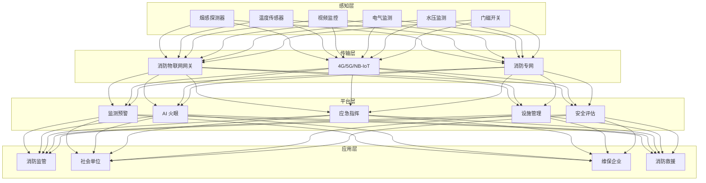
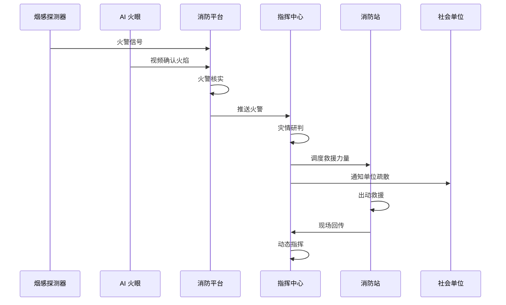
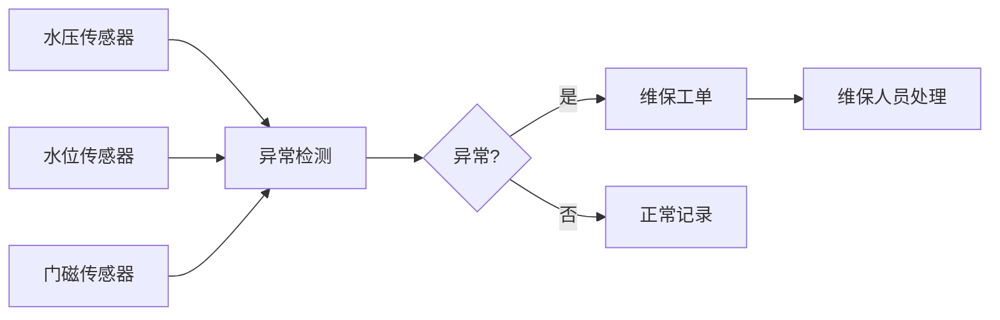

title: 智慧消防架构设计
description: '# 智慧消防架构设计 — 阿里云视角'
category: application-architecture
tags:
- k8s
- architecture
- industry
- gpu
- nvidia
last_updated: '2026-05-18'
difficulty: advanced
reading_level: advanced
audience:
- 消防信息化架构师
- IoT平台工程师
- 视频AI开发者
- 应急系统开发者
estimated_read_time: 5min
intent_queries:
- 智慧消防系统架构设计
- AI火眼视频分析K8s部署
- 消防物联网IoT设备接入
- 火灾预警应急指挥系统
- 消防设施远程监控
trigger_keywords:
- 智慧消防
- 消防物联网
- AI火眼
- 火灾预警
- 应急指挥
- 烟感探测
- 视频分析
- 消防联动
- 等保三级
- 消防监控
related_domains:
- domain-01-cluster-fundamentals
- domain-9-ai-ml
- domain-5-iot-edge-computing
- domain-7-observability
related_topics:
- domain-20-application-patterns/topic-application-architecture/14-smart-healthcare-architecture
- domain-20-application-patterns/topic-application-architecture/47-smart-mining
- domain-20-application-patterns/topic-application-architecture/29-agritech-iot
- domain-02-workloads-applications/topic-functions/05-iot-edge-computing
authors:
- name: KUDIG Team
  role: contributor
k8s_versions:
- '1.28'
- '1.29'
- '1.30'
- '1.31'
- '1.32'
---

# 智慧消防架构设计 — 阿里云视角

> **适用版本**: Kubernetes v1.29 - v1.33 | **最后更新**: 2026-04-24
> **作者**: 阿里云解决方案架构师 | **标签**: `#智慧消防` `#消防物联网` `#应急指挥` `#阿里云`

---

## 目录

1. [行业背景](#1-行业背景)
2. [业务架构](#2-业务架构)
3. [技术架构](#3-技术架构)
4. [核心数据流](#4-核心数据流)
5. [安全与合规](#5-安全与合规)
6. [可观测性](#6-可观测性)
7. [阿里云组件映射](#7-阿里云组件映射)
8. [生产检查清单](#8-生产检查清单)

---

## 1. 行业背景

### 1.1 业务特点

智慧消防通过 IoT + AI 实现火灾预防与应急救援智能化：

| 挑战 | 说明 | 架构影响 |
|:---|:---|:---|
| 预防为主 | 火灾前预警优于扑救 | AI 预测 + 监测 |
| 多源感知 | 烟感/温感/视频监控 | 传感器融合 |
| 应急响应 | 黄金 3 分钟救援 | 自动报警 + 联动 |
| 复杂环境 | 高层建筑/地下空间 | 三维导航 + 定位 |
| 指挥协同 | 多部门联合作战 | 统一指挥平台 |

### 1.2 核心场景

- **火灾监测**: 烟感/温感/电气/燃气监测
- **AI 火眼**: 视频火焰/烟雾识别
- **应急指挥**: 灾情研判/力量调度
- **消防设施**: 水压/水位/门磁监测
- **安全评估**: 建筑消防风险评估

---

## 2. 业务架构

### 2.1 智慧消防全景架构



### 2.2 火灾应急指挥时序



---

## 3. 技术架构

### 3.1 K8s 部署

```yaml
# AI 火眼视频分析 Deployment
apiVersion: apps/v1
kind: Deployment
metadata:
  name: ai-fire-eye
  namespace: smart-firefighting
spec:
  replicas: 3
  selector:
    matchLabels:
      app: ai-fire-eye
  template:
    metadata:
      labels:
        app: ai-fire-eye
    spec:
      nodeSelector:
        accelerator: nvidia-t4
      runtimeClassName: nvidia
      containers:
        - name: fire-eye
          image: registry.cn-hangzhou.aliyuncs.com/fire/ai-fire-eye:v2.0.0-gpu
          ports:
            - containerPort: 8080
          env:
            - name: DETECTION_CLASSES
              value: "flame,smoke"
            - name: ALERT_CONFIDENCE
              value: "0.9"
          resources:
            requests:
              nvidia.com/gpu: 1
              memory: "8Gi"
              cpu: "4000m"
            limits:
              nvidia.com/gpu: 1
              memory: "16Gi"
              cpu: "8000m"
```

---

## 4. 核心数据流

### 4.1 消防设施状态监测



---

## 5. 安全与合规

- **生命安全**: 火灾预警零误报
- **数据安全**: 消防设施数据保密
- **等保三级**: 消防系统等级保护

---

## 6. 可观测性

- **火警响应**: < 3s
- **视频识别**: 准确率 > 98%
- **设备在线率**: > 98%

---

## 7. 阿里云组件映射

| 功能域 | **阿里云云原生方案** |
|:---|:---|
| 容器平台 | **ACK Pro + GPU** |
| IoT | **阿里云 IoT 平台** |
| AI | **PAI / 视觉智能** |
| 数据库 | **PolarDB + Lindorm** |
| 对象存储 | **OSS** |
| 可观测性 | **ARMS + SLS** |
| 视频 | **阿里云视频直播** |

---

## 8. 生产检查清单

- [ ] 烟感误报率 < 1%
- [ ] AI 火眼识别准确率 > 98%
- [ ] 消防设施在线率 > 98%
- [ ] 应急指挥响应 < 3s
- [ ] 等保三级合规审计

---

**维护者**: 阿里云解决方案架构师团队 | **许可证**: MIT

---

## Obsidian 相关文档

- [[domain-20-application-patterns/topic-application-architecture/MOC.md|topic-application-architecture MOC]]
- [[domain-20-application-patterns/topic-application-architecture/README.md|Topic 应用层架构设计最佳实践]]
- [[domain-20-application-patterns/topic-application-architecture/01-ecommerce-architecture.md|电商系统 Kubernetes 生产架构设计]]
- [[domain-20-application-patterns/topic-application-architecture/02-mini-program-architecture.md|小程序平台架构设计]]
- [[domain-20-application-patterns/topic-application-architecture/03-cms-architecture.md|内容管理系统 CMS 架构设计]]
- [[domain-20-application-patterns/topic-application-architecture/04-im-rtc-architecture.md|实时通信 IM/RTC 架构设计]]
- [[domain-20-application-patterns/topic-application-architecture/05-online-education-architecture.md|在线教育平台 Kubernetes 生产架构设计]]
- [[domain-20-application-patterns/topic-application-architecture/06-fintech-architecture.md|金融科技FinTech Kubernetes生产架构设计]]
- [[domain-20-application-patterns/topic-application-architecture/07-iot-platform-architecture.md|物联网 IoT 平台架构设计]]
- [[domain-20-application-patterns/topic-application-architecture/08-ai-ml-inference-architecture.md|AI/ML 推理服务 Kubernetes 生产架构设计]]
- [[domain-20-application-patterns/topic-application-architecture/09-gaming-backend-architecture.md|游戏后端 Kubernetes 生产架构设计]]
- [[domain-20-application-patterns/topic-application-architecture/10-social-media-architecture.md|社交媒体平台Kubernetes生产架构设计]]

## See Also

- [[domain-20-application-patterns/71-smart-tax.md|71-smart-tax]]
- [[domain-20-application-patterns/72-digital-twin-city.md|72-digital-twin-city]]
- [[domain-20-application-patterns/74-immersive-xr.md|74-immersive-xr]]
- [[domain-20-application-patterns/75-affective-computing.md|75-affective-computing]]

## Related

- [[domain-20-application-patterns/98-merged-indexes/MOC-from-domain-20-application-patterns|topic-application-architecture MOC]] — Cross-reference
