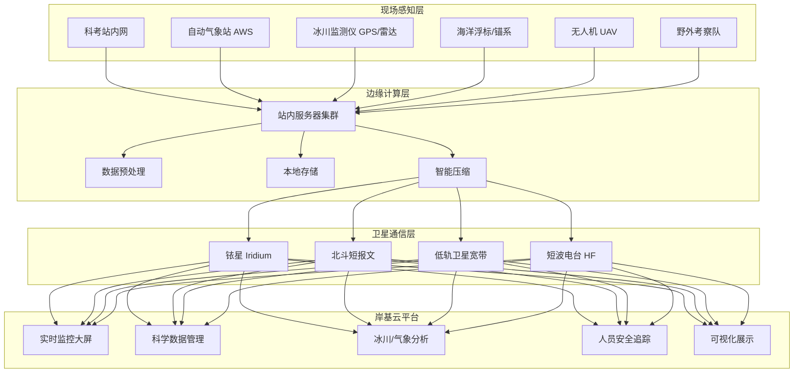
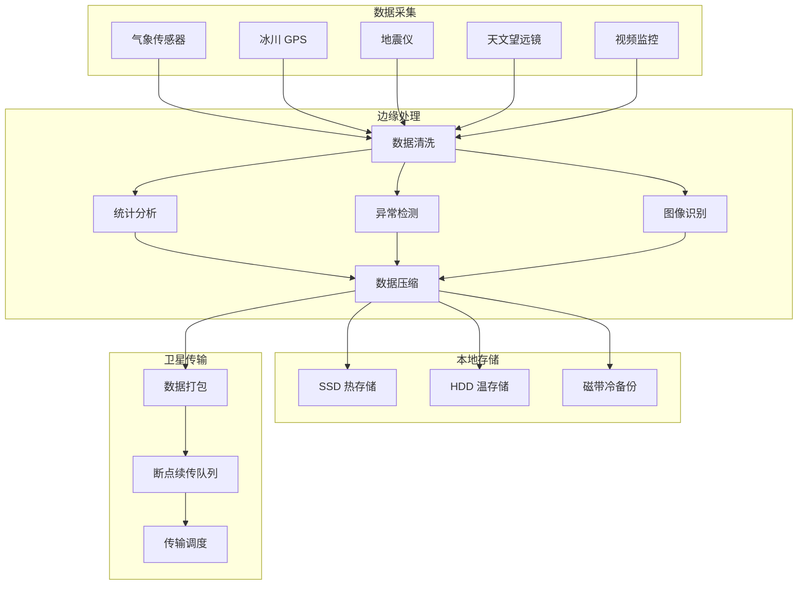
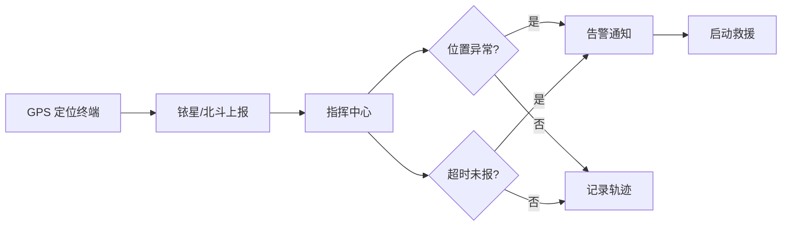

title: 极地科考架构设计
description: '# 极地科考架构设计 — 阿里云视角'
category: application-architecture
tags:
- k8s
- architecture
- industry
- scheduler
- daemonset
- operator
- webhook
last_updated: 2026-05-18
difficulty: advanced
reading_level: advanced
audience:
- 科考信息化架构师
- 边缘计算工程师
- 极端环境系统专家
estimated_read_time: 5min
intent_queries:
- 极地科考 Kubernetes 边缘计算
- 冰川监测 卫星通信 K8s
- 极地环境 低带宽 Kubernetes
- 南极北极 科考站 K8s部署
- 极地科考 能源优化 Kubernetes
trigger_keywords:
- 极地科考
- 冰川监测
- 南极
- 北极
- 卫星通信
- 边缘计算
- 铱星
- 阿里云
related_domains:
- domain-01-cluster-fundamentals
- domain-11-production-operations
- domain-7-observability
related_topics:
- 78-deep-sea-exploration
- 77-fusion-energy-monitoring
- 66-space-internet
authors:
- name: KUDIG Team
  role: contributor
k8s_versions:
- '1.28'
- '1.29'
- '1.30'
- '1.31'
- '1.32'
---

# 极地科考架构设计 — 阿里云视角

> **适用版本**: Kubernetes v1.29 - v1.33 | **最后更新**: 2026-04-24
> **作者**: 阿里云解决方案架构师 | **标签**: `#极地科考` `#冰川监测` `#南极北极` `#阿里云`

---

<!-- chunk: 目录 -->## 目录

1. [概述](#1-概述)
2. [设计原则](#2-设计原则)
3. [架构模式](#3-架构模式)
4. [实现示例](#4-实现示例)
5. [在 Kubernetes 上的部署](#5-在-kubernetes-上的部署)
6. [最佳实践](#6-最佳实践)
7. [反模式](#7-反模式)
8. [参考资源](#8-参考资源)

---

<!-- chunk: 1. 概述 -->## 1. 概述

极地（南极和北极）是地球气候系统的关键组成部分，对全球气候变化、海平面上升、海洋环流等具有深远影响。极地科考是人类认识极地、保护极地的核心手段，涉及冰川学、气象学、海洋学、生物学、天文学、地质学等多个学科。

极地环境的极端性对信息系统提出了独特挑战：南极内陆冬季气温可达 -80°C，常规电子设备无法工作；极地卫星过境次数有限，通信带宽极度稀缺（铱星通信通常仅 2.4-128kbps）；极夜期间太阳能供电不可用，需要依赖柴油发电机和蓄电池；科考人员安全是最高优先级，实时定位和通信是生命线。

极地科考信息系统采用三层架构：现场层（科考站、自动观测站、无人机等）负责数据采集和基础处理；通信层（铱星、北斗、低轨卫星等）负责数据传输；平台层（云平台）负责数据管理、科学分析和可视化展示。三层之间通过延迟容忍网络协议实现可靠数据交换。

#<!-- chunk: 1.1 行业背景 -->## 1.1 行业背景

| 挑战 | 说明 | 架构影响 |
|:---|:---|:---|
| 极端低温 | 南极内陆 -80°C | 工业级耐寒设备 + 加温柜 |
| 网络受限 | 卫星带宽 2.4-128kbps | 边缘计算 + 深度压缩 |
| 能源稀缺 | 冬季无太阳能 | 低功耗设计 + 智能节能 |
| 人员安全 | 极端环境孤立无援 | 实时定位 + 应急通信 |
| 数据珍贵 | 采集成本极高 | 多重备份 + 断点续传 |

#<!-- chunk: 1.2 核心场景 -->## 1.2 核心场景

- **冰川监测**: 冰川运动速度、厚度变化、底部融化解冻监测
- **气象观测**: 极地气候长期观测，温度/气压/风速/辐射等
- **生态研究**: 企鹅/海豹种群监测、磷虾资源评估
- **天文观测**: 南极冰穹 A 天文台，利用极夜和大气稳定条件
- **海洋调查**: 冰下海洋温度、盐度、洋流观测

---

<!-- chunk: 2. 设计原则 -->## 2. 设计原则

#<!-- chunk: 2.1 极致可靠原则 -->## 2.1 极致可靠原则

极地设备一旦部署，可能需要运行数年无人维护。系统设计需要追求极致可靠性：硬件采用工业级耐温组件（-40°C ~ +85°C）；软件采用看门狗和自动恢复机制；通信采用多链路冗余（铱星+北斗+短波）；数据采用多重备份和定期校验。

#<!-- chunk: 2.2 极低带宽适应原则 -->## 2.2 极低带宽适应原则

极地通信带宽极为有限（通常几 kbps），系统设计必须适应这一约束：数据在边缘端完成预处理和压缩，只传输处理结果和关键原始数据；传输协议支持断点续传和增量同步；文本数据采用极限压缩，图像数据大幅降低分辨率。

#<!-- chunk: 2.3 能源优化原则 -->## 2.3 能源优化原则

极地能源极其宝贵（冬季完全依赖柴油发电，每升柴油运费远超油本身）。系统设计需要极致节能：计算设备选择低功耗 ARM 平台；非连续观测设备采用间歇工作模式（如每小时唤醒 5 分钟）；通信模块按需开启，空闲时关闭射频。

#<!-- chunk: 2.4 安全第一原则 -->## 2.4 安全第一原则

科考人员安全是最高优先级。系统必须保证：科考人员 GPS 位置每分钟更新到指挥中心；应急通信信道始终可用；气象预警（暴风雪、白化天气）实时推送；野外考察计划自动审批和超时告警。

---

<!-- chunk: 3. 架构模式 -->## 3. 架构模式

#<!-- chunk: 3.1 极地科考系统全景架构 -->## 3.1 极地科考系统全景架构



#<!-- chunk: 3.2 科考站边缘计算架构 -->## 3.2 科考站边缘计算架构



#<!-- chunk: 3.3 人员安全监控架构 -->## 3.3 人员安全监控架构



---

<!-- chunk: 4. 实现示例 -->## 4. 实现示例

#<!-- chunk: 4.1 极地数据压缩与传输 -->## 4.1 极地数据压缩与传输

```python
import struct
import zlib
from datetime import datetime
from typing import List, Tuple

class PolarDataPacker:
    MAX_IRIDIUM_BYTES = 340

    def __init__(self):
        self.sequence = 0

    def pack_weather_data(self, readings: List[dict]) -> List[bytes]:
        packets = []
        buffer = bytearray()

        for r in readings:
            entry = struct.pack('<IfHHHBB',
                                int(r['timestamp']),
                                r['temperature'] * 10,
                                int(r['pressure'] * 10),
                                int(r['humidity']),
                                int(r['wind_speed'] * 10),
                                r['wind_direction'] // 15,
                                r['battery_percent'])
            if len(buffer) + len(entry) > self.MAX_IRIDIUM_BYTES - 8:
                packets.append(self._finalize_packet(buffer))
                buffer = bytearray()
            buffer.extend(entry)

        if buffer:
            packets.append(self._finalize_packet(buffer))

        return packets

    def pack_gps_track(self, points: List[dict]) -> List[bytes]:
        packets = []
        buffer = bytearray()

        if not points:
            return packets

        base_lat = points[0]['latitude']
        base_lon = points[0]['longitude']
        buffer.extend(struct.pack('<dff',
                                   int(points[0]['timestamp']),
                                   base_lat, base_lon))

        for p in points[1:]:
            dlat = int((p['latitude'] - base_lat) * 1e6)
            dlon = int((p['longitude'] - base_lon) * 1e6)
            dt = int(p['timestamp'] - points[0]['timestamp'])
            delta = struct.pack('<hhI', dlat, dlon, dt)

            if len(buffer) + len(delta) > self.MAX_IRIDIUM_BYTES - 4:
                packets.append(self._finalize_packet(buffer))
                buffer = bytearray()
                base_lat = p['latitude']
                base_lon = p['longitude']
                buffer.extend(struct.pack('<dff',
                                           int(p['timestamp']),
                                           base_lat, base_lon))
            else:
                buffer.extend(delta)

        if buffer:
            packets.append(self._finalize_packet(buffer))

        return packets

    def _finalize_packet(self, data: bytearray) -> bytes:
        self.sequence = (self.sequence + 1) % 65536
        compressed = zlib.compress(bytes(data), level=9)
        header = struct.pack('<HB', self.sequence, len(compressed))
        crc = zlib.crc32(compressed) & 0xFFFF
        checksum = struct.pack('<H', crc)
        return header + compressed + checksum


class PolarTransmissionScheduler:
    def __init__(self, bandwidth_bps: int = 2400):
        self.bandwidth = bandwidth_bps

    def schedule_transmission(self, packets: List[bytes],
                               priority: str = 'normal') -> List[dict]:
        schedule = []
        total_bytes = sum(len(p) for p in packets)
        transmission_time = total_bytes * 8 / self.bandwidth

        if priority == 'emergency':
            max_delay = 60
        elif priority == 'high':
            max_delay = 300
        else:
            max_delay = 3600

        chunks_needed = max(1, int(transmission_time / max_delay))

        chunk_size = len(packets) // chunks_needed
        for i in range(0, len(packets), max(1, chunk_size)):
            chunk = packets[i:i + max(1, chunk_size)]
            schedule.append({
                'packets': chunk,
                'bytes': sum(len(p) for p in chunk),
                'estimated_seconds': sum(len(p) for p in chunk) * 8 / self.bandwidth,
                'window_start': i * transmission_time / len(packets),
            })

        return schedule
```

#<!-- chunk: 4.2 冰川运动监测 -->## 4.2 冰川运动监测

```python
import numpy as np
from datetime import datetime, timedelta
from typing import List, Tuple

class GlacierMonitor:
    def __init__(self, gps_stations: List[dict]):
        self.stations = {s['id']: s for s in gps_stations}
        self.velocity_history = {s['id']: [] for s in gps_stations}

    def compute_velocity(self, station_id: str,
                          pos_prev: Tuple[float, float, float],
                          pos_curr: Tuple[float, float, float],
                          dt_hours: float) -> dict:
        dx = pos_curr[0] - pos_prev[0]
        dy = pos_curr[1] - pos_prev[1]
        dz = pos_curr[2] - pos_prev[2]

        dist = np.sqrt(dx**2 + dy**2 + dz**2)
        velocity = dist / (dt_hours / 24.0)

        if dist > 0:
            direction = np.degrees(np.arctan2(dy, dx))
        else:
            direction = 0

        result = {
            'station_id': station_id,
            'velocity_m_day': velocity,
            'direction_deg': direction,
            'vertical_change_m': dz,
            'timestamp': datetime.utcnow().isoformat(),
        }

        self.velocity_history[station_id].append(result)
        if len(self.velocity_history[station_id]) > 365:
            self.velocity_history[station_id] = self.velocity_history[station_id][-365:]

        return result

    def detect_anomaly(self, station_id: str,
                        current_velocity: float) -> dict:
        history = self.velocity_history.get(station_id, [])
        if len(history) < 30:
            return {'anomaly': False, 'reason': 'insufficient_data'}

        recent_velocities = [h['velocity_m_day'] for h in history[-30:]]
        mean_v = np.mean(recent_velocities)
        std_v = np.std(recent_velocities)

        if std_v == 0:
            return {'anomaly': False}

        z_score = abs(current_velocity - mean_v) / std_v

        if z_score > 3:
            return {
                'anomaly': True,
                'type': 'surge' if current_velocity > mean_v else 'stagnation',
                'z_score': z_score,
                'mean_velocity': mean_v,
                'current_velocity': current_velocity,
            }

        return {'anomaly': False, 'z_score': z_score}

    def predict_mass_balance(self, elevation_changes: List[dict],
                              area_km2: float) -> dict:
        total_change = np.mean([e['change_m'] for e in elevation_changes])
        ice_density = 917.0
        mass_change = total_change * area_km2 * 1e6 * ice_density / 1e9

        return {
            'avg_elevation_change_m': total_change,
            'area_km2': area_km2,
            'mass_change_gt': mass_change,
            'swe_equivalent_mm': total_change * ice_density / 1000,
            'status': 'gaining' if total_change > 0 else 'losing',
        }
```

#<!-- chunk: 4.3 人员安全追踪系统 -->## 4.3 人员安全追踪系统

```go
package safety

import (
    "context"
    "fmt"
    "sync"
    "time"
)

type PersonStatus string

const (
    StatusSafe      PersonStatus = "safe"
    StatusWarning   PersonStatus = "warning"
    StatusEmergency PersonStatus = "emergency"
    StatusUnknown   PersonStatus = "unknown"
)

type Person struct {
    ID           string
    Name         string
    Latitude     float64
    Longitude    float64
    LastReport   time.Time
    Status       PersonStatus
    Plan         *FieldPlan
    BatteryLevel int
}

type FieldPlan struct {
    DepartureTime time.Time
    ExpectedReturn time.Time
    Route         []RoutePoint
    MaxDistance   float64
}

type RoutePoint struct {
    Latitude  float64
    Longitude float64
    ETA       time.Time
}

type SafetyTracker struct {
    people       map[string]*Person
    alertChan    chan Alert
    mu           sync.RWMutex
    checkInterval time.Duration
    overtimeLimit time.Duration
}

type Alert struct {
    PersonID  string
    Type      string
    Message   string
    Timestamp time.Time
}

func NewSafetyTracker(checkInterval, overtimeLimit time.Duration) *SafetyTracker {
    return &SafetyTracker{
        people:        make(map[string]*Person),
        alertChan:     make(chan Alert, 100),
        checkInterval: checkInterval,
        overtimeLimit: overtimeLimit,
    }
}

func (st *SafetyTracker) RegisterPerson(p *Person) {
    st.mu.Lock()
    defer st.mu.Unlock()
    p.LastReport = time.Now()
    p.Status = StatusSafe
    st.people[p.ID] = p
}

func (st *SafetyTracker) UpdatePosition(personID string,
    lat, lon float64, battery int) error {
    st.mu.Lock()
    defer st.mu.Unlock()

    p, ok := st.people[personID]
    if !ok {
        return fmt.Errorf("person %s not registered", personID)
    }

    p.Latitude = lat
    p.Longitude = lon
    p.LastReport = time.Now()
    p.BatteryLevel = battery

    if battery < 10 {
        p.Status = StatusWarning
        st.alertChan <- Alert{
            PersonID:  personID,
            Type:      "low_battery",
            Message:   fmt.Sprintf("%s battery %d%%", p.Name, battery),
            Timestamp: time.Now(),
        }
    }

    return nil
}

func (st *SafetyTracker) StartMonitoring(ctx context.Context) {
    ticker := time.NewTicker(st.checkInterval)
    defer ticker.Stop()

    for {
        select {
        case <-ctx.Done():
            return
        case <-ticker.C:
            st.checkAll()
        }
    }
}

func (st *SafetyTracker) checkAll() {
    st.mu.Lock()
    defer st.mu.Unlock()

    now := time.Now()

    for _, p := range st.people {
        sinceLastReport := now.Sub(p.LastReport)

        if sinceLastReport > 30*time.Minute {
            p.Status = StatusWarning
            st.alertChan <- Alert{
                PersonID:  p.ID,
                Type:      "no_report",
                Message:   fmt.Sprintf("%s last report %v ago", p.Name, sinceLastReport),
                Timestamp: now,
            }
        }

        if sinceLastReport > 2*time.Hour {
            p.Status = StatusEmergency
            st.alertChan <- Alert{
                PersonID:  p.ID,
                Type:      "emergency",
                Message:   fmt.Sprintf("EMERGENCY: %s no contact for %v", p.Name, sinceLastReport),
                Timestamp: now,
            }
        }

        if p.Plan != nil && now.After(p.Plan.ExpectedReturn.Add(st.overtimeLimit)) {
            p.Status = StatusEmergency
            st.alertChan <- Alert{
                PersonID:  p.ID,
                Type:      "overdue",
                Message:   fmt.Sprintf("OVERDUE: %s expected return %v", p.Name, p.Plan.ExpectedReturn),
                Timestamp: now,
            }
        }
    }
}

func (st *SafetyTracker) Alerts() <-chan Alert {
    return st.alertChan
}
```

---

<!-- chunk: 5. 在 Kubernetes 上的部署 -->## 5. 在 Kubernetes 上的部署

#<!-- chunk: 5.1 科考站边缘计算 DaemonSet -->## 5.1 科考站边缘计算 DaemonSet

```yaml
apiVersion: apps/v1
kind: DaemonSet
metadata:
  name: polar-edge-compute
  namespace: polar-research
  labels:
    app: polar-edge-compute
    tier: edge
spec:
  selector:
    matchLabels:
      app: polar-edge-compute
  updateStrategy:
    type: OnDelete
  template:
    metadata:
      labels:
        app: polar-edge-compute
    spec:
      nodeSelector:
        node-type: polar-station
      tolerations:
        - key: "extreme-cold"
          operator: "Exists"
          effect: "NoSchedule"
        - key: "low-bandwidth"
          operator: "Exists"
          effect: "NoSchedule"
      containers:
        - name: edge
          image: registry.cn-hangzhou.aliyuncs.com/polar/edge-compute:v2.0.0
          env:
            - name: SATELLITE_LINK
              value: "iridium"
            - name: BUFFER_SIZE_MB
              value: "1024"
            - name: POWER_MODE
              value: "eco"
            - name: REPORT_INTERVAL_S
              value: "300"
            - name: COMPRESSION_LEVEL
              value: "9"
          resources:
            requests:
              memory: "512Mi"
              cpu: "250m"
            limits:
              memory: "1Gi"
              cpu: "500m"
```

#<!-- chunk: 5.2 冰川分析服务 -->## 5.2 冰川分析服务

```yaml
apiVersion: apps/v1
kind: Deployment
metadata:
  name: glacier-analysis
  namespace: polar-research
spec:
  replicas: 2
  selector:
    matchLabels:
      app: glacier-analysis
  template:
    metadata:
      labels:
        app: glacier-analysis
    spec:
      containers:
        - name: analyzer
          image: registry.cn-hangzhou.aliyuncs.com/polar/glacier-analysis:v2.0.0
          ports:
            - containerPort: 8080
          env:
            - name: DB_HOST
              valueFrom:
                configMapKeyRef:
                  name: polar-config
                  key: db-host
            - name: OSS_BUCKET
              value: "polar-glacier-data"
          resources:
            requests:
              memory: "4Gi"
              cpu: "2000m"
            limits:
              memory: "8Gi"
              cpu: "4000m"
```

#<!-- chunk: 5.3 安全追踪中心 -->## 5.3 安全追踪中心

```yaml
apiVersion: apps/v1
kind: Deployment
metadata:
  name: safety-tracker
  namespace: polar-research
spec:
  replicas: 3
  selector:
    matchLabels:
      app: safety-tracker
  template:
    metadata:
      labels:
        app: safety-tracker
    spec:
      affinity:
        podAntiAffinity:
          requiredDuringSchedulingIgnoredDuringExecution:
            - labelSelector:
                matchLabels:
                  app: safety-tracker
              topologyKey: kubernetes.io/hostname
      containers:
        - name: tracker
          image: registry.cn-hangzhou.aliyuncs.com/polar/safety-tracker:v2.0.0
          ports:
            - containerPort: 8080
          env:
            - name: CHECK_INTERVAL
              value: "60s"
            - name: OVERTIME_LIMIT
              value: "2h"
            - name: ALERT_WEBHOOK
              valueFrom:
                secretKeyRef:
                  name: polar-secrets
                  key: alert-webhook
          resources:
            requests:
              memory: "1Gi"
              cpu: "500m"
            limits:
              memory: "2Gi"
              cpu: "1000m"
          livenessProbe:
            httpGet:
              path: /healthz
              port: 8080
            periodSeconds: 30
```

---

<!-- chunk: 6. 最佳实践 -->## 6. 最佳实践

#<!-- chunk: 6.1 边缘计算优化 -->## 6.1 边缘计算优化

- **低功耗硬件**: 选择 ARM 架构计算平台（如 Raspberry Pi CM4 工业版），典型功耗 < 5W
- **间歇工作模式**: 非连续观测设备每小时唤醒 5 分钟，其余时间深度睡眠
- **智能压缩**: 数据先在边缘端进行异常检测，只传输变化数据和异常事件
- **本地优先**: 所有数据处理优先在本地完成，只有在网络可用时才批量同步

#<!-- chunk: 6.2 通信策略 -->## 6.2 通信策略

- **多链路冗余**: 关键数据同时通过铱星和北斗两条链路传输
- **带宽分配**: 安全数据优先（30%）、科学数据其次（60%）、系统数据最后（10%）
- **智能调度**: 在卫星过境窗口期间全速传输，非窗口期间本地缓存
- **断点续传**: 所有数据传输支持断点续传，通信中断不丢失进度

#<!-- chunk: 6.3 数据管理 -->## 6.3 数据管理

- **三级备份**: 科考站本地 SSD + 移动硬盘 + 岸基云端，确保数据不丢失
- **数据分级**: 实时数据（安全/气象）优先传输，历史数据延迟同步
- **标准化**: 采用 CF（Climate and Forecast）标准描述科学数据

---

<!-- chunk: 7. 反模式 -->## 7. 反模式

#<!-- chunk: 7.1 实时数据同步 -->## 7.1 实时数据同步

试图将所有数据实时同步到云端，忽视极地通信带宽限制。

**解决方案**: 边缘优先处理，批量同步。科学数据每日定时回传摘要，原始数据航次结束后带回。

#<!-- chunk: 7.2 普通商用硬件 -->## 7.2 普通商用硬件

将普通商用服务器部署在极地环境，忽视低温、湿度、振动等环境因素。

**解决方案**: 采用工业级硬件（-40°C ~ +85°C 工作温度），设备放置在加温柜内，所有连接器使用防水接头。

#<!-- chunk: 7.3 单一通信链路 -->## 7.3 单一通信链路

仅依赖铱星通信，一旦铱星终端故障则完全失联。

**解决方案**: 部署铱星+北斗+短波三重通信保障。北斗短报文作为最低通信保障，即使铱星和卫星电话都不可用也能发送短消息。

#<!-- chunk: 7.4 忽视极夜能源规划 -->## 7.4 忽视极夜能源规划

未考虑极夜期间太阳能不可用，仅依靠电池供电导致冬季设备关停。

**解决方案**: 能源系统采用"太阳能+柴油发电+蓄电池"混合方案。冬季来临前储备足够柴油，蓄电池容量覆盖发电机维护间隔。

#<!-- chunk: 7.5 科考数据无元数据 -->## 7.5 科考数据无元数据

科学数据缺乏完整的元数据描述，导致后期数据无法理解和使用。

**解决方案**: 数据采集时自动附加完整元数据（时间戳、GPS坐标、设备ID、传感器型号、采样频率、单位等），采用国际标准格式存储。

---

<!-- chunk: 8. 参考资源 -->## 8. 参考资源

#<!-- chunk: 8.1 阿里云组件映射 -->## 8.1 阿里云组件映射

| 功能域 | **阿里云云原生方案** |
|:---|:---|
| 容器平台 | **ACK Edge** |
| 对象存储 | **OSS + 归档存储** |
| 数据库 | **PolarDB + Lindorm** |
| AI 平台 | **PAI** |
| 可观测性 | **ARMS + SLS** |
| IoT 平台 | **阿里云 IoT** |
| 卫星通信 | **卫星地面站服务** |

#<!-- chunk: 8.2 生产检查清单 -->## 8.2 生产检查清单

- [ ] 耐寒设备 -40°C 低温测试通过
- [ ] 卫星通信链路稳定性测试（24h 连续）
- [ ] 低功耗模式续航验证（> 72h）
- [ ] 数据多重备份机制验证
- [ ] 人员紧急救援通信演练
- [ ] 极夜能源储备充足
- [ ] 边缘计算离线自治能力验证

#<!-- chunk: 8.3 外部参考 -->## 8.3 外部参考

- SCAR（南极研究科学委员会）— 南极数据管理政策
- AMRC（南极气象研究中心）— 极地气象数据标准
- Iridium Communications — 铱星通信技术文档
- COMNAP（国家南极局局长理事会）— 南极科考站运维指南
- Arctic Council — 北极监测与评估计划

---

**维护者**: 阿里云解决方案架构师团队 | **许可证**: MIT

---

<!-- chunk: Obsidian 相关文档 -->## Obsidian 相关文档

- [[domain-20-application-patterns/topic-application-architecture/MOC.md|topic-application-architecture MOC]]
- [[domain-20-application-patterns/topic-application-architecture/README.md|Topic 应用层架构设计最佳实践]]
- [[domain-20-application-patterns/topic-application-architecture/01-ecommerce-architecture.md|电商系统 Kubernetes 生产架构设计]]
- [[domain-20-application-patterns/topic-application-architecture/02-mini-program-architecture.md|小程序平台架构设计]]
- [[domain-20-application-patterns/topic-application-architecture/03-cms-architecture.md|内容管理系统 CMS 架构设计]]
- [[domain-20-application-patterns/topic-application-architecture/04-im-rtc-architecture.md|实时通信 IM/RTC 架构设计]]
- [[domain-20-application-patterns/topic-application-architecture/05-online-education-architecture.md|在线教育平台 Kubernetes 生产架构设计]]
- [[domain-20-application-patterns/topic-application-architecture/06-fintech-architecture.md|金融科技FinTech Kubernetes生产架构设计]]
- [[domain-20-application-patterns/topic-application-architecture/07-iot-platform-architecture.md|物联网 IoT 平台架构设计]]
- [[domain-20-application-patterns/topic-application-architecture/08-ai-ml-inference-architecture.md|AI/ML 推理服务 Kubernetes 生产架构设计]]
- [[domain-20-application-patterns/topic-application-architecture/09-gaming-backend-architecture.md|游戏后端 Kubernetes 生产架构设计]]
- [[domain-20-application-patterns/topic-application-architecture/10-social-media-architecture.md|社交媒体平台Kubernetes生产架构设计]]

## See Also

- [[domain-20-application-patterns/77-fusion-energy-monitoring.md|77-fusion-energy-monitoring]]
- [[domain-20-application-patterns/78-deep-sea-exploration.md|78-deep-sea-exploration]]
- [[domain-20-application-patterns/80-tsn-network.md|80-tsn-network]]
- [[domain-20-application-patterns/81-smart-customs.md|81-smart-customs]]

## Related

- [[domain-20-application-patterns/98-merged-indexes/MOC-from-domain-20-application-patterns|topic-application-architecture MOC]] — Cross-reference
