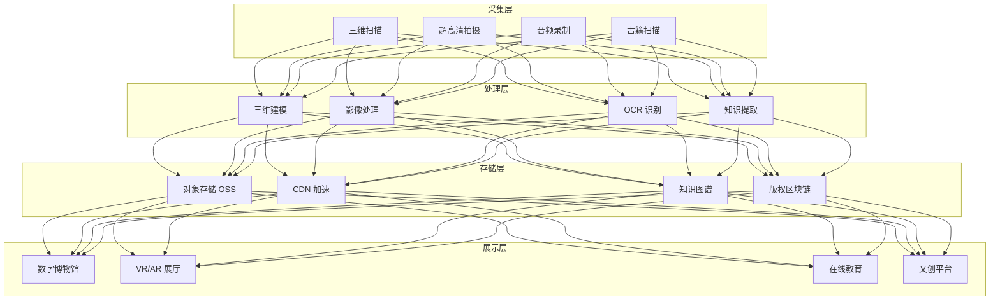

title: 文化数字化架构设计
description: '# 文化数字化架构设计 — 阿里云视角'
category: application-architecture
tags:
- k8s
- architecture
- industry
- gpu
- nvidia
last_updated: 2026-05-18
difficulty: intermediate
reading_level: intermediate
audience:
- 博物馆数字化负责人
- 文化遗产保护专家
- 云渲染工程师
estimated_read_time: 5min
intent_queries:
- 数字博物馆 3D 文物数字化
- VR虚拟展厅云渲染架构
- 古籍 OCR 识别知识提取
- 区块链数字版权存证
- 阿里云 GPU 渲染集群
trigger_keywords:
- 文化数字化
- 数字博物馆
- 文物数字化
- 3D扫描
- VR虚拟展厅
- 古籍OCR
- 区块链版权
- 非遗传承
- IIIF协议
- 云渲染
related_domains:
- domain-03-networking-traffic
- domain-10-troubleshooting-diagnostics
related_topics:
- topic-metaverse-digital-twin
- topic-blockchain-architecture
authors:
- name: KUDIG Team
  role: contributor
k8s_versions:
- '1.28'
- '1.29'
- '1.30'
- '1.31'
- '1.32'
---

# 文化数字化架构设计 — 阿里云视角

> **适用版本**: [[Kubernetes|Kubernetes]] v1.29 - v1.33 | **最后更新**: 2026-04-24
> **作者**: 阿里云解决方案架构师 | **标签**: `#文化数字化` `#数字博物馆` `#非遗` `#文物` `#阿里云`

---

## 目录

1. [概述](#1-概述)
2. [设计原则](#2-设计原则)
3. [架构模式](#3-架构模式)
4. [实现示例](#4-实现示例)
5. [在 Kubernetes 上的部署](#5-在-kubernetes-上的部署)
6. [最佳实践](#6-最佳实践)
7. [反模式](#7-反模式)
8. [参考资源](#8-参考资源)

---

## 1. 概述

文化数字化是利用数字技术对文化遗产进行采集、存储、保护、展示和传播的系统性工程。涵盖文物三维数字化、古籍 OCR 识别、非遗技艺记录、数字博物馆建设、虚拟展厅、文化大数据平台等。文化数字化的核心价值在于：永久保存濒危文化遗产、打破时空限制让公众在线访问、通过 AI 和 XR 技术提供沉浸式文化体验。

文化数字化平台的技术特点：海量多媒体数据（三维模型、超高清影像、音频视频，单件文物数据可达数 GB）、高精度要求（文物三维扫描精度达微米级）、版权保护（数字资产确权和版权管理）、高并发访问（数字博物馆热门展览可达到数十万并发）。

### 1.1 行业背景

| 挑战 | 说明 | 架构影响 |
|:---|:---|:---|
| 海量资源 | 文物/古籍/非遗数字化 | OSS + CDN 分发 |
| 高精度采集 | 三维扫描/超高清影像 | GPU 渲染 + 大容量存储 |
| 知识关联 | 文物间关系挖掘 | 知识图谱 + 图数据库 |
| 传播创新 | 数字展览/虚拟体验 | XR + 云渲染 |
| 版权保护 | 数字资产版权 | 区块链存证 |

### 1.2 核心场景

- **文物数字化**: 三维激光扫描/ photogrammetry/超高清拍摄/数字档案
- **数字博物馆**: 线上展览/虚拟展厅/智能导览
- **非遗传承**: 技艺视频记录/动作捕捉/数字化传承
- **古籍保护**: OCR 识别/知识挖掘/古籍数据库
- **文化大数据**: 文化资源普查/分析/开放共享

---

## 2. 设计原则

### 2.1 无损保护原则

数字化过程不得对文物造成任何损伤。非接触式采集优先（激光扫描、photogrammetry），避免物理接触。存储采用无损格式，保留原始数据。

### 2.2 标准开放原则

采用国际通用的文化数据标准（CIDOC CRM、Dublin Core、IIIF），确保数据的长期可读性和互操作性。提供标准化 API 支持数据共享。

### 2.3 沉浸体验原则

数字展示不仅仅是数据的呈现，而是创造沉浸式的文化体验。通过 VR/AR/XR 技术、3D 交互、AI 导览等方式，让用户获得超越物理展览的体验。

### 2.4 版权保护原则

数字化文物是重要的数字资产。通过区块链存证确权、数字水印防盗用、访问控制管理权限。

---

## 3. 架构模式

### 3.1 文化数字化平台全景架构



---

## 4. 实现示例

### 4.1 文物数字资产管理

```go
package cultural

import (
    "time"
)

type Artifact struct {
    ID           string
    Name         string
    Dynasty      string
    Category     string
    MuseumID     string
    Model3DRef   string
    ImageRefs    []string
    Description  string
    CreatedAt    time.Time
    BlockchainTx string
}

type ArtifactService struct {
    artifacts map[string]*Artifact
}

func (s *ArtifactService) Register(a *Artifact) error {
    s.artifacts[a.ID] = a
    return nil
}
```

---

## 5. 在 Kubernetes 上的部署

```yaml
apiVersion: apps/v1
kind: Deployment
metadata:
  name: cultural-3d-render
  namespace: cultural-digitization
spec:
  replicas: 3
  selector:
    matchLabels:
      app: cultural-3d-render
  template:
    metadata:
      labels:
        app: cultural-3d-render
    spec:
      nodeSelector:
        accelerator: nvidia-a10
      runtimeClassName: nvidia
      containers:
        - name: render
          image: registry.cn-hangzhou.aliyuncs.com/culture/3d-render:v2.0.0-gpu
          env:
            - name: MODEL_FORMAT
              value: "gltf"
            - name: TEXTURE_QUALITY
              value: "4k"
          resources:
            requests:
              nvidia.com/gpu: 1
              memory: "16Gi"
              cpu: "8000m"
            limits:
              nvidia.com/gpu: 1
              memory: "32Gi"
              cpu: "16000m"
```

---

## 6. 最佳实践

- **IIIF 标准**: 使用 IIIF 协议提供高分辨率图像服务，支持缩放/裁剪
- **区块链确权**: 数字化文物上链存证，确保版权可追溯
- **CDN 加速**: 三维模型和高清图像通过 CDN 加速分发
- **渐进式加载**: 三维模型使用 LOD（Level of Detail）渐进式加载

## 7. 反模式

- **有损压缩**: 对文物图像使用有损压缩丢失细节。应使用无损格式存储原始数据
- **忽视数据标准**: 不遵循国际数据标准，导致数据无法共享。应采用 CIDOC CRM 等标准
- **单点存储**: 所有数字资产存在单一存储，存在丢失风险。应多重备份+异地容灾

---

## 8. 参考资源

### 8.1 阿里云组件映射

| 功能域 | **阿里云云原生方案** |
|:---|:---|
| 容器平台 | **ACK Pro + GPU** |
| 对象存储 | **OSS + CDN** |
| AI | **PAI + 视觉智能** |
| 区块链 | **蚂蚁链 BaaS** |
| 数据库 | **PolarDB** |
| 可观测性 | **ARMS + SLS** |

### 8.2 生产检查清单

- [ ] 三维扫描精度验证（微米级）
- [ ] 古籍 OCR 准确率 > 95%
- [ ] 文物数字化无损检测
- [ ] 版权区块链存证完整
- [ ] 虚拟展厅并发承载测试

---

**维护者**: 阿里云解决方案架构师团队 | **许可证**: MIT

---

## Obsidian 相关文档

- topic-application-architecture KUDIG Database — Global MOC
- [[domain-20-application-patterns/topic-application-architecture/README.md|[[Topic 应用层架构设计最佳实践|Topic 应用层架构设计最佳实践]]]]
- [[domain-20-application-patterns/topic-application-architecture/01-ecommerce-architecture.md|电商系统 Kubernetes 生产架构设计]]
- [[domain-20-application-patterns/topic-application-architecture/02-mini-program-architecture.md|小程序平台架构设计]]
- [[domain-20-application-patterns/topic-application-architecture/03-cms-architecture.md|内容管理系统 CMS 架构设计]]
- [[domain-20-application-patterns/topic-application-architecture/04-im-rtc-architecture.md|实时通信 IM/RTC 架构设计]]
- [[domain-20-application-patterns/topic-application-architecture/05-online-education-architecture.md|在线教育平台 Kubernetes 生产架构设计]]
- [[domain-20-application-patterns/topic-application-architecture/06-fintech-architecture.md|金融科技FinTech Kubernetes生产架构设计]]
- [[domain-20-application-patterns/topic-application-architecture/07-iot-platform-architecture.md|物联网 IoT 平台架构设计]]
- [[domain-20-application-patterns/topic-application-architecture/08-ai-ml-inference-architecture.md|AI/ML 推理服务 Kubernetes 生产架构设计]]
- [[domain-20-application-patterns/topic-application-architecture/09-gaming-backend-architecture.md|游戏后端 Kubernetes 生产架构设计]]
- [[domain-20-application-patterns/topic-application-architecture/10-social-media-architecture.md|社交媒体平台Kubernetes生产架构设计]]

## See Also

- 81-smart-customs
- 82-legaltech
- 84-national-park
- 85-hydrogen-energy

## Related

- topic-application-architecture MOC — Cross-reference
