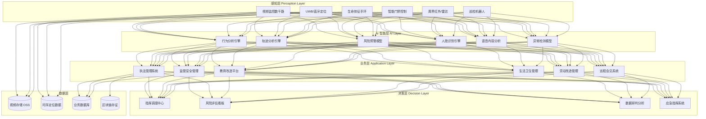
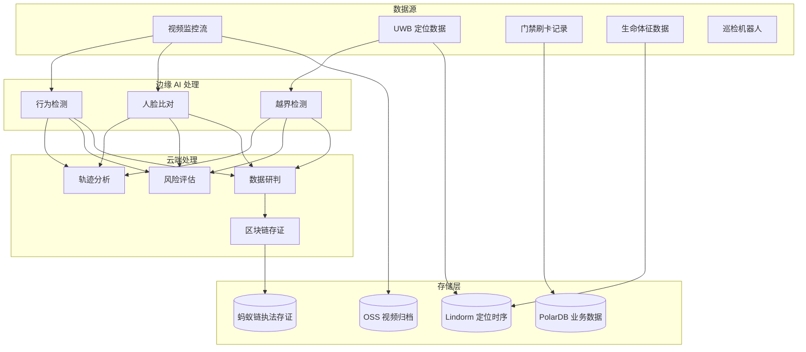

title: 智慧监狱架构设计
description: '# 智慧监狱架构设计 — 阿里云视角'
category: application-architecture
tags:
- k8s
- architecture
- industry
- [[Prometheus|prometheus]]
- opa
- mysql
- operator
- webhook
- gpu
- nvidia
last_updated: 2026-05-18
difficulty: advanced
reading_level: advanced
audience:
- 司法信息化架构师
- 安防系统工程师
- 合规专家
estimated_read_time: 5min
intent_queries:
- 监狱视频 AI 行为分析系统
- UWB 室内精确定位在押人员
- 区块链执法数据存证溯源
- 等保三级安全合规架构
- 阿里云 GPU 边缘推理
trigger_keywords:
- 智慧监狱
- AI行为分析
- 视频监控
- UWB定位
- 区块链存证
- 等保三级
- 司法矫正
- 无人巡检
- 远程会见
- 心理评估
related_domains:
- domain-03-networking-traffic
- domain-10-troubleshooting-diagnostics
related_topics:
- topic-ai-algorithm
- topic-security-architecture
authors:
- name: KUDIG Team
  role: contributor
k8s_versions:
- '1.28'
- '1.29'
- '1.30'
- '1.31'
- '1.32'
---

# 智慧监狱架构设计 — 阿里云视角

> **适用版本**: [[Kubernetes|Kubernetes]] v1.29 - v1.33 | **最后更新**: 2026-04-24
> **作者**: 阿里云解决方案架构师 | **标签**: `#智慧监狱` `#司法矫正` `#AI监控` `#智慧监管` `#阿里云`

---

<!-- chunk: 目录 -->## 目录

1. [行业概述](#1-行业概述)
2. [业务场景](#2-业务场景)
3. [架构设计](#3-架构设计)
4. [核心技术栈](#4-核心技术栈)
5. [Kubernetes 部署方案](#5-kubernetes-部署方案)
6. [数据架构](#6-数据架构)
7. [AI/ML 组件](#7-aiml-组件)
8. [安全与合规](#8-安全与合规)
9. [最佳实践](#9-最佳实践)
10. [反模式](#10-反模式)
11. [参考资源](#11-参考资源)

---

<!-- chunk: 1. 行业概述 -->## 1. 行业概述

#<!-- chunk: 1.1 市场规模与趋势 -->## 1.1 市场规模与趋势

智慧监狱是司法数字化转型的核心领域，通过 AI、IoT、大数据等技术提升监管安全和服刑人员改造质量。全国约有 680 所监狱，智慧监狱建设市场预计从 2024 年的 120 亿元增长到 2028 年的 300 亿元。政策驱动力包括《智慧监狱技术规范》（SF/T 0028-2021）、《监狱信息化建设标准》等。

| 指标 | 2024 年 | 2026 年（预测） | 2028 年（预测） |
|:---|:---|:---|:---|
| 智慧监狱覆盖率 | 30% | 55% | 80% |
| 单所建设投入 | 500-1000 万 | 800-1500 万 | 1000-2000 万 |
| AI 行为识别准确率 | 85% | 92% | 96% |
| UWB 定位精度 | 0.5m | 0.3m | 0.1m |
| 机器人巡检覆盖率 | 10% | 30% | 60% |

#<!-- chunk: 1.2 行业痛点 -->## 1.2 行业痛点

| 痛点 | 说明 | 数字化转型驱动 |
|:---|:---|:---|
| 监管安全 | 防脱逃/防暴乱/防自杀/防违规 | AI 视频分析 + 全方位智能感知 |
| 人员管理 | 在押人员行为分析/心理评估 | AI 行为识别 + 心理评估模型 |
| 执法规范 | 减刑假释/计分考核透明化 | 区块链存证 + 智能考核系统 |
| 教育改造 | 个性化矫正方案不足 | AI 推荐教育课程 + 技能培训 |
| 医疗救治 | 突发疾病应急响应慢 | 远程医疗 + IoT 生命体征监测 |
| 系统孤岛 | 各子系统数据不通 | 数据中台 + 统一指挥调度 |

#<!-- chunk: 1.3 数字化转型架构影响 -->## 1.3 数字化转型架构影响

智慧监狱系统涉及感知层（视频/定位/门禁/周界/生命体征）、智能层（行为分析/轨迹分析/风险预警/人脸识别）、业务层（监管安全/执法管理/教育改造/生活卫生）和决策层（指挥调度/风险评估/数据研判）。需要严格的物理隔离、等保三级合规和多级数据安全保护。

---

<!-- chunk: 2. 业务场景 -->## 2. 业务场景

#<!-- chunk: 2.1 智能视频监控与行为分析 -->## 2.1 智能视频监控与行为分析

通过部署数千路摄像头覆盖监区、车间、操场、食堂等全场景，AI 实时分析视频流，识别打架斗殴、攀爬围墙、异常聚集、自残自杀、违规传递物品等行为。系统需要在 3 秒内完成异常检测并触发分级告警。

**核心流程**: 视频流接入 → 人体检测 → 姿态估计 → 行为分类 → 风险评分 → 分级告警 → 指挥调度

#<!-- chunk: 2.2 人员精确定位与轨迹追踪 -->## 2.2 人员精确定位与轨迹追踪

基于 UWB + 蓝牙融合定位技术，实现对在押人员和干警的厘米级实时定位。支持电子围栏、越界告警、异常轨迹检测、人员清点等功能。在监舍、车间、操场等区域部署 UWB 基站，实现全覆盖。

#<!-- chunk: 2.3 智能巡检机器人 -->## 2.3 智能巡检机器人

巡检机器人自动在监区走廊、周界等区域巡逻，搭载高清摄像头、热成像、气体传感器。机器人可以 24 小时不间断巡逻，自动识别异常情况并上报指挥中心。支持远程遥控和自主导航两种模式。

#<!-- chunk: 2.4 远程视频会见与智能管控 -->## 2.4 远程视频会见与智能管控

家属通过远程视频会见系统与在押人员进行视频通话。系统需要人脸核验、通话录音、敏感内容检测、时长控制等能力。AI 实时分析通话内容，检测违规话题并自动告警。

#<!-- chunk: 2.5 教育矫正与在线学习 -->## 2.5 教育矫正与在线学习

为在押人员提供个性化教育和职业技能培训。系统根据个人犯罪类型、文化程度、改造表现等推荐教育课程和职业技能培训。支持在线考试、证书管理和改造评估。

---

<!-- chunk: 3. 架构设计 -->## 3. 架构设计

#<!-- chunk: 3.1 智慧监狱全景架构 -->## 3.1 智慧监狱全景架构



---

<!-- chunk: 4. 核心技术栈 -->## 4. 核心技术栈

| Component | Purpose | Technology | License |
|:---|:---|:---|:---|
| Container Orchestration | Workload management | ACK Pro + GPU (物理隔离集群) | Proprietary |
| AI Video Analysis | Behavior recognition | PAI + 自研行为分析模型 | Proprietary |
| Object Detection | Person/object detection | YOLOv8 / RT-DETR | GPL / Apache 2.0 |
| Pose Estimation | Human pose estimation | MMPose / MediaPipe | Apache 2.0 |
| Face Recognition | Identity verification | ArcFace / 阿里云视觉智能 | Proprietary |
| UWB Positioning | Indoor precise positioning | UWB DW1000 / Decawave | Proprietary |
| Time-Series DB | Location & sensor data | Lindorm TSDB | Proprietary |
| Relational DB | Business data | PolarDB MySQL | Proprietary |
| Object Storage | Video & evidence storage | OSS | Proprietary |
| Blockchain | Law enforcement evidence | 蚂蚁链 BaaS | Proprietary |
| IoT Platform | Device management | 阿里云 IoT 平台 | Proprietary |
| Message Queue | Event streaming | Apache RocketMQ 5.x | Apache 2.0 |
| Edge Computing | On-premise AI inference | ACK Edge + NVIDIA Jetson | Proprietary |
| Monitoring | Observability | ARMS + SLS | Proprietary |

---

<!-- chunk: 5. Kubernetes 部署方案 -->## 5. Kubernetes 部署方案

#<!-- chunk: 5.1 AI 行为分析 GPU Deployment -->## 5.1 AI 行为分析 GPU Deployment

```yaml
apiVersion: apps/v1
kind: Deployment
metadata:
  name: prison-behavior-ai
  namespace: smart-prison
  labels:
    app: prison-behavior-ai
    tier: ai-inference
spec:
  replicas: 6
  selector:
    matchLabels:
      app: prison-behavior-ai
  strategy:
    rollingUpdate:
      maxSurge: 1
      maxUnavailable: 0
  template:
    metadata:
      labels:
        app: prison-behavior-ai
        tier: ai-inference
      annotations:
        prometheus.io/scrape: "true"
        prometheus.io/port: "9090"
    spec:
      nodeSelector:
        accelerator: nvidia-t4
        zone: prison-datacenter
      runtimeClassName: nvidia
      tolerations:
        - key: "dedicated"
          operator: "Equal"
          value: "prison-ai"
          effect: "NoSchedule"
      containers:
        - name: analyzer
          image: registry.cn-hangzhou.aliyuncs.com/prison/behavior-ai:v3.0.0-gpu
          ports:
            - containerPort: 8080
              name: http
            - containerPort: 9090
              name: metrics
          env:
            - name: DETECTION_CLASSES
              value: "fight,climb,gather,suicide_risk,smuggle,fall"
            - name: ALERT_THRESHOLD
              value: "0.75"
            - name: MAX_VIDEO_STREAMS
              value: "50"
            - name: MODEL_PATH
              value: "/models/behavior-v3"
            - name: ALERT_WEBHOOK
              valueFrom:
                secretKeyRef:
                  name: prison-secrets
                  key: alert-webhook-url
            - name: DB_CONNECTION
              valueFrom:
                secretKeyRef:
                  name: prison-secrets
                  key: db-connection
          resources:
            requests:
              nvidia.com/gpu: 1
              memory: "8Gi"
              cpu: "4000m"
            limits:
              nvidia.com/gpu: 1
              memory: "16Gi"
              cpu: "8000m"
          readinessProbe:
            httpGet:
              path: /health/ready
              port: 8080
            initialDelaySeconds: 30
            periodSeconds: 10
          livenessProbe:
            httpGet:
              path: /health/live
              port: 8080
            initialDelaySeconds: 60
            periodSeconds: 15
          volumeMounts:
            - name: model-data
              mountPath: /models
              readOnly: true
            - name: tmp-cache
              mountPath: /tmp/cache
      volumes:
        - name: model-data
          persistentVolumeClaim:
            claimName: ai-model-pvc
        - name: tmp-cache
          emptyDir:
            medium: "Memory"
            sizeLimit: "4Gi"
```

#<!-- chunk: 5.2 定位服务 Deployment -->## 5.2 定位服务 Deployment

```yaml
apiVersion: apps/v1
kind: Deployment
metadata:
  name: positioning-service
  namespace: smart-prison
spec:
  replicas: 3
  selector:
    matchLabels:
      app: positioning-service
  template:
    metadata:
      labels:
        app: positioning-service
    spec:
      containers:
        - name: positioning
          image: registry.cn-hangzhou.aliyuncs.com/prison/positioning:v2.0.0
          ports:
            - containerPort: 8080
          env:
            - name: UWB_ENABLED
              value: "true"
            - name: BLE_ENABLED
              value: "true"
            - name: FUSION_ALGORITHM
              value: "kalman-filter"
            - name: UPDATE_RATE_HZ
              value: "10"
            - name: GEO_FENCE_COUNT
              value: "50"
          resources:
            requests:
              memory: "4Gi"
              cpu: "2000m"
            limits:
              memory: "8Gi"
              cpu: "4000m"
```

#<!-- chunk: 5.3 ConfigMap, Service 与 Secret -->## 5.3 ConfigMap, Service 与 Secret

```yaml
apiVersion: v1
kind: ConfigMap
metadata:
  name: prison-config
  namespace: smart-prison
data:
  alert-rules: |
    {
      "fight": {"threshold": 0.80, "level": "critical", "response_time_s": 3},
      "climb": {"threshold": 0.85, "level": "critical", "response_time_s": 2},
      "gather": {"threshold": 0.70, "level": "warning", "response_time_s": 10},
      "suicide_risk": {"threshold": 0.75, "level": "critical", "response_time_s": 2},
      "smuggle": {"threshold": 0.80, "level": "warning", "response_time_s": 5},
      "fall": {"threshold": 0.85, "level": "critical", "response_time_s": 3}
    }
  geo-fences: |
    [
      {"id": "perimeter-01", "type": "forbidden", "alert_level": "critical"},
      {"id": "workshop-01", "type": "allowed", "schedule": "08:00-17:00"},
      {"id": "dorm-01", "type": "allowed", "schedule": "21:00-06:00"}
    ]
  video-retention: "90d"
  blockchain-endpoint: "http://antchain-baas:8080"
---
apiVersion: v1
kind: Service
metadata:
  name: prison-behavior-ai
  namespace: smart-prison
spec:
  selector:
    app: prison-behavior-ai
  ports:
    - name: http
      port: 8080
      targetPort: 8080
    - name: metrics
      port: 9090
      targetPort: 9090
  type: ClusterIP
---
apiVersion: v1
kind: Secret
metadata:
  name: prison-secrets
  namespace: smart-prison
type: Opaque
stringData:
  alert-webhook-url: "https://dispatch.prison.example.com/api/alerts"
  db-connection: "mysql://prison_app@polardb.prison.rds.aliyuncs.com:3306/prison_db"
  blockchain-key: "antchain-private-key-placeholder"
  video-storage-key: "oss-encryption-key-placeholder"
```

---

<!-- chunk: 6. 数据架构 -->## 6. 数据架构

#<!-- chunk: 6.1 数据流全景 -->## 6.1 数据流全景



#<!-- chunk: 6.2 数据流说明 -->## 6.2 数据流说明

- **视频数据流**: 摄像头 RTSP 流接入边缘 AI 推理盒子，异常帧截图上传 OSS，元数据写入 PolarDB
- **定位数据流**: UWB 基站数据经边缘网关聚合后写入 Lindorm，电子围栏告警实时推送
- **执法存证流**: 减刑假释、计分考核等执法数据经区块链存证，确保不可篡改
- **生命体征流**: 手环采集心率、体温、活动量，异常数据触发医疗告警

---

<!-- chunk: 7. AI/ML 组件 -->## 7. AI/ML 组件

#<!-- chunk: 7.1 核心模型 -->## 7.1 核心模型

| 模型 | 用途 | 输入 | 输出 | 框架 |
|:---|:---|:---|:---|:---|
| 行为识别 | 打架/攀爬/聚集/自残检测 | 视频片段 | 行为类别 + 置信度 | SlowFast / VideoMAE |
| 人体姿态估计 | 人体关键点检测 | 图像帧 | 17 关键点坐标 | HRNet / MMPose |
| 人脸识别 | 在押人员身份核验 | 人脸图像 | 身份 ID + 相似度 | ArcFace |
| 轨迹异常 | 异常移动轨迹检测 | 定位时序 | 异常类型 + 位置 | LSTM-AE |
| 心理评估 | 心理健康风险评估 | 行为/问卷/生理数据 | 风险等级 (1-5) | XGBoost Ensemble |
| 语音内容分析 | 会见内容合规检测 | 语音流 | 敏感话题标记 | Whisper + NER |
| 人群密度 | 区域人员密度估计 | 俯视视频 | 密度热力图 | CSRNet |

#<!-- chunk: 7.2 模型训练与部署 -->## 7.2 模型训练与部署

模型训练在隔离的 GPU 集群上进行，使用脱敏后的历史监控数据。推理部署在监狱本地机房的 ACK Edge 集群，关键模型（行为识别/人脸识别）要求离线可用，不依赖外网连接。

---

<!-- chunk: 8. 安全与合规 -->## 8. 安全与合规

#<!-- chunk: 8.1 行业法规与标准 -->## 8.1 行业法规与标准

| 法规/标准 | 适用范围 | 架构要求 |
|:---|:---|:---|
| SF/T 0028-2021 | 智慧监狱技术规范 | 总体架构合规 |
| 等保三级 | 监狱信息系统安全 | 网络隔离 + 审计 + 加密 |
| 监狱法 | 监狱管理法律依据 | 执法流程合规 |
| 刑法/刑事诉讼法 | 减刑假释法律依据 | 执法数据完整追溯 |
| 个人信息保护法 | 在押人员信息保护 | 数据脱敏 + 最小权限 |
| 司法部信息化标准 | 监狱信息化建设标准 | 系统互联互通 |
| GB/T 35273 | 个人信息安全规范 | 信息分类分级管理 |

#<!-- chunk: 8.2 安全架构要点 -->## 8.2 安全架构要点

- **物理隔离**: 监狱业务网络与互联网完全物理隔离，数据通过安全网闸单向导出
- **数据安全**: 在押人员数据加密存储，访问需双重授权审批
- **视频安全**: 视频数据不可外泄，存储加密 + 传输加密 + 水印追踪
- **执法存证**: 减刑假释等执法数据区块链存证，确保公平公正
- **应急预案**: 系统问题时自动切换到基础安防模式，保障最低安全标准

---

<!-- chunk: 9. 最佳实践 -->## 9. 最佳实践

1. **边缘 AI 优先**: 视频行为分析在边缘端完成推理，仅将告警结果和关键帧上传云端，节省 90%+ 带宽
2. **多模态融合告警**: 将视频分析、定位轨迹、门禁记录等多源数据融合，降低误报率至 < 1%
3. **分级响应机制**: 根据风险等级自动触发不同响应（通知值班干警 → 调度巡逻 → 全监警报）
4. **视频智能存储**: 正常画面低帧率存储，异常事件前后完整保留，节省 60%+ 存储空间
5. **UWB + 蓝牙融合**: 室内用 UWB 精确定位，室外用蓝牙补充覆盖，降低成本
6. **定期盲区排查**: 每季度进行视频覆盖盲区排查，确保 100% 无死角
7. **执法数据上链**: 减刑假释/计分考核/保外就医等关键执法数据实时上链存证
8. **系统冗余设计**: AI 推理服务至少 2 副本，数据库主备切换 < 30s，确保 7×24 不间断运行
9. **脱敏训练数据**: 模型训练使用脱敏数据，避免在押人员隐私泄露
10. **定期压力测试**: 每半年进行全系统压力测试，确保峰值场景下系统稳定

---

<!-- chunk: 10. 反模式 -->## 10. 反模式

1. **全量视频上云**: 将所有视频流全量上传云端分析，带宽不足导致延迟严重。应在边缘端完成 AI 推理
2. **忽视离线能力**: AI 系统完全依赖外网，网络问题时安全监控瘫痪。应确保关键 AI 功能离线可用
3. **单一告警通道**: 所有告警都通过同一通道推送，告警风暴时关键告警被淹没。应实施分级告警和多通道推送
4. **数据未上链存证**: 执法数据仅存储在数据库中，存在篡改风险和公信力问题。应关键数据区块链存证
5. **忽视心理评估**: 仅关注物理安全监控，忽视在押人员心理健康评估。应部署心理评估模型

---

<!-- chunk: 11. 参考资源 -->## 11. 参考资源

- [SF/T 0028-2021 智慧监狱技术规范](https://www.moj.gov.cn/)
- [司法部监狱信息化建设标准](https://www.moj.gov.cn/)
- [GB/T 22239-2019 信息安全技术 网络安全等级保护基本要求](https://openstd.samr.gov.cn/)
- [NVIDIA Metropolis 智慧城市视频分析](https://www.nvidia.com/en-us/autonomous-machines/intelligent-video-analytics-platform/)
- [YOLOv8 Real-Time Object Detection](https://github.com/ultralytics/ultralytics)
- [OpenMMLab MMPose 姿态估计](https://github.com/open-mmlab/mmpose)
- [蚂蚁链 BaaS 区块链服务](https://www.antchain.net/)
- [阿里云 IoT 平台文档](https://help.aliyun.com/product/30520.html)

---

**维护者**: 阿里云解决方案架构师团队 | **许可证**: MIT

---

<!-- chunk: Obsidian 相关文档 -->## Obsidian 相关文档

- topic-application-architecture MOC
- [[domain-20-application-patterns/topic-application-architecture/README|Topic 应用层架构设计最佳实践]]
- [[domain-20-application-patterns/topic-application-architecture/01-ecommerce-architecture|电商系统 Kubernetes 生产架构设计]]
- [[domain-20-application-patterns/topic-application-architecture/02-mini-program-architecture|小程序平台架构设计]]
- [[domain-20-application-patterns/topic-application-architecture/03-cms-architecture|内容管理系统 CMS 架构设计]]
- [[domain-20-application-patterns/topic-application-architecture/04-im-rtc-architecture|实时通信 IM/RTC 架构设计]]
- [[domain-20-application-patterns/topic-application-architecture/05-online-education-architecture|在线教育平台 Kubernetes 生产架构设计]]
- [[domain-20-application-patterns/topic-application-architecture/06-fintech-architecture|金融科技FinTech Kubernetes生产架构设计]]
- [[domain-20-application-patterns/topic-application-architecture/07-iot-platform-architecture|物联网 IoT 平台架构设计]]
- [[domain-20-application-patterns/topic-application-architecture/08-ai-ml-inference-architecture|AI/ML 推理服务 Kubernetes 生产架构设计]]
- [[domain-20-application-patterns/topic-application-architecture/09-gaming-backend-architecture|游戏后端 Kubernetes 生产架构设计]]
- [[domain-20-application-patterns/topic-application-architecture/10-social-media-architecture|社交媒体平台Kubernetes生产架构设计]]

## See Also

- 92-smart-sports-venue
- 93-digital-twin-factory
- 95-industrial-metaverse
- 96-carbon-capture

## Related

- topic-application-architecture MOC — Cross-reference
