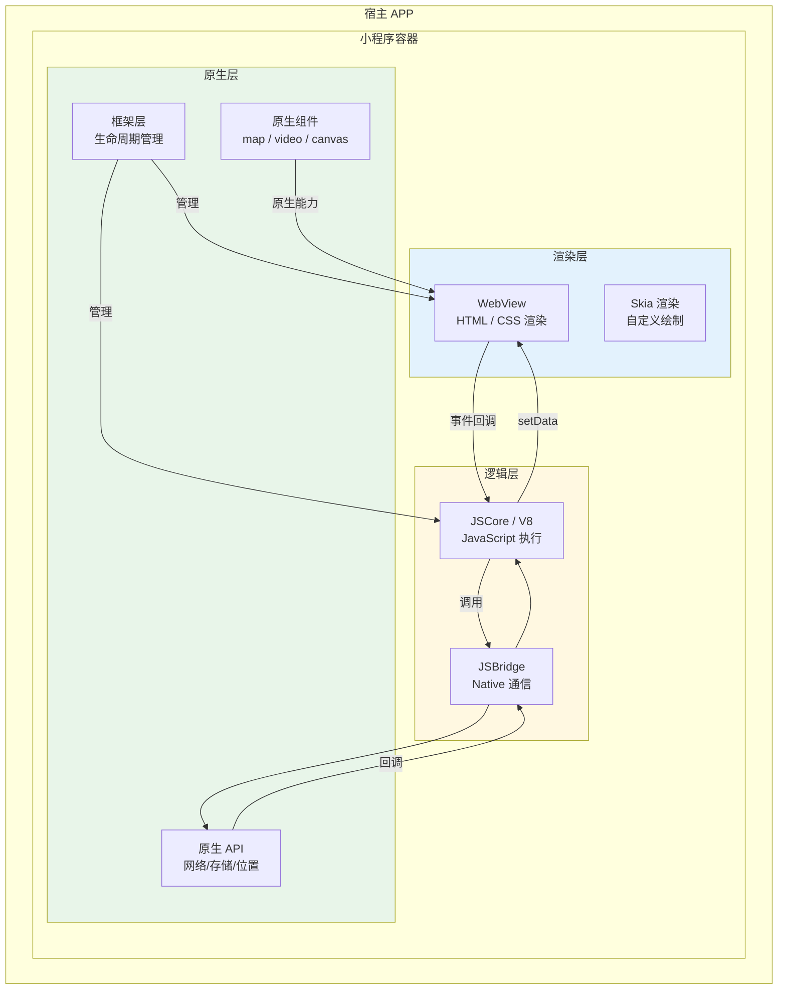
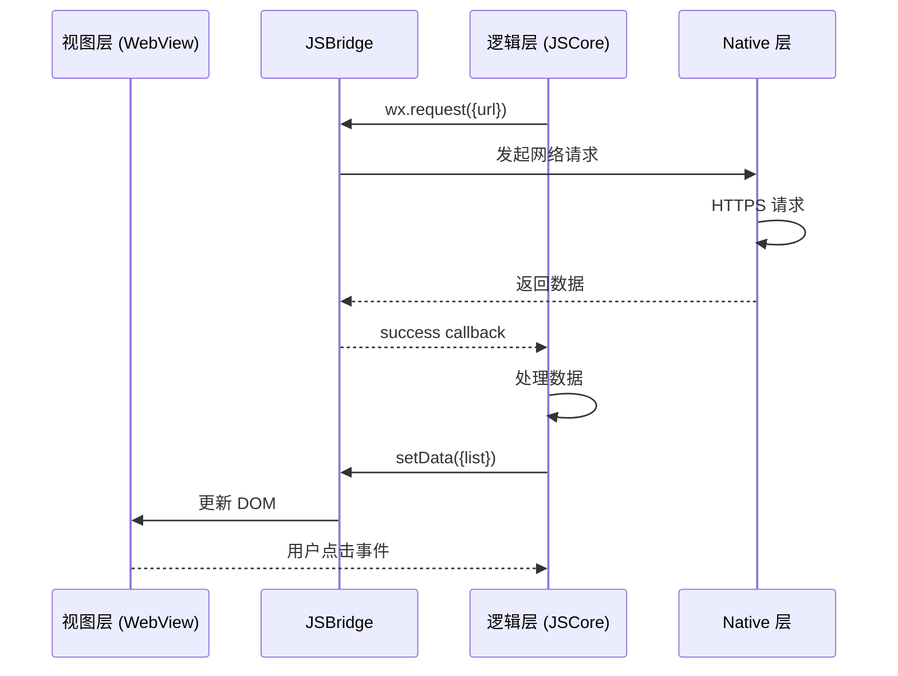
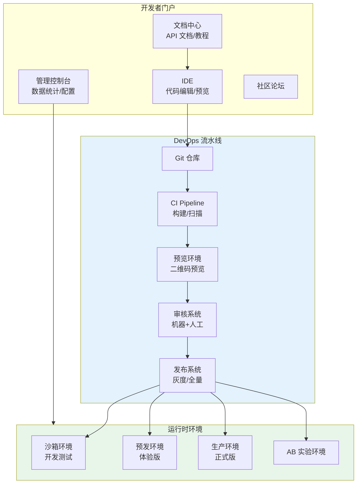
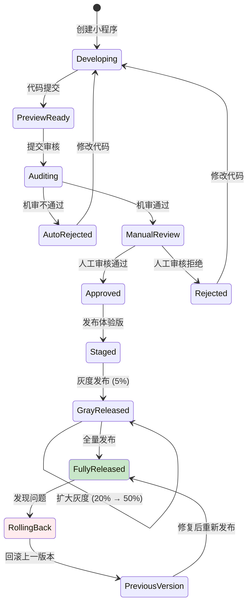
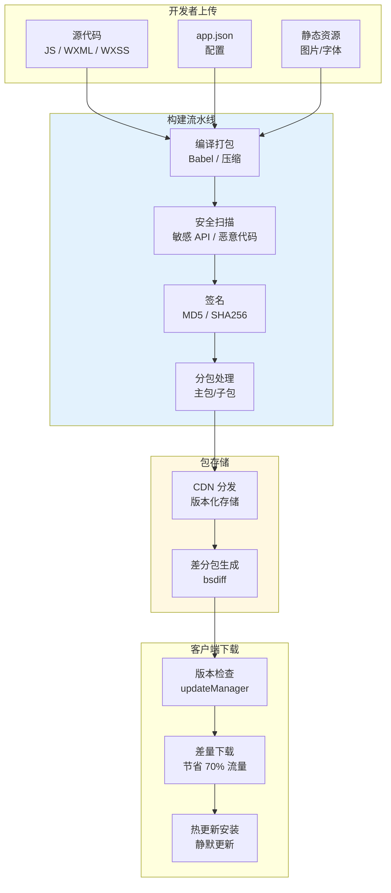
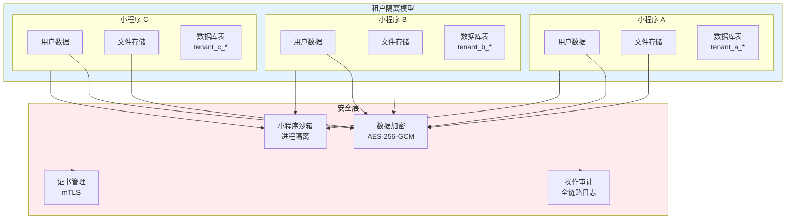
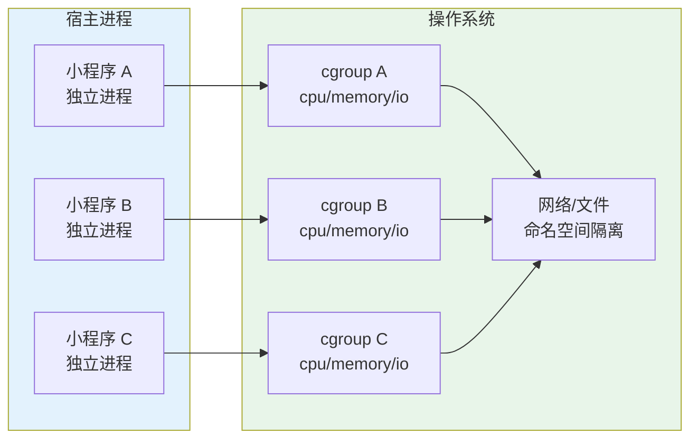
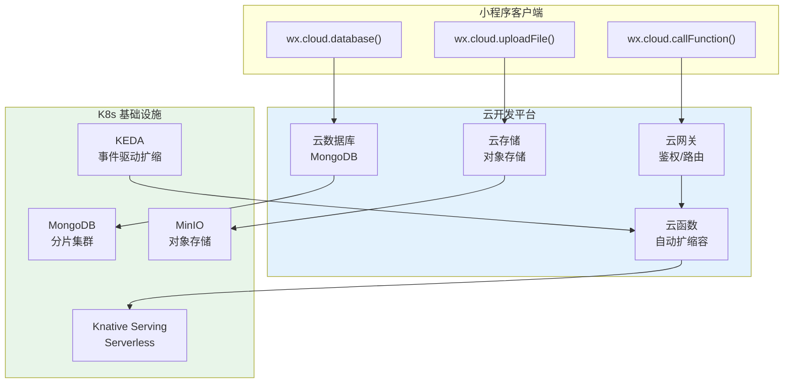
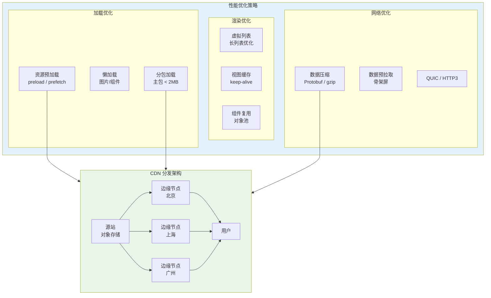

```mermaid
flowchart TB
    subgraph Client["客户端层"]
        WECHAT["微信客户端<br/>JSRuntime + 原生渲染"]
        ALIPAY["支付宝客户端"]
        DOUYIN["抖音客户端"]
        BAIDU["百度 APP"]
        WEBVIEW["通用 WebView"]
    end

    subgraph Gateway["接入网关层"]
        DNS["智能 DNS"]
        LB["L7 负载均衡"]
        API_GW["API Gateway<br/>鉴权/限流/路由"]
        CDN["CDN / Edge<br/>静态资源加速"]
    end

    subgraph Platform["平台服务层"]
        AUTH["授权中心<br/>OAuth2 / Code2Session"]
        RUNTIME["小程序运行时<br/>JSSDK / 组件库"]
        SANDBOX["沙箱隔离<br/>容器/VM"]
        DEV_TOOLS["开发者工具<br/>IDE / 调试器"]
    end

    subgraph Biz["业务服务层"]
        APP_MGMT["应用管理<br/>创建/配置/版本"]
        USER_MGMT["用户管理<br/>OpenID / UnionID"]
        DATA_API["数据接口<br/>云函数 / 云数据库"]
        PAYMENT["支付服务<br/>小程序支付"]
        MSG["消息推送<br/>订阅消息 / 模板消息"]
        ANALYTICS["数据分析<br/>埋点 / 漏斗"]
    end

    subgraph Infra["基础设施层"]
        K8S["Kubernetes 集群"]
        SERVERLESS["Serverless 运行时<br/>Knative / OpenFunction"]
        DB["数据库集群"]
        CACHE["缓存集群"]
        OSS["对象存储"]
    end

    Client --> Gateway
    Gateway --> Platform --> Biz --> Infra

    style Platform fill:#e3f2fd
    style Biz fill:#fff8e1
    style Infra fill:#e8f5e9
```

title: 小程序平台架构设计
description: '# 小程序平台 [[Kubernetes|Kubernetes]] 生产架构设计'
category: application-architecture
tags:
- k8s
- architecture
- industry
- [[Prometheus|prometheus]]
- docker
- minio
- kafka
- gateway
- serverless
- rag
last_updated: 2026-05-18
difficulty: advanced
reading_level: advanced
audience:
- 小程序平台架构师
- 前端开发工程师
- Serverless工程师
estimated_read_time: 5min
intent_queries:
- 小程序平台 Kubernetes 高并发架构
- 微信支付宝抖音小程序运行时
- Serverless 云函数 Knative
- 小程序安全沙箱隔离
- 阿里云 ACK 小程序云
trigger_keywords:
- 小程序平台
- 微信小程序
- 支付宝小程序
- Serverless
- Knative
- 云函数
- 沙箱隔离
- 热更新
- 灰度发布
- 审核系统
related_domains:
- domain-03-networking-traffic
- domain-10-troubleshooting-diagnostics
related_topics:
- topic-mini-program-architecture
- topic-serverless-architecture
authors:
- name: KUDIG Team
  role: contributor
k8s_versions:
- '1.28'
- '1.29'
- '1.30'
- '1.31'
- '1.32'
---

# 小程序平台 Kubernetes 生产架构设计

> **适用场景**: 微信小程序 / 支付宝小程序 / 抖音小程序 / 快手小程序 / 自建小程序  
> **适用版本**: Kubernetes v1.29 - v1.33  
> **最后更新**: 2026-04-24  
> **目标读者**: 小程序平台架构师、前端/后端开发 TL

---

<!-- chunk: 📋 目录 -->## 📋 目录

- [一、整体架构全景](#一整体架构全景)
- [二、小程序运行时架构](#二小程序运行时架构)
- [三、开发者平台架构](#三开发者平台架构)
- [四、小程序发布与审核架构](#四小程序发布与审核架构)
- [五、数据隔离与安全架构](#五数据隔离与安全架构)
- [六、Serverless 后端架构](#六serverless-后端架构)
- [七、性能优化与 CDN 架构](#七性能优化与-cdn-架构)
- [八、K8s 部署架构](#八k8s-部署架构)

---

<!-- chunk: 一、整体架构全景 -->## 一、整体架构全景



---

<!-- chunk: 二、小程序运行时架构 -->## 二、小程序运行时架构



## 双线程模型通信



---

<!-- chunk: 三、开发者平台架构 -->## 三、开发者平台架构



## 小程序发布状态机



---

<!-- chunk: 四、小程序发布与审核架构 -->## 四、小程序发布与审核架构



## K8s 构建流水线

```yaml
apiVersion: tekton.dev/v1beta1
kind: Pipeline
metadata:
  name: miniapp-build-pipeline
  namespace: miniapp-devops
spec:
  workspaces:
    - name: source
    - name: docker-config
  params:
    - name: app-id
      type: string
    - name: version
      type: string
  tasks:
    - name: clone
      taskRef:
        name: git-clone
      workspaces:
        - name: output
          workspace: source
      params:
        - name: url
          value: "https://github.com/miniapps/$(params.app-id).git"

    - name: lint
      runAfter: [clone]
      workspaces:
        - name: source
          workspace: source
      taskSpec:
        steps:
          - name: eslint
            image: node:20-alpine
            workingDir: $(workspaces.source.path)
            script: |
              npm ci
              npm run lint
              npm run type-check

    - name: security-scan
      runAfter: [lint]
      workspaces:
        - name: source
          workspace: source
      taskSpec:
        steps:
          - name: scan
            image: sec-scanner:latest
            workingDir: $(workspaces.source.path)
            script: |
              scan --rules miniapp-rules.json \
                   --output report.json

    - name: build-and-package
      runAfter: [security-scan]
      workspaces:
        - name: source
          workspace: source
      taskSpec:
        steps:
          - name: build
            image: node:20-alpine
            workingDir: $(workspaces.source.path)
            script: |
              npm run build
              npm run package -- --version $(params.version)

    - name: upload-to-cdn
      runAfter: [build-and-package]
      workspaces:
        - name: source
          workspace: source
      taskSpec:
        steps:
          - name: upload
            image: ossutil:latest
            script: |
              ossutil cp -r \
                $(workspaces.source.path)/dist/ \
                oss://miniapp-packages/$(params.app-id)/$(params.version)/
```

---

<!-- chunk: 五、数据隔离与安全架构 -->## 五、数据隔离与安全架构



## 小程序沙箱隔离



---

<!-- chunk: 六、Serverless 后端架构 -->## 六、Serverless 后端架构



## Knative 云函数配置

```yaml
apiVersion: serving.knative.dev/v1
kind: Service
metadata:
  name: miniapp-cloud-function
  namespace: miniapp-serverless
spec:
  template:
    metadata:
      annotations:
        autoscaling.knative.dev/minScale: "0"
        autoscaling.knative.dev/maxScale: "100"
        autoscaling.knative.dev/targetConcurrency: "10"
        autoscaling.knative.dev/scale-down-delay: "5m"
    spec:
      containerConcurrency: 10
      timeoutSeconds: 30
      containers:
        - image: miniapp/cloud-function-runtime:v1.0
          ports:
            - containerPort: 8080
          env:
            - name: FUNCTION_NAME
              value: "user-login"
            - name: DB_URI
              valueFrom:
                secretKeyRef:
                  name: cloud-db-secret
                  key: uri
          resources:
            requests:
              cpu: "100m"
              memory: "128Mi"
            limits:
              cpu: "1"
              memory: "512Mi"
---
# KEDA 基于队列长度扩缩容
apiVersion: keda.sh/v1alpha1
kind: ScaledObject
metadata:
  name: miniapp-function-scaler
  namespace: miniapp-serverless
spec:
  scaleTargetRef:
    name: miniapp-cloud-function
  minReplicaCount: 0
  maxReplicaCount: 100
  triggers:
    - type: kafka
      metadata:
        bootstrapServers: kafka:9092
        consumerGroup: miniapp-functions
        topic: function-invocations
        lagThreshold: "10"
```

---

<!-- chunk: 七、性能优化与 CDN 架构 -->## 七、性能优化与 CDN 架构



---

<!-- chunk: 八、K8s 部署架构 -->## 八、K8s 部署架构

## Namespace 组织

```yaml
# namespace 结构
apiVersion: v1
kind: Namespace
metadata:
  name: miniapp-platform
  labels:
    app.kubernetes.io/part-of: miniapp-platform
    tier: platform
---
apiVersion: v1
kind: Namespace
metadata:
  name: miniapp-runtime
  labels:
    app.kubernetes.io/part-of: miniapp-platform
    tier: runtime
---
apiVersion: v1
kind: Namespace
metadata:
  name: miniapp-devops
  labels:
    app.kubernetes.io/part-of: miniapp-platform
    tier: devops
---
apiVersion: v1
kind: Namespace
metadata:
  name: miniapp-serverless
  labels:
    app.kubernetes.io/part-of: miniapp-platform
    tier: serverless
```

## 小程序平台监控告警

```yaml
apiVersion: monitoring.coreos.com/v1
kind: PrometheusRule
metadata:
  name: miniapp-platform-alerts
  namespace: monitoring
spec:
  groups:
    - name: miniapp
      rules:
        - alert: MiniAppHighErrorRate
          expr: |
            (
              sum(rate(miniapp_request_total{status=~"5.."}[5m]))
              /
              sum(rate(miniapp_request_total[5m]))
            ) > 0.01
          for: 2m
          labels:
            severity: critical
          annotations:
            summary: "小程序平台错误率超过 1%"

        - alert: MiniAppColdStartLatency
          expr: |
            histogram_quantile(0.99,
              rate(miniapp_coldstart_duration_seconds_bucket[5m])
            ) > 3
          for: 5m
          labels:
            severity: warning
          annotations:
            summary: "小程序冷启动 P99 延迟超过 3s"

        - alert: MiniAppFunctionThrottling
          expr: |
            rate(knative_service_queue_operations_total{status="QueueFull"}[1m]) > 0
          for: 1m
          labels:
            severity: warning
          annotations:
            summary: "云函数出现限流"
```

---

<!-- chunk: 参考链接 -->## 参考链接

- [微信小程序官方文档](https://developers.weixin.qq.com/miniprogram/dev/framework/)
- [支付宝小程序架构](https://opendocs.alipay.com/mini/introduce)
- [Knative 文档](https://knative.dev/docs/)

---

<!-- chunk: Obsidian 相关文档 -->## Obsidian 相关文档

- topic-application-architecture MOC
- [[domain-20-application-patterns/topic-application-architecture/README.md|Topic 应用层架构设计最佳实践]]
- [[domain-20-application-patterns/topic-application-architecture/01-ecommerce-architecture.md|电商系统 Kubernetes 生产架构设计]]
- [[domain-20-application-patterns/topic-application-architecture/03-cms-architecture.md|内容管理系统 CMS 架构设计]]
- [[domain-20-application-patterns/topic-application-architecture/04-im-rtc-architecture.md|实时通信 IM/RTC 架构设计]]
- [[domain-20-application-patterns/topic-application-architecture/05-online-education-architecture.md|在线教育平台 Kubernetes 生产架构设计]]
- [[domain-20-application-patterns/topic-application-architecture/06-fintech-architecture.md|金融科技FinTech Kubernetes生产架构设计]]
- [[domain-20-application-patterns/topic-application-architecture/07-iot-platform-architecture.md|物联网 IoT 平台架构设计]]
- [[domain-20-application-patterns/topic-application-architecture/08-ai-ml-inference-architecture.md|AI/ML 推理服务 Kubernetes 生产架构设计]]
- [[domain-20-application-patterns/topic-application-architecture/09-gaming-backend-architecture.md|游戏后端 Kubernetes 生产架构设计]]
- [[domain-20-application-patterns/topic-application-architecture/10-social-media-architecture.md|社交媒体平台Kubernetes生产架构设计]]
- [[domain-20-application-patterns/topic-application-architecture/11-smart-retail-architecture.md|智慧零售与新零售Kubernetes生产架构设计]]

## See Also

- 96-carbon-capture
- 01-ecommerce-architecture
- 03-cms-architecture
- 04-im-rtc-architecture
