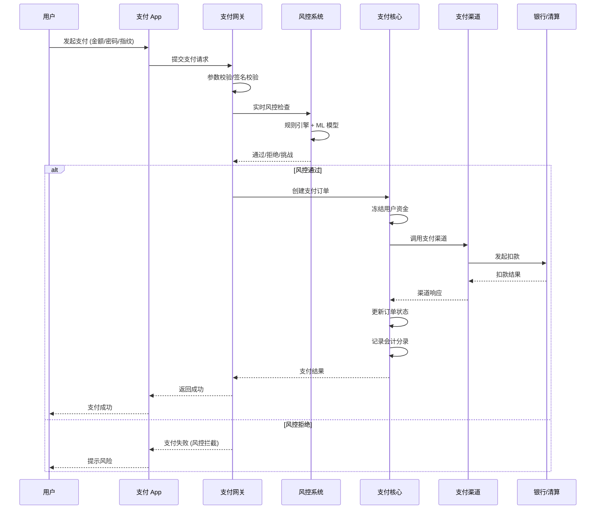
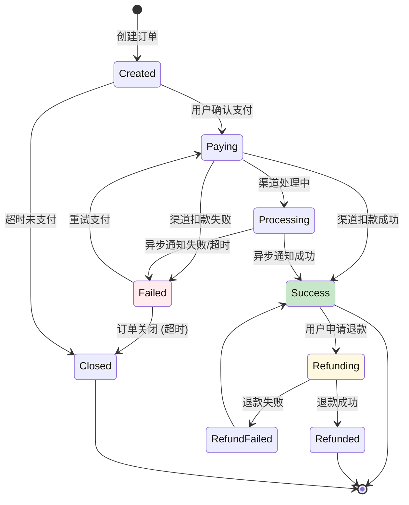
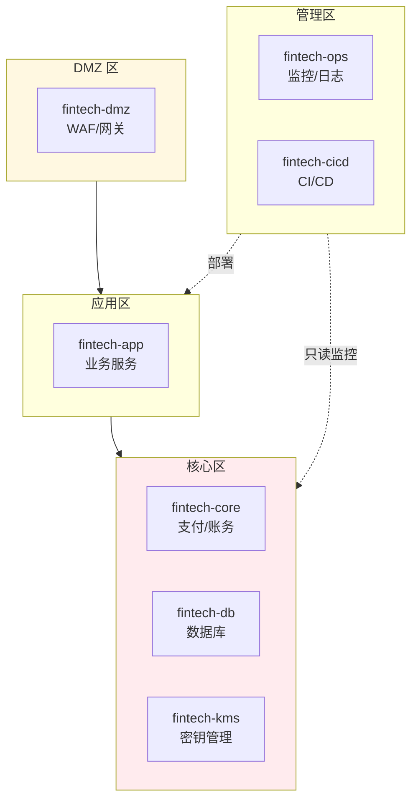

title: 金融科技FinTech Kubernetes生产架构设计
description: '# 金融科技 (FinTech) [[Kubernetes|Kubernetes]] 生产架构设计'
category: application-architecture
tags:
- k8s
- architecture
- industry
- opa
- redis
- kafka
- job
- [[Ingress|ingress]]
- gateway
- networkpolicy
last_updated: 2026-05-18
difficulty: expert
reading_level: expert
audience:
- 金融系统架构师
- 金融科技开发者
- 安全合规官
- 金融SRE
estimated_read_time: 5min
intent_queries:
- fintech kubernetes architecture
- 金融科技K8s高可用架构
- 支付系统K8s部署
- 金融风控大数据平台
- 金融等保合规K8s
trigger_keywords:
- 金融科技
- FinTech
- 数字银行
- 支付平台
- 证券交易
- 保险科技
- 消费金融
- 跨境支付
- 金融科技架构
- 金融K8s
- 金融风控
- 金融合规
related_domains:
- domain-01-cluster-fundamentals
- domain-10-troubleshooting-diagnostics
- domain-03-networking-traffic
related_topics:
- insurtech
- legaltech
- digital-government-architecture
authors:
- name: KUDIG Team
  role: contributor
k8s_versions:
- '1.28'
- '1.29'
- '1.30'
- '1.31'
- '1.32'
---

# 金融科技 (FinTech) Kubernetes 生产架构设计

> **适用场景**: 数字银行 / 支付平台 / 证券交易 / 保险科技 / 消费金融 / 跨境支付
> **适用版本**: Kubernetes v1.29 - v1.33
> **最后更新**: 2026-04-24
> **目标读者**: 金融系统架构师、安全合规官、SRE

---

<!-- chunk: 📋 目录 -->## 📋 目录

- [一、整体架构全景](#一整体架构全景)
- [二、支付核心架构](#二支付核心架构)
- [三、账户与账务架构](#三账户与账务架构)
- [四、风控与反欺诈架构](#四风控与反欺诈架构)
- [五、监管合规与审计架构](#五监管合规与审计架构)
- [六、加密与密钥管理架构](#六加密与密钥管理架构)
- [七、高可用与灾备架构](#七高可用与灾备架构)
- [八、K8s 安全部署架构](#八k8s-安全部署架构)

---

<!-- chunk: 一、整体架构全景 -->## 一、整体架构全景

```mermaid
flowchart TB
    subgraph Perimeter["安全边界"]
        WAF["WAF<br/>OWASP 防护"]
        DDoS["DDoS 防护<br/>流量清洗"]
        BOT["Bot 管理<br/>防爬虫"]
        FRAUD_GATE["欺诈网关<br">设备指纹"]
    end

    subgraph Gateway["接入网关"]
        LB["L7 负载均衡"]
        API_GW["API Gateway<br/>限流/鉴权"]
        MFA["多因素认证<br">OTP/指纹/人脸"]
    end

    subgraph Core["核心业务"]
        ACCOUNT["账户中心<br/>开户/销户/查询"]
        PAYMENT["支付中心<br/>收单/付款/退款"]
        SETTLE["清算中心<br">对账/结算/分账"]
        LOAN["信贷中心<br">授信/放款/还款"]
        INVEST["理财中心<br">申购/赎回/收益"]
    end

    subgraph Risk["风控体系"]
        RULE["规则引擎<br">实时规则"]
        ML["ML 模型<br">异常检测"]
        DEVICE["设备指纹<br">关联分析"]
        KB["知识图谱<br">关系网络"]
    end

    subgraph DataLayer["数据层"]
        CORE_DB["核心数据库<br/>Oracle/DB2/TiDB"]
        LEDGER["会计引擎<br">复式记账"]
        CACHE["Redis Cluster<br">热点数据"]
        ARCHIVE["归档存储<br">冷数据"]
    end

    Users["用户/商户"] --> Perimeter --> Gateway --> Core --> DataLayer
    Core --> Risk --> DataLayer

    style Perimeter fill:#ffebee
    style Core fill:#e3f2fd
    style Risk fill:#fff8e1
    style DataLayer fill:#e8f5e9
```

---

<!-- chunk: 二、支付核心架构 -->## 二、支付核心架构

## 支付链路时序



## 支付状态机



---

<!-- chunk: 三、账户与账务架构 -->## 三、账户与账务架构

```mermaid
flowchart TB
    subgraph AccountLayer["账户层"]
        USER_ACC["用户账户<br/>余额/冻结/可用"]
        MERCHANT_ACC["商户账户<br/>待结算/已结算"]
        PLATFORM_ACC["平台账户<br/>手续费/备付金"]
        CHANNEL_ACC["渠道账户<br">渠道清算"]
    end

    subgraph LedgerLayer["会计层"]
        DOUBLE_ENTRY["复式记账<br/>借贷平衡"]
        TRIAL_BALANCE["试算平衡<br/>日终检查"]
        RECONCILE["对账引擎<br">渠道/银行/内部"]
    end

    subgraph BookLayer["簿记层"]
        JOURNAL["日记账<br/>原始凭证"]
        GENERAL_LEDGER["总分类账<br/>科目汇总"]
        SUB_LEDGER["明细账<br/>账户级明细"]
    end

    AccountLayer --> LedgerLayer --> BookLayer

    style LedgerLayer fill:#e3f2fd
    style BookLayer fill:#e8f5e9
```

## 复式记账示例

```yaml
# 支付 100 元购买商品
# 借: 用户余额 100
# 贷: 商户待结算 97
# 贷: 平台手续费 3

transactions:
  - transaction_id: TXN-202404240001
    entries:
      - account: USER_12345
        direction: debit
        amount: 100.00
        currency: CNY
        memo: "用户购买商品扣款"

      - account: MERCHANT_67890
        direction: credit
        amount: 97.00
        currency: CNY
        memo: "商户待结算资金"

      - account: PLATFORM_FEE
        direction: credit
        amount: 3.00
        currency: CNY
        memo: "平台交易手续费"

    total_debit: 100.00
    total_credit: 100.00
    status: BALANCED
```

---

<!-- chunk: 四、风控与反欺诈架构 -->## 四、风控与反欺诈架构

```mermaid
flowchart TB
    subgraph InputLayer["输入层"]
        EVENT["实时事件流<br/>登录/交易/提现"]
        DEVICE["设备信息<br/>指纹/地理位置"]
        BEHAVIOR["行为数据<br/>点击/滑动/停留"]
        HISTORY["历史数据<br">交易记录/黑名单"]
    end

    subgraph EngineLayer["引擎层"]
        RULE["规则引擎<br">专家规则/阈值"]
        ML_MODEL["ML 模型<br">异常检测/分类"]
        GRAPH["图计算<br">关系网络/团伙"]
        SCORE["评分卡<br">综合风险分"]
    end

    subgraph ActionLayer["决策层"]
        ALLOW["通过<br">正常处理"]
        CHALLENGE["挑战<br">二次验证"]
        BLOCK["阻断<br">拒绝/冻结"]
        REVIEW["人工审核<br">高风险复核"]
    end

    InputLayer --> EngineLayer --> ActionLayer

    style EngineLayer fill:#e3f2fd
    style ActionLayer fill:#fff8e1
```

## 实时风控流水线

```yaml
apiVersion: flink.apache.org/v1beta1
kind: FlinkDeployment
metadata:
  name: real-time-risk-engine
  namespace: fintech-risk
spec:
  image: fintech/risk-flink-job:v1.0
  flinkVersion: v1.18
  jobManager:
    resource:
      memory: "4Gi"
      cpu: 2
  taskManager:
    resource:
      memory: "8Gi"
      cpu: 4
    replicas: 3
  job:
    jarURI: local:///opt/flink/usrlib/risk-engine.jar
    parallelism: 12
    upgradeMode: savepoint
    state: running
---
# Kafka 实时事件流
apiVersion: kafka.strimzi.io/v1beta2
kind: KafkaTopic
metadata:
  name: payment-events
  namespace: fintech-kafka
spec:
  partitions: 24
  replicas: 3
  config:
    retention.ms: 86400000  # 1 天
    cleanup.policy: delete
```

---

<!-- chunk: 五、监管合规与审计架构 -->## 五、监管合规与审计架构

```mermaid
flowchart TB
    subgraph Compliance["合规框架"]
        PCI["PCI-DSS<br/>支付卡安全"]
        GDPR["GDPR<br/>数据保护"]
        AML["AML/KYC<br/>反洗钱"]
        SOX["SOX<br/>财务合规"]
    end

    subgraph Audit["审计体系"]
        LOG_ALL["全量日志<br/>操作/交易/访问"]
        IMMUTABLE["不可篡改<br">区块链/WORM"]
        RETENTION["留存策略<br">7 年"]
        RETRIEVAL["快速检索<br">审计查询"]
    end

    subgraph Reporting["监管报送"]
        DAILY["日报<br">交易汇总"]
        MONTHLY["月报<br">风险报告"]
        EVENT["重大事项<br">实时上报"]
    end

    Compliance --> Audit --> Reporting

    style Compliance fill:#ffebee
    style Audit fill:#e3f2fd
    style Reporting fill:#e8f5e9
```

---

<!-- chunk: 六、加密与密钥管理架构 -->## 六、加密与密钥管理架构

```mermaid
flowchart TB
    subgraph KMSLayer["密钥管理层"]
        HSM["HSM 硬件模块<br/>FIPS 140-2 L3"]
        VAULT["HashiCorp Vault<br/>动态凭据"]
        CLOUD_KMS["Cloud KMS<br/>AWS/Azure/GCP"]
    end

    subgraph KeyTypes["密钥类型"]
        DEK["DEK<br">数据加密密钥"]
        KEK["KEK<br">密钥加密密钥"]
        CA_KEY["CA 私钥<br">证书签发"]
        SIGN_KEY["签名密钥<br">交易签名"]
    end

    subgraph Usage["使用场景"]
        TDE["TDE<br">透明数据加密"]
        TLS["TLS<br">传输加密"]
        FIELD_ENC["字段级加密<br">敏感字段"]
        TOKENIZE["Tokenization<br">卡号脱敏"]
    end

    KMSLayer --> KeyTypes --> Usage

    style KMSLayer fill:#e3f2fd
    style KeyTypes fill:#fff8e1
```

## Vault 集成配置

```yaml
apiVersion: secrets-store.csi.x-k8s.io/v1
kind: SecretProviderClass
metadata:
  name: fintech-vault-db
  namespace: fintech-core
spec:
  provider: vault
  parameters:
    vaultAddress: "https://vault.fintech.internal:8200"
    roleName: "fintech-db-role"
    objects: |
      - objectName: "db-password"
        secretPath: "secret/data/fintech/db"
        secretKey: "password"
      - objectName: "db-username"
        secretPath: "secret/data/fintech/db"
        secretKey: "username"
  secretObjects:
    - secretName: fintech-db-credentials
      type: Opaque
      data:
        - objectName: db-password
          key: password
        - objectName: db-username
          key: username
---
apiVersion: apps/v1
kind: Deployment
metadata:
  name: payment-core
  namespace: fintech-core
spec:
  template:
    spec:
      serviceAccountName: fintech-payment-sa
      containers:
        - name: payment
          image: fintech/payment-core:v3.0
          volumeMounts:
            - name: vault-db-credentials
              mountPath: "/mnt/secrets"
              readOnly: true
      volumes:
        - name: vault-db-credentials
          csi:
            driver: secrets-store.csi.k8s.io
            readOnly: true
            volumeAttributes:
              secretProviderClass: fintech-vault-db
```

---

<!-- chunk: 七、高可用与灾备架构 -->## 七、高可用与灾备架构

```mermaid
flowchart TB
    subgraph DC1["生产中心 (同城)"]
        DC1_APP["应用集群"]
        DC1_DB["数据库主库<br/>同步复制"]
        DC1_HSM["HSM 主"]
    end

    subgraph DC2["灾备中心 (异地)"]
        DC2_APP["应用集群<br/>冷备/温备"]
        DC2_DB["数据库从库<br">异步复制"]
        DC2_HSM["HSM 备"]
    end

    subgraph DRProcess["灾备切换"]
        MONITOR["监控检测<br">RTO/RPO"]
        SWITCH["自动切换<br">DNS/API"]
        VERIFY["数据校验<br">一致性"]
    end

    DC1_APP --> DC1_DB --> DC1_HSM
    DC1_DB -->|同步| DC2_DB
    DC1_HSM -->|密钥同步| DC2_HSM
    DC2_APP --> DC2_DB --> DC2_HSM
    MONITOR --> DC1_APP & DC1_DB
    MONITOR --> SWITCH --> DC2_APP
    SWITCH --> VERIFY

    style DC1 fill:#c8e6c9
    style DC2 fill:#fff8e1
    style DRProcess fill:#ffebee
```

---

<!-- chunk: 八、K8s 安全部署架构 -->## 八、K8s 安全部署架构

## 金融级安全 Namespace 设计



## 金融核心服务部署

```yaml
apiVersion: apps/v1
kind: Deployment
metadata:
  name: payment-core
  namespace: fintech-core
spec:
  replicas: 3
  selector:
    matchLabels:
      app: payment-core
  template:
    metadata:
      labels:
        app: payment-core
        compliance-level: pci-dss
        criticality: tier-1
    spec:
      serviceAccountName: payment-core-sa
      securityContext:
        runAsNonRoot: true
        seccompProfile:
          type: RuntimeDefault
      nodeSelector:
        node-type: secure
        zone: core
      tolerations:
        - key: node-type
          operator: Equal
          value: secure
          effect: NoSchedule
      affinity:
        podAntiAffinity:
          requiredDuringSchedulingIgnoredDuringExecution:
            - labelSelector:
                matchExpressions:
                  - key: app
                    operator: In
                    values:
                      - payment-core
              topologyKey: kubernetes.io/hostname
      containers:
        - name: payment
          image: fintech/payment-core:v3.0.1
          imagePullPolicy: Always
          securityContext:
            allowPrivilegeEscalation: false
            readOnlyRootFilesystem: true
            runAsUser: 10001
            runAsGroup: 10001
            capabilities:
              drop:
                - ALL
          ports:
            - containerPort: 8443
              name: https
          env:
            - name: HSM_ENABLED
              value: "true"
            - name: AUDIT_LEVEL
              value: "FULL"
          resources:
            requests:
              cpu: "1"
              memory: "2Gi"
            limits:
              cpu: "4"
              memory: "8Gi"
          volumeMounts:
            - name: tmp
              mountPath: /tmp
            - name: vault-secrets
              mountPath: /vault/secrets
              readOnly: true
          livenessProbe:
            httpGet:
              path: /health/live
              port: 8443
              scheme: HTTPS
            initialDelaySeconds: 60
            periodSeconds: 10
          readinessProbe:
            httpGet:
              path: /health/ready
              port: 8443
              scheme: HTTPS
            initialDelaySeconds: 10
            periodSeconds: 5
      volumes:
        - name: tmp
          emptyDir:
            medium: Memory
        - name: vault-secrets
          csi:
            driver: secrets-store.csi.k8s.io
            readOnly: true
            volumeAttributes:
              secretProviderClass: fintech-payment-secrets
---
# 网络策略：核心服务仅允许特定来源访问
apiVersion: networking.k8s.io/v1
kind: NetworkPolicy
metadata:
  name: payment-core-policy
  namespace: fintech-core
spec:
  podSelector:
    matchLabels:
      app: payment-core
  policyTypes:
    - Ingress
    - Egress
  ingress:
    - from:
        - namespaceSelector:
            matchLabels:
              name: fintech-app
        - podSelector:
            matchLabels:
              app: api-gateway
      ports:
        - protocol: TCP
          port: 8443
  egress:
    - to:
        - namespaceSelector:
            matchLabels:
              name: fintech-db
      ports:
        - protocol: TCP
          port: 5432
    - to:
        - namespaceSelector:
            matchLabels:
              name: fintech-kms
      ports:
        - protocol: TCP
          port: 8200
```

---

<!-- chunk: 参考链接 -->## 参考链接

- [PCI-DSS 合规指南](https://www.pcisecuritystandards.org/)
- [金融级分布式架构](https://tech.antfin.com/)
- [Vault on Kubernetes](https://developer.hashicorp.com/vault/docs/platform/k8s)

---

<!-- chunk: 多云部署方案对照 -->## 多云部署方案对照

## 阿里云服务 → 多云映射表

| 能力域 | 阿里云服务 | AWS 对应 | GCP 对应 | Azure 对应 |
|:---|:---|:---|:---|:---|
| 容器编排 | **ACK** (容器服务) | **EKS** | **GKE** | **AKS** |
| 密钥管理 (云) | **KMS** | **KMS** | **Cloud KMS** | **Key Vault** |
| HSM 硬件模块 | **云加密机 (SCHSM)** | **CloudHSM** | **Cloud HSM** | **Managed HSM** |
| WAF | **WAF** | **AWS WAF** | **Cloud Armor** | **Azure WAF** |
| DDoS 防护 | **DDoS 防护** | **Shield Advanced** | **Cloud Armor** | **Azure DDoS Protection** |
| 数据库 (金融级) | **PolarDB / OceanBase** | **Aurora** | **AlloyDB / Spanner** | **Cosmos DB** |
| 流计算 | **Flink 云版** | **Kinesis Data Analytics** | **Dataflow** | **Azure Stream Analytics** |
| 消息队列 | **RocketMQ / Kafka 云版** | **MSK / SQS** | **Pub/Sub** | **Event Hubs** |
| 审计日志 | **操作审计 (ActionTrail)** | **CloudTrail** | **Cloud Audit Logs** | **Activity Log** |
| 数据加密 (TDE) | **RDS TDE** | **RDS Encryption** | **CMEK** | **TDE (Azure SQL)** |
| 网络隔离 | **VPC + 安全组** | **VPC + Security Groups** | **VPC + Firewall Rules** | **VNet + NSG** |
| 合规认证 | **等保 / PCI-DSS** | **AWS Artifact / PCI** | **Assured Workloads** | **Azure Compliance** |
| 容器镜像 | **ACR** | **ECR** | **Artifact Registry** | **ACR (Azure)** |
| 可观测性 | **ARMS / SLS** | **CloudWatch / X-Ray** | **Cloud Ops Suite** | **Monitor / App Insights** |

## 多云部署注意事项

1. **HSM 与密钥管理**: 金融级 HSM 不支持跨云直接同步。若多云部署，需在每朵云独立部署 HSM，并通过应用层实现密钥轮转同步，或使用 HashiCorp Vault Enterprise 的跨域复制功能。
2. **PCI-DSS 合规边界**: PCI-DSS 要求明确安全边界。多云部署时每朵云都需独立通过 PCI-DSS 评估（或使用 QSA 联合审计），避免合规范围蔓延。
3. **交易一致性**: 金融交易要求强一致性。跨云数据库同步（如 Aurora Global Database、Cloud Spanner）的 RPO/RTO 指标需满足监管要求，建议核心交易链路在单云内完成。
4. **网络延迟与加密**: 金融链路对延迟敏感。跨云通信必须使用 mTLS + VPN/专线，但会增加 5-20ms 延迟，影响风控实时判断。
5. **监管报送**: 不同云的日志格式和审计链不同，需统一审计日志格式（如 JSON Schema），确保监管报送数据一致。
6. **灾备切换**: 金融灾备 RTO 通常要求 <15 分钟。多云灾备需测试实际切换时间，包括 DNS 切换、数据库主从切换、HSM 密钥恢复。

## 云中立方案（开源替代）

| 能力域 | 开源方案 | 说明 |
|:---|:---|:---|
| 容器编排 | **Kubernetes** (RKE2 / k3s) | 金融级建议用 RKE2 或 ACK/EKS 等托管版 |
| 密钥管理 | **HashiCorp Vault** (Enterprise) | 支持 HSM 后端、动态凭据、跨域复制 |
| WAF / API 安全 | **ModSecurity** + **Coraza** | 与 Envoy / APISIX 集成 |
| 流计算 | **Apache Flink** (K8s Operator) | FlinkDeployment CRD 已在架构中使用 |
| 消息队列 | **Apache Kafka** (Strimzi Operator) | KafkaTopic CRD 已在架构中使用 |
| 数据库 | **TiDB** / **CockroachDB** | 分布式 NewSQL，支持金融级 ACID |
| 审计日志 | **OpenTelemetry** + **Falco** | 统一审计日志格式 |
| 网络策略 | **Cilium** (eBPF) | 比 NetworkPolicy 更强大的网络隔离 |
| 数据加密 | **Vault Transit Engine** | 应用层加密，不依赖云 TDE |
| 可观测性 | **Prometheus** + **Grafana** + **Jaeger** + **Loki** | 全栈开源可观测性 |
| 容器镜像 | **Harbor** | 镜像扫描 + 签名验证 |
| 策略引擎 | **OPA / Kyverno** | K8s 准入策略，已在架构中使用 |

---

<!-- chunk: Obsidian 相关文档 -->## Obsidian 相关文档

- topic-application-architecture MOC
- [[domain-20-application-patterns/topic-application-architecture/README.md|Topic 应用层架构设计最佳实践]]
- [[domain-20-application-patterns/topic-application-architecture/01-ecommerce-architecture.md|电商系统 Kubernetes 生产架构设计]]
- [[domain-20-application-patterns/topic-application-architecture/02-mini-program-architecture.md|小程序平台架构设计]]
- [[domain-20-application-patterns/topic-application-architecture/03-cms-architecture.md|内容管理系统 CMS 架构设计]]
- [[domain-20-application-patterns/topic-application-architecture/04-im-rtc-architecture.md|实时通信 IM/RTC 架构设计]]
- [[domain-20-application-patterns/topic-application-architecture/05-online-education-architecture.md|在线教育平台 Kubernetes 生产架构设计]]
- [[domain-20-application-patterns/topic-application-architecture/07-iot-platform-architecture.md|物联网 IoT 平台架构设计]]
- [[domain-20-application-patterns/topic-application-architecture/08-ai-ml-inference-architecture.md|AI/ML 推理服务 Kubernetes 生产架构设计]]
- [[domain-20-application-patterns/topic-application-architecture/09-gaming-backend-architecture.md|游戏后端 Kubernetes 生产架构设计]]
- [[domain-20-application-patterns/topic-application-architecture/10-social-media-architecture.md|社交媒体平台Kubernetes生产架构设计]]
- [[domain-20-application-patterns/topic-application-architecture/11-smart-retail-architecture.md|智慧零售与新零售Kubernetes生产架构设计]]

## See Also

- 04-im-rtc-architecture
- 05-online-education-architecture
- 07-iot-platform-architecture
- 08-ai-ml-inference-architecture
