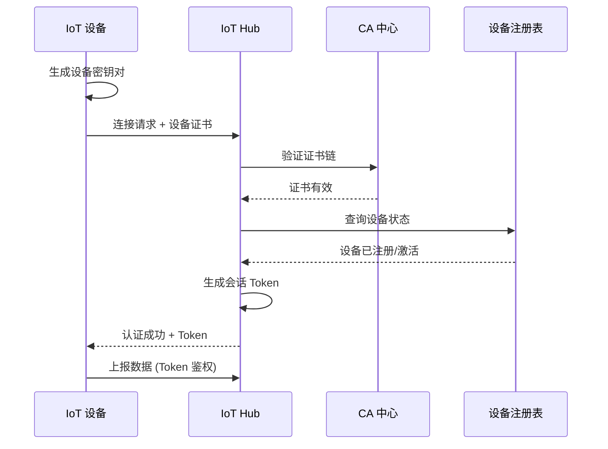
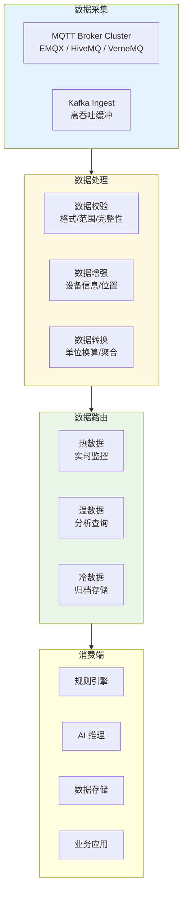

title: 物联网 IoT 平台架构设计
description: '# 物联网 (IoT) 平台 [[Kubernetes|Kubernetes]] 生产架构设计'
category: application-architecture
tags:
- k8s
- architecture
- industry
- [[Flux|flux]]
- kafka
- [[StatefulSet|statefulset]]
- gateway
- operator
- rag
last_updated: 2026-05-18
difficulty: advanced
reading_level: advanced
audience:
- IoT架构师
- 嵌入式工程师
- 平台工程师
estimated_read_time: 5min
intent_queries:
- IoT 平台 Kubernetes 设备接入架构
- MQTT Broker EMQX 集群部署
- 边缘计算 KubeEdge 设备管理
- 时序数据库 TDengine 物联网数据
- 数字孪生物联网平台
trigger_keywords:
- 物联网平台
- IoT
- MQTT
- EMQX
- 设备接入
- 边缘计算
- KubeEdge
- OpenYurt
- 时序数据库
- OTA升级
- 设备影子
related_domains:
- domain-03-networking-traffic
- domain-10-troubleshooting-diagnostics
related_topics:
- topic-iot-platform-architecture
- topic-edge-computing
authors:
- name: KUDIG Team
  role: contributor
k8s_versions:
- '1.28'
- '1.29'
- '1.30'
- '1.31'
- '1.32'
---

# 物联网 (IoT) 平台 Kubernetes 生产架构设计

> **适用场景**: 智能家居 / 工业物联网 / 车联网 / 智慧城市 / 农业监测 / 能源管理  
> **适用版本**: Kubernetes v1.29 - v1.33  
> **最后更新**: 2026-04-24  
> **目标读者**: IoT 架构师、嵌入式工程师、平台工程师

---

<!-- chunk: 📋 目录 -->## 📋 目录

- [一、整体架构全景](#一整体架构全景)
- [二、设备接入与认证架构](#二设备接入与认证架构)
- [三、消息总线与数据流架构](#三消息总线与数据流架构)
- [四、规则引擎与实时处理架构](#四规则引擎与实时处理架构)
- [五、数字孪生与可视化架构](#五数字孪生与可视化架构)
- [六、OTA 升级架构](#六ota-升级架构)
- [七、边缘计算架构](#七边缘计算架构)
- [八、K8s 部署架构](#八k8s-部署架构)

---

<!-- chunk: 一、整体架构全景 -->## 一、整体架构全景

```mermaid
flowchart TB
    subgraph Devices["设备层"]
        SENSOR["传感器<br/>温湿度/光照/压力"]
        ACTUATOR["执行器<br/>电机/阀门/开关"]
        CAMERA["摄像头<br/>图像/视频"]
        VEHICLE["车载设备<br/>T-Box / OBD"]
        GATEWAY["边缘网关<br">协议转换"]
    end

    subgraph Edge["边缘层"]
        EDGE_COMPUTE["边缘计算<br/>KubeEdge / OpenYurt"]
        EDGE_MQTT["边缘 MQTT Broker"]
        EDGE_STORE["本地存储<br">断网续传"]
    end

    subgraph Cloud["云平台层"]
        IOT_HUB["IoT Hub<br/>设备接入/管理"]
        RULE_ENGINE["规则引擎<br/>数据流转"]
        STREAM["流处理<br">Flink / Kafka"]
        TWIN["数字孪生<br">设备影子"]
    end

    subgraph Application["应用层"]
        DASHBOARD["监控大屏<br">实时数据"]
        ALERT["告警中心<br">阈值/异常"]
        ANALYSIS["数据分析<br">BI / AI"]
        CONTROL["远程控制<br">指令下发"]
    end

    subgraph DataStore["数据存储"]
        TSDB["时序数据库<br/>TDengine / InfluxDB"]
        HBASE["HBase<br/>海量设备数据"]
        OSS["对象存储<br">文件/日志"]
    end

    Devices --> Edge --> Cloud --> Application
    Cloud --> DataStore
    Application --> DataStore

    style Edge fill:#e3f2fd
    style Cloud fill:#fff8e1
    style Application fill:#e8f5e9
```

---

<!-- chunk: 二、设备接入与认证架构 -->## 二、设备接入与认证架构

```mermaid
flowchart TB
    subgraph DeviceAuth["设备认证"]
        CERT["X.509 证书<br/>双向 TLS"]
        TOKEN["设备 Token<br/>HMAC-SHA256"]
        TPM["TPM 芯片<br/>硬件安全"]
        PKI["PKI 体系<br/>证书签发/吊销"]
    end

    subgraph Connection["连接管理"]
        MQTT["MQTT 3.1/5.0<br/>发布订阅"]
        COAP["CoAP<br/>受限设备"]
        LORA["LoRaWAN<br">远距离低功耗"]
        NB_IOT["NB-IoT<br">蜂窝网络"]
    end

    subgraph Management["设备管理"]
        REGISTRY["设备注册表<br/>元数据/状态"]
        LIFECYCLE["生命周期<br/>注册/激活/禁用/注销"]
        GROUP["设备分组<br/>批量管理"]
        TAG["标签系统<br">检索/权限"]
    end

    DeviceAuth --> Connection --> Management

    style DeviceAuth fill:#e3f2fd
    style Connection fill:#fff8e1
    style Management fill:#e8f5e9
```

## 设备认证流程



---

<!-- chunk: 三、消息总线与数据流架构 -->## 三、消息总线与数据流架构



## EMQX MQTT Broker K8s 部署

```yaml
apiVersion: apps/v1
kind: StatefulSet
metadata:
  name: emqx
  namespace: iot-platform
spec:
  serviceName: emqx-headless
  replicas: 3
  selector:
    matchLabels:
      app: emqx
  template:
    metadata:
      labels:
        app: emqx
    spec:
      affinity:
        podAntiAffinity:
          requiredDuringSchedulingIgnoredDuringExecution:
            - labelSelector:
                matchExpressions:
                  - key: app
                    operator: In
                    values:
                      - emqx
              topologyKey: kubernetes.io/hostname
      containers:
        - name: emqx
          image: emqx/emqx:5.5
          ports:
            - containerPort: 1883
              name: mqtt
            - containerPort: 8883
              name: mqtts
            - containerPort: 8083
              name: ws
            - containerPort: 8084
              name: wss
            - containerPort: 18083
              name: dashboard
          env:
            - name: EMQX_NODE_NAME
              value: "emqx@$(POD_NAME).emqx-headless.iot-platform.svc.cluster.local"
            - name: EMQX_CLUSTER__DISCOVERY_STRATEGY
              value: "dns"
            - name: EMQX_CLUSTER__DNS__NAME
              value: "emqx-headless.iot-platform.svc.cluster.local"
            - name: EMQX_LISTENERS__SSL__DEFAULT__ENABLE
              value: "true"
            - name: EMQX_LISTENERS__SSL__DEFAULT__SSL_OPTIONS__CERTFILE
              value: "/etc/emqx/certs/server.crt"
            - name: EMQX_LISTENERS__SSL__DEFAULT__SSL_OPTIONS__KEYFILE
              value: "/etc/emqx/certs/server.key"
          resources:
            requests:
              cpu: "1"
              memory: "2Gi"
            limits:
              cpu: "4"
              memory: "8Gi"
          volumeMounts:
            - name: emqx-data
              mountPath: /opt/emqx/data
            - name: emqx-certs
              mountPath: /etc/emqx/certs
              readOnly: true
  volumeClaimTemplates:
    - metadata:
        name: emqx-data
      spec:
        storageClassName: fast-ssd
        accessModes: ["ReadWriteOnce"]
        resources:
          requests:
            storage: 50Gi
```

---

<!-- chunk: 四、规则引擎与实时处理架构 -->## 四、规则引擎与实时处理架构

```mermaid
flowchart TB
    subgraph Rules["规则定义"]
        CONDITION["触发条件<br/>温度>80 / 离线>5min"]
        ACTION["执行动作<br/>告警/联动/存储"]
        SCHEDULE["定时规则<br/>日报/定时任务"]
    end

    subgraph Execution["规则执行"]
        FILTER["数据过滤<br">SQL-like"]
        WINDOW["时间窗口<br">滑动/跳跃/会话"]
        AGGREGATE["聚合计算<br">AVG/SUM/COUNT"]
        JOIN["流关联<br">设备/用户"]
    end

    subgraph Output["规则输出"]
        ALERT["告警通知<br">钉钉/短信/邮件"]
        COMMAND["设备指令<br">远程控制"]
        FORWARD["数据转发<br">Kafka/API"]
        STORE["数据存储<br">DB/TSDB"]
    end

    Rules --> Execution --> Output

    style Rules fill:#e3f2fd
    style Execution fill:#fff8e1
    style Output fill:#e8f5e9
```

---

<!-- chunk: 五、数字孪生与可视化架构 -->## 五、数字孪生与可视化架构

```mermaid
flowchart TB
    subgraph Physical["物理世界"]
        DEV1["设备 A<br/>运行中"]
        DEV2["设备 B<br/>问题"]
        DEV3["设备 C<br/>待机"]
    end

    subgraph Shadow["设备影子 / 数字孪生"]
        SHADOW1["影子 A<br/>实时状态镜像"]
        SHADOW2["影子 B<br/>预测维护"]
        SHADOW3["影子 C<br/>能耗优化"]
    end

    subgraph Visualization["可视化"]
        DASHBOARD["监控大屏<br">3D/地图/图表"]
        DIGITAL_TWIN["数字孪生<br">BIM/3D 模型"]
        REPORT["报表分析<br">趋势/对比"]
    end

    Physical -->|数据同步| Shadow --> Visualization

    style Shadow fill:#e3f2fd
    style Visualization fill:#e8f5e9
```

---

<!-- chunk: 六、OTA 升级架构 -->## 六、OTA 升级架构

```mermaid
flowchart TB
    subgraph Prepare["准备阶段"]
        BUILD["固件构建<br/>编译/签名"]
        TEST["灰度测试<br">内测/公测"]
        SIGN["固件签名<br">私钥签名"]
        CDN_PUSH["CDN 分发<br">预热"]
    end

    subgraph Rollout["分发阶段"]
        BATCH["分批策略<br">5% → 20% → 100%"]
        SCHEDULE["定时升级<br">低峰期"]
        FORCE["强制升级<br">安全补丁"]
    end

    subgraph Monitor["监控阶段"]
        PROGRESS["进度监控<br">成功率"]
        ROLLBACK["自动回滚<br">异常检测"]
        REPORT["升级报告<br">版本分布"]
    end

    Prepare --> Rollout --> Monitor

    style Prepare fill:#e3f2fd
    style Rollout fill:#fff8e1
    style Monitor fill:#e8f5e9
```

---

<!-- chunk: 七、边缘计算架构 -->## 七、边缘计算架构

```mermaid
flowchart TB
    subgraph CloudCenter["云中心"]
        CLOUD_APP["云应用<br/>全局管理"]
        CLOUD_AI["云 AI<br/>模型训练"]
        CLOUD_DB["云数据库<br">归档/分析"]
    end

    subgraph EdgeNodes["边缘节点"]
        subgraph Edge1["边缘节点 1 (工厂 A)"]
            E1_APP["边缘应用<br/>实时控制"]
            E1_AI["边缘 AI<br/>缺陷检测"]
            E1_DB["本地存储<br">断网续传"]
            E1_MQTT["本地 MQTT"]
        end

        subgraph Edge2["边缘节点 2 (工厂 B)"]
            E2_APP["边缘应用"]
            E2_AI["边缘 AI"]
            E2_DB["本地存储"]
            E2_MQTT["本地 MQTT"]
        end
    end

    subgraph Devices["现场设备"]
        PLC["PLC 控制器"]
        ROBOT["工业机器人"]
        CAMERA_M["工业相机"]
        SENSOR_M["传感器阵列"]
    end

    CloudCenter <-->|控制/模型下发| EdgeNodes
    EdgeNodes -->|数据上报| CloudCenter
    Edge1 <-->|KubeEdge| Devices
    E1_MQTT --> PLC & ROBOT & CAMERA_M & SENSOR_M

    style EdgeNodes fill:#e3f2fd
    style CloudCenter fill:#fff8e1
```

## KubeEdge 边缘节点部署

```yaml
apiVersion: apps/v1
kind: Deployment
metadata:
  name: edge-app-controller
  namespace: iot-edge
spec:
  replicas: 1
  selector:
    matchLabels:
      app: edge-app-controller
  template:
    metadata:
      labels:
        app: edge-app-controller
    spec:
      nodeName: edge-node-factory-a
      containers:
        - name: controller
          image: iot/edge-controller:v1.0
          env:
            - name: EDGE_NODE_ID
              value: "factory-a-line-1"
            - name: CLOUD_SYNC_INTERVAL
              value: "30"
            - name: LOCAL_MQTT_BROKER
              value: "tcp://localhost:1883"
          resources:
            requests:
              cpu: "500m"
              memory: "512Mi"
            limits:
              cpu: "2"
              memory: "2Gi"
          volumeMounts:
            - name: local-buffer
              mountPath: /data/buffer
      volumes:
        - name: local-buffer
          hostPath:
            path: /opt/edge/buffer
            type: DirectoryOrCreate
```

---

<!-- chunk: 八、K8s 部署架构 -->## 八、K8s 部署架构

## 时序数据库 TDengine 部署

```yaml
apiVersion: apps/v1
kind: StatefulSet
metadata:
  name: tdengine-dnode
  namespace: iot-platform
spec:
  serviceName: tdengine-dnode
  replicas: 3
  selector:
    matchLabels:
      app: tdengine-dnode
  template:
    metadata:
      labels:
        app: tdengine-dnode
    spec:
      affinity:
        podAntiAffinity:
          requiredDuringSchedulingIgnoredDuringExecution:
            - labelSelector:
                matchExpressions:
                  - key: app
                    operator: In
                    values:
                      - tdengine-dnode
              topologyKey: kubernetes.io/hostname
      containers:
        - name: tdengine
          image: tdengine/tdengine:3.2
          ports:
            - containerPort: 6030
              name: taosd
            - containerPort: 6041
              name: rest
          env:
            - name: TAOS_FQDN
              valueFrom:
                fieldRef:
                  fieldPath: metadata.name
            - name: TAOS_FIRST_EP
              value: "tdengine-dnode-0.tdengine-dnode.iot-platform.svc.cluster.local:6030"
          resources:
            requests:
              cpu: "2"
              memory: "8Gi"
            limits:
              cpu: "8"
              memory: "32Gi"
          volumeMounts:
            - name: taos-data
              mountPath: /var/lib/taos
  volumeClaimTemplates:
    - metadata:
        name: taos-data
      spec:
        storageClassName: fast-ssd
        accessModes: ["ReadWriteOnce"]
        resources:
          requests:
            storage: 1Ti
```

---

<!-- chunk: 参考链接 -->## 参考链接

- [EMQX 文档](https://www.emqx.io/docs/)
- [KubeEdge 文档](https://kubeedge.io/docs/)
- [TDengine 文档](https://docs.tdengine.com/)
- [IoT MQTT 协议](https://mqtt.org/)

---

<!-- chunk: Obsidian 相关文档 -->## Obsidian 相关文档

- topic-application-architecture MOC
- [[domain-20-application-patterns/topic-application-architecture/README.md|Topic 应用层架构设计最佳实践]]
- [[domain-20-application-patterns/topic-application-architecture/01-ecommerce-architecture.md|电商系统 Kubernetes 生产架构设计]]
- [[domain-20-application-patterns/topic-application-architecture/02-mini-program-architecture.md|小程序平台架构设计]]
- [[domain-20-application-patterns/topic-application-architecture/03-cms-architecture.md|内容管理系统 CMS 架构设计]]
- [[domain-20-application-patterns/topic-application-architecture/04-im-rtc-architecture.md|实时通信 IM/RTC 架构设计]]
- [[domain-20-application-patterns/topic-application-architecture/05-online-education-architecture.md|在线教育平台 Kubernetes 生产架构设计]]
- [[domain-20-application-patterns/topic-application-architecture/06-fintech-architecture.md|金融科技FinTech Kubernetes生产架构设计]]
- [[domain-20-application-patterns/topic-application-architecture/08-ai-ml-inference-architecture.md|AI/ML 推理服务 Kubernetes 生产架构设计]]
- [[domain-20-application-patterns/topic-application-architecture/09-gaming-backend-architecture.md|游戏后端 Kubernetes 生产架构设计]]
- [[domain-20-application-patterns/topic-application-architecture/10-social-media-architecture.md|社交媒体平台Kubernetes生产架构设计]]
- [[domain-20-application-patterns/topic-application-architecture/11-smart-retail-architecture.md|智慧零售与新零售Kubernetes生产架构设计]]

## See Also

- 05-online-education-architecture
- 06-fintech-architecture
- 08-ai-ml-inference-architecture
- 09-gaming-backend-architecture
