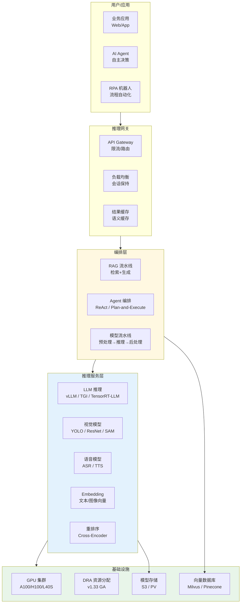
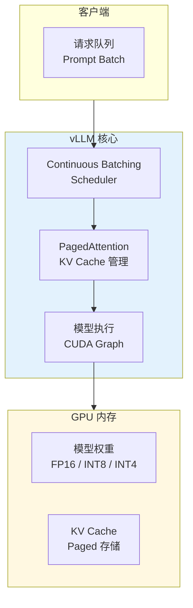
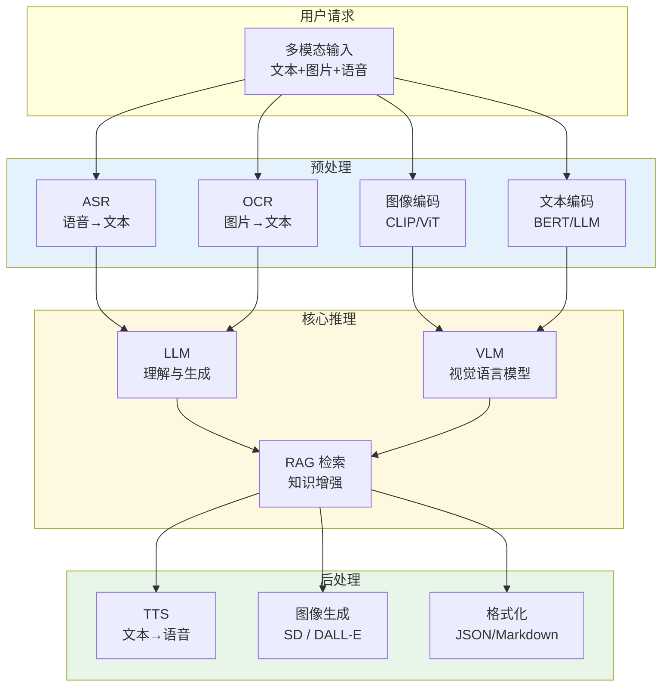

title: AI/ML 推理服务 [[Kubernetes|Kubernetes]] 生产架构设计
description: '# AI/ML 推理服务 Kubernetes 生产架构设计'
category: application-architecture
tags:
- k8s
- architecture
- industry
- scheduler
- [[Prometheus|prometheus]]
- [[Harbor|harbor]]
- job
- gateway
- operator
- gpu
last_updated: 2026-05
difficulty: advanced
reading_level: advanced
audience:
- 架构师
- SRE
- 技术决策者
estimated_read_time: 5min
intent_queries:
- AI/ML 推理服务 Kubernetes 生产架构设计 是什么
- 如何 AI/ML 推理服务 Kubernetes 生产架构设计
trigger_keywords:
- AI
- ML
- 推理服务
- Kubernetes
- 生产架构设计
- application
- architecture
authors:
- name: KUDIG Team
  role: contributor
k8s_versions:
- '1.28'
- '1.29'
- '1.30'
- '1.31'
- '1.32'
---

# AI/ML 推理服务 Kubernetes 生产架构设计

> **适用场景**: LLM 大模型推理 / 图像识别 / 语音合成 / 推荐系统 / 智能客服 / 自动驾驶感知  
> **适用版本**: Kubernetes v1.29 - v1.33  
> **最后更新**: 2026-04-24  
> **目标读者**: MLOps 工程师、AI 平台架构师、算法工程 TL

---

<!-- chunk: 📋 目录 -->## 📋 目录

- [一、整体架构全景](#一整体架构全景)
- [二、模型服务化架构](#二模型服务化架构)
- [三、GPU 集群调度架构](#三gpu-集群调度架构)
- [四、LLM 大模型推理架构](#四llm-大模型推理架构)
- [五、多模态服务编排架构](#五多模态服务编排架构)
- [六、A/B 测试与模型迭代架构](#六ab-测试与模型迭代架构)
- [七、推理性能优化架构](#七推理性能优化架构)
- [八、K8s 部署架构](#八k8s-部署架构)

---

<!-- chunk: 一、整体架构全景 -->## 一、整体架构全景



---

<!-- chunk: 二、模型服务化架构 -->## 二、模型服务化架构

```mermaid
flowchart TB
    subgraph Registry["模型仓库"]
        MLFLOW["MLflow Model Registry"]
        HARBOR["Harbor<br/>OCI 模型镜像"]
        S3_MODEL["S3<br/>模型文件存储"]
    end

    subgraph Packaging["模型打包"]
        CONTAINER["容器化<br/>模型+Runtime+依赖"]
        ONNX["ONNX 格式<br/>跨框架"]
        TRT["TensorRT 引擎<br/>GPU 优化"]
    end

    subgraph Serving["模型服务"]
        REST_API["REST API<br/>HTTP/JSON"]
        GRPC_API["gRPC<br/>高性能"]
        STREAM["Streaming<br/>SSE / WebSocket"]
        BATCH["Batch<br">批量推理"]
    end

    Registry --> Packaging --> Serving

    style Registry fill:#e3f2fd
    style Packaging fill:#fff8e1
    style Serving fill:#e8f5e9
```

## KServe 模型服务配置

```yaml
apiVersion: serving.kserve.io/v1beta1
kind: InferenceService
metadata:
  name: sentiment-classifier
  namespace: ai-platform
  annotations:
    serving.kserve.io/deploymentMode: Serverless
spec:
  predictor:
    model:
      modelFormat:
        name: sklearn
      storageUri: s3://ai-models/sentiment/v2/
      resources:
        requests:
          cpu: "1"
          memory: "2Gi"
        limits:
          cpu: "4"
          memory: "8Gi"
    minReplicas: 2
    maxReplicas: 10
    containerConcurrency: 100
    timeout: 30
---
apiVersion: serving.kserve.io/v1beta1
kind: InferenceService
metadata:
  name: image-classifier
  namespace: ai-platform
spec:
  predictor:
    model:
      modelFormat:
        name: pytorch
      storageUri: s3://ai-models/vision/resnet50/
      runtime: kserve-triton
      resources:
        requests:
          cpu: "2"
          memory: "8Gi"
          nvidia.com/gpu: "1"
        limits:
          cpu: "8"
          memory: "32Gi"
          nvidia.com/gpu: "1"
    nodeSelector:
      node-type: gpu
    tolerations:
      - key: nvidia.com/gpu
        operator: Exists
        effect: NoSchedule
```

---

<!-- chunk: 三、GPU 集群调度架构 -->## 三、GPU 集群调度架构

```mermaid
flowchart TB
    subgraph SchedulerExt["调度器扩展"]
        K8S_SCHED["kube-scheduler"]
        GPU_SCHED["GPU Scheduler<br/>NVIDIA / Volcano"]
        DRA_SCHED["DRA Plugin<br/>v1.33 GA"]
        GANG["Gang Scheduling<br">All-or-Nothing"]
    end

    subgraph NodePool["节点池"]
        GPU_A100["A100 节点池<br/>80GB VRAM"]
        GPU_H100["H100 节点池<br/>80GB VRAM"]
        GPU_L40S["L40S 节点池<br/>48GB VRAM"]
        GPU_T4["T4 节点池<br/>16GB VRAM<br/>推理专用"]
    end

    subgraph Workloads["工作负载"]
        TRAIN["训练 Job<br/>多卡并行"]
        INFER["推理 Service<br/>高吞吐"]
        FINETUNE["微调 Job<br/>LoRA / QLoRA"]
    end

    SchedulerExt --> NodePool --> Workloads

    style SchedulerExt fill:#e3f2fd
    style NodePool fill:#fff8e1
```

## DRA GPU 资源分配

```yaml
apiVersion: resource.k8s.io/v1beta1
kind: ResourceClaimTemplate
metadata:
  name: gpu-llm-claim-template
  namespace: ai-platform
spec:
  spec:
    resourceClassName: nvidia.com/gpu
    parametersRef:
      apiGroup: resource.nvidia.com
      kind: GpuConfig
      name: llm-gpu-params
---
apiVersion: resource.nvidia.com/v1alpha1
kind: GpuConfig
metadata:
  name: llm-gpu-params
  namespace: ai-platform
spec:
  memory: "80Gi"
  computeMode: "default"
  multiNodeEnabled: false
---
apiVersion: apps/v1
kind: Deployment
metadata:
  name: llm-inference-service
  namespace: ai-platform
spec:
  replicas: 2
  selector:
    matchLabels:
      app: llm-inference
  template:
    metadata:
      labels:
        app: llm-inference
    spec:
      containers:
        - name: vllm
          image: vllm/vllm-openai:v0.4.0
          args:
            - --model
            - /models/llama-3-70b
            - --tensor-parallel-size
            - "2"
            - --max-model-len
            - "8192"
          ports:
            - containerPort: 8000
              name: http
          resources:
            claims:
              - name: gpu
          volumeMounts:
            - name: model-storage
              mountPath: /models
      resourceClaims:
        - name: gpu
          source:
            resourceClaimTemplateName: gpu-llm-claim-template
      volumes:
        - name: model-storage
          persistentVolumeClaim:
            claimName: llm-model-pvc
```

---

<!-- chunk: 四、LLM 大模型推理架构 -->## 四、LLM 大模型推理架构

## vLLM 推理服务架构



## vLLM K8s 部署

```yaml
apiVersion: apps/v1
kind: Deployment
metadata:
  name: vllm-llama3-70b
  namespace: ai-platform
spec:
  replicas: 1
  selector:
    matchLabels:
      app: vllm-llama3-70b
  template:
    metadata:
      labels:
        app: vllm-llama3-70b
    spec:
      nodeSelector:
        node-type: gpu-a100
      tolerations:
        - key: nvidia.com/gpu
          operator: Exists
          effect: NoSchedule
      containers:
        - name: vllm
          image: vllm/vllm-openai:v0.4.0
          command:
            - python
            - -m
            - vllm.entrypoints.openai.api_server
          args:
            - --model
            - /models/Meta-Llama-3-70B-Instruct
            - --tensor-parallel-size
            - "2"
            - --pipeline-parallel-size
            - "1"
            - --max-num-seqs
            - "256"
            - --max-model-len
            - "8192"
            - --quantization
            - "awq"
            - --gpu-memory-utilization
            - "0.95"
            - --dtype
            - "half"
          ports:
            - containerPort: 8000
              name: http
          resources:
            requests:
              nvidia.com/gpu: "2"
              memory: "160Gi"
              cpu: "16"
            limits:
              nvidia.com/gpu: "2"
              memory: "160Gi"
              cpu: "32"
          volumeMounts:
            - name: model-storage
              mountPath: /models
            - name: shm
              mountPath: /dev/shm
          livenessProbe:
            httpGet:
              path: /health
              port: 8000
            initialDelaySeconds: 300
            periodSeconds: 30
          readinessProbe:
            httpGet:
              path: /health
              port: 8000
            initialDelaySeconds: 60
            periodSeconds: 10
      volumes:
        - name: model-storage
          persistentVolumeClaim:
            claimName: llama3-70b-pvc
        - name: shm
          emptyDir:
            medium: Memory
            sizeLimit: 32Gi
---
# 模型加载预热 Job
apiVersion: batch/v1
kind: Job
metadata:
  name: model-preload
  namespace: ai-platform
spec:
  template:
    spec:
      nodeSelector:
        node-type: gpu-a100
      containers:
        - name: preload
          image: vllm/vllm-openai:v0.4.0
          command:
            - python
            - -c
            - |
              from vllm import LLM
              llm = LLM("/models/Meta-Llama-3-70B-Instruct",
                        tensor_parallel_size=2,
                        quantization="awq")
              print("Model preloaded successfully")
          resources:
            requests:
              nvidia.com/gpu: "2"
              memory: "160Gi"
      restartPolicy: Never
```

---

<!-- chunk: 五、多模态服务编排架构 -->## 五、多模态服务编排架构



---

<!-- chunk: 六、A/B 测试与模型迭代架构 -->## 六、A/B 测试与模型迭代架构

```mermaid
flowchart TB
    subgraph Experiment["实验管理"]
        DEFINE["实验定义<br/>流量/指标/时长"]
        SPLIT["流量分流<br/>Hash/UID"]
        TRACK["指标追踪<br/>准确率/延迟/成本"]
    end

    subgraph Models["模型版本"]
        BASELINE["基线模型<br/>当前线上"]
        CANDIDATE["候选模型<br/>新版本"]
        SHADOW["影子模型<br">对比验证"]
    end

    subgraph Decision["决策"]
        PROMOTE["全量发布<br/>效果达标"]
        ROLLBACK["回滚<br">效果下降"]
        ITERATE["迭代优化<br">参数调整"]
    end

    Experiment --> Models --> Decision
    DECISION --> DEFINE

    style Experiment fill:#e3f2fd
    style Decision fill:#fff8e1
```

---

<!-- chunk: 七、推理性能优化架构 -->## 七、推理性能优化架构

```mermaid
flowchart TB
    subgraph Optimization["优化策略"]
        QUANT["量化<br/>FP16 → INT8 → INT4"]
        PRUNE["剪枝<br/>稀疏化"]
        DISTILL["蒸馏<br">小模型学习大模型"]
        SPEC_DECODE["投机解码<br">Draft + Verify"]
    end

    subgraph ServingOpt["服务优化"]
        BATCHING["Continuous Batching<br/>动态批处理"]
        PREFILL["Prefix Caching<br/>Prompt 复用"]
        STREAM["流式响应<br/>首 Token 延迟"]
        KV_REUSE["KV Cache 复用<br/>多轮对话"]
    end

    subgraph Hardware["硬件优化"]
        TENSOR_CORE["Tensor Core<br/>FP8/BF16"]
        NVLINK["NVLink<br/>多卡通信"]
        RDMA["RDMA<br/>网络加速"]
    end

    Optimization --> ServingOpt --> Hardware

    style Optimization fill:#e3f2fd
    style ServingOpt fill:#fff8e1
    style Hardware fill:#e8f5e9
```

---

<!-- chunk: 八、K8s 部署架构 -->## 八、K8s 部署架构

## GPU 节点池与自动扩缩容

```yaml
apiVersion: karpenter.sh/v1
kind: NodePool
metadata:
  name: gpu-inference-pool
spec:
  template:
    spec:
      requirements:
        - key: node.kubernetes.io/instance-type
          operator: In
          values: ["p4d.24xlarge", "p5.48xlarge"]
        - key: karpenter.sh/capacity-type
          operator: In
          values: ["on-demand"]
        - key: nvidia.com/gpu.present
          operator: In
          values: ["true"]
      taints:
        - key: nvidia.com/gpu
          value: "true"
          effect: NoSchedule
      nodeClassRef:
        group: karpenter.k8s.aws
        kind: EC2NodeClass
        name: gpu-class
  limits:
    cpu: 1000
    memory: 4000Gi
    nvidia.com/gpu: 100
---
# KEDA 基于队列长度自动扩容推理服务
apiVersion: keda.sh/v1alpha1
kind: ScaledObject
metadata:
  name: llm-inference-scaler
  namespace: ai-platform
spec:
  scaleTargetRef:
    name: vllm-llama3-70b
  minReplicaCount: 1
  maxReplicaCount: 10
  triggers:
    - type: prometheus
      metadata:
        serverAddress: http://prometheus.monitoring:9090
        metricName: vllm_gpu_cache_usage_perc
        threshold: "80"
        query: |
          avg(vllm_gpu_cache_usage_perc)
    - type: prometheus
      metadata:
        serverAddress: http://prometheus.monitoring:9090
        metricName: vllm_request_queue_time
        threshold: "5000"
        query: |
          histogram_quantile(0.99,
            sum(rate(vllm_request_queue_time_bucket[1m])) by (le)
          )
```

## 推理服务监控告警

```yaml
apiVersion: monitoring.coreos.com/v1
kind: PrometheusRule
metadata:
  name: ai-inference-alerts
  namespace: monitoring
spec:
  groups:
    - name: inference-quality
      rules:
        - alert: LLMHighQueueTime
          expr: |
            histogram_quantile(0.99,
              sum(rate(vllm_request_queue_time_bucket[5m])) by (le)
            ) > 10000
          for: 2m
          labels:
            severity: critical
          annotations:
            summary: "LLM 推理队列 P99 延迟超过 10s，需要扩容"

        - alert: GPUOutOfMemory
          expr: |
            nvidia_gpu_memory_used_bytes / nvidia_gpu_memory_total_bytes > 0.95
          for: 1m
          labels:
            severity: critical
          annotations:
            summary: "GPU 显存使用率超过 95%"

        - alert: ModelLoadFailure
          expr: |
            kube_deployment_status_replicas_unavailable{deployment=~"vllm-.*"} > 0
          for: 5m
          labels:
            severity: warning
          annotations:
            summary: "LLM 推理服务模型加载失败"
```

---

<!-- chunk: 参考链接 -->## 参考链接

- [vLLM 文档](https://docs.vllm.ai/)
- [KServe 文档](https://kserve.github.io/website/)
- [NVIDIA Triton Inference Server](https://docs.nvidia.com/deeplearning/triton-inference-server/)
- [TensorRT-LLM](https://github.com/NVIDIA/TensorRT-LLM)
- [Kubernetes DRA](https://kubernetes.io/docs/concepts/scheduling-eviction/dynamic-resource-allocation/)

---

<!-- chunk: 多云部署方案对照 -->## 多云部署方案对照

## 云服务 → 多云映射表

| 能力域 | AWS | GCP | Azure | 说明 |
|:---|:---|:---|:---|:---|
| K8s 容器编排 | **EKS** | **GKE** | **AKS** | 本文档基于原生 K8s，各云均可部署 |
| GPU 实例 (A100) | **p4d.24xlarge** | **a2-ultragpu-8g** | **ND A100 v4** | GPU 型号和规格有差异 |
| GPU 实例 (H100) | **p5.48xlarge** | **a3-highgpu-8g** | **ND H100 v5** | H100 可用性受供应影响 |
| GPU 实例 (T4 推理) | **g4dn.xlarge** | **n1-standard + T4** | **NC T4 v3** | 推理专用，性价比高 |
| 对象存储 (模型) | **S3** | **GCS** | **Blob Storage** | 模型文件存储，使用 S3 兼容 API |
| 镜像仓库 | **ECR** | **Artifact Registry** | **ACR** | 模型容器镜像存储 |
| 节点自动伸缩 | **Karpenter** | **GKE Autopilot** | **Karpenter / Virtual Nodes** | GPU 节点弹性扩缩 |
| ML 平台 | **SageMaker** | **Vertex AI** | **Azure ML** | 可选，也可用 KServe 替代 |
| 推理服务 | **SageMaker Endpoints** | **Vertex AI Endpoints** | **Azure ML Endpoints** | 本文档使用 KServe，不绑定云 |
| 日志/监控 | **CloudWatch** | **Cloud Monitoring** | **Monitor** | 本文档使用 Prometheus + Grafana |
| Spot/抢占实例 | **Spot Instances** | **Preemptible VMs** | **Spot VMs** | GPU Spot 实例可降本 60-90% |
| 网络加速 (RDMA) | **EFA** | **gVNIC** | **InfiniBand** | 多卡/多节点通信加速 |

## 多云部署注意事项

1. **GPU 可用性**: 各云 GPU 实例型号、显存规格和供应情况不同。H100/A100 在部分云 Region 可能缺货，需提前评估目标 Region 的 GPU 库存。
2. **Karpenter 兼容性**: 本文档中 KarpenterNodePool 使用了 `karpenter.k8s.aws` 的 EC2NodeClass，这是 AWS 特有的。GCP 使用 GKE Autopilot 或 Karpenter GCP Provider，Azure 使用 Karpenter Azure Provider 或 Karpenter AKS Provider。需根据目标云修改 NodeClass CRD。
3. **模型存储**: 模型文件建议存储在 S3 兼容的对象存储中（各云原生 S3 API 或 MinIO）。KServe 的 storageUri 支持 s3://、gs://、azblob:// 等协议，但配置方式不同，需适配。
4. **GPU 通信**: 多卡推理（Tensor Parallelism）依赖 NVLink / NVSwitch。跨云多节点推理需 RDMA 网络，跨云通常无法实现，建议单云内完成。
5. **量化与优化**: vLLM / TensorRT-LLM 的量化模型（AWQ/GPTQ）与 GPU 架构绑定。A100 (Ampere) 和 H100 (Hopper) 的量化支持不同，迁移时需重新量化。
6. **成本管理**: GPU 实例费用差异大。AWS p4d.24xlarge (~$32/h) vs GCP a2-ultragpu (~$35/h) vs Azure ND A100 (~$30/h)，需评估 TCO。Spot/抢占实例是降本关键，但需处理中断。

## 云中立方案（开源替代）

| 能力域 | 开源方案 | 说明 |
|:---|:---|:---|
| 容器编排 | **Kubernetes** + **Karpenter** (多云) | Karpenter 已支持 AWS/GCP/Azure |
| 推理服务 | **KServe** / **vLLM** / **TGI** | 本文档已使用，完全云中立 |
| 模型格式 | **ONNX** / **SafeTensors** | 跨框架、跨硬件通用格式 |
| 模型注册 | **MLflow** (Model Registry) | 本文档已提及 |
| 模型镜像 | **Harbor** (OCI 制品) | 支持 OCI Artifact 存储模型 |
| 对象存储 | **MinIO** | S3 兼容，自建集群存储模型文件 |
| GPU 调度 | **Volcano** / **Kueue** | Gang Scheduling，多卡并行 |
| 自动扩缩 | **KEDA** | 本文档已使用，基于指标自动扩缩 |
| 监控 | **Prometheus** + **Grafana** | 本文档已使用 |
| GPU 监控 | **DCGM Exporter** | NVIDIA GPU 指标导出到 Prometheus |
| 向量数据库 | **Milvus** / **Qdrant** / **Weaviate** | RAG 场景，不绑定云 |
| 可观测性 | **OpenTelemetry** | 统一 trace/metric/log 采集 |
| GPU 共享 | **NVIDIA MIG** / **vGPU** / **Time-slicing** | 单卡多模型共享 |

---

<!-- chunk: Obsidian 相关文档 -->## Obsidian 相关文档

- topic-application-architecture MOC
- [[domain-20-application-patterns/topic-application-architecture/README.md|Topic 应用层架构设计最佳实践]]
- [[domain-20-application-patterns/topic-application-architecture/01-ecommerce-architecture.md|电商系统 Kubernetes 生产架构设计]]
- [[domain-20-application-patterns/topic-application-architecture/02-mini-program-architecture.md|小程序平台架构设计]]
- [[domain-20-application-patterns/topic-application-architecture/03-cms-architecture.md|内容管理系统 CMS 架构设计]]
- [[domain-20-application-patterns/topic-application-architecture/04-im-rtc-architecture.md|实时通信 IM/RTC 架构设计]]
- [[domain-20-application-patterns/topic-application-architecture/05-online-education-architecture.md|在线教育平台 Kubernetes 生产架构设计]]
- [[domain-20-application-patterns/topic-application-architecture/06-fintech-architecture.md|金融科技FinTech Kubernetes生产架构设计]]
- [[domain-20-application-patterns/topic-application-architecture/07-iot-platform-architecture.md|物联网 IoT 平台架构设计]]
- [[domain-20-application-patterns/topic-application-architecture/09-gaming-backend-architecture.md|游戏后端 Kubernetes 生产架构设计]]
- [[domain-20-application-patterns/topic-application-architecture/10-social-media-architecture.md|社交媒体平台Kubernetes生产架构设计]]
- [[domain-20-application-patterns/topic-application-architecture/11-smart-retail-architecture.md|智慧零售与新零售Kubernetes生产架构设计]]

## See Also

- 06-fintech-architecture
- 07-iot-platform-architecture
- 09-gaming-backend-architecture
- 10-social-media-architecture
