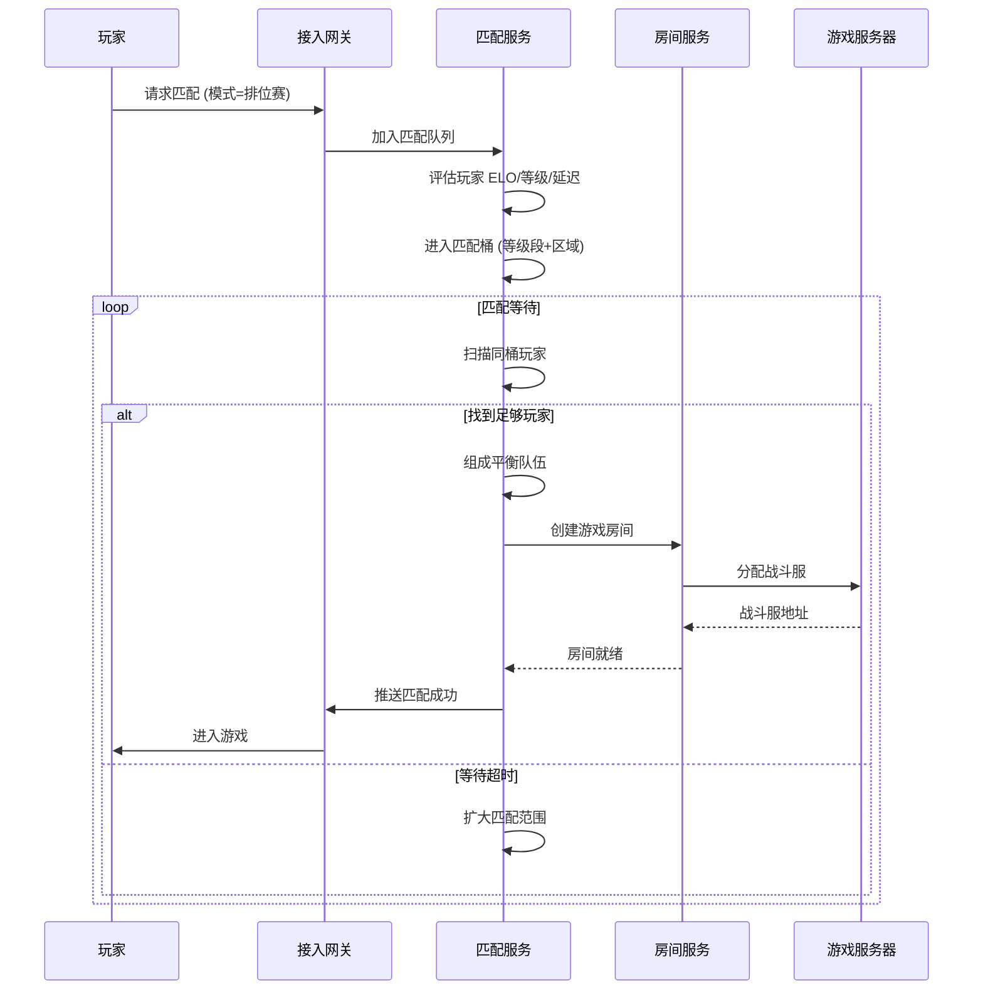

title: 游戏后端 [[Kubernetes|Kubernetes]] 生产架构设计
description: '# 游戏后端 Kubernetes 生产架构设计'
category: application-architecture
tags:
- k8s
- architecture
- industry
- redis
- mysql
- kafka
- hpa
- [[StatefulSet|statefulset]]
- gateway
- operator
last_updated: 2026-05-18
difficulty: advanced
reading_level: advanced
audience:
- 游戏后端架构师
- 游戏技术总监
- SRE
estimated_read_time: 5min
intent_queries:
- 游戏后端 Kubernetes StatefulSet UDP
- 游戏服务器 帧同步 状态同步 K8s
- 游戏匹配 ELO Kubernetes 部署
- 游戏排行榜 Redis Sorted Set K8s
- 游戏区服架构 TiDB Kubernetes
trigger_keywords:
- 游戏后端
- Kubernetes
- StatefulSet
- UDP
- 帧同步
- 状态同步
- 匹配系统
- 排行榜
- TiDB
- SRE
related_domains:
- domain-01-cluster-fundamentals
- domain-11-production-operations
- domain-03-networking-traffic
related_topics:
- 40-cloud-gaming
- 54-social-gaming-metaverse
- 58-web3-gamefi
authors:
- name: KUDIG Team
  role: contributor
k8s_versions:
- '1.28'
- '1.29'
- '1.30'
- '1.31'
- '1.32'
---

# 游戏后端 Kubernetes 生产架构设计

> **适用场景**: MMO / MOBA / FPS / 棋牌 / 休闲社交 / 云游戏 / 元宇宙  
> **适用版本**: Kubernetes v1.29 - v1.33  
> **最后更新**: 2026-04-24  
> **目标读者**: 游戏后端架构师、游戏技术总监、SRE

---

<!-- chunk: 📋 目录 -->## 📋 目录

- [一、整体架构全景](#一整体架构全景)
- [二、登录与匹配架构](#二登录与匹配架构)
- [三、游戏服务器架构](#三游戏服务器架构)
- [四、状态同步架构](#四状态同步架构)
- [五、帧同步 vs 状态同步](#五帧同步-vs-状态同步)
- [六、排行榜与社交架构](#六排行榜与社交架构)
- [七、运营与数据分析架构](#七运营与数据分析架构)
- [八、K8s 部署架构](#八k8s-部署架构)

---

<!-- chunk: 一、整体架构全景 -->## 一、整体架构全景

```mermaid
flowchart TB
    subgraph Clients["游戏客户端"]
        MOBILE["移动客户端<br/>iOS/Android"]
        PC["PC 客户端<br/>Windows/Mac"]
        CONSOLE["主机<br/>PS5/Xbox/Switch"]
        WEB["H5 页游"]
    end

    subgraph Edge["边缘接入层"]
        DNS["智能 DNS<br/>就近接入"]
        GATEWAY["接入网关<br/>TCP/UDP/WebSocket"]
        MATCH["匹配服务<br">房间/对战"]
    end

    subgraph GameServices["游戏服务层"]
        LOGIN["登录服务<br/>账号/SDK/防沉迷"]
        LOBBY["大厅服务<br/>房间/聊天/好友"]
        ROOM["房间服务<br/>PvP/PvE/副本"]
        BATTLE["战斗服务<br/>帧同步/状态同步"]
        AI_BOT["AI 机器人<br">补位/陪玩"]
    end

    subgraph Platform["平台服务层"]
        USER["用户中心<br/>资料/背包/成就"]
        ITEM["道具系统<br/>掉落/合成/交易"]
        PAY["支付系统<br">充值/代币/商城"]
        MAIL["邮件系统<br">奖励/通知"]
        CHAT["聊天系统<br">世界/公会/私聊"]
    end

    subgraph DataLayer["数据层"]
        CACHE["Redis Cluster<br/>玩家缓存"]
        DB["TiDB/MySQL<br">持久化数据"]
        TSDB["时序数据库<br">战斗日志"]
        OSS["对象存储<br">录像/资源"]
    end

    Clients --> Edge --> GameServices --> Platform --> DataLayer

    style GameServices fill:#e3f2fd
    style Platform fill:#fff8e1
    style DataLayer fill:#e8f5e9
```

---

<!-- chunk: 二、登录与匹配架构 -->## 二、登录与匹配架构

```mermaid
flowchart TB
    subgraph Auth["认证流程"]
        GUEST["游客模式<br/>快速体验"]
        ACCOUNT["账号登录<br/>密码/手机/邮箱"]
        SSO["第三方登录<br/>微信/QQ/Apple"]
        REAL_NAME["实名认证<br/>防沉迷/合规"]
    end

    subgraph Session["会话管理"]
        TOKEN["Token 签发<br/>JWT + 刷新"]
        GATE["网关绑定<br/>长连接关联"]
        HEARTBEAT["心跳检测<br">30s 间隔"]
        KICK["顶号/踢下线<br">单点登录"]
    end

    subgraph Match["匹配系统"]
        QUEUE["匹配队列<br">ELO/等级/延迟"]
        BUCKET["分桶匹配<br">技能/地区/语言"]
        EXPAND["扩大搜索<br">放宽条件"]
        FORM["组队成型<br">5v5/3v3/1v1"]
    end

    Auth --> Session --> Match

    style Auth fill:#e3f2fd
    style Session fill:#fff8e1
    style Match fill:#e8f5e9
```

## 匹配算法流程



---

<!-- chunk: 三、游戏服务器架构 -->## 三、游戏服务器架构

```mermaid
flowchart TB
    subgraph BattleServer["战斗服务器 (GameServer)"]
        MAIN_LOOP["主循环<br/>16ms/60FPS"]
        INPUT["输入处理<br/>移动/技能/攻击"]
        PHYSICS["物理计算<br">碰撞/轨迹"]
        LOGIC["游戏逻辑<br">伤害/状态/判定"]
        SYNC["同步广播<br">状态/帧"]
        AI["AI 逻辑<br">NPC/机器人"]
    end

    subgraph Players["玩家连接"]
        P1["玩家 1<br/>延迟 20ms"]
        P2["玩家 2<br">延迟 50ms"]
        P3["玩家 3<br">延迟 80ms"]
        P4["玩家 4<br">延迟 120ms"]
    end

    MAIN_LOOP --> INPUT --> PHYSICS --> LOGIC --> SYNC --> AI --> MAIN_LOOP
    Players --> INPUT
    SYNC --> Players

    style BattleServer fill:#e3f2fd
```

## 游戏服务器 K8s 部署

```yaml
apiVersion: apps/v1
kind: StatefulSet
metadata:
  name: game-battle-server
  namespace: gaming
spec:
  serviceName: game-battle-server
  replicas: 10
  selector:
    matchLabels:
      app: game-battle-server
  template:
    metadata:
      labels:
        app: game-battle-server
    spec:
      terminationGracePeriodSeconds: 60
      affinity:
        podAntiAffinity:
          requiredDuringSchedulingIgnoredDuringExecution:
            - labelSelector:
                matchExpressions:
                  - key: app
                    operator: In
                    values:
                      - game-battle-server
              topologyKey: kubernetes.io/hostname
      containers:
        - name: gameserver
          image: gaming/battle-server:v1.5.0
          ports:
            - containerPort: 10000
              protocol: UDP
              name: game-udp
            - containerPort: 10001
              protocol: TCP
              name: game-tcp
            - containerPort: 8080
              name: health
          env:
            - name: TICK_RATE
              value: "60"
            - name: MAX_PLAYERS
              value: "100"
            - name: MATCH_TIMEOUT
              value: "300"
            - name: REDIS_ADDR
              value: "redis-cluster:6379"
          resources:
            requests:
              cpu: "2"
              memory: "4Gi"
            limits:
              cpu: "4"
              memory: "8Gi"
          livenessProbe:
            httpGet:
              path: /health/live
              port: 8080
            initialDelaySeconds: 10
            periodSeconds: 5
          readinessProbe:
            httpGet:
              path: /health/ready
              port: 8080
            initialDelaySeconds: 5
            periodSeconds: 3
          lifecycle:
            preStop:
              exec:
                command:
                  - /bin/sh
                  - -c
                  - |
                    curl -X POST localhost:8080/graceful-shutdown
                    sleep 30
      volumes:
        - name: game-logs
          emptyDir: {}
---
# HPA 基于房间数扩缩容
apiVersion: autoscaling/v2
kind: HorizontalPodAutoscaler
metadata:
  name: game-battle-hpa
  namespace: gaming
spec:
  scaleTargetRef:
    apiVersion: apps/v1
    kind: StatefulSet
    name: game-battle-server
  minReplicas: 5
  maxReplicas: 100
  metrics:
    - type: Pods
      pods:
        metric:
          name: game_active_rooms
        target:
          type: AverageValue
          averageValue: "5"
    - type: Resource
      resource:
        name: cpu
        target:
          type: Utilization
          averageUtilization: 70
```

---

<!-- chunk: 四、状态同步架构 -->## 四、状态同步架构

```mermaid
flowchart TB
    subgraph Server["服务端状态"]
        AUTH_STATE["权威状态机<br/>唯一真值"]
        PREDICT["预测补偿<br">客户端预表现"]
        RECONCILE["状态调和<br">修正差异"]
    end

    subgraph Network["网络层"]
        UDP["UDP 协议<br">低延迟不可靠"]
        RELIABLE["可靠消息<br">关键事件确认"]
        COMPRESS["状态压缩<br">Delta/Dictionary"]
        INTERPOLATION["插值平滑<br">显示延迟缓冲"]
    end

    subgraph Client["客户端表现"]
        PREDICT_CLIENT["本地预测<br">即时反馈"]
        RENDER["渲染层<br">60FPS 显示"]
        LAG_COMP["延迟补偿<br">回退验证"]
    end

    AUTH_STATE --> COMPRESS --> UDP --> INTERPOLATION --> RENDER
    AUTH_STATE --> RELIABLE --> Client
    PREDICT_CLIENT --> RENDER
    RECONCILE --> PREDICT_CLIENT
    LAG_COMP --> AUTH_STATE

    style Server fill:#e3f2fd
    style Network fill:#fff8e1
    style Client fill:#e8f5e9
```

---

<!-- chunk: 五、帧同步 vs 状态同步 -->## 五、帧同步 vs 状态同步

```mermaid
flowchart TB
    subgraph FrameSync["帧同步 (Lockstep)"]
        FS_CLIENT1["客户端 A<br/>输入+随机种子"]
        FS_CLIENT2["客户端 B<br/>输入+随机种子"]
        FS_SERVER["帧同步服务器<br/>收集输入+广播"]
        FS_LOGIC1["客户端 A<br/>本地计算结果"]
        FS_LOGIC2["客户端 B<br/>本地计算结果"]

        FS_CLIENT1 -->|Input + Seed| FS_SERVER -->|All Inputs| FS_CLIENT1 & FS_CLIENT2
        FS_CLIENT1 --> FS_LOGIC1
        FS_CLIENT2 --> FS_LOGIC2
    end

    subgraph StateSync["状态同步"]
        SS_CLIENT1["客户端 A<br/>发送输入"]
        SS_CLIENT2["客户端 B<br/>发送输入"]
        SS_SERVER["状态同步服务器<br/>权威计算"]
        SS_STATE1["客户端 A<br/>接收状态"]
        SS_STATE2["客户端 B<br">接收状态"]

        SS_CLIENT1 -->|Input| SS_SERVER -->|State| SS_STATE1 & SS_STATE2
        SS_CLIENT2 -->|Input| SS_SERVER
    end

    style FrameSync fill:#e3f2fd
    style StateSync fill:#e8f5e9
```

## 同步方案选型

| 特性 | 帧同步 | 状态同步 |
|:---|:---|:---|
| **适用类型** | RTS / 格斗 / 棋牌 | MOBA / FPS / MMO |
| **流量** | 低 (仅输入) | 高 (状态广播) |
| **延迟敏感** | 极高 (全员同步) | 中高 (服务端权威) |
| **作弊防范** | 弱 (客户端计算) | 强 (服务端权威) |
| **断线重连** | 复杂 (回放所有帧) | 简单 (同步当前状态) |
| ** spectators** | 复杂 | 简单 |

---

<!-- chunk: 六、排行榜与社交架构 -->## 六、排行榜与社交架构

```mermaid
flowchart TB
    subgraph Leaderboard["排行榜系统"]
        REALTIME["实时排行榜<br">Redis Sorted Set"]
        DAILY["日榜<br">定时结算"]
        WEEKLY["周榜<br">赛季制"]
        SEASON["赛季榜<br">大版本"]
        GLOBAL["全服榜<br">跨服排名"]
        FRIEND["好友榜<br">社交排名"]
    end

    subgraph Social["社交系统"]
        FRIEND_SYS["好友系统<br">添加/删除/黑名单"]
        GUILD["公会/战队<br">创建/管理/权限"]
        CHAT_SYS["聊天系统<br">频道/私聊/邮件"]
        MAIL_SYS["邮件系统<br">奖励/通知"]
    end

    Leaderboard --> Social

    style Leaderboard fill:#e3f2fd
    style Social fill:#e8f5e9
```

---

<!-- chunk: 七、运营与数据分析架构 -->## 七、运营与数据分析架构

```mermaid
flowchart TB
    subgraph DataCollection["数据采集"]
        EVENT["事件上报<br/>SDK/埋点"]
        LOG["游戏日志<br">战斗/经济/行为"]
        METRIC["性能指标<br">延迟/帧率/崩溃"]
    end

    subgraph Pipeline["数据处理"]
        STREAM["流处理<br">Flink / Kafka"]
        BATCH["批处理<br">Spark / Hive"]
        FEATURE["特征工程<br">玩家画像"]
    end

    subgraph Analysis["分析应用"]
        DAU["DAU/留存<br/>活跃分析"]
        REVENUE["营收分析<br/>ARPPU/LTV"]
        BALANCE["经济平衡<br">产出/消耗/通胀"]
        ANTI_CHEAT["反作弊<br">异常检测"]
    end

    DataCollection --> Pipeline --> Analysis

    style Pipeline fill:#e3f2fd
    style Analysis fill:#e8f5e9
```

---

<!-- chunk: 八、K8s 部署架构 -->## 八、K8s 部署架构

## 游戏区服架构

```mermaid
flowchart TB
    subgraph Global["全局服务"]
        G_LOGIN["登录服务<br/>全区服"]
        G_MATCH["匹配服务<br/>跨服匹配"]
        G_RANK["排行榜<br">跨服排名"]
        G_PAY["支付服务<br">全区服"]
    end

    subgraph Zone1["一区 (华东)"]
        Z1_GATE["网关集群"]
        Z1_GAME["游戏服 1-100"]
        Z1_DB["数据库主从"]
    end

    subgraph Zone2["二区 (华南)"]
        Z2_GATE["网关集群"]
        Z2_GAME["游戏服 1-100"]
        Z2_DB["数据库主从"]
    end

    subgraph ZoneN["N 区 (海外)"]
        ZN_GATE["网关集群"]
        ZN_GAME["游戏服 1-100"]
        ZN_DB["数据库主从"]
    end

    Players["玩家"] --> G_LOGIN --> Zone1 & Zone2 & ZoneN
    Zone1 <--> G_MATCH
    Zone2 <--> G_MATCH
    ZoneN <--> G_MATCH

    style Global fill:#fff8e1
    style Zone1 fill:#e3f2fd
    style Zone2 fill:#e8f5e9
```

## 游戏服 K8s 配置

```yaml
apiVersion: v1
kind: Namespace
metadata:
  name: gaming-zone-1
  labels:
    zone: "1"
    region: east-china
---
# 游戏数据库 StatefulSet
apiVersion: apps/v1
kind: StatefulSet
metadata:
  name: game-db-zone-1
  namespace: gaming-zone-1
spec:
  serviceName: game-db-zone-1
  replicas: 2
  selector:
    matchLabels:
      app: game-db
  template:
    metadata:
      labels:
        app: game-db
    spec:
      affinity:
        podAntiAffinity:
          requiredDuringSchedulingIgnoredDuringExecution:
            - labelSelector:
                matchExpressions:
                  - key: app
                    operator: In
                    values:
                      - game-db
              topologyKey: kubernetes.io/hostname
      containers:
        - name: tidb
          image: pingcap/tidb:v8.0
          ports:
            - containerPort: 4000
              name: mysql
            - containerPort: 10080
              name: status
          env:
            - name: STORE
              value: "tikv"
          resources:
            requests:
              cpu: "4"
              memory: "16Gi"
            limits:
              cpu: "8"
              memory: "32Gi"
          volumeMounts:
            - name: tidb-data
              mountPath: /var/lib/tidb
  volumeClaimTemplates:
    - metadata:
        name: tidb-data
      spec:
        storageClassName: fast-ssd
        accessModes: ["ReadWriteOnce"]
        resources:
          requests:
            storage: 500Gi
```

---

<!-- chunk: 参考链接 -->## 参考链接

- [Kubecost 游戏行业方案](https://www.kubecost.com/)
- [AWS Game Tech](https://aws.amazon.com/gametech/)
- [腾讯云游戏服务器引擎](https://cloud.tencent.com/product/gse)

---

<!-- chunk: Obsidian 相关文档 -->## Obsidian 相关文档

- topic-application-architecture KUDIG Database — Global MOC
- [[domain-20-application-patterns/topic-application-architecture/README.md|[[Topic 应用层架构设计最佳实践|Topic 应用层架构设计最佳实践]]]]
- [[domain-20-application-patterns/topic-application-architecture/01-ecommerce-architecture.md|电商系统 Kubernetes 生产架构设计]]
- [[domain-20-application-patterns/topic-application-architecture/02-mini-program-architecture.md|小程序平台架构设计]]
- [[domain-20-application-patterns/topic-application-architecture/03-cms-architecture.md|内容管理系统 CMS 架构设计]]
- [[domain-20-application-patterns/topic-application-architecture/04-im-rtc-architecture.md|实时通信 IM/RTC 架构设计]]
- [[domain-20-application-patterns/topic-application-architecture/05-online-education-architecture.md|在线教育平台 Kubernetes 生产架构设计]]
- [[domain-20-application-patterns/topic-application-architecture/06-fintech-architecture.md|金融科技FinTech Kubernetes生产架构设计]]
- [[domain-20-application-patterns/topic-application-architecture/07-iot-platform-architecture.md|物联网 IoT 平台架构设计]]
- [[domain-20-application-patterns/topic-application-architecture/08-ai-ml-inference-architecture.md|AI/ML 推理服务 Kubernetes 生产架构设计]]
- [[domain-20-application-patterns/topic-application-architecture/10-social-media-architecture.md|社交媒体平台Kubernetes生产架构设计]]
- [[domain-20-application-patterns/topic-application-architecture/11-smart-retail-architecture.md|智慧零售与新零售Kubernetes生产架构设计]]

## See Also

- 07-iot-platform-architecture
- 08-ai-ml-inference-architecture
- 10-social-media-architecture
- 11-smart-retail-architecture
