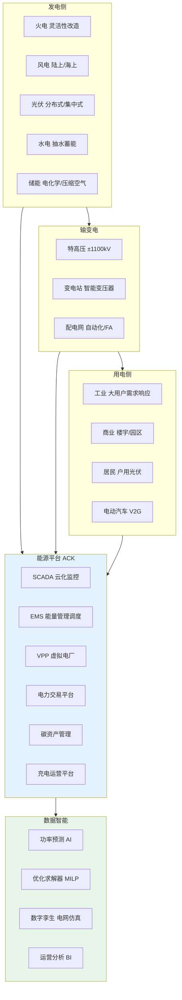
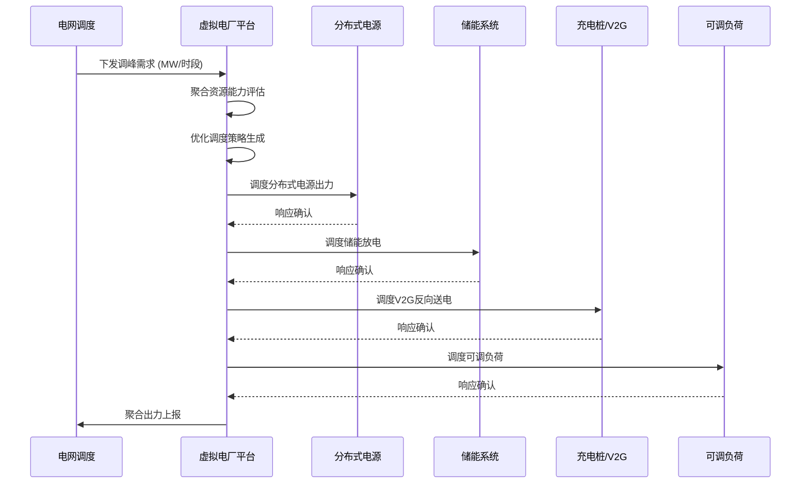
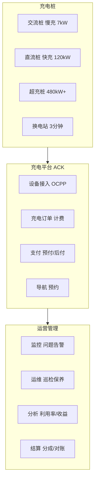
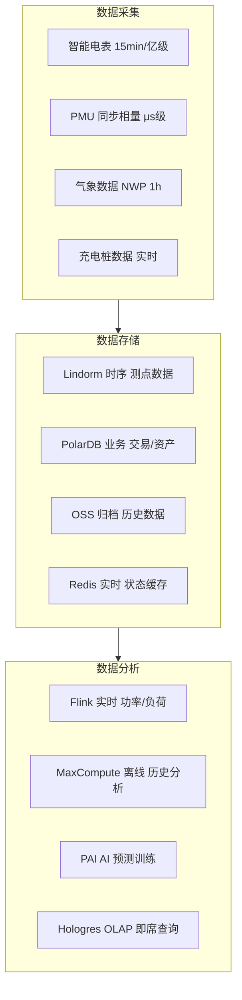

title: 能源电力 [[Kubernetes|Kubernetes]] 生产架构设计
description: '# 能源电力 Kubernetes 生产架构设计'
category: application-architecture
tags:
- k8s
- architecture
- industry
- [[Flux|flux]]
- redis
- mysql
- kafka
- hpa
- gateway
- operator
last_updated: 2026-05-18
difficulty: advanced
reading_level: advanced
audience:
- 能源电力架构师
- 电力系统工程师
- 充电运营平台开发者
- 阿里云能源解决方案架构师
estimated_read_time: 5min
intent_queries:
- 能源电力 Kubernetes 集群部署架构
- 虚拟电厂 VPP 调度优化系统
- 新能源功率预测 AI 模型
- 充电桩运营平台百万级设备接入
- 电力数据时序库 Lindorm 架构
trigger_keywords:
- 能源电力
- 智能电网
- 虚拟电厂
- 新能源
- 充电桩
- 碳资产
- 电力交易
- 调度自动化
- 新能源预测
- 储能
related_domains:
- domain-5-edge-computing
- domain-03-networking-traffic
- domain-9-security-compliance
- domain-12-observability-comprehensive
- domain-7-ai-ml-platform
related_topics:
- domain-20-application-patterns/topic-application-architecture/86-solid-state-battery
- domain-20-application-patterns/topic-application-architecture/52-smart-water
- domain-20-application-patterns/topic-application-architecture/72-digital-twin-city
authors:
- name: KUDIG Team
  role: contributor
k8s_versions:
- '1.28'
- '1.29'
- '1.30'
- '1.31'
- '1.32'
---

# 能源电力 Kubernetes 生产架构设计

> **适用场景**: 智能电网 / 新能源发电 / 虚拟电厂 / 碳资产管理 / 电力交易 / 充电桩运营
> **云厂商**: 阿里云 ACK + 产品体系 (电力监控系统安全防护规定 / 等保 2.0)
> **适用版本**: Kubernetes v1.29 - v1.33
> **最后更新**: 2026-05-18
> **目标读者**: 能源行业架构师、电力系统工程师、阿里云解决方案架构师

---

<!-- chunk: 目录 -->## 目录

1. [行业概述](#1-行业概述)
2. [业务场景](#2-业务场景)
3. [架构设计](#3-架构设计)
4. [核心技术栈](#4-核心技术栈)
5. [K8s 部署方案](#5-k8s-部署方案)
6. [数据架构](#6-数据架构)
7. [AI/ML 组件](#7-aiml-组件)
8. [安全合规](#8-安全合规)
9. [最佳实践](#9-最佳实践)
10. [反模式](#10-反模式)
11. [参考资源](#11-参考资源)

---

<!-- chunk: 1. 行业概述 -->## 1. 行业概述

## 1.1 行业背景

能源电力行业是国民经济的命脉，正在经历从传统化石能源向清洁能源的深刻转型。中国"双碳"目标（2030 年碳达峰、2060 年碳中和）驱动着电力系统的全面升级：新能源装机容量持续增长（风电 + 光伏超过 10 亿千瓦），特高压输电网络加速建设，电力市场化改革深入推进，虚拟电厂、储能、电动汽车等新业态蓬勃发展。能源电力行业的信息化建设正在从传统的 SCADA/EMS 系统向云原生、大数据、AI 驱动的智慧能源平台演进。

能源电力平台的核心信息化需求涵盖：新能源功率预测（短期 72 小时/超短期 4 小时）、虚拟电厂资源聚合与优化调度、电力现货市场交易（日前/实时双市场）、充电桩运营管理（百万级设备接入）、碳资产核算与交易、配电自动化与故障自愈。这些需求对计算资源（AI 推理 + 优化求解器）、存储资源（亿级电表测点时序数据）和实时性（毫秒级保护控制）提出了极高要求。电力行业还面临严格的监管合规要求：电力监控系统安全防护规定（安全分区/网络专用/横向隔离/纵向认证）、等保 2.0 三级、关键信息基础设施保护。

## 1.2 行业挑战

| 挑战 | 说明 | 架构影响 |
|:---|:---|:---|
| 新能源波动性 | 风电光伏出力预测误差大 | AI 预测 + 储能调度 + 备用优化 |
| 负荷峰谷差扩大 | 极端天气/电动汽车充电加剧峰谷差 | 需求响应 + 虚拟电厂削峰填谷 |
| 海量分布式接入 | 百万级分布式光伏/储能并网 | 边缘计算 + 即插即用协议 |
| 电力网络安全 | 电力监控系统面临国家级网络威胁 | 零信任 + 安全分区 + 纵深防御 |
| 实时平衡要求 | 频率稳定要求 50±0.2Hz | 毫秒级 AGC + 安全自动装置 |
| 电力市场化 | 现货市场实时出清复杂度高 | 高并发交易引擎 + 风险控制 |
| 数据规模巨大 | 亿级电表 15 分钟采集，PB 级时序数据 | Lindorm 时序 + 数据湖 |
| 合规监管严格 | 电力监控安全防护 + 等保 + 密评 | 专有云/物理隔离 + 国密 |

## 1.3 市场格局

中国能源电力行业由国家电网和南方电网两大央企主导，分别覆盖 26 个和 5 个省份，年投资总额超过 5000 亿元。国电南瑞、许继电气、平高电气等传统电力设备企业是信息化建设的主力军。阿里云、华为云、腾讯云等云服务商凭借云原生和 AI 能力正在深入能源行业，提供智慧电网解决方案。虚拟电厂、电力交易、综合能源服务、充电运营等细分赛道涌现了大量创新企业，如特来电、星星充电、国能日新、朗新科技等。

---

<!-- chunk: 2. 业务场景 -->## 2. 业务场景

## 2.1 智能电网调度

电网调度是电力系统的核心职能，负责维持发电和用电的实时平衡。调度系统包括 SCADA（数据采集与监视控制）、EMS（能量管理系统）、DMS（配电管理系统）、WAMS（广域测量系统）。新一代调度系统需要支撑大规模新能源接入场景下的经济调度、安全校核、自动发电控制（AGC）、自动电压控制（AVC）等功能。调度系统的实时性要求极高：AGC 控制周期为 4 秒，保护动作响应时间 < 100ms。系统需要支持多级调度协同（国调-网调-省调-地调-县调）。

## 2.2 新能源发电监控

集中式和分布式新能源场站的远程监控与功率预测。核心功能包括：设备状态监测（风机/逆变器实时数据采集）、功率预测（基于 NWP 数值天气预报 + AI 模型）、健康管理（设备问题预警与诊断）、生产管理（发电量统计/报表/对标）。新能源场站通常位于偏远地区，需要通过专线或 5G 网络将数据传输到集控中心，场站内部署边缘计算节点实现本地监控和断网自治。

## 2.3 虚拟电厂（VPP）

虚拟电厂将分布式电源、储能、可调负荷等资源通过通信技术聚合起来，作为一个整体参与电网调度和电力市场。VPP 平台的核心功能包括：资源注册与能力评估、实时状态监测与聚合能力计算、优化调度策略生成（经济性最优/响应速度最优）、指令下发与执行跟踪、收益结算与分成。VPP 需要协调数万到数十万个分布式资源，对平台的并发处理能力和优化求解能力要求极高。

## 2.4 充电桩运营

电动汽车充电桩的运营管理平台。中国充电桩保有量已超过 800 万根，涵盖交流慢充、直流快充、超充桩（480kW+）和换电站。核心功能包括：设备接入与管理（OCPP/自定义协议适配）、充电订单管理（启动/停止/计费/支付）、智能导航与预约（找桩/排队/预约充电）、运营监控（设备问题/利用率/收益分析）、互联互通（与各大车企/地图平台对接）。充电桩平台需要支撑百万级设备的并发连接和高峰时段的订单洪峰。

## 2.5 碳资产管理

企业碳排放核算、碳配额管理和碳交易。核心功能包括：排放核算（范围 1/2/3 温室气体排放计算）、减排项目管理（CCER/绿电/绿证）、碳盘查（年度碳排放核查）、碳目标管理（碳达峰/碳中和路径规划）、碳市场交易（CEA 配额交易/CCER 抵消）。碳资产管理平台需要与企业的能源管理系统、生产管理系统对接，自动采集能耗数据并核算碳排放。

---

<!-- chunk: 3. 架构设计 -->## 3. 架构设计

## 3.1 能源电力全景架构



## 3.2 虚拟电厂调度时序



## 3.3 充电桩运营平台



---

<!-- chunk: 4. 核心技术栈 -->## 4. 核心技术栈

| 类别 | 开源工具 | 阿里云方案 | 说明 |
|:---|:---|:---|:---|
| 时序数据库 | InfluxDB, TDengine | Lindorm 时序引擎 | 亿级测点高频采集 |
| 实时计算 | Flink, Kafka Streams | 实时计算 Flink 版 | 功率/负荷实时计算 |
| 离线计算 | Spark, Hive | MaxCompute | 历史数据分析 |
| AI 预测 | Prophet, Transformer | PAI | 功率/负荷预测 |
| 优化求解 | Pyomo, Gurobi | E-HPC | MILP 调度优化 |
| 边缘计算 | [[KubeEdge|KubeEdge]], [[OpenYurt|OpenYurt]] | ACK@Edge | 场站/变电站边缘 |
| IoT 接入 | EMQX, Mosquitto | 阿里云 IoT 平台 | 设备协议适配 |
| 协议转换 | IEC 61850, IEC 104, Modbus | 自研协议网关 | 电力设备通信 |
| 数字孪生 | Unity, Cesium | DataV + 3D 可视化 | 电网全景展示 |
| 区块链 | Fabric, FISCO BCOS | 蚂蚁链 BaaS | 碳交易存证 |
| 容器平台 | K8s | ACK 专有版/Pro | 安全合规部署 |

---

<!-- chunk: 5. K8s 部署方案 -->## 5. K8s 部署方案

## 5.1 SCADA 数据采集器

```yaml
apiVersion: apps/v1
kind: Deployment
metadata:
  name: scada-data-collector
  namespace: energy-platform
spec:
  replicas: 5
  selector:
    matchLabels:
      app: scada-collector
  template:
    metadata:
      labels:
        app: scada-collector
    spec:
      affinity:
        podAntiAffinity:
          preferredDuringSchedulingIgnoredDuringExecution:
            - weight: 100
              podAffinityTerm:
                labelSelector:
                  matchExpressions:
                    - key: app
                      operator: In
                      values:
                        - scada-collector
                topologyKey: kubernetes.io/hostname
      containers:
        - name: collector
          image: registry.cn-hangzhou.aliyuncs.com/energy/scada-collector:v1.0
          ports:
            - containerPort: 8080
            - containerPort: 2404
              name: iec104
          env:
            - name: PROTOCOL_ADAPTERS
              value: "iec104,modbus,mqtt"
            - name: LINDORM_URL
              valueFrom:
                secretKeyRef:
                  name: energy-db-secret
                  key: lindorm-url
            - name: POINTS_BATCH_SIZE
              value: "5000"
            - name: WRITE_INTERVAL_MS
              value: "1000"
          resources:
            requests:
              cpu: "2"
              memory: "4Gi"
            limits:
              cpu: "8"
              memory: "16Gi"
```

## 5.2 功率预测 GPU 服务

```yaml
apiVersion: apps/v1
kind: Deployment
metadata:
  name: power-forecast-ai
  namespace: energy-platform
spec:
  replicas: 2
  selector:
    matchLabels:
      app: power-forecast
  template:
    metadata:
      labels:
        app: power-forecast
    spec:
      nodeSelector:
        node-type: gpu
      tolerations:
        - key: nvidia.com/gpu
          operator: Exists
          effect: NoSchedule
      containers:
        - name: forecast
          image: registry.cn-hangzhou.aliyuncs.com/energy/power-forecast:v2.0
          ports:
            - containerPort: 8080
          env:
            - name: MODEL_PATH
              value: "/models/wind-power-forecast-v3"
            - name: FORECAST_HORIZON
              value: "72"
            - name: RESOLUTION
              value: "15min"
            - name: LINDORM_URL
              valueFrom:
                secretKeyRef:
                  name: energy-db-secret
                  key: lindorm-url
          resources:
            requests:
              cpu: "4"
              memory: "16Gi"
              nvidia.com/gpu: "1"
            limits:
              cpu: "16"
              memory: "64Gi"
              nvidia.com/gpu: "1"
          volumeMounts:
            - name: model-storage
              mountPath: /models
      volumes:
        - name: model-storage
          persistentVolumeClaim:
            claimName: forecast-model-pvc
```

## 5.3 充电桩设备接入

```yaml
apiVersion: apps/v1
kind: Deployment
metadata:
  name: charge-station-gateway
  namespace: energy-platform
spec:
  replicas: 10
  selector:
    matchLabels:
      app: charge-gateway
  template:
    metadata:
      labels:
        app: charge-gateway
    spec:
      containers:
        - name: gateway
          image: registry.cn-hangzhou.aliyuncs.com/energy/charge-gateway:v3.0.0
          ports:
            - containerPort: 8080
            - containerPort: 1883
              name: mqtt
          env:
            - name: PROTOCOL
              value: "ocpp2.0"
            - name: MAX_DEVICES
              value: "100000"
            - name: MQTT_BROKER
              value: "mqtt-broker:1883"
            - name: DB_URL
              valueFrom:
                secretKeyRef:
                  name: energy-db-secret
                  key: polardb-url
          resources:
            requests:
              cpu: "2"
              memory: "4Gi"
            limits:
              cpu: "4"
              memory: "8Gi"
```

---

<!-- chunk: 6. 数据架构 -->## 6. 数据架构

## 6.1 数据分层



## 6.2 存储策略

| 数据类型 | 存储方案 | 保留策略 | 写入频率 | 数据量级 |
|:---|:---|:---|:---|:---|
| 电表采集 | Lindorm 时序 | 3 年热 + 7 年冷 | 15 分钟 | 亿级测点 |
| PMU 相量 | Lindorm 时序 | 1 月热 + 1 年冷 | 毫秒级 | TB/天 |
| 气象预报 | PolarDB + OSS | 1 年 | 1 小时 | GB/天 |
| 交易数据 | PolarDB MySQL | 永久 | 秒级 | GB/天 |
| 充电桩数据 | Lindorm 时序 | 3 年 | 秒级 | TB/月 |
| 碳排放数据 | PolarDB MySQL | 永久 | 日级 | GB 级 |

---

<!-- chunk: 7. AI/ML 组件 -->## 7. AI/ML 组件

## 7.1 AI 应用矩阵

| AI 场景 | 模型/算法 | 输入 | 输出 | 说明 |
|:---|:---|:---|:---|:---|
| 风电功率预测 | Transformer + CNN | NWP + 历史功率 | 72h 功率曲线 | 精度 > 85% |
| 光伏功率预测 | LSTM + 注意力 | 辐照 + 云图 | 72h 功率曲线 | 精度 > 90% |
| 负荷预测 | DeepAR + Prophet | 历史负荷 + 气象 | 96 点负荷曲线 | 精度 > 95% |
| VPP 优化调度 | MILP 求解器 | 资源状态 + 约束 | 调度方案 | 分钟级求解 |
| 设备故障预测 | LSTM 异常检测 | 振动/温度/电流 | 问题预警 | 提前 24h |
| 线损分析 | XGBoost | 量测数据 | 线损率/异常 | 月度分析 |
| 碳排放核算 | 规则引擎 + ML | 能耗数据 | 碳排放量 | 实时核算 |

---

<!-- chunk: 8. 安全合规 -->## 8. 安全合规

## 8.1 安全分区架构

电力监控系统按照"安全分区、网络专用、横向隔离、纵向认证"的原则划分为四个安全区：

| 安全区 | 功能 | 网络要求 | 部署方案 |
|:---|:---|:---|:---|
| I 区（控制区） | 实时控制/保护 | 物理隔离 | 专有云/裸金属 |
| II 区（非控制区） | 调度管理/监测 | 逻辑隔离 | 专有云/ACK 专有版 |
| III 区（管理区） | 生产管理/OA | 网闸隔离 | ACK Pro |
| IV 区（信息区） | 对外服务/互联网 | 防火墙隔离 | ACK Pro + WAF |

## 8.2 合规框架

- **电力监控系统安全防护规定**: 安全分区/网络专用/横向隔离/纵向认证
- **等保 2.0 三级**: 电力关键信息基础设施等级保护
- **关键信息基础设施保护条例**: 电力 CII 安全保护
- **国密合规**: SM2/SM3/SM4 密码算法应用
- **数据安全法**: 电力数据分类分级管理

---

<!-- chunk: 9. 最佳实践 -->## 9. 最佳实践

- **预测精度保障**: 风电预测准确率 > 85%，光伏 > 90%，通过多模型集成学习提升精度
- **调度实时性**: VPP 调度指令端到端延迟 < 100ms，使用 Redis 缓存资源实时状态
- **边缘自治**: 变电站/场站边缘节点断网后独立运行 24 小时，保障基本监控和控制功能
- **数据质量**: 建立测点数据质量评估体系，自动识别坏数据（通信中断/传感器漂移/数据跳变）
- **弹性伸缩**: 极端天气和突发事件场景的计算弹性，使用 HPA + 预热策略应对计算洪峰
- **碳核算自动化**: 对接能耗数据自动核算碳排放，支持碳盘查和碳交易数据报送

---

<!-- chunk: 10. 反模式 -->## 10. 反模式

## 10.1 安全分区违规

将生产控制区（I/II 区）和管理信息区（III/IV 区）部署在同一网络平面。

**解决方案**: 严格执行安全分区原则，I/II 区部署在专有云或物理机房，III/IV 区部署在 ACK Pro，不同区间通过网闸物理隔离。

## 10.2 边缘无自治

边缘节点完全依赖云端，网络中断时变电站/场站失去监控能力。

**解决方案**: 边缘节点部署 ACK@Edge，关键监控和控制逻辑本地执行，网络恢复后自动同步数据到云端。

## 10.3 忽视协议兼容

只支持 MQTT 协议接入设备，忽视电力行业广泛使用的 IEC 61850/IEC 104/Modbus 协议。

**解决方案**: 部署协议适配网关，支持 IEC 61850（变电站）、IEC 104（远动）、Modbus（设备）、MQTT（IoT）等多种电力通信协议。

---

<!-- chunk: 11. 参考资源 -->## 11. 参考资源

## 11.1 阿里云组件映射

| 功能域 | 阿里云方案 | 说明 |
|:---|:---|:---|
| 容器平台 | **ACK 专有版 / ACK Pro** | 安全分区合规部署 |
| 边缘计算 | **ACK@Edge** | 变电站/场站边缘节点 |
| 时序数据库 | **Lindorm** | 亿级测点时序数据 |
| 实时计算 | **Flink** | 功率/负荷实时计算 |
| 离线计算 | **MaxCompute** | 历史数据分析 |
| AI 平台 | **PAI** | 功率预测模型训练推理 |
| IoT 平台 | **阿里云 IoT** | 设备接入协议适配 |
| 数字孪生 | **DataV + 3D** | 电网全景可视化 |
| 对象存储 | **OSS** | 历史数据归档 |
| 区块链 | **蚂蚁链 BaaS** | 碳交易/绿证存证 |
| 可观测性 | **ARMS + SLS** | 全链路监控审计 |
| 密码服务 | **阿里云 KMS + HSM** | 国密算法/密钥管理 |

## 11.2 生产检查清单

- [ ] 新能源预测模型准确率验证（风电 > 85%，光伏 > 90%）
- [ ] 虚拟电厂资源聚合与调度端到端测试
- [ ] 电网安全稳定约束校验通过
- [ ] 边缘测控实时性 < 100ms 验证
- [ ] 电力监控系统等保三级合规审计
- [ ] 安全分区网闸隔离验证
- [ ] 充电桩设备接入压测（10 万级并发）
- [ ] 碳排放核算准确性校验
- [ ] 边缘节点断网自治能力 24h 测试
- [ ] 国密算法合规验证

---

**维护者**: 阿里云解决方案架构师团队 | **许可证**: MIT

---

<!-- chunk: Obsidian 相关文档 -->## Obsidian 相关文档

- topic-application-architecture MOC
- [[domain-20-application-patterns/topic-application-architecture/README.md|Topic 应用层架构设计最佳实践]]
- [[domain-20-application-patterns/topic-application-architecture/01-ecommerce-architecture.md|电商系统 Kubernetes 生产架构设计]]
- [[domain-20-application-patterns/topic-application-architecture/02-mini-program-architecture.md|小程序平台架构设计]]
- [[domain-20-application-patterns/topic-application-architecture/03-cms-architecture.md|内容管理系统 CMS 架构设计]]
- [[domain-20-application-patterns/topic-application-architecture/04-im-rtc-architecture.md|实时通信 IM/RTC 架构设计]]
- [[domain-20-application-patterns/topic-application-architecture/05-online-education-architecture.md|在线教育平台 Kubernetes 生产架构设计]]
- [[domain-20-application-patterns/topic-application-architecture/06-fintech-architecture.md|金融科技FinTech Kubernetes生产架构设计]]
- [[domain-20-application-patterns/topic-application-architecture/07-iot-platform-architecture.md|物联网 IoT 平台架构设计]]
- [[domain-20-application-patterns/topic-application-architecture/08-ai-ml-inference-architecture.md|AI/ML 推理服务 Kubernetes 生产架构设计]]
- [[domain-20-application-patterns/topic-application-architecture/09-gaming-backend-architecture.md|游戏后端 Kubernetes 生产架构设计]]
- [[domain-20-application-patterns/topic-application-architecture/10-social-media-architecture.md|社交媒体平台Kubernetes生产架构设计]]

## See Also

- 13-digital-government-architecture
- 14-smart-healthcare-architecture
- 16-video-shortform-architecture
- 17-saas-multitenant-architecture
