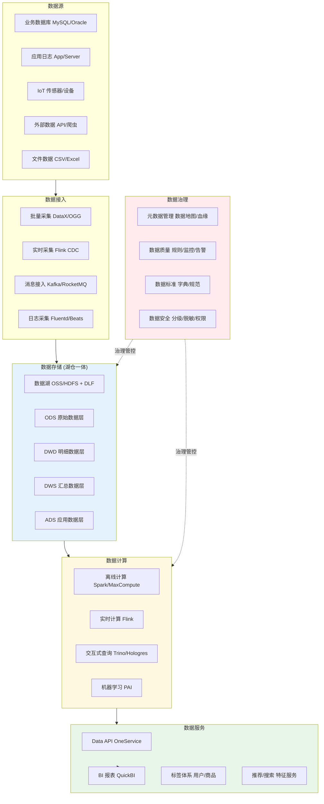
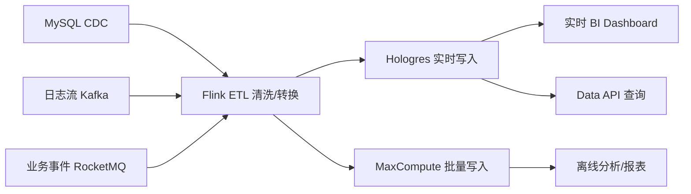
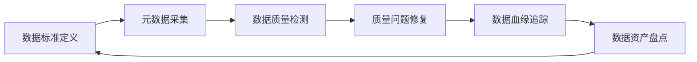
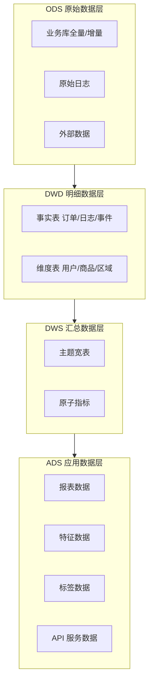

title: 数据中台架构设计
description: '# 数据中台 [[Kubernetes|Kubernetes]] 生产架构设计'
category: application-architecture
tags:
- k8s
- architecture
- industry
- scheduler
- redis
- mysql
- kafka
- job
- gateway
- rbac
last_updated: 2026-05-18
difficulty: advanced
reading_level: advanced
audience:
- 数据架构师
- 数据平台负责人
- 大数据工程师
estimated_read_time: 5min
intent_queries:
- 企业数据中台湖仓一体架构
- Flink 实时流计算 Kubernetes
- 数据治理元数据血缘质量
- Data API 数据服务化网关
- 阿里云 DataWorks 数据治理
trigger_keywords:
- 数据中台
- 湖仓一体
- Flink实时计算
- 数据治理
- 元数据管理
- 数据血缘
- 数据质量
- ODS-DWD-DWS-ADS
- Data API
- 数据服务化
related_domains:
- domain-03-networking-traffic
- domain-10-troubleshooting-diagnostics
related_topics:
- topic-data-midplatform-architecture
- topic-bigdata-architecture
authors:
- name: KUDIG Team
  role: contributor
k8s_versions:
- '1.28'
- '1.29'
- '1.30'
- '1.31'
- '1.32'
---

# 数据中台 Kubernetes 生产架构设计

> **适用场景**: 企业数据中台 / 数据湖 / 实时数仓 / 数据资产平台 / 数据治理 / BI 分析
> **云厂商**: 阿里云 ACK + 大数据产品体系
> **适用版本**: Kubernetes v1.29 - v1.33
> **最后更新**: 2026-04-24
> **目标读者**: 数据架构师、数据平台负责人、阿里云解决方案架构师

---

<!-- chunk: 目录 -->## 目录

1. [行业概述](#1-行业概述)
2. [业务场景](#2-业务场景)
3. [架构设计](#3-架构设计)
4. [核心技术栈](#4-核心技术栈)
5. [K8s 部署方案](#5-k8s-部署方案)
6. [数据架构](#6-数据架构)
7. [AI/ML 组件](#7-aiml-组件)
8. [安全合规](#8-安全合规)
9. [最佳实践](#9-最佳实践)
10. [反模式](#10-反模式)
11. [参考资源](#11-参考资源)

---

<!-- chunk: 1. 行业概述 -->## 1. 行业概述

## 1.1 行业背景

数据中台是企业数字化转型的基础设施，通过统一的数据采集、存储、计算、治理和服务化能力，打破数据孤岛，实现数据资产的统一管理和高效复用。数据中台的概念由阿里巴巴在 2015 年提出并在内部大规模实践，随后成为各行各业数字化转型的标准架构模式。数据中台不仅是一个技术平台，更是一套数据管理方法论和组织协作模式。

数据中台的核心价值在于：数据资产化（将数据视为企业核心资产进行管理）、数据服务化（将数据能力封装为 API 服务供业务系统调用）、数据业务化（通过数据分析和 AI 模型驱动业务决策）。典型的数据中台建设包括：数据湖/湖仓一体的存储架构、离线+实时的双流计算架构、数据治理（元数据管理/数据质量/数据血缘/数据安全）体系、Data API 数据服务化层、BI 分析与可视化平台。

## 1.2 行业挑战

| 挑战 | 说明 | 架构影响 |
|:---|:---|:---|
| 数据孤岛 | 各业务系统数据格式不统一，难以打通 | 统一数据接入层 + 标准化模型 |
| 数据质量 | 数据缺失、重复、不一致问题严重 | 数据质量规则引擎 + 自动检测 |
| 计算时效 | 传统 T+1 批处理无法满足实时需求 | 流批一体架构 Flink + MaxCompute |
| 数据安全 | 敏感数据泄露风险，合规要求严格 | 数据分级分类 + 脱敏加密 + 权限管控 |
| 成本控制 | 数据量和计算量持续增长，成本压力大 | 弹性计算 + 冷热分层 + FinOps |
| 人才稀缺 | 数据工程师/数据科学家供给不足 | 低代码/No-Code 数据开发平台 |
| 数据治理 | 元数据缺失、血缘不清、标准不统一 | 元数据管理 + 数据血缘 + 标准体系 |

## 1.3 市场格局

数据中台市场可分为三类参与者：云厂商（阿里云 DataWorks + MaxCompute 体系、AWS、GCP）、专业数据平台厂商（Snowflake、Databricks、Palantir）、行业解决方案商（面向金融/制造/零售等行业定制）。中国市场以阿里云体系为主流选择，DataWorks 作为数据开发治理平台，配合 MaxCompute（离线）、Hologres（实时）、Flink（流计算）组成完整的数据中台技术栈。

---

<!-- chunk: 2. 业务场景 -->## 2. 业务场景

## 2.1 数据采集与接入

数据采集是数据中台的起点，需要覆盖多种数据源和多种接入模式。批量采集（DataX/Sqoop）用于历史数据迁移和定期全量同步；实时采集（Flink CDC/Canal）用于数据库变更数据的实时捕获；日志采集（[[Fluentd|Fluentd]]/Logstash/Beats）用于应用日志和服务器日志的实时采集；消息接入（Kafka/RocketMQ）用于业务事件的流式接入。数据接入层需要提供统一的 schema 管理和数据格式标准化。

## 2.2 数据存储与计算

湖仓一体（Lakehouse）是数据中台的存储计算核心。数据分层模型：ODS（原始数据层，保持原始格式）→ DWD（明细数据层，清洗标准化后的事实数据）→ DWS（汇总数据层，面向主题的宽表聚合）→ ADS（应用数据层，面向业务应用的指标数据）。计算引擎包括离线批处理（Spark/MaxCompute）和实时流处理（Flink），通过统一元数据层实现流批一体的查询体验。

## 2.3 数据治理

数据治理是保障数据资产质量的管理体系。核心功能包括：元数据管理（数据地图，自动发现和注册数据表的元信息）、数据血缘（SQL 解析追踪数据从源到端的流转链路）、数据质量（规则引擎自动检测数据的完整性/准确性/一致性/时效性）、数据标准（统一的命名规范/编码规范/指标口径）、数据安全（敏感数据识别/脱敏/加密/访问控制）。

## 2.4 数据服务化

数据服务化（Data API）将数据中台的数据能力封装为标准 API 接口，供业务系统直接调用。场景包括：实时查询接口（用户画像查询、商品推荐特征获取）、批量导出接口（报表数据下载）、数据订阅接口（数据变更事件推送）。数据 API 需要统一网关管理，提供认证鉴权、限流熔断、版本管理、调用审计等能力。

## 2.5 BI 分析与可视化

BI 分析是数据中台的终端消费场景。功能包括：自助式数据分析（拖拽式报表构建）、数据大屏（DataV 可视化）、固定报表（定期生成的经营分析报表）、即席查询（Ad-hoc SQL 分析）、移动端看板（管理者手机端查看关键指标）。BI 层需要与数据中台的 ADS 层紧密对接，保证数据的实时性和准确性。

---

<!-- chunk: 3. 架构设计 -->## 3. 架构设计

## 3.1 数据中台全景架构



## 3.2 实时数仓架构



## 3.3 数据治理闭环



---

<!-- chunk: 4. 核心技术栈 -->## 4. 核心技术栈

| 架构层 | 开源工具 | 阿里云方案 | 说明 |
|:---|:---|:---|:---|
| 数据集成 | DataX, Sqoop, Canal | DataWorks 数据集成 | 异构数据源同步 |
| 消息队列 | Kafka, Pulsar | RocketMQ 5.0 | 事件流缓冲 |
| 数据湖 | HDFS, Iceberg, Hudi | OSS + DLF 数据湖构建 | 统一存储层 |
| 离线计算 | Spark, Hive, Presto | MaxCompute | 大规模批处理 |
| 实时计算 | Flink, Spark Streaming | 实时计算 Flink 版 | 流处理引擎 |
| 实时数仓 | ClickHouse, Doris | Hologres | 实时 OLAP |
| 交互查询 | Trino, Presto | Hologres/Interactive | 即席查询 |
| 数据治理 | Apache Atlas, DataHub | DataWorks 数据治理 | 元数据/质量/血缘 |
| 机器学习 | Spark MLlib, XGBoost | PAI | 模型训练与推理 |
| BI 可视化 | Superset, Metabase | QuickBI | 数据分析与展示 |
| 调度编排 | Airflow, DolphinScheduler | DataWorks 调度 | 工作流编排 |
| 容器平台 | K8s | ACK Pro | 计算任务调度 |

---

<!-- chunk: 5. K8s 部署方案 -->## 5. K8s 部署方案

## 5.1 Flink on ACK 实时计算

```yaml
apiVersion: flink.apache.org/v1beta1
kind: FlinkDeployment
metadata:
  name: realtime-etl-job
  namespace: data-platform
spec:
  image: registry.cn-hangzhou.aliyuncs.com/flink/flink:1.18-scala_2.12
  flinkVersion: v1.18
  jobManager:
    resource:
      memory: "4Gi"
      cpu: 2
  taskManager:
    resource:
      memory: "8Gi"
      cpu: 4
    replicas: 5
  podTemplate:
    spec:
      containers:
        - name: flink-main-container
          volumeMounts:
            - name: checkpoint-storage
              mountPath: /opt/flink/checkpoints
      volumes:
        - name: checkpoint-storage
          persistentVolumeClaim:
            claimName: flink-checkpoint-pvc
  job:
    jarURI: local:///opt/flink/usrlib/realtime-etl.jar
    parallelism: 20
    upgradeMode: savepoint
    state: running
    args:
      - --kafka-brokers
      - kafka-0.kafka:9092
      - --hologres-endpoint
      - holo-cn-hangzhou.aliyuncs.com
      - --checkpoint-interval
      - "60000"
```

## 5.2 Spark on K8s 离线任务

```yaml
apiVersion: sparkoperator.k8s.io/v1beta2
kind: SparkApplication
metadata:
  name: daily-aggregation-job
  namespace: data-platform
spec:
  type: Scala
  mode: cluster
  image: registry.cn-hangzhou.aliyuncs.com/spark/spark:v3.4.0
  mainClass: com.example.DailyAggregation
  mainApplicationFile: local:///opt/spark/jobs/daily-aggregation.jar
  sparkVersion: "3.4.0"
  driver:
    cores: 2
    memory: "4G"
    serviceAccount: spark-driver
  executor:
    cores: 4
    instances: 10
    memory: "8G"
  arguments:
    - --date
    - "2026-04-24"
    - --output-path
    - "oss://data-warehouse/dws/daily/"
```

## 5.3 Data API 网关服务

```yaml
apiVersion: apps/v1
kind: Deployment
metadata:
  name: data-api-gateway
  namespace: data-platform
spec:
  replicas: 5
  selector:
    matchLabels:
      app: data-api-gateway
  template:
    metadata:
      labels:
        app: data-api-gateway
    spec:
      affinity:
        podAntiAffinity:
          preferredDuringSchedulingIgnoredDuringExecution:
            - weight: 100
              podAffinityTerm:
                labelSelector:
                  matchLabels:
                    app: data-api-gateway
                topologyKey: topology.kubernetes.io/zone
      containers:
        - name: gateway
          image: registry.cn-hangzhou.aliyuncs.com/dataplatform/data-api-gw:v3.0.0
          ports:
            - containerPort: 8080
          env:
            - name: HOLOGRES_URL
              valueFrom:
                secretKeyRef:
                  name: dataplatform-db-secret
                  key: hologres-url
            - name: RATE_LIMIT_QPS
              value: "1000"
            - name: AUTH_TYPE
              value: "appkey"
            - name: CACHE_REDIS
              value: "redis-cluster:6379"
          resources:
            requests:
              memory: "2Gi"
              cpu: "1000m"
            limits:
              memory: "4Gi"
              cpu: "2000m"
```

---

<!-- chunk: 6. 数据架构 -->## 6. 数据架构

## 6.1 数据分层模型



## 6.2 存储策略

| 数据层 | 存储引擎 | 格式 | 保留策略 | 访问模式 |
|:---|:---|:---|:---|:---|
| ODS | OSS + MaxCompute | Parquet/ORC | 2 年 | 批量读写 |
| DWD | MaxCompute + Hologres | Parquet | 3 年 | 批量+实时 |
| DWS | MaxCompute + Hologres | Parquet | 3 年 | 批量+实时 |
| ADS | Hologres + Redis | 行存/内存 | 1 年热 + 永久冷 | 实时查询 |

---

<!-- chunk: 7. AI/ML 组件 -->## 7. AI/ML 组件

| AI 场景 | 模型/算法 | 输入 | 输出 | 说明 |
|:---|:---|:---|:---|:---|
| 用户画像 | 聚类+标签传播 | 行为日志 | 用户标签 | RFM 模型+兴趣标签 |
| 推荐特征 | Embedding/Graph | 行为序列 | 特征向量 | DeepWalk/Node2Vec |
| 数据质量检测 | 异常检测 | 数据分布 | 质量评分 | Isolation Forest |
| 智能调度 | 强化学习 | 任务 DAG | 优化调度计划 | 缩短 ETL 时间 |
| 指标预测 | 时序预测 Prophet | 历史指标 | 未来趋势 | 容量规划 |

---

<!-- chunk: 8. 安全合规 -->## 8. 安全合规

## 8.1 数据安全体系

| 安全层级 | 措施 | 技术实现 |
|:---|:---|:---|
| 数据分级 | 自动识别敏感数据 | NLP + 正则匹配分类 |
| 访问控制 | 细粒度权限管理 | RBAC + 列级权限 + 行级脱敏 |
| 数据脱敏 | 动态/静态脱敏 | 手机号/身份证/银行卡脱敏规则 |
| 数据加密 | 传输+存储加密 | TLS + AES-256 + TDE |
| 审计追踪 | 全链路操作审计 | SLS 审计日志 + 不可篡改 |
| 隐私计算 | 联邦学习/安全多方计算 | MPC + TEE + 差分隐私 |

## 8.2 合规框架

- **数据安全法**: 数据分类分级保护，重要数据目录管理
- **个人信息保护法**: 个人信息最小化采集，脱敏处理，用户授权管理
- **等保 2.0**: 信息系统安全等级保护三级
- **行业监管**: 金融/医疗/政务等行业的专项数据合规要求

---

<!-- chunk: 9. 最佳实践 -->## 9. 最佳实践

- **数据标准先行**: 在建设数据中台前先建立数据标准和命名规范，避免后期大规模重构
- **流批一体**: 使用 Flink 统一流批计算引擎，避免维护两套独立的计算体系
- **元数据驱动**: 所有数据开发以元数据为中心，元数据自动采集，数据血缘自动追踪
- **DataOps 实践**: 将 CI/CD 理念引入数据开发，数据模型版本管理、自动化测试、灰度发布
- **冷热分层**: 历史数据自动迁移到低成本存储（OSS 归档），热数据保留在高速存储
- **FinOps 治理**: 建立 Data Chargeback 机制，按团队/项目分摊计算和存储成本

---

<!-- chunk: 10. 反模式 -->## 10. 反模式

## 10.1 数据沼泽

将所有数据倒入数据湖不做治理，数据湖变成无法使用的沼泽。

**解决方案**: 建立严格的数据接入规范和元数据管理制度，数据入湖前必须注册元数据、定义 schema、配置质量规则。

## 10.2 过度批处理

所有数据处理都走 T+1 批处理，无法满足业务实时需求。

**解决方案**: 评估业务时效性需求，对实时性要求高的场景（风控/推荐/监控）采用 Flink 实时计算，保持批处理用于历史分析和报表。

## 10.3 忽视数据质量

只关注数据量不关注数据质量，脏数据影响下游分析准确性。

**解决方案**: 建立数据质量监控体系，每个数据层配置质量规则（完整性/准确性/一致性/时效性），质量不达标自动拦截并告警。

---

<!-- chunk: 11. 参考资源 -->## 11. 参考资源

## 11.1 阿里云组件映射

| 架构层 | 阿里云方案 | 说明 |
|:---|:---|:---|
| 数据集成 | **DataWorks 数据集成** | 离线+实时异构同步 |
| 数据开发 | **DataWorks 数据开发** | SQL/Python 可视化开发 |
| 离线计算 | **MaxCompute** | PB 级离线批处理 |
| 实时计算 | **实时计算 Flink 版** | 流批一体计算 |
| 实时数仓 | **Hologres** | 实时 OLAP + 服务 |
| 数据湖 | **OSS + DLF** | 数据湖构建与管理 |
| 机器学习 | **PAI** | 模型训练与推理 |
| 数据治理 | **DataWorks 数据治理** | 元数据/质量/标准/安全 |
| BI 分析 | **QuickBI** | 自助式数据分析 |
| 容器平台 | **ACK Pro** | 计算任务调度 |
| 可观测性 | **ARMS + SLS** | 全链路监控 |

## 11.2 生产检查清单

- [ ] 数据接入完整性验证（源端 vs 目标端数据量对比）
- [ ] 数据质量规则覆盖率 > 80%
- [ ] 实时数据延迟 < 5 秒（端到端）
- [ ] 数据血缘链路完整可追溯
- [ ] 敏感数据脱敏规则全覆盖
- [ ] 数据备份与灾难恢复演练
- [ ] 计算资源弹性伸缩验证
- [ ] FinOps 成本分摊报告准确

---

**维护者**: 阿里云解决方案架构师团队 | **许可证**: MIT

---

<!-- chunk: Obsidian 相关文档 -->## Obsidian 相关文档

- topic-application-architecture MOC
- [[domain-20-application-patterns/topic-application-architecture/README.md|Topic 应用层架构设计最佳实践]]
- [[domain-20-application-patterns/topic-application-architecture/01-ecommerce-architecture.md|电商系统 Kubernetes 生产架构设计]]
- [[domain-20-application-patterns/topic-application-architecture/02-mini-program-architecture.md|小程序平台架构设计]]
- [[domain-20-application-patterns/topic-application-architecture/03-cms-architecture.md|内容管理系统 CMS 架构设计]]
- [[domain-20-application-patterns/topic-application-architecture/04-im-rtc-architecture.md|实时通信 IM/RTC 架构设计]]
- [[domain-20-application-patterns/topic-application-architecture/05-online-education-architecture.md|在线教育平台 Kubernetes 生产架构设计]]
- [[domain-20-application-patterns/topic-application-architecture/06-fintech-architecture.md|金融科技FinTech Kubernetes生产架构设计]]
- [[domain-20-application-patterns/topic-application-architecture/07-iot-platform-architecture.md|物联网 IoT 平台架构设计]]
- [[domain-20-application-patterns/topic-application-architecture/08-ai-ml-inference-architecture.md|AI/ML 推理服务 Kubernetes 生产架构设计]]
- [[domain-20-application-patterns/topic-application-architecture/09-gaming-backend-architecture.md|游戏后端 Kubernetes 生产架构设计]]
- [[domain-20-application-patterns/topic-application-architecture/10-social-media-architecture.md|社交媒体平台Kubernetes生产架构设计]]

## See Also

- 16-video-shortform-architecture
- 17-saas-multitenant-architecture
- 19-cloudnative-devops-architecture
- 20-microservice-governance-architecture
