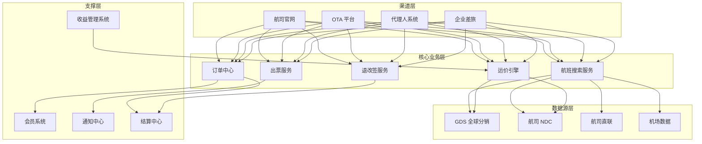
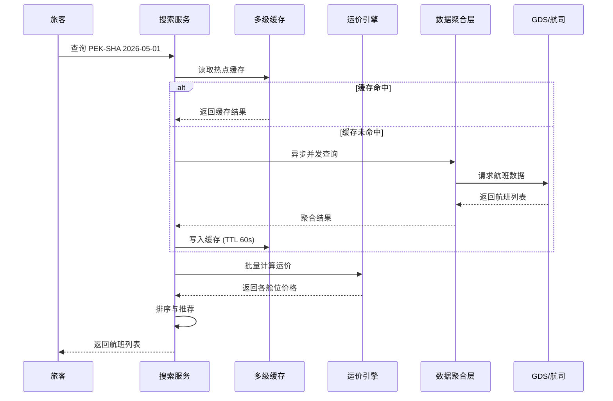
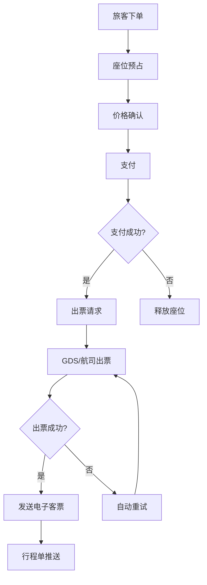

title: 航空出行架构设计
description: '# 航空出行架构设计 — 阿里云视角'
category: application-architecture
tags:
- k8s
- architecture
- industry
- redis
- mysql
- [[StatefulSet|statefulset]]
- operator
last_updated: '2026-05-18'
difficulty: advanced
reading_level: advanced
audience:
- 航空行业架构师
- 票务系统开发者
- 云原生工程师
- 解决方案架构师
estimated_read_time: 5min
intent_queries:
- 航空出行系统高并发查询架构设计
- GDS全球分销系统K8s部署方案
- 航班运价引擎动态定价实现
- 航空超售控制与库存一致性
- 机票订单出票流程微服务架构
trigger_keywords:
- 航空出行
- GDS
- 机票预订
- 运价引擎
- 航班搜索
- NDC
- 收益管理
- 超售控制
- 电子客票
- 退改签
related_domains:
- domain-01-cluster-fundamentals
- domain-7-observability
- domain-8-storage
- domain-03-networking-traffic
related_topics:
- domain-20-application-patterns/topic-application-architecture/12-smart-logistics-architecture
- domain-20-application-patterns/topic-application-architecture/17-saas-multitenant-architecture
- domain-02-workloads-applications/topic-functions/04-high-concurrency-system
- domain-02-workloads-applications/topic-functions/07-distributed-transaction
authors:
- name: KUDIG Team
  role: contributor
k8s_versions:
- '1.28'
- '1.29'
- '1.30'
- '1.31'
- '1.32'
---

# 航空出行架构设计 — 阿里云视角

> **适用版本**: Kubernetes v1.29 - v1.33 | **最后更新**: 2026-04-24
> **作者**: 阿里云解决方案架构师 | **标签**: `#航空` `#机票` `#GDS` `#收益管理` `#阿里云`

---

## 目录

1. [行业背景](#1-行业背景)
2. [业务架构](#2-业务架构)
3. [技术架构](#3-技术架构)
4. [核心数据流](#4-核心数据流)
5. [安全与合规](#5-安全与合规)
6. [可观测性](#6-可观测性)
7. [阿里云组件映射](#7-阿里云组件映射)
8. [生产检查清单](#8-生产检查清单)

---

## 1. 行业背景

### 1.1 业务特点

航空出行系统面临高并发查询、复杂运价计算、实时库存同步等挑战：

| 挑战 | 说明 | 架构影响 |
|:---|:---|:---|
| 高并发查询 | 航班查询 QPS 10万+ | 多级缓存 + 异步化 |
| 动态运价 | 舱位/日期/航线多维定价 | 规则引擎 + 缓存预热 |
| 库存一致性 | 超售控制 + 实时同步 | 分布式事务 + 锁机制 |
| 退改签复杂 | 多规则组合计算 | 工作流引擎 |
| 多源数据 | GDS/航司直联/OTA | 数据聚合层 |

### 1.2 核心场景

- **航班搜索**: 多维度航班查询与推荐
- **运价计算**: 实时舱位定价与税费计算
- **订单出票**: 座位锁定 + 支付 + 出票流程
- **收益管理**: 动态定价与超售优化
- **航班动态**: 延误/取消实时通知

---

## 2. 业务架构

### 2.1 航空出行全景架构



### 2.2 航班搜索时序



---

## 3. 技术架构

### 3.1 K8s 部署

```yaml
# 航班搜索服务 Deployment
apiVersion: apps/v1
kind: Deployment
metadata:
  name: flight-search
  namespace: aviation
spec:
  replicas: 10
  selector:
    matchLabels:
      app: flight-search
  template:
    metadata:
      labels:
        app: flight-search
    spec:
      affinity:
        podAntiAffinity:
          preferredDuringSchedulingIgnoredDuringExecution:
            - weight: 100
              podAffinityTerm:
                labelSelector:
                  matchExpressions:
                    - key: app
                      operator: In
                      values: [flight-search]
                topologyKey: topology.kubernetes.io/zone
      containers:
        - name: search
          image: registry.cn-hangzhou.aliyuncs.com/aviation/flight-search:v3.1.0
          ports:
            - containerPort: 8080
          env:
            - name: REDIS_CLUSTER
              value: "redis-cluster:6379"
            - name: CACHE_TTL_SECONDS
              value: "60"
            - name: GDS_TIMEOUT_MS
              value: "3000"
          resources:
            requests:
              memory: "2Gi"
              cpu: "1000m"
            limits:
              memory: "4Gi"
              cpu: "2000m"
```

```yaml
# 运价引擎 StatefulSet
apiVersion: apps/v1
kind: StatefulSet
metadata:
  name: fare-engine
  namespace: aviation
spec:
  serviceName: fare-engine
  replicas: 3
  selector:
    matchLabels:
      app: fare-engine
  template:
    metadata:
      labels:
        app: fare-engine
    spec:
      containers:
        - name: engine
          image: registry.cn-hangzhou.aliyuncs.com/aviation/fare-engine:v2.5.0
          ports:
            - containerPort: 8080
          env:
            - name: RULES_REFRESH_INTERVAL
              value: "300"
          resources:
            requests:
              memory: "4Gi"
              cpu: "2000m"
            limits:
              memory: "8Gi"
              cpu: "4000m"
```

---

## 4. 核心数据流

### 4.1 出票流程



---

## 5. 安全与合规

- **PCI-DSS**: 支付数据合规
- **IATA 标准**: NDC/ONE Order 标准对接
- **数据安全**: 旅客 PNR 数据加密

---

## 6. 可观测性

- **搜索响应**: P99 < 200ms
- **出票成功率**: > 99.9%
- **系统可用性**: 99.99%

---

## 7. 阿里云组件映射

| 功能域 | **阿里云云原生方案** |
|:---|:---|
| 容器平台 | **ACK Pro** |
| 缓存 | **Redis 企业版** |
| 数据库 | **PolarDB MySQL** |
| 消息队列 | **RocketMQ** |
| 搜索 | **OpenSearch** |
| 可观测性 | **ARMS + SLS** |

---

## 8. 生产检查清单

- [ ] GDS 接口连通性验证
- [ ] 运价缓存一致性校验
- [ ] 超售控制策略验证
- [ ] 退改签规则端到端测试
- [ ] 航班动态通知延迟 < 30s

---

**维护者**: 阿里云解决方案架构师团队 | **许可证**: MIT

---

## Obsidian 相关文档

- topic-application-architecture MOC
- [[domain-20-application-patterns/topic-application-architecture/README.md|Topic 应用层架构设计最佳实践]]
- [[domain-20-application-patterns/topic-application-architecture/01-ecommerce-architecture.md|电商系统 Kubernetes 生产架构设计]]
- [[domain-20-application-patterns/topic-application-architecture/02-mini-program-architecture.md|小程序平台架构设计]]
- [[domain-20-application-patterns/topic-application-architecture/03-cms-architecture.md|内容管理系统 CMS 架构设计]]
- [[domain-20-application-patterns/topic-application-architecture/04-im-rtc-architecture.md|实时通信 IM/RTC 架构设计]]
- [[domain-20-application-patterns/topic-application-architecture/05-online-education-architecture.md|在线教育平台 Kubernetes 生产架构设计]]
- [[domain-20-application-patterns/topic-application-architecture/06-fintech-architecture.md|金融科技FinTech Kubernetes生产架构设计]]
- [[domain-20-application-patterns/topic-application-architecture/07-iot-platform-architecture.md|物联网 IoT 平台架构设计]]
- [[domain-20-application-patterns/topic-application-architecture/08-ai-ml-inference-architecture.md|AI/ML 推理服务 Kubernetes 生产架构设计]]
- [[domain-20-application-patterns/topic-application-architecture/09-gaming-backend-architecture.md|游戏后端 Kubernetes 生产架构设计]]
- [[domain-20-application-patterns/topic-application-architecture/10-social-media-architecture.md|社交媒体平台Kubernetes生产架构设计]]

## See Also

- 24-insurtech
- 25-quantitative-trading
- 27-hospitality-tourism
- 28-proptech
