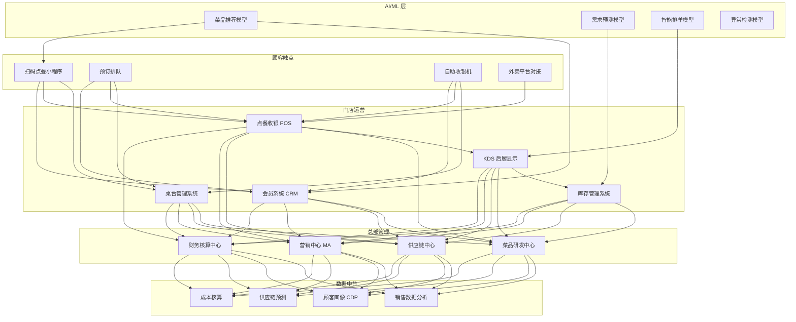
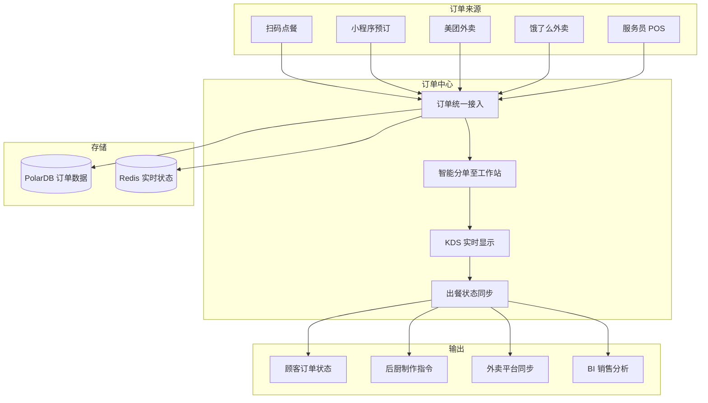

> **生产环境安全提示**
>
> 本文档包含可直接执行的运维命令。执行前请确认：当前目标集群与 Namespace 是否正确；是否具备足够的 RBAC 权限；是否已在非生产环境验证。命令风险等级标注：🔴 高风险（可能造成数据丢失或服务中断）、🟡 中风险（会修改集群状态，但通常可回滚）、🟢 低风险/只读（信息收集，无副作用）。


title: 智慧餐饮架构设计
description: '# 智慧餐饮架构设计 — 阿里云视角'
category: application-architecture
tags:
- k8s
- architecture
- industry
- [[Prometheus|prometheus]]
- opa
- redis
- mysql
- gateway
- rag
last_updated: 2026-05-18
difficulty: intermediate
reading_level: intermediate
audience:
- 餐饮科技架构师
- 餐饮SaaS开发者
- 智慧餐饮产品经理
- 餐饮信息化负责人
estimated_read_time: 5min
intent_queries:
- smart restaurant [[Kubernetes|kubernetes]] architecture
- 智慧餐饮K8s部署方案
- 餐饮点餐KDS系统
- 餐饮供应链预测
- 智慧餐饮SaaS
trigger_keywords:
- 智慧餐饮
- 点餐系统
- 后厨管理
- KDS
- 餐饮SaaS
- 餐饮供应链
- 智慧餐饮架构
- 扫码点餐
- 会员营销
- 餐饮AI
related_domains:
- domain-01-cluster-fundamentals
- domain-10-troubleshooting-diagnostics
- domain-03-networking-traffic
related_topics:
- smart-campus
- vocational-edtech
- livestream-ecommerce
authors:
- name: KUDIG Team
  role: contributor
k8s_versions:
- '1.28'
- '1.29'
- '1.30'
- '1.31'
- '1.32'
---

# 智慧餐饮架构设计 — 阿里云视角

> **适用版本**: Kubernetes v1.29 - v1.33 | **最后更新**: 2026-04-24
> **作者**: 阿里云解决方案架构师 | **标签**: `#智慧餐饮` `#点餐系统` `#后厨管理` `#阿里云`

---

<!-- chunk: 目录 -->## 目录

1. [行业概述](#1-行业概述)
2. [业务场景](#2-业务场景)
3. [架构设计](#3-架构设计)
4. [核心技术栈](#4-核心技术栈)
5. [Kubernetes 部署方案](#5-kubernetes-部署方案)
6. [数据架构](#6-数据架构)
7. [AI/ML 组件](#7-aiml-组件)
8. [安全与合规](#8-安全与合规)
9. [最佳实践](#9-最佳实践)
10. [反模式](#10-反模式)
11. [参考资源](#11-参考资源)

---

<!-- chunk: 1. 行业概述 -->## 1. 行业概述

## 1.1 市场规模与趋势

智慧餐饮涵盖点餐、后厨、供应链、会员运营全链路，是餐饮数字化转型的核心。中国餐饮市场规模超过 5 万亿元，智慧餐饮 SaaS 市场预计从 2024 年的 200 亿元增长到 2030 年的 800 亿元。美团、饿了么、客如云、哗啦啦等平台竞争激烈，核心趋势包括扫码点餐、智能后厨 KDS、AI 菜品推荐和供应链预测。

| 指标 | 2024 年 | 2026 年（预测） | 2030 年（预测） |
|:---|:---|:---|:---|
| 中国餐饮市场规模 | ¥5.2T | ¥6T | ¥8T |
| 智慧餐饮 SaaS 市场 | ¥20B | ¥40B | ¥80B |
| 扫码点餐渗透率 | 70% | 85% | 95% |
| 智能 KDS 部署率 | 20% | 40% | 70% |
| AI 推荐覆盖 | 5% | 20% | 50% |

## 1.2 行业痛点

| 痛点 | 说明 | 数字化转型驱动 |
|:---|:---|:---|
| 高峰并发 | 午晚高峰订单集中爆发 | 弹性伸缩 + 队列削峰 |
| 后厨协同 | 多菜品并行制作协调难 | KDS 智能排单 |
| 桌台管理 | 翻台率优化空间大 | 实时状态同步 |
| 会员运营 | 精准营销与复购提升 | CDP + AI 推荐 |
| 供应链 | 食材采购与库存管理 | AI 需求预测 + 自动补货 |
| 食品安全 | 明厨亮灶与溯源 | 视频监控 + 区块链溯源 |

## 1.3 数字化转型架构影响

智慧餐饮架构需要覆盖顾客触点（扫码点餐/预订/自助收银/外卖）、门店运营（桌台/点餐/KDS后厨/库存/会员）、总部管理（菜品研发/供应链/营销/财务）和数据中台（销售分析/顾客画像/供应链预测/成本核算）。核心挑战是午晚高峰的高并发处理和后厨智能排单。

---

<!-- chunk: 2. 业务场景 -->## 2. 业务场景

## 2.1 扫码点餐与自助收银

顾客扫码进入小程序点餐，支持菜品定制（口味/加料/忌口）、套餐推荐和多种支付方式。订单实时推送至后厨 KDS 系统。高峰期需要支持单店每分钟 100+ 单的并发处理能力。

## 2.2 后厨 KDS 智能排单

Kitchen Display System 将订单按工作站（凉菜/热菜/烧烤/饮品）分发，根据菜品制作时间、锅具占用和厨师负荷智能排序。优先级调整考虑订单等待时间、催单和外卖时效。后厨状态实时同步至前厅。

## 2.3 桌台与排队管理

实时管理桌台状态（空闲/就餐/待清洁），排队叫号根据桌型和大厅空位智能匹配。翻台提醒和清洁任务自动派发。翻台率数据用于优化排班和桌台布局。

## 2.4 会员精准营销

基于消费数据构建用户画像，支持积分/储值/优惠券/生日关怀等多维度会员运营。AI 推荐引擎根据用户口味偏好和历史消费推荐菜品。精准营销提升复购率 20%+。

## 2.5 智能供应链

基于历史销量、天气、节假日等因素预测各门店食材需求，自动生成采购单。库存管理支持先进先出、效期预警和损耗分析。将食材浪费降低 15%+。

---

<!-- chunk: 3. 架构设计 -->## 3. 架构设计

## 3.1 智慧餐饮全景架构



---

<!-- chunk: 4. 核心技术栈 -->## 4. 核心技术栈

| Component | Purpose | Technology | License |
|:---|:---|:---|:---|
| Container Orchestration | Platform management | ACK Pro | Proprietary |
| Mini Program | Customer ordering | 微信小程序 / 支付宝小程序 | Proprietary |
| POS System | Order & payment | 自研 POS (Electron) | Proprietary |
| KDS | Kitchen display | 自研 KDS (Web) | Proprietary |
| Relational DB | Business data | PolarDB MySQL | Proprietary |
| Cache | Session & hot data | Redis Enterprise | Proprietary |
| Message Queue | Real-time order sync | RocketMQ 5.x | Apache 2.0 |
| WebSocket | KDS real-time push | Spring WebSocket / Socket.IO | Apache 2.0 / MIT |
| Object Storage | Images & videos | OSS + CDN | Proprietary |
| AI Platform | Recommendation | PAI | Proprietary |
| Video | 明厨亮灶 | 阿里云视频直播 | Proprietary |
| Monitoring | Observability | ARMS + SLS | Proprietary |

---

<!-- chunk: 5. Kubernetes 部署方案 -->## 5. Kubernetes 部署方案

## 5.1 点餐服务 Deployment

```yaml
apiVersion: apps/v1
kind: Deployment
metadata:
  name: order-service
  namespace: smart-restaurant
  labels:
    app: order-service
    tier: core
spec:
  replicas: 8
  selector:
    matchLabels:
      app: order-service
  strategy:
    rollingUpdate:
      maxSurge: 2
      maxUnavailable: 1
  template:
    metadata:
      labels:
        app: order-service
        tier: core
      annotations:
        prometheus.io/scrape: "true"
        prometheus.io/port: "9090"
    spec:
      containers:
        - name: order
          image: registry.cn-hangzhou.aliyuncs.com/restaurant/order:v3.0.0
          ports:
            - containerPort: 8080
              name: http
            - containerPort: 9090
              name: metrics
          env:
            - name: REDIS_HOST
              valueFrom:
                configMapKeyRef:
                  name: restaurant-config
                  key: redis-host
            - name: KDS_WEBSOCKET_URL
              value: "ws://kds-service:8080/ws"
            - name: DB_CONNECTION
              valueFrom:
                secretKeyRef:
                  name: restaurant-secrets
                  key: db-connection
            - name: MAX_QPS_PER_INSTANCE
              value: "500"
            - name: PEAK_MODE_ENABLED
              value: "auto"
          resources:
            requests:
              memory: "2Gi"
              cpu: "1000m"
            limits:
              memory: "4Gi"
              cpu: "2000m"
          readinessProbe:
            httpGet:
              path: /health/ready
              port: 8080
            initialDelaySeconds: 10
            periodSeconds: 5
          livenessProbe:
            httpGet:
              path: /health/live
              port: 8080
            initialDelaySeconds: 20
            periodSeconds: 10
```

## 5.2 KDS 后厨显示 Deployment

```yaml
apiVersion: apps/v1
kind: Deployment
metadata:
  name: kds-service
  namespace: smart-restaurant
spec:
  replicas: 3
  selector:
    matchLabels:
      app: kds-service
  template:
    metadata:
      labels:
        app: kds-service
    spec:
      containers:
        - name: kds
          image: registry.cn-hangzhou.aliyuncs.com/restaurant/kds:v2.5.0
          ports:
            - containerPort: 8080
          env:
            - name: WS_MAX_CONNECTIONS
              value: "200"
            - name: SORTING_STRATEGY
              value: "time-priority-with-cooking-time"
            - name: STATION_COUNT
              value: "6"
          resources:
            requests:
              memory: "1Gi"
              cpu: "500m"
            limits:
              memory: "2Gi"
              cpu: "1000m"
```

## 5.3 ConfigMap, Service 与 Secret

```yaml
apiVersion: v1
kind: ConfigMap
metadata:
  name: restaurant-config
  namespace: smart-restaurant
data:
  redis-host: "redis-cluster:6379"
  peak-config: |
    {
      "lunch_hours": ["11:00-13:30"],
      "dinner_hours": ["17:30-20:30"],
      "auto_scale_threshold_qps": 300,
      "scale_up_replicas": 12
    }
  kds-stations: |
    [
      {"id": "cold", "name": "凉菜站", "avg_time_min": 5},
      {"id": "hot1", "name": "热菜站A", "avg_time_min": 10},
      {"id": "hot2", "name": "热菜站B", "avg_time_min": 12},
      {"id": "grill", "name": "烧烤站", "avg_time_min": 15},
      {"id": "soup", "name": "汤品站", "avg_time_min": 8},
      {"id": "drink", "name": "饮品站", "avg_time_min": 3}
    ]
  delivery-platforms: |
    {
      "meituan": {"api_url": "https://api.meituan.com", "timeout_s": 5},
      "eleme": {"api_url": "https://api.ele.me", "timeout_s": 5}
    }
---
apiVersion: v1
kind: Service
metadata:
  name: order-service
  namespace: smart-restaurant
spec:
  selector:
    app: order-service
  ports:
    - name: http
      port: 8080
      targetPort: 8080
    - name: metrics
      port: 9090
      targetPort: 9090
  type: ClusterIP
---
apiVersion: v1
kind: Secret
metadata:
  name: restaurant-secrets
  namespace: smart-restaurant
type: Opaque
stringData:
  db-connection: "mysql://restaurant@polardb.restaurant.rds.aliyuncs.com:3306/restaurant_db"
  redis-password: "redis-password-placeholder"
  payment-api-key: "payment-gateway-key"
  meituan-app-key: "meituan-key-placeholder"
  eleme-app-key: "eleme-key-placeholder"
```

---

<!-- chunk: 6. 数据架构 -->## 6. 数据架构

## 6.1 订单数据流



## 6.2 数据流说明

- **订单流**: 全渠道订单统一接入 OMS，经智能分单后推送至 KDS
- **实时状态流**: 订单状态通过 WebSocket 实时推送到顾客端和后厨
- **外卖对接流**: 外卖订单通过 API 网关接入，自动同步状态
- **分析数据流**: 销售数据经 Flink 实时汇总，生成门店经营报表

---

<!-- chunk: 7. AI/ML 组件 -->## 7. AI/ML 组件

## 7.1 核心模型

| 模型 | 用途 | 输入 | 输出 | 框架 |
|:---|:---|:---|:---|---|
| 菜品推荐 | 个性化点餐推荐 | 用户画像/历史/场景 | 推荐菜品列表 | DeepFM |
| 需求预测 | 食材需求预测 | 历史/天气/节假日 | 未来 7 天各门店需求 | Prophet + LSTM |
| 智能排单 | 后厨最优制作顺序 | 订单队列/工作站状态 | 最优排序方案 | 规则 + RL |
| 流失预警 | 会员流失预测 | 消费频率/间隔 | 流失概率 | XGBoost |
| 动态定价 | 菜品动态定价 | 成本/需求/竞品 | 最优价格 | RL |
| 食品安全检测 | 明厨亮灶 AI 检测 | 后厨视频 | 违规行为标记 | YOLOv8 |

---

<!-- chunk: 8. 安全与合规 -->## 8. 安全与合规

## 8.1 行业法规与标准

| 法规/标准 | 适用范围 | 架构要求 |
|:---|:---|:---|
| 食品安全法 | 餐饮食品安全 | 明厨亮灶 + 溯源 |
| 网络食品安全违法行为查处办法 | 网络餐饮 | 外卖食品安全管理 |
| PCI-DSS | 支付数据安全 | 支付信息加密 |
| 个人信息保护法 | 顾客数据保护 | 数据脱敏 + 授权 |
| 明厨亮灶工程 | 后厨视频公开 | 视频存储合规 |

## 8.2 安全架构要点

- **支付安全**: 支付信息令牌化，PCI-DSS 合规
- **食品安全**: 明厨亮灶视频 AI 自动检测违规行为
- **数据安全**: 顾客信息加密存储，最小权限访问
- **外卖对接安全**: 与外卖平台 API 对接使用 OAuth2 签名

---

<!-- chunk: 9. 最佳实践 -->## 9. 最佳实践

1. **弹性伸缩**: 午晚高峰自动扩容订单服务，闲时缩容节省成本
2. **WebSocket 实时推送**: 订单状态通过 WebSocket 实时推送，替代轮询
3. **KDS 智能排单**: 根据制作时间和催单优先级自动排序
4. **多平台统一接入**: 美团/饿了么/自有渠道统一 OMS 管理
5. **食材需求预测**: AI 提前 7 天预测各门店食材需求，降低浪费
6. **会员 CDP**: 全渠道消费数据统一构建用户画像
7. **明厨亮灶 AI**: 后厨视频 AI 自动检测不戴帽子/不洗手等违规
8. **扫码点餐降本**: 扫码点餐替代人工点餐，降低人力成本
9. **菜品 A/B 测试**: 新菜品通过小范围测试验证后推广
10. **供应链集采**: 多门店食材统一采购，降低采购成本

---

<!-- chunk: 10. 反模式 -->## 10. 反模式

1. **高峰容量不足**: 系统按平均负载设计，午高峰崩溃。应按峰值 3 倍设计
2. **后厨显示延迟**: KDS 更新不及时，厨师看旧订单。应 WebSocket 实时推送
3. **忽视外卖高峰**: 外卖订单和堂食订单混在一起，外卖超时。应独立外卖队列
4. **会员数据孤岛**: 会员数据分散在各平台，无法统一运营。应建设 CDP
5. **食材浪费**: 不做需求预测，凭经验采购导致浪费或断货。应 AI 预测

---

<!-- chunk: 11. 参考资源 -->## 11. 参考资源

- [食品安全法](https://www.gov.cn/)
- [美团开放平台](https://developer.meituan.com/)
- [饿了么开放平台](https://open.ele.me/)
- [微信小程序文档](https://developers.weixin.qq.com/miniprogram/dev/framework/)
- [阿里云视频直播文档](https://help.aliyun.com/product/29949.html)

---

**维护者**: 阿里云解决方案架构师团队 | **许可证**: MIT

---

<!-- chunk: Obsidian 相关文档 -->## Obsidian 相关文档

- topic-application-architecture MOC
- [[domain-20-application-patterns/topic-application-architecture/README.md|Topic 应用层架构设计最佳实践]]
- [[domain-20-application-patterns/topic-application-architecture/01-ecommerce-architecture.md|电商系统 Kubernetes 生产架构设计]]
- [[domain-20-application-patterns/topic-application-architecture/02-mini-program-architecture.md|小程序平台架构设计]]
- [[domain-20-application-patterns/topic-application-architecture/03-cms-architecture.md|内容管理系统 CMS 架构设计]]
- [[domain-20-application-patterns/topic-application-architecture/04-im-rtc-architecture.md|实时通信 IM/RTC 架构设计]]
- [[domain-20-application-patterns/topic-application-architecture/05-online-education-architecture.md|在线教育平台 Kubernetes 生产架构设计]]
- [[domain-20-application-patterns/topic-application-architecture/06-fintech-architecture.md|金融科技FinTech Kubernetes生产架构设计]]
- [[domain-20-application-patterns/topic-application-architecture/07-iot-platform-architecture.md|物联网 IoT 平台架构设计]]
- [[domain-20-application-patterns/topic-application-architecture/08-ai-ml-inference-architecture.md|AI/ML 推理服务 Kubernetes 生产架构设计]]
- [[domain-20-application-patterns/topic-application-architecture/09-gaming-backend-architecture.md|游戏后端 Kubernetes 生产架构设计]]
- [[domain-20-application-patterns/topic-application-architecture/10-social-media-architecture.md|社交媒体平台Kubernetes生产架构设计]]

## See Also

- 30-hrtech-saas
- 31-instant-retail
- 33-crossborder-warehouse
- 34-sportstech


<!-- risk-assessed -->
