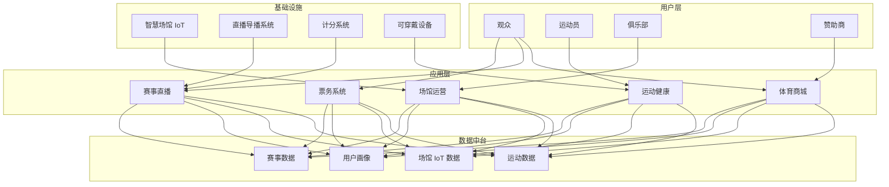
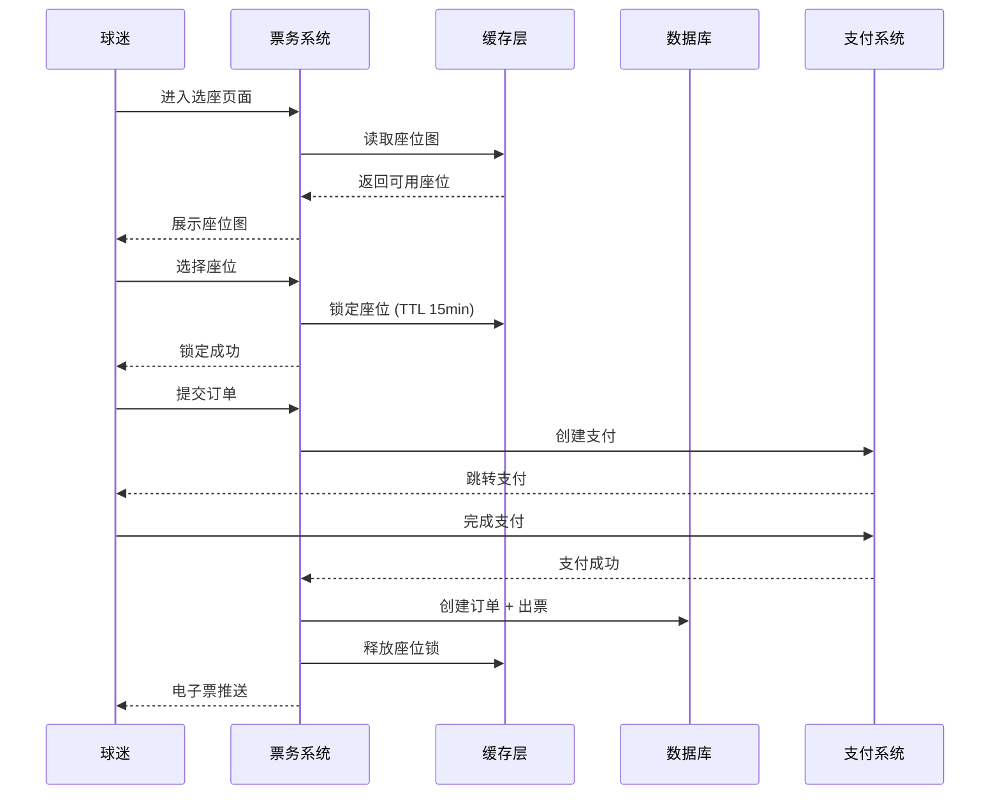
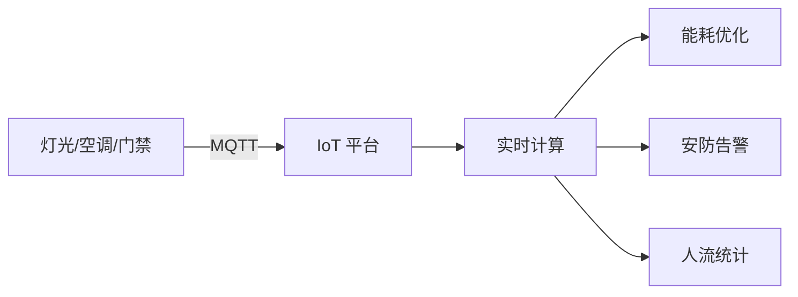

# 体育科技架构设计 — 阿里云视角

> **适用版本**: [[entities/kubernetes|kubernetes]] v1.29 - v1.33 | **最后更新**: 2026-04-24
> **作者**: 阿里云解决方案架构师 | **标签**: `#体育科技` `#智慧场馆` `#赛事` `#阿里云`

---

## 目录

1. [行业背景](#1-行业背景)
2. [业务架构](#2-业务架构)
3. [技术架构](#3-技术架构)
4. [核心数据流](#4-核心数据流)
5. [安全与合规](#5-安全与合规)
6. [可观测性](#6-可观测性)
7. [阿里云组件映射](#7-阿里云组件映射)
8. [生产检查清单](#8-生产检查清单)

---

## 1. 行业背景

### 1.1 业务特点

体育科技涵盖智慧场馆、赛事运营、运动健康、票务营销：

| 挑战 | 说明 | 架构影响 |
|:---|:---|:---|
| 赛事高并发 | 开票瞬间 10万+ QPS | 缓存 + 队列 + 限流 |
| 场馆 IoT | 灯光/空调/门禁/大屏 | 边缘计算 + IoT 平台 |
| 直播低延迟 | 赛事直播 < 3s 延迟 | CDN + 边缘节点 |
| 票务安全 | 黄牛/刷票/假票 | 风控 + 实名制 |
| 运动数据 | 可穿戴设备数据采集 | 时序数据库 |

### 1.2 核心场景

- **智慧场馆**: 智能照明/温控/人流/安防
- **赛事直播**: 多机位/慢动作/数据分析
- **票务系统**: 选座/抢票/电子票/转赠
- **运动健康**: 可穿戴数据/训练计划/社交
- **体育营销**: 会员/周边/赞助商管理

---

## 2. 业务架构

### 2.1 体育科技全景架构



### 2.2 赛事开票时序



---

## 3. 技术架构

### 3.1 K8s 部署

```yaml
# 票务服务 Deployment
apiVersion: apps/v1
kind: Deployment
metadata:
  name: ticket-service
  namespace: sportstech
spec:
  replicas: 20
  selector:
    matchLabels:
      app: ticket-service
  template:
    metadata:
      labels:
        app: ticket-service
    spec:
      affinity:
        podAntiAffinity:
          requiredDuringSchedulingIgnoredDuringExecution:
            - labelSelector:
                matchExpressions:
                  - key: app
                    operator: In
                    values: [ticket-service]
              topologyKey: topology.kubernetes.io/zone
      containers:
        - name: ticket
          image: registry.cn-hangzhou.aliyuncs.com/sportstech/ticket:v2.5.0
          ports:
            - containerPort: 8080
          env:
            - name: REDIS_CLUSTER
              value: "redis-cluster:6379"
            - name: SEAT_LOCK_TTL_SECONDS
              value: "900"
          resources:
            requests:
              memory: "2Gi"
              cpu: "1000m"
            limits:
              memory: "4Gi"
              cpu: "2000m"
```

---

## 4. 核心数据流

### 4.1 场馆 IoT 数据流



---

## 5. 安全与合规

- **票务安全**: 实名制 + 人脸识别入场
- **数据安全**: 运动员隐私保护
- **直播版权**: DRM 内容保护

---

## 6. 可观测性

- **开票并发**: 支持 10万 QPS
- **直播延迟**: P99 < 3s
- **系统可用性**: 99.99%

---

## 7. 阿里云组件映射

| 功能域 | **阿里云云原生方案** |
|:---|:---|
| 容器平台 | **ACK Pro** |
| 直播 | **视频直播 + CDN** |
| 数据库 | **PolarDB MySQL** |
| 缓存 | **Redis 企业版** |
| IoT | **阿里云 IoT 平台** |
| AI | **视觉智能** |
| 可观测性 | **ARMS + SLS** |

---

## 8. 生产检查清单

- [ ] 开票并发压测通过
- [ ] 直播 CDN 预热
- [ ] 场馆 IoT 设备接入验证
- [ ] 人脸识别准确率 > 99%
- [ ] 电子票防伪验证

---

**维护者**: 阿里云解决方案架构师团队 | **许可证**: MIT
