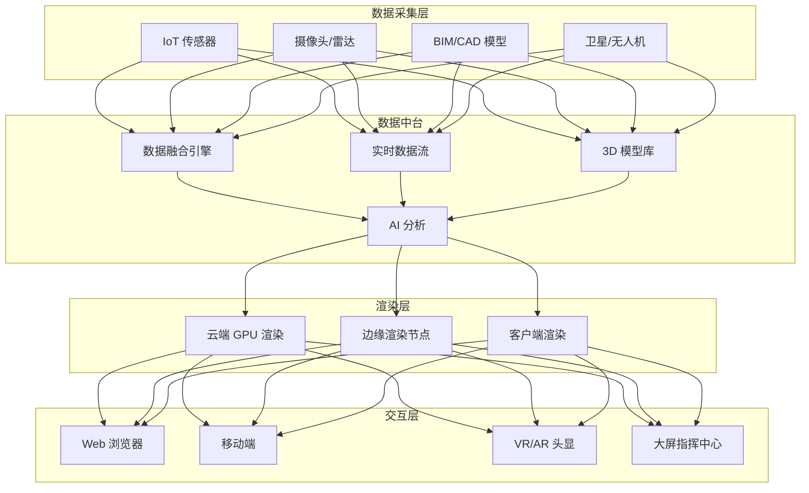
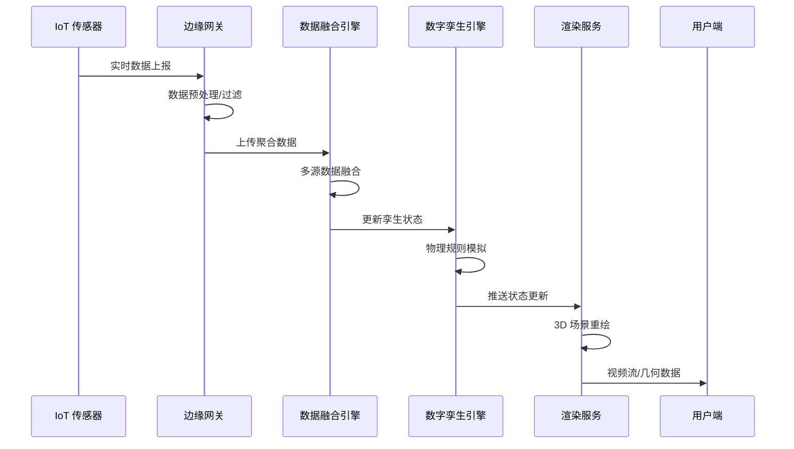
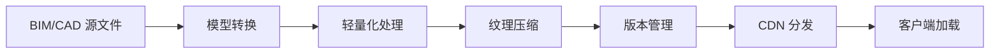

> **生产环境安全提示**
>
> 本文档包含可直接执行的运维命令。执行前请确认：当前目标集群与 Namespace 是否正确；是否具备足够的 RBAC 权限；是否已在非生产环境验证。命令风险等级标注：🔴 高风险（可能造成数据丢失或服务中断）、🟡 中风险（会修改集群状态，但通常可回滚）、🟢 低风险/只读（信息收集，无副作用）。


title: 元宇宙数字孪生架构设计
description: '# 元宇宙数字孪生架构设计 — 阿里云视角'
category: application-architecture
tags:
- k8s
- architecture
- industry
- gpu
- nvidia
last_updated: 2026-05-18
difficulty: advanced
reading_level: advanced
audience:
- 元宇宙平台架构师
- 3D渲染工程师
- VR/AR开发工程师
estimated_read_time: 5min
intent_queries:
- 元宇宙 3D 云渲染 GPU 集群
- 数字孪生城市可视化平台
- IoT 实时数据 3D 同步渲染
- VR AR 沉浸式体验架构
- 阿里云 GPU 云渲染服务
trigger_keywords:
- 元宇宙
- 数字孪生
- 3D渲染
- 云渲染
- VR虚拟现实
- AR增强现实
- 实时同步
- GPU集群
- 数字人
- BIM
related_domains:
- domain-03-networking-traffic
- domain-10-troubleshooting-diagnostics
related_topics:
- topic-metaverse-digital-twin
- topic-streaming-architecture
authors:
- name: KUDIG Team
  role: contributor
k8s_versions:
- '1.28'
- '1.29'
- '1.30'
- '1.31'
- '1.32'
---

# 元宇宙数字孪生架构设计 — 阿里云视角

> **适用版本**: [[Kubernetes|Kubernetes]] v1.29 - v1.33 | **最后更新**: 2026-04-24
> **作者**: 阿里云解决方案架构师 | **标签**: `#元宇宙` `#数字孪生` `#3D渲染` `#阿里云`

---

## 目录

1. [行业背景](#1-行业背景)
2. [业务架构](#2-业务架构)
3. [技术架构](#3-技术架构)
4. [核心数据流](#4-核心数据流)
5. [安全与合规](#5-安全与合规)
6. [可观测性](#6-可观测性)
7. [阿里云组件映射](#7-阿里云组件映射)
8. [生产检查清单](#8-生产检查清单)

---

## 1. 行业背景

### 1.1 业务特点

元宇宙数字孪生融合 3D 渲染、IoT 数据、实时交互：

| 挑战 | 说明 | 架构影响 |
|:---|:---|:---|
| 3D 渲染负载 | 高精度模型实时渲染 | GPU 集群 + 云渲染 |
| 实时同步 | 物理世界到数字世界 | 流式数据 + 边缘计算 |
| 并发交互 | 万人同屏互动 | 分布式状态同步 |
| 模型资产 | BIM/CAD/点云数据 | 对象存储 + 版本管理 |
| 低延迟交互 | 用户操作 < 100ms | 边缘节点 + WebRTC |

### 1.2 核心场景

- **数字孪生城市**: 城市级 3D 可视化运营
- **工业孪生**: 工厂/设备实时监控与预测
- **虚拟展厅**: 3D 沉浸式产品展示
- **虚拟会议**: 元宇宙会议空间
- **数字人**: AI 驱动虚拟客服/主播

---

## 2. 业务架构

### 2.1 元宇宙数字孪生全景架构



### 2.2 数字孪生数据同步时序



---

## 3. 技术架构

### 3.1 K8s GPU 渲染集群

```yaml
# 云渲染服务 GPU Deployment
apiVersion: apps/v1
kind: Deployment
metadata:
  name: cloud-render-service
  namespace: metaverse
spec:
  replicas: 5
  selector:
    matchLabels:
      app: cloud-render-service
  template:
    metadata:
      labels:
        app: cloud-render-service
    spec:
      nodeSelector:
        accelerator: nvidia-a10
      runtimeClassName: nvidia
      containers:
        - name: render
          image: registry.cn-hangzhou.aliyuncs.com/metaverse/cloud-render:v1.0.0-gpu
          ports:
            - containerPort: 8080
            - containerPort: 1935
              name: rtmp
          env:
            - name: RENDER_MODE
              value: "realtime-streaming"
            - name: MAX_CONCURRENT_SESSIONS
              value: "8"
          resources:
            requests:
              nvidia.com/gpu: 1
              memory: "16Gi"
              cpu: "8000m"
            limits:
              nvidia.com/gpu: 1
              memory: "32Gi"
              cpu: "16000m"
          volumeMounts:
            - name: model-volume
              mountPath: /models
      volumes:
        - name: model-volume
          persistentVolumeClaim:
            claimName: 3d-model-pvc
```

---

## 4. 核心数据流

### 4.1 3D 模型流水线



---

## 5. 安全与合规

- **模型资产**: 3D 模型版权保护
- **用户隐私**: VR 行为数据保护
- **内容合规**: UGC 内容审核

---

## 6. 可观测性

- **渲染延迟**: P99 < 50ms
- **并发会话**: 单 GPU 8 路
- **模型加载**: P99 < 5s

---

## 7. 阿里云组件映射

| 功能域 | **阿里云云原生方案** |
|:---|:---|
| 容器平台 | **ACK Pro + GPU 节点池** |
| GPU 渲染 | **GN7/GN10 实例** |
| 3D 模型存储 | **OSS + CDN** |
| 实时计算 | **Flink** |
| IoT | **IoT 平台** |
| 数据库 | **PolarDB + Lindorm** |
| AI | **PAI** |
| 可观测性 | **ARMS + SLS** |

---

## 8. 生产检查清单

- [ ] GPU 渲染节点负载均衡
- [ ] 3D 模型 CDN 预热
- [ ] 实时数据同步延迟 < 100ms
- [ ] VR 端帧率稳定在 90FPS
- [ ] 模型资产版本管理验证

---

**维护者**: 阿里云解决方案架构师团队 | **许可证**: MIT

---

## Obsidian 相关文档

- topic-application-architecture KUDIG Database — Global MOC
- [[domain-20-application-patterns/topic-application-architecture/README.md|[[Topic 应用层架构设计最佳实践|Topic 应用层架构设计最佳实践]]]]
- [[domain-20-application-patterns/topic-application-architecture/01-ecommerce-architecture.md|电商系统 Kubernetes 生产架构设计]]
- [[domain-20-application-patterns/topic-application-architecture/02-mini-program-architecture.md|小程序平台架构设计]]
- [[domain-20-application-patterns/topic-application-architecture/03-cms-architecture.md|内容管理系统 CMS 架构设计]]
- [[domain-20-application-patterns/topic-application-architecture/04-im-rtc-architecture.md|实时通信 IM/RTC 架构设计]]
- [[domain-20-application-patterns/topic-application-architecture/05-online-education-architecture.md|在线教育平台 Kubernetes 生产架构设计]]
- [[domain-20-application-patterns/topic-application-architecture/06-fintech-architecture.md|金融科技FinTech Kubernetes生产架构设计]]
- [[domain-20-application-patterns/topic-application-architecture/07-iot-platform-architecture.md|物联网 IoT 平台架构设计]]
- [[domain-20-application-patterns/topic-application-architecture/08-ai-ml-inference-architecture.md|AI/ML 推理服务 Kubernetes 生产架构设计]]
- [[domain-20-application-patterns/topic-application-architecture/09-gaming-backend-architecture.md|游戏后端 Kubernetes 生产架构设计]]
- [[domain-20-application-patterns/topic-application-architecture/10-social-media-architecture.md|社交媒体平台Kubernetes生产架构设计]]

## See Also

- 33-crossborder-warehouse
- 34-sportstech
- 36-carbon-esg-management
- 37-pet-economy


<!-- risk-assessed -->
