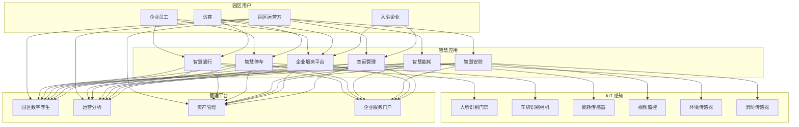
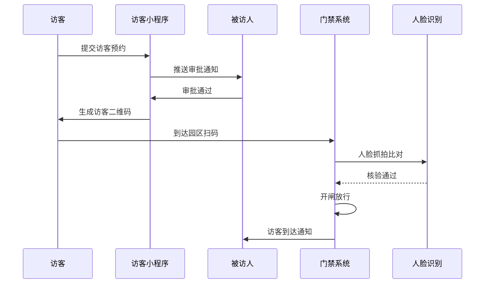
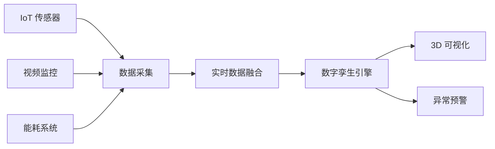

# 智慧园区架构设计 — 阿里云视角

> **适用版本**: [[entities/kubernetes|kubernetes]] v1.29 - v1.33 | **最后更新**: 2026-04-24
> **作者**: 阿里云解决方案架构师 | **标签**: `#智慧园区` `#智能楼宇` `#园区管理` `#阿里云`

---

## 目录

1. [行业背景](#1-行业背景)
2. [业务架构](#2-业务架构)
3. [技术架构](#3-技术架构)
4. [核心数据流](#4-核心数据流)
5. [安全与合规](#5-安全与合规)
6. [可观测性](#6-可观测性)
7. [阿里云组件映射](#7-阿里云组件映射)
8. [生产检查清单](#8-生产检查清单)

---

## 1. 行业背景

### 1.1 业务特点

智慧园区整合园区运营、企业服务、安防管理、能耗优化：

| 挑战 | 说明 | 架构影响 |
|:---|:---|:---|
| 多系统孤岛 | 门禁/停车/能耗/物业独立 | 统一 IoT 平台 |
| 安防要求高 | 人员/车辆/资产安全 | AI 视频分析 |
| 能耗优化 | 碳中和目标驱动 | 智能调控 |
| 企业服务 | 入驻企业多样化需求 | 服务 marketplace |
| 空间管理 | 工位/会议室/厂房利用 | 空间数字化 |

### 1.2 核心场景

- **通行管理**: 人脸/车牌/二维码无感通行
- **智慧停车**: 车位引导/反向寻车/无感支付
- **能耗管理**: 照明/空调/电梯智能调控
- **安防监控**: AI 视频分析/电子巡更/消防联动
- **企业服务**: 报修/缴费/会议室预订/访客预约

---

## 2. 业务架构

### 2.1 智慧园区全景架构



### 2.2 访客通行时序



---

## 3. 技术架构

### 3.1 K8s 部署

```yaml
# 园区 IoT 数据处理 Deployment
apiVersion: apps/v1
kind: Deployment
metadata:
  name: campus-iot-processor
  namespace: smart-campus
spec:
  replicas: 3
  selector:
    matchLabels:
      app: campus-iot-processor
  template:
    metadata:
      labels:
        app: campus-iot-processor
    spec:
      containers:
        - name: processor
          image: registry.cn-hangzhou.aliyuncs.com/campus/iot-processor:v2.0.0
          ports:
            - containerPort: 8080
          env:
            - name: MQTT_BROKER
              value: "mqtt://iot-campus.aliyuncs.com:1883"
            - name: AI_VIDEO_ENDPOINT
              value: "http://ai-video-service:8080"
          resources:
            requests:
              memory: "2Gi"
              cpu: "1000m"
            limits:
              memory: "4Gi"
              cpu: "2000m"
```

```yaml
# 能耗管理 CronJob
apiVersion: batch/v1
kind: CronJob
metadata:
  name: energy-optimization
  namespace: smart-campus
spec:
  schedule: "0 */1 * * *"
  jobTemplate:
    spec:
      template:
        spec:
          containers:
            - name: optimizer
              image: registry.cn-hangzhou.aliyuncs.com/campus/energy-opt:v1.2.0
              env:
                - name: OPTIMIZATION_STRATEGY
                  value: "predictive-hvac"
              resources:
                requests:
                  memory: "1Gi"
                  cpu: "500m"
          restartPolicy: OnFailure
```

---

## 4. 核心数据流

### 4.1 园区数字孪生数据流



---

## 5. 安全与合规

- **人员安全**: 人脸识别隐私合规
- **消防安全**: 消防系统联动
- **数据安全**: 园区数据分级保护

---

## 6. 可观测性

- **设备在线率**: > 98%
- **安防告警**: < 5s 响应
- **能耗降低**: > 15%

---

## 7. 阿里云组件映射

| 功能域 | **阿里云云原生方案** |
|:---|:---|
| 容器平台 | **ACK Pro** |
| IoT | **阿里云 IoT 平台** |
| AI | **视觉智能** |
| 数据库 | **PolarDB + Lindorm** |
| 对象存储 | **OSS** |
| 实时计算 | **Flink** |
| 可观测性 | **ARMS + SLS** |
| 数字孪生 | **DataV** |

---

## 8. 生产检查清单

- [ ] IoT 设备接入覆盖率
- [ ] 人脸识别准确率 > 99%
- [ ] 消防联动响应 < 3s
- [ ] 能耗优化策略验证
- [ ] 访客系统端到端测试

---

**维护者**: 阿里云解决方案架构师团队 | **许可证**: MIT
