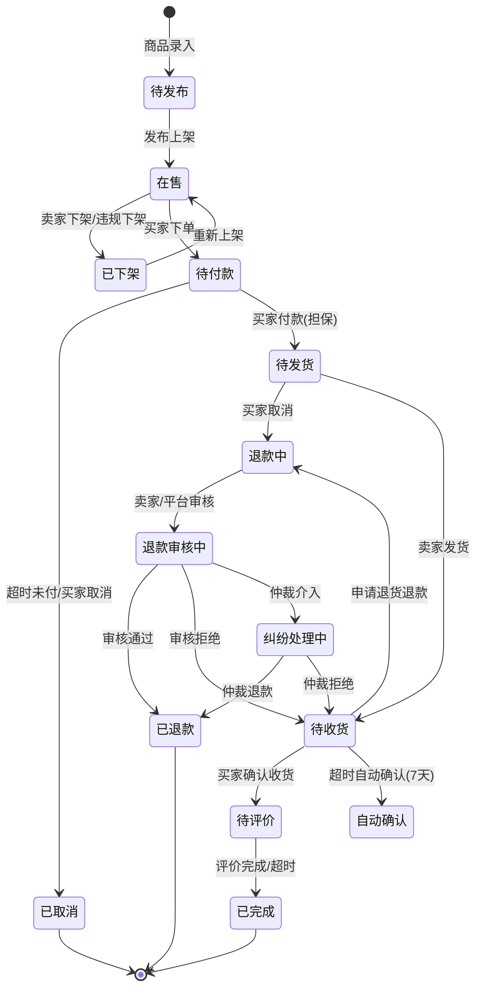
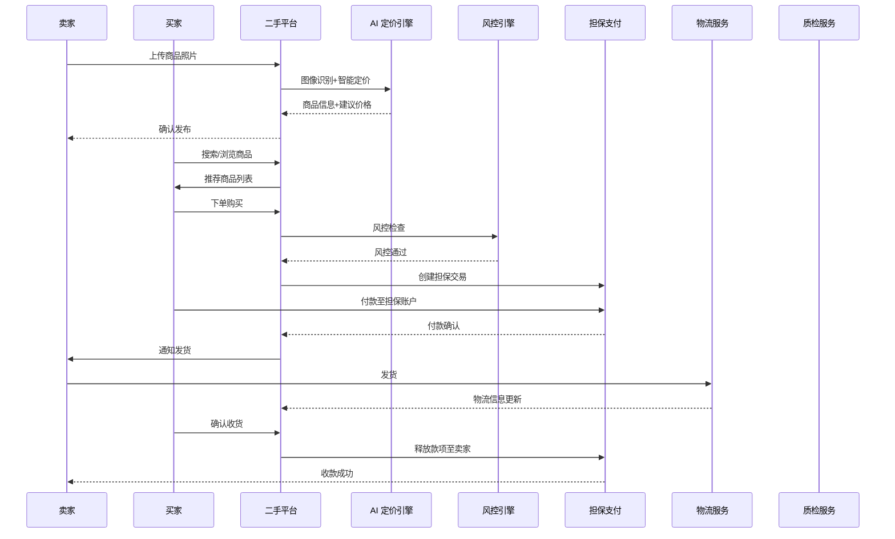
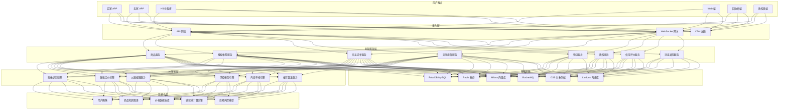
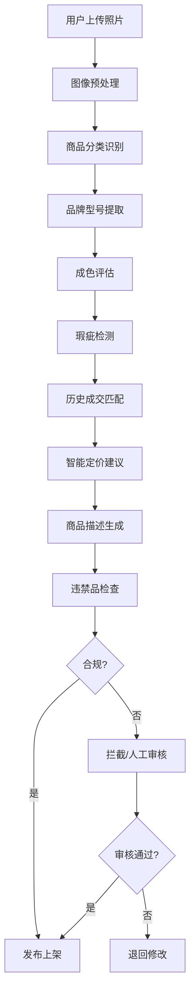
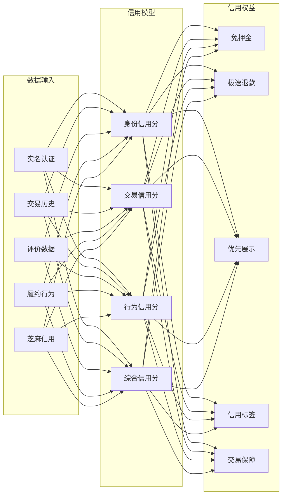
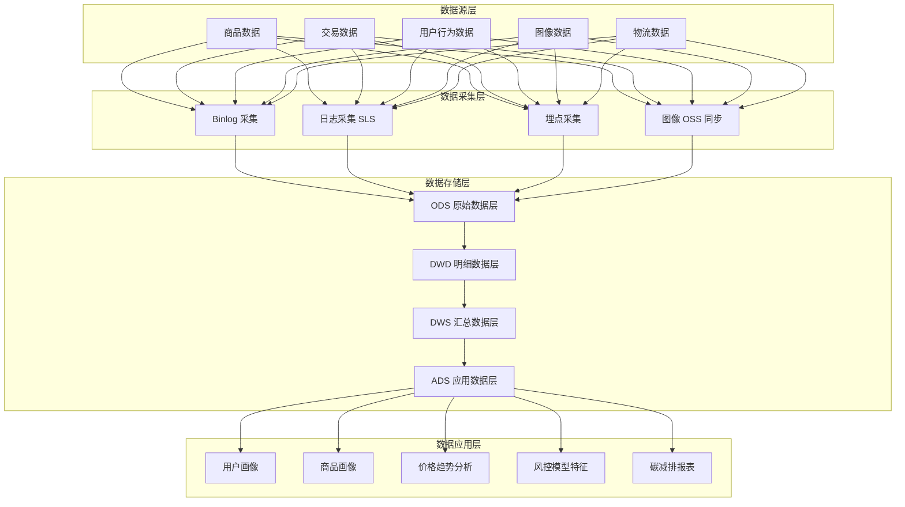
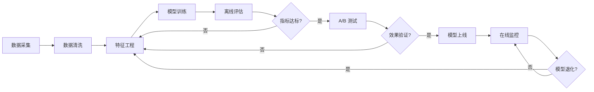
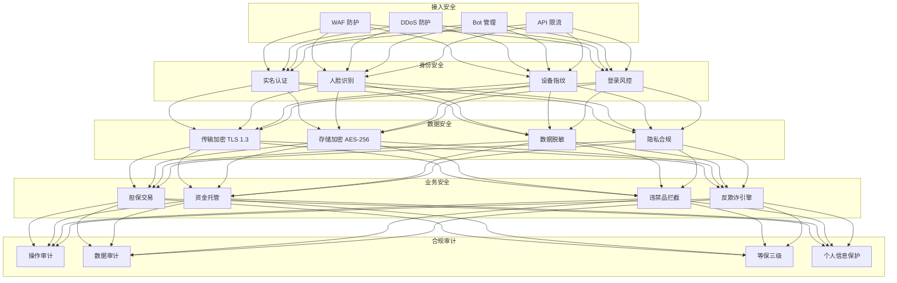

title: 二手交易与循环经济架构设计
description: '# 二手交易与循环经济架构设计 — 阿里云视角'
category: application-architecture
tags:
- k8s
- architecture
- industry
- [[Prometheus|prometheus]]
- redis
- mysql
- hpa
- [[StatefulSet|statefulset]]
- [[Ingress|ingress]]
- networkpolicy
last_updated: 2026-05-18
difficulty: advanced
reading_level: advanced
audience:
- 二手平台架构师
- AI算法工程师
- 风控系统专家
estimated_read_time: 5min
intent_queries:
- 二手交易 Kubernetes C2C平台
- 循环经济 AI智能定价 K8s
- 以图搜图 Milvus Kubernetes
- 二手交易风控 信用体系 K8s
- 碳减排 绿色积分 Kubernetes
trigger_keywords:
- 二手交易
- 循环经济
- C2C
- AI定价
- 以图搜图
- 向量检索
- Milvus
- 碳减排
- 阿里云
related_domains:
- domain-01-cluster-fundamentals
- domain-11-production-operations
- domain-11-ai-infra
related_topics:
- 36-carbon-esg-management
- 01-ecommerce-architecture
- 53-new-retail-dtc
authors:
- name: KUDIG Team
  role: contributor
k8s_versions:
- '1.28'
- '1.29'
- '1.30'
- '1.31'
- '1.32'
---

# 二手交易与循环经济架构设计 — 阿里云视角

> **适用版本**: Kubernetes v1.29 - v1.33 | **最后更新**: 2026-05-18
> **作者**: 阿里云解决方案架构师 | **标签**: `#二手交易` `#循环经济` `#C2C` `#阿里云`

---

<!-- chunk: 目录 -->## 目录

1. [行业概述](#1-行业概述)
2. [业务场景](#2-业务场景)
3. [架构设计](#3-架构设计)
4. [核心技术栈](#4-核心技术栈)
5. [K8s 部署方案](#5-k8s-部署方案)
6. [数据架构](#6-数据架构)
7. [AI/ML 组件](#7-aiml-组件)
8. [安全合规](#8-安全合规)
9. [最佳实践](#9-最佳实践)
10. [反模式](#10-反模式)
11. [参考资源](#11-参考资源)

---

<!-- chunk: 1. 行业概述 -->## 1. 行业概述

## 1.1 行业背景与趋势

二手交易与循环经济是近年来快速增长的赛道。全球二手市场规模预计 2026 年将突破 5000 亿美元，中国二手交易市场年增长率超过 20%。在碳中和战略背景下，循环经济成为国家重点发展方向，二手交易平台作为循环经济的核心基础设施，承载着延长产品生命周期、减少资源浪费、降低碳排放的重要使命。

中国二手交易市场呈现以下特征：移动端为主（超过 90% 交易在移动端完成）、年轻人主导（Z 世代和千禧一代是核心用户群）、品类多元化（从 3C 数码扩展到服饰、奢侈品、图书、家具、汽车等全品类）、信任机制逐步完善（从单纯 C2C 到平台担保交易、官方质检并存）。

## 1.2 核心挑战与架构影响

| 挑战 | 说明 | 架构影响 |
|:---|:---|:---|
| C2C 信任缺失 | 陌生人交易信任建立困难 | 信用体系 + 担保交易 + 实名认证 |
| 商品非标化 | 二手商品状态差异大，描述不一致 | AI 定价 + 图像识别 + 质检标准 |
| 欺诈风险 | 虚假商品、诈骗交易频发 | 风控引擎 + 行为分析 + 实名认证 |
| 搜索匹配难 | 长尾商品检索效率低 | 以图搜图 + 语义匹配 + 向量检索 |
| 交易履约 | 物流、支付、售后流程复杂 | 担保交易 + 物流集成 + 纠纷仲裁 |
| 环保价值量化 | 碳减排量计算与激励 | 绿色积分体系 + 碳足迹追踪 |
| 合规监管 | 未成年人保护、违禁品管控 | 内容审核 + 年龄验证 + 合规引擎 |

## 1.3 市场规模与用户画像

中国主要二手交易平台日活用户超过 5000 万，日均交易量超过 100 万笔。用户群体呈现年轻化趋势，18-35 岁用户占比超过 70%。核心品类交易金额占比：3C 数码（35%）、服饰鞋包（25%）、图书音像（10%）、家居家电（10%）、母婴（8%）、其他（12%）。

---

<!-- chunk: 2. 业务场景 -->## 2. 业务场景

## 2.1 核心业务场景

- **商品发布与智能描述**: 用户上传照片后 AI 自动生成商品描述、分类标签、成色评估、建议售价
- **以图搜图与智能搜索**: 拍照搜索同款商品、相似商品推荐、语义搜索（如"九成新 iPhone 15 Pro Max"）
- **AI 智能定价**: 基于商品图片、品牌型号、成色、历史成交数据智能推荐售价区间
- **信用交易与担保支付**: 平台担保交易、买卖双方信用评分、芝麻信用免押
- **质检与验机服务**: 官方验机中心、视频验货、第三方质检报告
- **回收与以旧换新**: 上门回收、门店回收、以旧换新补贴
- **社区与内容**: 二手好物分享、闲置交换社区、环保达人激励

## 2.2 交易状态机



## 2.3 业务场景交互时序



---

<!-- chunk: 3. 架构设计 -->## 3. 架构设计

## 3.1 系统全景架构



## 3.2 商品发布与 AI 识别流程



## 3.3 信用体系架构



---

<!-- chunk: 4. 核心技术栈 -->## 4. 核心技术栈

## 4.1 技术栈总览

| 层次 | 技术选型 | 说明 |
|:---|:---|:---|
| 前端 | React Native + Flutter | 跨平台移动端 |
| Web 端 | Next.js SSR | SEO 优化 + 首屏加载 |
| API 网关 | Kong / APISIX | 限流、鉴权、路由 |
| 微服务框架 | Spring Cloud Alibaba | 服务注册、配置中心 |
| 消息队列 | RocketMQ | 订单异步处理、延迟消息 |
| 主数据库 | PolarDB MySQL | 事务型数据存储 |
| 缓存 | Redis Cluster | 热点数据、分布式锁 |
| 向量检索 | Milvus | 以图搜图、语义搜索 |
| 对象存储 | OSS + CDN | 图片、视频存储分发 |
| 搜索引擎 | OpenSearch | 全文检索、聚合分析 |
| 实时计算 | Flink | 实时风控、实时推荐 |
| 离线计算 | MaxCompute | 用户画像、数据报表 |
| AI 推理 | PAI + GPU | 图像识别、定价模型 |
| 容器编排 | ACK Pro | K8s 托管集群 |
| 可观测性 | ARMS + SLS | APM、日志、监控 |
| 时序数据库 | Lindorm | 碳减排数据、行为数据 |

## 4.2 核心技术组件关系

| 组件 | 功能 | 关联服务 |
|:---|:---|:---|
| 图像识别引擎 | 商品分类、品牌识别、成色评估 | 商品服务、定价引擎 |
| 向量检索服务 | 以图搜图、相似商品推荐 | 搜索服务、推荐服务 |
| 智能定价引擎 | 基于多维数据的动态定价 | 商品服务、交易服务 |
| 风控引擎 | 欺诈检测、异常行为识别 | 交易服务、支付服务 |
| 内容审核引擎 | 违禁品识别、描述合规检查 | 商品服务、社区服务 |

---

<!-- chunk: 5. K8s 部署方案 -->## 5. K8s 部署方案

## 5.1 图像搜索 GPU 服务

```yaml
apiVersion: apps/v1
kind: Deployment
metadata:
  name: image-search-service
  namespace: secondhand
  labels:
    app: image-search
    tier: ai
spec:
  replicas: 3
  selector:
    matchLabels:
      app: image-search
  strategy:
    rollingUpdate:
      maxSurge: 1
      maxUnavailable: 0
  template:
    metadata:
      labels:
        app: image-search
        tier: ai
      annotations:
        prometheus.io/scrape: "true"
        prometheus.io/port: "9090"
    spec:
      nodeSelector:
        accelerator: nvidia-t4
      runtimeClassName: nvidia
      affinity:
        podAntiAffinity:
          preferredDuringSchedulingIgnoredDuringExecution:
            - weight: 100
              podAffinityTerm:
                labelSelector:
                  matchExpressions:
                    - key: app
                      operator: In
                      values: ["image-search"]
                topologyKey: topology.kubernetes.io/zone
      tolerations:
        - key: nvidia.com/gpu
          operator: Exists
          effect: NoSchedule
      containers:
        - name: search
          image: registry.cn-hangzhou.aliyuncs.com/secondhand/image-search:v2.0.0-gpu
          ports:
            - containerPort: 8080
              name: http
            - containerPort: 9090
              name: metrics
          env:
            - name: VECTOR_DB_URL
              value: "http://milvus-cluster:19530"
            - name: MODEL_PATH
              value: "/models/clip-vit-large-patch14"
            - name: EMBEDDING_DIM
              value: "768"
            - name: TOP_K
              value: "20"
            - name: SEARCH_TIMEOUT_MS
              value: "500"
          resources:
            requests:
              nvidia.com/gpu: 1
              memory: "8Gi"
              cpu: "4000m"
            limits:
              nvidia.com/gpu: 1
              memory: "16Gi"
              cpu: "8000m"
          volumeMounts:
            - name: model-volume
              mountPath: /models
              readOnly: true
          readinessProbe:
            httpGet:
              path: /health
              port: 8080
            initialDelaySeconds: 30
            periodSeconds: 10
          livenessProbe:
            httpGet:
              path: /health
              port: 8080
            initialDelaySeconds: 60
            periodSeconds: 30
      volumes:
        - name: model-volume
          persistentVolumeClaim:
            claimName: ai-model-pvc
---
apiVersion: v1
kind: Service
metadata:
  name: image-search-service
  namespace: secondhand
spec:
  selector:
    app: image-search
  ports:
    - port: 8080
      targetPort: 8080
      name: http
    - port: 9090
      targetPort: 9090
      name: metrics
  type: ClusterIP
```

## 5.2 智能定价引擎

```yaml
apiVersion: apps/v1
kind: Deployment
metadata:
  name: pricing-engine
  namespace: secondhand
  labels:
    app: pricing-engine
    tier: ai
spec:
  replicas: 5
  selector:
    matchLabels:
      app: pricing-engine
  template:
    metadata:
      labels:
        app: pricing-engine
        tier: ai
    spec:
      containers:
        - name: pricing
          image: registry.cn-hangzhou.aliyuncs.com/secondhand/pricing-engine:v3.0.0
          ports:
            - containerPort: 8080
          env:
            - name: DB_URL
              value: "jdbc:mysql://polardb-cluster:3306/secondhand"
            - name: REDIS_URL
              value: "redis://redis-cluster:6379"
            - name: MODEL_FEATURES
              value: "brand,model,condition,age,market_price,seasonality"
            - name: PRICE_RANGE_FACTOR
              value: "0.15"
          resources:
            requests:
              memory: "4Gi"
              cpu: "2000m"
            limits:
              memory: "8Gi"
              cpu: "4000m"
          readinessProbe:
            httpGet:
              path: /actuator/health
              port: 8080
            initialDelaySeconds: 20
            periodSeconds: 10
---
apiVersion: autoscaling/v2
kind: HorizontalPodAutoscaler
metadata:
  name: pricing-engine-hpa
  namespace: secondhand
spec:
  scaleTargetRef:
    apiVersion: apps/v1
    kind: Deployment
    name: pricing-engine
  minReplicas: 5
  maxReplicas: 20
  metrics:
    - type: Resource
      resource:
        name: cpu
        target:
          type: Utilization
          averageUtilization: 70
    - type: Pods
      pods:
        metric:
          name: pricing_requests_per_second
        target:
          type: AverageValue
          averageValue: "100"
```

## 5.3 交易订单服务

```yaml
apiVersion: apps/v1
kind: StatefulSet
metadata:
  name: order-service
  namespace: secondhand
spec:
  serviceName: order-service
  replicas: 5
  selector:
    matchLabels:
      app: order-service
  template:
    metadata:
      labels:
        app: order-service
    spec:
      affinity:
        podAntiAffinity:
          requiredDuringSchedulingIgnoredDuringExecution:
            - labelSelector:
                matchExpressions:
                  - key: app
                    operator: In
                    values: ["order-service"]
              topologyKey: topology.kubernetes.io/zone
      containers:
        - name: order
          image: registry.cn-hangzhou.aliyuncs.com/secondhand/order-service:v4.0.0
          ports:
            - containerPort: 8080
          env:
            - name: DB_URL
              value: "jdbc:mysql://polardb-cluster:3306/secondhand_order"
            - name: ROCKETMQ_NAMESRV
              value: "rocketmq-cluster:9876"
            - name: REDIS_CLUSTER
              value: "redis-cluster:6379"
            - name: ESCROW_PAY_URL
              value: "http://escrow-payment:8080"
            - name: DISTRIBUTED_LOCK_TYPE
              value: "redis"
          resources:
            requests:
              memory: "4Gi"
              cpu: "2000m"
            limits:
              memory: "8Gi"
              cpu: "4000m"
          volumeMounts:
            - name: order-data
              mountPath: /data
  volumeClaimTemplates:
    - metadata:
        name: order-data
      spec:
        accessModes: ["ReadWriteOnce"]
        storageClassName: alicloud-disk-ssd
        resources:
          requests:
            storage: 100Gi
```

## 5.4 风控引擎

```yaml
apiVersion: apps/v1
kind: Deployment
metadata:
  name: risk-control-engine
  namespace: secondhand
  labels:
    app: risk-control
    tier: security
spec:
  replicas: 3
  selector:
    matchLabels:
      app: risk-control
  template:
    metadata:
      labels:
        app: risk-control
        tier: security
    spec:
      containers:
        - name: risk
          image: registry.cn-hangzhou.aliyuncs.com/secondhand/risk-engine:v2.5.0
          ports:
            - containerPort: 8080
          env:
            - name: RULE_ENGINE_TYPE
              value: "drools"
            - name: ML_MODEL_ENDPOINT
              value: "http://risk-ml-model:8080/predict"
            - name: FEATURE_STORE_URL
              value: "redis://redis-cluster:6379"
            - name: ALERT_WEBHOOK
              value: "https://hooks.feishu.cn/xxx"
            - name: RISK_THRESHOLD_HIGH
              value: "0.9"
            - name: RISK_THRESHOLD_MEDIUM
              value: "0.6"
          resources:
            requests:
              memory: "4Gi"
              cpu: "2000m"
            limits:
              memory: "8Gi"
              cpu: "4000m"
```

## 5.5 Namespace 与 ResourceQuota

```yaml
apiVersion: v1
kind: Namespace
metadata:
  name: secondhand
  labels:
    name: secondhand
    environment: production
---
apiVersion: v1
kind: ResourceQuota
metadata:
  name: secondhand-quota
  namespace: secondhand
spec:
  hard:
    requests.cpu: "100"
    requests.memory: 200Gi
    limits.cpu: "200"
    limits.memory: 400Gi
    persistentvolumeclaims: "50"
    services: "30"
    pods: "200"
---
apiVersion: networking.k8s.io/v1
kind: NetworkPolicy
metadata:
  name: secondhand-netpol
  namespace: secondhand
spec:
  podSelector:
    matchLabels:
      tier: security
  policyTypes:
    - Ingress
    - Egress
  ingress:
    - from:
        - podSelector:
            matchLabels:
              tier: backend
      ports:
        - port: 8080
  egress:
    - to:
        - podSelector: {}
```

---

<!-- chunk: 6. 数据架构 -->## 6. 数据架构

## 6.1 数据分层架构



## 6.2 核心数据模型

| 数据域 | 核心实体 | 存储引擎 | 数据量级 | 保留周期 |
|:---|:---|:---|:---|:---|
| 商品 | 商品信息、分类、属性 | PolarDB + OpenSearch | 亿级 | 永久 |
| 交易 | 订单、支付、退款 | PolarDB | 十亿级 | 5 年 |
| 用户 | 用户画像、信用分 | PolarDB + Redis | 亿级 | 永久 |
| 图像 | 商品图片、特征向量 | OSS + Milvus | 百亿级 | 3 年 |
| 行为 | 浏览、搜索、点击 | Lindorm + MaxCompute | 万亿级 | 2 年 |
| 物流 | 运单、轨迹 | PolarDB + Lindorm | 十亿级 | 3 年 |
| 信用 | 信用评分、评价 | PolarDB + Redis | 亿级 | 永久 |

---

<!-- chunk: 7. AI/ML 组件 -->## 7. AI/ML 组件

## 7.1 AI 能力矩阵

| AI 能力 | 模型类型 | 输入 | 输出 | 性能要求 |
|:---|:---|:---|:---|:---|
| 商品分类识别 | ResNet-152 / EfficientNet | 商品图片 | 品类+品牌+型号 | P99 < 200ms |
| 成色评估 | 自研 CV 模型 | 商品图片+描述 | 成色等级(A/B/C/D) | P99 < 500ms |
| 以图搜图 | CLIP + Faiss | 商品图片 | Top-20 相似商品 | P99 < 300ms |
| 智能定价 | XGBoost + DNN | 商品特征+市场数据 | 建议售价区间 | P99 < 100ms |
| 风控模型 | GNN + XGBoost | 用户行为+交易特征 | 风险评分(0-100) | P99 < 50ms |
| 内容审核 | 多模态模型 | 图片+文本 | 合规/违规/待审 | P99 < 300ms |
| 推荐排序 | DeepFM + DIN | 用户画像+商品池 | 排序商品列表 | P99 < 100ms |

## 7.2 AI 模型训练与部署流水线



---

<!-- chunk: 8. 安全合规 -->## 8. 安全合规

## 8.1 安全架构



## 8.2 合规要求矩阵

| 合规项 | 法规依据 | 实施措施 | 验证频率 |
|:---|:---|:---|:---|
| 个人信息保护 | 《个人信息保护法》 | 最小化采集、脱敏存储、知情同意 | 季度审计 |
| 数据出境 | 《数据出境安全评估办法》 | 数据本地化存储 | 年度评估 |
| 电商经营 | 《电子商务法》 | 经营者登记、商品信息合规 | 月度检查 |
| 支付安全 | PCI-DSS | 支付数据加密、隔离存储 | 年度认证 |
| 内容安全 | 《网络安全法》 | AI 审核+人工复核、违禁品管控 | 实时监控 |
| 等保合规 | 等保三级 | 安全域划分、入侵检测、审计日志 | 年度测评 |

---

<!-- chunk: 9. 最佳实践 -->## 9. 最佳实践

## 9.1 架构最佳实践

- **担保交易模式**: 所有资金流转通过平台担保账户，买家确认收货前资金冻结，保障双方权益
- **AI 定价辅助**: 新商品发布时自动推荐价格区间，降低定价门槛，提高成交率
- **向量检索优化**: 使用 CLIP 模型提取图像语义向量，结合 Milvus 实现毫秒级以图搜图
- **多级缓存策略**: 热点商品信息使用 L1 本地缓存 + L2 Redis 集群缓存 + L3 数据库
- **异步化处理**: 订单创建、支付回调、物流更新等非实时操作通过 RocketMQ 异步处理
- **柔性事务**: 跨服务事务采用 Saga 模式，补偿操作保障数据最终一致性
- **碳减排追踪**: 每笔二手交易计算碳减排量，累计用户绿色积分，激励循环消费
- **分级存储**: 热数据 PolarDB、温数据 Lindorm、冷数据 OSS 归档，优化存储成本

## 9.2 性能优化实践

- 商品搜索使用 OpenSearch + 向量检索混合排序，兼顾关键词匹配和语义相似度
- 图片上传使用 OSS 直传 + CDN 分发，减少服务器带宽压力
- 交易高峰期使用 HPA 自动扩容订单服务，低谷期自动缩容
- 数据库读写分离，写请求走主库，读请求走只读副本

---

<!-- chunk: 10. 反模式 -->## 10. 反模式

## 10.1 常见反模式与解决方案

| 反模式 | 问题描述 | 正确做法 |
|:---|:---|:---|
| 无担保直接转账 | 买卖双方直接转账，欺诈风险极高 | 使用平台担保交易，资金在确认收货后释放 |
| 单一文本搜索 | 仅依赖标题关键词搜索，匹配率低 | 结合以图搜图 + 语义搜索 + 向量检索 |
| 人工定价无参考 | 卖家自行定价，价格偏离市场 | AI 智能定价建议，提供市场参考价格 |
| 无信用体系 | 不建立用户信用评价机制 | 多维度信用评分体系，与交易权益挂钩 |
| 图片不压缩 | 高清原图直接加载，加载慢、带宽高 | 多规格缩略图 + WebP 格式 + CDN 加速 |
| 忽略碳减排价值 | 仅关注交易不量化环保价值 | 建立碳减排计算模型，激励循环消费 |
| 风控后置 | 先交易后风控，欺诈已发生 | 交易前实时风控评估，异常交易拦截 |
| 强一致跨服务事务 | 分布式事务锁定资源影响性能 | Saga 柔性事务 + 最终一致性 |

---

<!-- chunk: 11. 参考资源 -->## 11. 参考资源

## 11.1 阿里云组件映射

| 功能域 | 阿里云方案 | 说明 |
|:---|:---|:---|
| 容器平台 | ACK Pro | 托管 K8s 集群，支持 GPU 节点池 |
| AI 图像 | PAI / 视觉智能 | 图像识别、目标检测模型训练与推理 |
| 向量检索 | Milvus on ACK | 商品图像向量检索 |
| 数据库 | PolarDB MySQL | 事务型数据，读写分离 |
| 缓存 | Redis 企业版 | 热点数据缓存、分布式锁 |
| 对象存储 | OSS + CDN | 图片/视频存储与分发 |
| 消息队列 | RocketMQ | 异步消息、延迟消息 |
| 搜索 | OpenSearch | 全文检索、结构化搜索 |
| 实时计算 | Flink | 实时风控、实时推荐 |
| 可观测性 | ARMS + SLS | APM、日志分析、监控告警 |
| 安全 | WAF + 云盾 | Web 防护、DDoS 防护 |
| 区块链 | 蚂蚁链 BaaS | 商品溯源、碳减排存证 |

## 11.2 生产检查清单

- [ ] 图像搜索 P99 延迟 < 500ms
- [ ] 智能定价准确率 > 85%（误差 ±15% 以内）
- [ ] 风控规则欺诈拦截率 > 99%
- [ ] 违禁品识别覆盖率 > 95%
- [ ] 担保交易资金安全审计通过
- [ ] 以图搜图 Top-10 召回率 > 80%
- [ ] 商品推荐 CTR > 8%
- [ ] 订单创建 P99 延迟 < 200ms
- [ ] 等保三级合规测评通过
- [ ] 个人信息保护合规审计通过
- [ ] 容灾演练 RTO < 30min、RPO < 5min

## 11.3 参考文档

- [PolarDB MySQL 产品文档](https://help.aliyun.com/product/60571.html)
- [PAI 机器学习平台](https://help.aliyun.com/product/30347.html)
- [Milvus 向量数据库](https://milvus.io/docs)
- [RocketMQ 消息队列](https://help.aliyun.com/product/29530.html)
- [ARMS 应用实时监控](https://help.aliyun.com/product/66820.html)

---

**维护者**: 阿里云解决方案架构师团队 | **许可证**: MIT

---

<!-- chunk: Obsidian 相关文档 -->## Obsidian 相关文档

- topic-application-architecture MOC
- [[domain-20-application-patterns/topic-application-architecture/README.md|Topic 应用层架构设计最佳实践]]
- [[domain-20-application-patterns/topic-application-architecture/01-ecommerce-architecture.md|电商系统 Kubernetes 生产架构设计]]
- [[domain-20-application-patterns/topic-application-architecture/02-mini-program-architecture.md|小程序平台架构设计]]
- [[domain-20-application-patterns/topic-application-architecture/03-cms-architecture.md|内容管理系统 CMS 架构设计]]
- [[domain-20-application-patterns/topic-application-architecture/04-im-rtc-architecture.md|实时通信 IM/RTC 架构设计]]
- [[domain-20-application-patterns/topic-application-architecture/05-online-education-architecture.md|在线教育平台 Kubernetes 生产架构设计]]
- [[domain-20-application-patterns/topic-application-architecture/06-fintech-architecture.md|金融科技FinTech Kubernetes生产架构设计]]
- [[domain-20-application-patterns/topic-application-architecture/07-iot-platform-architecture.md|物联网 IoT 平台架构设计]]
- [[domain-20-application-patterns/topic-application-architecture/08-ai-ml-inference-architecture.md|AI/ML 推理服务 Kubernetes 生产架构设计]]
- [[domain-20-application-patterns/topic-application-architecture/09-gaming-backend-architecture.md|游戏后端 Kubernetes 生产架构设计]]
- [[domain-20-application-patterns/topic-application-architecture/10-social-media-architecture.md|社交媒体平台Kubernetes生产架构设计]]

## See Also

- 40-cloud-gaming
- 41-beauty-ecommerce
- 43-enterprise-im
- 44-martech-adtech
