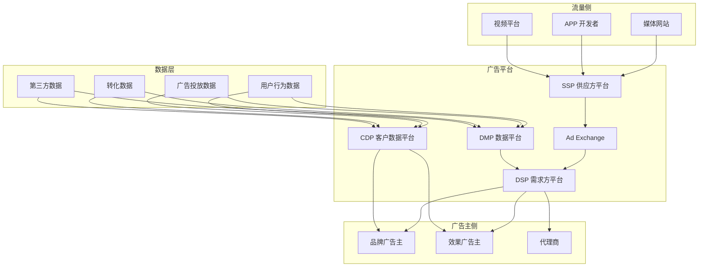
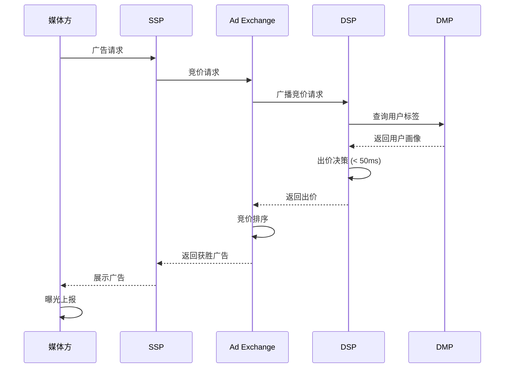
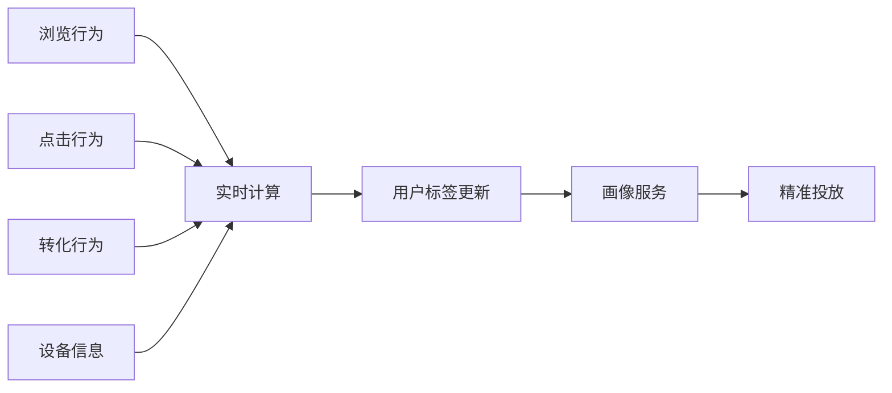

> **生产环境安全提示**
>
> 本文档包含可直接执行的运维命令。执行前请确认：当前目标集群与 Namespace 是否正确；是否具备足够的 RBAC 权限；是否已在非生产环境验证。命令风险等级标注：🔴 高风险（可能造成数据丢失或服务中断）、🟡 中风险（会修改集群状态，但通常可回滚）、🟢 低风险/只读（信息收集，无副作用）。


title: 数字营销与广告科技架构设计
description: '# 数字营销与广告科技架构设计 — 阿里云视角'
category: application-architecture
tags:
- k8s
- architecture
- industry
- redis
last_updated: 2026-05-18
difficulty: advanced
reading_level: advanced
audience:
- 广告科技架构师
- DSP/SSP开发者
- 数字营销工程师
- 广告平台技术负责人
estimated_read_time: 5min
intent_queries:
- martech adtech [[Kubernetes|kubernetes]] architecture
- 程序化广告K8s部署
- DSP SSP广告平台
- RTB实时竞价系统
- 广告大数据平台
trigger_keywords:
- 数字营销
- AdTech
- 程序化广告
- DSP
- SSP
- RTB
- 广告科技
- MarTech
- DMP
- 广告K8s
related_domains:
- domain-01-cluster-fundamentals
- domain-10-troubleshooting-diagnostics
- domain-03-networking-traffic
related_topics:
- social-media-architecture
- livestream-ecommerce
- fintech-architecture
authors:
- name: KUDIG Team
  role: contributor
k8s_versions:
- '1.28'
- '1.29'
- '1.30'
- '1.31'
- '1.32'
---

# 数字营销与广告科技架构设计 — 阿里云视角

> **适用版本**: Kubernetes v1.29 - v1.33 | **最后更新**: 2026-04-24
> **作者**: 阿里云解决方案架构师 | **标签**: `#数字营销` `#AdTech` `#程序化广告` `#阿里云`

---

## 目录

1. [行业背景](#1-行业背景)
2. [业务架构](#2-业务架构)
3. [技术架构](#3-技术架构)
4. [核心数据流](#4-核心数据流)
5. [安全与合规](#5-安全与合规)
6. [可观测性](#6-可观测性)
7. [阿里云组件映射](#7-阿里云组件映射)
8. [生产检查清单](#8-生产检查清单)

---

## 1. 行业背景

### 1.1 业务特点

数字营销与广告科技（MarTech/AdTech）是数据驱动的精准营销：

| 挑战 | 说明 | 架构影响 |
|:---|:---|:---|
| 实时竞价 | RTB 100ms 内完成决策 | 低延迟计算 |
| 数据规模 | PB 级用户行为数据 | 大数据 + 实时计算 |
| 隐私合规 | GDPR/个人信息保护法 | 数据脱敏 + 联邦学习 |
| 反作弊 | 虚假流量识别 | AI 模型 + 规则引擎 |
| 效果归因 | 多渠道转化归因 | 归因模型 + 数据融合 |

### 1.2 核心场景

- **程序化广告**: DSP/SSP/Ad Exchange 实时竞价
- **用户画像**: 全域用户标签体系
- **精准投放**: Lookalike / 重定向 / 兴趣定向
- **效果归因**: 多触点归因模型
- **反作弊**: 流量质量识别与过滤

---

## 2. 业务架构

### 2.1 广告科技全景架构



### 2.2 RTB 实时竞价时序



---

## 3. 技术架构

### 3.1 K8s 部署

```yaml
# RTB 竞价引擎 Deployment
apiVersion: apps/v1
kind: Deployment
metadata:
  name: rtb-engine
  namespace: adtech
spec:
  replicas: 20
  selector:
    matchLabels:
      app: rtb-engine
  template:
    metadata:
      labels:
        app: rtb-engine
    spec:
      nodeSelector:
        latency: ultra-low
      containers:
        - name: rtb
          image: registry.cn-hangzhou.aliyuncs.com/adtech/rtb-engine:v6.0.0
          ports:
            - containerPort: 8080
          env:
            - name: MAX_BID_LATENCY_MS
              value: "50"
            - name: MODEL_CACHE_SIZE
              value: "1000000"
          resources:
            requests:
              memory: "8Gi"
              cpu: "4000m"
            limits:
              memory: "16Gi"
              cpu: "8000m"
```

---

## 4. 核心数据流

### 4.1 用户标签实时计算



---

## 5. 安全与合规

- **隐私合规**: GDPR / 个人信息保护法
- **数据脱敏**: 用户标识匿名化
- **反作弊**: 流量质量实时监控

---

## 6. 可观测性

- **竞价延迟**: P99 < 50ms
- **广告填充率**: > 80%
- **反作弊准确率**: > 95%

---

## 7. 阿里云组件映射

| 功能域 | **阿里云云原生方案** |
|:---|:---|
| 容器平台 | **ACK Pro** |
| 实时计算 | **Flink** |
| 大数据 | **MaxCompute** |
| 缓存 | **Redis 企业版** |
| 数据库 | **PolarDB + Hologres** |
| AI | **PAI** |
| 可观测性 | **ARMS + SLS** |

---

## 8. 生产检查清单

- [ ] RTB 竞价延迟 < 50ms
- [ ] 用户标签实时更新 < 1min
- [ ] 反作弊模型准确率验证
- [ ] 隐私合规数据脱敏验证
- [ ] 广告效果归因准确性

---

**维护者**: 阿里云解决方案架构师团队 | **许可证**: MIT

---

## Obsidian 相关文档

- topic-application-architecture KUDIG Database — Global MOC
- [[domain-20-application-patterns/topic-application-architecture/README.md|[[Topic 应用层架构设计最佳实践|Topic 应用层架构设计最佳实践]]]]
- [[domain-20-application-patterns/topic-application-architecture/01-ecommerce-architecture.md|电商系统 Kubernetes 生产架构设计]]
- [[domain-20-application-patterns/topic-application-architecture/02-mini-program-architecture.md|小程序平台架构设计]]
- [[domain-20-application-patterns/topic-application-architecture/03-cms-architecture.md|内容管理系统 CMS 架构设计]]
- [[domain-20-application-patterns/topic-application-architecture/04-im-rtc-architecture.md|实时通信 IM/RTC 架构设计]]
- [[domain-20-application-patterns/topic-application-architecture/05-online-education-architecture.md|在线教育平台 Kubernetes 生产架构设计]]
- [[domain-20-application-patterns/topic-application-architecture/06-fintech-architecture.md|金融科技FinTech Kubernetes生产架构设计]]
- [[domain-20-application-patterns/topic-application-architecture/07-iot-platform-architecture.md|物联网 IoT 平台架构设计]]
- [[domain-20-application-patterns/topic-application-architecture/08-ai-ml-inference-architecture.md|AI/ML 推理服务 Kubernetes 生产架构设计]]
- [[domain-20-application-patterns/topic-application-architecture/09-gaming-backend-architecture.md|游戏后端 Kubernetes 生产架构设计]]
- [[domain-20-application-patterns/topic-application-architecture/10-social-media-architecture.md|社交媒体平台Kubernetes生产架构设计]]

## See Also

- 42-secondhand-circular
- 43-enterprise-im
- 45-smart-port-shipping
- 46-satellite-internet


<!-- risk-assessed -->
