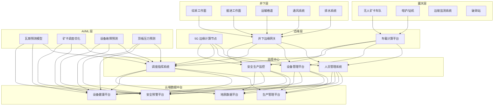
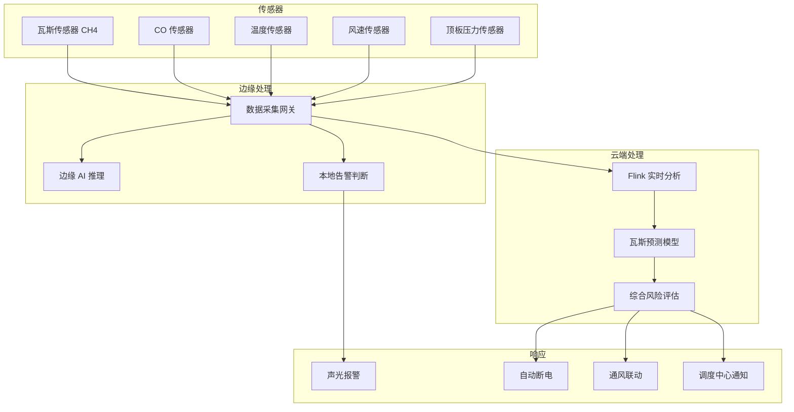

title: 智慧矿山架构设计
description: '# 智慧矿山架构设计 — 阿里云视角'
category: application-architecture
tags:
- k8s
- architecture
- industry
- [[Prometheus|prometheus]]
- opa
- mysql
- [[DaemonSet|daemonset]]
- operator
- nvidia
- rag
last_updated: '2026-05-18'
difficulty: expert
reading_level: expert
audience:
- 矿山智能化架构师
- 采矿工程师
- 5G专网工程师
- 阿里云解决方案架构师
estimated_read_time: 5min
intent_queries:
- 智慧矿山系统架构设计
- 无人矿卡自动驾驶K8s部署
- 矿井瓦斯监测AI预警
- 井下UWB精确定位
- 智慧矿山边缘计算
trigger_keywords:
- 智慧矿山
- 无人矿卡
- 自动驾驶
- 瓦斯监测
- UWB定位
- 5G专网
- 煤矿智能化
- 安全监测
- 边缘计算
- 无人驾驶
related_domains:
- domain-01-cluster-fundamentals
- domain-9-ai-ml
- domain-5-iot-edge-computing
- domain-7-observability
related_topics:
- domain-20-application-patterns/topic-application-architecture/51-smart-manufacturing-mes
- domain-20-application-patterns/topic-application-architecture/60-v2x-autonomous-driving
- domain-20-application-patterns/topic-application-architecture/73-smart-firefighting
- domain-02-workloads-applications/topic-functions/05-iot-edge-computing
authors:
- name: KUDIG Team
  role: contributor
k8s_versions:
- '1.28'
- '1.29'
- '1.30'
- '1.31'
- '1.32'
---

# 智慧矿山架构设计 — 阿里云视角

> **适用版本**: Kubernetes v1.29 - v1.33 | **最后更新**: 2026-04-24
> **作者**: 阿里云解决方案架构师 | **标签**: `#智慧矿山` `#无人矿卡` `#安全监控` `#阿里云`

---

<!-- chunk: 目录 -->## 目录

1. [行业概述](#1-行业概述)
2. [业务场景](#2-业务场景)
3. [架构设计](#3-架构设计)
4. [核心技术栈](#4-核心技术栈)
5. [Kubernetes 部署方案](#5-kubernetes-部署方案)
6. [数据架构](#6-数据架构)
7. [AI/ML 组件](#7-aiml-组件)
8. [安全与合规](#8-安全与合规)
9. [最佳实践](#9-最佳实践)
10. [反模式](#10-反模式)
11. [参考资源](#11-参考资源)

---

<!-- chunk: 1. 行业概述 -->## 1. 行业概述

## 1.1 市场规模与趋势

智慧矿山通过 5G、AI、IoT、自动驾驶等技术实现安全、高效、绿色开采。中国有 4700+ 煤矿和数万座金属矿山，智慧矿山建设市场规模预计从 2024 年的 800 亿元增长到 2030 年的 2500 亿元。政策驱动力包括《关于加快煤矿智能化发展的指导意见》、《非煤矿山安全监管条例》等。无人矿卡、智能综采、AI 安全监测是三大核心方向。

| 指标 | 2024 年 | 2026 年（预测） | 2030 年（预测） |
|:---|:---|:---|:---|
| 中国智慧矿山市场规模 | ¥80B | ¥150B | ¥250B |
| 智能化煤矿覆盖率 | 20% | 40% | 80% |
| 无人矿卡部署数量 | 500+ | 2000+ | 10000+ |
| 瓦斯监测延迟 | 5s | 2s | 0.5s |
| 井下人员定位精度 | 1m | 0.3m | 0.1m |

## 1.2 行业痛点

| 痛点 | 说明 | 数字化转型驱动 |
|:---|:---|:---|
| 安全风险高 | 瓦斯爆炸/透水/塌方/火灾 | AI 实时监测 + 多级预警 |
| 环境恶劣 | 井下高温高湿粉尘 | 工业级设备 + 边缘计算 |
| 网络覆盖难 | 井下/偏远矿区弱网 | 5G 专网 + Mesh + 卫星 |
| 设备分散 | 采掘/运输/通风设备多 | IoT 统一管理平台 |
| 监管严格 | 安全生产法规要求高 | 数据留痕 + 审计追踪 |
| 人才短缺 | 矿工老龄化，年轻人不愿下井 | 自动化 + 远程操控 |

## 1.3 数字化转型架构影响

智慧矿山架构需要覆盖井下层（综采/掘进/运输/通风）、露天层（无人矿卡/电铲/钻机/边坡）、监控中心（安全生产/调度指挥/设备管理/人员管理）和数据中台（地质/设备/安全/生产数据）。核心挑战是井下恶劣环境下的通信和计算，以及安全监测的零容忍。

---

<!-- chunk: 2. 业务场景 -->## 2. 业务场景

## 2.1 露天矿无人驾驶运输

无人矿卡在露天矿区 24 小时自主运行，完成从电铲装车到破碎站卸载的全自动运输。系统需要高精地图、RTK 定位、多传感器融合感知（LiDAR/摄像头/毫米波雷达）、V2X 通信和中央调度。单车日运输量可提升 20%，人工成本降低 70%。

## 2.2 智能综采工作面

采煤机、液压支架、刮板输送机三机协同自动化。根据地质模型自动调整采煤参数，支架自动跟机移架。系统需要综采工作面的全面感知、实时控制和远程监控能力。

## 2.3 AI 安全监测预警

瓦斯浓度、顶板压力、水位、温度、CO 浓度等多参数实时监测。AI 模型分析历史数据和实时趋势，在事故发生前 30 分钟以上发出预警。支持分级告警和自动联动（瓦斯超限自动断电）。

## 2.4 井下人员精确定位

基于 UWB + 5G 融合定位，实现井下人员厘米级精确定位。支持电子考勤、区域管控、紧急撤离引导和人员搜救定位。矿难发生时可快速定位被困人员。

## 2.5 视频 AI 违章识别

在关键区域部署 AI 摄像头，自动识别未佩戴安全帽、违规进入危险区域、设备异常运转等违章行为，实时告警至调度中心。

---

<!-- chunk: 3. 架构设计 -->## 3. 架构设计

## 3.1 智慧矿山全景架构



---

<!-- chunk: 4. 核心技术栈 -->## 4. 核心技术栈

| Component | Purpose | Technology | License |
|:---|:---|:---|:---|
| Container Orchestration | Edge + Cloud management | ACK Edge + ACK Pro | Proprietary |
| 5G Private Network | Underground connectivity | 5G专网 / Mine 5G | Proprietary |
| UWB Positioning | Precision indoor tracking | UWB DW1000 | Proprietary |
| Autonomous Driving | Unmanned truck navigation | Apollo / 自研 | Apache 2.0 / Proprietary |
| IoT Platform | Sensor management | 阿里云 IoT 平台 | Proprietary |
| Edge Computing | On-site AI inference | NVIDIA Jetson / ACK Edge | Proprietary |
| AI Vision | Safety violation detection | PAI + 视觉智能 | Proprietary |
| Time-Series DB | Sensor data storage | Lindorm TSDB | Proprietary |
| Relational DB | Business data | PolarDB MySQL | Proprietary |
| Message Queue | Event streaming | RocketMQ 5.x | Apache 2.0 |
| Object Storage | Video & geological data | OSS | Proprietary |
| Monitoring | Observability | ARMS + SLS | Proprietary |
| GIS | Geological modeling | 阿里云 GIS | Proprietary |

---

<!-- chunk: 5. Kubernetes 部署方案 -->## 5. Kubernetes 部署方案

## 5.1 安全监测边缘 DaemonSet

```yaml
apiVersion: apps/v1
kind: DaemonSet
metadata:
  name: safety-monitor-edge
  namespace: smart-mining
  labels:
    app: safety-monitor-edge
    tier: edge
spec:
  selector:
    matchLabels:
      app: safety-monitor-edge
  updateStrategy:
    rollingUpdate:
      maxUnavailable: 1
  template:
    metadata:
      labels:
        app: safety-monitor-edge
        tier: edge
      annotations:
        prometheus.io/scrape: "true"
        prometheus.io/port: "9090"
    spec:
      hostNetwork: true
      nodeSelector:
        node-type: mining-edge
      tolerations:
        - key: "dedicated"
          operator: "Equal"
          value: "mining"
          effect: "NoSchedule"
        - key: "environment"
          operator: "Equal"
          value: "underground"
          effect: "NoSchedule"
      containers:
        - name: monitor
          image: registry.cn-hangzhou.aliyuncs.com/mining/safety-monitor:v3.0.0
          ports:
            - containerPort: 8080
              name: http
            - containerPort: 9090
              name: metrics
          env:
            - name: MINE_ID
              valueFrom:
                configMapKeyRef:
                  name: mining-config
                  key: mine-id
            - name: GAS_THRESHOLD_PPM
              value: "1000"
            - name: ALERT_MODE
              value: "multi-level"
            - name: LOCAL_CACHE_HOURS
              value: "72"
            - name: CLOUD_SYNC_ENABLED
              value: "true"
          resources:
            requests:
              memory: "1Gi"
              cpu: "1000m"
            limits:
              memory: "2Gi"
              cpu: "2000m"
          readinessProbe:
            httpGet:
              path: /health/ready
              port: 8080
            initialDelaySeconds: 10
            periodSeconds: 5
          livenessProbe:
            httpGet:
              path: /health/live
              port: 8080
            initialDelaySeconds: 20
            periodSeconds: 10
          volumeMounts:
            - name: local-data
              mountPath: /data/local
      volumes:
        - name: local-data
          hostPath:
            path: /opt/mining/data
            type: DirectoryOrCreate
```

## 5.2 矿卡调度服务 Deployment

```yaml
apiVersion: apps/v1
kind: Deployment
metadata:
  name: truck-dispatcher
  namespace: smart-mining
spec:
  replicas: 3
  selector:
    matchLabels:
      app: truck-dispatcher
  template:
    metadata:
      labels:
        app: truck-dispatcher
    spec:
      containers:
        - name: dispatcher
          image: registry.cn-hangzhou.aliyuncs.com/mining/truck-dispatcher:v2.0.0
          ports:
            - containerPort: 8080
          env:
            - name: MAX_TRUCKS
              value: "50"
            - name: OPTIMIZATION_TARGET
              value: "throughput"
            - name: V2X_ENABLED
              value: "true"
          resources:
            requests:
              memory: "4Gi"
              cpu: "2000m"
            limits:
              memory: "8Gi"
              cpu: "4000m"
```

## 5.3 ConfigMap, Service 与 Secret

```yaml
apiVersion: v1
kind: ConfigMap
metadata:
  name: mining-config
  namespace: smart-mining
data:
  mine-id: "MINE-HB-001"
  safety-thresholds: |
    {
      "gas_ch4_ppm": {"warning": 500, "critical": 1000, "action": "power_off"},
      "co_ppm": {"warning": 24, "critical": 50},
      "temperature_c": {"warning": 30, "critical": 35},
      "roof_pressure_mpa": {"warning": 15, "critical": 20},
      "water_level_m": {"warning": 0.5, "critical": 1.0}
    }
  truck-routes: |
    {
      "loading_points": ["shovel-A", "shovel-B", "shovel-C"],
      "dumping_points": ["crusher-N", "crusher-S", "waste-dump"],
      "speed_limit_kmh": 30,
      "min_spacing_m": 50
    }
  evacuation-zones: |
    [
      {"id": "surface-safe-zone", "capacity": 5000},
      {"id": "underground-refuge-A", "capacity": 200}
    ]
---
apiVersion: v1
kind: Service
metadata:
  name: safety-monitor
  namespace: smart-mining
spec:
  selector:
    app: safety-monitor-edge
  ports:
    - name: http
      port: 8080
      targetPort: 8080
  type: ClusterIP
---
apiVersion: v1
kind: Secret
metadata:
  name: mining-secrets
  namespace: smart-mining
type: Opaque
stringData:
  db-connection: "mysql://mining@polardb.mining.rds.aliyuncs.com:3306/mining_db"
  v2x-security-key: "v2x-encryption-key-placeholder"
  video-storage-key: "oss-encryption-key"
```

---

<!-- chunk: 6. 数据架构 -->## 6. 数据架构

## 6.1 瓦斯监测预警数据流



## 6.2 数据流说明

- **安全数据流**: 传感器数据以 1Hz 采集，边缘网关实时判断是否超限，超限立即本地告警并联动
- **定位数据流**: UWB 基站数据经边缘计算后写入 Lindorm，支持人员轨迹回放
- **视频数据流**: AI 摄像头在边缘端推理，违章截图上传 OSS，元数据写入 PolarDB
- **生产数据流**: 产量/效率/成本数据经 Flink 实时汇总，生成生产日报

---

<!-- chunk: 7. AI/ML 组件 -->## 7. AI/ML 组件

## 7.1 核心模型

| 模型 | 用途 | 输入 | 输出 | 框架 |
|:---|:---|:---|:---|:---|
| 瓦斯预测 | 瓦斯浓度趋势预测 | 历史瓦斯/通风/地质数据 | 未来 30min 浓度 | LSTM |
| 矿卡调度优化 | 运输路径和调度优化 | 车辆状态/装载点/道路 | 最优调度方案 | OR-Tools + RL |
| 设备故障预测 | 采掘设备预测性维护 | 振动/温度/电流时序 | 问题概率 + RUL | Transformer |
| 顶板压力预测 | 冲击地压预警 | 应力/微震/声发射 | 冲击危险等级 | XGBoost |
| 违章检测 | 安全违章自动识别 | 视频帧 | 违章类型 + 截图 | YOLOv8 |
| 人员行为分析 | 井下人员异常行为 | 定位轨迹 | 异常行为标记 | LSTM-AE |

---

<!-- chunk: 8. 安全与合规 -->## 8. 安全与合规

## 8.1 行业法规与标准

| 法规/标准 | 适用范围 | 架构要求 |
|:---|:---|:---|
| 煤矿安全规程 | 煤矿安全生产 | 安全监测系统合规 |
| 煤矿智能化建设指南 | 智慧矿山建设标准 | 智能化系统分级 |
| AQ 标准 | 煤矿安全生产行业标准 | 安全监测数据留存 |
| 等保三级 | 工业控制系统安全 | 网络隔离 + 审计 |
| 矿山安全法 | 矿山安全法律要求 | 安全设施三同时 |
| 金属非金属矿山安全规程 | 非煤矿山安全 | 安全监测系统 |

## 8.2 安全架构要点

- **OT/IT 隔离**: 矿山控制网络与办公网络物理隔离
- **本地优先**: 关键安全监测功能在边缘端独立运行，不依赖云端
- **断网可用**: 井下网络中断时边缘系统继续运行，数据本地缓存
- **数据留痕**: 安全监测数据保留 3 个月以上，支持事故调查
- **冗余通信**: 井下 5G + 工业环网 + 卫星多链路冗余

---

<!-- chunk: 9. 最佳实践 -->## 9. 最佳实践

1. **边缘优先架构**: 安全监测和告警在边缘端完成，不依赖云端网络
2. **本地缓存 72 小时**: 边缘设备本地缓存 72 小时数据，断网时不丢失
3. **多级告警联动**: 一级告警本地声光 → 二级告警调度中心 → 三级告警自动断电
4. **5G 专网覆盖**: 井下部署 5G 专网，支持大带宽（视频回传）和低延迟（远程控制）
5. **UWB + 5G 融合定位**: UWB 提供精度，5G 提供覆盖，融合实现全矿井精确定位
6. **瓦斯超限自动断电**: 瓦斯超限时自动切断非本质安全型设备电源
7. **无人矿卡车队管理**: 最小安全间距 50m，V2V 通信防碰撞
8. **定期应急演练**: 每季度全矿井紧急撤离演练，验证系统可靠性
9. **设备预测性维护**: AI 分析设备振动/温度趋势，提前预警问题
10. **数据质量监控**: 持续监控传感器数据质量，失效传感器及时更换

---

<!-- chunk: 10. 反模式 -->## 10. 反模式

1. **安全监测依赖云端**: 所有关键安全判断依赖云端，网络问题时失去预警能力。应边缘端独立运行
2. **单链路通信**: 井下仅有单一通信链路，问题即失联。应多链路冗余
3. **忽视断网场景**: 系统设计不考虑断网情况，数据丢失无法恢复。应本地持久化缓存
4. **传感器维护不足**: 瓦斯传感器校准不及时，数据失真导致漏报。应定期自动校准
5. **过度自动化**: 完全依赖自动化，忽视人的安全意识和应急判断。应人机协同

---

<!-- chunk: 11. 参考资源 -->## 11. 参考资源

- [煤矿智能化建设指南](https://www.nea.gov.cn/)
- [煤矿安全规程](https://www.mem.gov.cn/)
- [5G+智慧矿山白皮书](https://www.imt-2020.cn/)
- [NVIDIA MineSmart](https://www.nvidia.com/en-us/industries/mining/)
- [UWB 定位技术 DW1000](https://www.qorvo.com/products/d/dw1000)
- [阿里云 ACK Edge 文档](https://help.aliyun.com/product/146232.html)
- [阿里云 IoT 平台文档](https://help.aliyun.com/product/30520.html)

---

**维护者**: 阿里云解决方案架构师团队 | **许可证**: MIT

---

<!-- chunk: Obsidian 相关文档 -->## Obsidian 相关文档

- topic-application-architecture MOC
- [[domain-20-application-patterns/topic-application-architecture/README.md|Topic 应用层架构设计最佳实践]]
- [[domain-20-application-patterns/topic-application-architecture/01-ecommerce-architecture.md|电商系统 Kubernetes 生产架构设计]]
- [[domain-20-application-patterns/topic-application-architecture/02-mini-program-architecture.md|小程序平台架构设计]]
- [[domain-20-application-patterns/topic-application-architecture/03-cms-architecture.md|内容管理系统 CMS 架构设计]]
- [[domain-20-application-patterns/topic-application-architecture/04-im-rtc-architecture.md|实时通信 IM/RTC 架构设计]]
- [[domain-20-application-patterns/topic-application-architecture/05-online-education-architecture.md|在线教育平台 Kubernetes 生产架构设计]]
- [[domain-20-application-patterns/topic-application-architecture/06-fintech-architecture.md|金融科技FinTech Kubernetes生产架构设计]]
- [[domain-20-application-patterns/topic-application-architecture/07-iot-platform-architecture.md|物联网 IoT 平台架构设计]]
- [[domain-20-application-patterns/topic-application-architecture/08-ai-ml-inference-architecture.md|AI/ML 推理服务 Kubernetes 生产架构设计]]
- [[domain-20-application-patterns/topic-application-architecture/09-gaming-backend-architecture.md|游戏后端 Kubernetes 生产架构设计]]
- [[domain-20-application-patterns/topic-application-architecture/10-social-media-architecture.md|社交媒体平台Kubernetes生产架构设计]]

## See Also

- 45-smart-port-shipping
- 46-satellite-internet
- 48-vocational-edtech
- 49-livestream-ecommerce
