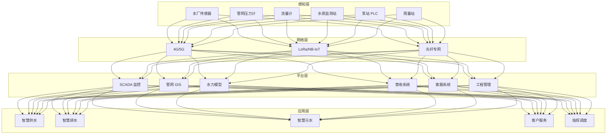
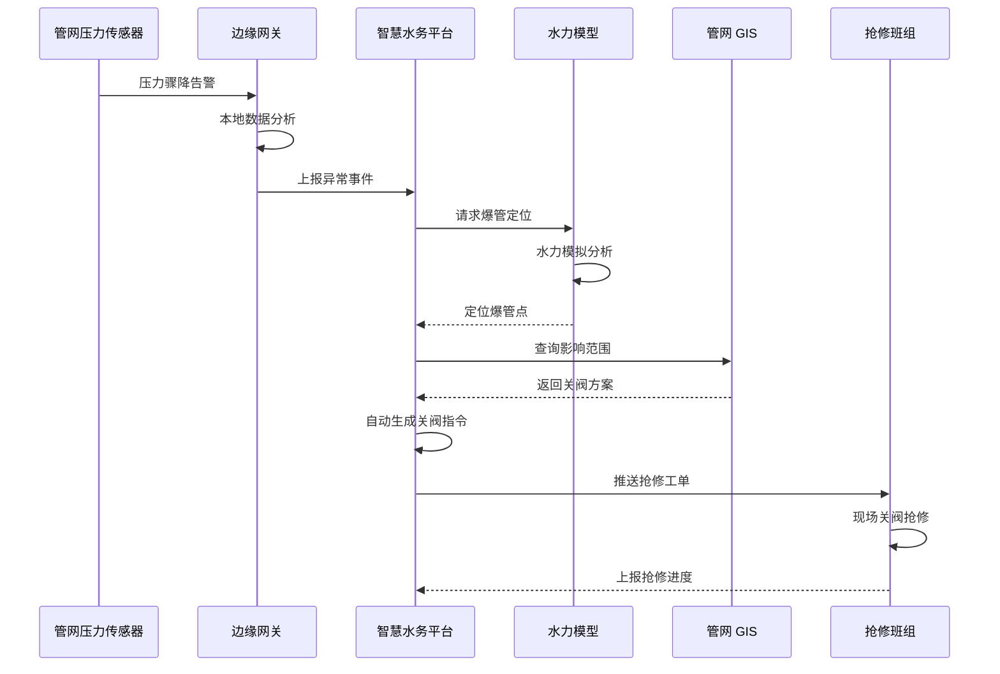
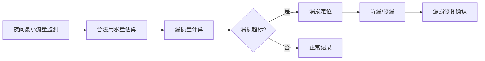

> **生产环境安全提示**
>
> 本文档包含可直接执行的运维命令。执行前请确认：当前目标集群与 Namespace 是否正确；是否具备足够的 RBAC 权限；是否已在非生产环境验证。命令风险等级标注：🔴 高风险（可能造成数据丢失或服务中断）、🟡 中风险（会修改集群状态，但通常可回滚）、🟢 低风险/只读（信息收集，无副作用）。


title: 智慧水务架构设计
description: '# 智慧水务架构设计 — 阿里云视角'
category: application-architecture
tags:
- k8s
- architecture
- industry
- job
- [[CronJob|cronjob]]
last_updated: 2026-05-18
difficulty: intermediate
reading_level: intermediate
audience:
- 水务行业 IT 架构师
- 水务系统开发者
- 智慧城市解决方案工程师
- 阿里云 IoT 解决方案架构师
estimated_read_time: 5min
intent_queries:
- 智慧水务 [[Kubernetes|Kubernetes]] 部署架构
- 水务管网监测 IoT 数据处理
- 爆管预警水力模型计算
- DMA 分区漏损监测
- 智慧水务数字孪生
trigger_keywords:
- 智慧水务
- 智慧供水
- 智慧排水
- 智慧污水
- 水务管网
- 漏损控制
- 爆管预警
- 水质监测
- DMA分区
- 智慧水务平台
related_domains:
- domain-5-edge-computing
- domain-12-observability-comprehensive
- domain-03-networking-traffic
related_topics:
- domain-20-application-patterns/topic-application-architecture/15-energy-power-architecture
- domain-20-application-patterns/topic-application-architecture/72-digital-twin-city
- domain-20-application-patterns/topic-application-architecture/39-smart-campus
authors:
- name: KUDIG Team
  role: contributor
k8s_versions:
- '1.28'
- '1.29'
- '1.30'
- '1.31'
- '1.32'
---

# 智慧水务架构设计 — 阿里云视角

> **适用版本**: Kubernetes v1.29 - v1.33 | **最后更新**: 2026-05-18
> **作者**: 阿里云解决方案架构师 | **标签**: `#智慧水务` `#供水` `#排水` `#阿里云`

---

## 目录

1. [行业背景](#1-行业背景)
2. [业务架构](#2-业务架构)
3. [技术架构](#3-技术架构)
4. [核心数据流](#4-核心数据流)
5. [安全与合规](#5-安全与合规)
6. [可观测性](#6-可观测性)
7. [阿里云组件映射](#7-阿里云组件映射)
8. [生产检查清单](#8-生产检查清单)

---

## 1. 行业背景

### 1.1 业务特点

智慧水务涵盖原水、供水、排水、污水全流程：

| 挑战 | 说明 | 架构影响 |
|:---|:---|:---|
| 管网庞大 | 城市地下管网数十万公里 | GIS + 分区管理 |
| 漏损控制 | 供水漏损率需降至 9% 以下 | 压力监测 + AI 预测 |
| 水质安全 | 从源头到龙头水质保障 | 实时监测 + 预警 |
| 防汛排涝 | 雨季城市内涝风险 | 水位预测 + 泵站调度 |
| 污水治理 | 出水达标排放 | 工艺优化 + 在线监测 |

### 1.2 核心场景

- **智慧供水**: 管网监测/压力调控/漏损控制
- **智慧排水**: 雨污分流/泵站调度/内涝预警
- **智慧污水**: 工艺优化/能耗管理/达标排放
- **客户服务**: 抄表/缴费/报修/水质查询
- **工程管理**: 施工监管/资产台账/养护计划

---

## 2. 业务架构

### 2.1 智慧水务全景架构



### 2.2 爆管预警与关阀时序



---

## 3. 技术架构

### 3.1 K8s 部署

```yaml
# 水力模型计算 Deployment
apiVersion: apps/v1
kind: Deployment
metadata:
  name: hydraulic-model
  namespace: smart-water
spec:
  replicas: 3
  selector:
    matchLabels:
      app: hydraulic-model
  template:
    metadata:
      labels:
        app: hydraulic-model
    spec:
      containers:
        - name: model
          image: registry.cn-hangzhou.aliyuncs.com/water/hydraulic-model:v2.0.0
          ports:
            - containerPort: 8080
          env:
            - name: PIPE_NETWORK_DATA
              value: "/data/pipe-network.json"
            - name: SIMULATION_TIME_STEP
              value: "60"
          resources:
            requests:
              memory: "8Gi"
              cpu: "4000m"
            limits:
              memory: "16Gi"
              cpu: "8000m"
          volumeMounts:
            - name: pipe-data
              mountPath: /data
      volumes:
        - name: pipe-data
          persistentVolumeClaim:
            claimName: pipe-network-pvc
```

```yaml
# 边缘数据采集 CronJob
apiVersion: batch/v1
kind: CronJob
metadata:
  name: water-quality-collection
  namespace: smart-water
spec:
  schedule: "*/5 * * * *"
  jobTemplate:
    spec:
      template:
        spec:
          containers:
            - name: collector
              image: registry.cn-hangzhou.aliyuncs.com/water/quality-collector:v1.0.0
              env:
                - name: MONITOR_STATIONS
                  value: "station-001,station-002,station-003"
              resources:
                requests:
                  memory: "512Mi"
                  cpu: "250m"
          restartPolicy: OnFailure
```

---

## 4. 核心数据流

### 4.1 DMA 分区漏损分析



---

## 5. 安全与合规

- **水质安全**: 饮用水卫生标准合规
- **数据安全**: 关键基础设施保护
- **等保三级**: 水务系统等级保护

---

## 6. 可观测性

- **水质数据**: 实时更新 < 5min
- **管网压力**: 实时监测 < 1min
- **漏损率**: 逐月统计分析

---

## 7. 阿里云组件映射

| 功能域 | **阿里云云原生方案** |
|:---|:---|
| 容器平台 | **ACK Pro** |
| IoT | **阿里云 IoT 平台** |
| 时序数据库 | **Lindorm** |
| 数据库 | **PolarDB** |
| GIS | **阿里云 GIS** |
| AI | **PAI** |
| 可观测性 | **ARMS + SLS** |
| 对象存储 | **OSS** |

---

## 8. 生产检查清单

- [ ] 水质传感器校准验证
- [ ] 管网水力模型准确性
- [ ] 爆管预警准确率 > 85%
- [ ] 泵站自动化控制安全
- [ ] 等保三级合规审计

---

**维护者**: 阿里云解决方案架构师团队 | **许可证**: MIT

---

## Obsidian 相关文档

- topic-application-architecture KUDIG Database — Global MOC
- [[domain-20-application-patterns/topic-application-architecture/README.md|Topic 应用层架构设计最佳实践]]
- [[domain-20-application-patterns/topic-application-architecture/01-ecommerce-architecture.md|电商系统 Kubernetes 生产架构设计]]
- [[domain-20-application-patterns/topic-application-architecture/02-mini-program-architecture.md|小程序平台架构设计]]
- [[domain-20-application-patterns/topic-application-architecture/03-cms-architecture.md|内容管理系统 CMS 架构设计]]
- [[domain-20-application-patterns/topic-application-architecture/04-im-rtc-architecture.md|实时通信 IM/RTC 架构设计]]
- [[domain-20-application-patterns/topic-application-architecture/05-online-education-architecture.md|在线教育平台 Kubernetes 生产架构设计]]
- [[domain-20-application-patterns/topic-application-architecture/06-fintech-architecture.md|金融科技FinTech Kubernetes生产架构设计]]
- [[domain-20-application-patterns/topic-application-architecture/07-iot-platform-architecture.md|物联网 IoT 平台架构设计]]
- [[domain-20-application-patterns/topic-application-architecture/08-ai-ml-inference-architecture.md|AI/ML 推理服务 Kubernetes 生产架构设计]]
- [[domain-20-application-patterns/topic-application-architecture/09-gaming-backend-architecture.md|游戏后端 Kubernetes 生产架构设计]]
- [[domain-20-application-patterns/topic-application-architecture/10-social-media-architecture.md|社交媒体平台Kubernetes生产架构设计]]

## See Also

- 50-unmanned-retail
- 51-smart-manufacturing-mes
- 53-new-retail-dtc
- 54-social-gaming-metaverse

## Related

- topic-application-architecture MOC — Cross-reference


<!-- risk-assessed -->
