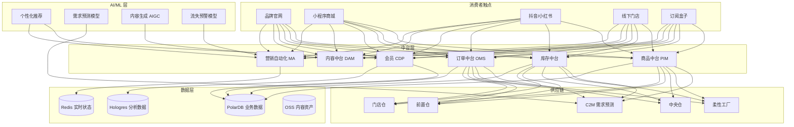
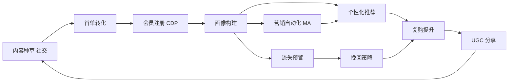

title: 新零售 DTC 架构设计
description: '# 新零售 DTC 架构设计 — 阿里云视角'
category: application-architecture
tags:
- k8s
- architecture
- industry
- [[Prometheus|prometheus]]
- grafana
- opa
- redis
- mysql
- gateway
- llm
last_updated: 2026-05-18
difficulty: advanced
reading_level: advanced
audience:
- 新零售架构师
- 电商平台工程师
- CDP专家
estimated_read_time: 5min
intent_queries:
- DTC 品牌私域 CDP 客户数据平台
- 新零售全渠道库存中台
- 订阅电商履约引擎
- C2M 柔性供应链反向定制
- 阿里云 Hologres 实时分析
trigger_keywords:
- 新零售
- DTC品牌直销
- CDP客户数据平台
- 私域运营
- 全渠道
- 订阅电商
- C2M定制
- 柔性供应链
- 会员体系
- 营销自动化
related_domains:
- domain-03-networking-traffic
- domain-10-troubleshooting-diagnostics
related_topics:
- topic-new-retail-architecture
- topic-ecommerce-architecture
authors:
- name: KUDIG Team
  role: contributor
k8s_versions:
- '1.28'
- '1.29'
- '1.30'
- '1.31'
- '1.32'
---

# 新零售 DTC 架构设计 — 阿里云视角

> **适用版本**: [[Kubernetes|Kubernetes]] v1.29 - v1.33 | **最后更新**: 2026-04-24
> **作者**: 阿里云解决方案架构师 | **标签**: `#新零售` `#DTC` `#品牌直营` `#阿里云`

---

<!-- chunk: 目录 -->## 目录

1. [行业概述](#1-行业概述)
2. [业务场景](#2-业务场景)
3. [架构设计](#3-架构设计)
4. [核心技术栈](#4-核心技术栈)
5. [Kubernetes 部署方案](#5-kubernetes-部署方案)
6. [数据架构](#6-数据架构)
7. [AI/ML 组件](#7-aiml-组件)
8. [安全与合规](#8-安全与合规)
9. [最佳实践](#9-最佳实践)
10. [反模式](#10-反模式)
11. [参考资源](#11-参考资源)

---

<!-- chunk: 1. 行业概述 -->## 1. 行业概述

## 1.1 市场规模与趋势

DTC（Direct-to-Consumer）品牌绕过中间商直接面向消费者，通过自有渠道（官网/小程序/门店）建立品牌关系。全球 DTC 市场规模预计从 2024 年的 5000 亿美元增长到 2030 年的 2 万亿美元。中国新零售 DTC 市场由完美日记、三顿半、泡泡玛特、SHEIN 等品牌引领，核心趋势包括私域运营、CDP 客户数据平台、C2M 反向定制和柔性供应链。

| 指标 | 2024 年 | 2026 年（预测） | 2030 年（预测） |
|:---|:---|:---|:---|
| 全球 DTC 市场规模 | $500B | $900B | $2000B |
| 中国 DTC 品牌数量 | 50000+ | 100000+ | 300000+ |
| CDP 部署率 | 25% | 50% | 80% |
| C2M 定制占比 | 5% | 15% | 35% |
| 订阅制零售占比 | 3% | 8% | 20% |

## 1.2 行业痛点

| 痛点 | 说明 | 数字化转型驱动 |
|:---|:---|:---|
| 全渠道融合 | 官网/小程序/门店/社交电商数据割裂 | 统一商品/库存/会员中台 |
| 私域运营 | 用户数据自主掌控和深度运营 | CDP + 营销自动化 |
| 快速迭代 | 小单快反柔性供应链需求 | 数据中台驱动 C2M |
| 内容营销 | 品牌故事/UGC/KOL 内容管理 | 内容中台 + AIGC |
| 订阅模式 | 周期性配送服务管理复杂 | 订阅引擎 + 智能履约 |

## 1.3 数字化转型架构影响

DTC 架构需要覆盖消费者触点（官网/小程序/社交/门店/订阅）、中台层（商品/库存/订单/会员CDP/内容/营销自动化）、供应链（C2M定制/柔性工厂/仓储网络）和数据分析层。核心挑战是全渠道数据统一和实时个性化体验。

---

<!-- chunk: 2. 业务场景 -->## 2. 业务场景

## 2.1 品牌独立站商城

建设品牌自有官网商城，支持商品展示、购物车、支付、订单跟踪全流程。需要与 Shopify/WooCommerce 等平台差异化，提供更深度的品牌定制能力和数据自主权。性能目标 P99 < 1s，大促期间支持 10 倍流量峰值。

## 2.2 私域 CDP 客户数据平台

汇聚全渠道用户数据（官网浏览/小程序行为/门店消费/社交互动），构建统一用户画像。支持人群圈选、个性化推荐、营销自动化和效果归因。CDP 是 DTC 品牌的核心数据资产。

## 2.3 会员订阅服务

周期性商品订阅（如咖啡/美妆/零食订阅盒子），支持灵活的订阅计划管理（月度/季度/年度）、自动续费、暂停恢复、地址变更和赠礼功能。订阅引擎需要精确的配送日期计算和库存预留。

## 2.4 智慧门店数字化

线下门店的数字化升级，包括智能导购（导购 APP + 顾客画像）、扫码购、电子价签、智能试衣间和门店 O2O（线上下单门店自提/配送）。门店库存与线上库存实时同步。

## 2.5 C2M 柔性供应链

基于消费者需求数据驱动产品开发和生产。通过预售/众筹模式测试市场反应，根据实际订单安排生产，减少库存积压。柔性工厂支持小批量多品种快速切换。

---

<!-- chunk: 3. 架构设计 -->## 3. 架构设计

## 3.1 DTC 品牌全景架构



---

<!-- chunk: 4. 核心技术栈 -->## 4. 核心技术栈

| Component | Purpose | Technology | License |
|:---|:---|:---|:---|
| Container Orchestration | Platform management | ACK Pro | Proprietary |
| Frontend Framework | Brand website | Next.js 14 / Nuxt 3 | MIT |
| CDN | Global content delivery | Aliyun CDN + DCDN | Proprietary |
| Relational DB | Business data | PolarDB MySQL | Proprietary |
| Cache | Session & hot data | Redis Enterprise | Proprietary |
| Search Engine | Product search | OpenSearch | Apache 2.0 |
| CDP | Customer data platform | 阿里云 CDP / 自研 | Proprietary |
| Message Queue | Event-driven | RocketMQ 5.x | Apache 2.0 |
| Object Storage | Assets & media | OSS + CDN | Proprietary |
| AI Platform | Personalization | PAI / PyTorch | Proprietary / BSD |
| Analytics | Real-time analytics | Hologres | Proprietary |
| Subscription Engine | Recurring billing | 自研 / Stripe Billing | Proprietary |
| Monitoring | Observability | ARMS + SLS + Grafana | Proprietary / Apache 2.0 |

---

<!-- chunk: 5. Kubernetes 部署方案 -->## 5. Kubernetes 部署方案

## 5.1 DTC 官网 Deployment

```yaml
apiVersion: apps/v1
kind: Deployment
metadata:
  name: dtc-frontend
  namespace: new-retail-dtc
  labels:
    app: dtc-frontend
    tier: web
spec:
  replicas: 6
  selector:
    matchLabels:
      app: dtc-frontend
  strategy:
    rollingUpdate:
      maxSurge: 2
      maxUnavailable: 1
  template:
    metadata:
      labels:
        app: dtc-frontend
        tier: web
      annotations:
        prometheus.io/scrape: "true"
        prometheus.io/port: "9090"
    spec:
      containers:
        - name: nextjs
          image: registry.cn-hangzhou.aliyuncs.com/dtc/frontend:v3.0.0
          ports:
            - containerPort: 3000
              name: http
            - containerPort: 9090
              name: metrics
          env:
            - name: CDN_DOMAIN
              value: "https://cdn.brand.com"
            - name: API_URL
              value: "https://api.brand.com"
            - name: NEXT_PUBLIC_GA_ID
              value: "G-XXXXXXXXXX"
            - name: REDIS_URL
              valueFrom:
                secretKeyRef:
                  name: dtc-secrets
                  key: redis-url
          resources:
            requests:
              memory: "1Gi"
              cpu: "500m"
            limits:
              memory: "2Gi"
              cpu: "1000m"
          readinessProbe:
            httpGet:
              path: /api/health
              port: 3000
            initialDelaySeconds: 10
            periodSeconds: 5
          livenessProbe:
            httpGet:
              path: /api/health
              port: 3000
            initialDelaySeconds: 20
            periodSeconds: 10
```

## 5.2 订阅引擎 Deployment

```yaml
apiVersion: apps/v1
kind: Deployment
metadata:
  name: subscription-engine
  namespace: new-retail-dtc
spec:
  replicas: 3
  selector:
    matchLabels:
      app: subscription-engine
  template:
    metadata:
      labels:
        app: subscription-engine
    spec:
      containers:
        - name: engine
          image: registry.cn-hangzhou.aliyuncs.com/dtc/subscription:v2.0.0
          ports:
            - containerPort: 8080
          env:
            - name: TIMEZONE
              value: "Asia/Shanghai"
            - name: MAX_RETRIES
              value: "3"
            - name: INVENTORY_RESERVE_HOURS
              value: "48"
          resources:
            requests:
              memory: "2Gi"
              cpu: "1000m"
            limits:
              memory: "4Gi"
              cpu: "2000m"
```

## 5.3 ConfigMap, Service 与 Secret

```yaml
apiVersion: v1
kind: ConfigMap
metadata:
  name: dtc-config
  namespace: new-retail-dtc
data:
  cdn-domains: |
    {
      "assets": "https://cdn.brand.com/assets",
      "images": "https://img.brand.com",
      "videos": "https://video.brand.com"
    }
  subscription-plans: |
    [
      {"id": "monthly", "name": "月度订阅", "interval": "month", "discount": 0.10},
      {"id": "quarterly", "name": "季度订阅", "interval": "3months", "discount": 0.15},
      {"id": "annual", "name": "年度订阅", "interval": "year", "discount": 0.25}
    ]
  recommendation-config: |
    {
      "model": "collaborative_filtering_v3",
      "max_items": 20,
      "diversity_factor": 0.3,
      "cold_start_fallback": "trending"
    }
---
apiVersion: v1
kind: Service
metadata:
  name: dtc-frontend
  namespace: new-retail-dtc
spec:
  selector:
    app: dtc-frontend
  ports:
    - name: http
      port: 3000
      targetPort: 3000
  type: ClusterIP
---
apiVersion: v1
kind: Secret
metadata:
  name: dtc-secrets
  namespace: new-retail-dtc
type: Opaque
stringData:
  redis-url: "redis://:password@redis-dtc.rds.aliyuncs.com:6379/0"
  db-connection: "mysql://dtc@polardb.dtc.rds.aliyuncs.com:3306/dtc_db"
  payment-api-key: "payment-gateway-key-placeholder"
  oss-access-key: "oss-key-placeholder"
  oss-secret-key: "oss-secret-placeholder"
```

---

<!-- chunk: 6. 数据架构 -->## 6. 数据架构

## 6.1 用户旅程数据闭环



## 6.2 数据流说明

- **行为数据流**: 用户在官网/小程序的行为数据实时采集至 CDP，构建实时画像
- **订单数据流**: 全渠道订单统一进入 OMS，驱动库存扣减和物流发货
- **库存同步流**: 门店仓/前置仓/中央仓库存实时同步至所有销售渠道
- **营销自动化流**: CDP 画像触发营销自动化规则，个性化推送至用户

---

<!-- chunk: 7. AI/ML 组件 -->## 7. AI/ML 组件

## 7.1 核心模型

| 模型 | 用途 | 输入 | 输出 | 框架 |
|:---|:---|:---|:---|---|
| 个性化推荐 | 商品推荐 | 用户行为/画像/上下文 | 推荐商品列表 | Two-Tower + DIN |
| 需求预测 | 销量预测与补货 | 历史销量/促销/季节 | 未来 30 天销量 | Prophet + LSTM |
| 流失预警 | 用户流失预测 | 行为频率/购买间隔 | 流失概率 | XGBoost |
| 内容生成 AIGC | 营销文案/图片生成 | 产品描述/风格 | 营销文案/图片 | LLM + Diffusion |
| 价格优化 | 动态定价 | 成本/竞品/需求弹性 | 最优定价 | RL |
| 尺码推荐 | 服装尺码推荐 | 身高体重/历史购买 | 推荐尺码 | ML Classifier |

---

<!-- chunk: 8. 安全与合规 -->## 8. 安全与合规

## 8.1 行业法规与标准

| 法规/标准 | 适用范围 | 架构要求 |
|:---|:---|:---|
| GDPR | 欧洲用户数据保护 | 数据同意 + 删除权 |
| 个人信息保护法 | 中国个人信息保护 | 数据最小化 + 用户授权 |
| PCI-DSS | 支付数据安全 | 支付信息令牌化 |
| 网络安全法 | 电商系统安全 | 等保合规 + 数据保护 |
| 广告法 | 营销内容合规 | 内容审核系统 |
| 跨境电商法规 | 跨境 DTC 合规 | 数据本地化 + 海关合规 |

## 8.2 安全架构要点

- **数据自主**: 用户数据存储在自有数据库，不依赖第三方平台
- **支付安全**: 支付信息通过令牌化处理，PCI-DSS 合规
- **隐私保护**: 用户行为数据采集需明确授权，支持数据删除
- **CDN 防护**: DDoS 防护 + WAF 保护品牌官网

---

<!-- chunk: 9. 最佳实践 -->## 9. 最佳实践

1. **CDP 作为核心资产**: 投资建设 CDP 客户数据平台，统一全渠道用户数据
2. **全渠道库存一盘棋**: 线上线下库存实时同步，支持门店发货和线上退换
3. **内容中台 AIGC**: 使用 AIGC 批量生成营销文案和图片，降低内容成本
4. **订阅引擎灵活配置**: 支持多种订阅计划、灵活的暂停恢复和赠礼功能
5. **C2M 需求驱动**: 通过预售/众筹验证需求，柔性生产减少库存
6. **私域社群运营**: 建立品牌社群（微信群/企业微信），提升用户粘性
7. **实时个性化**: 基于实时行为数据的个性化推荐和营销触发
8. **全链路归因**: 从种草到购买的完整归因分析，优化营销 ROI
9. **CDN 全球加速**: 跨境 DTC 使用全球 CDN 加速官网访问
10. **A/B 测试常态化**: 页面/推荐/营销策略持续 A/B 测试优化

---

<!-- chunk: 10. 反模式 -->## 10. 反模式

1. **依赖第三方平台**: 所有销售依赖天猫/亚马逊，数据不自主。应建设自有渠道
2. **数据孤岛**: 各渠道数据不通，无法构建统一画像。应通过 CDP 统一
3. **忽视订阅模式**: 仅关注单次销售，忽视 LTV 提升。应发展订阅制
4. **过度折扣**: 频繁打折伤害品牌价值。应通过个性化推荐提升复购而非折扣
5. **忽视内容建设**: 不投入内容营销，品牌认知度低。应建设内容中台

---

<!-- chunk: 11. 参考资源 -->## 11. 参考资源

- [Shopify DTC 报告](https://www.shopify.com/research)
- [阿里云 CDP 文档](https://help.aliyun.com/product/ Clay.html)
- [Next.js 官方文档](https://nextjs.org/docs)
- [阿里云 CDN 文档](https://help.aliyun.com/product/270996.html)
- [OpenSearch 文档](https://opensearch.org/docs/)

---

**维护者**: 阿里云解决方案架构师团队 | **许可证**: MIT

---

<!-- chunk: Obsidian 相关文档 -->## Obsidian 相关文档

- topic-application-architecture MOC
- [[domain-20-application-patterns/topic-application-architecture/README.md|Topic 应用层架构设计最佳实践]]
- [[domain-20-application-patterns/topic-application-architecture/01-ecommerce-architecture.md|电商系统 Kubernetes 生产架构设计]]
- [[domain-20-application-patterns/topic-application-architecture/02-mini-program-architecture.md|小程序平台架构设计]]
- [[domain-20-application-patterns/topic-application-architecture/03-cms-architecture.md|内容管理系统 CMS 架构设计]]
- [[domain-20-application-patterns/topic-application-architecture/04-im-rtc-architecture.md|实时通信 IM/RTC 架构设计]]
- [[domain-20-application-patterns/topic-application-architecture/05-online-education-architecture.md|在线教育平台 Kubernetes 生产架构设计]]
- [[domain-20-application-patterns/topic-application-architecture/06-fintech-architecture.md|金融科技FinTech Kubernetes生产架构设计]]
- [[domain-20-application-patterns/topic-application-architecture/07-iot-platform-architecture.md|物联网 IoT 平台架构设计]]
- [[domain-20-application-patterns/topic-application-architecture/08-ai-ml-inference-architecture.md|AI/ML 推理服务 Kubernetes 生产架构设计]]
- [[domain-20-application-patterns/topic-application-architecture/09-gaming-backend-architecture.md|游戏后端 Kubernetes 生产架构设计]]
- [[domain-20-application-patterns/topic-application-architecture/10-social-media-architecture.md|社交媒体平台Kubernetes生产架构设计]]

## See Also

- 51-smart-manufacturing-mes
- 52-smart-water
- 54-social-gaming-metaverse
- 55-crossborder-dtc

## Related

- topic-application-architecture MOC — Cross-reference
