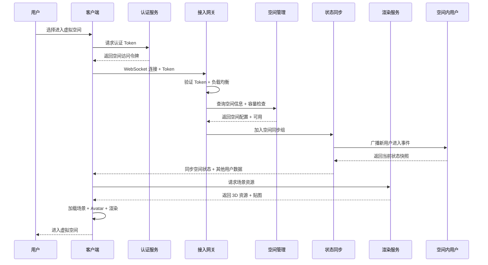
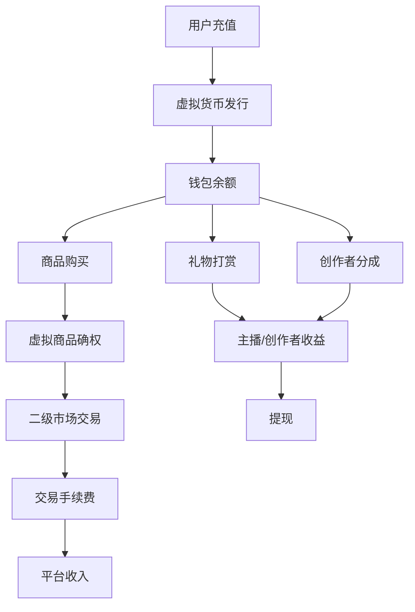
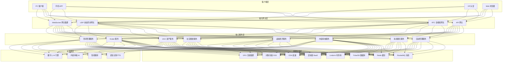
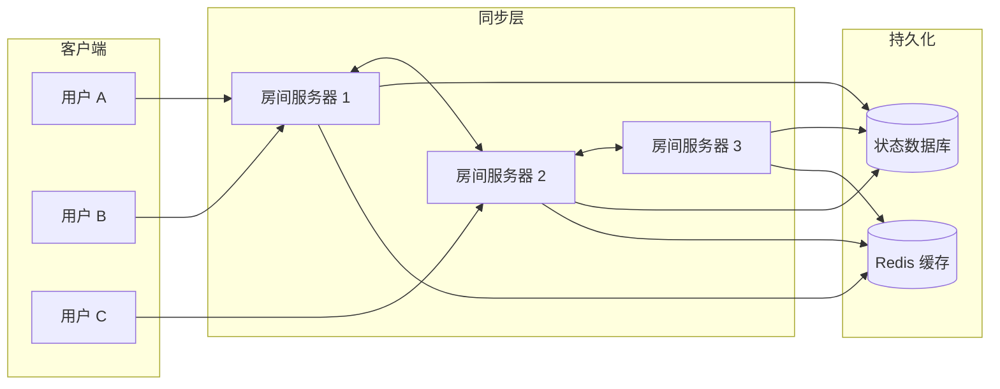
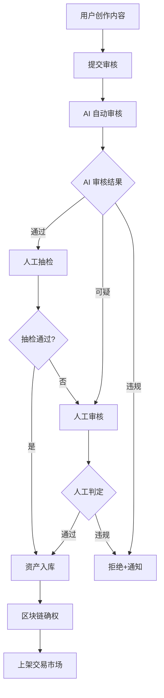
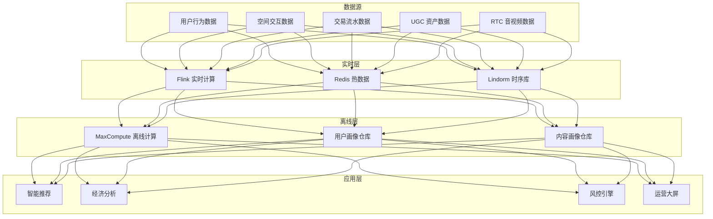
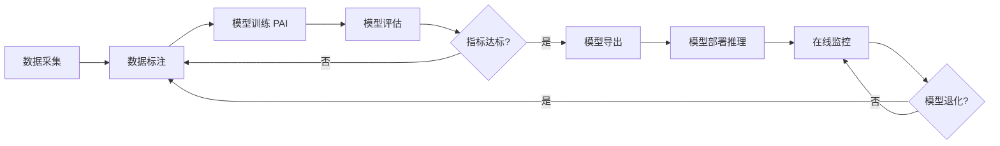
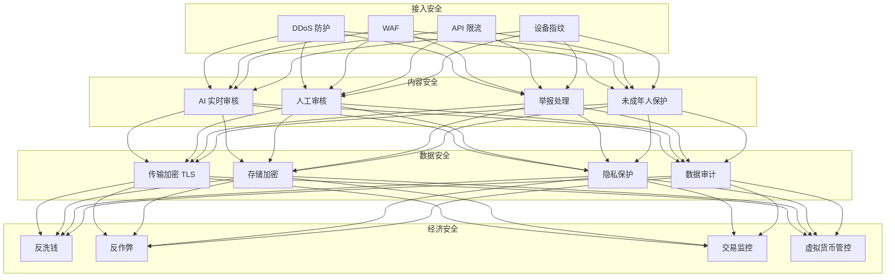

# 社交游戏与元宇宙社交架构设计 — 阿里云视角

> **适用版本**: Kubernetes v1.29 - v1.33 | **最后更新**: 2026-05-18
> **作者**: 阿里云解决方案架构师 | **标签**: `#社交游戏` `#元宇宙` `#虚拟社交` `#阿里云`

---

## 目录

1. [行业概述](#1-行业概述)
2. [业务场景](#2-业务场景)
3. [架构设计](#3-架构设计)
4. [核心技术栈](#4-核心技术栈)
5. [K8s 部署方案](#5-k8s-部署方案)
6. [数据架构](#6-数据架构)
7. [AI/ML 组件](#7-aiml-组件)
8. [安全合规](#8-安全合规)
9. [最佳实践](#9-最佳实践)
10. [反模式](#10-反模式)
11. [参考资源](#11-参考资源)

---

## 1. 行业概述

### 1.1 行业背景与趋势

社交游戏与元宇宙社交是数字经济中最具创新性和增长潜力的领域。全球元宇宙社交市场规模预计 2026 年将超过 1000 亿美元，年复合增长率超过 30%。中国社交游戏用户规模超过 6 亿，元宇宙社交正处于从概念探索到商业化落地的关键阶段。

元宇宙社交融合了游戏化互动、虚拟身份、数字资产和社交关系链，创造了一种全新的在线社交体验。核心特征包括：沉浸式 3D 环境、实时多用户交互、用户生成内容（UGC）生态、虚拟经济系统、跨平台互通。技术驱动因素包括 GPU 云渲染、5G 低延迟通信、AI 数字人、区块链数字资产确权等。

### 1.2 核心挑战与架构影响

| 挑战 | 说明 | 架构影响 |
|:---|:---|:---|
| 实时状态同步 | 虚拟空间中用户位置/动作实时同步 | 状态同步服务器 + UDP 协议优化 |
| 万人同屏 | 大型虚拟活动高并发场景 | 空间分区 + 兴趣管理 + LOD |
| UGC 内容生态 | 用户创作虚拟内容的安全与存储 | 内容审核 + 资产存储 + 版权管理 |
| 跨平台渲染 | PC/VR/手机多端一致性体验 | 云渲染 + 多端适配 + 渐进式加载 |
| 虚拟经济系统 | 虚拟货币发行、流通、防通胀 | 经济模型 + 交易系统 + 区块链确权 |
| 音视频交互 | 语音/表情/动作实时传输 | RTC + 动作捕捉 + 表情驱动 |
| 内容安全 | UGC 内容合规与未成年人保护 | AI 审核 + 实时监管 + 分级制度 |

### 1.3 市场格局

全球主要玩家包括 Meta Horizon、Roblox、Fortnite、Rec Room 等。中国市场以虚拟社交 APP、元宇宙游戏、虚拟演唱会等形态为主，核心用户群体为 Z 世代（15-28 岁），月均付费用户占比约 15%，ARPU 值约 50-200 元。

---

## 2. 业务场景

### 2.1 核心业务场景

- **虚拟空间管理**: 3D 虚拟世界/房间/场景的创建、管理和持久化
- **虚拟形象系统**: Avatar 创建、定制装扮、表情动作驱动
- **社交互动**: 语音聊天、文字消息、动作表情、礼物打赏
- **UGC 创作**: 虚拟建筑/道具/服装/场景的创作与交易
- **虚拟经济**: 虚拟货币、虚拟商品、交易市场、创作者分成
- **虚拟活动**: 演唱会、展览、发布会、社交派对
- **数字人服务**: AI 驱动的虚拟客服、虚拟主播、NPC

### 2.2 虚拟空间进入流程



### 2.3 虚拟经济系统



---

## 3. 架构设计

### 3.1 系统全景架构



### 3.2 状态同步架构



### 3.3 UGC 内容管理流程



---

## 4. 核心技术栈

### 4.1 技术栈总览

| 层次 | 技术选型 | 说明 |
|:---|:---|:---|
| 客户端引擎 | Unity / Unreal Engine | 3D 渲染引擎 |
| 移动端 | Flutter + Unity 集成 | 跨平台移动开发 |
| Web 端 | Three.js + WebXR | 浏览器 3D 渲染 |
| 状态同步 | 自研同步框架 | 确定性同步 + 客户端预测 |
| API 网关 | APISIX | 路由、限流、鉴权 |
| 微服务 | Spring Cloud Alibaba | 服务治理 |
| 消息队列 | RocketMQ | 异步消息 |
| 主数据库 | PolarDB MySQL | 核心业务数据 |
| 缓存 | Redis Cluster | 热点数据 + 会话状态 |
| 时序数据库 | Lindorm | 用户行为、在线状态 |
| 对象存储 | OSS + CDN | 3D 模型、贴图、音视频 |
| RTC | 阿里云 RTC | 语音、视频通话 |
| GPU 渲染 | GN7/GN10 实例 | 云渲染服务 |
| AI | PAI + 视觉智能 | 内容审核、数字人 |
| 区块链 | 蚂蚁链 BaaS | 虚拟资产确权 |
| 搜索 | OpenSearch | UGC 内容搜索 |
| 容器编排 | ACK Pro + GPU | K8s 托管集群 |
| 可观测性 | ARMS + SLS | 全链路监控 |

### 4.2 渲染策略对比

| 策略 | 适用场景 | 延迟 | 服务端负载 | 客户端要求 |
|:---|:---|:---|:---|:---|
| 客户端渲染 | PC/手机中等画质 | 低 | 低 | 中高 |
| 云渲染 | VR 头显、低配设备 | 中高 | 高 | 低 |
| 混合渲染 | 跨平台一致性 | 中 | 中 | 中 |
| 边缘渲染 | 局域网场景 | 低 | 中 | 中低 |

---

## 5. K8s 部署方案

### 5.1 状态同步服务

```yaml
apiVersion: apps/v1
kind: StatefulSet
metadata:
  name: state-sync-server
  namespace: social-gaming
  labels:
    app: state-sync-server
    tier: core
spec:
  serviceName: state-sync-server
  replicas: 10
  selector:
    matchLabels:
      app: state-sync-server
  podManagementPolicy: Parallel
  template:
    metadata:
      labels:
        app: state-sync-server
        tier: core
      annotations:
        prometheus.io/scrape: "true"
        prometheus.io/port: "9090"
    spec:
      hostNetwork: true
      affinity:
        podAntiAffinity:
          requiredDuringSchedulingIgnoredDuringExecution:
            - labelSelector:
                matchExpressions:
                  - key: app
                    operator: In
                    values: ["state-sync-server"]
              topologyKey: kubernetes.io/hostname
      containers:
        - name: sync
          image: registry.cn-hangzhou.aliyuncs.com/social/state-sync:v3.0.0
          ports:
            - containerPort: 8080
              name: http-api
            - containerPort: 9999
              name: udp-sync
              protocol: UDP
            - containerPort: 9090
              name: metrics
          env:
            - name: SYNC_MODE
              value: "deterministic-lockstep"
            - name: MAX_PLAYERS_PER_ROOM
              value: "100"
            - name: TICK_RATE
              value: "60"
            - name: INTERPOLATION_MS
              value: "100"
            - name: REDIS_CLUSTER
              value: "redis-cluster:6379"
            - name: ROOM_DB_URL
              value: "jdbc:mysql://polardb:3306/social_rooms"
          resources:
            requests:
              memory: "4Gi"
              cpu: "2000m"
            limits:
              memory: "8Gi"
              cpu: "4000m"
          readinessProbe:
            httpGet:
              path: /health
              port: 8080
            initialDelaySeconds: 10
            periodSeconds: 5
          livenessProbe:
            httpGet:
              path: /health
              port: 8080
            initialDelaySeconds: 30
            periodSeconds: 15
          volumeMounts:
            - name: room-data
              mountPath: /data
  volumeClaimTemplates:
    - metadata:
        name: room-data
      spec:
        accessModes: ["ReadWriteOnce"]
        storageClassName: alicloud-disk-ssd
        resources:
          requests:
            storage: 50Gi
```

### 5.2 云渲染 GPU 服务

```yaml
apiVersion: apps/v1
kind: Deployment
metadata:
  name: cloud-render-service
  namespace: social-gaming
  labels:
    app: cloud-render
    tier: gpu
spec:
  replicas: 5
  selector:
    matchLabels:
      app: cloud-render
  template:
    metadata:
      labels:
        app: cloud-render
        tier: gpu
    spec:
      nodeSelector:
        accelerator: nvidia-a10
      runtimeClassName: nvidia
      tolerations:
        - key: nvidia.com/gpu
          operator: Exists
          effect: NoSchedule
      containers:
        - name: render
          image: registry.cn-hangzhou.aliyuncs.com/social/cloud-render:v2.0.0-gpu
          ports:
            - containerPort: 8080
              name: http
            - containerPort: 1935
              name: rtmp
            - containerPort: 8554
              name: rtsp
          env:
            - name: RENDER_ENGINE
              value: "unreal-pixel-streaming"
            - name: MAX_CONCURRENT_SESSIONS
              value: "4"
            - name: STREAM_RESOLUTION
              value: "1080p"
            - name: STREAM_FPS
              value: "60"
            - name: WEBRTC_STUN_SERVER
              value: "stun:stun.l.google.com:19302"
          resources:
            requests:
              nvidia.com/gpu: 1
              memory: "16Gi"
              cpu: "8000m"
            limits:
              nvidia.com/gpu: 1
              memory: "32Gi"
              cpu: "16000m"
          volumeMounts:
            - name: scene-assets
              mountPath: /assets
      volumes:
        - name: scene-assets
          persistentVolumeClaim:
            claimName: scene-assets-pvc
---
apiVersion: autoscaling/v2
kind: HorizontalPodAutoscaler
metadata:
  name: cloud-render-hpa
  namespace: social-gaming
spec:
  scaleTargetRef:
    apiVersion: apps/v1
    kind: Deployment
    name: cloud-render-service
  minReplicas: 5
  maxReplicas: 50
  metrics:
    - type: Pods
      pods:
        metric:
          name: active_render_sessions
        target:
          type: AverageValue
          averageValue: "3"
  behavior:
    scaleUp:
      stabilizationWindowSeconds: 30
      policies:
        - type: Percent
          value: 100
          periodSeconds: 60
```

### 5.3 UGC 资产管理服务

```yaml
apiVersion: apps/v1
kind: Deployment
metadata:
  name: ugc-asset-service
  namespace: social-gaming
spec:
  replicas: 5
  selector:
    matchLabels:
      app: ugc-asset-service
  template:
    metadata:
      labels:
        app: ugc-asset-service
    spec:
      containers:
        - name: asset
          image: registry.cn-hangzhou.aliyuncs.com/social/ugc-asset:v2.0.0
          ports:
            - containerPort: 8080
          env:
            - name: OSS_BUCKET
              value: "social-ugc-assets"
            - name: CDN_DOMAIN
              value: "https://cdn.social-metaverse.com"
            - name: BLOCKCHAIN_ENDPOINT
              value: "http://antchain-baas:8080"
            - name: MAX_ASSET_SIZE_MB
              value: "50"
            - name: SUPPORTED_FORMATS
              value: "gltf,glb,fbx,obj,png,jpg"
          resources:
            requests:
              memory: "2Gi"
              cpu: "1000m"
            limits:
              memory: "4Gi"
              cpu: "2000m"
```

### 5.4 内容审核 AI 服务

```yaml
apiVersion: apps/v1
kind: Deployment
metadata:
  name: content-moderation
  namespace: social-gaming
  labels:
    app: content-moderation
    tier: ai
spec:
  replicas: 5
  selector:
    matchLabels:
      app: content-moderation
  template:
    metadata:
      labels:
        app: content-moderation
        tier: ai
    spec:
      nodeSelector:
        accelerator: nvidia-t4
      runtimeClassName: nvidia
      containers:
        - name: moderation
          image: registry.cn-hangzhou.aliyuncs.com/social/content-moderation:v3.0.0-gpu
          ports:
            - containerPort: 8080
          env:
            - name: MODERATION_TYPES
              value: "image,text,audio,3d-model"
            - name: CONTENT_CATEGORIES
              value: "violence,pornography,politics,gambling,ads"
            - name: CONFIDENCE_THRESHOLD
              value: "0.85"
            - name: MANUAL_REVIEW_RATE
              value: "0.05"
          resources:
            requests:
              nvidia.com/gpu: 1
              memory: "8Gi"
              cpu: "4000m"
            limits:
              nvidia.com/gpu: 1
              memory: "16Gi"
              cpu: "8000m"
```

### 5.5 Namespace 与网络策略

```yaml
apiVersion: v1
kind: Namespace
metadata:
  name: social-gaming
  labels:
    name: social-gaming
    environment: production
---
apiVersion: v1
kind: ResourceQuota
metadata:
  name: social-gaming-quota
  namespace: social-gaming
spec:
  hard:
    requests.cpu: "200"
    requests.memory: 400Gi
    limits.cpu: "400"
    limits.memory: 800Gi
    pods: "300"
    persistentvolumeclaims: "30"
```

---

## 6. 数据架构

### 6.1 数据分层架构



### 6.2 核心数据模型

| 数据域 | 核心实体 | 存储引擎 | 数据量级 | 保留周期 |
|:---|:---|:---|:---|:---|
| 用户 | 用户信息、Avatar、社交关系 | PolarDB + Redis | 亿级 | 永久 |
| 空间 | 虚拟房间、场景、物品 | PolarDB + OSS | 千万级 | 永久 |
| 资产 | UGC 资产、装扮物品 | OSS + 区块链 | 亿级 | 永久 |
| 交易 | 虚拟货币、交易流水 | PolarDB | 百亿级 | 5 年 |
| 行为 | 用户交互、移动轨迹 | Lindorm + MaxCompute | 万亿级 | 2 年 |
| 音视频 | 语音消息、直播流 | OSS + VOD | PB 级 | 1 年 |

---

## 7. AI/ML 组件

### 7.1 AI 能力矩阵

| AI 能力 | 模型类型 | 输入 | 输出 | 性能要求 |
|:---|:---|:---|:---|:---|
| 数字人驱动 | 自研多模态模型 | 文本/语音输入 | 动作+表情+语音 | 延迟 < 200ms |
| 内容审核 | 多模态检测模型 | 图片/文本/3D 模型 | 合规/违规/待审 | P99 < 300ms |
| 智能推荐 | DeepFM + Transformer | 用户画像+空间上下文 | 推荐空间/好友/商品 | P99 < 100ms |
| 语音转写 | Whisper 微调 | 语音流 | 文本 | 实时流式 |
| 3D 资产分类 | PointNet++ / 3D-CNN | 3D 模型文件 | 类别+标签 | P99 < 500ms |
| 反作弊 | GNN + 异常检测 | 用户行为序列 | 风险评分 | P99 < 50ms |

### 7.2 AI 训练与部署



---

## 8. 安全合规

### 8.1 安全架构



### 8.2 合规要求

| 合规项 | 法规依据 | 实施措施 | 验证频率 |
|:---|:---|:---|:---|
| 未成年人保护 | 《未成年人网络保护条例》 | 防沉迷系统 + 时长限制 + 消费限额 | 月度检查 |
| 虚拟货币管理 | 文化部虚拟货币规定 | 虚拟货币单向兑换 + 不支持反向兑换 | 季度审计 |
| 内容安全 | 《网络安全法》 | AI+人工审核 + 实时监管 | 实时 |
| 数据安全 | 《个人信息保护法》 | 最小化采集 + 脱敏存储 + 知情同意 | 季度审计 |
| 区块链合规 | 《区块链信息服务管理规定》 | 备案 + 信息安全评估 | 年度 |

---

## 9. 最佳实践

### 9.1 架构最佳实践

- **确定性同步**: 使用确定性帧同步（Deterministic Lockstep）确保多用户状态一致，结合客户端预测和服务器回滚
- **空间分区管理**: 大型虚拟场景按区域划分，每个区域独立同步，用户只接收所在区域的状态更新
- **LOD 渲染策略**: 远距离对象使用低精度模型和贴图，近距离逐步加载高精度资源
- **UGC 审核流水线**: AI 自动审核为主（覆盖 95%），人工审核为辅（抽检 5%），可疑内容人工复核
- **虚拟经济平衡**: 设置虚拟货币通胀率上限，定期经济数据分析，防止虚拟经济泡沫
- **云渲染降级**: 网络条件差时自动降级为低分辨率渲染或切换到客户端渲染模式
- **区块链确权**: UGC 创作者资产上链确权，支持二级市场交易，创作者获得分成收益
- **音视频自适应**: 根据网络带宽动态调整音视频编码码率和帧率

### 9.2 性能优化实践

- 3D 资源使用 glTF 格式 + Draco 压缩，减少 70% 传输量
- Avatar 数据使用增量同步，仅传输变化的骨骼变换参数
- 空间场景使用分块加载（Chunk Loading），按需加载可见区域资源
- GPU 渲染节点使用 GPU 直通模式，避免虚拟化性能损耗

---

## 10. 反模式

| 反模式 | 问题描述 | 正确做法 |
|:---|:---|:---|
| 全量状态同步 | 所有用户接收全场景状态，带宽爆炸 | 空间分区 + 兴趣管理，只同步相关区域 |
| 无限虚拟货币发行 | 无限制发行虚拟货币导致通胀 | 设定货币总量上限 + 经济平衡机制 |
| 跳过内容审核 | UGC 直接上架，违规内容扩散 | AI+人工双审机制，先审后发 |
| 单一渲染策略 | 所有设备统一云渲染或客户端渲染 | 根据设备能力和网络条件智能切换 |
| 忽略防沉迷 | 无时长和消费限制，引发社会问题 | 强制防沉迷系统 + 未成年人保护 |
| 实时大文件传输 | 3D 模型实时传输，加载慢 | 预加载 + 渐进式加载 + LOD |
| 状态全量存储 | 保存每一帧状态，存储成本高 | 关键帧 + 差量存储 + 定期压缩 |

---

## 11. 参考资源

### 11.1 阿里云组件映射

| 功能域 | 阿里云方案 | 说明 |
|:---|:---|:---|
| 容器平台 | ACK Pro + GPU 节点池 | 托管 K8s + GPU 云渲染 |
| GPU 渲染 | GN7/GN10 实例 | 云渲染 GPU 资源 |
| RTC | 阿里云 RTC | 语音/视频实时通信 |
| 对象存储 | OSS + CDN | 3D 资产存储分发 |
| 数据库 | PolarDB + Lindorm | 结构化 + 时序数据 |
| 缓存 | Redis 企业版 | 会话状态、热点数据 |
| AI | PAI / 视觉智能 | 内容审核、数字人 |
| 区块链 | 蚂蚁链 BaaS | UGC 资产确权 |
| 消息队列 | RocketMQ | 异步消息 |
| 可观测性 | ARMS + SLS | 全链路监控 |

### 11.2 生产检查清单

- [ ] 状态同步 P99 延迟 < 100ms
- [ ] 万人同屏压力测试通过
- [ ] 语音通话 MOS > 4.0
- [ ] UGC 内容审核覆盖率 > 99%
- [ ] 虚拟经济系统防通胀测试
- [ ] 防沉迷系统功能验证
- [ ] VR 端帧率稳定 90FPS
- [ ] 云渲染会话建立 < 3s
- [ ] 区块链资产确权链路完整
- [ ] 灾备切换 RTO < 15min

### 11.3 参考文档

- [阿里云 RTC 产品文档](https://help.aliyun.com/product/61340.html)
- [PAI 机器学习平台](https://help.aliyun.com/product/30347.html)
- [蚂蚁链 BaaS](https://help.aliyun.com/product/96577.html)
- [ACK GPU 集群最佳实践](https://help.aliyun.com/document_detail/201577.html)

---

**维护者**: 阿里云解决方案架构师团队 | **许可证**: MIT

## Related

- [[domain-20-application-patterns/98-merged-indexes/MOC-from-domain-20-application-patterns|topic-application-architecture MOC]] — Cross-reference
