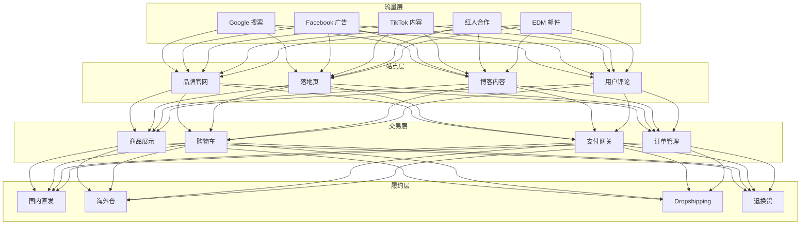
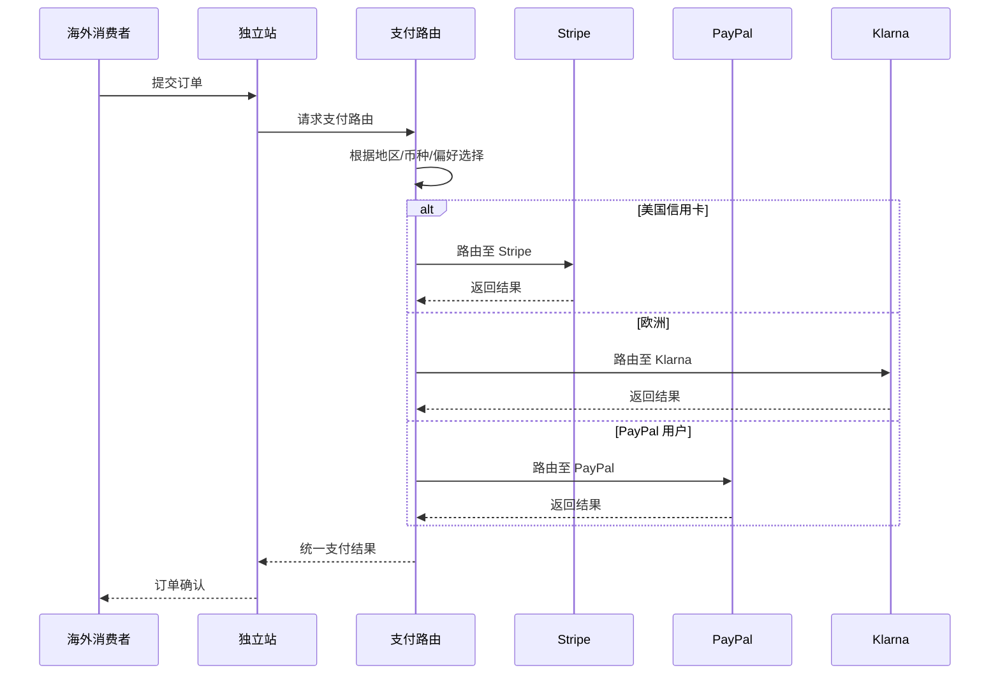

> **生产环境安全提示**
>
> 本文档包含可直接执行的运维命令。执行前请确认：当前目标集群与 Namespace 是否正确；是否具备足够的 RBAC 权限；是否已在非生产环境验证。命令风险等级标注：🔴 高风险（可能造成数据丢失或服务中断）、🟡 中风险（会修改集群状态，但通常可回滚）、🟢 低风险/只读（信息收集，无副作用）。


title: 跨境电商独立站架构设计
description: '# 跨境电商独立站架构设计 — 阿里云视角'
category: application-architecture
tags:
- k8s
- architecture
- industry
- redis
- operator
last_updated: 2026-05-18
difficulty: intermediate
reading_level: intermediate
audience:
- 电商架构师
- 出海技术负责人
- SRE
estimated_read_time: 5min
intent_queries:
- 跨境电商独立站 [[Kubernetes|Kubernetes]] 全球部署
- DTC品牌出海 Shopify 阿里云架构
- 跨境支付路由 多币种 K8s
- GDPR合规 跨境电商 数据本地化
- 全球CDN加速 跨境电商 架构
trigger_keywords:
- 跨境电商
- DTC
- 独立站
- Shopify
- 全球CDN
- 多币种
- 支付网关
- GDPR
- 阿里云
related_domains:
- domain-01-cluster-fundamentals
- domain-11-production-operations
related_topics:
- 33-crossborder-warehouse
- 01-ecommerce-architecture
- 53-new-retail-dtc
authors:
- name: KUDIG Team
  role: contributor
k8s_versions:
- '1.28'
- '1.29'
- '1.30'
- '1.31'
- '1.32'
---

# 跨境电商独立站架构设计 — 阿里云视角

> **适用版本**: Kubernetes v1.29 - v1.33 | **最后更新**: 2026-04-24
> **作者**: 阿里云解决方案架构师 | **标签**: `#跨境电商` `#DTC` `#独立站` `#Shopify` `#阿里云`

---

## 目录

1. [行业背景](#1-行业背景)
2. [业务架构](#2-业务架构)
3. [技术架构](#3-技术架构)
4. [核心数据流](#4-核心数据流)
5. [安全与合规](#5-安全与合规)
6. [可观测性](#6-可观测性)
7. [阿里云组件映射](#7-阿里云组件映射)
8. [生产检查清单](#8-生产检查清单)

---

## 1. 行业背景

### 1.1 业务特点

跨境电商独立站是品牌出海的自主渠道，摆脱平台依赖：

| 挑战 | 说明 | 架构影响 |
|:---|:---|:---|
| 全球访问 | 欧美/东南亚/中东用户 | CDN + 多 Region |
| 支付多样 | 各国支付方式差异 | 支付网关聚合 |
| 合规复杂 | GDPR/CPA/数据本地化 | 合规架构 |
| SEO 优化 | 搜索引擎自然流量 | SSR/SSG |
| 物流追踪 | 跨境物流可视化 | 物流 API 集成 |

### 1.2 核心场景

- **品牌官网**: 独立站建设与运营
- **全球支付**: Stripe/PayPal/本地支付
- **多语言多币种**: 自动识别与转换
- **社媒引流**: Facebook/TikTok/Google 广告
- **海外仓履约**: 本地发货提升时效

---

## 2. 业务架构

### 2.1 跨境 DTC 独立站全景架构



### 2.2 支付路由时序



---

## 3. 技术架构

### 3.1 K8s 部署

```yaml
# 独立站前端 Deployment
apiVersion: apps/v1
kind: Deployment
metadata:
  name: dtc-website
  namespace: crossborder-dtc
spec:
  replicas: 6
  selector:
    matchLabels:
      app: dtc-website
  template:
    metadata:
      labels:
        app: dtc-website
    spec:
      affinity:
        podAntiAffinity:
          preferredDuringSchedulingIgnoredDuringExecution:
            - weight: 100
              podAffinityTerm:
                labelSelector:
                  matchExpressions:
                    - key: app
                      operator: In
                      values: [dtc-website]
                topologyKey: topology.kubernetes.io/zone
      containers:
        - name: nextjs
          image: registry.cn-hangzhou.aliyuncs.com/dtc/website:v2.0.0
          ports:
            - containerPort: 3000
          env:
            - name: SSR_LOCALE
              value: "auto-detect"
            - name: CDN_DOMAIN
              value: "https://cdn.brand-global.com"
          resources:
            requests:
              memory: "1Gi"
              cpu: "500m"
            limits:
              memory: "2Gi"
              cpu: "1000m"
```

---

## 4. 核心数据流

### 4.1 社媒广告归因


---

## 5. 安全与合规

- **GDPR**: 欧盟用户数据保护
- **PCI-DSS**: 支付数据合规
- **数据本地化**: 部分地区数据不出境

---

## 6. 可观测性

- **页面加载**: P99 < 2s（全球）
- **支付成功率**: > 95%
- **转化率**: > 2%

---

## 7. 阿里云组件映射

| 功能域 | **阿里云云原生方案** |
|:---|:---|
| 容器平台 | **ACK Pro** |
| CDN | **阿里云 CDN 全球加速** |
| 数据库 | **PolarDB** |
| 缓存 | **Redis 企业版** |
| 对象存储 | **OSS** |
| 搜索 | **OpenSearch** |
| 可观测性 | **ARMS + SLS** |

---

## 8. 生产检查清单

- [ ] 全球 CDN 节点预热
- [ ] 多币种汇率实时更新
- [ ] 支付网关多区域冗余
- [ ] GDPR Cookie 合规
- [ ] 物流追踪 API 连通性

---

**维护者**: 阿里云解决方案架构师团队 | **许可证**: MIT

---

## Obsidian 相关文档

- topic-application-architecture KUDIG Database — Global MOC
- [[domain-20-application-patterns/topic-application-architecture/README.md|[[Topic 应用层架构设计最佳实践|Topic 应用层架构设计最佳实践]]]]
- [[domain-20-application-patterns/topic-application-architecture/01-ecommerce-architecture.md|电商系统 Kubernetes 生产架构设计]]
- [[domain-20-application-patterns/topic-application-architecture/02-mini-program-architecture.md|小程序平台架构设计]]
- [[domain-20-application-patterns/topic-application-architecture/03-cms-architecture.md|内容管理系统 CMS 架构设计]]
- [[domain-20-application-patterns/topic-application-architecture/04-im-rtc-architecture.md|实时通信 IM/RTC 架构设计]]
- [[domain-20-application-patterns/topic-application-architecture/05-online-education-architecture.md|在线教育平台 Kubernetes 生产架构设计]]
- [[domain-20-application-patterns/topic-application-architecture/06-fintech-architecture.md|金融科技FinTech Kubernetes生产架构设计]]
- [[domain-20-application-patterns/topic-application-architecture/07-iot-platform-architecture.md|物联网 IoT 平台架构设计]]
- [[domain-20-application-patterns/topic-application-architecture/08-ai-ml-inference-architecture.md|AI/ML 推理服务 Kubernetes 生产架构设计]]
- [[domain-20-application-patterns/topic-application-architecture/09-gaming-backend-architecture.md|游戏后端 Kubernetes 生产架构设计]]
- [[domain-20-application-patterns/topic-application-architecture/10-social-media-architecture.md|社交媒体平台Kubernetes生产架构设计]]

## See Also

- 53-new-retail-dtc
- 54-social-gaming-metaverse
- 56-smart-elderly-care
- 57-digital-therapeutics

## Related

- topic-application-architecture MOC — Cross-reference


<!-- risk-assessed -->
