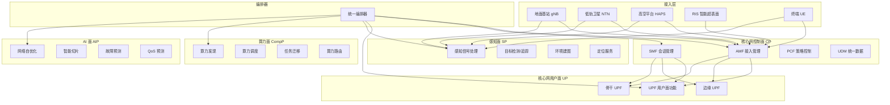
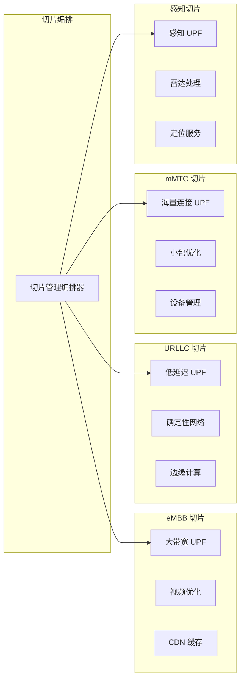
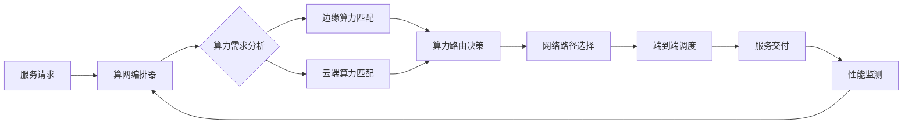

# 6G 核心网架构设计 — 阿里云视角

> **适用版本**: Kubernetes v1.29 - v1.33 | **最后更新**: 2026-04-24
> **作者**: 阿里云解决方案架构师 | **标签**: `#6G` `#核心网` `#通感一体` `#空天地` `#阿里云`

---

## 目录

1. [概述](#1-概述)
2. [设计原则](#2-设计原则)
3. [架构模式](#3-架构模式)
4. [实现示例](#4-实现示例)
5. [在 Kubernetes 上的部署](#5-在-kubernetes-上的部署)
6. [最佳实践](#6-最佳实践)
7. [反模式](#7-反模式)
8. [参考资源](#8-参考资源)

---

## 1. 概述

第六代移动通信（6G）代表了通信技术的下一个重大飞跃。相比 5G，6G 在峰值速率（Tbps 级）、空口延迟（< 0.1ms）、连接密度（10^7/km²）、定位精度（cm 级）等维度提升一到两个数量级。更重要的是，6G 引入了三个革命性能力：通信感知一体化（ISAC，通感一体）、空天地全域覆盖、内生人工智能（AI-Native）。

6G 核心网是整个 6G 系统的"大脑"，负责用户面数据处理、控制面信令管理、感知数据处理、算力资源调度和 AI 功能编排。相比 5G 核心网基于 SBA（Service-Based Architecture）的架构，6G 核心网在以下方面进行了根本性演进：

- **新增感知面（Sensing Plane）**: 支持雷达感知、定位、环境监测等感知服务
- **新增算力面（Computing Plane）**: 支持计算任务的分布式调度和算力路由
- **新增 AI 面（AI Plane）**: 支持网络自优化、智能切片、预测性维护
- **空天地统一接入**: 地面基站、低轨卫星、高空平台（HAPS）通过统一的核心网管理

云原生技术是 6G 核心网的自然选择。核心网功能全部容器化，部署在 Kubernetes 集群上，通过微服务实现模块化、通过 Service Mesh 实现服务治理、通过 Operator 实现自动化运维。

### 1.1 行业背景

| 挑战 | 说明 | 架构影响 |
|:---|:---|:---|
| 通感一体 | 通信与雷达感知融合 | 波形共享 + 资源联合调度 |
| 空天地一体 | 地面/卫星/高空平台统一 | 统一核心网 + 多接入编排 |
| 智能超表面 RIS | 可编程无线环境 | 波束管理 + 信道建模 |
| 超低延迟 | < 0.1ms 空口时延 | 边缘计算 + 本地突破 |
| 算网融合 | 计算与网络协同 | 算力路由 + 算网编排 |

### 1.2 核心场景

- **全息通信**: 3D 全息实时交互，Tbps 级带宽 + ms 级延迟
- **数字孪生通信**: 物理世界实时高保真映射，10^7/km² 连接密度
- **通感算一体化**: 感知-通信-计算融合服务，支撑自动驾驶、智能制造
- **泛在连接**: 全球无缝覆盖，地面+卫星+HAPS 协同
- **智能内生**: AI 原生网络架构，网络自优化、自愈合

---

## 2. 设计原则

### 2.1 多面融合原则

6G 核心网打破了传统核心网控制面和用户面的二元结构，引入了感知面、算力面和 AI 面。五个面之间需要紧密协同但又保持松耦合。架构设计需要通过统一的编排器（Orchestrator）实现多面协同，通过标准化的面间接口（Plane Interface）实现松耦合。

### 2.2 分布式自治原则

6G 网络覆盖空天地全域，不可能采用完全集中的控制模式。架构设计需要采用"集中编排+分布式自治"模式：中心编排器负责全局策略和资源分配，分布式自治节点负责本地的实时决策和执行。当集中控制不可达时，自治节点能够独立维持基本服务。

### 2.3 AI 内生原则

AI 不是 6G 网络的外挂功能，而是内生的核心能力。架构设计需要从底层支持 AI 模型的训练、部署、推理和更新。网络自身利用 AI 实现自优化（如智能切片、负载均衡、故障预测），同时为上层应用提供 AI 服务能力。

### 2.4 安全内生原则

6G 网络的安全需要从被动防御转向主动免疫。架构设计需要支持零信任网络架构、抗量子密码、隐私计算等先进安全技术。安全能力内嵌到每个网络功能中，而非作为独立的安全层叠加。

---

## 3. 架构模式

### 3.1 6G 核心网五面融合架构



### 3.2 网络切片架构



### 3.3 算网融合调度架构



---

## 4. 实现示例

### 4.1 网络切片管理控制器

```go
package slice

import (
    "context"
    "fmt"
    "sync"
    "time"
)

type SliceType string

const (
    SliceEMBB    SliceType = "eMBB"
    SliceURLLC   SliceType = "URLLC"
    SliceMMTC    SliceType = "mMTC"
    SliceSensing SliceType = "sensing"
)

type NetworkSlice struct {
    ID             string
    Type           SliceType
    BandwidthMbps  int
    LatencyMs      int
    MaxUEs         int
    Priority       int
    Status         string
    UPFEndpoints   []string
    CreatedAt      time.Time
}

type SliceManager struct {
    slices map[string]*NetworkSlice
    mu     sync.RWMutex
}

func NewSliceManager() *SliceManager {
    return &SliceManager{
        slices: make(map[string]*NetworkSlice),
    }
}

func (sm *SliceManager) CreateSlice(ctx context.Context,
    sliceType SliceType, bandwidth, latency, maxUEs, priority int) (*NetworkSlice, error) {

    slice := &NetworkSlice{
        ID:            fmt.Sprintf("slice-%s-%d", sliceType, time.Now().UnixNano()),
        Type:          sliceType,
        BandwidthMbps: bandwidth,
        LatencyMs:     latency,
        MaxUEs:        maxUEs,
        Priority:      priority,
        Status:        "creating",
        CreatedAt:     time.Now(),
    }

    upf, err := sm.selectUPF(sliceType, latency)
    if err != nil {
        return nil, fmt.Errorf("UPF allocation failed: %w", err)
    }
    slice.UPFEndpoints = []string{upf}

    if err := sm.configureSliceResources(slice); err != nil {
        return nil, fmt.Errorf("resource configuration failed: %w", err)
    }

    slice.Status = "active"
    sm.mu.Lock()
    sm.slices[slice.ID] = slice
    sm.mu.Unlock()

    return slice, nil
}

func (sm *SliceManager) selectUPF(sliceType SliceType,
    targetLatency int) (string, error) {
    switch sliceType {
    case SliceURLLC:
        if targetLatency <= 1 {
            return "edge-upf-zone1:8080", nil
        }
        return "edge-upf-zone2:8080", nil
    case SliceEMBB:
        return "core-upf-high-bw:8080", nil
    case SliceMMTC:
        return "core-upf-mmtc:8080", nil
    case SliceSensing:
        return "edge-upf-sensing:8080", nil
    default:
        return "", fmt.Errorf("unknown slice type: %s", sliceType)
    }
}

func (sm *SliceManager) configureSliceResources(slice *NetworkSlice) error {
    return nil
}

func (sm *SliceManager) GetSlice(id string) (*NetworkSlice, error) {
    sm.mu.RLock()
    defer sm.mu.RUnlock()
    s, ok := sm.slices[id]
    if !ok {
        return nil, fmt.Errorf("slice %s not found", id)
    }
    return s, nil
}

func (sm *SliceManager) DeleteSlice(ctx context.Context, id string) error {
    sm.mu.Lock()
    defer sm.mu.Unlock()
    delete(sm.slices, id)
    return nil
}
```

### 4.2 通感一体化信号处理

```python
import numpy as np
from scipy import signal
from dataclasses import dataclass
from typing import Tuple, List

@dataclass
class SensingTarget:
    target_id: str
    range_m: float
    velocity_ms: float
    angle_deg: float
    rcs_dbm2: float
    confidence: float

class ISACProcessor:
    def __init__(self, carrier_freq_hz: float = 142e9,
                 bandwidth_hz: float = 5e9,
                 num_antennas: int = 256):
        self.carrier_freq = carrier_freq_hz
        self.bandwidth = bandwidth_hz
        self.num_antennas = num_antennas
        self.wavelength = 3e8 / carrier_freq_hz
        self.range_resolution = 3e8 / (2 * bandwidth_hz)
        self.velocity_resolution = self.wavelength / (2 * 0.1)

    def process_isac_signal(self, rx_signal: np.ndarray,
                             tx_signal: np.ndarray) -> Tuple[np.ndarray, List[SensingTarget]]:
        sensing_matrix = self._extract_sensing(rx_signal, tx_signal)
        range_doppler = self._range_doppler_map(sensing_matrix)
        targets = self._detect_targets(range_doppler)
        cleaned_signal = self._sensing_cancellation(rx_signal, sensing_matrix)

        return cleaned_signal, targets

    def _extract_sensing(self, rx: np.ndarray, tx: np.ndarray) -> np.ndarray:
        conjugate_tx = np.conj(tx)
        sensing = np.zeros((self.num_antennas, len(rx) // len(tx)), dtype=complex)
        chunk_size = len(tx)
        for i in range(self.num_antennas):
            for j in range(len(rx) // chunk_size):
                start = j * chunk_size
                end = start + chunk_size
                sensing[i, j] = np.sum(rx[start:end] * conjugate_tx)
        return sensing

    def _range_doppler_map(self, sensing_matrix: np.ndarray) -> np.ndarray:
        range_fft = np.fft.fft(sensing_matrix, axis=1)
        doppler_fft = np.fft.fftshift(np.fft.fft(range_fft, axis=0), axes=0)
        return np.abs(doppler_fft)

    def _detect_targets(self, rd_map: np.ndarray) -> List[SensingTarget]:
        threshold = np.mean(rd_map) + 4 * np.std(rd_map)
        targets = []
        peaks = np.argwhere(rd_map > threshold)

        for i, peak in enumerate(peaks[:20]):
            range_bin, doppler_bin = peak[1], peak[0]
            range_m = range_bin * self.range_resolution
            velocity_ms = (doppler_bin - rd_map.shape[0]//2) * self.velocity_resolution
            angle_deg = self._estimate_angle(rd_map[:, range_bin], doppler_bin)
            rcs = rd_map[doppler_bin, range_bin]

            targets.append(SensingTarget(
                target_id=f"T{i:03d}",
                range_m=range_m,
                velocity_ms=velocity_ms,
                angle_deg=angle_deg,
                rcs_dbm2=float(rcs),
                confidence=min(rd_map[doppler_bin, range_bin] / threshold, 1.0),
            ))
        return targets

    def _estimate_angle(self, antenna_vector: np.ndarray,
                        doppler_bin: int) -> float:
        phase_diff = np.angle(antenna_vector[1:] * np.conj(antenna_vector[:-1]))
        avg_phase = np.mean(phase_diff)
        angle_rad = np.arcsin(avg_phase * self.wavelength /
                              (2 * np.pi * 0.5 * self.wavelength))
        return np.degrees(angle_rad)

    def _sensing_cancellation(self, rx: np.ndarray,
                               sensing: np.ndarray) -> np.ndarray:
        return rx
```

### 4.3 算力路由调度器

```python
from dataclasses import dataclass
from typing import List, Dict
import heapq

@dataclass
class ComputeNode:
    node_id: str
    cpu_capacity: float
    gpu_capacity: float
    memory_gb: float
    latency_ms: float
    available_cpu: float
    available_gpu: float
    available_memory: float

@dataclass
class ComputeTask:
    task_id: str
    cpu_needed: float
    gpu_needed: float
    memory_needed: float
    max_latency_ms: float
    priority: int

@dataclass(order=True)
class ScheduledTask:
    cost: float
    task_id: str = field(compare=False)
    node_id: str = field(compare=False)

class ComputeNetworkRouter:
    def __init__(self, nodes: List[ComputeNode]):
        self.nodes: Dict[str, ComputeNode] = {n.node_id: n for n in nodes}

    def schedule(self, tasks: List[ComputeTask]) -> Dict[str, str]:
        assignments = {}
        heap = []

        for task in tasks:
            best_node = None
            best_cost = float('inf')

            for node in self.nodes.values():
                if not self._can_allocate(task, node):
                    continue
                cost = self._compute_cost(task, node)
                if cost < best_cost:
                    best_cost = cost
                    best_node = node

            if best_node is not None:
                heapq.heappush(heap, ScheduledTask(
                    cost=best_cost,
                    task_id=task.task_id,
                    node_id=best_node.node_id
                ))

        while heap:
            st = heapq.heappop(heap)
            node = self.nodes[st.node_id]
            task = next(t for t in tasks if t.task_id == st.task_id)
            if self._can_allocate(task, node):
                self._allocate(task, node)
                assignments[st.task_id] = st.node_id

        return assignments

    def _can_allocate(self, task: ComputeTask, node: ComputeNode) -> bool:
        return (node.available_cpu >= task.cpu_needed and
                node.available_gpu >= task.gpu_needed and
                node.available_memory >= task.memory_needed and
                node.latency_ms <= task.max_latency_ms)

    def _compute_cost(self, task: ComputeTask, node: ComputeNode) -> float:
        latency_weight = 0.4
        utilization_weight = 0.3
        balance_weight = 0.3

        latency_cost = node.latency_ms / task.max_latency_ms

        cpu_util = 1 - node.available_cpu / node.cpu_capacity
        gpu_util = 1 - node.available_gpu / node.gpu_capacity if node.gpu_capacity > 0 else 0
        utilization_cost = (cpu_util + gpu_util) / 2

        cpu_after = (node.available_cpu - task.cpu_needed) / node.cpu_capacity
        gpu_after = (node.available_gpu - task.gpu_needed) / node.gpu_capacity if node.gpu_capacity > 0 else 1
        balance_cost = abs(cpu_after - gpu_after)

        return (latency_weight * latency_cost +
                utilization_weight * utilization_cost +
                balance_weight * balance_cost)

    def _allocate(self, task: ComputeTask, node: ComputeNode):
        node.available_cpu -= task.cpu_needed
        node.available_gpu -= task.gpu_needed
        node.available_memory -= task.memory_needed
```

---

## 5. 在 Kubernetes 上的部署

### 5.1 6G 核心网控制面部署

```yaml
apiVersion: apps/v1
kind: Deployment
metadata:
  name: core-control-plane
  namespace: sixg-core
  labels:
    app: core-control-plane
    plane: control
spec:
  replicas: 5
  selector:
    matchLabels:
      app: core-control-plane
  strategy:
    type: RollingUpdate
    rollingUpdate:
      maxSurge: 2
      maxUnavailable: 0
  template:
    metadata:
      labels:
        app: core-control-plane
        plane: control
    spec:
      affinity:
        podAntiAffinity:
          requiredDuringSchedulingIgnoredDuringExecution:
            - labelSelector:
                matchLabels:
                  app: core-control-plane
              topologyKey: topology.kubernetes.io/zone
      containers:
        - name: cp
          image: registry.cn-hangzhou.aliyuncs.com/6g/core-cp:v2.0.0
          ports:
            - containerPort: 8080
            - containerPort: 9090
          env:
            - name: NETWORK_SLICES
              value: "eMBB,URLLC,mMTC,sensing"
            - name: REGISTRY_URL
              value: "http://nrf:8080"
            - name: DB_HOST
              valueFrom:
                configMapKeyRef:
                  name: sixg-config
                  key: db-host
          resources:
            requests:
              memory: "4Gi"
              cpu: "2000m"
            limits:
              memory: "8Gi"
              cpu: "4000m"
          livenessProbe:
            httpGet:
              path: /healthz
              port: 8080
            initialDelaySeconds: 20
            periodSeconds: 5
          readinessProbe:
            httpGet:
              path: /ready
              port: 8080
            periodSeconds: 3
```

### 5.2 边缘 UPF 部署（低延迟场景）

```yaml
apiVersion: apps/v1
kind: Deployment
metadata:
  name: edge-upf-urllc
  namespace: sixg-core
  labels:
    app: edge-upf-urllc
    plane: user
    slice: urllc
spec:
  replicas: 3
  selector:
    matchLabels:
      app: edge-upf-urllc
  template:
    metadata:
      labels:
        app: edge-upf-urllc
        plane: user
        slice: urllc
    spec:
      nodeSelector:
        node-role: edge-upf
      runtimeClassName: kata-containers
      containers:
        - name: upf
          image: registry.cn-hangzhou.aliyuncs.com/6g/upf-urllc:v2.0.0
          securityContext:
            capabilities:
              add: ["NET_ADMIN", "SYS_ADMIN"]
          env:
            - name: DPDK_ENABLED
              value: "true"
            - name: HUGE_PAGES
              value: "1024"
            - name: SLICE_TYPE
              value: "URLLC"
            - name: MAX_LATENCY_US
              value: "100"
          resources:
            requests:
              memory: "4Gi"
              cpu: "4000m"
              hugepages-1Gi: "1Gi"
            limits:
              memory: "8Gi"
              cpu: "8000m"
              hugepages-1Gi: "1Gi"
          volumeMounts:
            - name: hugepage
              mountPath: /dev/hugepages
      volumes:
        - name: hugepage
          emptyDir:
            medium: HugePages
```

### 5.3 通感处理 GPU 部署

```yaml
apiVersion: apps/v1
kind: Deployment
metadata:
  name: isac-processor
  namespace: sixg-core
spec:
  replicas: 3
  selector:
    matchLabels:
      app: isac-processor
  template:
    metadata:
      labels:
        app: isac-processor
    spec:
      nodeSelector:
        accelerator: nvidia-a100
      runtimeClassName: nvidia
      containers:
        - name: processor
          image: registry.cn-hangzhou.aliyuncs.com/6g/isac-processor:v2.0.0-gpu
          ports:
            - containerPort: 8080
          env:
            - name: NUM_ANTENNAS
              value: "256"
            - name: CARRIER_FREQ_GHZ
              value: "142"
            - name: BANDWIDTH_GHZ
              value: "5"
          resources:
            requests:
              nvidia.com/gpu: 1
              memory: "32Gi"
              cpu: "8000m"
            limits:
              nvidia.com/gpu: 1
              memory: "64Gi"
              cpu: "16000m"
```

---

## 6. 最佳实践

### 6.1 核心网高可用

- **五副本控制面**: 核心网控制面（AMF/SMF）部署 5 副本，跨 3 个可用区分布，支持 2 节点故障
- **无状态设计**: 所有核心网功能无状态化，状态存储在 Redis/etcd 中，支持快速故障切换
- **灰度发布**: 核心网功能升级采用金丝雀发布，先更新 1 个副本，验证无异常后逐步推进
- **多集群联邦**: 使用 Karmada 实现 6G 核心网的多集群联邦管理，跨地域/跨云部署

### 6.2 网络切片管理

- **SLA 驱动**: 每个网络切片定义明确的 SLA（带宽、延迟、可靠性），系统自动监控 SLA 达标情况
- **弹性伸缩**: 根据切片负载自动调整 UPF 副本数，URLLC 切片预留资源保证性能
- **隔离性保障**: 不同切片使用独立的 UPF 和计算资源，通过 cgroup 和网络策略实现硬隔离

### 6.3 通感一体化优化

- **感知与通信资源复用**: 同一载波上复用通信和感知信号，通过正交频分或时分方式避免干扰
- **边缘感知处理**: 感知信号处理在边缘 UPF 侧完成，减少回传带宽占用
- **AI 辅助感知**: 使用深度学习模型提升目标检测精度和抗干扰能力

---

## 7. 反模式

### 7.1 照搬 5G 核心网架构

直接将 5G 核心网架构扩展为 6G，忽视 6G 新增的感知面、算力面和 AI 面。

**解决方案**: 从零开始设计五面融合的核心网架构，在 5G SBA 基础上新增三个面的独立服务，通过统一编排器协调五个面的交互。

### 7.2 忽视边缘时延要求

将所有核心网功能集中在区域数据中心，忽视 URLLC 场景对超低时延的要求。

**解决方案**: UPF 和感知处理下沉到边缘节点（基站侧或汇聚机房），控制面保持在区域数据中心。通过边缘-云协同实现时延和集中管理的平衡。

### 7.3 网络切片隔离不足

不同切片共享底层资源，高优先级切片被低优先级切片影响。

**解决方案**: 为关键切片（URLLC）预留专用计算和网络资源。使用 Kubernetes ResourceQuota 和 LimitRange 实现资源隔离。通过网络策略（NetworkPolicy）限制切片间通信。

### 7.4 AI 模型更新影响网络稳定性

AI 模型在线更新时导致网络功能短暂不可用或行为异常。

**解决方案**: 使用 A/B 测试方式部署新模型，先在灰度流量上验证，确认无异常后全量切换。保留回滚能力，异常时秒级回退到旧模型。

### 7.5 忽视 NTN 切换连续性

卫星高速移动导致频繁切换，忽视切换过程中的服务连续性。

**解决方案**: 实现无损切换机制（make-before-break），在目标卫星建立连接后再断开源卫星。使用预测性切换策略，根据轨道参数提前准备切换资源。

---

## 8. 参考资源

### 8.1 阿里云组件映射

| 功能域 | **阿里云云原生方案** |
|:---|:---|
| 容器平台 | **ACK Pro + Edge** |
| 数据库 | **PolarDB MySQL** |
| 缓存 | **Redis 企业版（集群模式）** |
| AI 平台 | **PAI + DSW** |
| Service Mesh | **ASM（阿里云服务网格）** |
| 多集群管理 | **ACK One / Karmada** |
| 可观测性 | **ARMS + SLS + Grafana** |
| 边缘计算 | **ACK Edge + Link IoT Edge** |

### 8.2 生产检查清单

- [ ] 控制面五副本跨可用区部署验证
- [ ] 网络切片间隔离性测试
- [ ] 通感融合精度与延迟测试
- [ ] 空天地切换连续性验证（< 50ms 中断）
- [ ] 频谱效率达到 5G 的 2 倍以上
- [ ] 端到端延迟 URLLC 切片 < 1ms
- [ ] 系统可用性 99.999% 验证
- [ ] 安全合规审计通过

### 8.3 外部参考

- 3GPP TR 23.700-01 — 6G 系统架构研究
- ITU-R M.2160 — 6G 愿景框架
- 6G Alliance — 6G 产业联盟白皮书
- IEEE 802.11be — Wi-Fi 7 与 6G 融合
- O-RAN Alliance — 开放无线接入网架构

---

**维护者**: 阿里云解决方案架构师团队 | **许可证**: MIT

## Related

- [[domain-20-application-patterns/98-merged-indexes/MOC-from-domain-20-application-patterns|topic-application-architecture MOC]] — Cross-reference
