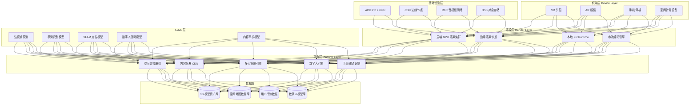
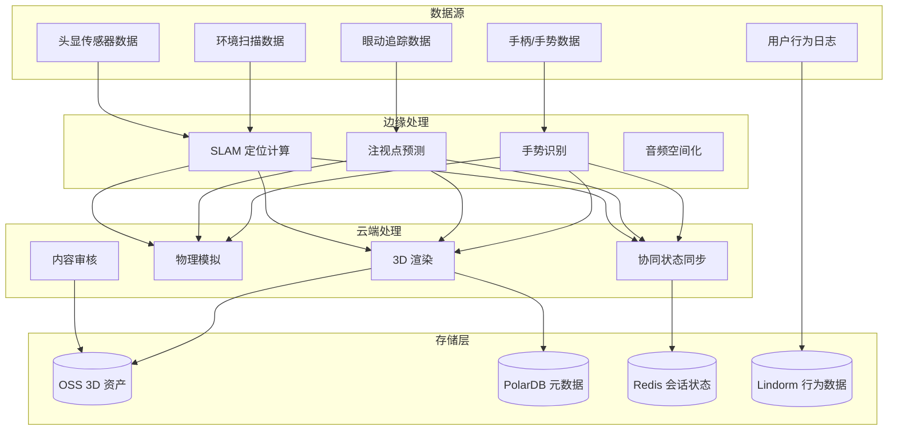

title: 沉浸式XR架构设计
description: '# 沉浸式 XR 架构设计 — 阿里云视角'
category: application-architecture
tags:
- k8s
- architecture
- industry
- [[Prometheus|prometheus]]
- grafana
- opa
- redis
- mysql
- crd
- operator
last_updated: '2026-05-18'
difficulty: advanced
reading_level: advanced
audience:
- XR开发者
- 游戏架构师
- 云渲染工程师
- 阿里云解决方案架构师
estimated_read_time: 5min
intent_queries:
- 沉浸式XR系统架构设计
- 云渲染GPU串流K8s部署
- VR游戏实时渲染WebRTC
- 多人协同CRDT同步
- 数字人AI驱动
trigger_keywords:
- XR
- VR
- AR
- 云渲染
- 数字人
- 空间计算
- WebRTC
- 注视点渲染
- CRDT
- OpenXR
related_domains:
- domain-01-cluster-fundamentals
- domain-9-ai-ml
- domain-03-networking-traffic
- domain-7-observability
related_topics:
- domain-20-application-patterns/topic-application-architecture/92-smart-sports-venue
- domain-20-application-patterns/topic-application-architecture/12-smart-logistics-architecture
- domain-02-workloads-applications/topic-functions/04-high-concurrency-system
- domain-02-workloads-applications/topic-functions/10-message-queue
authors:
- name: KUDIG Team
  role: contributor
k8s_versions:
- '1.28'
- '1.29'
- '1.30'
- '1.31'
- '1.32'
---

# 沉浸式 XR 架构设计 — 阿里云视角

> **适用版本**: Kubernetes v1.29 - v1.33 | **最后更新**: 2026-04-24
> **作者**: 阿里云解决方案架构师 | **标签**: `#XR` `#VR` `#AR` `#空间计算` `#阿里云`

---

<!-- chunk: 目录 -->## 目录

1. [行业概述](#1-行业概述)
2. [业务场景](#2-业务场景)
3. [架构设计](#3-架构设计)
4. [核心技术栈](#4-核心技术栈)
5. [Kubernetes 部署方案](#5-kubernetes-部署方案)
6. [数据架构](#6-数据架构)
7. [AI/ML 组件](#7-aiml-组件)
8. [安全与合规](#8-安全与合规)
9. [最佳实践](#9-最佳实践)
10. [反模式](#10-反模式)
11. [参考资源](#11-参考资源)

---

<!-- chunk: 1. 行业概述 -->## 1. 行业概述

## 1.1 市场规模与趋势

沉浸式 XR（VR/AR/MR）融合虚拟与现实，开启空间计算时代。随着 Apple Vision Pro、Meta Quest 3、PICO 4 等设备普及，全球 XR 市场规模预计从 2024 年的 500 亿美元增长到 2030 年的 3500 亿美元。关键技术趋势包括：眼动追踪注视点渲染、空间计算、手势交互、数字人、云渲染串流。

| 指标 | 2024 年 | 2026 年（预测） | 2030 年（预测） |
|:---|:---|:---|:---|
| 全球 XR 设备出货量 | 2000 万台 | 5000 万台 | 2 亿台 |
| XR 市场规模 | $50B | $120B | $350B |
| 云渲染占比 | 15% | 35% | 60% |
| 单设备分辨率 | 4K/眼 | 6K/眼 | 12K/眼 |
| 交互延迟要求 | < 20ms | < 15ms | < 10ms |
| 数字人市场规模 | $5B | $15B | $60B |

## 1.2 行业痛点

| 痛点 | 说明 | 数字化转型驱动 |
|:---|:---|:---|
| 低延迟渲染 | 6DOF 交互需 < 20ms MTP | 云端 GPU 渲染 + 注视点编码 |
| 空间定位 | SLAM/空间锚点跨设备共享 | 云端地图服务 + 协同定位 |
| 内容生态 | 3D 内容生产门槛高、成本高 | AIGC 3D 生成 + 云化工具链 |
| 多用户协同 | 共享空间体验状态同步 | CRDT 协同算法 + 边缘同步 |
| 硬件差异 | 不同头显算力/分辨率差异大 | 自适应码率 + 分级渲染 |
| 带宽需求 | 云渲染需 50-200 Mbps | 视锥编码 + 感知压缩 |

## 1.3 数字化转型架构影响

XR 系统架构需要覆盖终端设备层（VR/AR 头显、手机、空间计算设备）、渲染层（云 GPU 渲染、边缘渲染、本地渲染）、平台层（空间定位、内容分发、多人协同）和内容层（3D 模型库、场景编辑器）。核心挑战是延迟预算极紧（端到端 < 20ms），需要边缘节点 + GPU 云渲染 + 智能编码的协同优化。

---

<!-- chunk: 2. 业务场景 -->## 2. 业务场景

## 2.1 VR 沉浸娱乐

VR 游戏、影视、社交应用是 XR 最大的消费市场。系统需要支持多人在线、物理引擎、实时语音、手势交互等能力。渲染以云端 GPU 为主，通过 H.265/H.265 串流到终端。典型场景包括 VR 电竞、虚拟演唱会、沉浸式观影。

## 2.2 AR 工业辅助

AR 远程协助、培训和巡检是工业 XR 的核心场景。现场工作人员佩戴 AR 眼镜，远程专家通过视频看到第一视角并叠加指导标注。系统需要低延迟视频传输、空间锚点定位和实时标注同步。工业场景对可靠性和安全性要求极高。

## 2.3 MR 协同办公

虚拟会议室和协作空间支持多地团队成员在共享空间中进行 3D 协作。需要空间音频、手势识别、白板共享、3D 模型共同编辑。系统状态同步需要支持 10+ 人同时在线。

## 2.4 空间计算与环境理解

通过 SLAM、深度感知和环境理解技术，设备可以扫描和重建物理空间。空间锚点允许多设备共享同一坐标系，实现持久化虚拟内容放置。应用场景包括室内导航、虚拟家居布置、城市 AR。

## 2.5 数字人交互

基于 AI 驱动的数字人用于虚拟客服、虚拟主播、虚拟教师等场景。系统需要实时面部捕捉、语音合成、动作生成和情感计算。数字人渲染可以云端完成，通过视频串流到终端。

---

<!-- chunk: 3. 架构设计 -->## 3. 架构设计

## 3.1 沉浸式 XR 全景架构



---

<!-- chunk: 4. 核心技术栈 -->## 4. 核心技术栈

| Component | Purpose | Technology | License |
|:---|:---|:---|:---|
| Container Orchestration | XR workload scheduling | ACK Pro + GPU | Proprietary |
| Cloud Rendering | Real-time 3D rendering | Unreal Engine 5 / Unity Cloud | Proprietary |
| XR Runtime | Device-side rendering & tracking | OpenXR / ARCore / ARKit | Open / Proprietary |
| Video Streaming | Low-latency cloud render streaming | WebRTC / WHIP/WHEP | IETF Standard |
| Video Codec | Foveated encoding | H.265 / AV1 / VP9 | Proprietary / Open |
| Spatial Mapping | Cloud-based spatial anchors | Niantic Lightship / Custom | Proprietary |
| Collaboration | Multi-user state sync | CRDT (Yjs) / WebRTC SFU | MIT |
| 3D Asset Management | Model storage & delivery | OSS + Draco compression | Proprietary / Apache 2.0 |
| AI Inference | Hand/gesture/eye tracking | ONNX Runtime / TensorRT | MIT / Proprietary |
| RTC Network | Audio/video communication | Aliyun RTC / LiveKit | Proprietary / Apache 2.0 |
| GPU Instance | Cloud rendering nodes | GN7/GN10 (A10/A100) | Proprietary |
| CDN | Content delivery & edge caching | Aliyun DCDN | Proprietary |
| Relational DB | User/asset metadata | PolarDB MySQL | Proprietary |
| Monitoring | Observability | ARMS + SLS + Grafana | Proprietary / Apache 2.0 |

---

<!-- chunk: 5. Kubernetes 部署方案 -->## 5. Kubernetes 部署方案

## 5.1 云渲染 GPU Deployment

```yaml
apiVersion: apps/v1
kind: Deployment
metadata:
  name: cloud-xr-render
  namespace: immersive-xr
  labels:
    app: cloud-xr-render
    tier: rendering
spec:
  replicas: 10
  selector:
    matchLabels:
      app: cloud-xr-render
  strategy:
    rollingUpdate:
      maxSurge: 3
      maxUnavailable: 1
  template:
    metadata:
      labels:
        app: cloud-xr-render
        tier: rendering
      annotations:
        prometheus.io/scrape: "true"
        prometheus.io/port: "9090"
    spec:
      nodeSelector:
        accelerator: nvidia-a10
        node-pool: xr-render
      runtimeClassName: nvidia
      priorityClassName: xr-render-high
      tolerations:
        - key: "nvidia.com/gpu"
          operator: "Exists"
          effect: "NoSchedule"
      containers:
        - name: render
          image: registry.cn-hangzhou.aliyuncs.com/xr/cloud-render:v3.0.0-gpu
          ports:
            - containerPort: 8080
              name: http
            - containerPort: 8443
              name: webrtc
            - containerPort: 9090
              name: metrics
          env:
            - name: RENDER_MODE
              value: "foveated-streaming"
            - name: TARGET_LATENCY_MS
              value: "15"
            - name: CODEC
              value: "h265"
            - name: BITRATE_MBPS
              value: "80"
            - name: RESOLUTION
              value: "3840x2160"
            - name: REFRESH_RATE
              value: "90"
            - name: EDGE_NODE_ID
              valueFrom:
                fieldRef:
                  fieldPath: spec.nodeName
          resources:
            requests:
              nvidia.com/gpu: 1
              memory: "16Gi"
              cpu: "8000m"
            limits:
              nvidia.com/gpu: 1
              memory: "32Gi"
              cpu: "16000m"
          readinessProbe:
            httpGet:
              path: /health/ready
              port: 8080
            initialDelaySeconds: 30
            periodSeconds: 5
          livenessProbe:
            httpGet:
              path: /health/live
              port: 8080
            initialDelaySeconds: 60
            periodSeconds: 10
          volumeMounts:
            - name: asset-cache
              mountPath: /cache/assets
      volumes:
        - name: asset-cache
          emptyDir:
            sizeLimit: "50Gi"
```

## 5.2 协同空间服务 Deployment

```yaml
apiVersion: apps/v1
kind: Deployment
metadata:
  name: collab-space-server
  namespace: immersive-xr
spec:
  replicas: 4
  selector:
    matchLabels:
      app: collab-space-server
  template:
    metadata:
      labels:
        app: collab-space-server
    spec:
      containers:
        - name: collab
          image: registry.cn-hangzhou.aliyuncs.com/xr/collab-server:v2.0.0
          ports:
            - containerPort: 8080
          env:
            - name: MAX_USERS_PER_ROOM
              value: "20"
            - name: SYNC_PROTOCOL
              value: "crdt"
            - name: REDIS_URL
              valueFrom:
                secretKeyRef:
                  name: xr-secrets
                  key: redis-url
          resources:
            requests:
              memory: "4Gi"
              cpu: "2000m"
            limits:
              memory: "8Gi"
              cpu: "4000m"
```

## 5.3 ConfigMap, Service 与 Secret

```yaml
apiVersion: v1
kind: ConfigMap
metadata:
  name: xr-config
  namespace: immersive-xr
data:
  render-config: |
    {
      "foveated_regions": 3,
      "central_resolution": "3840x2160",
      "peripheral_resolution": "960x540",
      "encode_latency_target_ms": 5,
      "network_latency_target_ms": 8,
      "decode_latency_target_ms": 2
    }
  collab-config: |
    {
      "state_sync_rate_hz": 60,
      "position_precision": "float32",
      "spatial_audio_channels": 8,
      "max_annotations": 100
    }
  cdn-domains: |
    {
      "assets": "https://xr-assets.cdn.example.com",
      "models": "https://xr-models.cdn.example.com",
      "textures": "https://xr-textures.cdn.example.com"
    }
---
apiVersion: v1
kind: Service
metadata:
  name: cloud-xr-render
  namespace: immersive-xr
spec:
  selector:
    app: cloud-xr-render
  ports:
    - name: http
      port: 8080
      targetPort: 8080
    - name: webrtc
      port: 8443
      targetPort: 8443
    - name: metrics
      port: 9090
      targetPort: 9090
  type: ClusterIP
---
apiVersion: v1
kind: Secret
metadata:
  name: xr-secrets
  namespace: immersive-xr
type: Opaque
stringData:
  redis-url: "redis://:password@redis-xr.rds.aliyuncs.com:6379/0"
  oss-access-key: "encrypted-access-key"
  oss-secret-key: "encrypted-secret-key"
  content-moderation-key: "moderation-api-key"
```

---

<!-- chunk: 6. 数据架构 -->## 6. 数据架构

## 6.1 XR 数据流全景



## 6.2 数据流说明

- **传感器上行**: 头显 6DOF 位姿、眼动、手势数据以 90-120Hz 上行至边缘/云端
- **渲染下行**: 云端渲染画面通过 WebRTC 串流至终端，延迟目标 < 15ms
- **协同同步**: 多用户状态变更通过 CRDT 算法实时同步，冲突自动解决
- **空间地图**: 环境扫描数据上传至云端，合并生成空间锚点地图，支持跨设备共享

---

<!-- chunk: 7. AI/ML 组件 -->## 7. AI/ML 组件

## 7.1 核心模型

| 模型 | 用途 | 输入 | 输出 | 框架 |
|:---|:---|:---|:---|:---|
| 注视点预测 | 预测用户注视区域 | 眼动历史 + 场景内容 | 注视点坐标 | Transformer |
| 手势识别 | 实时手势分类 | 手部关节 3D 坐标 | 手势类别 | LSTM + GCN |
| SLAM 定位 | 空间定位与建图 | RGB-D 帧 + IMU | 6DOF 位姿 + 点云 | ORB-SLAM3 |
| 数字人驱动 | 面部/身体动作生成 | 语音/文本 | 面部表情 + 身体动作 | Diffusion Model |
| 内容审核 | XR 内容安全审核 | 3D 模型 / 全景视频 | 违规标记 | Multi-Modal CLIP |
| 场景理解 | 环境语义分割 | RGB-D 帧 | 3D 语义标签 | PointNet++ |

## 7.2 模型推理管道

边缘端部署轻量级模型（手势/注视点），云端部署重量级模型（渲染优化/内容审核/数字人）。模型通过 PAI-EAS 管理生命周期，支持灰度发布和 A/B 测试。

---

<!-- chunk: 8. 安全与合规 -->## 8. 安全与合规

## 8.1 行业法规与标准

| 法规/标准 | 适用范围 | 架构要求 |
|:---|:---|:---|
| OpenXR | XR 设备互操作标准 | OpenXR Runtime 兼容 |
| WebXR | Web 端 XR 标准 | 浏览器 XR API 兼容 |
| GDPR / PIPL | 用户数据隐私保护 | 环境扫描数据脱敏 |
| COPPA | 儿童在线隐私保护 | 年龄验证 + 家长控制 |
| 等保三级 | XR 平台安全 | 数据加密 + 审计日志 |
| ISO 27001 | 信息安全管理 | 安全管理体系 |
| VR 使用安全 | VR 使用时长限制/健康 | 使用时长监控与提醒 |

## 8.2 安全架构要点

- **环境隐私**: 环境扫描数据（含家庭环境）严格加密，不上传原始点云
- **内容安全**: UGC 3D 内容通过 AI 审核后才能公开
- **VR 健康**: 青少年使用时长限制、晕动症检测与提醒
- **支付安全**: VR 内购支付需要二次确认
- **儿童保护**: 内容分级 + 家长控制机制

---

<!-- chunk: 9. 最佳实践 -->## 9. 最佳实践

1. **注视点渲染**: 根据眼动追踪数据，仅对注视区域高分辨率渲染，周边区域降分辨率，节省 50%+ GPU 算力
2. **分级渲染架构**: 简单场景本地渲染，复杂场景云渲染，混合场景云+端协同渲染
3. **边缘节点就近部署**: 云渲染节点部署在离用户最近的边缘机房，降低串流延迟
4. **3D 资产 Draco 压缩**: 使用 Google Draco 算法压缩 3D 模型，减小 80%+ 传输体积
5. **CRDT 协同算法**: 多人协同编辑使用 CRDT（无冲突复制数据类型），避免中心化锁机制
6. **自适应码率**: 根据网络质量动态调整串流码率，弱网时优先保障交互延迟
7. **空间锚点缓存**: 常用空间锚点缓存到边缘节点，减少云端查询延迟
8. **预热 GPU 实例**: 用户进入 VR 前 5 秒预热 GPU 渲染实例，消除首次渲染延迟
9. **3D 内容 CDN 预热**: 热门 3D 资产预先推送到 CDN 边缘节点
10. **晕动症缓解**: 渲染帧率稳定 90FPS+，传感器-画面延迟 < 20ms，提供瞬移模式

---

<!-- chunk: 10. 反模式 -->## 10. 反模式

1. **全场景云渲染**: 不区分场景复杂度，所有渲染都上云，简单场景反而增加延迟。应采用分级渲染策略
2. **中心化状态同步**: 多人协同使用中心服务器同步状态，服务器问题即全部断开。应采用去中心化 CRDT
3. **原始点云上传**: 将完整的环境扫描点云上传至云端，泄露家庭隐私。应在设备端提取特征后上传
4. **固定码率串流**: 无论网络状况如何都使用固定码率，弱网时画面卡顿。应实现自适应码率
5. **忽视硬件差异**: 不针对不同头显性能优化，低性能设备卡顿严重。应实现分级渲染质量

---

<!-- chunk: 11. 参考资源 -->## 11. 参考资源

- [OpenXR Specification](https://www.khronos.org/openxr/)
- [WebXR Device API](https://www.w3.org/TR/webxr/)
- [Meta Quest Developer Documentation](https://developer.meta.com/)
- [Apple Vision Pro Developer](https://developer.apple.com/visionos/)
- [Khronos glTF 3D Asset Format](https://www.khronos.org/gltf/)
- [Google Draco 3D Compression](https://github.com/google/draco)
- [Niantic Lightship ARDK](https://lightship.dev/)
- [LiveKit Open Source WebRTC SFU](https://livekit.io/)
- [阿里云 RTC 文档](https://help.aliyun.com/product/61339.html)

---

**维护者**: 阿里云解决方案架构师团队 | **许可证**: MIT

---

<!-- chunk: Obsidian 相关文档 -->## Obsidian 相关文档

- topic-application-architecture MOC
- [[domain-20-application-patterns/topic-application-architecture/README.md|Topic 应用层架构设计最佳实践]]
- [[domain-20-application-patterns/topic-application-architecture/01-ecommerce-architecture.md|电商系统 Kubernetes 生产架构设计]]
- [[domain-20-application-patterns/topic-application-architecture/02-mini-program-architecture.md|小程序平台架构设计]]
- [[domain-20-application-patterns/topic-application-architecture/03-cms-architecture.md|内容管理系统 CMS 架构设计]]
- [[domain-20-application-patterns/topic-application-architecture/04-im-rtc-architecture.md|实时通信 IM/RTC 架构设计]]
- [[domain-20-application-patterns/topic-application-architecture/05-online-education-architecture.md|在线教育平台 Kubernetes 生产架构设计]]
- [[domain-20-application-patterns/topic-application-architecture/06-fintech-architecture.md|金融科技FinTech Kubernetes生产架构设计]]
- [[domain-20-application-patterns/topic-application-architecture/07-iot-platform-architecture.md|物联网 IoT 平台架构设计]]
- [[domain-20-application-patterns/topic-application-architecture/08-ai-ml-inference-architecture.md|AI/ML 推理服务 Kubernetes 生产架构设计]]
- [[domain-20-application-patterns/topic-application-architecture/09-gaming-backend-architecture.md|游戏后端 Kubernetes 生产架构设计]]
- [[domain-20-application-patterns/topic-application-architecture/10-social-media-architecture.md|社交媒体平台Kubernetes生产架构设计]]

## See Also

- 72-digital-twin-city
- 73-smart-firefighting
- 75-affective-computing
- 76-synthetic-biology

## Related

- topic-application-architecture MOC — Cross-reference
