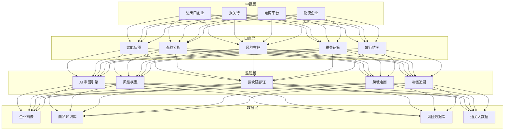
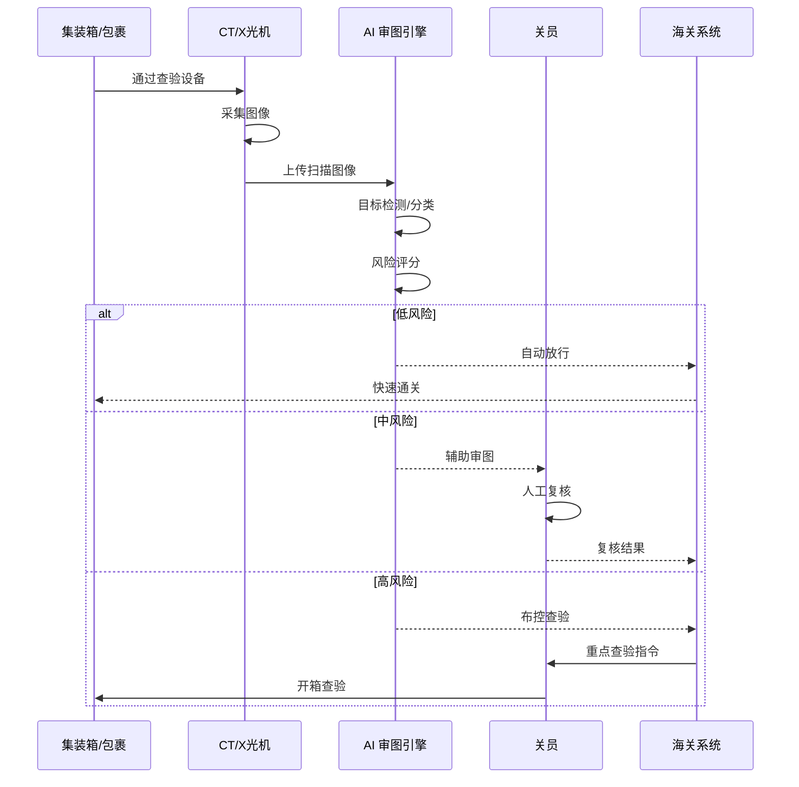
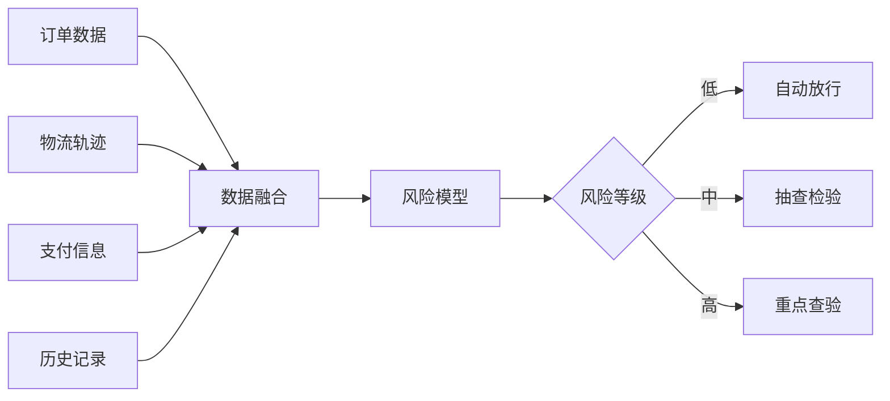

> **生产环境安全提示**
>
> 本文档包含可直接执行的运维命令。执行前请确认：当前目标集群与 Namespace 是否正确；是否具备足够的 RBAC 权限；是否已在非生产环境验证。命令风险等级标注：🔴 高风险（可能造成数据丢失或服务中断）、🟡 中风险（会修改集群状态，但通常可回滚）、🟢 低风险/只读（信息收集，无副作用）。


title: 智慧海关架构设计
description: '# 智慧海关架构设计 — 阿里云视角'
category: application-architecture
tags:
- k8s
- architecture
- industry
- gpu
- nvidia
last_updated: '2026-05-18'
difficulty: advanced
reading_level: advanced
audience:
- 海关信息化架构师
- 通关系统开发者
- AI视觉工程师
- 阿里云解决方案架构师
estimated_read_time: 5min
intent_queries:
- 智慧海关系统架构设计
- AI审图CT/X光机识别
- 风险布控大数据分析
- 跨境电商通关
- 冷链追溯区块链
trigger_keywords:
- 智慧海关
- 智慧口岸
- AI审图
- 风险布控
- 跨境电商
- 冷链监管
- 无纸化通关
- 走私识别
- 海关风控
- CT审图
related_domains:
- domain-01-cluster-fundamentals
- domain-9-ai-ml
- domain-7-observability
- domain-03-networking-traffic
related_topics:
- domain-20-application-patterns/topic-application-architecture/25-quantitative-trading
- domain-20-application-patterns/topic-application-architecture/12-smart-logistics-architecture
- domain-20-application-patterns/topic-application-architecture/58-web3-gamefi
- domain-02-workloads-applications/topic-functions/09-data-security-privacy
authors:
- name: KUDIG Team
  role: contributor
k8s_versions:
- '1.28'
- '1.29'
- '1.30'
- '1.31'
- '1.32'
---

# 智慧海关架构设计 — 阿里云视角

> **适用版本**: [[Kubernetes|Kubernetes]] v1.29 - v1.33 | **最后更新**: 2026-04-24
> **作者**: 阿里云解决方案架构师 | **标签**: `#智慧海关` `#智慧口岸` `#AI审图` `#风险布控` `#阿里云`

---

## 目录

1. [行业背景](#1-行业背景)
2. [业务架构](#2-业务架构)
3. [技术架构](#3-技术架构)
4. [核心数据流](#4-核心数据流)
5. [安全与合规](#5-安全与合规)
6. [可观测性](#6-可观测性)
7. [阿里云组件映射](#7-阿里云组件映射)
8. [生产检查清单](#8-生产检查清单)

---

## 1. 行业背景

### 1.1 业务特点

智慧海关通过科技手段提升通关效率与监管精准度：

| 挑战 | 说明 | 架构影响 |
|:---|:---|:---|
| 通关时效 | 货物快速通关需求 | 提前申报 + 智能审单 |
| 风险防控 | 走私/违禁品识别 | AI 审图 + 大数据风控 |
| 跨境电商 | 海量小包裹监管 | 自动化分拣 + 风险扫描 |
| 口岸协同 | 多部门数据共享 | 数据交换平台 |
| 冷链监管 | 进口冷链食品安全 | 全程温控追溯 |

### 1.2 核心场景

- **智能审图**: CT/X光机 AI 自动识别
- **风险布控**: 大数据风险分析预警
- **跨境电商通关**: 9610/9710/9810 模式
- **冷链监管**: 进口冷链食品溯源
- **智慧口岸**: 无纸化通关/一站式作业

---

## 2. 业务架构

### 2.1 智慧海关全景架构



### 2.2 智能审图时序



---

## 3. 技术架构

### 3.1 K8s 部署

```yaml
# AI 审图引擎 GPU Deployment
apiVersion: apps/v1
kind: Deployment
metadata:
  name: ai-image-inspection
  namespace: smart-customs
spec:
  replicas: 5
  selector:
    matchLabels:
      app: ai-image-inspection
  template:
    metadata:
      labels:
        app: ai-image-inspection
    spec:
      nodeSelector:
        accelerator: nvidia-t4
      runtimeClassName: nvidia
      containers:
        - name: inspector
          image: registry.cn-hangzhou.aliyuncs.com/customs/ai-inspection:v3.0.0-gpu
          ports:
            - containerPort: 8080
          env:
            - name: DETECTION_CLASSES
              value: "weapons,drugs,contraband"
            - name: CONFIDENCE_THRESHOLD
              value: "0.85"
          resources:
            requests:
              nvidia.com/gpu: 1
              memory: "8Gi"
              cpu: "4000m"
            limits:
              nvidia.com/gpu: 1
              memory: "16Gi"
              cpu: "8000m"
```

---

## 4. 核心数据流

### 4.1 跨境电商风险扫描



---

## 5. 安全与合规

- **国门安全**: 违禁品拦截率 > 99%
- **数据安全**: 企业申报数据加密
- **等保三级**: 海关系统等级保护

---

## 6. 可观测性

- **审图速度**: 单箱 < 3s
- **识别准确率**: > 95%
- **通关时效**: 压缩 50%+

---

## 7. 阿里云组件映射

| 功能域 | **阿里云云原生方案** |
|:---|:---|
| 容器平台 | **ACK Pro + GPU** |
| AI | **PAI / 视觉智能** |
| 区块链 | **蚂蚁链 BaaS** |
| 数据库 | **PolarDB** |
| 大数据 | **MaxCompute** |
| 可观测性 | **ARMS + SLS** |

---

## 8. 生产检查清单

- [ ] AI 审图准确率 > 95%
- [ ] 违禁品拦截零遗漏
- [ ] 跨境电商数据实时同步
- [ ] 冷链追溯链路完整
- [ ] 等保三级合规审计

---

**维护者**: 阿里云解决方案架构师团队 | **许可证**: MIT

---

## Obsidian 相关文档

- topic-application-architecture KUDIG Database — Global MOC
- [[domain-20-application-patterns/topic-application-architecture/README.md|Topic 应用层架构设计最佳实践]]
- [[domain-20-application-patterns/topic-application-architecture/01-ecommerce-architecture.md|电商系统 Kubernetes 生产架构设计]]
- [[domain-20-application-patterns/topic-application-architecture/02-mini-program-architecture.md|小程序平台架构设计]]
- [[domain-20-application-patterns/topic-application-architecture/03-cms-architecture.md|内容管理系统 CMS 架构设计]]
- [[domain-20-application-patterns/topic-application-architecture/04-im-rtc-architecture.md|实时通信 IM/RTC 架构设计]]
- [[domain-20-application-patterns/topic-application-architecture/05-online-education-architecture.md|在线教育平台 Kubernetes 生产架构设计]]
- [[domain-20-application-patterns/topic-application-architecture/06-fintech-architecture.md|金融科技FinTech Kubernetes生产架构设计]]
- [[domain-20-application-patterns/topic-application-architecture/07-iot-platform-architecture.md|物联网 IoT 平台架构设计]]
- [[domain-20-application-patterns/topic-application-architecture/08-ai-ml-inference-architecture.md|AI/ML 推理服务 Kubernetes 生产架构设计]]
- [[domain-20-application-patterns/topic-application-architecture/09-gaming-backend-architecture.md|游戏后端 Kubernetes 生产架构设计]]
- [[domain-20-application-patterns/topic-application-architecture/10-social-media-architecture.md|社交媒体平台Kubernetes生产架构设计]]

## See Also

- 79-polar-research
- 80-tsn-network
- 82-legaltech
- 83-cultural-digitization

## Related

- topic-application-architecture MOC — Cross-reference


<!-- risk-assessed -->
