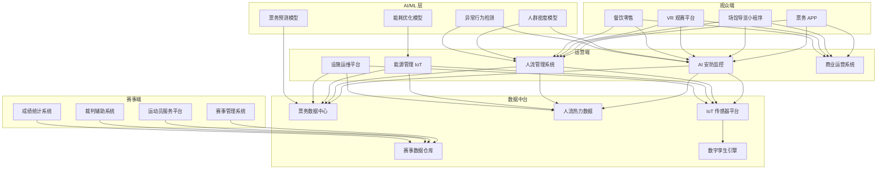
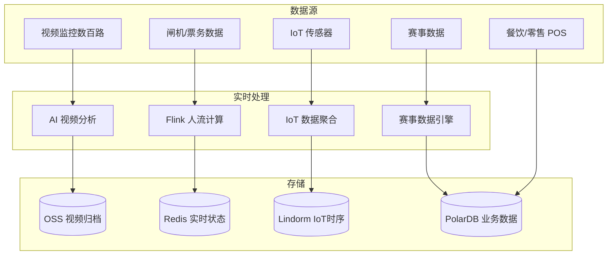

title: 智慧体育场馆架构设计
description: '# 智慧体育场馆架构设计 — 阿里云视角'
category: application-architecture
tags:
- k8s
- architecture
- industry
- [[Prometheus|prometheus]]
- grafana
- opa
- redis
- mysql
- webhook
- gpu
last_updated: '2026-05-18'
difficulty: advanced
reading_level: advanced
audience:
- 体育科技架构师
- 场馆运营系统开发者
- 视频AI工程师
- 阿里云解决方案架构师
estimated_read_time: 5min
intent_queries:
- 智慧体育场馆系统架构设计
- AI安防监控K8s GPU部署
- 数字孪生场馆3D可视化
- 赛事直播CDN低延迟
- 场馆人流密度检测
trigger_keywords:
- 智慧体育场馆
- 赛事运营
- 数字孪生
- AI安防
- 人流密度
- 赛事直播
- 票务系统
- 无感入场
- 场馆能耗
- 应急指挥
related_domains:
- domain-01-cluster-fundamentals
- domain-9-ai-ml
- domain-7-observability
- domain-03-networking-traffic
related_topics:
- domain-20-application-patterns/topic-application-architecture/74-immersive-xr
- domain-20-application-patterns/topic-application-architecture/14-smart-healthcare-architecture
- domain-02-workloads-applications/topic-functions/04-high-concurrency-system
- domain-02-workloads-applications/topic-functions/03-observability-monitoring
authors:
- name: KUDIG Team
  role: contributor
k8s_versions:
- '1.28'
- '1.29'
- '1.30'
- '1.31'
- '1.32'
---

# 智慧体育场馆架构设计 — 阿里云视角

> **适用版本**: Kubernetes v1.29 - v1.33 | **最后更新**: 2026-04-24
> **作者**: 阿里云解决方案架构师 | **标签**: `#智慧体育场馆` `#赛事运营` `#观众体验` `#数字孪生场馆` `#阿里云`

---

<!-- chunk: 目录 -->## 目录

1. [行业概述](#1-行业概述)
2. [业务场景](#2-业务场景)
3. [架构设计](#3-架构设计)
4. [核心技术栈](#4-核心技术栈)
5. [Kubernetes 部署方案](#5-kubernetes-部署方案)
6. [数据架构](#6-数据架构)
7. [AI/ML 组件](#7-aiml-组件)
8. [安全与合规](#8-安全与合规)
9. [最佳实践](#9-最佳实践)
10. [反模式](#10-反模式)
11. [参考资源](#11-参考资源)

---

<!-- chunk: 1. 行业概述 -->## 1. 行业概述

## 1.1 市场规模与趋势

智慧体育场馆融合数字技术与体育运营，提升赛事体验和运营效率。全球智慧场馆市场规模预计从 2024 年的 250 亿美元增长到 2030 年的 800 亿美元。驱动力包括大型赛事（奥运会/世界杯）、粉丝体验升级、场馆运营降本增效和绿色低碳要求。关键技术包括 5G+8K 直播、数字孪生场馆、AI 安防和 IoT 能耗管理。

| 指标 | 2024 年 | 2026 年（预测） | 2030 年（预测） |
|:---|:---|:---|:---|
| 全球智慧场馆市场规模 | $25B | $45B | $80B |
| 5G 场馆覆盖率 | 20% | 50% | 90% |
| AI 安防部署率 | 30% | 60% | 95% |
| 数字孪生场馆 | 100+ | 500+ | 2000+ |
| 场馆能耗降低率 | 10% | 20% | 35% |

## 1.2 行业痛点

| 痛点 | 说明 | 数字化转型驱动 |
|:---|:---|:---|
| 大人流管理 | 数万人同时入场/散场 | 高并发票务/闸机/人流分析 |
| 赛事直播 | 4K/8K 超低延迟直播 | CDN + 边缘节点 + 5G |
| 安防保障 | 突发事件应急响应 | AI 视频分析 + 人群密度监测 |
| 能耗管理 | 大型场馆绿色运营 | IoT + AI 优化空调/照明 |
| 多业态运营 | 赛时/平时灵活切换 | 业务中台 + 数字孪生 |

## 1.3 数字化转型架构影响

智慧体育场馆需要覆盖观众端（票务/导览/VR观赛/餐饮）、赛事端（赛事管理/运动员服务/裁判系统）、运营端（安防/人流/能源/设施/商业）和数据中台（票务/人流/赛事/IoT/数字孪生）。核心挑战是高峰期数万人同时在线的高并发处理和安防实时响应。

---

<!-- chunk: 2. 业务场景 -->## 2. 业务场景

## 2.1 智能票务与无感入场

电子票务系统支持人脸识别入场、动态定价、防黄牛。闸机以 > 30 人/分钟/通道速度通行，入场数据实时同步至人流管理系统。支持多种票务渠道（官方APP/小程序/第三方平台）统一库存管理。

## 2.2 多机位 VR 赛事直播

部署数十个机位（含无人机/机器人/运动员佩戴），支持观众自由切换视角。4K/8K 编码后通过 CDN 分发至观众手机/VR 设备，端到端延迟 < 3 秒。叠加实时数据（球员数据/速度/轨迹）增强观赛体验。

## 2.3 AI 安防监控

全场馆部署数百路 AI 摄像头，实时分析人群密度、异常行为（打斗/闯入/烟火）、物品遗留。异常事件 5 秒内告警至指挥中心，联动安保人员处置。

## 2.4 智慧停车与无感支付

车位引导系统实时显示各区域剩余车位，支持车牌识别入场/出场、无感支付。潮汐调度根据赛事时间动态开放/关闭停车区域。新能源充电桩集成管理。

## 2.5 数字孪生场馆运营

构建场馆三维数字孪生模型，叠加 IoT 实时数据（人流/能耗/设备状态）。支持远程巡检、能耗优化模拟、应急预案演练和设施全生命周期管理。

---

<!-- chunk: 3. 架构设计 -->## 3. 架构设计

## 3.1 智慧体育场馆全景架构



---

<!-- chunk: 4. 核心技术栈 -->## 4. 核心技术栈

| Component | Purpose | Technology | License |
|:---|:---|:---|:---|
| Container Orchestration | Platform management | ACK Pro + GPU | Proprietary |
| CDN | Live streaming delivery | Aliyun CDN + DCDN | Proprietary |
| Live Streaming | 4K/8K video encoding | 阿里云视频直播 | Proprietary |
| AI Vision | Security behavior analysis | PAI + 视觉智能 | Proprietary |
| Object Detection | Person/crowd detection | YOLOv8 / RT-DETR | GPL / Apache 2.0 |
| IoT Platform | Sensor management | 阿里云 IoT 平台 | Proprietary |
| Time-Series DB | Sensor data | Lindorm TSDB | Proprietary |
| Relational DB | Business data | PolarDB MySQL | Proprietary |
| Cache | Hot data | Redis Enterprise | Proprietary |
| Message Queue | Event streaming | RocketMQ 5.x | Apache 2.0 |
| Object Storage | Video archive & assets | OSS | Proprietary |
| 3D Rendering | Digital twin visualization | DataV / Cesium | Proprietary / Apache 2.0 |
| Monitoring | Observability | ARMS + SLS + Grafana | Proprietary / Apache 2.0 |

---

<!-- chunk: 5. Kubernetes 部署方案 -->## 5. Kubernetes 部署方案

## 5.1 AI 安防分析 GPU Deployment

```yaml
apiVersion: apps/v1
kind: Deployment
metadata:
  name: venue-security-ai
  namespace: smart-venue
  labels:
    app: venue-security-ai
    tier: ai-inference
spec:
  replicas: 6
  selector:
    matchLabels:
      app: venue-security-ai
  strategy:
    rollingUpdate:
      maxSurge: 1
      maxUnavailable: 0
  template:
    metadata:
      labels:
        app: venue-security-ai
        tier: ai-inference
      annotations:
        prometheus.io/scrape: "true"
        prometheus.io/port: "9090"
    spec:
      nodeSelector:
        accelerator: nvidia-t4
        node-pool: venue-ai
      runtimeClassName: nvidia
      containers:
        - name: analyzer
          image: registry.cn-hangzhou.aliyuncs.com/venue/security-ai:v3.0.0-gpu
          ports:
            - containerPort: 8080
              name: http
            - containerPort: 9090
              name: metrics
          env:
            - name: VIDEO_STREAMS
              value: "300"
            - name: DETECTION_CLASSES
              value: "crowd_density,abnormal_behavior,fire_smoke,intrusion,left_luggage"
            - name: ALERT_THRESHOLD
              value: "0.80"
            - name: CROWD_DENSITY_LEVELS
              value: "low,medium,high,critical"
            - name: ALERT_WEBHOOK
              valueFrom:
                secretKeyRef:
                  name: venue-secrets
                  key: alert-webhook-url
          resources:
            requests:
              nvidia.com/gpu: 1
              memory: "8Gi"
              cpu: "4000m"
            limits:
              nvidia.com/gpu: 1
              memory: "16Gi"
              cpu: "8000m"
          readinessProbe:
            httpGet:
              path: /health/ready
              port: 8080
            initialDelaySeconds: 30
            periodSeconds: 5
          livenessProbe:
            httpGet:
              path: /health/live
              port: 8080
            initialDelaySeconds: 60
            periodSeconds: 10
```

## 5.2 票务服务 Deployment

```yaml
apiVersion: apps/v1
kind: Deployment
metadata:
  name: ticketing-service
  namespace: smart-venue
spec:
  replicas: 8
  selector:
    matchLabels:
      app: ticketing-service
  template:
    metadata:
      labels:
        app: ticketing-service
    spec:
      containers:
        - name: ticketing
          image: registry.cn-hangzhou.aliyuncs.com/venue/ticketing:v3.0.0
          ports:
            - containerPort: 8080
          env:
            - name: MAX_QPS
              value: "50000"
            - name: ANTI_SCALPER_ENABLED
              value: "true"
            - name: FACE_VERIFY_URL
              value: "http://face-service:8080/verify"
            - name: REDIS_CLUSTER
              valueFrom:
                secretKeyRef:
                  name: venue-secrets
                  key: redis-url
          resources:
            requests:
              memory: "2Gi"
              cpu: "1000m"
            limits:
              memory: "4Gi"
              cpu: "2000m"
```

## 5.3 ConfigMap, Service 与 Secret

```yaml
apiVersion: v1
kind: ConfigMap
metadata:
  name: venue-config
  namespace: smart-venue
data:
  security-rules: |
    {
      "crowd_density": {"low": 0.5, "medium": 1.0, "high": 2.0, "critical": 3.0},
      "alert_routing": {
        "fire_smoke": "emergency",
        "abnormal_behavior": "security",
        "crowd_density_critical": "operations",
        "intrusion": "security"
      }
    }
  livestream-config: |
    {
      "encoding": "h265",
      "resolution": "3840x2160",
      "bitrate_mbps": 25,
      "latency_target_s": 3,
      "cameras": 32,
      "multi_view_enabled": true
    }
  energy-config: |
    {
      "hvac_zones": 20,
      "lighting_zones": 50,
      "occupied_mode": "comfort",
      "unoccupied_mode": "eco",
      "peak_shaving_kw": 500
    }
---
apiVersion: v1
kind: Service
metadata:
  name: venue-security-ai
  namespace: smart-venue
spec:
  selector:
    app: venue-security-ai
  ports:
    - name: http
      port: 8080
      targetPort: 8080
    - name: metrics
      port: 9090
      targetPort: 9090
  type: ClusterIP
---
apiVersion: v1
kind: Secret
metadata:
  name: venue-secrets
  namespace: smart-venue
type: Opaque
stringData:
  alert-webhook-url: "https://ops.venue.example.com/api/security-alerts"
  redis-url: "redis://:password@redis-venue.rds.aliyuncs.com:6379/0"
  db-connection: "mysql://venue@polardb.venue.rds.aliyuncs.com:3306/venue_db"
  cdn-api-key: "cdn-auth-key-placeholder"
```

---

<!-- chunk: 6. 数据架构 -->## 6. 数据架构

## 6.1 场馆数据流全景



## 6.2 数据流说明

- **视频流**: RTSP 流经边缘 AI 分析后，关键帧和告警截图上传 OSS
- **人流数据**: 闸机/摄像头人流数据经 Flink 实时计算生成热力图
- **IoT 数据**: 空调/照明/电梯传感器数据聚合后驱动能耗优化
- **赛事数据**: 实时比分/球员数据推送至大屏和观众 APP

---

<!-- chunk: 7. AI/ML 组件 -->## 7. AI/ML 组件

## 7.1 核心模型

| 模型 | 用途 | 输入 | 输出 | 框架 |
|:---|:---|:---|:---|:---|
| 人群密度估计 | 区域人群密度监测 | 俯视视频 | 密度热力图 | CSRNet |
| 异常行为检测 | 打斗/闯入/烟火 | 视频片段 | 行为类别 + 位置 | SlowFast |
| 人脸识别 | 票务入场核验 | 人脸图像 | 身份 ID | ArcFace |
| 能耗预测 | 场馆能耗优化 | 历史/天气/赛事日程 | 预测能耗 + 调优建议 | LSTM |
| 票务预测 | 动态定价与需求预测 | 历史售票/赛事热度 | 最优定价 | XGBoost |
| 停车预测 | 车位需求预测 | 赛事时间/历史数据 | 预测车位需求 | Prophet |

---

<!-- chunk: 8. 安全与合规 -->## 8. 安全与合规

## 8.1 行业法规与标准

| 法规/标准 | 适用范围 | 架构要求 |
|:---|:---|:---|
| 大型群众性活动安全管理条例 | 大型赛事安全 | 人流监测 + 应急预案 |
| 等保三级 | 场馆信息系统 | 网络安全 + 数据保护 |
| 个人信息保护法 | 观众隐私保护 | 人脸数据脱敏 + 最小化 |
| 食品安全法 | 场馆餐饮安全 | 溯源系统 |
| 消防法 | 场馆消防安全 | 烟火检测 + 疏散引导 |
| 体育法 | 赛事管理合规 | 裁判系统公正性 |

## 8.2 安全架构要点

- **视频隐私**: 视频分析在边缘端完成，原始视频不上传，人脸数据脱敏存储
- **票务防刷**: 智能识别黄牛行为，IP/设备/行为多维度风控
- **支付安全**: PCI-DSS 合规，支付信息令牌化
- **应急预案**: 系统问题时切换到基础安防模式，疏散系统独立供电

---

<!-- chunk: 9. 最佳实践 -->## 9. 最佳实践

1. **边缘 AI 优先**: 视频行为分析在场馆边缘机房完成，仅上传结构化结果，降低延迟和带宽
2. **CDN 预热**: 赛前 1 小时预热直播 CDN 节点，确保开赛时观众无卡顿
3. **弹性伸缩**: 赛前自动扩容票务和直播服务，赛后自动缩容节省成本
4. **人流分级管控**: 根据人群密度自动触发分级管控（蓝/黄/橙/红）
5. **能耗智能调度**: 根据赛事日程和天气预测，AI 优化空调和照明策略
6. **多运营商 5G**: 场馆内部署多运营商 5G 室分系统，确保数万人同时上网
7. **数字孪生辅助运营**: 场馆数字孪生叠加实时 IoT 数据，远程巡检替代人工巡检
8. **餐饮预测备货**: 根据赛事类型和观众画像预测餐饮需求，减少浪费
9. **赛后快速复盘**: 赛事结束后自动生成运营报告（人流/安防/能耗/收入）
10. **绿色低碳**: IoT + AI 优化能耗，实现场馆运营碳排放降低 20%+

---

<!-- chunk: 10. 反模式 -->## 10. 反模式

1. **全量视频上云**: 将数百路视频全量上传云端分析，带宽不足导致延迟。应边缘端 AI 分析
2. **忽视峰值设计**: 系统按日常负载设计，赛事时系统崩溃。应按峰值 10 倍设计并弹性伸缩
3. **单一人流监测**: 仅依赖闸机数据估算人流，精度不够。应融合视频/闸机/WiFi 多源数据
4. **安防告警风暴**: 所有告警统一推送给值班人员，关键告警被淹没。应分级告警和多通道推送
5. **忽视平时运营**: 仅关注赛时功能，平时场馆利用率低。应设计赛时/平时灵活切换架构

---

<!-- chunk: 11. 参考资源 -->## 11. 参考资源

- [大型群众性活动安全管理条例](https://www.gov.cn/)
- [阿里云视频直播文档](https://help.aliyun.com/product/29949.html)
- [YOLOv8 Object Detection](https://github.com/ultralytics/ultralytics)
- [Cesium 3D Digital Twin](https://cesium.com/)
- [DataV 数据可视化](https://help.aliyun.com/product/446557.html)
- [阿里云 CDN 文档](https://help.aliyun.com/product/270996.html)

---

**维护者**: 阿里云解决方案架构师团队 | **许可证**: MIT

---

<!-- chunk: Obsidian 相关文档 -->## Obsidian 相关文档

- topic-application-architecture MOC
- [[domain-20-application-patterns/topic-application-architecture/README.md|Topic 应用层架构设计最佳实践]]
- [[domain-20-application-patterns/topic-application-architecture/01-ecommerce-architecture.md|电商系统 Kubernetes 生产架构设计]]
- [[domain-20-application-patterns/topic-application-architecture/02-mini-program-architecture.md|小程序平台架构设计]]
- [[domain-20-application-patterns/topic-application-architecture/03-cms-architecture.md|内容管理系统 CMS 架构设计]]
- [[domain-20-application-patterns/topic-application-architecture/04-im-rtc-architecture.md|实时通信 IM/RTC 架构设计]]
- [[domain-20-application-patterns/topic-application-architecture/05-online-education-architecture.md|在线教育平台 Kubernetes 生产架构设计]]
- [[domain-20-application-patterns/topic-application-architecture/06-fintech-architecture.md|金融科技FinTech Kubernetes生产架构设计]]
- [[domain-20-application-patterns/topic-application-architecture/07-iot-platform-architecture.md|物联网 IoT 平台架构设计]]
- [[domain-20-application-patterns/topic-application-architecture/08-ai-ml-inference-architecture.md|AI/ML 推理服务 Kubernetes 生产架构设计]]
- [[domain-20-application-patterns/topic-application-architecture/09-gaming-backend-architecture.md|游戏后端 Kubernetes 生产架构设计]]
- [[domain-20-application-patterns/topic-application-architecture/10-social-media-architecture.md|社交媒体平台Kubernetes生产架构设计]]

## See Also

- 90-neuromorphic-computing
- 91-urban-air-mobility
- 93-digital-twin-factory
- 94-smart-prison

## Related

- topic-application-architecture MOC — Cross-reference
