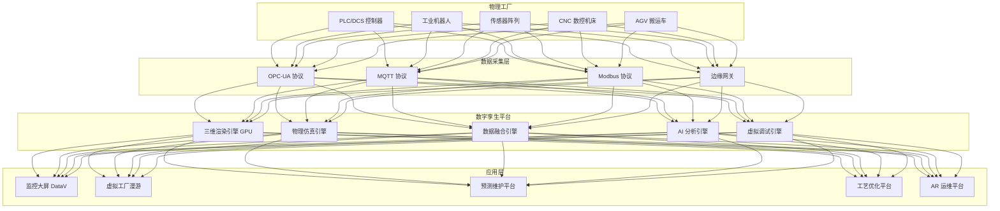
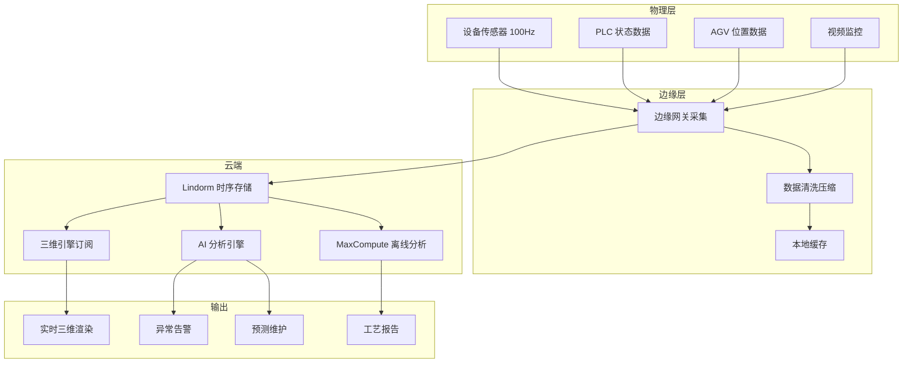

# 数字孪生工厂架构设计 — 阿里云视角

> **适用版本**: Kubernetes v1.29 - v1.33 | **最后更新**: 2026-04-24
> **作者**: 阿里云解决方案架构师 | **标签**: `#数字孪生工厂` `#工业元宇宙` `#虚拟调试` `#预测性维护` `#阿里云`

---

## 目录

1. [行业概述](#1-行业概述)
2. [业务场景](#2-业务场景)
3. [架构设计](#3-架构设计)
4. [核心技术栈](#4-核心技术栈)
5. [Kubernetes 部署方案](#5-kubernetes-部署方案)
6. [数据架构](#6-数据架构)
7. [AI/ML 组件](#7-aiml-组件)
8. [安全与合规](#8-安全与合规)
9. [最佳实践](#9-最佳实践)
10. [反模式](#10-反模式)
11. [参考资源](#11-参考资源)

---

## 1. 行业概述

### 1.1 市场规模与趋势

数字孪生工厂将物理产线实时映射到虚拟空间，实现全生命周期管理。全球数字孪生制造市场规模预计从 2024 年的 120 亿美元增长到 2030 年的 800 亿美元。西门子、达索、PTC、NVIDIA 等引领行业发展。核心价值包括：新产线虚拟调试节省 60%+ 调试时间、预测性维护降低 30% 停机时间、工艺优化提升 15% 产能。

| 指标 | 2024 年 | 2026 年（预测） | 2030 年（预测） |
|:---|:---|:---|:---|
| 全球数字孪生制造市场 | $12B | $30B | $80B |
| 数字孪生工厂部署数 | 2000+ | 5000+ | 20000+ |
| 物理虚拟映射延迟 | 100ms | 50ms | 10ms |
| 三维渲染帧率 | 30FPS | 60FPS | 120FPS |
| 预测性维护准确率 | 85% | 92% | 97% |

### 1.2 行业痛点

| 痛点 | 说明 | 数字化转型驱动 |
|:---|:---|:---|
| 实时映射 | 物理→虚拟毫秒级同步 | 高吞吐 IoT + 流式计算 |
| 模型精度 | 几何/物理/行为一致性 | GPU 渲染 + 物理仿真 |
| 数据融合 | 多源异构数据对齐 | 数据湖 + 时序库 |
| 虚拟调试 | 新产线零停机验证 | 仿真集群 + PLC 仿真 |
| 预测维护 | 设备故障提前预警 | AI 时序预测 |
| 安全隔离 | OT/IT 网络安全 | 工控安全 + 纵深防御 |

### 1.3 数字化转型架构影响

数字孪生工厂架构需要覆盖物理工厂层（PLC/机器人/传感器/CNC/AGV）、数据采集层（OPC-UA/MQTT/Modbus/边缘网关）、数字孪生平台层（三维渲染/物理仿真/数据融合/AI分析/虚拟调试）和应用层（监控大屏/虚拟工厂/预测维护/工艺优化/AR运维）。核心挑战是物理到虚拟的实时映射精度和大规模数据融合。

---

## 2. 业务场景

### 2.1 工厂三维可视化

将工厂产线、设备和环境构建为高精度三维模型，叠加 IoT 实时数据，在监控大屏上展示工厂运行状态。支持缩放、旋转、穿透查看和设备状态查询。渲染目标 > 30FPS，数据映射延迟 < 100ms。

### 2.2 PLC 虚拟调试

在新产线建设前，在虚拟环境中连接真实 PLC 程序进行调试验证。PLC 发出的控制指令驱动虚拟设备动作，传感器反馈信号回传至 PLC。虚拟调试可发现 80%+ 的逻辑错误，大幅缩短现场调试时间。

### 2.3 预测性维护

基于设备传感器数据（振动/温度/电流/压力），AI 模型预测设备健康度和剩余使用寿命（RUL）。在故障发生前 1-4 周发出预警，安排预防性维修。将非计划停机减少 30-50%。

### 2.4 工艺参数优化

通过仿真模拟不同工艺参数组合对产品质量和产能的影响，找到最优参数配置。支持 DOE（实验设计）和自动寻优。优化后的参数下发至 MES 系统。

### 2.5 AR 远程运维

现场工程师佩戴 AR 眼镜，数字孪生系统在设备上叠加维修指引、历史故障记录和备件信息。远程专家通过第一视角视频进行指导，维修步骤实时标注在 AR 眼镜中。

---

## 3. 架构设计

### 3.1 数字孪生工厂全景架构



---

## 4. 核心技术栈

| Component | Purpose | Technology | License |
|:---|:---|:---|:---|
| Container Orchestration | Platform management | ACK Pro + GPU | Proprietary |
| 3D Engine | Real-time rendering | Unreal Engine 5 / Unity | Proprietary |
| Physics Simulation | Mechanical simulation | NVIDIA PhysX / COMSOL | Proprietary |
| IoT Platform | Device data collection | 阿里云 IoT 平台 | Proprietary |
| OPC-UA | Industrial protocol | open62541 / OPC-UA SDK | MPL 2.0 |
| Time-Series DB | Sensor data | Lindorm TSDB | Proprietary |
| Relational DB | Business data | PolarDB MySQL | Proprietary |
| Data Lake | Large-scale analytics | OSS + MaxCompute | Proprietary |
| AI Platform | Predictive models | PAI / PyTorch | Proprietary / BSD |
| Visualization | 3D dashboards | DataV | Proprietary |
| Message Queue | Event streaming | RocketMQ 5.x | Apache 2.0 |
| Monitoring | Observability | ARMS + SLS + Grafana | Proprietary / Apache 2.0 |

---

## 5. Kubernetes 部署方案

### 5.1 三维渲染引擎 GPU StatefulSet

```yaml
apiVersion: apps/v1
kind: StatefulSet
metadata:
  name: twin-render-engine
  namespace: digital-twin-factory
spec:
  serviceName: twin-render
  replicas: 3
  selector:
    matchLabels:
      app: twin-render-engine
  template:
    metadata:
      labels:
        app: twin-render-engine
      annotations:
        prometheus.io/scrape: "true"
        prometheus.io/port: "9090"
    spec:
      nodeSelector:
        accelerator: nvidia-a10
        node-pool: twin-render
      runtimeClassName: nvidia
      containers:
        - name: render
          image: registry.cn-hangzhou.aliyuncs.com/twin/render-engine:v3.0.0-gpu
          ports:
            - containerPort: 8080
              name: http
            - containerPort: 9090
              name: metrics
          env:
            - name: RENDER_QUALITY
              value: "high"
            - name: PHYSICS_ENGINE
              value: "nvidia-physx"
            - name: TARGET_FPS
              value: "60"
            - name: MAX_TRIANGLES
              value: "100000000"
            - name: TEXTURE_STREAMING
              value: "true"
          resources:
            requests:
              nvidia.com/gpu: 1
              memory: "16Gi"
              cpu: "8000m"
            limits:
              nvidia.com/gpu: 1
              memory: "32Gi"
              cpu: "16000m"
          readinessProbe:
            httpGet:
              path: /health/ready
              port: 8080
            initialDelaySeconds: 30
            periodSeconds: 5
          livenessProbe:
            httpGet:
              path: /health/live
              port: 8080
            initialDelaySeconds: 60
            periodSeconds: 10
          volumeMounts:
            - name: factory-models
              mountPath: /models
            - name: render-cache
              mountPath: /cache
  volumeClaimTemplates:
    - metadata:
        name: factory-models
      spec:
        accessModes: ["ReadWriteOnce"]
        resources:
          requests:
            storage: 500Gi
    - metadata:
        name: render-cache
      spec:
        accessModes: ["ReadWriteOnce"]
        resources:
          requests:
            storage: 100Gi
```

### 5.2 数据采集服务 Deployment

```yaml
apiVersion: apps/v1
kind: Deployment
metadata:
  name: iot-data-collector
  namespace: digital-twin-factory
spec:
  replicas: 4
  selector:
    matchLabels:
      app: iot-data-collector
  template:
    metadata:
      labels:
        app: iot-data-collector
    spec:
      containers:
        - name: collector
          image: registry.cn-hangzhou.aliyuncs.com/twin/iot-collector:v2.0.0
          ports:
            - containerPort: 8080
          env:
            - name: PROTOCOLS
              value: "opc-ua,mqtt,modbus"
            - name: SAMPLING_RATE_HZ
              value: "100"
            - name: BATCH_SIZE
              value: "500"
            - name: EDGE_AGGREGATION
              value: "true"
          resources:
            requests:
              memory: "2Gi"
              cpu: "1000m"
            limits:
              memory: "4Gi"
              cpu: "2000m"
```

### 5.3 ConfigMap, Service 与 Secret

```yaml
apiVersion: v1
kind: ConfigMap
metadata:
  name: twin-config
  namespace: digital-twin-factory
data:
  render-config: |
    {
      "lod_levels": 4,
      "max_texture_resolution": 4096,
      "physics_substeps": 4,
      "shadow_quality": "high",
      "anti_aliasing": "taa"
    }
  opcua-servers: |
    [
      {"name": "line-1-plc", "endpoint": "opc.tcp://192.168.1.10:4840"},
      {"name": "line-2-plc", "endpoint": "opc.tcp://192.168.1.11:4840"},
      {"name": "robot-ctrl", "endpoint": "opc.tcp://192.168.1.20:4840"}
    ]
  iot-subscription: |
    {
      "mqtt_broker": "iot-platform.twin.svc.cluster.local:1883",
      "topics": ["factory/sensor/#", "factory/alarm/#"],
      "qos": 1
    }
---
apiVersion: v1
kind: Service
metadata:
  name: twin-render-engine
  namespace: digital-twin-factory
spec:
  selector:
    app: twin-render-engine
  ports:
    - name: http
      port: 8080
      targetPort: 8080
    - name: metrics
      port: 9090
      targetPort: 9090
  type: ClusterIP
---
apiVersion: v1
kind: Secret
metadata:
  name: twin-secrets
  namespace: digital-twin-factory
type: Opaque
stringData:
  db-connection: "mysql://twin@polardb.twin.rds.aliyuncs.com:3306/twin_db"
  opcua-password: "opc-ua-auth-password"
  encryption-key: "aes-256-gcm-key-placeholder"
```

---

## 6. 数据架构

### 6.1 物理到虚拟映射数据流



### 6.2 数据流说明

- **IoT 数据流**: 传感器以 100Hz 采集数据，经边缘网关压缩后写入 Lindorm
- **PLC 数据流**: OPC-UA 协议采集 PLC 状态，驱动虚拟设备实时联动
- **渲染数据流**: 三维引擎订阅 Lindorm 数据变更，实时更新模型状态
- **AI 数据流**: 时序数据喂入预测模型，输出设备健康度评分

---

## 7. AI/ML 组件

### 7.1 核心模型

| 模型 | 用途 | 输入 | 输出 | 框架 |
|:---|:---|:---|:---|:---|
| 预测性维护 | 设备故障预测 | 振动/温度/电流时序 | 故障概率 + RUL | Transformer |
| 质量预测 | 产品质量在线预测 | 工艺参数/原料属性 | 质量评分 | XGBoost |
| 异常检测 | 生产过程异常检测 | 多源传感器数据 | 异常类型 + 位置 | LSTM-AE |
| 能耗预测 | 工厂能耗优化 | 产量/天气/设备状态 | 能耗预测 + 节能建议 | LSTM |
| 视觉质检 | 产品外观缺陷检测 | 产品图像 | 缺陷类型 + 位置 | YOLOv8 |
| 产能优化 | 产线瓶颈分析 | 生产数据/设备状态 | 瓶颈位置 + 优化方案 | OR + RL |

---

## 8. 安全与合规

### 8.1 行业法规与标准

| 法规/标准 | 适用范围 | 架构要求 |
|:---|:---|:---|
| IEC 62443 | 工控系统信息安全 | OT/IT 网络隔离 |
| 等保三级 | 工业控制系统安全 | 纵深防御 |
| ISO 27001 | 信息安全管理体系 | 安全管理规范 |
| 工业数据安全 | 工艺数据保护 | 数据加密 + 权限控制 |
| GDPR / PIPL | 员工数据保护 | 视频数据脱敏 |

### 8.2 安全架构要点

- **OT/IT 隔离**: 工业控制网络与数字孪生平台网络隔离，通过安全网闸交换数据
- **工艺数据加密**: 核心工艺参数加密存储和传输
- **虚拟调试安全**: 虚拟调试环境与生产 PLC 完全隔离，不影响物理产线
- **访问审计**: 所有数据访问和操作完整审计

---

## 9. 最佳实践

1. **边缘数据预处理**: 在边缘网关完成数据清洗和压缩，减少云端负载
2. **LOD 分级渲染**: 根据视距动态切换模型精度，优化渲染性能
3. **虚拟调试先行**: 新产线先在虚拟环境完成 80%+ 调试再进入现场
4. **预测维护闭环**: AI 预警 → 维修计划 → 维修执行 → 结果反馈 → 模型优化
5. **工艺参数版本化**: 所有工艺参数变更版本化管理，支持回滚
6. **数据质量监控**: 持续监控传感器数据完整率和准确率
7. **OPC-UA 标准化**: 统一使用 OPC-UA 协议采集 PLC 数据
8. **数字孪生模型迭代**: 物理设备变更时及时更新数字模型
9. **GPU 渲染集群弹性**: 根据用户并发数动态调整 GPU 渲染实例
10. **跨工厂数字孪生**: 集团级多工厂数字孪生平台统一管理

---

## 10. 反模式

1. **忽视数据质量**: 不监控传感器数据质量，垃圾进垃圾出。应持续数据质量监控
2. **模型不更新**: 数字孪生模型与物理工厂脱节。应建立模型更新机制
3. **全量数据上云**: 将所有 100Hz 传感器数据全量上云，带宽和存储成本爆炸。应边缘聚合
4. **忽视 OT 安全**: 数字孪生平台直接访问工控网络，安全风险高。应 OT/IT 隔离
5. **过度渲染**: 追求超高渲染画质，忽略实时性。应在画质和帧率间平衡

---

## 11. 参考资源

- [NVIDIA Omniverse Industrial](https://www.nvidia.com/en-us/omniverse/solutions/industrial-digital-twins/)
- [Siemens Digital Twin](https://www.sw.siemens.com/)
- [OPC UA Specification](https://opcfoundation.org/about/opc-technologies/opc-ua/)
- [open62541 OPC-UA Stack](https://open62541.org/)
- [DataV 数据可视化](https://help.aliyun.com/product/446557.html)
- [阿里云 IoT 平台文档](https://help.aliyun.com/product/30520.html)

---

**维护者**: 阿里云解决方案架构师团队 | **许可证**: MIT

## Related

- [[domain-20-application-patterns/98-merged-indexes/MOC-from-domain-20-application-patterns|topic-application-architecture MOC]] — Cross-reference
