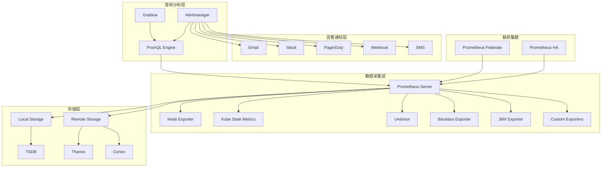

# Prometheus企业级监控系统深度实践

> **作者**: 监控系统架构专家 | **版本**: v1.0 | **更新时间**: 2026-02-07
> **适用场景**: 企业级监控平台架构 | **复杂度**: ⭐⭐⭐⭐⭐

## 🎯 摘要

本文档深入探讨了Prometheus企业级监控系统的架构设计、部署实践和运维管理，基于大规模生产环境的实践经验，提供从基础监控到高级告警的完整技术指南，帮助企业构建高效、可靠的监控体系。

## 1. Prometheus架构深度解析

### 1.1 核心组件架构



### 1.2 TSDB存储引擎详解

```yaml
TSDB存储特性:
  数据模型:
    - 时间序列标识: metric_name{label1=value1,label2=value2}
    - 样本数据: timestamp + value
    - 压缩存储: Gorilla压缩算法
    - 分块存储: 2小时为一个block
  
  性能优化:
    - 内存映射文件(MMap)
    - 倒排索引加速查询
    - WAL预写日志保证数据持久性
    - 块级别压缩减少存储空间
  
  存储策略:
    retention_time: 15d          # 数据保留时间
    block_duration: 2h           # 块持续时间
    compaction_strategy: "size"  # 压缩策略
```

## 2. 企业级部署架构

### 2.1 高可用部署方案

```yaml
# Prometheus HA集群部署
apiVersion: apps/v1
kind: StatefulSet
metadata:
  name: prometheus-server
  namespace: monitoring
spec:
  serviceName: prometheus-headless
  replicas: 2
  selector:
    matchLabels:
      app: prometheus
  template:
    metadata:
      labels:
        app: prometheus
    spec:
      affinity:
        podAntiAffinity:
          requiredDuringSchedulingIgnoredDuringExecution:
          - labelSelector:
              matchExpressions:
              - key: app
                operator: In
                values:
                - prometheus
            topologyKey: kubernetes.io/hostname
      containers:
      - name: prometheus
        image: prom/prometheus:v2.40.0
        args:
        - --config.file=/etc/prometheus/prometheus.yml
        - --storage.tsdb.path=/prometheus
        - --web.console.libraries=/etc/prometheus/console_libraries
        - --web.console.templates=/etc/prometheus/consoles
        - --storage.tsdb.retention.time=30d
        - --storage.tsdb.retention.size=50GB
        - --web.enable-lifecycle
        - --web.enable-admin-api
        - --web.external-url=http://prometheus.example.com
        - --web.route-prefix=/
        ports:
        - containerPort: 9090
          name: web
        resources:
          requests:
            memory: "2Gi"
            cpu: "1"
          limits:
            memory: "8Gi"
            cpu: "4"
        volumeMounts:
        - name: config-volume
          mountPath: /etc/prometheus
        - name: prometheus-storage
          mountPath: /prometheus
        livenessProbe:
          httpGet:
            path: /-/healthy
            port: web
          initialDelaySeconds: 30
          timeoutSeconds: 10
        readinessProbe:
          httpGet:
            path: /-/ready
            port: web
          initialDelaySeconds: 30
          timeoutSeconds: 10
      volumes:
      - name: config-volume
        configMap:
          name: prometheus-config
  volumeClaimTemplates:
  - metadata:
      name: prometheus-storage
    spec:
      accessModes: [ "ReadWriteOnce" ]
      storageClassName: "fast-ssd"
      resources:
        requests:
          storage: 100Gi
---
# Prometheus配置文件
apiVersion: v1
kind: ConfigMap
metadata:
  name: prometheus-config
  namespace: monitoring
data:
  prometheus.yml: |
    global:
      scrape_interval: 15s
      evaluation_interval: 15s
      external_labels:
        cluster: production
        replica: $(POD_NAME)
    
    rule_files:
      - "/etc/prometheus/rules/*.yml"
    
    scrape_configs:
      - job_name: 'prometheus'
        static_configs:
        - targets: ['localhost:9090']
      
      - job_name: 'kubernetes-nodes'
        kubernetes_sd_configs:
        - role: node
        relabel_configs:
        - source_labels: [__address__]
          regex: '(.*):10250'
          target_label: __address__
          replacement: '${1}:9100'
        - action: labelmap
          regex: __meta_kubernetes_node_label_(.+)
      
      - job_name: 'kubernetes-pods'
        kubernetes_sd_configs:
        - role: pod
        relabel_configs:
        - source_labels: [__meta_kubernetes_pod_annotation_prometheus_io_scrape]
          action: keep
          regex: true
        - source_labels: [__meta_kubernetes_pod_annotation_prometheus_io_path]
          action: replace
          target_label: __metrics_path__
          regex: (.+)
        - source_labels: [__address__, __meta_kubernetes_pod_annotation_prometheus_io_port]
          action: replace
          regex: ([^:]+)(?::\d+)?;(\d+)
          replacement: $1:$2
          target_label: __address__
        - action: labelmap
          regex: __meta_kubernetes_pod_label_(.+)
        - source_labels: [__meta_kubernetes_namespace]
          action: replace
          target_label: kubernetes_namespace
        - source_labels: [__meta_kubernetes_pod_name]
          action: replace
          target_label: kubernetes_pod_name
```

### 2.2 Thanos全局视图架构

```yaml
# Thanos Sidecar配置
apiVersion: apps/v1
kind: Deployment
metadata:
  name: thanos-sidecar
  namespace: monitoring
spec:
  replicas: 2
  selector:
    matchLabels:
      app: thanos-sidecar
  template:
    metadata:
      labels:
        app: thanos-sidecar
    spec:
      containers:
      - name: thanos-sidecar
        image: quay.io/thanos/thanos:v0.30.0
        args:
        - sidecar
        - --prometheus.url=http://localhost:9090
        - --grpc-address=0.0.0.0:10901
        - --http-address=0.0.0.0:10902
        - --objstore.config-file=/etc/thanos/objstore.yml
        - --tsdb.path=/prometheus
        - --reloader.config-file=/etc/prometheus/prometheus.yml
        - --reloader.rule-dir=/etc/prometheus/rules
        ports:
        - name: grpc
          containerPort: 10901
        - name: http
          containerPort: 10902
        volumeMounts:
        - name: prometheus-config
          mountPath: /etc/prometheus
        - name: objstore-config
          mountPath: /etc/thanos
        - name: prometheus-storage
          mountPath: /prometheus
      volumes:
      - name: prometheus-config
        configMap:
          name: prometheus-config
      - name: objstore-config
        configMap:
          name: thanos-objstore-config
      - name: prometheus-storage
        persistentVolumeClaim:
          claimName: prometheus-storage
---
# Thanos Query前端配置
apiVersion: apps/v1
kind: Deployment
metadata:
  name: thanos-query
  namespace: monitoring
spec:
  replicas: 2
  selector:
    matchLabels:
      app: thanos-query
  template:
    metadata:
      labels:
        app: thanos-query
    spec:
      containers:
      - name: thanos-query
        image: quay.io/thanos/thanos:v0.30.0
        args:
        - query
        - --grpc-address=0.0.0.0:10901
        - --http-address=0.0.0.0:10902
        - --query.replica-label=replica
        - --store=dnssrv+_grpc._tcp.thanos-sidecar.monitoring.svc.cluster.local
        - --store=dnssrv+_grpc._tcp.thanos-store.monitoring.svc.cluster.local
        - --store=dnssrv+_grpc._tcp.thanos-rule.monitoring.svc.cluster.local
        ports:
        - name: grpc
          containerPort: 10901
        - name: http
          containerPort: 10902
```

## 3. 监控指标体系设计

### 3.1 黄金信号监控

```yaml
# 核心业务指标监控
golden_signals:
  latency:
    description: "请求延迟分布"
    metrics:
      - histogram_quantile(0.5, rate(http_request_duration_seconds_bucket[5m]))
      - histogram_quantile(0.9, rate(http_request_duration_seconds_bucket[5m]))
      - histogram_quantile(0.99, rate(http_request_duration_seconds_bucket[5m]))
  
  traffic:
    description: "请求量和吞吐量"
    metrics:
      - rate(http_requests_total[5m])
      - rate(http_requests_total{status=~"5.."}[5m])
  
  errors:
    description: "错误率和成功率"
    metrics:
      - rate(http_requests_total{status=~"5.."}[5m]) / rate(http_requests_total[5m])
      - 1 - (sum(rate(http_requests_total{status!~"5.."}[5m])) / sum(rate(http_requests_total[5m])))
  
  saturation:
    description: "资源利用率"
    metrics:
      - 100 - (avg(rate(node_cpu_seconds_total{mode="idle"}[5m])) * 100)
      - 100 * (1 - avg(node_memory_MemAvailable_bytes) / avg(node_memory_MemTotal_bytes))
      - 100 * avg(node_filesystem_avail_bytes{mountpoint="/"} / node_filesystem_size_bytes{mountpoint="/"})

# 应用层指标
application_metrics:
  business_indicators:
    - orders_per_second
    - conversion_rate
    - user_sessions_active
    - payment_success_rate
  
  system_indicators:
    - goroutines_count
    - gc_duration_seconds
    - heap_alloc_bytes
    - response_size_bytes
```

### 3.2 Kubernetes监控指标

```yaml
# Kubernetes核心组件监控
kubernetes_monitoring:
  control_plane:
    apiserver:
      - apiserver_request_total
      - apiserver_request_duration_seconds
      - apiserver_current_inflight_requests
      - etcd_request_duration_seconds
    
    etcd:
      - etcd_mvcc_db_total_size_in_bytes
      - etcd_disk_wal_fsync_duration_seconds
      - etcd_network_client_grpc_received_bytes_total
      - etcd_server_has_leader
    
    controller_manager:
      - workqueue_depth
      - workqueue_queue_duration_seconds
      - node_collector_evictions_number
    
    scheduler:
      - scheduler_e2e_scheduling_duration_seconds
      - scheduler_pending_pods
      - scheduling_algorithm_duration_seconds
  
  workloads:
    pods:
      - kube_pod_status_ready
      - kube_pod_status_phase
      - container_cpu_usage_seconds_total
      - container_memory_working_set_bytes
      - container_network_receive_bytes_total
      - container_network_transmit_bytes_total
    
    deployments:
      - kube_deployment_status_replicas_available
      - kube_deployment_status_replicas_unavailable
      - kube_deployment_spec_replicas
      - kube_deployment_status_observed_generation
    
    services:
      - kube_service_info
      - kube_endpoint_address_available
      - kube_endpoint_address_not_ready
```

## 4. 告警规则设计

### 4.1 基础设施告警

```yaml
# 基础设施告警规则
apiVersion: monitoring.coreos.com/v1
kind: PrometheusRule
metadata:
  name: infrastructure-alerts
  namespace: monitoring
spec:
  groups:
  - name: node.rules
    rules:
    # 节点CPU使用率告警
    - alert: NodeCPUHigh
      expr: 100 - (avg(rate(node_cpu_seconds_total{mode="idle"}[5m])) * 100) > 85
      for: 5m
      labels:
        severity: warning
      annotations:
        summary: "节点CPU使用率过高 (instance {{ $labels.instance }})"
        description: "CPU使用率超过85%，当前值为{{ $value }}%"
    
    # 节点内存使用率告警
    - alert: NodeMemoryHigh
      expr: (1 - (node_memory_MemAvailable_bytes / node_memory_MemTotal_bytes)) * 100 > 90
      for: 5m
      labels:
        severity: critical
      annotations:
        summary: "节点内存使用率过高 (instance {{ $labels.instance }})"
        description: "内存使用率超过90%，当前值为{{ $value }}%"
    
    # 节点磁盘空间告警
    - alert: NodeDiskSpaceLow
      expr: (1 - (node_filesystem_free_bytes{fstype!="tmpfs"} / node_filesystem_size_bytes{fstype!="tmpfs"})) * 100 > 85
      for: 10m
      labels:
        severity: warning
      annotations:
        summary: "节点磁盘空间不足 (instance {{ $labels.instance }}, mountpoint {{ $labels.mountpoint }})"
        description: "磁盘使用率超过85%，当前值为{{ $value }}%"
    
    # 节点网络丢包告警
    - alert: NodeNetworkPacketLoss
      expr: rate(node_network_receive_drop_total[5m]) > 10
      for: 5m
      labels:
        severity: warning
      annotations:
        summary: "节点网络丢包 (instance {{ $labels.instance }})"
        description: "网络接收丢包率过高，当前值为{{ $value }}pps"
```

### 4.2 应用层告警

```yaml
# 应用层告警规则
  - name: application.rules
    rules:
    # HTTP错误率告警
    - alert: HighHttpErrorRate
      expr: rate(http_requests_total{status=~"5.."}[5m]) / rate(http_requests_total[5m]) > 0.05
      for: 2m
      labels:
        severity: critical
      annotations:
        summary: "HTTP错误率过高 (service {{ $labels.service }})"
        description: "5xx错误率超过5%，当前值为{{ $value | humanizePercentage }}"
    
    # HTTP延迟告警
    - alert: HighHttpLatency
      expr: histogram_quantile(0.99, rate(http_request_duration_seconds_bucket[5m])) > 2
      for: 2m
      labels:
        severity: warning
      annotations:
        summary: "HTTP延迟过高 (service {{ $labels.service }})"
        description: "99%请求延迟超过2秒，当前值为{{ $value }}秒"
    
    # 应用实例离线告警
    - alert: ApplicationInstanceDown
      expr: up{job=~"application.*"} == 0
      for: 1m
      labels:
        severity: critical
      annotations:
        summary: "应用实例离线 (instance {{ $labels.instance }})"
        description: "应用实例无法访问，可能已停止或网络故障"
    
    # 数据库连接池告警
    - alert: DatabaseConnectionPoolFull
      expr: db_connections_used / db_connections_max > 0.9
      for: 3m
      labels:
        severity: warning
      annotations:
        summary: "数据库连接池接近满载 (database {{ $labels.database }})"
        description: "连接池使用率超过90%，当前值为{{ $value | humanizePercentage }}"
```

## 5. Alertmanager配置管理

### 5.1 告警路由配置

```yaml
# Alertmanager配置
global:
  resolve_timeout: 5m
  smtp_smarthost: 'smtp.example.com:587'
  smtp_from: 'alertmanager@example.com'
  smtp_auth_username: 'alertmanager'
  smtp_auth_password: 'password'
  smtp_require_tls: true

route:
  group_by: ['alertname', 'cluster', 'service']
  group_wait: 30s
  group_interval: 5m
  repeat_interval: 3h
  receiver: 'default-receiver'
  
  routes:
  # 关键业务告警
  - match:
      severity: critical
    receiver: 'pagerduty'
    group_wait: 10s
    group_interval: 1m
    repeat_interval: 30m
  
  # 基础设施告警
  - match:
      severity: warning
    receiver: 'slack-warning'
    group_wait: 1m
    group_interval: 10m
    repeat_interval: 2h
  
  # 通知抑制规则
  - match_re:
      service: ^(mysql|redis|elasticsearch)$
    receiver: 'dba-team'
    continue: true

receivers:
- name: 'default-receiver'
  email_configs:
  - to: 'team@example.com'
    send_resolved: true

- name: 'pagerduty'
  pagerduty_configs:
  - service_key: 'YOUR_PAGERDUTY_SERVICE_KEY'
    send_resolved: true

- name: 'slack-warning'
  slack_configs:
  - api_url: 'https://hooks.slack.com/services/YOUR/SLACK/WEBHOOK'
    channel: '#monitoring-alerts'
    send_resolved: true
    title: '{{ template "slack.title" . }}'
    text: '{{ template "slack.text" . }}'

- name: 'dba-team'
  email_configs:
  - to: 'dba-team@example.com'
    send_resolved: true

# 抑制规则
inhibit_rules:
- source_match:
    severity: 'critical'
  target_match:
    severity: 'warning'
  equal: ['alertname', 'cluster', 'service']

templates:
- '/etc/alertmanager/template/*.tmpl'
```

## 6. 监控面板设计

### 6.1 Grafana仪表板配置

```json
{
  "dashboard": {
    "id": null,
    "title": "Kubernetes Cluster Overview",
    "timezone": "browser",
    "schemaVersion": 16,
    "version": 0,
    "refresh": "30s",
    "panels": [
      {
        "type": "graph",
        "title": "Cluster CPU Usage",
        "gridPos": {
          "h": 8,
          "w": 12,
          "x": 0,
          "y": 0
        },
        "targets": [
          {
            "expr": "100 - (avg(rate(node_cpu_seconds_total{mode=\"idle\"}[5m])) * 100)",
            "legendFormat": "CPU Usage %"
          }
        ],
        "alert": {
          "conditions": [
            {
              "evaluator": {
                "params": [85],
                "type": "gt"
              },
              "operator": {
                "type": "and"
              },
              "query": {
                "params": ["A", "5m", "now"]
              },
              "reducer": {
                "params": [],
                "type": "avg"
              },
              "type": "query"
            }
          ],
          "executionErrorState": "alerting",
          "frequency": "60s",
          "handler": 1,
          "name": "High CPU Usage alert",
          "noDataState": "no_data",
          "notifications": []
        }
      },
      {
        "type": "stat",
        "title": "Running Pods",
        "gridPos": {
          "h": 4,
          "w": 6,
          "x": 12,
          "y": 0
        },
        "targets": [
          {
            "expr": "sum(kube_pod_status_ready{condition=\"true\"})"
          }
        ]
      },
      {
        "type": "gauge",
        "title": "Memory Usage",
        "gridPos": {
          "h": 4,
          "w": 6,
          "x": 18,
          "y": 0
        },
        "targets": [
          {
            "expr": "(1 - avg(node_memory_MemAvailable_bytes) / avg(node_memory_MemTotal_bytes)) * 100"
          }
        ]
      }
    ]
  }
}
```

## 7. 性能优化与调优

### 7.1 Prometheus性能调优

```yaml
# Prometheus性能优化配置
performance_optimization:
  storage:
    # 增加存储保留时间
    retention_time: "90d"
    retention_size: "200GB"
    
    # 调整块大小
    block_duration: "2h"
    
    # 启用WAL压缩
    wal_compression: true
  
  scraping:
    # 调整抓取间隔
    scrape_interval: "30s"
    scrape_timeout: "10s"
    
    # 并发抓取设置
    scrape.parallelism: 20
    
    # 启用抓取压缩
    scrape.compression: "snappy"
  
  querying:
    # 查询超时设置
    query.timeout: "2m"
    query.max-concurrency: 20
    
    # 启用查询日志
    query.log-enabled: true
    
    # 查询缓存设置
    query.lookback-delta: "5m"
  
  resources:
    # 内存设置
    memory_limit: "16Gi"
    memory_request: "8Gi"
    
    # CPU设置
    cpu_limit: "8"
    cpu_request: "4"
```

### 7.2 查询优化技巧

```sql
-- PromQL查询优化示例

# 1. 使用rate而不是increase进行速率计算
# 好的做法
rate(http_requests_total[5m])

# 避免的做法
increase(http_requests_total[5m]) / 300

# 2. 合理使用聚合函数
# 好的做法 - 预聚合
sum by (instance) (rate(http_requests_total[5m]))

# 避免的做法 - 后聚合
sum(rate(http_requests_total[5m]))

# 3. 使用正则表达式优化标签匹配
# 好的做法
{job=~"application.*"}

# 避免的做法
{job="application-frontend"} or {job="application-backend"} or {job="application-api"}

# 4. 避免笛卡尔积查询
# 好的做法
sum(http_requests_total) by (job, instance)

# 避免的做法
http_requests_total * on(job) group_left(instance) kube_pod_info
```

## 8. 监控最佳实践

### 8.1 监控设计原则

```markdown
## 📊 监控设计最佳实践

### 1. 四个黄金信号 (Four Golden Signals)
- **延迟 (Latency)**: 请求响应时间分布
- **流量 (Traffic)**: 请求量和吞吐量
- **错误 (Errors)**: 错误率和成功率
- **饱和度 (Saturation)**: 资源利用率

### 2. RED方法论
- **Rate**: 每秒请求数
- **Errors**: 每秒错误数
- **Duration**: 请求持续时间

### 3. USE方法论 (Utilization Saturation Errors)
- **Utilization**: 资源使用率
- **Saturation**: 资源排队程度
- **Errors**: 错误事件数量

### 4. 监控分层策略
- 基础设施层监控
- 平台层监控
- 应用层监控
- 业务层监控
```

### 8.2 告警管理规范

```yaml
告警管理规范:
  告警级别:
    critical: "严重 - 需要立即响应"
    warning: "警告 - 需要关注"
    info: "信息 - 仅用于通知"
  
  告警生命周期:
    firing: "告警触发"
    resolved: "告警解决"
    silenced: "告警静默"
    inhibited: "告警抑制"
  
  告警质量要求:
    actionable: "告警必须可操作"
    specific: "告警信息要具体明确"
    timely: "告警要及时准确"
    deduplicated: "避免重复告警"
```

## 9. 故障排查与诊断

### 9.1 常见问题诊断

```bash
# Prometheus故障排查命令

# 1. 检查Prometheus状态
curl http://prometheus:9090/status

# 2. 查看目标抓取状态
curl http://prometheus:9090/targets

# 3. 检查TSDB状态
curl http://prometheus:9090/tsdb-status

# 4. 查看告警状态
curl http://prometheus:9090/alerts

# 5. 检查规则评估状态
curl http://prometheus:9090/rules

# 6. 分析查询性能
curl -G http://prometheus:9090/api/v1/query \
  --data-urlencode 'query=up' \
  --data-urlencode 'time=$(date +%s)' \
  | jq '.stats'

# 7. 检查存储使用情况
du -sh /prometheus/*
```

### 9.2 性能瓶颈分析

```python
#!/usr/bin/env python3
# prometheus_performance_analyzer.py

import requests
import json
import time
from datetime import datetime, timedelta

class PrometheusAnalyzer:
    def __init__(self, prometheus_url):
        self.prometheus_url = prometheus_url
        self.session = requests.Session()
    
    def get_tsdb_stats(self):
        """获取TSDB统计信息"""
        response = self.session.get(f"{self.prometheus_url}/api/v1/status/tsdb")
        return response.json()['data']
    
    def get_targets_stats(self):
        """获取目标抓取统计"""
        response = self.session.get(f"{self.prometheus_url}/api/v1/targets")
        targets = response.json()['data']['activeTargets']
        
        stats = {
            'total_targets': len(targets),
            'healthy_targets': 0,
            'unhealthy_targets': 0,
            'by_job': {}
        }
        
        for target in targets:
            job = target['labels']['job']
            if job not in stats['by_job']:
                stats['by_job'][job] = {'healthy': 0, 'unhealthy': 0}
            
            if target['health'] == 'up':
                stats['healthy_targets'] += 1
                stats['by_job'][job]['healthy'] += 1
            else:
                stats['unhealthy_targets'] += 1
                stats['by_job'][job]['unhealthy'] += 1
        
        return stats
    
    def get_series_cardinality(self):
        """获取时间序列基数"""
        query = "count(count by (__name__)({__name__=~'.+'}))"
        response = self.session.get(
            f"{self.prometheus_url}/api/v1/query",
            params={'query': query}
        )
        result = response.json()
        return int(result['data']['result'][0]['value'][1])
    
    def analyze_performance(self):
        """综合性能分析"""
        print("=== Prometheus性能分析报告 ===")
        print(f"分析时间: {datetime.now()}")
        print()
        
        # TSDB分析
        tsdb_stats = self.get_tsdb_stats()
        print("📊 TSDB统计:")
        print(f"  系列数量: {tsdb_stats.get('seriesCount', 'N/A')}")
        print(f"  标签值数量: {tsdb_stats.get('labelValueCount', 'N/A')}")
        print(f"  索引大小: {tsdb_stats.get('indexPostingStats', {}).get('postingsSizeSum', 'N/A')}")
        print()
        
        # 目标分析
        target_stats = self.get_targets_stats()
        print("🎯 抓取目标分析:")
        print(f"  总目标数: {target_stats['total_targets']}")
        print(f"  健康目标: {target_stats['healthy_targets']}")
        print(f"  不健康目标: {target_stats['unhealthy_targets']}")
        print("  按Job分布:")
        for job, counts in target_stats['by_job'].items():
            print(f"    {job}: {counts['healthy']} 健康, {counts['unhealthy']} 不健康")
        print()
        
        # 基数分析
        cardinality = self.get_series_cardinality()
        print("📈 时间序列基数:")
        print(f"  当前基数: {cardinality}")
        if cardinality > 1000000:
            print("  ⚠️  基数过高，可能存在标签爆炸问题")
        elif cardinality > 500000:
            print("  ℹ️  基数较高，建议优化标签使用")
        else:
            print("  ✅  基数正常")

if __name__ == "__main__":
    analyzer = PrometheusAnalyzer("http://localhost:9090")
    analyzer.analyze_performance()
```

## 10. 未来发展与趋势

### 10.1 监控技术演进

```yaml
监控技术发展趋势:
  1. 智能化监控:
     - AIOps集成
     - 异常检测自动化
     - 根因分析智能化
     - 预测性维护
  
  2. 云原生监控:
     - Service Mesh监控
     - Serverless监控
     - 多云统一监控
     - 边缘计算监控
  
  3. 可观察性增强:
     - 分布式追踪集成
     - 日志与指标关联
     - 业务指标下沉
     - 用户体验监控
```

---
*本文档基于企业级监控系统实践经验编写，持续更新最新技术和最佳实践。*