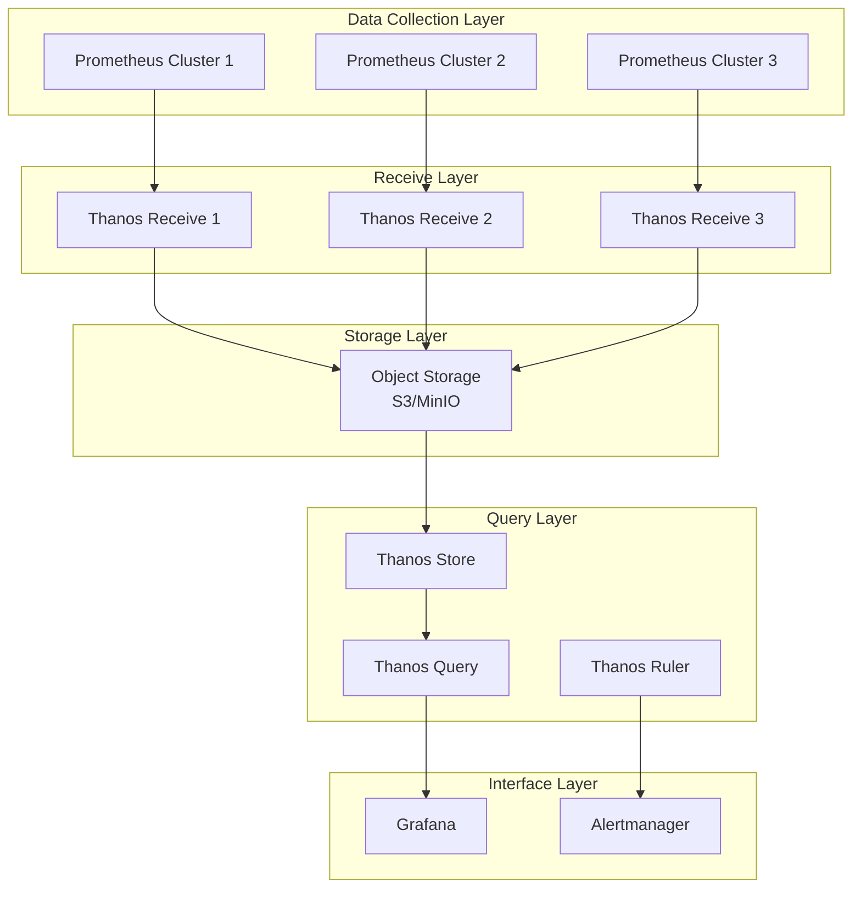

# Thanos Enterprise Metrics Federation and Long-term Storage

## 概述 (Overview)

Thanos 是一个开源的 Prometheus 高可用解决方案，提供全局查询视图、长期存储和跨集群联邦能力。本文档详细介绍 Thanos 企业级部署架构、联邦策略和长期存储管理。

Thanos is an open-source Prometheus high availability solution that provides global query views, long-term storage, and cross-cluster federation capabilities. This document details Thanos enterprise deployment architecture, federation strategies, and long-term storage management.

## 架构设计 (Architecture Design)

### 核心组件 (Core Components)

```yaml
# Thanos 架构组件
apiVersion: v1
kind: Namespace
metadata:
  name: thanos-system
---
apiVersion: apps/v1
kind: StatefulSet
metadata:
  name: thanos-receive
  namespace: thanos-system
spec:
  replicas: 3
  selector:
    matchLabels:
      app: thanos-receive
  template:
    metadata:
      labels:
        app: thanos-receive
    spec:
      containers:
      - name: thanos-receive
        image: quay.io/thanos/thanos:v0.34.0
        args:
        - "receive"
        - "--grpc-address=0.0.0.0:10901"
        - "--http-address=0.0.0.0:10902"
        - "--remote-write.address=0.0.0.0:19291"
        - "--objstore.config-file=/etc/thanos/objstore.yml"
        - "--tsdb.path=/var/thanos/receive"
        - "--tsdb.retention=15d"
        - "--label=receive_cluster=\"primary\""
        - "--hashrings-file=/etc/thanos/hashrings.json"
        ports:
        - containerPort: 10901
          name: grpc
        - containerPort: 10902
          name: http
        - containerPort: 19291
          name: remote-write
        volumeMounts:
        - name: data
          mountPath: /var/thanos/receive
        - name: config
          mountPath: /etc/thanos
  volumeClaimTemplates:
  - metadata:
      name: data
    spec:
      accessModes: ["ReadWriteOnce"]
      resources:
        requests:
          storage: 200Gi
```

### 联邦架构 (Federation Architecture)



## 部署配置 (Deployment Configuration)

### 对象存储配置 (Object Storage Configuration)

```yaml
# objstore.yml - 对象存储配置
type: S3
config:
  bucket: "thanos-metrics"
  endpoint: "s3.amazonaws.com"
  region: "us-west-2"
  access_key: "ACCESS_KEY"
  secret_key: "SECRET_KEY"
  insecure: false
  http_config:
    idle_conn_timeout: 90s
    response_header_timeout: 2m
    insecure_skip_verify: false
  signature_version2: false
  put_user_metadata: {}
  part_size: 134217728
```

### Hash Ring 配置 (Hash Ring Configuration)

```json
[
  {
    "hashring": "softmint-1",
    "endpoints": [
      "thanos-receive-0.thanos-receive.thanos-system.svc.cluster.local:10901",
      "thanos-receive-1.thanos-receive.thanos-system.svc.cluster.local:10901",
      "thanos-receive-2.thanos-receive.thanos-system.svc.cluster.local:10901"
    ]
  }
]
```

### Query 组件部署 (Query Component Deployment)

```yaml
apiVersion: apps/v1
kind: Deployment
metadata:
  name: thanos-query
  namespace: thanos-system
spec:
  replicas: 2
  selector:
    matchLabels:
      app: thanos-query
  template:
    metadata:
      labels:
        app: thanos-query
    spec:
      containers:
      - name: thanos-query
        image: quay.io/thanos/thanos:v0.34.0
        args:
        - "query"
        - "--grpc-address=0.0.0.0:10901"
        - "--http-address=0.0.0.0:9090"
        - "--query.replica-label=receive_cluster"
        - "--store=dnssrv+_grpc._tcp.thanos-store.thanos-system.svc.cluster.local"
        - "--store=dnssrv+_grpc._tcp.thanos-receive.thanos-system.svc.cluster.local"
        - "--query.auto-downsampling"
        ports:
        - containerPort: 10901
          name: grpc
        - containerPort: 9090
          name: http
        livenessProbe:
          httpGet:
            path: /-/healthy
            port: 9090
          initialDelaySeconds: 30
          periodSeconds: 30
```

## 联邦策略 (Federation Strategy)

### 数据分片策略 (Data Sharding Strategy)

```yaml
# 联邦配置示例
global:
  scrape_interval: 15s
  evaluation_interval: 15s

# 全局指标收集
scrape_configs:
  # Kubernetes 服务发现
  - job_name: 'kubernetes-nodes'
    kubernetes_sd_configs:
    - role: node
    relabel_configs:
    - source_labels: [__address__]
      regex: '(.*):10250'
      target_label: __address__
      replacement: '${1}:9100'
    metric_relabel_configs:
    - source_labels: [__name__]
      regex: '(node_cpu|node_memory|node_disk)'
      action: keep

  # 应用指标收集
  - job_name: 'application-metrics'
    kubernetes_sd_configs:
    - role: pod
    relabel_configs:
    - source_labels: [__meta_kubernetes_pod_annotation_prometheus_io_scrape]
      action: keep
      regex: true
    - source_labels: [__meta_kubernetes_pod_annotation_prometheus_io_path]
      action: replace
      target_label: __metrics_path__
      regex: (.+)
    - source_labels: [__address__, __meta_kubernetes_pod_annotation_prometheus_io_port]
      action: replace
      regex: ([^:]+)(?::\d+)?;(\d+)
      replacement: $1:$2
      target_label: __address__
```

### 跨集群联邦 (Cross-cluster Federation)

```yaml
# 跨集群联邦配置
- job_name: 'federate'
  scrape_interval: 15s
  honor_labels: true
  metrics_path: '/federate'
  params:
    'match[]':
      - '{job=~"kubernetes-.*"}'
      - '{__name__=~"job:.*"}'
  static_configs:
  - targets:
    - 'prometheus-cluster1.example.com:9090'
    - 'prometheus-cluster2.example.com:9090'
    - 'prometheus-cluster3.example.com:9090'
  relabel_configs:
  - source_labels: [__address__]
    target_label: cluster
    replacement: '$1'
```

## 长期存储管理 (Long-term Storage Management)

### 数据保留策略 (Data Retention Policy)

```yaml
# 数据保留配置
apiVersion: batch/v1
kind: CronJob
metadata:
  name: thanos-compact
  namespace: thanos-system
spec:
  schedule: "0 2 * * *"  # 每天凌晨2点执行
  jobTemplate:
    spec:
      template:
        spec:
          containers:
          - name: thanos-compact
            image: quay.io/thanos/thanos:v0.34.0
            args:
            - "compact"
            - "--data-dir=/var/thanos/compact"
            - "--objstore.config-file=/etc/thanos/objstore.yml"
            - "--retention.resolution-raw=30d"
            - "--retention.resolution-5m=90d"
            - "--retention.resolution-1h=365d"
            - "--wait"
            volumeMounts:
            - name: data
              mountPath: /var/thanos/compact
            - name: config
              mountPath: /etc/thanos
          volumes:
          - name: data
            emptyDir: {}
          - name: config
            configMap:
              name: thanos-config
          restartPolicy: OnFailure
```

### 存储成本优化 (Storage Cost Optimization)

```bash
#!/bin/bash
# 存储成本优化脚本

# 计算存储使用情况
calculate_storage_usage() {
    echo "=== Storage Usage Analysis ==="
    
    # 获取对象存储使用情况
    aws s3 ls s3://thanos-metrics --recursive --human-readable --summarize | \
    grep "Total Size:"
    
    # 分析不同时间序列的成本
    kubectl exec -n thanos-system deploy/thanos-query -- \
    curl -s "http://localhost:9090/api/v1/query?query=count({__name__=~'.+'})" | \
    jq '.data.result[].value[1]' | \
    sort -nr | \
    head -10
}

# 优化存储配置
optimize_storage() {
    echo "=== Storage Optimization ==="
    
    # 调整压缩级别
    kubectl patch cm thanos-config -n thanos-system -p '{
        "data": {
            "compaction.level": "3",
            "block-duration": "2h"
        }
    }'
    
    # 清理过期数据
    kubectl exec -n thanos-system sts/thanos-store -- \
    thanos tools bucket retention \
    --objstore.config-file=/etc/thanos/objstore.yml \
    --resolution-raw=30d \
    --resolution-5m=90d \
    --resolution-1h=365d
}
```

## 查询优化 (Query Optimization)

### 查询性能调优 (Query Performance Tuning)

```yaml
# Query Frontend 配置
apiVersion: apps/v1
kind: Deployment
metadata:
  name: thanos-query-frontend
  namespace: thanos-system
spec:
  replicas: 2
  selector:
    matchLabels:
      app: thanos-query-frontend
  template:
    metadata:
      labels:
        app: thanos-query-frontend
    spec:
      containers:
      - name: thanos-query-frontend
        image: quay.io/thanos/thanos:v0.34.0
        args:
        - "query-frontend"
        - "--http-address=0.0.0.0:9090"
        - "--query-frontend.compress-responses"
        - "--query-frontend.log-queries-longer-than=5s"
        - "--query-frontend.downstream-url=http://thanos-query:9090"
        - "--query-range.split-interval=24h"
        - "--query-range.max-retries-per-request=5"
        - "--cache-compression-type=snappy"
        ports:
        - containerPort: 9090
          name: http
        resources:
          requests:
            cpu: "1"
            memory: "2Gi"
          limits:
            cpu: "2"
            memory: "4Gi"
```

### 缓存策略 (Cache Strategy)

```yaml
# 查询缓存配置
query_frontend:
  cache:
    type: memcached
    config:
      addresses: ["memcached.thanos-system.svc.cluster.local:11211"]
      timeout: 500ms
      max_idle_conns: 100
      max_async_buffer_size: 10000
      max_async_concurrency: 20
      
  query_range:
    split_interval: 24h
    max_retries: 5
    max_query_length: 168h
    max_query_parallelism: 14
    response_cache_max_freshness: 1m
```

## 监控告警 (Monitoring and Alerting)

### 关键指标监控 (Key Metrics Monitoring)

```yaml
# Thanos 监控规则
groups:
- name: thanos.rules
  rules:
  # Receive 组件监控
  - alert: ThanosReceiveDown
    expr: up{job="thanos-receive"} == 0
    for: 5m
    labels:
      severity: critical
    annotations:
      summary: "Thanos Receive component is down"
      description: "{{ $labels.instance }} of job {{ $labels.job }} has been down for more than 5 minutes."

  - alert: ThanosReceiveHighIngestionLatency
    expr: histogram_quantile(0.99, rate(thanos_receive_write_latency_seconds_bucket[5m])) > 5
    for: 10m
    labels:
      severity: warning
    annotations:
      summary: "High ingestion latency in Thanos Receive"
      description: "99th percentile of write latency is above 5 seconds for more than 10 minutes."

  # Query 组件监控
  - alert: ThanosQueryHighLatency
    expr: histogram_quantile(0.99, rate(http_request_duration_seconds_bucket{job="thanos-query"}[5m])) > 10
    for: 5m
    labels:
      severity: warning
    annotations:
      summary: "High query latency in Thanos Query"
      description: "99th percentile of query latency is above 10 seconds."

  # 存储组件监控
  - alert: ThanosStoreSlowQueries
    expr: thanos_store_queries_dropped_total > 0
    for: 5m
    labels:
      severity: warning
    annotations:
      summary: "Thanos Store dropping queries"
      description: "Thanos Store is dropping queries due to slow performance."

  # 磁盘空间监控
  - alert: ThanosDiskSpaceLow
    expr: (node_filesystem_avail_bytes{mountpoint="/var/thanos"} / node_filesystem_size_bytes{mountpoint="/var/thanos"}) * 100 < 10
    for: 5m
    labels:
      severity: critical
    annotations:
      summary: "Low disk space for Thanos"
      description: "Available disk space is below 10% on {{ $labels.instance }}."
```

### 可视化仪表板 (Visualization Dashboard)

```json
{
  "dashboard": {
    "title": "Thanos Enterprise Monitoring",
    "panels": [
      {
        "title": "Receive Ingestion Rate",
        "type": "graph",
        "targets": [
          {
            "expr": "rate(thanos_receive_write_requests_total[5m])",
            "legendFormat": "{{instance}}"
          }
        ]
      },
      {
        "title": "Query Latency",
        "type": "heatmap",
        "targets": [
          {
            "expr": "histogram_quantile(0.99, rate(http_request_duration_seconds_bucket{job=\"thanos-query\"}[5m]))",
            "legendFormat": "99th percentile"
          }
        ]
      },
      {
        "title": "Storage Utilization",
        "type": "gauge",
        "targets": [
          {
            "expr": "(sum(node_filesystem_size_bytes{mountpoint=\"/var/thanos\"}) - sum(node_filesystem_free_bytes{mountpoint=\"/var/thanos\"})) / sum(node_filesystem_size_bytes{mountpoint=\"/var/thanos\"}) * 100",
            "legendFormat": "Storage Used %"
          }
        ]
      }
    ]
  }
}
```

## 故障排除 (Troubleshooting)

### 常见问题诊断 (Common Issue Diagnosis)

```bash
#!/bin/bash
# Thanos 故障排除工具

# 检查组件状态
check_component_status() {
    echo "=== Component Status Check ==="
    
    kubectl get pods -n thanos-system -o wide
    echo ""
    
    # 检查服务端点
    kubectl get endpoints -n thanos-system
    echo ""
    
    # 检查配置
    kubectl get configmaps -n thanos-system
}

# 性能分析
performance_analysis() {
    echo "=== Performance Analysis ==="
    
    # 检查内存使用
    kubectl top pods -n thanos-system
    echo ""
    
    # 检查网络连接
    kubectl exec -n thanos-system deploy/thanos-query -- \
    netstat -an | grep ESTABLISHED | wc -l
    echo ""
    
    # 检查查询延迟
    kubectl exec -n thanos-system deploy/thanos-query -- \
    curl -s "http://localhost:9090/api/v1/query?query=histogram_quantile(0.99, rate(http_request_duration_seconds_bucket[5m]))" | \
    jq '.data.result[].value[1]'
}

# 数据一致性检查
data_consistency_check() {
    echo "=== Data Consistency Check ==="
    
    # 检查块完整性
    kubectl exec -n thanos-system sts/thanos-store -- \
    thanos tools bucket verify \
    --objstore.config-file=/etc/thanos/objstore.yml
    
    # 检查重复数据
    kubectl exec -n thanos-system sts/thanos-store -- \
    thanos tools bucket inspect \
    --objstore.config-file=/etc/thanos/objstore.yml | \
    grep -E "(overlap|duplicate)"
}
```

## 最佳实践 (Best Practices)

### 部署最佳实践 (Deployment Best Practices)

1. **高可用部署**
   - Receive 组件至少3个副本
   - Query 组件水平扩展
   - 使用 Pod Anti-Affinity 避免单点故障

2. **资源配置**
   ```yaml
   resources:
     requests:
       cpu: "2"
       memory: "8Gi"
     limits:
       cpu: "4"
       memory: "16Gi"
   ```

3. **网络安全**
   - 启用 TLS 加密通信
   - 配置网络策略限制访问
   - 使用 ServiceAccount 和 RBAC

### 运维最佳实践 (Operations Best Practices)

1. **监控覆盖**
   - 端到端延迟监控
   - 存储容量预警
   - 组件健康检查

2. **备份策略**
   - 定期备份配置
   - 对象存储版本控制
   - 灾难恢复演练

3. **升级维护**
   - 滚动升级策略
   - 数据迁移计划
   - 回滚机制准备

---

**文档版本**: v1.0  
**最后更新**: 2024年  
**适用版本**: Thanos v0.34+