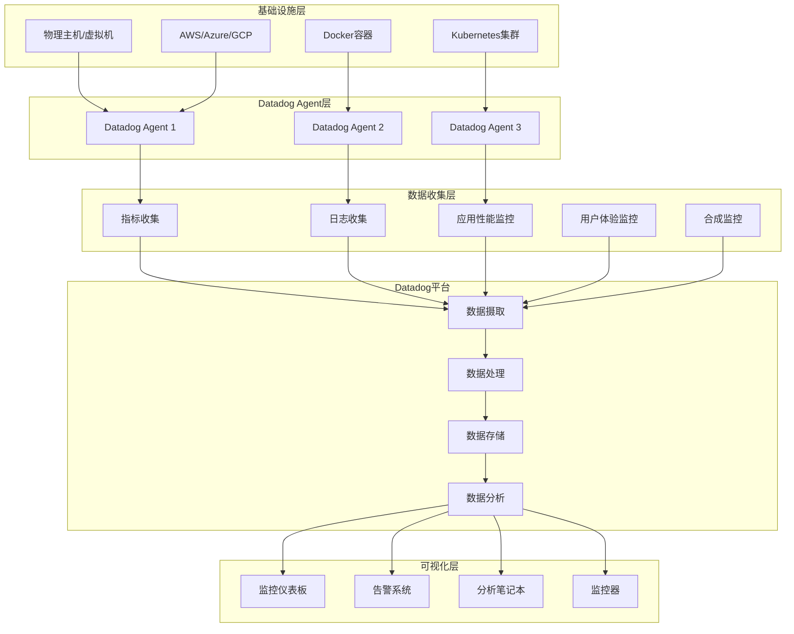

# Datadog 企业级监控平台深度实践

## 概述 (Overview)

Datadog是业界领先的企业级监控平台，提供基础设施、应用程序和业务指标的统一监控解决方案。本文档从企业级运维专家角度，深入探讨Datadog的架构设计、监控策略、告警管理和最佳实践。

Datadog is the industry-leading enterprise monitoring platform that provides unified monitoring solutions for infrastructure, applications, and business metrics. This document explores Datadog's architecture design, monitoring strategies, alert management, and best practices from an enterprise operations expert perspective.

## 架构设计 (Architecture Design)

### Datadog 企业级监控架构 (Enterprise Datadog Monitoring Architecture)

```yaml
# Datadog Agent 部署配置
datadog_agent:
  version: "7.44.0"
  deployment:
    method: "DaemonSet"
    namespace: "datadog"
    replicas: "每个节点一个实例"
    
  configuration:
    api_key: "${DATADOG_API_KEY}"
    site: "datadoghq.com"
    log_level: "INFO"
    
    # 核心功能启用
    apm:
      enabled: true
      env: "production"
      service: "my-service"
      version: "1.0.0"
      
    logs:
      enabled: true
      container_collect_all: true
      
    process_agent:
      enabled: true
      process_collection: true
      
    network_performance_monitoring:
      enabled: true
      
    # 安全配置
    dogstatsd:
      use_dogstatsd: true
      dogstatsd_port: 8125
      telemetry_enabled: true
```

### 监控架构图 (Monitoring Architecture Diagram)



## 核心功能配置 (Core Functionality Configuration)

### 基础设施监控配置 (Infrastructure Monitoring Configuration)

```yaml
# 基础设施监控完整配置
infrastructure_monitoring:
  # 主机监控
  host_metrics:
    cpu:
      enabled: true
      metrics:
        - system.cpu.idle
        - system.cpu.user
        - system.cpu.system
        - system.cpu.iowait
        
    memory:
      enabled: true
      metrics:
        - system.mem.total
        - system.mem.used
        - system.mem.free
        - system.mem.usable
        
    disk:
      enabled: true
      metrics:
        - system.disk.in_use
        - system.disk.read_bytes
        - system.disk.write_bytes
        - system.io.util
        
    network:
      enabled: true
      metrics:
        - system.net.bytes_rcvd
        - system.net.bytes_sent
        - system.net.packets_in.count
        - system.net.packets_out.count

  # 容器监控
  container_monitoring:
    docker:
      enabled: true
      metrics:
        - docker.mem.cache
        - docker.mem.rss
        - docker.cpu.usage
        - docker.net.bytes_rcvd
        
    kubernetes:
      enabled: true
      metrics:
        - kubernetes.cpu.limits
        - kubernetes.memory.requests
        - kubernetes.pods.running
        - kubernetes.nodes.ready

  # 云平台监控
  cloud_integration:
    aws:
      enabled: true
      services:
        - ec2
        - rds
        - s3
        - elb
        - lambda
        
    azure:
      enabled: true
      services:
        - virtual_machines
        - sql_database
        - storage_accounts
        - app_service
        
    gcp:
      enabled: true
      services:
        - compute_engine
        - cloud_sql
        - cloud_storage
        - cloud_run
```

### 应用性能监控配置 (APM Configuration)

```yaml
# APM 应用性能监控配置
apm_configuration:
  # 通用配置
  general:
    enabled: true
    env: "production"
    service: "web-application"
    version: "1.2.3"
    
  # 采样配置
  sampling:
    sample_rate: 1.0  # 100%采样
    priority_sampling: true
    ignore_resources:
      - "^OPTIONS "
      - "^GET /health"
      - "^GET /metrics"
      
  # 追踪配置
  tracing:
    distributed_tracing: true
    trace_propagation_style: "datadog,b3"
    span_sampling_rules:
      - service: "database"
        name: "query"
        sample_rate: 0.1
      - service: "cache"
        name: "redis.command"
        sample_rate: 0.05
        
  # 服务映射
  service_mapping:
    - from: "sqlalchemy"
      to: "database"
    - from: "redis"
      to: "cache"
    - from: "requests"
      to: "external-api"
      
  # 标签配置
  tags:
    - env:production
    - team:backend
    - datacenter:us-east-1
    - kubernetes_pod:${KUBERNETES_POD_NAME}
```

## 监控策略 (Monitoring Strategies)

### 关键业务指标监控 (Key Business Metrics Monitoring)

```python
# Datadog 监控策略 Python SDK 示例
from datadog import initialize, api
import time

class DatadogMonitoringStrategy:
    def __init__(self):
        self.options = {
            'api_key': 'your_api_key',
            'app_key': 'your_app_key'
        }
        initialize(**self.options)
        
    def create_business_metrics_monitor(self):
        """创建业务关键指标监控"""
        
        # 订单处理监控
        order_processing_monitor = {
            'name': '[Business] Order Processing Latency',
            'type': 'metric alert',
            'query': 'avg(last_5m):avg:business.order.processing_time{*} > 5000',
            'message': '@slack-commerce-team @pagerduty Order processing latency exceeds 5 seconds',
            'tags': ['business', 'orders', 'latency'],
            'priority': 2
        }
        
        # 用户注册监控
        user_registration_monitor = {
            'name': '[Business] User Registration Rate',
            'type': 'metric alert',
            'query': 'avg(last_10m):avg:business.user.registrations{*}.as_count() < 10',
            'message': '@slack-growth-team User registration rate dropped below 10 per 10 minutes',
            'tags': ['business', 'users', 'growth'],
            'priority': 3
        }
        
        # 收入监控
        revenue_monitor = {
            'name': '[Business] Revenue Drop Detection',
            'type': 'forecast',
            'query': 'forecast(avg:business.revenue{*}, \'linear\', 30, interval='1h', history='1d', model='default') < 0.8 * avg:business.revenue{*}',
            'message': '@finance-team @ceo Potential revenue drop detected - investigate immediately',
            'tags': ['business', 'revenue', 'finance'],
            'priority': 1
        }
        
        return [
            order_processing_monitor,
            user_registration_monitor,
            revenue_monitor
        ]
    
    def create_infrastructure_monitors(self):
        """创建基础设施监控器"""
        
        monitors = [
            # CPU使用率监控
            {
                'name': '[Infra] High CPU Usage',
                'type': 'metric alert',
                'query': 'avg(last_5m):avg:system.cpu.user{*} by {host} > 80',
                'message': '@devops-team High CPU usage detected on {{host.name}}',
                'tags': ['infrastructure', 'cpu', 'performance'],
                'priority': 3
            },
            
            # 内存使用率监控
            {
                'name': '[Infra] High Memory Usage',
                'type': 'metric alert',
                'query': 'avg(last_5m):avg:system.mem.pct_usable{*} by {host} < 0.2',
                'message': '@devops-team Low memory available on {{host.name}}',
                'tags': ['infrastructure', 'memory', 'performance'],
                'priority': 3
            },
            
            # 磁盘空间监控
            {
                'name': '[Infra] Low Disk Space',
                'type': 'metric alert',
                'query': 'avg(last_5m):avg:system.disk.in_use{*} by {host,device} > 0.9',
                'message': '@devops-team Critical disk space on {{host.name}}:{{device}}',
                'tags': ['infrastructure', 'disk', 'storage'],
                'priority': 2
            }
        ]
        
        return monitors

# 使用示例
strategy = DatadogMonitoringStrategy()

# 创建业务监控器
business_monitors = strategy.create_business_metrics_monitor()
for monitor in business_monitors:
    result = api.Monitor.create(**monitor)
    print(f"Created monitor: {result['name']} with ID: {result['id']}")

# 创建基础设施监控器
infra_monitors = strategy.create_infrastructure_monitors()
for monitor in infra_monitors:
    result = api.Monitor.create(**monitor)
    print(f"Created monitor: {result['name']} with ID: {result['id']}")
```

### 日志监控配置 (Log Monitoring Configuration)

```yaml
# 日志监控和分析配置
logs_configuration:
  # 日志收集配置
  log_collection:
    sources:
      - type: "docker"
        service: "application"
        source: "java"
        log_processing_rules:
          - type: "multi_line"
            name: "new_log_start_with_date"
            pattern: "\\d{4}\\-\\d{2}\\-\\d{2}"
            
      - type: "file"
        path: "/var/log/application/*.log"
        service: "backend"
        source: "python"
        log_processing_rules:
          - type: "include_at_match"
            name: "include_error_logs"
            pattern: "ERROR|CRITICAL"
            
  # 日志处理管道
  processing_pipelines:
    - name: "application_log_pipeline"
      is_enabled: true
      filter:
        query: "source:java OR source:python"
      processors:
        - name: "grok_parser"
          type: "grok-parser"
          source: "message"
          grok:
            pattern: "%{TIMESTAMP_ISO8601:timestamp} %{LOGLEVEL:level} %{DATA:logger} - %{GREEDYDATA:message}"
            
        - name: "status_classifier"
          type: "status-code-remapper"
          sources:
            - "http.status_code"
          target: "http.status_category"
          
        - name: "geoip_processor"
          type: "geo-ip-parser"
          sources:
            - "network.client.ip"
            
  # 日志告警配置
  log_alerts:
    - name: "[Logs] Application Error Rate"
      query: 'status:error AND service:application'.index('main').rollup('count').last('5m') > 100
      message: "@dev-team High error rate detected in application logs"
      tags: ["logs", "errors", "application"]
      
    - name: "[Logs] Security Event"
      query: 'security.attack.type:* AND @severity:high'.index('security').rollup('count').last('10m') > 5
      message: "@security-team High severity security events detected"
      tags: ["logs", "security", "alerts"]
```

## 告警管理 (Alert Management)

### 智能告警配置 (Intelligent Alerting Configuration)

```json
{
  "alerting_strategies": {
    "composite_alerts": {
      "order_processing_issues": {
        "name": "Order Processing Issues Composite Alert",
        "type": "composite",
        "message": "@ops-team Critical order processing issues detected",
        "tags": ["composite", "business", "orders"],
        "priority": 1,
        "query": "1 && 2 && (3 || 4)",
        "monitors": [
          {
            "id": 1,
            "name": "High Order Processing Latency"
          },
          {
            "id": 2,
            "name": "Order Failure Rate Spike"
          },
          {
            "id": 3,
            "name": "Payment Processing Timeout"
          },
          {
            "id": 4,
            "name": "Inventory Sync Failure"
          }
        ]
      }
    },
    
    "anomaly_detection": {
      "traffic_anomaly": {
        "name": "Traffic Anomaly Detection",
        "type": "query alert",
        "query": "avg(last_4h):anomalies(avg:nginx.net.request_per_s{*}, 'basic', 2, direction='both', alert_window='last_15m', interval=60, count_default_zero='true', seasonality='weekly') >= 1",
        "message": "@web-team Unusual traffic pattern detected",
        "tags": ["anomaly", "traffic", "web"],
        "priority": 2
      }
    },
    
    "forecast_alerts": {
      "capacity_planning": {
        "name": "Resource Capacity Forecast",
        "type": "query alert",
        "query": "forecast(avg:system.cpu.user{*} by {host}, 'linear', 24, interval='1h', history='7d', model='default') > 85",
        "message": "@devops-team CPU capacity will exceed 85% in 24 hours",
        "tags": ["forecast", "capacity", "cpu"],
        "priority": 3
      }
    }
  }
}
```

### 告警抑制和去重 (Alert Suppression and Deduplication)

```yaml
# 告警抑制策略
alert_suppression:
  # 时间窗口抑制
  time_windows:
    - name: "maintenance_window"
      start: "02:00"
      end: "04:00"
      timezone: "America/New_York"
      suppressed_monitors:
        - "High CPU Usage"
        - "Low Memory"
        
  # 依赖关系抑制
  dependency_suppression:
    - name: "database_dependent_services"
      parent_monitor: "Database Connection Pool"
      child_monitors:
        - "User Authentication Service"
        - "Order Processing Service"
        - "Payment Service"
      suppression_logic: "suppress children when parent is critical"
      
  # 告警去重规则
  deduplication_rules:
    - name: "similar_host_alerts"
      group_by: ["host", "service"]
      time_window: "10m"
      merge_strategy: "keep_highest_priority"
      
    - name: "related_metric_alerts"
      group_by: ["team", "environment"]
      correlation_window: "5m"
      aggregation_method: "combine_similar_messages"
```

## 仪表板和可视化 (Dashboards and Visualization)

### 企业级仪表板配置 (Enterprise Dashboard Configuration)

```json
{
  "dashboard_templates": {
    "executive_overview": {
      "title": "Executive Business Overview",
      "layout_type": "ordered",
      "widgets": [
        {
          "id": 1,
          "definition": {
            "type": "timeseries",
            "title": "Business KPIs - Last 24 Hours",
            "show_legend": true,
            "requests": [
              {
                "q": "avg:business.orders.count{*}.as_count()",
                "display_type": "area",
                "style": {
                  "palette": "warm"
                }
              },
              {
                "q": "avg:business.revenue{*}",
                "display_type": "bars",
                "style": {
                  "palette": "cool"
                }
              }
            ]
          }
        },
        {
          "id": 2,
          "definition": {
            "type": "toplist",
            "title": "Top Performing Services",
            "requests": [
              {
                "q": "top(avg:trace.servlet.request.hits{*} by {service}, 10, 'mean', 'desc')"
              }
            ]
          }
        },
        {
          "id": 3,
          "definition": {
            "type": "heatmap",
            "title": "User Experience Heatmap",
            "requests": [
              {
                "q": "avg:rum.browser.long_task.duration{*} by {browser.name}"
              }
            ]
          }
        }
      ]
    },
    
    "infrastructure_health": {
      "title": "Infrastructure Health Dashboard",
      "template_variables": [
        {
          "name": "env",
          "default": "production"
        },
        {
          "name": "region",
          "default": "us-east-1"
        }
      ],
      "widgets": [
        {
          "id": 1,
          "definition": {
            "type": "hostmap",
            "title": "Host Health Status",
            "requests": [
              {
                "fill": {
                  "q": "avg:system.cpu.user{$env,$region} by {host}"
                },
                "size": {
                  "q": "avg:system.mem.pct_usable{$env,$region} by {host}"
                }
              }
            ],
            "node_type": "host",
            "no_group_hosts": false,
            "no_metric_hosts": false,
            "style": {
              "palette": "green_to_orange",
              "palette_flip": false
            }
          }
        }
      ]
    }
  }
}
```

## 运维管理 (Operational Management)

### 自动化运维脚本 (Automated Operations Scripts)

```bash
#!/bin/bash
# Datadog 运维管理自动化脚本

# 环境变量配置
export DATADOG_API_KEY="your_api_key"
export DATADOG_APP_KEY="your_app_key"
export DATADOG_SITE="datadoghq.com"

# 监控器健康检查
check_monitor_health() {
    echo "=== Checking Datadog Monitor Health ==="
    
    # 获取所有监控器状态
    monitors=$(curl -s -X GET \
        "https://api.${DATADOG_SITE}/api/v1/monitor" \
        -H "DD-API-KEY: ${DATADOG_API_KEY}" \
        -H "DD-APPLICATION-KEY: ${DATADOG_APP_KEY}")
    
    # 分析监控器状态
    echo "$monitors" | jq -r '.[] | select(.overall_state != "OK") | 
        "⚠️  Monitor: \(.name) - State: \(.overall_state) - ID: \(.id)"'
    
    # 统计各类状态
    total=$(echo "$monitors" | jq 'length')
    ok_count=$(echo "$monitors" | jq '[.[] | select(.overall_state == "OK")] | length')
    warning_count=$(echo "$monitors" | jq '[.[] | select(.overall_state == "Warning")] | length')
    alert_count=$(echo "$monitors" | jq '[.[] | select(.overall_state == "Alert")] | length')
    
    echo "📊 Total Monitors: $total"
    echo "✅ OK: $ok_count"
    echo "⚠️  Warning: $warning_count"
    echo "🚨 Alert: $alert_count"
}

# 自动扩容建议
generate_scaling_recommendations() {
    echo "=== Generating Scaling Recommendations ==="
    
    # CPU使用率分析
    high_cpu_hosts=$(curl -s -X GET \
        "https://api.${DATADOG_SITE}/api/v1/query" \
        -H "DD-API-KEY: ${DATADOG_API_KEY}" \
        -H "DD-APPLICATION-KEY: ${DATADOG_APP_KEY}" \
        --data-urlencode "from=$(($(date +%s) - 3600))" \
        --data-urlencode "to=$(date +%s)" \
        --data-urlencode "query=avg:system.cpu.user{*} by {host} > 75")
    
    echo "🖥️  Hosts with high CPU (>75%):"
    echo "$high_cpu_hosts" | jq -r '.series[] | "  - \(.scope) - Average: \(.pointlist[-1][1])%"'
    
    # 内存压力分析
    low_memory_hosts=$(curl -s -X GET \
        "https://api.${DATADOG_SITE}/api/v1/query" \
        -H "DD-API-KEY: ${DATADOG_API_KEY}" \
        -H "DD-APPLICATION-KEY: ${DATADOG_APP_KEY}" \
        --data-urlencode "from=$(($(date +%s) - 3600))" \
        --data-urlencode "to=$(date +%s)" \
        --data-urlencode "query=avg:system.mem.pct_usable{*} by {host} < 0.2")
    
    echo "💾 Hosts with low memory (<20% available):"
    echo "$low_memory_hosts" | jq -r '.series[] | "  - \(.scope) - Available: \(.pointlist[-1][1]*100)%"`
}

# 日志异常检测
detect_log_anomalies() {
    echo "=== Detecting Log Anomalies ==="
    
    # 错误日志突增检测
    error_spike=$(curl -s -X GET \
        "https://api.${DATADOG_SITE}/api/v1/query" \
        -H "DD-API-KEY: ${DATADOG_API_KEY}" \
        -H "DD-APPLICATION-KEY: ${DATADOG_APP_KEY}" \
        --data-urlencode "from=$(($(date +%s) - 3600))" \
        --data-urlencode "to=$(date +%s)" \
        --data-urlencode "query=count:logs.status:error{*}.as_count() > 100")
    
    if [ "$(echo "$error_spike" | jq '.series | length')" -gt 0 ]; then
        echo "🚨 Error log spike detected:"
        echo "$error_spike" | jq -r '.series[] | "  Service: \(.scope) - Count: \(.pointlist[-1][1])"'
    else
        echo "✅ No significant error log spikes detected"
    fi
}

# 性能基准建立
establish_performance_baselines() {
    echo "=== Establishing Performance Baselines ==="
    
    services=("web-server" "api-service" "database" "cache")
    
    for service in "${services[@]}"; do
        echo "📊 Establishing baseline for $service"
        
        # 获取过去一周的性能数据
        baseline_data=$(curl -s -X GET \
            "https://api.${DATADOG_SITE}/api/v1/query" \
            -H "DD-API-KEY: ${DATADOG_API_KEY}" \
            -H "DD-APPLICATION-KEY: ${DATADOG_APP_KEY}" \
            --data-urlencode "from=$(($(date +%s) - 604800))" \
            --data-urlencode "to=$(date +%s)" \
            --data-urlencode "query=avg:trace.servlet.request.duration{service:$service}")
        
        # 计算统计指标
        avg_response_time=$(echo "$baseline_data" | jq -r '.series[0].pointlist | map(.[1]) | add / length')
        p95_response_time=$(echo "$baseline_data" | jq -r '.series[0].pointlist | map(.[1]) | sort | .[.[] | length * 0.95 | floor]')
        
        echo "  Average Response Time: ${avg_response_time}ms"
        echo "  95th Percentile: ${p95_response_time}ms"
        
        # 保存基线数据
        echo "{\"service\":\"$service\",\"avg\":$avg_response_time,\"p95\":$p95_response_time,\"timestamp\":\"$(date -u +%Y-%m-%dT%H:%M:%SZ)\"}" >> /tmp/performance_baselines.json
    done
}

# 主执行函数
main() {
    echo "🚀 Starting Datadog Operations Management"
    echo "Timestamp: $(date)"
    echo "========================================"
    
    check_monitor_health
    echo
    generate_scaling_recommendations
    echo
    detect_log_anomalies
    echo
    establish_performance_baselines
    
    echo "========================================"
    echo "✅ Datadog Operations Management Completed"
}

# 执行主函数
main
```

## 最佳实践 (Best Practices)

### 监控设计原则 (Monitoring Design Principles)

1. **业务导向监控**
   ```yaml
   # 业务价值驱动的监控指标
   business_metrics:
     - name: "订单转化率"
       metric: "business.order.conversion_rate"
       threshold: "< 2.5%"
       action: "立即通知产品团队"
       
     - name: "用户活跃度"
       metric: "business.user.active_daily"
       threshold: "< 10000"
       action: "通知增长团队调查"
   ```

2. **分层告警策略**
   ```yaml
   # 多层次告警体系
   alert_hierarchy:
     level_1: # 业务影响告警
       severity: "critical"
       notification: "@business-stakeholders @pagerduty"
       response_time: "15分钟内响应"
       
     level_2: # 系统性能告警
       severity: "warning" 
       notification: "@devops-team @slack-notifications"
       response_time: "1小时内响应"
       
     level_3: # 基础设施告警
       severity: "info"
       notification: "@infrastructure-team"
       response_time: "下一个工作日处理"
   ```

3. **成本优化策略**
   ```yaml
   # 监控成本控制
   cost_optimization:
     data_retention:
       high_value_metrics: "13 months"
       medium_value_metrics: "6 months" 
       low_value_metrics: "3 months"
       
     sampling_strategies:
       production: "100% sampling"
       staging: "50% sampling"
       development: "10% sampling"
       
     log_ingestion:
       exclude_patterns:
         - "DEBUG logs"
         - "verbose output"
         - "temporary files"
   ```

### 安全和合规 (Security and Compliance)

```yaml
# 安全监控配置
security_monitoring:
  # 访问控制监控
  access_control:
    failed_login_attempts:
      threshold: "> 10 in 5 minutes"
      action: "账户锁定 + 安全团队通知"
      
    privilege_escalation:
      detection: "sudo命令使用监控"
      alert_level: "high"
      
  # 数据安全监控
  data_protection:
    sensitive_data_access:
      monitored_patterns:
        - "credit_card"
        - "social_security"
        - "password"
      action: "实时告警 + 审计日志"
      
    data_exfiltration:
      network_traffic_analysis: true
      anomaly_detection: true
      threshold: "异常数据传输量 > 100MB"
```

---

**文档版本**: v1.0  
**最后更新**: 2024年2月7日  
**适用版本**: Datadog Agent 7.44+