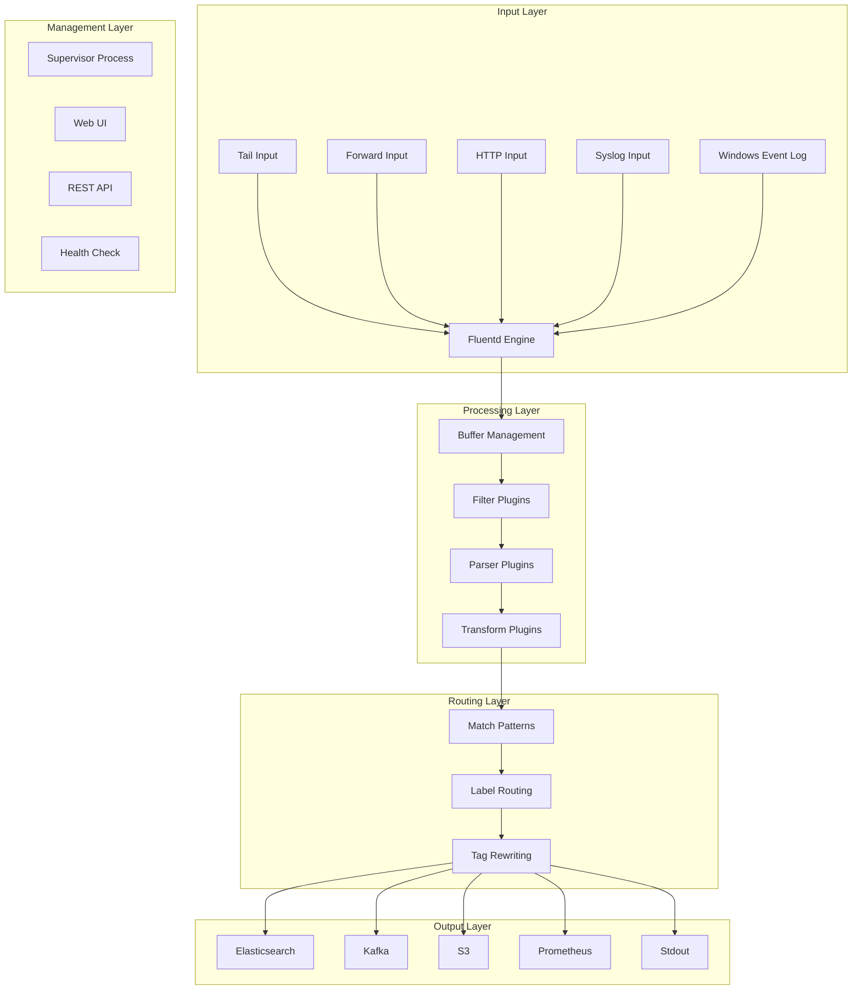

# Fluentd企业级日志收集与处理深度实践

> **Author**: Logging System Architect | **Version**: v1.0 | **Update Time**: 2026-02-07
> **Scenario**: Enterprise-grade log collection and processing architecture | **Complexity**: ⭐⭐⭐⭐⭐

## 🎯 Abstract

This document provides in-depth exploration of Fluentd enterprise log collection and processing architecture design, deployment practices, and operational management. Based on large-scale production environment experience, it offers comprehensive technical guidance from log collection to real-time processing, helping enterprises build reliable, scalable log management systems.

## 1. Fluentd Architecture Deep Dive

### 1.1 Core Component Architecture



### 1.2 Plugin Architecture

```yaml
fluentd_plugin_types:
  input_plugins:
    - in_tail: "文件尾部监控"
    - in_forward: "Fluentd转发输入"
    - in_http: "HTTP REST API输入"
    - in_syslog: "Syslog协议输入"
    - in_udp: "UDP数据包输入"
    - in_windows_eventlog: "Windows事件日志"
  
  parser_plugins:
    - parser_json: "JSON格式解析"
    - parser_regexp: "正则表达式解析"
    - parser_multiline: "多行日志解析"
    - parser_apache2: "Apache日志解析"
    - parser_nginx: "Nginx日志解析"
  
  filter_plugins:
    - filter_record_transformer: "记录转换"
    - filter_grep: "日志过滤"
    - filter_parser: "二次解析"
    - filter_stdout: "标准输出调试"
  
  output_plugins:
    - out_elasticsearch: "Elasticsearch输出"
    - out_kafka: "Kafka消息队列"
    - out_s3: "AWS S3存储"
    - out_file: "本地文件输出"
    - out_forward: "Fluentd转发输出"
```

## 2. Enterprise Deployment Architecture

### 2.1 High Availability Configuration

```yaml
# fluentd-daemonset.yaml
apiVersion: apps/v1
kind: DaemonSet
metadata:
  name: fluentd
  namespace: logging
  labels:
    app: fluentd
spec:
  selector:
    matchLabels:
      app: fluentd
  template:
    metadata:
      labels:
        app: fluentd
    spec:
      serviceAccountName: fluentd
      terminationGracePeriodSeconds: 30
      containers:
      - name: fluentd
        image: fluent/fluentd-kubernetes-daemonset:v1.16.0-debian-elasticsearch7-1.0
        env:
        - name: FLUENT_ELASTICSEARCH_HOST
          value: "elasticsearch.logging.svc.cluster.local"
        - name: FLUENT_ELASTICSEARCH_PORT
          value: "9200"
        - name: FLUENT_ELASTICSEARCH_SCHEME
          value: "http"
        - name: FLUENT_UID
          value: "0"
        - name: NODE_NAME
          valueFrom:
            fieldRef:
              fieldPath: spec.nodeName
        resources:
          limits:
            memory: 1Gi
            cpu: 1000m
          requests:
            cpu: 100m
            memory: 200Mi
        volumeMounts:
        - name: varlog
          mountPath: /var/log
        - name: varlibdockercontainers
          mountPath: /var/lib/docker/containers
          readOnly: true
        - name: fluentd-config
          mountPath: /fluentd/etc
        - name: docker-sock
          mountPath: /var/run/docker.sock
        livenessProbe:
          exec:
            command:
            - /bin/sh
            - -c
            - |
              LIVENESS_THRESHOLD_SECONDS=${LIVENESS_THRESHOLD_SECONDS:-300}; STUCK_THRESHOLD_SECONDS=${LIVENESS_THRESHOLD_SECONDS:-900}; if [ ! -e /var/log/fluentd-buffers ]; then
                exit 1;
              fi; touch -d "${STUCK_THRESHOLD_SECONDS} seconds ago" /tmp/marker-stuck; if [ -n "$(find /var/log/fluentd-buffers -type f -newer /tmp/marker-stuck -print -quit)" ]; then
                rm -f /tmp/marker-stuck;
                exit 1;
              fi; touch -d "${LIVENESS_THRESHOLD_SECONDS} seconds ago" /tmp/marker-liveness; if [ -n "$(find /var/log/fluentd-buffers -type f -newer /tmp/marker-liveness -print -quit)" ]; then
                rm -f /tmp/marker-liveness;
                exit 1;
              fi;
          initialDelaySeconds: 600
          timeoutSeconds: 10
          periodSeconds: 60
          failureThreshold: 3
        readinessProbe:
          exec:
            command:
            - /bin/sh
            - -c
            - |
              stat /var/log/fluentd-buffers
          initialDelaySeconds: 30
          timeoutSeconds: 10
          periodSeconds: 30
          failureThreshold: 3
      volumes:
      - name: varlog
        hostPath:
          path: /var/log
      - name: varlibdockercontainers
        hostPath:
          path: /var/lib/docker/containers
      - name: docker-sock
        hostPath:
          path: /var/run/docker.sock
      - name: fluentd-config
        configMap:
          name: fluentd-config
      tolerations:
      - key: node-role.kubernetes.io/master
        effect: NoSchedule
```

### 2.2 Fluentd Configuration

```ruby
# fluent.conf
# Main Fluentd configuration file

# System configuration
<system>
  root_dir /var/log/fluentd
  log_level info
  suppress_repeated_stacktrace true
  emit_error_log_interval 60
  suppress_config_dump true
  workers 4
</system>

# Source: Kubernetes pod logs
<source>
  @type tail
  @id in_tail_container_logs
  path /var/log/containers/*.log
  pos_file /var/log/fluentd-containers.log.pos
  tag kubernetes.*
  read_from_head true
  <parse>
    @type json
    time_key time
    time_format %Y-%m-%dT%H:%M:%S.%NZ
    keep_time_key true
  </parse>
  emit_unmatched_lines true
</source>

# Source: Journal logs
<source>
  @type systemd
  @id in_systemd_kubelet
  matches [{ "_SYSTEMD_UNIT": "kubelet.service" }]
  <storage>
    @type local
    persistent true
    path /var/log/fluentd-journald-kubelet-cursor.json
  </storage>
  <entry>
    fields_strip_underscores true
    field_map {"MESSAGE": "message", "_TRANSPORT": "stream"}
  </entry>
  tag kubelet
</source>

# Filter: Kubernetes metadata
<filter kubernetes.**>
  @type kubernetes_metadata
  @id filter_kube_metadata
  kubernetes_url "https://kubernetes.default.svc:443/api"
  bearer_token_file "/var/run/secrets/kubernetes.io/serviceaccount/token"
  ca_file "/var/run/secrets/kubernetes.io/serviceaccount/ca.crt"
  cache_size 10000
  cache_ttl 60
  watch true
  use_journal nil
  ssl_partial_chain true
</filter>

# Filter: Record transformation
<filter kubernetes.**>
  @type record_transformer
  @id filter_containers_stream_transformer
  <record>
    stream_name ${record.dig("kubernetes", "container_name")}
    pod ${record.dig("kubernetes", "pod_name")}
    namespace ${record.dig("kubernetes", "namespace_name")}
    container_image ${record.dig("kubernetes", "container_image")}
    host ${hostname}
  </record>
  remove_keys $.kubernetes.container_hash, $.kubernetes.container_image_id, $.kubernetes.pod_id, $.kubernetes.master_url, $.kubernetes.namespace_id, $.kubernetes.namespace_labels, $.kubernetes.annotations, $.kubernetes.labels.app
</filter>

# Multi-worker configuration
<worker 0>
  <source>
    @type forward
    @id forward_input_0
    port 24224
    bind 0.0.0.0
  </source>
</worker>

<worker 1>
  <source>
    @type forward
    @id forward_input_1
    port 24225
    bind 0.0.0.0
  </source>
</worker>

# Buffer configuration
<label @BUFFER>
  <match **>
    @type file
    path /var/log/fluentd/buffer
    <buffer>
      @type file
      path /var/log/fluentd/buffer
      flush_mode interval
      flush_interval 5s
      flush_thread_count 8
      flush_at_shutdown true
      retry_type exponential_backoff
      retry_forever true
      retry_max_interval 30
      retry_randomize true
      queued_chunks_limit_size 32
      total_limit_size 64GB
      chunk_limit_size 2MB
      overflow_action block
    </buffer>
  </match>
</label>

# Output: Elasticsearch
<match **>
  @type elasticsearch
  @id out_es
  @log_level info
  include_tag_key true
  host "#{ENV['FLUENT_ELASTICSEARCH_HOST']}"
  port "#{ENV['FLUENT_ELASTICSEARCH_PORT']}"
  scheme "#{ENV['FLUENT_ELASTICSEARCH_SCHEME'] || 'http'}"
  ssl_verify "#{ENV['FLUENT_ELASTICSEARCH_SSL_VERIFY'] || 'true'}"
  user "#{ENV['FLUENT_ELASTICSEARCH_USER']}"
  password "#{ENV['FLUENT_ELASTICSEARCH_PASSWORD']}"
  reload_connections false
  reconnect_on_error true
  reload_on_failure true
  logstash_prefix logstash
  logstash_format true
  logstash_dateformat %Y.%m.%d
  <buffer>
    @type file
    path /var/log/fluentd/buffer/es
    flush_mode interval
    flush_interval 5s
    flush_thread_count 8
    flush_at_shutdown true
    retry_type exponential_backoff
    retry_forever true
    retry_max_interval 30
    retry_randomize true
    queued_chunks_limit_size 32
    total_limit_size 32GB
    chunk_limit_size 2MB
    overflow_action block
  </buffer>
</match>

# Output: Kafka for streaming
<match kubernetes.**>
  @type kafka2
  @id out_kafka
  brokers "#{ENV['KAFKA_BROKERS']}"
  default_topic fluentd-logs
  <format>
    @type json
  </format>
  <buffer topic>
    @type file
    path /var/log/fluentd/buffer/kafka
    flush_mode interval
    flush_interval 3s
    flush_thread_count 8
    flush_at_shutdown true
    retry_type exponential_backoff
    retry_forever true
    retry_max_interval 30
    retry_randomize true
    queued_chunks_limit_size 16
    total_limit_size 8GB
    chunk_limit_size 8MB
  </buffer>
</match>

# Health check endpoint
<source>
  @type http
  @id http_health
  port 9880
  bind 0.0.0.0
</source>

# Monitoring endpoint
<source>
  @type monitor_agent
  @id monitor_agent
  bind 0.0.0.0
  port 24220
  tag monitor.metrics
</source>
```

## 3. Advanced Log Processing

### 3.1 Multi-line Log Handling

```ruby
# Multi-line log configuration
<source>
  @type tail
  path /var/log/application/*.log
  pos_file /var/log/fluentd-application.pos
  tag application.multiline
  <parse>
    @type multiline
    format_firstline /\d{4}-\d{2}-\d{2}/
    format1 /^(?<time>\d{4}-\d{2}-\d{2} \d{2}:\d{2}:\d{2}) \[(?<level>[A-Z]+)\] (?<message>.*)$/
  </parse>
</source>

<filter application.multiline>
  @type record_transformer
  <record>
    application_name application-service
    environment production
    parsed_timestamp ${time}
  </record>
</filter>
```

### 3.2 Structured Log Parsing

```ruby
# JSON log parsing with schema validation
<source>
  @type tail
  path /var/log/api/*.json
  pos_file /var/log/fluentd-api-json.pos
  tag api.json
  <parse>
    @type json
    time_key timestamp
    time_format %Y-%m-%dT%H:%M:%S.%LZ
    keep_time_key true
    require_time_key true
  </parse>
</source>

<filter api.json>
  @type record_transformer
  enable_ruby true
  <record>
    duration_ms ${record["duration"] ? (record["duration"].to_f * 1000).round : nil}
    response_size_kb ${record["response_size"] ? (record["response_size"].to_f / 1024).round(2) : nil}
    slow_request ${record["duration"] && record["duration"].to_f > 1.0 ? "true" : "false"}
  </record>
  
  # Schema validation
  <record>
    valid_schema ${begin; record.has_key?("request_id") && record.has_key?("status_code"); rescue; false; end}
  </record>
</filter>

# Drop invalid records
<filter api.json>
  @type grep
  <exclude>
    key valid_schema
    pattern ^false$
  </exclude>
</filter>
```

## 4. Performance Optimization

### 4.1 Buffer Tuning

```ruby
# High-performance buffer configuration
<buffer>
  @type file
  path /var/log/fluentd/high-performance-buffer
  flush_mode interval
  flush_interval 1s
  flush_thread_count 16
  flush_at_shutdown true
  retry_type exponential_backoff
  retry_forever true
  retry_max_interval 60
  retry_randomize true
  queued_chunks_limit_size 64
  total_limit_size 128GB
  chunk_limit_size 8MB
  compress gzip
  delayed_commit_timeout 60
  overflow_action drop_oldest_chunk
  disable_chunk_backup true
  timekey 300
  timekey_wait 30s
  timekey_use_utc true
</buffer>
```

### 4.2 Resource Management

```yaml
# fluentd-resource-config.yaml
resources:
  requests:
    memory: "512Mi"
    cpu: "250m"
  limits:
    memory: "2Gi"
    cpu: "1000m"

# Environment variables for tuning
env:
  - name: FLUENTD_OPT
    value: "-v --log-rotate-age 5 --log-rotate-size 104857600"
  - name: LD_PRELOAD
    value: "/usr/lib/x86_64-linux-gnu/libjemalloc.so.2"
  - name: MALLOC_ARENA_MAX
    value: "2"
  - name: RUBY_GC_HEAP_INIT_SLOTS
    value: "800000"
  - name: RUBY_GC_HEAP_FREE_SLOTS
    value: "600000"
  - name: RUBY_GC_HEAP_GROWTH_FACTOR
    value: "1.1"
```

## 5. Security and Compliance

### 5.1 Secure Configuration

```ruby
# Security-enhanced fluent.conf
<system>
  # Security settings
  security.user fluentd
  security.group fluentd
  chroot /fluentd
  umask 0027
  
  # TLS configuration
  tls.cert_path /etc/fluentd/certs/server.crt
  tls.key_path /etc/fluentd/certs/server.key
  tls.ca_path /etc/fluentd/certs/ca.crt
  tls.verify_peer true
</system>

# Input with authentication
<source>
  @type forward
  port 24224
  bind 0.0.0.0
  <transport tls>
    cert_path /etc/fluentd/certs/server.crt
    private_key_path /etc/fluentd/certs/server.key
    ca_path /etc/fluentd/certs/ca.crt
  </transport>
  <security>
    self_hostname fluentd-server
    shared_key "your-shared-secret-key"
  </security>
</source>

# Output with encryption
<match sensitive.**>
  @type elasticsearch
  host secure-es.example.com
  port 9200
  scheme https
  ssl_verify true
  user fluentd_writer
  password "#{ENV['FLUENT_ELASTICSEARCH_PASSWORD']}"
  log_es_400_reason true
  <buffer>
    @type file
    path /var/log/fluentd/secure-buffer
    flush_mode interval
    flush_interval 10s
    flush_thread_count 4
    chunk_limit_size 4MB
    total_limit_size 16GB
    compress gzip
  </buffer>
</match>
```

### 5.2 Compliance Logging

```ruby
# GDPR/PCI DSS compliant logging
<filter pci_sensitive.**>
  @type record_transformer
  enable_ruby true
  <record>
    # Mask credit card numbers
    message ${record['message'].gsub(/(?:\d[ -]*?){13,16}/, 'XXXX-XXXX-XXXX-XXXX')}
    # Remove PII data
    pii_removed ${true}
    # Add compliance metadata
    data_classification PCI-DSS
    retention_period "7 years"
    audit_trail_id ${require 'securerandom'; SecureRandom.uuid}
  </record>
  
  # Remove sensitive fields entirely
  remove_keys credit_card_number, social_security_number, password
</filter>

# Audit trail for compliance
<match audit.**>
  @type file
  path /var/log/compliance/audit
  append true
  <format>
    @type json
  </format>
  <buffer time>
    @type file
    timekey 86400  # Daily rotation
    timekey_wait 10m
    path /var/log/fluentd/buffer/audit
  </buffer>
</match>
```

## 6. Monitoring and Troubleshooting

### 6.1 Health Monitoring

```ruby
# Comprehensive monitoring configuration
<source>
  @type prometheus
  port 24231
  bind 0.0.0.0
</source>

<source>
  @type prometheus_monitor
</source>

<source>
  @type prometheus_output_monitor
</source>

<source>
  @type prometheus_tail_monitor
  <labels>
    hostname ${hostname}
  </labels>
</source>

# Custom metrics
<source>
  @type dummy
  tag monitoring.metrics
  dummy {"buffer_queue_length": 0, "retry_count": 0, "emit_count": 0}
  @label @MONITORING
</source>

<label @MONITORING>
  <filter monitoring.metrics>
    @type prometheus
    <metric>
      name fluentd_buffer_queue_length
      type gauge
      desc Buffer queue length
      key buffer_queue_length
    </metric>
    <metric>
      name fluentd_retry_count
      type counter
      desc Number of retries
      key retry_count
    </metric>
  </filter>
</label>
```

### 6.2 Diagnostic Commands

```bash
#!/bin/bash
# fluentd-diagnostics.sh

# 1. Check Fluentd process status
echo "=== Fluentd Process Status ==="
ps aux | grep fluentd

# 2. Check buffer status
echo "=== Buffer Status ==="
ls -la /var/log/fluentd/buffer/
du -sh /var/log/fluentd/buffer/

# 3. Check plugin versions
echo "=== Plugin Versions ==="
fluent-gem list | grep fluent

# 4. Test configuration
echo "=== Configuration Test ==="
fluentd --dry-run -c /fluentd/etc/fluent.conf

# 5. Monitor performance metrics
echo "=== Performance Metrics ==="
curl -s http://localhost:24220/api/plugins.json | jq '.'

# 6. Check error logs
echo "=== Error Logs ==="
tail -20 /var/log/fluentd/fluentd.log | grep -i error

# 7. Verify data flow
echo "=== Data Flow Verification ==="
echo '{"test": "verification", "timestamp": "'$(date -u +%Y-%m-%dT%H:%M:%SZ)'"}' | \
  fluent-cat debug.test

# 8. Check resource usage
echo "=== Resource Usage ==="
top -b -n 1 | grep fluentd
```

## 7. Scaling and High Availability

### 7.1 Multi-node Architecture

```yaml
# fluentd-ha-deployment.yaml
apiVersion: apps/v1
kind: Deployment
metadata:
  name: fluentd-aggregator
  namespace: logging
spec:
  replicas: 3
  selector:
    matchLabels:
      app: fluentd-aggregator
  template:
    metadata:
      labels:
        app: fluentd-aggregator
    spec:
      containers:
      - name: fluentd-aggregator
        image: fluent/fluentd:v1.16.0
        ports:
        - containerPort: 24224
          name: forward
        - containerPort: 24231
          name: metrics
        env:
        - name: FLUENTD_ROLE
          value: "aggregator"
        volumeMounts:
        - name: config
          mountPath: /fluentd/etc
        - name: buffer
          mountPath: /var/log/fluentd
        resources:
          requests:
            memory: "1Gi"
            cpu: "500m"
          limits:
            memory: "4Gi"
            cpu: "2000m"
      volumes:
      - name: config
        configMap:
          name: fluentd-aggregator-config
      - name: buffer
        persistentVolumeClaim:
          claimName: fluentd-aggregator-buffer
---
# fluentd-aggregator-service.yaml
apiVersion: v1
kind: Service
metadata:
  name: fluentd-aggregator
  namespace: logging
spec:
  selector:
    app: fluentd-aggregator
  ports:
  - name: forward
    port: 24224
    targetPort: 24224
  - name: metrics
    port: 24231
    targetPort: 24231
  type: ClusterIP
```

## 8. Future Trends and Roadmap

### 8.1 Emerging Technologies

```yaml
future_trends:
  cloud_native_integration:
    - kubernetes_native_operators
    - serverless_log_processing
    - edge_computing_log_collection
    - multi_cloud_log_aggregation
  
  ai_enhanced_processing:
    - automated_log_parsing
    - intelligent_anomaly_detection
    - predictive_maintenance
    - natural_language_queries
  
  streaming_architecture:
    - real_time_log_processing
    - event_driven_architecture
    - stream_processing_frameworks
    - lambda_architecture_evolution
```

---
*This document is based on enterprise-level log collection and processing practice experience and continuously updated with the latest technologies and best practices.*