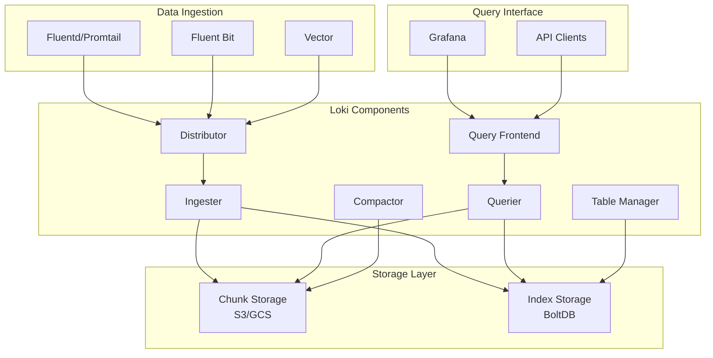

# Loki Enterprise Log Aggregation and Analytics Platform

## 概述 (Overview)

Loki 是 Grafana Labs 开发的水平可扩展、高可用的日志聚合系统，专为云原生环境设计。本文档详细介绍 Loki 企业级部署架构、日志处理管道和分析能力。

Loki is a horizontally scalable, highly available log aggregation system developed by Grafana Labs, designed specifically for cloud-native environments. This document details Loki enterprise deployment architecture, log processing pipelines, and analytics capabilities.

## 架构设计 (Architecture Design)

### 核心组件架构 (Core Component Architecture)

```yaml
# Loki 企业级架构
apiVersion: v1
kind: Namespace
metadata:
  name: loki-system
---
apiVersion: v1
kind: ConfigMap
metadata:
  name: loki-config
  namespace: loki-system
data:
  loki.yml: |
    auth_enabled: false
    
    server:
      http_listen_port: 3100
      grpc_listen_port: 9096
      
    common:
      path_prefix: /loki
      storage:
        filesystem:
          chunks_directory: /loki/chunks
          rules_directory: /loki/rules
      replication_factor: 1
      ring:
        kvstore:
          store: inmemory
      
    schema_config:
      configs:
        - from: 2020-10-24
          store: boltdb-shipper
          object_store: filesystem
          schema: v11
          index:
            prefix: index_
            period: 24h
            
    storage_config:
      boltdb_shipper:
        active_index_directory: /loki/boltdb-shipper-active
        cache_location: /loki/boltdb-shipper-cache
        cache_ttl: 24h
        shared_store: filesystem
      filesystem:
        directory: /loki/chunks
        
    chunk_store_config:
      max_look_back_period: 0s
      
    table_manager:
      retention_deletes_enabled: false
      retention_period: 0s
      
    compactor:
      working_directory: /loki/retention
      shared_store: filesystem
      compaction_interval: 10m
      retention_enabled: true
      retention_delete_delay: 2h
```

### 微服务架构 (Microservices Architecture)



## 部署配置 (Deployment Configuration)

### 分布式部署 (Distributed Deployment)

```yaml
# Loki Distributor 部署
apiVersion: apps/v1
kind: Deployment
metadata:
  name: loki-distributor
  namespace: loki-system
spec:
  replicas: 3
  selector:
    matchLabels:
      app: loki-distributor
  template:
    metadata:
      labels:
        app: loki-distributor
    spec:
      containers:
      - name: loki
        image: grafana/loki:2.9.3
        args:
        - "-config.file=/etc/loki/config/loki.yml"
        - "-target=distributor"
        ports:
        - containerPort: 3100
          name: http
        - containerPort: 9096
          name: grpc
        volumeMounts:
        - name: config
          mountPath: /etc/loki/config
        - name: storage
          mountPath: /loki
        resources:
          requests:
            cpu: "1"
            memory: "2Gi"
          limits:
            cpu: "2"
            memory: "4Gi"
      volumes:
      - name: config
        configMap:
          name: loki-config
      - name: storage
        emptyDir: {}
---
# Loki Ingester 部署
apiVersion: apps/v1
kind: StatefulSet
metadata:
  name: loki-ingester
  namespace: loki-system
spec:
  serviceName: loki-ingester
  replicas: 3
  selector:
    matchLabels:
      app: loki-ingester
  template:
    metadata:
      labels:
        app: loki-ingester
    spec:
      containers:
      - name: loki
        image: grafana/loki:2.9.3
        args:
        - "-config.file=/etc/loki/config/loki.yml"
        - "-target=ingester"
        ports:
        - containerPort: 3100
          name: http
        - containerPort: 9096
          name: grpc
        volumeMounts:
        - name: config
          mountPath: /etc/loki/config
        - name: data
          mountPath: /loki
        env:
        - name: POD_NAME
          valueFrom:
            fieldRef:
              fieldPath: metadata.name
        readinessProbe:
          httpGet:
            path: /ready
            port: 3100
          initialDelaySeconds: 15
          periodSeconds: 30
      volumes:
      - name: config
        configMap:
          name: loki-config
  volumeClaimTemplates:
  - metadata:
      name: data
    spec:
      accessModes: ["ReadWriteOnce"]
      resources:
        requests:
          storage: 100Gi
```

### 对象存储集成 (Object Storage Integration)

```yaml
# AWS S3 配置
storage_config:
  aws:
    s3: s3://access_key:secret_access_key@loki-logs-bucket
    s3forcepathstyle: false
    insecure: false
  boltdb_shipper:
    active_index_directory: /loki/boltdb-shipper-active
    cache_location: /loki/boltdb-shipper-cache
    shared_store: s3

# Google Cloud Storage 配置
storage_config:
  gcs:
    bucket_name: loki-logs-bucket
    service_account: /etc/gcs/service-account.json
  boltdb_shipper:
    active_index_directory: /loki/boltdb-shipper-active
    cache_location: /loki/boltdb-shipper-cache
    shared_store: gcs
```

## 日志收集代理 (Log Collection Agents)

### Promtail 配置 (Promtail Configuration)

```yaml
# Promtail 主配置
server:
  http_listen_port: 9080
  grpc_listen_port: 0

positions:
  filename: /tmp/positions.yaml

clients:
  - url: http://loki-gateway.loki-system.svc.cluster.local/loki/api/v1/push

scrape_configs:
  # Kubernetes Pods 日志收集
  - job_name: kubernetes-pods
    kubernetes_sd_configs:
      - role: pod
    pipeline_stages:
      - cri: {}
      - labeldrop:
          - filename
    relabel_configs:
      - source_labels:
          - __meta_kubernetes_pod_node_name
        target_label: node_name
      - source_labels:
          - __meta_kubernetes_namespace
        target_label: namespace
      - source_labels:
          - __meta_kubernetes_pod_name
        target_label: pod
      - source_labels:
          - __meta_kubernetes_pod_container_name
        target_label: container
      - source_labels:
          - __meta_kubernetes_pod_uid
        target_label: pod_uid
      - replacement: /var/log/pods/*$1/*.log
        separator: /
        source_labels:
          - __meta_kubernetes_pod_uid
          - __meta_kubernetes_pod_container_name
        target_label: __path__

  # 系统日志收集
  - job_name: system-logs
    static_configs:
      - targets:
          - localhost
        labels:
          job: varlogs
          __path__: /var/log/*log
    pipeline_stages:
      - regex:
          expression: '^(?P<timestamp>\d{4}-\d{2}-\d{2} \d{2}:\d{2}:\d{2}) (?P<message>.*)$'
      - timestamp:
          source: timestamp
          format: RFC3339
      - output:
          source: message
```

### Fluent Bit 集成 (Fluent Bit Integration)

```yaml
# Fluent Bit Loki 输出插件配置
[SERVICE]
    Flush         1
    Log_Level     info
    Daemon        off
    Parsers_File  parsers.conf

[INPUT]
    Name              tail
    Path              /var/log/containers/*.log
    Parser            docker
    Tag               kube.*
    Mem_Buf_Limit     5MB
    Skip_Long_Lines   On

[FILTER]
    Name                kubernetes
    Match               kube.*
    Merge_Log           On
    Keep_Log            Off
    K8S-Logging.Parser  On
    K8S-Logging.Exclude On

[OUTPUT]
    Name            loki
    Match           *
    Host            loki-gateway.loki-system.svc.cluster.local
    Port            80
    Labels          job=fluentbit, namespace=$kubernetes['namespace_name'], pod=$kubernetes['pod_name']
    BatchWait       1s
    BatchSize       1001024
    LineFormat      json
    LogLevel        warn
```

## 日志处理管道 (Log Processing Pipelines)

### 高级日志解析 (Advanced Log Parsing)

```yaml
# 复杂日志处理管道
pipeline_stages:
  # JSON 解析阶段
  - json:
      expressions:
        level: level
        timestamp: timestamp
        message: msg
        error_code: error.code
        user_id: user.id
  
  # 时间戳处理
  - timestamp:
      source: timestamp
      format: RFC3339
  
  # 标签提取
  - labels:
      level:
      error_code:
      user_id:
  
  # 结构化字段提取
  - output:
      source: message
  
  # 条件过滤
  - match:
      selector: '{level="ERROR"}'
      stages:
        - static_labels:
            severity: high
        - drop:
            source: error_code
            expression: "^4\\d{2}$"
  
  # 正则表达式解析
  - regex:
      expression: '^(?P<ip>\d+\.\d+\.\d+\.\d+) - (?P<user>\S+) \[(?P<timestamp>[^\]]+)\] "(?P<method>\S+) (?P<path>\S+) (?P<protocol>\S+)" (?P<status>\d+) (?P<size>\d+)'
  
  # 数值转换
  - unpack:
      source: size
      type: int
  
  # 字符串操作
  - template:
      source: path
      template: '{{ TrimPrefix "/" .Value }}'
```

### 动态标签管理 (Dynamic Label Management)

```yaml
# 动态标签配置
scrape_configs:
  - job_name: application-logs
    kubernetes_sd_configs:
      - role: pod
    pipeline_stages:
      - cri: {}
      # 动态标签提取
      - static_labels:
          cluster: production
          region: us-west-2
      # 基于内容的标签
      - match:
          selector: '{container="nginx"}'
          stages:
            - regex:
                expression: 'GET|POST|PUT|DELETE'
                source: msg
            - labels:
                method:
      # 标签重写
      - labeldrop:
          - pod_template_hash
          - controller_revision_hash
      - labelkeep:
          - namespace
          - pod
          - container
          - level
```

## 查询分析 (Query and Analytics)

### LogQL 查询语言 (LogQL Query Language)

```logql
# 基础日志查询
{namespace="production", container="api-server"} |= "error" | json | level="ERROR"

# 聚合查询
count_over_time({namespace="production"}[1h])
rate({job="nginx"} |= "404" [5m])
topk(10, sum(rate({namespace="frontend"}[10m])) by (pod))

# 复杂过滤
{container="payment-service"} 
|~ `failed to process payment` 
| json 
| error_code >= 500 
| line_format "{{.timestamp}} {{.message}}"

# 时间序列转换
sum(count_over_time({namespace="backend"} |~ "database connection" [1h])) 
by (pod) > 10

# 标签过滤组合
{namespace=~"prod.*", container!="istio-proxy"} 
|= "timeout" 
!= "retry" 
| pattern "<_> - - <ip> <_> \"<method> <path> <_>\" <status> <size>"
```

### 可视化分析 (Visualization Analytics)

```json
{
  "dashboard": {
    "title": "Loki Enterprise Log Analytics",
    "panels": [
      {
        "title": "Error Rate by Service",
        "type": "graph",
        "targets": [
          {
            "expr": "sum(rate({namespace=\"production\"} |= \"ERROR\" [5m])) by (service)",
            "legendFormat": "{{service}}"
          }
        ]
      },
      {
        "title": "Log Volume Trend",
        "type": "heatmap",
        "targets": [
          {
            "expr": "sum(count_over_time({job=\"application-logs\"} [1h]))",
            "legendFormat": "Log Volume"
          }
        ]
      },
      {
        "title": "Top Error Messages",
        "type": "table",
        "targets": [
          {
            "expr": "topk(10, count_over_time({namespace=\"production\"} |= \"ERROR\" [1h]))",
            "legendFormat": "{{msg}}"
          }
        ]
      }
    ]
  }
}
```

## 性能优化 (Performance Optimization)

### 存储优化 (Storage Optimization)

```yaml
# 性能优化配置
chunk_store_config:
  chunk_cache_config:
    memcached:
      expiration: 1h
      batch_size: 100
      parallelism: 50
  write_dedupe_cache_config:
    memcached_client:
      consistent_hash: true
      host: memcached.loki-system.svc.cluster.local
      service: memcached-client

limits_config:
  ingestion_rate_mb: 100
  ingestion_burst_size_mb: 200
  max_entries_limit_per_query: 10000
  max_streams_per_user: 10000
  max_global_streams_per_user: 50000
  unordered_writes: true

query_range:
  split_queries_by_interval: 24h
  parallelise_shardable_queries: true
  cache_results: true
  results_cache:
    cache:
      memcached_client:
        consistent_hash: true
        host: memcached-query.loki-system.svc.cluster.local
        service: memcached-client
```

### 查询优化 (Query Optimization)

```bash
#!/bin/bash
# Loki 查询性能优化脚本

# 查询优化函数
optimize_queries() {
    echo "=== Query Optimization ==="
    
    # 分析慢查询
    kubectl exec -n loki-system deploy/loki-query-frontend -- \
    curl -s "http://localhost:3100/loki/api/v1/query?query=count_over_time({namespace=~\".*\"}[1h])&limit=1000" | \
    jq '.data.result | length'
    
    # 优化索引
    kubectl exec -n loki-system sts/loki-compactor -- \
    loki -config.file=/etc/loki/config/loki.yml \
    -target=compactor \
    -boltdb.shipper.compact=true
}

# 存储清理
cleanup_storage() {
    echo "=== Storage Cleanup ==="
    
    # 删除过期数据
    kubectl exec -n loki-system sts/loki-table-manager -- \
    loki -config.file=/etc/loki/config/loki.yml \
    -table-manager.retention-period=30d \
    -table-manager.retention-deletes-enabled=true
    
    # 清理孤立块
    kubectl exec -n loki-system sts/loki-compactor -- \
    loki -config.file=/etc/loki/config/loki.yml \
    -compactor.cleanup-interval=1h
}
```

## 监控告警 (Monitoring and Alerting)

### 关键指标监控 (Key Metrics Monitoring)

```yaml
# Loki 监控规则
groups:
- name: loki.rules
  rules:
  # 接收器监控
  - alert: LokiRequestErrors
    expr: 100 * sum(rate(loki_request_duration_seconds_count{status_code=~"5.."}[1m])) by (job, route) / sum(rate(loki_request_duration_seconds_count[1m])) by (job, route) > 10
    for: 15m
    labels:
      severity: critical
    annotations:
      summary: "High error rate in Loki requests"
      description: "{{ $labels.job }} {{ $labels.route }} is experiencing high error rates."

  # 写入性能监控
  - alert: LokiIngestionRateHigh
    expr: sum(rate(loki_distributor_ingestion_line_count_total[5m])) > 100000
    for: 10m
    labels:
      severity: warning
    annotations:
      summary: "High log ingestion rate"
      description: "Loki ingestion rate is above 100,000 lines per second."

  # 存储监控
  - alert: LokiStorageUtilizationHigh
    expr: (sum(loki_ingester_memory_chunks) / sum(loki_ingester_memory_chunks_max)) * 100 > 80
    for: 10m
    labels:
      severity: warning
    annotations:
      summary: "High storage utilization"
      description: "Loki storage utilization is above 80%."

  # 查询性能监控
  - alert: LokiQueryLatencyHigh
    expr: histogram_quantile(0.99, rate(loki_request_duration_seconds_bucket{route="/api/prom/query"}[5m])) > 10
    for: 10m
    labels:
      severity: warning
    annotations:
      summary: "High query latency"
      description: "99th percentile query latency is above 10 seconds."

  # 组件健康监控
  - alert: LokiComponentDown
    expr: up{job="loki"} == 0
    for: 5m
    labels:
      severity: critical
    annotations:
      summary: "Loki component is down"
      description: "{{ $labels.instance }} of job {{ $labels.job }} is down."
```

## 安全配置 (Security Configuration)

### 认证授权 (Authentication and Authorization)

```yaml
# Auth 配置
auth_enabled: true

server:
  grpc_tls_config:
    cert_file: /etc/loki/certs/tls.crt
    key_file: /etc/loki/certs/tls.key
    client_auth_type: RequireAndVerifyClientCert
    client_ca_file: /etc/loki/certs/ca.crt

http_tls_config:
  cert_file: /etc/loki/certs/tls.crt
  key_file: /etc/loki/certs/tls.key
  client_auth_type: RequireAndVerifyClientCert
  client_ca_file: /etc/loki/certs/ca.crt

# RBAC 配置
rbac:
  namespaces:
    production:
      users:
        - admin-user
        - ops-team
      permissions:
        - read
        - write
    staging:
      users:
        - dev-team
      permissions:
        - read
```

### 网络安全 (Network Security)

```yaml
# Network Policies
apiVersion: networking.k8s.io/v1
kind: NetworkPolicy
metadata:
  name: loki-network-policy
  namespace: loki-system
spec:
  podSelector:
    matchLabels:
      app: loki
  policyTypes:
  - Ingress
  - Egress
  ingress:
  - from:
    - namespaceSelector:
        matchLabels:
          name: monitoring
    ports:
    - protocol: TCP
      port: 3100
  egress:
  - to:
    - namespaceSelector:
        matchLabels:
          name: storage
    ports:
    - protocol: TCP
      port: 443
```

## 故障排除 (Troubleshooting)

### 常见问题诊断 (Common Issue Diagnosis)

```bash
#!/bin/bash
# Loki 故障排除工具

# 组件状态检查
check_loki_status() {
    echo "=== Loki Component Status ==="
    
    kubectl get pods -n loki-system -o wide
    echo ""
    
    # 检查服务状态
    kubectl get services -n loki-system
    echo ""
    
    # 检查配置
    kubectl get configmaps -n loki-system
}

# 性能诊断
performance_diagnostics() {
    echo "=== Performance Diagnostics ==="
    
    # 检查内存使用
    kubectl top pods -n loki-system
    echo ""
    
    # 检查 ingester 状态
    kubectl exec -n loki-system sts/loki-ingester-0 -- \
    curl -s http://localhost:3100/ready | jq .
    echo ""
    
    # 检查 distributor 状态
    kubectl exec -n loki-system deploy/loki-distributor -- \
    curl -s http://localhost:3100/metrics | \
    grep -E "(loki_ingester_flush|loki_distributor_ingestion)"
}

# 日志流诊断
log_stream_diagnostics() {
    echo "=== Log Stream Diagnostics ==="
    
    # 检查日志接收情况
    kubectl exec -n loki-system deploy/loki-distributor -- \
    curl -s "http://localhost:3100/api/prom/label/__name__/values" | \
    jq .
    echo ""
    
    # 检查特定标签的日志量
    kubectl exec -n loki-system deploy/loki-query-frontend -- \
    curl -s "http://localhost:3100/loki/api/v1/query?query=count_over_time({namespace=\"production\"}[1h])" | \
    jq '.data.result[].value[1]'
}
```

## 最佳实践 (Best Practices)

### 部署最佳实践 (Deployment Best Practices)

1. **资源规划**
   ```yaml
   resources:
     requests:
       cpu: "2"
       memory: "8Gi"
     limits:
       cpu: "4"
       memory: "16Gi"
   ```

2. **高可用配置**
   - Ingester 至少3个副本
   - Distributor 水平扩展
   - 使用持久化存储

3. **网络优化**
   - 启用 gRPC 压缩
   - 配置连接池
   - 优化超时设置

### 运维最佳实践 (Operations Best Practices)

1. **监控覆盖**
   - 端到端延迟监控
   - 存储容量预警
   - 组件健康检查

2. **数据管理**
   - 合理设置保留策略
   - 定期清理过期数据
   - 监控存储成本

3. **安全加固**
   - 启用 TLS 加密
   - 配置 RBAC 权限
   - 定期安全审计

---

**文档版本**: v1.0  
**最后更新**: 2024年  
**适用版本**: Loki v2.9+