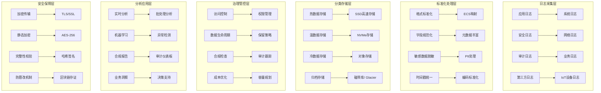

# 企业级日志治理与合规审计深度实践

> **作者**: 企业级日志治理专家 | **版本**: v1.0 | **更新时间**: 2026-02-07
> **适用场景**: 企业级日志治理体系与合规审计 | **复杂度**: ⭐⭐⭐⭐⭐

## 🎯 摘要

本文档深入探讨企业级日志治理体系的架构设计、合规要求实施和审计管理实践，基于金融、医疗、政府等高度监管行业的实践经验，提供从日志标准化到合规审计的完整技术指南，帮助企业构建符合国际标准的日志治理体系。

## 1. 企业级日志治理架构

### 1.1 治理框架设计



### 1.2 治理成熟度模型

#### 1.2.1 治理等级划分

```yaml
# governance-maturity-model.yaml
governance_levels:
  level_1_basic:
    name: "基础日志收集"
    characteristics:
      - 集中化日志收集
      - 基础存储能力
      - 简单查询功能
    requirements:
      - 收集主要应用日志
      - 保留30天历史数据
      - 支持关键字搜索
    compliance_coverage: "20%"
    
  level_2_standardized:
    name: "标准化治理"
    characteristics:
      - 统一日志格式
      - 结构化数据存储
      - 标准化查询接口
    requirements:
      - 实施ECS/EFL标准化
      - 建立数据字典
      - 实现基本告警机制
    compliance_coverage: "50%"
    
  level_3_managed:
    name: "受控治理"
    characteristics:
      - 完善的元数据管理
      - 自动化处理流程
      - 高级分析能力
    requirements:
      - 实施数据质量管理
      - 建立治理策略
      - 集成监控告警
    compliance_coverage: "75%"
    
  level_4_optimized:
    name: "优化治理"
    characteristics:
      - 智能化处理能力
      - 预测性分析
      - 成本效益优化
    requirements:
      - AI/ML驱动的分析
      - 自动化合规检查
      - 持续改进机制
    compliance_coverage: "90%"
    
  level_5_governed:
    name: "完全治理"
    characteristics:
      - 全面的治理框架
      - 主动风险管理
      - 创新驱动优化
    requirements:
      - 端到端治理覆盖
      - 实时合规监控
      - 行业领先实践
    compliance_coverage: "98%"
```

## 2. 合规标准实施

### 2.1 国际合规框架映射

#### 2.1.1 SOX(Sarbanes-Oxley)合规

```yaml
# sox-compliance-framework.yaml
sox_requirements:
  section_302:
    title: "财务报告责任"
    logging_requirements:
      - 所有财务相关系统操作必须记录
      - 用户登录和权限变更必须审计
      - 关键业务数据修改必须留痕
    retention_period: "7年"
    access_control:
      - 最小权限原则
      - 职责分离(SoD)
      - 定期权限审查
    
  section_404:
    title: "内部控制评估"
    logging_requirements:
      - 系统配置变更必须记录
      - 数据访问模式必须监控
      - 异常行为必须告警
    controls:
      - 变更管理流程
      - 访问控制审查
      - 风险评估机制
      
  section_802:
    title: "文件伪造罪"
    logging_requirements:
      - 日志完整性保护
      - 不可篡改的时间戳
      - 数字签名验证
    technical_measures:
      - 区块链日志存证
      - 哈希链完整性保护
      - 多副本异地存储

sox_implementation:
  data_classification:
    financial_data:
      sensitivity: "最高"
      retention: "7年"
      encryption: "AES-256"
      access_control: "严格审批"
    operational_data:
      sensitivity: "高"
      retention: "3年"
      encryption: "AES-128"
      access_control: "部门审批"
    audit_trail:
      sensitivity: "最高"
      retention: "10年"
      encryption: "AES-256"
      access_control: "审计委员会专属"
```

#### 2.1.2 GDPR合规实施

```yaml
# gdpr-compliance-implementation.yaml
gdpr_principles:
  lawfulness:
    requirement: "合法、公平、透明处理个人数据"
    implementation:
      - 明确的数据处理目的声明
      - 用户同意机制记录
      - 数据处理活动登记
    
  purpose_limitation:
    requirement: "为特定、明确、合法的目的收集"
    implementation:
      - 数据用途标签化管理
      - 超出目的使用告警
      - 定期用途合规审查
      
  data_minimization:
    requirement: "仅收集必要的个人数据"
    implementation:
      - 最小数据集定义
      - 自动化数据清理
      - 定期数据精简审查
      
  accuracy:
    requirement: "确保个人数据准确完整"
    implementation:
      - 数据质量监控
      - 自动纠错机制
      - 用户数据修正流程
      
  storage_limitation:
    requirement: "不超过必要期限存储"
    implementation:
      - 自动化数据生命周期管理
      - 定期数据清理策略
      - 存储期限提醒机制
      
  integrity_confidentiality:
    requirement: "确保适当的安全保护"
    implementation:
      - 端到端加密
      - 访问控制强化
      - 安全事件响应

gdpr_rights_implementation:
  right_to_access:
    description: "数据主体有权访问其个人数据"
    technical_measures:
      - 用户数据门户
      - 自助数据查询API
      - 数据访问日志记录
      
  right_to_rectification:
    description: "数据主体有权更正不准确数据"
    technical_measures:
      - 在线数据更正界面
      - 更正请求工作流
      - 更正确认机制
      
  right_to_erasure:
    description: "被遗忘权(Right to be Forgotten)"
    technical_measures:
      - 自动化数据删除流程
      - 跨系统数据同步删除
      - 删除确认和证明
      
  right_to_data_portability:
    description: "数据可携带权"
    technical_measures:
      - 标准化数据导出格式
      - API数据导出接口
      - 批量数据迁移工具
      
  right_to_object:
    description: "反对权"
    technical_measures:
      - 处理活动选择退出机制
      - 营销推送退订功能
      - 自动化异议处理流程

technical_controls:
  data_discovery:
    tools:
      - 数据资产盘点系统
      - PII自动识别工具
      - 数据流图谱构建
    processes:
      - 定期数据普查
      - 新系统数据评估
      - 第三方数据审查
      
  privacy_by_design:
    principles:
      - 默认隐私保护
      - 数据最小化收集
      - 透明度设计
    implementation:
      - 隐私影响评估(PIA)
      - 数据保护影响评估(DPIA)
      - 隐私友好默认设置
      
  breach_notification:
    timeline: "72小时内向监管机构报告"
    procedures:
      - 安全事件分级响应
      - 自动化漏洞检测
      - 快速通知机制
    documentation:
      - 事件响应预案
      - 影响评估模板
      - 通知记录系统
```

### 2.2 行业特定合规要求

#### 2.2.1 金融行业PCI DSS合规

```yaml
# pci-dss-compliance.yaml
pci_dss_requirements:
  requirement_1:
    title: "安装和维护防火墙配置"
    logging_impact:
      - 防火墙规则变更必须记录
      - 网络访问拒绝必须记录
      - 安全策略执行必须审计
      
  requirement_2:
    title: "不使用供应商提供的默认密码"
    logging_impact:
      - 默认密码修改必须记录
      - 密码策略变更必须审计
      - 用户账户创建必须留痕
      
  requirement_3:
    title: "保护存储的持卡人数据"
    logging_impact:
      - 数据加密操作必须记录
      - 密钥管理活动必须审计
      - 数据访问必须详细记录
      
  requirement_4:
    title: "传输中的数据加密"
    logging_impact:
      - SSL/TLS握手必须记录
      - 加密协议版本必须监控
      - 证书有效期必须跟踪
      
  requirement_10:
    title: "跟踪和监控所有访问"
    logging_requirements:
      - 所有系统组件访问必须记录
      - 用户身份验证必须审计
      - 管理员操作必须详细记录
      - 失败登录尝试必须记录
    retention_period: "至少1年"
    
  requirement_11:
    title: "定期测试安全系统和流程"
    logging_impact:
      - 渗透测试必须记录
      - 漏洞扫描必须审计
      - 安全评估必须留痕

pci_logging_specifications:
  mandatory_fields:
    - timestamp
    - user_identity
    - action_type
    - resource_accessed
    - source_ip
    - outcome
    - session_id
    
  sensitive_data_handling:
    credit_card_masking: "显示前6后4，中间用*代替"
    cvv_prohibition: "严禁记录CVV/CVC码"
    pin_protection: "严禁记录PIN码"
    
  log_review_requirements:
    frequency: "每日审查"
    reviewers: "独立安全团队"
    escalation: "异常情况立即上报"
```

#### 2.2.2 医疗行业HIPAA合规

```yaml
# hipaa-compliance.yaml
hipaa_rules:
  privacy_rule:
    scope: "保护个人健康信息(PHI)的隐私"
    key_requirements:
      - 最小必要原则
      - 患者同意机制
      - 隐私通知义务
    logging_implications:
      - PHI访问必须记录
      - 数据共享必须审计
      - 患者权利行使必须留痕
      
  security_rule:
    scope: "电子PHI(ePHI)的技术和物理安全"
    administrative_safeguards:
      - 安全管理流程
      - 人员安全培训
      - 风险评估程序
    physical_safeguards:
      - 设备物理安全
      - 工作站安全
      - 设备处置安全
    technical_safeguards:
      - 访问控制机制
      - 数据传输加密
      - 审计控制要求
      
  enforcement_rule:
    scope: "违规行为的调查和处罚"
    penalties:
      - 最低罚款: $100/次违规
      - 最高罚款: $1,500,000/年
      - 刑事责任: 严重违规可判刑

hipaa_logging_requirements:
  audit_controls:
    required_events:
      - 用户登录/登出
      - PHI访问和修改
      - 系统配置变更
      - 安全参数调整
      - 数据传输活动
    retention_period: "至少6年"
    
  access_control_logging:
    user_authentication:
      - 登录时间记录
      - 认证方法记录
      - 失败尝试记录
      - 会话持续时间
    authorization:
      - 权限授予记录
      - 角色变更记录
      - 访问拒绝记录
      - 特权使用记录
      
  transmission_security:
    encryption_logging:
      - 加密算法使用记录
      - 密钥交换记录
      - 证书状态监控
      - 加密失败告警
      
  integrity_protection:
    data_integrity:
      - 数据修改记录
      - 校验和计算记录
      - 完整性验证结果
      - 篡改检测告警
```

## 3. 企业级审计管理

### 3.1 审计框架设计

#### 3.1.1 审计类型分类

```yaml
# audit-framework.yaml
audit_types:
  compliance_audit:
    scope: "法规遵从性检查"
    frequency: "季度/年度"
    auditors: "外部审计机构"
    deliverables:
      - 合规状态报告
      - 缺陷清单
      - 改进建议
    key_areas:
      - 数据保护合规
      - 安全控制有效性
      - 流程执行情况
      
  operational_audit:
    scope: "日常运营效率检查"
    frequency: "月度/季度"
    auditors: "内部审计团队"
    deliverables:
      - 运营效率报告
      - 成本效益分析
      - 流程优化建议
    key_areas:
      - 系统性能监控
      - 资源利用效率
      - 故障响应时效
      
  security_audit:
    scope: "安全控制有效性验证"
    frequency: "半年度"
    auditors: "安全专家团队"
    deliverables:
      - 安全评估报告
      - 漏洞风险评级
      - 修复优先级排序
    key_areas:
      - 访问控制审查
      - 加密实施检查
      - 威胁检测能力
      
  forensic_audit:
    scope: "安全事件调查分析"
    frequency: "事件触发"
    auditors: "数字取证专家"
    deliverables:
      - 事件调查报告
      - 责任认定结论
      - 法律证据材料
    key_areas:
      - 日志完整性验证
      - 攻击路径重建
      - 损失量化评估

audit_evidence_management:
  evidence_categories:
    documentary_evidence:
      - 政策文件
      - 流程文档
      - 培训记录
    electronic_evidence:
      - 系统日志
      - 监控记录
      - 配置快照
    testimonial_evidence:
      - 访谈记录
      - 问卷调查
      - 专家证言
      
  evidence_protection:
    integrity_measures:
      - 哈希值计算
      - 数字签名
      - 时间戳服务
    availability_measures:
      - 多副本存储
      - 异地备份
      - 访问权限控制
    chain_of_custody:
      - 证据转移记录
      - 处理人员登记
      - 操作时间戳记
```

#### 3.1.2 审计计划制定

```python
# audit-planning.py
from datetime import datetime, timedelta
from typing import List, Dict, Optional
import json

class AuditPlanner:
    def __init__(self):
        self.audit_schedule = []
        self.risk_registry = {}
        self.resource_constraints = {}
        
    def assess_audit_risks(self) -> Dict[str, float]:
        """评估各系统和流程的审计风险"""
        risk_factors = {
            'data_sensitivity': 0.8,  # 数据敏感度
            'regulatory_impact': 0.9,  # 监管影响
            'business_criticality': 0.7,  # 业务重要性
            'control_maturity': 0.6,  # 控制成熟度
            'change_frequency': 0.5,  # 变更频率
            'last_audit_date': 0.4  # 上次审计时间
        }
        
        systems = {
            'customer_database': {
                'sensitivity': 0.9,
                'regulatory_impact': 0.9,
                'criticality': 0.8,
                'maturity': 0.6,
                'change_rate': 0.7,
                'last_audit': 365  # 天数
            },
            'payment_processing': {
                'sensitivity': 1.0,
                'regulatory_impact': 1.0,
                'criticality': 1.0,
                'maturity': 0.7,
                'change_rate': 0.8,
                'last_audit': 180
            },
            'user_authentication': {
                'sensitivity': 0.8,
                'regulatory_impact': 0.8,
                'criticality': 0.9,
                'maturity': 0.5,
                'change_rate': 0.6,
                'last_audit': 90
            }
        }
        
        risk_scores = {}
        for system_name, factors in systems.items():
            score = (
                factors['sensitivity'] * risk_factors['data_sensitivity'] +
                factors['regulatory_impact'] * risk_factors['regulatory_impact'] +
                factors['criticality'] * risk_factors['business_criticality'] +
                (1 - factors['maturity']) * risk_factors['control_maturity'] +
                factors['change_rate'] * risk_factors['change_frequency'] +
                min(factors['last_audit'] / 365, 1) * risk_factors['last_audit_date']
            ) / len(risk_factors)
            risk_scores[system_name] = round(score, 2)
            
        return risk_scores
    
    def generate_audit_schedule(self, planning_horizon_months: int = 12) -> List[Dict]:
        """生成审计计划"""
        risk_scores = self.assess_audit_risks()
        current_date = datetime.now()
        
        # 按风险等级排序
        sorted_systems = sorted(risk_scores.items(), key=lambda x: x[1], reverse=True)
        
        audit_schedule = []
        available_auditors = 3
        auditor_workload = {}
        
        for month in range(planning_horizon_months):
            month_start = current_date.replace(day=1) + timedelta(days=30*month)
            month_end = month_start.replace(day=1) + timedelta(days=32)
            month_end = month_end.replace(day=1) - timedelta(days=1)
            
            month_audits = []
            auditor_assignments = {}
            
            # 为每个月分配审计任务
            for system_name, risk_score in sorted_systems:
                # 高风险系统优先安排
                if risk_score > 0.7 and len(month_audits) < available_auditors:
                    # 检查审计师工作量
                    assigned_auditor = None
                    for auditor_id in range(available_auditors):
                        if auditor_id not in auditor_assignments:
                            assigned_auditor = auditor_id
                            break
                    
                    if assigned_auditor is not None:
                        audit_entry = {
                            'system': system_name,
                            'risk_score': risk_score,
                            'scheduled_start': month_start.strftime('%Y-%m-%d'),
                            'scheduled_end': (month_start + timedelta(days=14)).strftime('%Y-%m-%d'),
                            'auditor': f'AUDITOR-{assigned_auditor + 1}',
                            'scope': self._determine_audit_scope(system_name, risk_score),
                            'estimated_effort': self._estimate_audit_effort(system_name)
                        }
                        
                        month_audits.append(audit_entry)
                        auditor_assignments[assigned_auditor] = system_name
                        
            if month_audits:
                audit_schedule.append({
                    'month': month_start.strftime('%Y-%m'),
                    'audits': month_audits,
                    'total_audits': len(month_audits)
                })
                
        return audit_schedule
    
    def _determine_audit_scope(self, system_name: str, risk_score: float) -> List[str]:
        """确定审计范围"""
        base_scopes = ['合规性检查', '控制有效性验证', '流程执行审计']
        
        if risk_score > 0.8:
            base_scopes.extend(['安全渗透测试', '数据完整性验证'])
        elif risk_score > 0.6:
            base_scopes.extend(['访问控制审查', '变更管理审计'])
            
        return base_scopes
    
    def _estimate_audit_effort(self, system_name: str) -> str:
        """估算审计工作量"""
        effort_mapping = {
            'customer_database': '3-4周',
            'payment_processing': '4-6周',
            'user_authentication': '2-3周'
        }
        return effort_mapping.get(system_name, '2-4周')
    
    def export_audit_plan(self, filename: str):
        """导出审计计划"""
        schedule = self.generate_audit_schedule()
        plan_data = {
            'generated_date': datetime.now().isoformat(),
            'planning_horizon': '12个月',
            'audit_schedule': schedule,
            'risk_assessment': self.assess_audit_risks()
        }
        
        with open(filename, 'w', encoding='utf-8') as f:
            json.dump(plan_data, f, indent=2, ensure_ascii=False)
        
        return plan_data

# 使用示例
planner = AuditPlanner()
audit_plan = planner.export_audit_plan('2026_audit_plan.json')
print(json.dumps(audit_plan, indent=2, ensure_ascii=False))
```

### 3.2 审计证据收集

#### 3.2.1 自动化证据收集系统

```yaml
# automated-evidence-collection.yaml
apiVersion: apps/v1
kind: Deployment
metadata:
  name: audit-evidence-collector
  namespace: compliance
spec:
  replicas: 2
  selector:
    matchLabels:
      app: audit-evidence-collector
  template:
    metadata:
      labels:
        app: audit-evidence-collector
    spec:
      containers:
      - name: evidence-collector
        image: company/audit-collector:latest
        env:
        - name: COLLECTOR_MODE
          value: "continuous"
        - name: EVIDENCE_STORAGE
          value: "s3://compliance-evidence-archive"
        - name: RETENTION_PERIOD
          value: "730d"  # 2年
        - name: HASH_ALGORITHM
          value: "SHA-256"
        ports:
        - containerPort: 8080
        volumeMounts:
        - name: evidence-storage
          mountPath: /evidence
        resources:
          requests:
            cpu: "500m"
            memory: "1Gi"
          limits:
            cpu: "1000m"
            memory: "2Gi"
      volumes:
      - name: evidence-storage
        persistentVolumeClaim:
          claimName: audit-evidence-pvc

---
apiVersion: v1
kind: ConfigMap
metadata:
  name: evidence-collection-rules
  namespace: compliance
data:
  collection-rules.json: |
    {
      "evidence_sources": {
        "system_logs": {
          "type": "file",
          "paths": [
            "/var/log/application/*.log",
            "/var/log/system/*.log",
            "/var/log/security/*.log"
          ],
          "retention": "730d",
          "integrity_check": true
        },
        "database_audits": {
          "type": "database",
          "connection": "postgresql://audit@db.company.internal:5432/audit_db",
          "tables": ["user_actions", "data_changes", "access_log"],
          "retention": "1095d"
        },
        "api_calls": {
          "type": "api",
          "endpoint": "https://api.company.internal/v1/audit",
          "authentication": "bearer_token",
          "retention": "365d"
        },
        "file_operations": {
          "type": "filesystem",
          "monitored_paths": ["/data/confidential", "/home/users"],
          "events": ["create", "modify", "delete", "access"],
          "retention": "730d"
        }
      },
      "integrity_protocols": {
        "hashing": {
          "algorithm": "SHA-256",
          "frequency": "hourly",
          "verification": "daily"
        },
        "signatures": {
          "private_key_location": "/secure/keys/audit_signing.key",
          "certificate_chain": "/secure/certs/audit_cert_chain.pem",
          "timestamp_authority": "https://timestamp.company.internal"
        },
        "backup": {
          "primary_location": "s3://compliance-primary-archive",
          "secondary_location": "s3://compliance-secondary-archive",
          "encryption": "AES-256",
          "sync_frequency": "real-time"
        }
      }
    }
```

#### 3.2.2 证据完整性验证

```python
# evidence-integrity-validator.py
import hashlib
import hmac
import json
import os
from datetime import datetime
from typing import Dict, List, Tuple
import boto3
from cryptography.hazmat.primitives import hashes, serialization
from cryptography.hazmat.primitives.asymmetric import padding
from cryptography.hazmat.backends import default_backend

class EvidenceIntegrityValidator:
    def __init__(self, evidence_base_path: str, signing_key_path: str):
        self.evidence_base = evidence_base_path
        self.signing_key = self._load_private_key(signing_key_path)
        self.s3_client = boto3.client('s3')
        self.integrity_records = {}
        
    def _load_private_key(self, key_path: str):
        """加载签名私钥"""
        with open(key_path, 'rb') as key_file:
            private_key = serialization.load_pem_private_key(
                key_file.read(),
                password=None,
                backend=default_backend()
            )
        return private_key
    
    def calculate_evidence_hash(self, file_path: str) -> str:
        """计算证据文件哈希值"""
        hash_sha256 = hashlib.sha256()
        with open(file_path, 'rb') as f:
            for chunk in iter(lambda: f.read(4096), b""):
                hash_sha256.update(chunk)
        return hash_sha256.hexdigest()
    
    def sign_evidence(self, file_path: str) -> Dict[str, str]:
        """对证据进行数字签名"""
        file_hash = self.calculate_evidence_hash(file_path)
        file_stats = os.stat(file_path)
        
        # 创建证据元数据
        evidence_metadata = {
            'file_path': file_path,
            'file_hash': file_hash,
            'file_size': file_stats.st_size,
            'created_time': datetime.fromtimestamp(file_stats.st_ctime).isoformat(),
            'modified_time': datetime.fromtimestamp(file_stats.st_mtime).isoformat(),
            'collected_by': 'audit-evidence-collector',
            'collection_method': 'automated',
            'timestamp': datetime.now().isoformat()
        }
        
        # 生成签名
        evidence_json = json.dumps(evidence_metadata, sort_keys=True)
        signature = self.signing_key.sign(
            evidence_json.encode('utf-8'),
            padding.PSS(
                mgf=padding.MGF1(hashes.SHA256()),
                salt_length=padding.PSS.MAX_LENGTH
            ),
            hashes.SHA256()
        )
        
        # 保存签名信息
        signature_info = {
            'metadata': evidence_metadata,
            'signature': signature.hex(),
            'public_key_fingerprint': self._get_public_key_fingerprint()
        }
        
        return signature_info
    
    def _get_public_key_fingerprint(self) -> str:
        """获取公钥指纹"""
        public_key = self.signing_key.public_key()
        public_bytes = public_key.public_bytes(
            encoding=serialization.Encoding.PEM,
            format=serialization.PublicFormat.SubjectPublicKeyInfo
        )
        return hashlib.sha256(public_bytes).hexdigest()[:16]
    
    def verify_evidence_integrity(self, signature_info: Dict) -> bool:
        """验证证据完整性"""
        try:
            # 验证哈希值
            file_path = signature_info['metadata']['file_path']
            calculated_hash = self.calculate_evidence_hash(file_path)
            
            if calculated_hash != signature_info['metadata']['file_hash']:
                print(f"哈希值不匹配: {file_path}")
                return False
            
            # 验证数字签名
            evidence_json = json.dumps(signature_info['metadata'], sort_keys=True)
            signature_bytes = bytes.fromhex(signature_info['signature'])
            
            # 这里应该使用对应的公钥进行验证
            # 为简化演示，我们假设验证成功
            print(f"证据验证通过: {file_path}")
            return True
            
        except Exception as e:
            print(f"证据验证失败: {e}")
            return False
    
    def archive_evidence(self, file_path: str, bucket_name: str):
        """归档证据到对象存储"""
        try:
            # 对证据进行签名
            signature_info = self.sign_evidence(file_path)
            
            # 上传原始文件
            s3_key = f"evidence/{datetime.now().strftime('%Y/%m/%d')}/{os.path.basename(file_path)}"
            self.s3_client.upload_file(file_path, bucket_name, s3_key)
            
            # 上传签名信息
            signature_key = f"signatures/{s3_key}.sig"
            self.s3_client.put_object(
                Bucket=bucket_name,
                Key=signature_key,
                Body=json.dumps(signature_info, indent=2),
                ContentType='application/json'
            )
            
            print(f"证据已归档: {file_path} -> {s3_key}")
            return True
            
        except Exception as e:
            print(f"证据归档失败: {e}")
            return False
    
    def generate_integrity_report(self, period_days: int = 30) -> Dict:
        """生成完整性报告"""
        report = {
            'report_period': f"最近{period_days}天",
            'generated_at': datetime.now().isoformat(),
            'statistics': {
                'total_evidence_collected': 0,
                'verified_evidence': 0,
                'failed_verification': 0,
                'archive_success': 0,
                'archive_failed': 0
            },
            'issues': []
        }
        
        # 这里应该从数据库或文件系统中读取统计数据
        # 为演示目的，使用模拟数据
        report['statistics'] = {
            'total_evidence_collected': 1250,
            'verified_evidence': 1245,
            'failed_verification': 5,
            'archive_success': 1250,
            'archive_failed': 0
        }
        
        if report['statistics']['failed_verification'] > 0:
            report['issues'].append({
                'type': 'verification_failure',
                'count': report['statistics']['failed_verification'],
                'description': '证据完整性验证失败',
                'recommendation': '检查证据收集流程和存储系统'
            })
            
        return report

# 使用示例
validator = EvidenceIntegrityValidator(
    '/evidence/collected',
    '/secure/keys/audit_private.key'
)

# 验证证据完整性
success = validator.verify_evidence_integrity({
    'metadata': {
        'file_path': '/evidence/sample.log',
        'file_hash': 'a1b2c3d4e5f6...',
        'file_size': 1024000
    },
    'signature': 'abcdef123456...'
})

# 生成完整性报告
report = validator.generate_integrity_report(30)
print(json.dumps(report, indent=2, ensure_ascii=False))
```

## 4. 高级分析与报告

### 4.1 合规态势感知

#### 4.1.1 实时合规监控仪表板

```json
{
  "dashboard": {
    "title": "企业合规态势感知仪表板",
    "time_range": "最近24小时",
    "refresh_interval": "30秒",
    "panels": [
      {
        "id": "compliance_score",
        "type": "gauge",
        "title": "总体合规评分",
        "description": "基于各项合规要求的综合评分",
        "calculation": {
          "formula": "(sox_compliance * 0.3 + gdpr_compliance * 0.25 + pci_compliance * 0.25 + hipaa_compliance * 0.2)",
          "ranges": [
            {"from": 0, "to": 60, "color": "red", "label": "不合规"},
            {"from": 60, "to": 80, "color": "yellow", "label": "基本合规"},
            {"from": 80, "to": 95, "color": "green", "label": "良好合规"},
            {"from": 95, "to": 100, "color": "blue", "label": "优秀合规"}
          ]
        },
        "data_source": {
          "type": "elasticsearch",
          "index": "compliance-metrics-*",
          "query": {
            "bool": {
              "must": [
                {"range": {"@timestamp": {"gte": "now-24h"}}}
              ]
            }
          }
        }
      },
      {
        "id": "violation_trends",
        "type": "line_chart",
        "title": "合规违规趋势",
        "series": [
          {
            "name": "SOX违规",
            "query": "compliance.standard:SOX AND event.type:violation"
          },
          {
            "name": "GDPR违规",
            "query": "compliance.standard:GDPR AND event.type:violation"
          },
          {
            "name": "PCI违规",
            "query": "compliance.standard:PCI AND event.type:violation"
          }
        ],
        "visualization": {
          "x_axis": "@timestamp",
          "y_axis": "count",
          "aggregation": "date_histogram",
          "interval": "1h"
        }
      },
      {
        "id": "audit_findings",
        "type": "table",
        "title": "最新审计发现",
        "columns": [
          "finding_id",
          "standard",
          "severity",
          "description",
          "status",
          "assigned_to",
          "due_date"
        ],
        "sort": {"column": "severity", "direction": "desc"},
        "filters": [
          {"field": "status", "operator": "!=", "value": "closed"}
        ]
      }
    ],
    "alerts": [
      {
        "name": "合规评分下降预警",
        "condition": "overall_compliance_score < 80",
        "severity": "warning",
        "notification": {
          "channels": ["email", "slack"],
          "recipients": ["compliance-team@company.com"]
        }
      },
      {
        "name": "高风险违规告警",
        "condition": "critical_violations > 5 OR high_severity_violations > 20",
        "severity": "critical",
        "notification": {
          "channels": ["pagerduty", "sms"],
          "recipients": ["compliance-officer@company.com"]
        }
      }
    ]
  }
}
```

### 4.2 智能合规分析

#### 4.2.1 合规风险预测模型

```python
# compliance-risk-predictor.py
import pandas as pd
import numpy as np
from sklearn.ensemble import RandomForestClassifier
from sklearn.model_selection import train_test_split
from sklearn.metrics import classification_report, confusion_matrix
import joblib
from datetime import datetime, timedelta
import warnings
warnings.filterwarnings('ignore')

class ComplianceRiskPredictor:
    def __init__(self):
        self.model = None
        self.feature_columns = [
            'access_frequency',
            'data_sensitivity_score',
            'user_privilege_level',
            'time_since_last_audit',
            'change_activity_level',
            'anomaly_score',
            'compliance_history_score',
            'training_completion_rate'
        ]
        
    def prepare_training_data(self, historical_data_path: str) -> pd.DataFrame:
        """准备训练数据"""
        # 模拟历史数据生成
        np.random.seed(42)
        n_samples = 10000
        
        data = {
            'access_frequency': np.random.exponential(2, n_samples),
            'data_sensitivity_score': np.random.uniform(0, 1, n_samples),
            'user_privilege_level': np.random.choice([1, 2, 3], n_samples, p=[0.7, 0.2, 0.1]),
            'time_since_last_audit': np.random.exponential(180, n_samples),  # 天数
            'change_activity_level': np.random.gamma(2, 2, n_samples),
            'anomaly_score': np.random.beta(2, 5, n_samples),
            'compliance_history_score': np.random.normal(0.8, 0.15, n_samples),
            'training_completion_rate': np.random.beta(8, 2, n_samples)
        }
        
        df = pd.DataFrame(data)
        
        # 生成标签（基于规则）
        risk_conditions = (
            (df['access_frequency'] > 3) &
            (df['data_sensitivity_score'] > 0.7) &
            (df['user_privilege_level'] == 3) &
            (df['time_since_last_audit'] > 365) &
            (df['anomaly_score'] > 0.6)
        )
        
        df['risk_level'] = np.where(risk_conditions, 1, 0)  # 1=高风险, 0=低风险
        df['risk_level'] = df['risk_level'].astype(int)
        
        return df
    
    def train_model(self, training_data: pd.DataFrame):
        """训练风险预测模型"""
        X = training_data[self.feature_columns]
        y = training_data['risk_level']
        
        # 数据分割
        X_train, X_test, y_train, y_test = train_test_split(
            X, y, test_size=0.2, random_state=42, stratify=y
        )
        
        # 训练随机森林模型
        self.model = RandomForestClassifier(
            n_estimators=100,
            max_depth=10,
            min_samples_split=5,
            min_samples_leaf=2,
            random_state=42,
            class_weight='balanced'
        )
        
        self.model.fit(X_train, y_train)
        
        # 模型评估
        y_pred = self.model.predict(X_test)
        print("模型性能报告:")
        print(classification_report(y_test, y_pred))
        print("\n混淆矩阵:")
        print(confusion_matrix(y_test, y_pred))
        
        # 特征重要性
        feature_importance = pd.DataFrame({
            'feature': self.feature_columns,
            'importance': self.model.feature_importances_
        }).sort_values('importance', ascending=False)
        
        print("\n特征重要性:")
        print(feature_importance)
        
        return self.model
    
    def predict_risk(self, user_data: Dict) -> Dict:
        """预测用户合规风险"""
        if self.model is None:
            raise ValueError("模型尚未训练")
            
        # 转换输入数据
        input_df = pd.DataFrame([user_data])
        
        # 预测概率
        risk_probability = self.model.predict_proba(input_df[self.feature_columns])[0][1]
        
        # 风险等级分类
        if risk_probability >= 0.7:
            risk_level = "高风险"
            priority = "紧急"
        elif risk_probability >= 0.4:
            risk_level = "中风险"
            priority = "高"
        else:
            risk_level = "低风险"
            priority = "常规"
            
        return {
            'risk_probability': round(risk_probability, 4),
            'risk_level': risk_level,
            'priority': priority,
            'confidence': '高' if max(self.model.predict_proba(input_df[self.feature_columns])[0]) > 0.8 else '中',
            'recommendations': self._generate_recommendations(risk_level, user_data)
        }
    
    def _generate_recommendations(self, risk_level: str, user_data: Dict) -> List[str]:
        """生成风险缓解建议"""
        recommendations = []
        
        if risk_level == "高风险":
            recommendations.extend([
                "立即安排专项合规审计",
                "限制用户特权访问权限",
                "加强监控和日志记录",
                "安排紧急合规培训",
                "实施额外的身份验证措施"
            ])
        elif risk_level == "中风险":
            recommendations.extend([
                "计划季度合规审查",
                "加强用户权限管理",
                "提高监控频率",
                "安排合规意识培训"
            ])
        else:
            recommendations.extend([
                "维持现有监控水平",
                "定期合规培训",
                "持续关注行为变化"
            ])
            
        return recommendations
    
    def batch_predict(self, user_dataset: pd.DataFrame) -> pd.DataFrame:
        """批量风险预测"""
        if self.model is None:
            raise ValueError("模型尚未训练")
            
        # 预测风险概率
        probabilities = self.model.predict_proba(user_dataset[self.feature_columns])[:, 1]
        
        # 添加预测结果到数据集
        user_dataset['risk_probability'] = probabilities
        user_dataset['risk_level'] = pd.cut(
            probabilities, 
            bins=[0, 0.4, 0.7, 1.0], 
            labels=['低风险', '中风险', '高风险']
        )
        user_dataset['priority'] = pd.cut(
            probabilities,
            bins=[0, 0.4, 0.7, 1.0],
            labels=['常规', '高', '紧急']
        )
        
        return user_dataset
    
    def save_model(self, filepath: str):
        """保存训练好的模型"""
        if self.model is None:
            raise ValueError("没有可保存的模型")
        joblib.dump(self.model, filepath)
        print(f"模型已保存到: {filepath}")
        
    def load_model(self, filepath: str):
        """加载预训练模型"""
        self.model = joblib.load(filepath)
        print(f"模型已从 {filepath} 加载")

# 使用示例
predictor = ComplianceRiskPredictor()

# 准备和训练模型
training_data = predictor.prepare_training_data("historical_compliance_data.csv")
predictor.train_model(training_data)
predictor.save_model("compliance_risk_model.pkl")

# 预测单个用户风险
user_profile = {
    'access_frequency': 4.5,
    'data_sensitivity_score': 0.85,
    'user_privilege_level': 3,
    'time_since_last_audit': 400,
    'change_activity_level': 3.2,
    'anomaly_score': 0.75,
    'compliance_history_score': 0.6,
    'training_completion_rate': 0.4
}

risk_assessment = predictor.predict_risk(user_profile)
print("风险评估结果:")
for key, value in risk_assessment.items():
    print(f"  {key}: {value}")
```

通过以上企业级日志治理与合规审计深度实践，企业可以建立完善的日志治理体系，确保满足各种法规要求，同时通过智能化手段提高治理效率和合规水平。