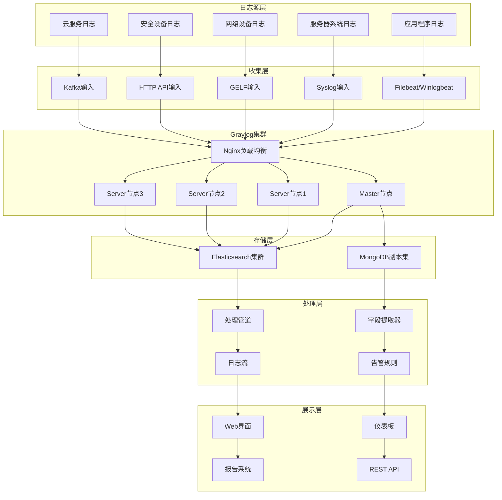

# Graylog 企业级日志管理平台深度实践

## 概述 (Overview)

Graylog是开源的企业级日志管理平台，提供强大的日志收集、存储、搜索和分析功能。本文档从企业级运维专家角度，深入探讨Graylog的架构设计、部署策略、日志处理管道和最佳实践。

Graylog is an open-source enterprise log management platform that provides powerful log collection, storage, search, and analysis capabilities. This document explores Graylog's architecture design, deployment strategies, log processing pipelines, and best practices from an enterprise operations expert perspective.

## 架构设计 (Architecture Design)

### Graylog 企业级架构 (Enterprise Graylog Architecture)

```yaml
# Graylog 集群部署配置
graylog_cluster:
  version: "5.1"
  deployment:
    architecture: "microservices"
    nodes:
      master_node:
        role: "master"
        heap_size: "4g"
        plugins: ["elasticsearch", "mongodb"]
        
      server_nodes:
        - node_id: "graylog-server-1"
          role: "server"
          heap_size: "8g"
          plugins: ["pipeline-processor", "archive"]
          
        - node_id: "graylog-server-2" 
          role: "server"
          heap_size: "8g"
          plugins: ["pipeline-processor", "archive"]
          
        - node_id: "graylog-server-3"
          role: "server"
          heap_size: "8g"
          plugins: ["pipeline-processor", "archive"]
          
    load_balancer:
      type: "nginx"
      ssl_termination: true
      health_checks: true
      
  # 存储后端配置
  storage_backend:
    elasticsearch:
      version: "7.17"
      cluster:
        nodes:
          - "es-node-1:9200"
          - "es-node-2:9200" 
          - "es-node-3:9200"
      index_settings:
        number_of_shards: 3
        number_of_replicas: 1
        refresh_interval: "30s"
        
    mongodb:
      version: "5.0"
      replica_set: "graylog-rs"
      nodes:
        - "mongo-1:27017"
        - "mongo-2:27017"
        - "mongo-3:27017"
```

### 架构图 (Architecture Diagram)



## 核心组件配置 (Core Component Configuration)

### 输入配置 (Input Configuration)

```yaml
# Graylog 输入配置
inputs:
  # Syslog UDP 输入
  syslog_udp:
    type: "org.graylog2.inputs.syslog.udp.SyslogUDPInput"
    title: "Syslog UDP Input"
    global: true
    configuration:
      bind_address: "0.0.0.0"
      port: 514
      recv_buffer_size: 262144
      number_worker_threads: 4
      
  # GELF HTTP 输入
  gelf_http:
    type: "org.graylog2.inputs.gelf.http.GELFHttpInput"
    title: "GELF HTTP Input"
    global: true
    configuration:
      bind_address: "0.0.0.0"
      port: 12201
      enable_cors: true
      enable_gzip: true
      
  # Beats 输入
  beats:
    type: "org.graylog.plugins.beats.BeatsInput"
    title: "Beats Input"
    global: true
    configuration:
      bind_address: "0.0.0.0"
      port: 5044
      tls_enable: true
      tls_cert_file: "/etc/graylog/certs/server.crt"
      tls_key_file: "/etc/graylog/certs/server.key"
      
  # Kafka 输入
  kafka:
    type: "org.graylog2.inputs.kafka.KafkaInput"
    title: "Kafka Input"
    global: true
    configuration:
      bootstrap_servers: "kafka-1:9092,kafka-2:9092,kafka-3:9092"
      topic_filter: "application-logs"
      consumer_group: "graylog-consumer"
      threads: 4
```

### 处理管道配置 (Processing Pipeline Configuration)

```json
{
  "pipeline_rules": {
    "nginx_access_log_processing": {
      "name": "Nginx Access Log Processing",
      "description": "处理Nginx访问日志",
      "source": "rule \"nginx_access_log\"\nwhen\n  has_field(\"message\") AND contains(to_string($message.message), \"nginx\")\nthen\n  let matches = regex(\"(?<remote_addr>[^ ]+) (?<remote_user>[^ ]+) (?<time_local>[^ ]+) \\\"(?<request>[^\"]+)\\\" (?<status>[^ ]+) (?<body_bytes_sent>[^ ]+) \\\"(?<http_referer>[^\"]*)\\\" \\\"(?<http_user_agent>[^\"]*)\\\"\", to_string($message.message));\n  set_field(\"remote_addr\", matches[\"remote_addr\"]);\n  set_field(\"request\", matches[\"request\"]);\n  set_field(\"status\", to_long(matches[\"status\"]));\n  set_field(\"body_bytes_sent\", to_long(matches[\"body_bytes_sent\"]));\n  set_field(\"http_user_agent\", matches[\"http_user_agent\"]);\n  set_field(\"log_type\", \"nginx_access\");\nend"
    },
    
    "application_error_detection": {
      "name": "Application Error Detection",
      "description": "检测应用错误日志",
      "source": "rule \"application_errors\"\nwhen\n  has_field(\"level\") AND ($message.level == \"ERROR\" OR $message.level == \"FATAL\")\nthen\n  set_field(\"alert_severity\", \"high\");\n  set_field(\"needs_attention\", true);\n  route_to_stream(\"application-errors\");\nend"
    },
    
    "security_event_enrichment": {
      "name": "Security Event Enrichment",
      "description": "安全事件丰富化处理",
      "source": "rule \"security_events\"\nwhen\n  has_field(\"event_type\") AND contains(to_string($message.event_type), \"security\")\nthen\n  // IP地理位置解析\n  let geo_result = lookup(\"geoip\", to_string($message.source_ip));\n  set_field(\"source_geo_country\", geo_result[\"country_name\"]);\n  set_field(\"source_geo_city\", geo_result[\"city_name\"]);\n  \n  // 威胁情报查询\n  let threat_result = lookup(\"threatintel\", to_string($message.source_ip));\n  if (threat_result[\"is_malicious\"] == true) {\n    set_field(\"threat_level\", \"high\");\n    set_field(\"malicious_activity\", true);\n  }\n  \n  set_field(\"processed_timestamp\", now());\nend"
    }
  }
}
```

### 字段提取器配置 (Field Extractor Configuration)

```yaml
# 字段提取器配置
field_extractors:
  # 正则表达式提取器 - Apache日志
  apache_log_extractor:
    title: "Apache Access Log Extractor"
    type: "regex"
    cursor_strategy: "copy"
    target_field: "message"
    source_field: "message"
    condition_type: "string"
    condition_value: "apache"
    configuration:
      regex_value: '^(?<remote_addr>\S+) (?<remote_user>\S+) (?<auth_user>\S+) \[(?<time_local>[^\]]+)\] "(?<method>\S+) (?<request>\S+) (?<protocol>\S+)" (?<status>\d+) (?<bytes_sent>\d+) "(?<referer>[^"]*)" "(?<user_agent>[^"]*)"'
      regex_group_names:
        - "remote_addr"
        - "remote_user"
        - "auth_user"
        - "time_local"
        - "method"
        - "request"
        - "protocol"
        - "status"
        - "bytes_sent"
        - "referer"
        - "user_agent"

  # Grok模式提取器 - 系统日志
  syslog_extractor:
    title: "Syslog Message Extractor"
    type: "grok"
    cursor_strategy: "copy"
    target_field: "message"
    source_field: "message"
    condition_type: "none"
    configuration:
      grok_pattern: '%{SYSLOGTIMESTAMP:timestamp} %{SYSLOGHOST:hostname} %{DATA:program}(?:\[%{POSINT:pid}\])?: %{GREEDYDATA:syslog_message}'

  # JSON提取器 - 应用日志
  json_extractor:
    title: "JSON Application Log Extractor"
    type: "json"
    cursor_strategy: "copy"
    target_field: "message"
    source_field: "message"
    condition_type: "string"
    condition_value: "{"
    configuration:
      flatten: true
      list_separator: ", "
      key_separator: "."
      kv_separator: "="
```

## 存储优化 (Storage Optimization)

### Elasticsearch 索引策略 (Elasticsearch Index Strategy)

```yaml
# Elasticsearch 索引生命周期管理
index_lifecycle_management:
  # 热温冷架构配置
  hot_warm_cold:
    hot_phase:
      duration: "7d"
      min_replicas: 1
      codec: "best_compression"
      
    warm_phase:
      duration: "30d"
      min_replicas: 1
      codec: "best_compression"
      force_merge_max_num_segments: 1
      
    cold_phase:
      duration: "90d"
      min_replicas: 0
      codec: "best_compression"
      
    delete_phase:
      duration: "365d"
      
  # 索引模板配置
  index_templates:
    application_logs:
      pattern: "graylog_application_*"
      settings:
        number_of_shards: 3
        number_of_replicas: 1
        refresh_interval: "30s"
        blocks:
          read_only_allow_delete: "false"
      mappings:
        properties:
          timestamp:
            type: "date"
          level:
            type: "keyword"
          message:
            type: "text"
            analyzer: "standard"
          host:
            type: "keyword"
            
    security_logs:
      pattern: "graylog_security_*"
      settings:
        number_of_shards: 5
        number_of_replicas: 2
        refresh_interval: "10s"
      mappings:
        properties:
          timestamp:
            type: "date"
          event_type:
            type: "keyword"
          source_ip:
            type: "ip"
          destination_ip:
            type: "ip"
          user_id:
            type: "keyword"
```

### 数据保留策略 (Data Retention Policy)

```json
{
  "retention_policies": {
    "critical_system_logs": {
      "name": "Critical System Logs",
      "streams": ["system-critical", "security-events"],
      "retention_time": "365d",
      "storage_tier": "hot_and_warm",
      "backup_required": true
    },
    
    "application_logs": {
      "name": "Application Logs",
      "streams": ["application-info", "application-warn"],
      "retention_time": "90d",
      "storage_tier": "hot_warm_cold",
      "backup_required": false
    },
    
    "debug_trace_logs": {
      "name": "Debug and Trace Logs",
      "streams": ["application-debug", "application-trace"],
      "retention_time": "7d",
      "storage_tier": "hot_only",
      "backup_required": false
    },
    
    "compliance_logs": {
      "name": "Compliance Required Logs",
      "streams": ["audit-logs", "financial-transactions"],
      "retention_time": "7 years",
      "storage_tier": "cold_archive",
      "backup_required": true,
      "immutable": true
    }
  }
}
```

## 告警和通知 (Alerting and Notifications)

### 告警规则配置 (Alert Rule Configuration)

```yaml
# Graylog 告警规则配置
alert_rules:
  # 高频错误告警
  high_error_rate:
    title: "High Error Rate Detected"
    description: "检测到高频错误日志"
    stream: "application-errors"
    condition:
      type: "field_value"
      field: "level"
      value: "ERROR"
      threshold_type: "MORE"
      threshold: 100
      grace_period: 300
      backlog: 10
      
  # 安全威胁告警
  security_threat:
    title: "Security Threat Detected"
    description: "检测到安全威胁活动"
    stream: "security-events"
    condition:
      type: "field_content_value"
      field: "threat_level"
      value: "high"
      grace_period: 60
      backlog: 50
      
  # 系统性能告警
  system_performance:
    title: "System Performance Degradation"
    description: "系统性能下降告警"
    stream: "system-metrics"
    condition:
      type: "aggregation"
      query: "avg(cpu_usage) > 80"
      grace_period: 180
      backlog: 20
      
  # 业务指标告警
  business_metrics:
    title: "Business Metric Threshold Exceeded"
    description: "关键业务指标超出阈值"
    stream: "business-logs"
    condition:
      type: "field_value"
      field: "transaction_amount"
      value: 10000
      threshold_type: "MORE"
      grace_period: 0
      backlog: 5
```

### 通知渠道配置 (Notification Channel Configuration)

```json
{
  "notification_channels": {
    "pagerduty_integration": {
      "type": "org.graylog2.plugins.pagerduty.PagerDutyAlarmCallback",
      "configuration": {
        "service_key": "your_pagerduty_service_key",
        "incident_key_prefix": "graylog-alert",
        "client_name": "Graylog Monitoring System",
        "client_url": "https://graylog.yourcompany.com"
      }
    },
    
    "slack_notification": {
      "type": "org.graylog2.plugins.slack.callback.SlackAlarmCallback",
      "configuration": {
        "color": "#FF0000",
        "icon_url": "https://graylog.yourcompany.com/assets/icon.png",
        "graylog2_url": "https://graylog.yourcompany.com",
        "link_names": true,
        "webhook_url": "https://hooks.slack.com/services/YOUR/SLACK/WEBHOOK",
        "username": "Graylog Bot",
        "notify_channel": true,
        "channel": "#alerts",
        "custom_message": "🚨 Graylog Alert: ${alert_condition.title}\n${alert_description}\nStream: ${stream.title}\nTime: ${check_result.triggered_at}"
      }
    },
    
    "email_notification": {
      "type": "org.graylog2.alarmcallbacks.email.EmailAlarmCallback",
      "configuration": {
        "sender": "graylog@yourcompany.com",
        "subject": "Graylog Alert: ${alert_condition.title}",
        "body_template": "Alert Details:\nTitle: ${alert_condition.title}\nDescription: ${alert_description}\nStream: ${stream.title}\nTime: ${check_result.triggered_at}\n\nCheck the Graylog interface for more details.",
        "user_receivers": ["admin", "ops-team"],
        "email_receivers": ["alerts@yourcompany.com", "ops@yourcompany.com"]
      }
    },
    
    "webhook_notification": {
      "type": "org.graylog2.plugins.webhook.WebhookAlarmCallback",
      "configuration": {
        "url": "https://your-internal-system.com/webhook/graylog",
        "type": "application/json",
        "headers": {
          "Authorization": "Bearer your-token",
          "Content-Type": "application/json"
        },
        "body_template": "{\n  \"alert_title\": \"${alert_condition.title}\",\n  \"alert_description\": \"${alert_description}\",\n  \"stream_title\": \"${stream.title}\",\n  \"triggered_at\": \"${check_result.triggered_at}\",\n  \"backlog\": ${if backlog ? join(map(backlog, msg -> msg.message), \"\\n\") : \"\"}\n}"
      }
    }
  }
}
```

## 仪表板和可视化 (Dashboards and Visualization)

### 企业级仪表板配置 (Enterprise Dashboard Configuration)

```json
{
  "dashboards": {
    "system_operations": {
      "title": "System Operations Overview",
      "description": "系统运维概览仪表板",
      "widgets": [
        {
          "type": "STREAM_SEARCH_RESULT_COUNT",
          "config": {
            "timerange": {
              "type": "relative",
              "range": 3600
            },
            "query": "level:ERROR OR level:FATAL",
            "stream_id": "system-errors"
          },
          "col": 1,
          "row": 1,
          "height": 2,
          "width": 2
        },
        {
          "type": "QUICKVALUES",
          "config": {
            "timerange": {
              "type": "relative", 
              "range": 86400
            },
            "query": "*",
            "field": "host",
            "stream_id": "all-system-logs",
            "show_data_table": true,
            "show_pie_chart": true
          },
          "col": 3,
          "row": 1,
          "height": 2,
          "width": 2
        },
        {
          "type": "FIELD_CHART",
          "config": {
            "timerange": {
              "type": "relative",
              "range": 2592000
            },
            "query": "*",
            "field": "timestamp",
            "valuetype": "cardinality",
            "renderer": "bar",
            "interpolation": "linear"
          },
          "col": 1,
          "row": 3,
          "height": 2,
          "width": 4
        }
      ]
    },
    
    "security_monitoring": {
      "title": "Security Events Dashboard",
      "description": "安全事件监控仪表板",
      "widgets": [
        {
          "type": "SEARCH_RESULT_CHART",
          "config": {
            "timerange": {
              "type": "relative",
              "range": 3600
            },
            "query": "event_type:security AND threat_level:high",
            "stream_id": "security-events"
          },
          "col": 1,
          "row": 1,
          "height": 2,
          "width": 4
        },
        {
          "type": "STACKED_CHART",
          "config": {
            "timerange": {
              "type": "relative",
              "range": 604800
            },
            "query": "event_type:login",
            "field": "user_id",
            "valuetype": "cardinality",
            "renderer": "area"
          },
          "col": 1,
          "row": 3,
          "height": 2,
          "width": 4
        }
      ]
    }
  }
}
```

## 运维管理 (Operational Management)

### 日常维护脚本 (Daily Maintenance Scripts)

```bash
#!/bin/bash
# Graylog 日常运维维护脚本

# 环境变量配置
GRAYLOG_URL="https://graylog.yourcompany.com"
GRAYLOG_USER="admin"
GRAYLOG_PASS="your_password"
API_TOKEN="your_api_token"

# 集群健康检查
check_cluster_health() {
    echo "=== Graylog Cluster Health Check ==="
    
    # 检查节点状态
    nodes_status=$(curl -s -u "${GRAYLOG_USER}:${GRAYLOG_PASS}" \
        "${GRAYLOG_URL}/api/cluster/nodes")
    
    echo "Cluster Nodes Status:"
    echo "$nodes_status" | jq -r '.[] | "Node: \(.node_id) - Status: \(.transport_address) - Last Seen: \(.last_seen)"'
    
    # 检查输入状态
    inputs_status=$(curl -s -u "${GRAYLOG_USER}:${GRAYLOG_PASS}" \
        "${GRAYLOG_URL}/api/system/inputs")
    
    echo -e "\nActive Inputs:"
    echo "$inputs_status" | jq -r '.inputs[] | "Input: \(.title) - Type: \(.type) - State: \(.state)"'
    
    # 检查系统指标
    system_metrics=$(curl -s -u "${GRAYLOG_USER}:${GRAYLOG_PASS}" \
        "${GRAYLOG_URL}/api/system/metrics/multiple" \
        -H "Content-Type: application/json" \
        -d '{"metrics": ["org.graylog2.buffers.input.size", "org.graylog2.buffers.process.size", "org.graylog2.buffers.output.size"]}')
    
    echo -e "\nBuffer Sizes:"
    echo "$system_metrics" | jq -r 'to_entries[] | "Metric: \(.key) - Value: \(.value.value)"'
}

# 索引管理
manage_indices() {
    echo "=== Index Management ==="
    
    # 获取索引列表
    indices=$(curl -s -u "${GRAYLOG_USER}:${GRAYLOG_PASS}" \
        "${GRAYLOG_URL}/api/system/indexer/indices")
    
    # 检查索引状态
    echo "Index Status:"
    echo "$indices" | jq -r '.[] | "Index: \(.index) - Size: \(.size) - Docs: \(.docs_count)"'
    
    # 关闭旧索引
    cutoff_date=$(date -d "30 days ago" +%Y-%m-%d)
    echo -e "\nClosing indices older than ${cutoff_date}:"
    
    echo "$indices" | jq -r --arg cutoff "$cutoff_date" \
        '.[] | select(.creation_date < $cutoff) | .index' | \
        while read index; do
            echo "Closing index: $index"
            curl -s -u "${GRAYLOG_USER}:${GRAYLOG_PASS}" \
                -X DELETE "${GRAYLOG_URL}/api/system/indexer/indices/${index}"
        done
}

# 备份配置
backup_configuration() {
    echo "=== Configuration Backup ==="
    
    backup_dir="/backup/graylog/$(date +%Y%m%d_%H%M%S)"
    mkdir -p "$backup_dir"
    
    # 备份输入配置
    echo "Backing up inputs configuration..."
    curl -s -u "${GRAYLOG_USER}:${GRAYLOG_PASS}" \
        "${GRAYLOG_URL}/api/system/inputs" \
        > "${backup_dir}/inputs.json"
    
    # 备份流配置
    echo "Backing up streams configuration..."
    curl -s -u "${GRAYLOG_USER}:${GRAYLOG_PASS}" \
        "${GRAYLOG_URL}/api/streams" \
        > "${backup_dir}/streams.json"
    
    # 备份仪表板
    echo "Backing up dashboards..."
    curl -s -u "${GRAYLOG_USER}:${GRAYLOG_PASS}" \
        "${GRAYLOG_URL}/api/dashboards" \
        > "${backup_dir}/dashboards.json"
    
    # 备份告警配置
    echo "Backing up alert conditions..."
    curl -s -u "${GRAYLOG_USER}:${GRAYLOG_PASS}" \
        "${GRAYLOG_URL}/api/alerts/conditions" \
        > "${backup_dir}/alert_conditions.json"
    
    echo "Backup completed: $backup_dir"
}

# 性能优化
optimize_performance() {
    echo "=== Performance Optimization ==="
    
    # 清理过期数据
    echo "Cleaning up expired data..."
    curl -s -u "${GRAYLOG_USER}:${GRAYLOG_PASS}" \
        -X POST "${GRAYLOG_URL}/api/system/indexer/indices/cleanup"
    
    # 优化Elasticsearch索引
    echo "Optimizing Elasticsearch indices..."
    curl -s -u "${GRAYLOG_USER}:${GRAYLOG_PASS}" \
        -X POST "${GRAYLOG_URL}/api/system/indexer/indices/optimize"
    
    # 清理系统日志
    echo "Cleaning system journal..."
    journalctl --vacuum-time=7d
    
    # 重启服务以释放内存
    echo "Restarting Graylog services for memory optimization..."
    systemctl restart graylog-server
}

# 安全日志审计
security_audit() {
    echo "=== Security Audit ==="
    
    # 检查登录尝试
    login_attempts=$(curl -s -u "${GRAYLOG_USER}:${GRAYLOG_PASS}" \
        "${GRAYLOG_URL}/api/search/universal/relative" \
        -H "Content-Type: application/json" \
        -d '{
            "query": "event_type:login AND level:ERROR",
            "range": 86400,
            "limit": 100
        }')
    
    echo "Failed Login Attempts (Last 24h):"
    echo "$login_attempts" | jq -r '.messages[] | "Time: \(.timestamp) - User: \(.user) - IP: \(.source_ip)"'
    
    # 检查权限变更
    permission_changes=$(curl -s -u "${GRAYLOG_USER}:${GRAYLOG_PASS}" \
        "${GRAYLOG_URL}/api/search/universal/relative" \
        -H "Content-Type: application/json" \
        -d '{
            "query": "event_type:permission_change",
            "range": 604800,
            "limit": 50
        }')
    
    echo -e "\nPermission Changes (Last 7 days):"
    echo "$permission_changes" | jq -r '.messages[] | "Time: \(.timestamp) - User: \(.user) - Action: \(.action)"'
}

# 主执行函数
main() {
    echo "🚀 Starting Graylog Operations Management"
    echo "Timestamp: $(date)"
    echo "========================================"
    
    check_cluster_health
    echo
    manage_indices
    echo
    backup_configuration
    echo
    optimize_performance
    echo
    security_audit
    
    echo "========================================"
    echo "✅ Graylog Operations Management Completed"
}

# 执行主函数
main
```

## 最佳实践 (Best Practices)

### 部署最佳实践 (Deployment Best Practices)

1. **高可用部署**
   ```yaml
   # 高可用集群配置
   high_availability:
     master_nodes: 3
     server_nodes: 3
     load_balancer: "haproxy"
     database_replication: "mongodb_replica_set"
     search_replication: "elasticsearch_cluster"
   ```

2. **安全配置**
   ```yaml
   # 安全强化配置
   security_hardening:
     authentication:
       ldap_enabled: true
       active_directory: true
       two_factor_auth: true
       
     encryption:
       tls_termination: true
       certificate_validation: true
       api_token_expiration: "24h"
       
     access_control:
       role_based_access: true
       ip_whitelisting: true
       audit_logging: true
   ```

3. **性能调优**
   ```yaml
   # 性能优化配置
   performance_tuning:
     jvm_settings:
       heap_size: "8g"
       garbage_collection: "G1GC"
       parallel_gc_threads: 8
       
     elasticsearch:
       refresh_interval: "30s"
       number_of_replicas: 1
       shard_allocation: "balanced"
       
     buffer_sizes:
       input_buffer: "100000"
       process_buffer: "10000"
       output_buffer: "10000"
   ```

### 监控最佳实践 (Monitoring Best Practices)

1. **关键指标监控**
   ```yaml
   # 核心监控指标
   key_metrics:
     system_health:
       - "buffer_usage"
       - "node_status"
       - "input_throughput"
       
     performance:
       - "processing_time"
       - "search_latency"
       - "indexing_rate"
       
     reliability:
       - "message_loss_rate"
       - "failed_inputs"
       - "dropped_messages"
   ```

2. **告警分级策略**
   ```yaml
   # 告警优先级分类
   alert_prioritization:
     critical:
       response_time: "15 minutes"
       notification: "@pagerduty @oncall-team"
       
     high:
       response_time: "1 hour"
       notification: "@slack-alerts @team-leads"
       
     medium:
       response_time: "4 hours"
       notification: "@slack-notifications"
       
     low:
       response_time: "next_business_day"
       notification: "weekly_report"
   ```

---

**文档版本**: v1.0  
**最后更新**: 2024年2月7日  
**适用版本**: Graylog 5.1+