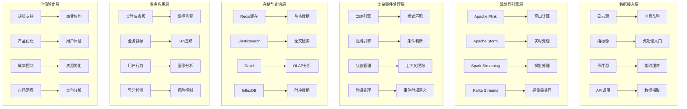

# 企业级实时日志分析与业务洞察深度实践

> **作者**: 企业级实时分析架构专家 | **版本**: v1.0 | **更新时间**: 2026-02-07
> **适用场景**: 企业级实时日志分析与业务价值挖掘 | **复杂度**: ⭐⭐⭐⭐⭐

## 🎯 摘要

本文档深入探讨企业级实时日志分析系统的架构设计、流处理技术和业务价值挖掘实践，基于大规模企业环境的实践经验，提供从实时数据处理到商业智能的完整技术指南，帮助企业实现从运维监控到业务决策支持的价值转化。

## 1. 实时分析架构设计

### 1.1 流处理架构模式



### 1.2 Lambda架构实现

#### 1.2.1 批处理与流处理融合

```yaml
# lambda-architecture.yaml
lambda_architecture:
  speed_layer:
    purpose: "实时处理，低延迟"
    technologies:
      - Apache Flink
      - Apache Storm
      - Kafka Streams
    characteristics:
      - 毫秒级延迟
      - 流式处理
      - 近似结果
    use_cases:
      - 实时监控告警
      - 用户行为分析
      - 异常检测响应
      
  batch_layer:
    purpose: "精确计算，高吞吐"
    technologies:
      - Apache Spark
      - Hadoop MapReduce
      - Presto
    characteristics:
      - 高吞吐量
      - 精确一致性
      - 批量处理
    use_cases:
      - 历史数据分析
      - 复杂报表生成
      - 数据仓库更新
      
  serving_layer:
    purpose: "快速查询，统一视图"
    technologies:
      - Elasticsearch
      - Druid
      - Redis
    characteristics:
      - 毫秒级查询
      - 数据合并
      - API服务
    use_cases:
      - 交互式查询
      - 仪表板展示
      - 应用程序集成

integration_patterns:
  dual_write:
    description: "同时写入批处理和流处理系统"
    implementation:
      - Kafka作为统一数据源
      - 流处理消费实时数据
      - 批处理定期处理历史数据
    advantages:
      - 数据一致性保证
      - 处理能力互补
      - 容错能力强
      
  materialized_views:
    description: "预计算聚合视图"
    implementation:
      - 实时聚合结果存储
      - 定期刷新批处理视图
      - 查询时合并不同来源
    advantages:
      - 查询性能优化
      - 减少重复计算
      - 支持复杂分析
```

## 2. 企业级流处理平台

### 2.1 Apache Flink深度实践

#### 2.1.1 高可用Flink集群部署

```yaml
# flink-cluster-deployment.yaml
apiVersion: flink.apache.org/v1beta1
kind: FlinkDeployment
metadata:
  name: enterprise-streaming
  namespace: streaming
spec:
  image: flink:1.17.1-scala_2.12-java11
  flinkVersion: v1_17
  flinkConfiguration:
    taskmanager.numberOfTaskSlots: "4"
    state.backend: rocksdb
    state.checkpoints.dir: s3://flink-checkpoints/streaming/
    state.savepoints.dir: s3://flink-savepoints/streaming/
    high-availability: zookeeper
    high-availability.storageDir: s3://flink-ha/streaming/
    high-availability.zookeeper.quorum: zk-0.zk-hs:2181,zk-1.zk-hs:2181,zk-2.zk-hs:2181
    restart-strategy: fixed-delay
    restart-strategy.fixed-delay.attempts: "10"
    restart-strategy.fixed-delay.delay: 30s
    
  serviceAccount: flink-service-account
  jobManager:
    replicas: 2
    resource:
      memory: "4096m"
      cpu: 2
    podTemplate:
      spec:
        containers:
        - name: flink-jobmanager
          env:
          - name: FLINK_PROPERTIES
            value: |
              metrics.reporter.prom.class: org.apache.flink.metrics.prometheus.PrometheusReporter
              metrics.reporter.prom.port: 9249
          volumeMounts:
          - name: flink-config-volume
            mountPath: /opt/flink/conf
        volumes:
        - name: flink-config-volume
          configMap:
            name: flink-config
          
  taskManager:
    replicas: 4
    resource:
      memory: "8192m"
      cpu: 4
    podTemplate:
      spec:
        containers:
        - name: flink-taskmanager
          env:
          - name: FLINK_PROPERTIES
            value: |
              task.cancellation.timeout: 300000
              blob.server.port: 6124
              query.server.port: 6125
          volumeMounts:
          - name: flink-config-volume
            mountPath: /opt/flink/conf
          - name: taskmanager-local-dir
            mountPath: /tmp/rocksdb
        volumes:
        - name: flink-config-volume
          configMap:
            name: flink-config
        - name: taskmanager-local-dir
          emptyDir: {}

---
apiVersion: v1
kind: ConfigMap
metadata:
  name: flink-config
  namespace: streaming
data:
  flink-conf.yaml: |
    jobmanager.rpc.address: enterprise-streaming-jobmanager
    jobmanager.rpc.port: 6123
    jobmanager.heap.size: 2048m
    taskmanager.heap.size: 2048m
    taskmanager.memory.managed.fraction: 0.4
    parallelism.default: 4
    state.backend: rocksdb
    state.checkpoints.dir: s3://flink-checkpoints/streaming/
    state.savepoints.dir: s3://flink-savepoints/streaming/
    execution.checkpointing.interval: 60000
    execution.checkpointing.mode: EXACTLY_ONCE
    execution.checkpointing.externalized-checkpoint-retention: RETAIN_ON_CANCELLATION
    rest.flamegraph.enabled: true
    metrics.latency.interval: 1000
    metrics.system-resource: true
    metrics.scope.operator: "<host>.taskmanager.<tm_id>.<job_name>"
    
  log4j-console.properties: |
    rootLogger.level = INFO
    rootLogger.appenderRef.console.ref = ConsoleAppender
    logger.flink.name = org.apache.flink
    logger.flink.level = INFO
    appender.console.name = ConsoleAppender
    appender.console.type = CONSOLE
    appender.console.layout.type = PatternLayout
    appender.console.layout.pattern = %d{yyyy-MM-dd HH:mm:ss,SSS} %-5p %-60c %x - %m%n
```

#### 2.1.2 实时ETL处理管道

```java
// RealTimeETLPipeline.java
import org.apache.flink.api.common.eventtime.WatermarkStrategy;
import org.apache.flink.api.common.functions.FilterFunction;
import org.apache.flink.api.common.functions.MapFunction;
import org.apache.flink.api.common.serialization.SimpleStringSchema;
import org.apache.flink.api.common.typeinfo.Types;
import org.apache.flink.api.java.tuple.Tuple2;
import org.apache.flink.connector.kafka.source.KafkaSource;
import org.apache.flink.connector.kafka.source.enumerator.initializer.OffsetsInitializer;
import org.apache.flink.streaming.api.datastream.DataStream;
import org.apache.flink.streaming.api.environment.StreamExecutionEnvironment;
import org.apache.flink.streaming.api.windowing.assigners.TumblingEventTimeWindows;
import org.apache.flink.streaming.api.windowing.time.Time;
import org.apache.flink.streaming.connectors.redis.RedisSink;
import org.apache.flink.streaming.connectors.redis.common.config.FlinkJedisPoolConfig;
import org.apache.flink.streaming.connectors.redis.common.mapper.RedisCommand;
import org.apache.flink.streaming.connectors.redis.common.mapper.RedisCommandDescription;
import org.apache.flink.streaming.connectors.redis.common.mapper.RedisMapper;

import java.time.Duration;
import java.util.Properties;

public class RealTimeETLPipeline {
    
    public static void main(String[] args) throws Exception {
        final StreamExecutionEnvironment env = StreamExecutionEnvironment.getExecutionEnvironment();
        
        // 配置检查点
        env.enableCheckpointing(60000); // 60秒检查点间隔
        env.getCheckpointConfig().setCheckpointTimeout(300000);
        env.getCheckpointConfig().setMinPauseBetweenCheckpoints(30000);
        env.getCheckpointConfig().setMaxConcurrentCheckpoints(1);
        
        // Kafka源配置
        KafkaSource<String> kafkaSource = KafkaSource.<String>builder()
            .setBootstrapServers("kafka-bootstrap:9092")
            .setTopics("application-logs", "system-metrics", "business-events")
            .setGroupId("flink-etl-consumer")
            .setStartingOffsets(OffsetsInitializer.earliest())
            .setValueOnlyDeserializer(new SimpleStringSchema())
            .build();
        
        // 读取Kafka数据流
        DataStream<String> rawStream = env.fromSource(
            kafkaSource, 
            WatermarkStrategy.forBoundedOutOfOrderness(Duration.ofSeconds(10)),
            "Kafka Source"
        );
        
        // 数据清洗和转换
        DataStream<ProcessedEvent> cleanedStream = rawStream
            .filter((FilterFunction<String>) value -> value != null && !value.trim().isEmpty())
            .map(new LogParser())
            .filter((FilterFunction<ProcessedEvent>) event -> 
                event.getTimestamp() > 0 && event.isValid());
        
        // 实时聚合 - 计算每分钟错误率
        DataStream<Tuple2<String, Double>> errorRateStream = cleanedStream
            .filter(event -> event.getLevel().equals("ERROR"))
            .map(event -> Tuple2.of(event.getService(), 1L))
            .returns(Types.TUPLE(Types.STRING, Types.LONG))
            .keyBy(tuple -> tuple.f0)
            .window(TumblingEventTimeWindows.of(Time.minutes(1)))
            .aggregate(new ErrorRateAggregateFunction());
        
        // 业务指标计算
        DataStream<ServiceMetrics> businessMetrics = cleanedStream
            .keyBy(ProcessedEvent::getService)
            .window(TumblingEventTimeWindows.of(Time.minutes(5)))
            .aggregate(new BusinessMetricsAggregateFunction());
        
        // 实时告警生成
        DataStream<Alert> alertStream = businessMetrics
            .filter(metrics -> metrics.getErrorRate() > 0.05 || metrics.getLatency() > 1000)
            .map(new AlertGenerator());
        
        // 结果输出到多个目标
        // 1. Redis缓存 - 供实时查询
        businessMetrics.addSink(new RedisSink<>(
            new FlinkJedisPoolConfig.Builder()
                .setHost("redis-master.streaming.svc.cluster.local")
                .setPort(6379)
                .build(),
            new ServiceMetricsRedisMapper()
        ));
        
        // 2. Elasticsearch - 供搜索分析
        businessMetrics.addSink(new ElasticsearchSink.Builder<>(
            Arrays.asList("http://elasticsearch:9200"),
            new ServiceMetricsElasticsearchSinkFunction()
        ).build());
        
        // 3. Kafka - 供下游系统消费
        alertStream.map(Alert::toJson)
            .addSink(new FlinkKafkaProducer<>(
                "alerts-topic",
                new SimpleStringSchema(),
                kafkaProducerProperties()
            ));
        
        env.execute("Real-time ETL Pipeline");
    }
    
    // 数据处理函数类
    public static class LogParser implements MapFunction<String, ProcessedEvent> {
        @Override
        public ProcessedEvent map(String value) throws Exception {
            // 解析JSON日志
            ObjectMapper mapper = new ObjectMapper();
            JsonNode jsonNode = mapper.readTree(value);
            
            return new ProcessedEvent(
                jsonNode.get("timestamp").asLong(),
                jsonNode.get("service").asText(),
                jsonNode.get("level").asText(),
                jsonNode.get("message").asText(),
                jsonNode.get("duration").asLong(0)
            );
        }
    }
    
    public static class ErrorRateAggregateFunction 
        implements AggregateFunction<Tuple2<String, Long>, Tuple2<Long, Long>, Tuple2<String, Double>> {
        
        @Override
        public Tuple2<Long, Long> createAccumulator() {
            return Tuple2.of(0L, 0L); // (errorCount, totalCount)
        }
        
        @Override
        public Tuple2<Long, Long> add(Tuple2<String, Long> value, Tuple2<Long, Long> accumulator) {
            long totalCount = accumulator.f1 + 1;
            long errorCount = value.f1 == 1 ? accumulator.f0 + 1 : accumulator.f0;
            return Tuple2.of(errorCount, totalCount);
        }
        
        @Override
        public Tuple2<String, Double> getResult(Tuple2<Long, Long> accumulator) {
            double errorRate = accumulator.f1 > 0 ? 
                (double) accumulator.f0 / accumulator.f1 : 0.0;
            return Tuple2.of("global", errorRate);
        }
        
        @Override
        public Tuple2<Long, Long> merge(Tuple2<Long, Long> a, Tuple2<Long, Long> b) {
            return Tuple2.of(a.f0 + b.f0, a.f1 + b.f1);
        }
    }
    
    // Redis映射器
    public static class ServiceMetricsRedisMapper implements RedisMapper<ServiceMetrics> {
        @Override
        public RedisCommandDescription getCommandDescription() {
            return new RedisCommandDescription(RedisCommand.HSET, "service_metrics");
        }
        
        @Override
        public String getKeyFromData(ServiceMetrics metrics) {
            return metrics.getServiceName() + ":" + 
                   Instant.ofEpochMilli(metrics.getWindowEnd()).toString();
        }
        
        @Override
        public String getValueFromData(ServiceMetrics metrics) {
            ObjectMapper mapper = new ObjectMapper();
            try {
                return mapper.writeValueAsString(metrics);
            } catch (Exception e) {
                return "{}";
            }
        }
    }
}

// 数据模型类
class ProcessedEvent {
    private long timestamp;
    private String service;
    private String level;
    private String message;
    private long duration;
    
    // 构造函数和getter/setter...
    public boolean isValid() {
        return service != null && !service.isEmpty() && 
               level != null && !level.isEmpty();
    }
}

class ServiceMetrics {
    private String serviceName;
    private long windowStart;
    private long windowEnd;
    private long requestCount;
    private long errorCount;
    private double errorRate;
    private double avgLatency;
    private Map<String, Object> dimensions;
    
    // 构造函数和getter/setter...
}

class Alert {
    private String alertType;
    private String service;
    private String message;
    private long timestamp;
    private Map<String, Object> details;
    
    public String toJson() {
        ObjectMapper mapper = new ObjectMapper();
        try {
            return mapper.writeValueAsString(this);
        } catch (Exception e) {
            return "{}";
        }
    }
}
```

### 2.2 复杂事件处理(CEP)

#### 2.2.1 业务规则引擎实现

```java
// BusinessRulesEngine.java
import org.apache.flink.cep.CEP;
import org.apache.flink.cep.PatternStream;
import org.apache.flink.cep.functions.PatternProcessFunction;
import org.apache.flink.cep.pattern.Pattern;
import org.apache.flink.cep.pattern.conditions.IterativeCondition;
import org.apache.flink.streaming.api.datastream.DataStream;
import org.apache.flink.util.Collector;

import java.util.List;
import java.util.Map;

public class BusinessRulesEngine {
    
    public static DataStream<BusinessAlert> applyFraudDetection(
            DataStream<TransactionEvent> transactionStream) {
        
        // 定义欺诈检测模式
        Pattern<TransactionEvent, ?> fraudPattern = Pattern.<TransactionEvent>begin("first")
            .subtype(TransactionEvent.class)
            .where(new IterativeCondition<TransactionEvent>() {
                @Override
                public boolean filter(TransactionEvent event, Context<TransactionEvent> ctx) {
                    return event.getAmount() > 10000; // 大额交易
                }
            })
            .next("second")
            .subtype(TransactionEvent.class)
            .where(new IterativeCondition<TransactionEvent>() {
                @Override
                public boolean filter(TransactionEvent event, Context<TransactionEvent> ctx) {
                    return event.getAmount() > 5000; // 中等金额
                }
            })
            .within(Time.minutes(5)); // 5分钟内
        
        // 应用模式
        PatternStream<TransactionEvent> patternStream = CEP.pattern(transactionStream, fraudPattern);
        
        // 处理匹配的模式
        return patternStream.process(new PatternProcessFunction<TransactionEvent, BusinessAlert>() {
            @Override
            public void processMatch(Map<String, List<TransactionEvent>> match, 
                                   Context ctx, Collector<BusinessAlert> out) {
                
                List<TransactionEvent> firstTx = match.get("first");
                List<TransactionEvent> secondTx = match.get("second");
                
                if (!firstTx.isEmpty() && !secondTx.isEmpty()) {
                    TransactionEvent first = firstTx.get(0);
                    TransactionEvent second = secondTx.get(0);
                    
                    BusinessAlert alert = new BusinessAlert(
                        "FRAUD_SUSPICION",
                        first.getUserId(),
                        String.format("可疑交易模式检测: 用户%s在5分钟内进行了大额(%s)和中等金额(%s)的交易",
                                    first.getUserId(), first.getAmount(), second.getAmount()),
                        System.currentTimeMillis(),
                        Map.of(
                            "first_transaction", first,
                            "second_transaction", second,
                            "time_window_minutes", 5
                        )
                    );
                    
                    out.collect(alert);
                }
            }
        });
    }
    
    public static DataStream<BusinessAlert> applyUserBehaviorAnalysis(
            DataStream<UserAction> actionStream) {
        
        // 定义用户异常行为模式
        Pattern<UserAction, ?> abnormalPattern = Pattern.<UserAction>begin("login")
            .where(action -> action.getActionType().equals("LOGIN"))
            .next("suspicious_action")
            .where(action -> action.getActionType().equals("PASSWORD_RESET"))
            .followedBy("another_suspicious")
            .where(action -> action.getActionType().equals("PROFILE_UPDATE"))
            .within(Time.hours(1));
        
        PatternStream<UserAction> patternStream = CEP.pattern(actionStream, abnormalPattern);
        
        return patternStream.process(new PatternProcessFunction<UserAction, BusinessAlert>() {
            @Override
            public void processMatch(Map<String, List<UserAction>> match,
                                   Context ctx, Collector<BusinessAlert> out) {
                
                UserAction login = match.get("login").get(0);
                UserAction pwdReset = match.get("suspicious_action").get(0);
                UserAction profileUpdate = match.get("another_suspicious").get(0);
                
                BusinessAlert alert = new BusinessAlert(
                    "ABNORMAL_USER_BEHAVIOR",
                    login.getUserId(),
                    "检测到用户异常行为序列",
                    System.currentTimeMillis(),
                    Map.of(
                        "behavior_sequence", List.of("LOGIN", "PASSWORD_RESET", "PROFILE_UPDATE"),
                        "actions", List.of(login, pwdReset, profileUpdate)
                    )
                );
                
                out.collect(alert);
            }
        });
    }
    
    public static DataStream<ServiceHealthAlert> applyServiceHealthMonitoring(
            DataStream<ServiceMetric> metricStream) {
        
        // 定义服务健康恶化模式
        Pattern<ServiceMetric, ?> degradationPattern = Pattern.<ServiceMetric>begin("normal")
            .where(metric -> metric.getResponseTime() < 200)
            .timesOrMore(3)
            .consecutive()
            .next("degradation")
            .where(metric -> metric.getResponseTime() > 500)
            .timesOrMore(2)
            .consecutive()
            .within(Time.minutes(10));
        
        PatternStream<ServiceMetric> patternStream = CEP.pattern(metricStream, degradationPattern);
        
        return patternStream.process(new PatternProcessFunction<ServiceMetric, ServiceHealthAlert>() {
            @Override
            public void processMatch(Map<String, List<ServiceMetric>> match,
                                   Context ctx, Collector<ServiceHealthAlert> out) {
                
                List<ServiceMetric> normalMetrics = match.get("normal");
                List<ServiceMetric> degradedMetrics = match.get("degradation");
                
                ServiceMetric lastNormal = normalMetrics.get(normalMetrics.size() - 1);
                ServiceMetric firstDegraded = degradedMetrics.get(0);
                
                ServiceHealthAlert alert = new ServiceHealthAlert(
                    lastNormal.getServiceName(),
                    "SERVICE_DEGRADATION",
                    String.format("服务%s性能显著下降: 响应时间从%dms恶化到%dms",
                                lastNormal.getServiceName(),
                                (int) lastNormal.getResponseTime(),
                                (int) firstDegraded.getResponseTime()),
                    System.currentTimeMillis(),
                    Map.of(
                        "before_metrics", normalMetrics,
                        "after_metrics", degradedMetrics,
                        "degradation_ratio", firstDegraded.getResponseTime() / lastNormal.getResponseTime()
                    )
                );
                
                out.collect(alert);
            }
        });
    }
}
```

## 3. 业务价值挖掘实践

### 3.1 用户行为分析

#### 3.1.1 实时用户画像构建

```python
# real-time-user-profiling.py
import json
import redis
import pandas as pd
from datetime import datetime, timedelta
from typing import Dict, List, Optional
import numpy as np
from sklearn.preprocessing import StandardScaler
from sklearn.cluster import KMeans

class RealTimeUserProfiler:
    def __init__(self, redis_host: str = 'localhost', redis_port: int = 6379):
        self.redis_client = redis.Redis(host=redis_host, port=redis_port, decode_responses=True)
        self.scaler = StandardScaler()
        self.clustering_model = None
        self.profile_features = [
            'session_count',
            'avg_session_duration',
            'page_views',
            'feature_usage_count',
            'conversion_rate',
            'bounce_rate',
            'device_diversity',
            'geographic_diversity'
        ]
        
    def process_user_event(self, event: Dict) -> Dict:
        """处理用户事件并更新画像"""
        user_id = event.get('user_id')
        if not user_id:
            return {}
            
        # 获取现有用户画像
        existing_profile = self.get_user_profile(user_id)
        
        # 更新画像特征
        updated_profile = self._update_profile_features(existing_profile, event)
        
        # 保存更新后的画像
        self.save_user_profile(user_id, updated_profile)
        
        # 实时聚类分析
        cluster_label = self._assign_cluster(updated_profile)
        updated_profile['cluster'] = cluster_label
        
        return updated_profile
    
    def _update_profile_features(self, profile: Dict, event: Dict) -> Dict:
        """更新用户画像特征"""
        now = datetime.now()
        event_type = event.get('event_type')
        
        # 初始化profile
        if not profile:
            profile = {
                'user_id': event.get('user_id'),
                'first_seen': now.isoformat(),
                'last_seen': now.isoformat(),
                'session_count': 0,
                'total_session_time': 0,
                'page_views': 0,
                'feature_usage': {},
                'conversions': 0,
                'bounces': 0,
                'devices': set(),
                'locations': set(),
                'updated_at': now.isoformat()
            }
        else:
            profile['last_seen'] = now.isoformat()
            profile['updated_at'] = now.isoformat()
        
        # 根据事件类型更新特征
        if event_type == 'session_start':
            profile['session_count'] += 1
            profile['session_start_time'] = event.get('timestamp')
            
        elif event_type == 'session_end':
            if 'session_start_time' in profile:
                session_duration = event.get('timestamp') - profile['session_start_time']
                profile['total_session_time'] += session_duration
                del profile['session_start_time']
                
                # 记录跳出率
                if profile['page_views'] == 0:
                    profile['bounces'] += 1
                    
        elif event_type == 'page_view':
            profile['page_views'] += 1
            
        elif event_type == 'feature_use':
            feature = event.get('feature_name')
            if feature:
                profile['feature_usage'][feature] = profile['feature_usage'].get(feature, 0) + 1
                
        elif event_type == 'conversion':
            profile['conversions'] += 1
            
        elif event_type == 'device_info':
            device = event.get('device_type')
            if device:
                profile['devices'].add(device)
                
        elif event_type == 'location_info':
            location = event.get('country')
            if location:
                profile['locations'].add(location)
        
        # 计算衍生特征
        profile['avg_session_duration'] = (
            profile['total_session_time'] / max(profile['session_count'], 1)
        )
        profile['conversion_rate'] = (
            profile['conversions'] / max(profile['session_count'], 1)
        )
        profile['bounce_rate'] = (
            profile['bounces'] / max(profile['session_count'], 1)
        )
        profile['feature_usage_count'] = sum(profile['feature_usage'].values())
        profile['device_diversity'] = len(profile['devices'])
        profile['geographic_diversity'] = len(profile['locations'])
        
        # 转换集合为列表以便序列化
        profile['devices'] = list(profile['devices'])
        profile['locations'] = list(profile['locations'])
        
        return profile
    
    def get_user_profile(self, user_id: str) -> Dict:
        """获取用户画像"""
        profile_key = f"user_profile:{user_id}"
        profile_data = self.redis_client.get(profile_key)
        
        if profile_data:
            return json.loads(profile_data)
        return {}
    
    def save_user_profile(self, user_id: str, profile: Dict):
        """保存用户画像"""
        profile_key = f"user_profile:{user_id}"
        self.redis_client.setex(profile_key, 86400, json.dumps(profile))  # 24小时过期
        
    def _assign_cluster(self, profile: Dict) -> str:
        """为用户分配聚类标签"""
        # 提取数值特征
        feature_vector = [profile.get(feature, 0) for feature in self.profile_features]
        
        # 如果还没有训练模型，使用简单规则
        if self.clustering_model is None:
            return self._simple_segmentation(feature_vector)
        
        # 使用训练好的模型预测
        scaled_features = self.scaler.transform([feature_vector])
        cluster_id = self.clustering_model.predict(scaled_features)[0]
        
        cluster_names = ['新用户', '活跃用户', '忠实用户', '流失风险用户', '高价值用户']
        return cluster_names[min(cluster_id, len(cluster_names) - 1)]
    
    def _simple_segmentation(self, features: List) -> str:
        """简单的用户分群规则"""
        session_count, avg_duration, page_views, conversion_rate = features[:4]
        
        if session_count <= 1:
            return '新用户'
        elif session_count <= 5 and avg_duration < 60:
            return '潜在流失用户'
        elif session_count > 10 and conversion_rate > 0.1:
            return '高价值用户'
        elif page_views > 20 and avg_duration > 180:
            return '忠实用户'
        else:
            return '普通用户'
    
    def batch_profile_analysis(self, user_ids: List[str]) -> pd.DataFrame:
        """批量分析用户画像"""
        profiles = []
        for user_id in user_ids:
            profile = self.get_user_profile(user_id)
            if profile:
                profiles.append(profile)
        
        if not profiles:
            return pd.DataFrame()
            
        df = pd.DataFrame(profiles)
        
        # 计算群体统计
        stats = {
            'total_users': len(df),
            'avg_sessions': df['session_count'].mean(),
            'avg_conversion_rate': df['conversion_rate'].mean(),
            'cluster_distribution': df['cluster'].value_counts().to_dict() if 'cluster' in df.columns else {}
        }
        
        return df, stats
    
    def generate_business_insights(self, time_window_hours: int = 24) -> Dict:
        """生成业务洞察"""
        # 获取近期活跃用户
        recent_users = self._get_recent_users(time_window_hours)
        
        # 分析用户行为模式
        df, stats = self.batch_profile_analysis(recent_users)
        
        if df.empty:
            return {'error': '没有足够的用户数据'}
        
        insights = {
            'time_period': f"最近{time_window_hours}小时",
            'user_statistics': stats,
            'behavior_patterns': self._analyze_behavior_patterns(df),
            'business_opportunities': self._identify_opportunities(df),
            'risk_indicators': self._detect_risks(df)
        }
        
        return insights
    
    def _get_recent_users(self, hours: int) -> List[str]:
        """获取近期活跃用户"""
        cutoff_time = datetime.now() - timedelta(hours=hours)
        cutoff_timestamp = cutoff_time.timestamp()
        
        # 使用Redis扫描获取近期用户
        pattern = "user_profile:*"
        user_ids = []
        
        for key in self.redis_client.scan_iter(match=pattern):
            user_id = key.decode('utf-8').split(':')[1]
            profile = self.get_user_profile(user_id)
            if profile and 'last_seen' in profile:
                last_seen = datetime.fromisoformat(profile['last_seen'])
                if last_seen > cutoff_time:
                    user_ids.append(user_id)
                    
        return user_ids
    
    def _analyze_behavior_patterns(self, df: pd.DataFrame) -> Dict:
        """分析行为模式"""
        patterns = {}
        
        # 使用时长分析
        if 'avg_session_duration' in df.columns:
            duration_segments = pd.cut(df['avg_session_duration'], 
                                     bins=[0, 60, 300, 600, float('inf')],
                                     labels=['短(<1min)', '中(1-5min)', '长(5-10min)', '很长(>10min)'])
            patterns['session_duration_distribution'] = duration_segments.value_counts().to_dict()
        
        # 转化率分析
        if 'conversion_rate' in df.columns:
            conversion_segments = pd.cut(df['conversion_rate'],
                                       bins=[0, 0.05, 0.1, 0.2, 1.0],
                                       labels=['低(<5%)', '中(5-10%)', '高(10-20%)', '很高(>20%)'])
            patterns['conversion_rate_distribution'] = conversion_segments.value_counts().to_dict()
            
        return patterns
    
    def _identify_opportunities(self, df: pd.DataFrame) -> List[Dict]:
        """识别商业机会"""
        opportunities = []
        
        # 识别高潜力但未转化用户
        high_potential = df[
            (df['session_count'] > 5) & 
            (df['avg_session_duration'] > 300) & 
            (df['conversion_rate'] < 0.05)
        ]
        
        if not high_potential.empty:
            opportunities.append({
                'opportunity': '高潜力未转化用户',
                'count': len(high_potential),
                'description': '这些用户表现出高参与度但转化率较低，建议针对性营销',
                'target_users': high_potential['user_id'].tolist()[:10]  # 取前10个示例
            })
        
        # 识别即将流失用户
        churn_risk = df[
            (df['session_count'] > 2) & 
            (df.get('days_since_last_session', 30) > 7)
        ]
        
        if not churn_risk.empty:
            opportunities.append({
                'opportunity': '流失挽回机会',
                'count': len(churn_risk),
                'description': '这些用户曾经活跃但现在较少使用，建议激活召回',
                'target_users': churn_risk['user_id'].tolist()[:10]
            })
            
        return opportunities
    
    def _detect_risks(self, df: pd.DataFrame) -> List[Dict]:
        """检测业务风险"""
        risks = []
        
        # 异常行为检测
        if 'page_views' in df.columns:
            outlier_threshold = df['page_views'].quantile(0.95)
            outliers = df[df['page_views'] > outlier_threshold]
            
            if not outliers.empty:
                risks.append({
                    'risk_type': '异常使用模式',
                    'severity': '中等',
                    'count': len(outliers),
                    'description': '检测到异常高的页面浏览行为，可能存在机器人或恶意行为'
                })
        
        # 转化率下降风险
        if 'conversion_rate' in df.columns:
            recent_avg = df['conversion_rate'].mean()
            if recent_avg < 0.05:  # 假设正常转化率为5%
                risks.append({
                    'risk_type': '转化率下降',
                    'severity': '高',
                    'description': f'整体转化率({recent_avg:.2%})低于预期水平'
                })
                
        return risks

# 使用示例
profiler = RealTimeUserProfiler()

# 处理用户事件
event = {
    'user_id': 'user_12345',
    'event_type': 'page_view',
    'timestamp': datetime.now().timestamp(),
    'page_url': '/products/widget-a'
}

updated_profile = profiler.process_user_event(event)
print("更新后的用户画像:", json.dumps(updated_profile, indent=2, ensure_ascii=False))

# 生成业务洞察
insights = profiler.generate_business_insights(24)
print("业务洞察:", json.dumps(insights, indent=2, ensure_ascii=False))
```

### 3.2 商业智能仪表板

#### 3.2.1 实时KPI监控面板

```json
{
  "dashboard": {
    "title": "企业实时业务洞察仪表板",
    "layout": "grid",
    "refresh_interval": "30s",
    "time_range": "最近1小时",
    "sections": [
      {
        "name": "核心业务指标",
        "type": "row",
        "height": "200px",
        "widgets": [
          {
            "id": "revenue_indicator",
            "type": "kpi_card",
            "title": "实时收入",
            "metric": "sum(transaction_amount)",
            "time_window": "5m",
            "comparison": "previous_period",
            "thresholds": {
              "good": {"value": 10000, "color": "green"},
              "warning": {"value": 5000, "color": "yellow"},
              "critical": {"value": 1000, "color": "red"}
            },
            "trend": "up",
            "change_percentage": "+12.5%"
          },
          {
            "id": "active_users",
            "type": "kpi_card",
            "title": "活跃用户数",
            "metric": "count_distinct(user_id)",
            "time_window": "5m",
            "sparkline": true,
            "thresholds": {
              "good": {"value": 1000, "color": "green"},
              "warning": {"value": 500, "color": "yellow"},
              "critical": {"value": 100, "color": "red"}
            }
          },
          {
            "id": "conversion_rate",
            "type": "kpi_card",
            "title": "转化率",
            "metric": "conversion_rate_formula",
            "time_window": "15m",
            "format": "percentage",
            "target": "5%",
            "current": "3.2%"
          }
        ]
      },
      {
        "name": "用户行为分析",
        "type": "row",
        "height": "300px",
        "widgets": [
          {
            "id": "user_journey_funnel",
            "type": "funnel_chart",
            "title": "用户转化漏斗",
            "steps": [
              {"name": "访问首页", "value": 10000},
              {"name": "浏览商品", "value": 4500},
              {"name": "加入购物车", "value": 1200},
              {"name": "下单支付", "value": 360},
              {"name": "完成购买", "value": 280}
            ],
            "conversion_rates": ["45%", "26.7%", "30%", "77.8%"]
          },
          {
            "id": "user_segments",
            "type": "pie_chart",
            "title": "用户群体分布",
            "dimension": "user_segment",
            "metrics": [
              {"name": "新用户", "value": 35, "color": "#FF6B6B"},
              {"name": "回头客", "value": 45, "color": "#4ECDC4"},
              {"name": "VIP用户", "value": 15, "color": "#45B7D1"},
              {"name": "流失用户", "value": 5, "color": "#96CEB4"}
            ]
          }
        ]
      },
      {
        "name": "业务健康度监控",
        "type": "row",
        "height": "250px",
        "widgets": [
          {
            "id": "service_health_matrix",
            "type": "heatmap",
            "title": "服务健康度矩阵",
            "rows": ["订单服务", "支付服务", "库存服务", "用户服务"],
            "columns": ["响应时间", "错误率", "吞吐量", "可用性"],
            "data": [
              [85, 92, 78, 96],
              [90, 88, 85, 92],
              [75, 85, 90, 88],
              [92, 95, 88, 94]
            ],
            "color_scheme": "green_to_red"
          },
          {
            "id": "real_time_alerts",
            "type": "alert_list",
            "title": "实时告警",
            "max_items": 10,
            "alerts": [
              {
                "severity": "high",
                "title": "支付服务错误率激增",
                "description": "过去5分钟错误率达到8.5%，超过阈值5%",
                "time": "2分钟前",
                "status": "active"
              },
              {
                "severity": "medium",
                "title": "用户注册量下降",
                "description": "新用户注册量环比下降15%",
                "time": "15分钟前",
                "status": "acknowledged"
              }
            ]
          }
        ]
      }
    ],
    "export_options": {
      "pdf_report": {
        "schedule": "daily",
        "recipients": ["management@company.com", "analytics@company.com"]
      },
      "csv_export": {
        "data_retention": "30天",
        "automatic_download": true
      }
    }
  }
}
```

## 4. 企业级最佳实践

### 4.1 性能优化策略

#### 4.1.1 流处理性能调优

```yaml
# stream-processing-optimization.yaml
performance_optimization:
  resource_allocation:
    parallelism_tuning:
      # 根据数据量和处理复杂度调整并行度
      initial_parallelism: 4
      auto_scaling:
        enabled: true
        min_parallelism: 2
        max_parallelism: 32
        scaling_metrics:
          - "backpressure"
          - "processing_latency"
          - "throughput"
          
    memory_management:
      jobmanager_heap: "4096m"
      taskmanager_heap: "4096m"
      managed_memory_fraction: 0.4
      network_memory_fraction: 0.1
      
    checkpoint_optimization:
      interval: "60000ms"  # 60秒检查点间隔
      timeout: "300000ms"  # 5分钟超时
      min_pause: "30000ms" # 30秒最小暂停
      concurrent_checkpoints: 1
      externalized_retention: "RETAIN_ON_CANCELLATION"
      
  data_skew_handling:
    key_grouping:
      # 使用盐化技术处理数据倾斜
      salting_technique: true
      salt_bits: 4  # 16个分组
      
    load_balancing:
      adaptive_partitioning: true
      rebalancing_interval: "300000ms"  # 5分钟重新平衡
      
  state_management:
    backend_selection:
      rocksdb:
        enabled: true
        local_directory: "/tmp/rocksdb"
        checkpoint_directory: "s3://flink-checkpoints/"
        
    state_ttl:
      # 设置状态过期时间
      session_state_ttl: "3600000ms"  # 1小时
      user_profile_ttl: "86400000ms"  # 24小时
      aggregation_state_ttl: "600000ms"  # 10分钟
      
    incremental_checkpointing:
      enabled: true
      interval: "10000ms"  # 10秒增量检查点

latency_optimization:
  event_time_processing:
    watermark_interval: "200ms"
    max_out_of_orderness: "10000ms"  # 10秒最大乱序
    
  operator_chaining:
    enable_chaining: true
    chain_stop_points:
      - "keyBy operations"
      - "window operations"
      - "sink operations"
      
  async_io:
    database_lookups:
      max_concurrent_requests: 100
      timeout: "5000ms"
      
    external_service_calls:
      max_concurrent_requests: 50
      timeout: "3000ms"

monitoring_and_alerting:
  metrics_collection:
    system_metrics:
      - "taskmanager_job_task_operator_currentEmitEventTimeLag"
      - "taskmanager_job_task_backPressuredTimeMsPerSecond"
      - "taskmanager_job_task_buffers_inPoolUsage"
      
    business_metrics:
      - "processed_events_per_second"
      - "average_processing_latency"
      - "checkpoint_completion_time"
      
  alerting_rules:
    latency_alerts:
      - metric: "processing_latency_95th_percentile"
        threshold: "1000ms"
        severity: "warning"
        
      - metric: "processing_latency_99th_percentile"
        threshold: "5000ms"
        severity: "critical"
        
    throughput_alerts:
      - metric: "events_per_second"
        threshold: "1000"
        comparison: "less_than"
        severity: "warning"
        
    resource_alerts:
      - metric: "heap_memory_usage"
        threshold: "85%"
        severity: "warning"
```

通过以上企业级实时日志分析与业务洞察深度实践，企业可以构建强大的实时分析能力，不仅满足运维监控需求，更能挖掘数据中的商业价值，为业务决策提供有力支撑。