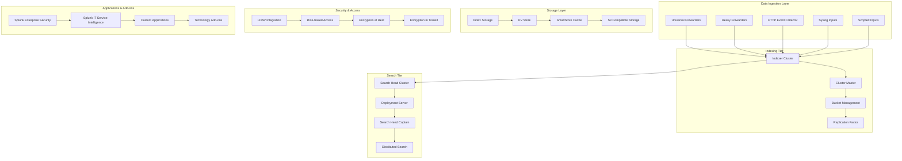

# Splunk Enterprise Log Analytics Platform 深度实践

> **Author**: Log Analytics Platform Architect | **Version**: v1.0 | **Update Time**: 2026-02-07
> **Scenario**: Enterprise-grade log analytics and SIEM platform | **Complexity**: ⭐⭐⭐⭐⭐

## 🎯 Abstract

This document provides comprehensive exploration of Splunk enterprise log analytics platform architecture design, deployment practices, and operational management. Based on large-scale production environment experience, it offers complete technical guidance from log collection to advanced security analytics, helping enterprises build intelligent, scalable log management and security information platforms.

## 1. Splunk Enterprise Architecture Deep Dive

### 1.1 Core Component Architecture



### 1.2 High Availability Deployment

```yaml
splunk_ha_deployment:
  indexer_cluster:
    cluster_master:
      hostname: splunk-cm.company.com
      role: cluster-master
      configuration:
        replication_factor: 3
        search_factor: 2
        site_replication_factor: origin:2,total:3
        site_search_factor: origin:1,total:2
    
    peer_nodes:
      - hostname: splunk-indexer-1.company.com
        site: site1
        roles: [indexer, search_peer]
        
      - hostname: splunk-indexer-2.company.com
        site: site1
        roles: [indexer, search_peer]
        
      - hostname: splunk-indexer-3.company.com
        site: site2
        roles: [indexer, search_peer]
        
      - hostname: splunk-indexer-4.company.com
        site: site2
        roles: [indexer, search_peer]
        
      - hostname: splunk-indexer-5.company.com
        site: site3
        roles: [indexer, search_peer]
  
  search_head_cluster:
    deployer:
      hostname: splunk-deployer.company.com
      role: deployer
      
    captain:
      hostname: splunk-shc-captain.company.com
      election: automatic
      
    members:
      - hostname: splunk-sh1.company.com
        roles: [search_head]
        
      - hostname: splunk-sh2.company.com
        roles: [search_head]
        
      - hostname: splunk-sh3.company.com
        roles: [search_head]
  
  license_master:
    hostname: splunk-license.company.com
    role: license_master
    configuration:
      license_group: enterprise
      pool_size: 500GB/day
```

## 2. Advanced Log Collection Configuration

### 2.1 Universal Forwarder Deployment

```bash
#!/bin/bash
# Splunk Universal Forwarder 批量部署脚本

# 1. 下载并安装Universal Forwarder
wget -O splunkforwarder.rpm "https://download.splunk.com/products/universalforwarder/releases/9.0.4/linux/splunkforwarder-9.0.4-94850f35391c-linux-2.6-x86_64.rpm"
sudo rpm -i splunkforwarder.rpm

# 2. 配置部署客户端
cat > /opt/splunkforwarder/etc/system/local/deploymentclient.conf << 'EOF'
[target-broker:deploymentServer]
targetUri = splunk-deployer.company.com:8089

[deployment-client]
phoneHomeIntervalInSecs = 60
EOF

# 3. 配置输入监控
cat > /opt/splunkforwarder/etc/apps/search/local/inputs.conf << 'EOF'
[monitor:///var/log/application/]
disabled = false
index = app-logs
sourcetype = app:json
crcSalt = <SOURCE>

[monitor:///var/log/nginx/]
disabled = false
index = web-logs
sourcetype = nginx:access
crcSalt = <SOURCE>

[monitor:///var/log/mysql/]
disabled = false
index = db-logs
sourcetype = mysql:error
crcSalt = <SOURCE>

[script:///opt/scripts/custom_monitor.sh]
disabled = false
index = custom-logs
interval = 60
source = custom_script
EOF

# 4. 配置网络和安全
cat > /opt/splunkforwarder/etc/system/local/server.conf << 'EOF'
[general]
serverName = uf-$HOSTNAME

[sslConfig]
enableSplunkdSSL = true
caCertPath = /opt/splunkforwarder/etc/auth/cacert.pem
EOF

# 5. 启动服务
sudo /opt/splunkforwarder/bin/splunk start --accept-license --answer-yes --no-prompt
sudo /opt/splunkforwarder/bin/splunk enable boot-start
```

### 2.2 Heavy Forwarder Configuration

```ini
# heavy_forwarder_inputs.conf
[monitor:///opt/applications/logs/]
disabled = false
index = application-main
sourcetype = app:structured
crcSalt = <SOURCE>
queue = parsingQueue

[monitor:///var/log/security/]
disabled = false
index = security-logs
sourcetype = syslog
crcSalt = <SOURCE>
queue = parsingQueue

[tcp://:9997]
connection_host = ip
disabled = false
index = infrastructure

[script:///opt/scripts/system_health.sh]
disabled = false
index = system-health
interval = 300
source = system_health_check
sourcetype = script:health

# heavy_forwarder_outputs.conf
[tcpout]
defaultGroup = primary_indexers

[tcpout:primary_indexers]
server = splunk-indexer-1:9997,splunk-indexer-2:9997,splunk-indexer-3:9997
autoLB = true
forceTimebasedAutoLB = true
compressed = true
```

### 2.3 HTTP Event Collector Configuration

```bash
#!/bin/bash
# HEC配置和令牌管理脚本

# 1. 在Splunk中创建HEC输入
curl -k -u admin:password https://splunk-indexer:8089/servicesNS/nobody/search/data/inputs/http \
  -d name=http_events \
  -d disabled=0 \
  -d index=main \
  -d indexes=app-logs,web-logs,security-logs \
  -d useACK=true

# 2. 创建HEC令牌
TOKEN_CONFIG='{
  "name": "application_logs",
  "description": "Token for application log ingestion",
  "index": "app-logs",
  "indexes": ["app-logs", "web-logs"],
  "sourcetype": "app:json",
  "source": "hec-application",
  "token": "your-generated-token-here",
  "useACK": true,
  "disabled": false
}'

curl -k -u admin:password -X POST \
  https://splunk-indexer:8089/servicesNS/nobody/splunk_httpinput/data/inputs/http \
  -H "Content-Type: application/json" \
  -d "$TOKEN_CONFIG"

# 3. 应用程序HEC客户端示例
cat > /opt/scripts/send_to_hec.py << 'EOF'
#!/usr/bin/env python3
import requests
import json
import time
from datetime import datetime

class SplunkHECClient:
    def __init__(self, hec_url, token, verify_ssl=True):
        self.hec_url = f"{hec_url}/services/collector/event"
        self.headers = {
            'Authorization': f'Splunk {token}',
            'Content-Type': 'application/json'
        }
        self.verify_ssl = verify_ssl
    
    def send_event(self, event_data, sourcetype=None, source=None, index=None):
        payload = {
            'time': int(time.time()),
            'host': event_data.get('host', 'unknown'),
            'event': event_data,
            'fields': {
                'environment': event_data.get('environment', 'production')
            }
        }
        
        if sourcetype:
            payload['sourcetype'] = sourcetype
        if source:
            payload['source'] = source
        if index:
            payload['index'] = index
            
        try:
            response = requests.post(
                self.hec_url,
                headers=self.headers,
                json=payload,
                verify=self.verify_ssl,
                timeout=30
            )
            return response.status_code == 200
        except Exception as e:
            print(f"Failed to send event: {e}")
            return False

# 使用示例
hec_client = SplunkHECClient(
    'https://splunk-hec.company.com:8088',
    'your-hec-token'
)

# 发送应用程序日志
app_log = {
    'timestamp': datetime.utcnow().isoformat(),
    'level': 'ERROR',
    'message': 'Database connection failed',
    'service': 'user-service',
    'trace_id': 'abc123',
    'host': 'app-server-01'
}

hec_client.send_event(app_log, sourcetype='app:json', index='app-logs')
EOF
```

## 3. Advanced Search and Analytics

### 3.1 SPL (Search Processing Language) Best Practices

```spl
# 高级SPL查询示例

# 1. 复杂事件关联分析
index=security_logs sourcetype=windows_security EventCode=4625 OR EventCode=4624
| eval auth_status=case(EventCode=4625, "Failed", EventCode=4624, "Successful")
| stats count as login_attempts, 
        dc(user) as unique_users,
        values(src_ip) as source_ips
       by user, auth_status, _time
| where login_attempts > 10
| join user [
    search index=security_logs sourcetype=windows_security EventCode=4740
    | stats count as account_lockouts by user
  ]
| where account_lockouts > 0
| sort - login_attempts

# 2. 性能瓶颈分析
index=application_logs sourcetype=app:performance
| eval response_time=tonumber(response_time_ms)/1000
| where response_time > 2
| stats avg(response_time) as avg_duration,
        perc95(response_time) as p95_duration,
        perc99(response_time) as p99_duration,
        count as request_count
       by endpoint, http_method, environment
| where request_count > 100
| eval sla_breach=if(avg_duration > 1.5, "YES", "NO")
| sort - avg_duration

# 3. 用户行为分析
index=web_logs sourcetype=nginx:access
| spath input=user_agent path="browser.family" output=browser
| spath input=user_agent path="os.family" output=os
| eval hour=strftime(_time, "%H")
| stats count as page_views,
        dc(clientip) as unique_visitors,
        avg(bytes) as avg_response_size
       by uri_path, browser, os, hour
| where page_views > 1000
| streamstats window=24 sum(page_views) as rolling_24h_views
| eval popularity_score=(page_views/rolling_24h_views)*100
| sort - popularity_score

# 4. 异常检测和机器学习
| inputlookup transactions_baseline.csv
| join transaction_type [
    search index=financial_logs sourcetype=transaction
    | stats count as current_count,
            avg(amount) as current_avg_amount
           by transaction_type, date_hour
  ]
| eval variance_ratio=current_count/baseline_count
| eval amount_deviation=abs(current_avg_amount-baseline_avg_amount)/baseline_avg_amount
| where variance_ratio > 2 OR amount_deviation > 0.5
| anomalydetection "transaction_anomalies"
```

### 3.2 Custom Dashboard Development

```xml
<!-- 高级仪表板配置示例 -->
<form theme="dark">
  <label>Enterprise Security Operations Center</label>
  <fieldset submitButton="false"></fieldset>
  
  <row>
    <panel>
      <single>
        <title>Critical Security Events (24h)</title>
        <search>
          <query>
            index=security_logs severity=critical
            | stats count as critical_events
            | where critical_events > 0
          </query>
          <earliest>-24h@h</earliest>
          <latest>now</latest>
        </search>
        <option name="drilldown">none</option>
        <option name="colorBy">value</option>
        <option name="colorMode">block</option>
        <option name="numberPrecision">0</option>
        <option name="rangeColors">["0x53a051","0xdc4e41"]</option>
        <option name="rangeValues">[0]</option>
        <option name="showSparkline">1</option>
        <option name="showTrendIndicator">1</option>
        <option name="trendColorInterpretation">inverse</option>
        <option name="trendDisplayMode">absolute</option>
        <option name="useColors">1</option>
      </single>
    </panel>
    
    <panel>
      <chart>
        <title>Network Traffic by Protocol</title>
        <search>
          <query>
            index=network_logs sourcetype=netflow
            | timechart span=1h sum(bytes) as total_bytes by protocol
            | eval total_bytes=total_bytes/1024/1024/1024
          </query>
          <earliest>-7d@h</earliest>
          <latest>now</latest>
        </search>
        <option name="charting.chart">area</option>
        <option name="charting.axisTitleX.text">Time</option>
        <option name="charting.axisTitleY.text">Traffic (GB)</option>
        <option name="charting.legend.placement">right</option>
      </chart>
    </panel>
  </row>
  
  <row>
    <panel>
      <table>
        <title>Top Suspicious Activities</title>
        <search>
          <query>
            index=security_logs
            | eval risk_score=case(
                severity="critical", 100,
                severity="high", 75,
                severity="medium", 50,
                severity="low", 25
              )
            | stats count as event_count,
                    avg(risk_score) as avg_risk,
                    values(action) as actions,
                    dc(src_ip) as unique_sources
                   by user, category, _raw
            | where avg_risk > 50
            | sort - avg_risk
            | head 20
          </query>
          <earliest>-1h</earliest>
          <latest>now</latest>
        </search>
        <option name="drilldown">cell</option>
        <format type="number" field="avg_risk">
          <option name="precision">0</option>
        </format>
        <format type="color" field="avg_risk">
          <colorPalette type="minMidMax" maxColor="#DC4E41" minColor="#53A051"></colorPalette>
          <scale type="minMidMax" maxValue="100" minValue="0"></scale>
        </format>
      </table>
    </panel>
  </row>
</form>
```

## 4. Enterprise Security Implementation

### 4.1 Splunk Enterprise Security (ES) Configuration

```bash
#!/bin/bash
# Splunk ES 安全配置脚本

# 1. 安装ES应用
sudo /opt/splunk/bin/splunk install app /opt/splunk/etc/apps/SplunkEnterpriseSecuritySuite.tar.gz

# 2. 配置安全索引
cat > /opt/splunk/etc/apps/SplunkEnterpriseSecuritySuite/local/indexes.conf << 'EOF'
[notable]
homePath = $SPLUNK_DB/notable/db
coldPath = $SPLUNK_DB/notable/colddb
thawedPath = $SPLUNK_DB/notable/thaweddb
maxTotalDataSizeMB = 100000

[risk]
homePath = $SPLUNK_DB/risk/db
coldPath = $SPLUNK_DB/risk/colddb
thawedPath = $SPLUNK_DB/risk/thaweddb
maxTotalDataSizeMB = 50000

[assets]
homePath = $SPLUNK_DB/assets/db
coldPath = $SPLUNK_DB/assets/colddb
thawedPath = $SPLUNK_DB/assets/thaweddb
EOF

# 3. 配置威胁情报源
cat > /opt/splunk/etc/apps/SplunkEnterpriseSecuritySuite/local/threat_intel.conf << 'EOF'
[threatlist:virustotal]
url = https://www.virustotal.com/intelligence/search/programmatic/
api_key = YOUR_VIRUS_TOTAL_API_KEY
enabled = true
polling_interval = 3600

[threatlist:alienvault]
url = https://reputation.alienvault.com/reputation.generic
enabled = true
polling_interval = 1800

[threatlist:abuse_ch]
url = https://feodotracker.abuse.ch/downloads/ipblocklist.txt
enabled = true
polling_interval = 3600
EOF

# 4. 配置关联规则
cat > /opt/splunk/etc/apps/SplunkEnterpriseSecuritySuite/default/correlationsearches.conf << 'EOF'
[Brute Force Login Attempts]
schedule = */5 * * * *
search = index=security_logs EventCode=4625
         | stats count as failed_attempts by user, src_ip
         | where failed_attempts > 5
action.notable = 1
action.email = 1
action.email.to = security-team@company.com
action.email.subject = Brute Force Attack Detected

[Data Exfiltration Attempt]
schedule = */10 * * * *
search = index=network_logs bytes_out > 10000000
         | stats sum(bytes_out) as total_bytes by src_ip, dest_ip
         | where total_bytes > 100000000
action.notable = 1
action.email = 1
action.risk = 1
risk_object_type = src_ip
risk_object = src_ip
risk_score = 80
EOF
```

### 4.2 Advanced Correlation Searches

```spl
# 高级威胁关联分析

# 1. 横向移动检测
index=security_logs (EventCode=4624 OR EventCode=4648)
| eval logon_type=mvindex(Logon_Type, 0)
| where logon_type="3" OR logon_type="9"
| stats count as logon_count,
        values(TargetUserName) as target_users,
        values(WorkstationName) as workstations
       by src_ip, _time
| join src_ip [
    search index=security_logs EventCode=4720
    | stats count as account_creations by src_ip
  ]
| where logon_count > 50 AND account_creations > 0
| eval threat_level="HIGH"
| sort - logon_count

# 2. 数据泄露模式检测
index=application_logs action="export" OR action="download"
| eval file_size_gb=file_size_bytes/1024/1024/1024
| where file_size_gb > 1
| stats count as export_events,
        sum(file_size_gb) as total_data_exported,
        dc(user) as unique_users
       by user, department, _time
| join user [
    search index=security_logs EventCode=4728 OR EventCode=4732
    | stats count as privilege_changes by user
  ]
| where export_events > 10 OR privilege_changes > 0
| eval risk_score=export_events*10 + privilege_changes*25

# 3. 异常时间访问模式
index=access_logs
| eval hour=strftime(_time, "%H")
| eval day_of_week=strftime(_time, "%u")
| where hour >= 22 OR hour <= 6
| stats count as off_hours_access,
        values(uri_path) as accessed_resources
       by user, clientip, day_of_week
| join user [
    search index=user_behavior baseline="normal"
    | stats avg(access_count) as avg_normal_access by user
  ]
| eval deviation_ratio=off_hours_access/avg_normal_access
| where deviation_ratio > 3
```

## 5. Performance Optimization and Scaling

### 5.1 Index Optimization Strategies

```bash
#!/bin/bash
# Splunk索引优化脚本

# 1. 索引冷热数据分离
cat > /opt/splunk/etc/system/local/indexes.conf << 'EOF'
[volume:hot_storage]
path = /opt/splunk/var/lib/splunk/hot

[volume:cold_storage]
path = /mnt/nfs/splunk/cold

[main]
homePath = volume:hot_storage/main/db
coldPath = volume:cold_storage/main/colddb
thawedPath = /opt/splunk/var/lib/splunk/main/thaweddb
maxHotSpanSecs = 86400
maxHotBuckets = 30
maxWarmDBCount = 300
frozenTimePeriodInSecs = 2592000
EOF

# 2. SmartStore配置（云存储）
cat > /opt/splunk/etc/system/local/indexes.conf << 'EOF'
[default]
remotePath = volume:remote_store/%INDEX_NAME%/%SEGMENT_ID%
repFactor = auto
maxGlobalRawDataSizeMB = 1000000

[volume:remote_store]
storageType = remote
path = s3://splunk-smartstore-bucket
remote.s3.access_key = YOUR_ACCESS_KEY
remote.s3.secret_key = YOUR_SECRET_KEY
remote.s3.endpoint = s3.amazonaws.com
EOF

# 3. 性能监控脚本
cat > /opt/scripts/splunk_performance_monitor.sh << 'EOF'
#!/bin/bash

# 监控索引器性能
/opt/splunk/bin/splunk cmd splunkd rest --noauth GET \
  /services/server/introspection/indexer \
  | grep -E "(throughput|latency|queue)"

# 监控搜索头性能
/opt/splunk/bin/splunk cmd splunkd rest --noauth GET \
  /services/server/introspection/scheduler \
  | grep -E "(active|completed|failed)"

# 检查磁盘使用情况
df -h /opt/splunk/var/lib/splunk/

# 检查内存使用
free -h

# 检查CPU使用
top -bn1 | grep "Cpu(s)"
EOF
```

### 5.2 Search Performance Optimization

```spl
# 搜索性能优化技巧

# 1. 使用字段发现优化
| metadata type=sourcetypes index=main
| where totalCount > 1000000
| fields sourcetype, totalCount, recentTime

# 2. 时间范围优化
index=application_logs sourcetype=app:json
| eval _raw_time=_time
| where _raw_time >= relative_time(now(), "-7d@d")
  AND _raw_time < relative_time(now(), "@d")
| fields _raw, _time, host, source

# 3. 并行处理优化
index=web_logs sourcetype=nginx:access
| fields _raw, _time, status, bytes
| eval response_category=case(status<300, "success", status<400, "redirect", status<500, "client_error", "server_error")
| stats count as request_count,
        sum(eval(if(response_category="success", 1, 0))) as success_count,
        avg(bytes) as avg_bytes
       by status, response_category
| sort - request_count
| head 1000

# 4. 内存使用优化
index=large_dataset
| fields _raw, _time
| eval parsed_data=spath(_raw, "data.field")
| where isnotnull(parsed_data)
| stats count by parsed_data
| sort - count
| head 10000
```

## 6. Integration and Automation

### 6.1 REST API Integration Examples

```python
#!/usr/bin/env python3
# splunk_api_integration.py
import requests
import json
from datetime import datetime, timedelta
import base64

class SplunkAPI:
    def __init__(self, host, port, username, password, use_ssl=True):
        self.host = host
        self.port = port
        self.username = username
        self.password = password
        self.use_ssl = use_ssl
        self.base_url = f"{'https' if use_ssl else 'http'}://{host}:{port}"
        self.session = requests.Session()
        self.session.auth = (username, password)
        self.session.headers.update({'Content-Type': 'application/json'})
    
    def search(self, query, earliest_time="-24h@h", latest_time="now"):
        """执行搜索查询"""
        search_url = f"{self.base_url}/services/search/jobs"
        
        # 创建搜索作业
        search_data = {
            'search': query,
            'earliest_time': earliest_time,
            'latest_time': latest_time,
            'exec_mode': 'normal'
        }
        
        response = self.session.post(search_url, data=search_data)
        if response.status_code != 201:
            raise Exception(f"Search creation failed: {response.text}")
        
        # 获取作业SID
        sid = response.json()['sid']
        
        # 等待作业完成
        job_url = f"{self.base_url}/services/search/jobs/{sid}"
        while True:
            job_response = self.session.get(job_url)
            job_status = job_response.json()['entry'][0]['content']['dispatchState']
            
            if job_status == 'DONE':
                break
            elif job_status == 'FAILED':
                raise Exception("Search job failed")
            
            time.sleep(1)
        
        # 获取结果
        results_url = f"{job_url}/results?output_mode=json"
        results_response = self.session.get(results_url)
        
        return results_response.json()
    
    def create_saved_search(self, name, query, cron_schedule="0 * * * *"):
        """创建保存的搜索"""
        saved_search_url = f"{self.base_url}/servicesNS/nobody/search/saved/searches"
        
        search_config = {
            'name': name,
            'search': query,
            'cron_schedule': cron_schedule,
            'dispatch.earliest_time': '-24h@h',
            'dispatch.latest_time': 'now',
            'alert.track': '1',
            'alert_type': 'number of events',
            'alert_comparator': 'greater than',
            'alert_threshold': '100',
            'actions': 'email',
            'action.email.to': 'admin@company.com'
        }
        
        response = self.session.post(saved_search_url, data=search_config)
        return response.status_code == 201
    
    def get_system_info(self):
        """获取系统信息"""
        info_url = f"{self.base_url}/services/server/info"
        response = self.session.get(info_url)
        return response.json()

# 使用示例
if __name__ == "__main__":
    splunk = SplunkAPI("splunk-server.company.com", 8089, "admin", "password")
    
    # 执行安全分析查询
    security_query = '''
    index=security_logs EventCode=4625
    | stats count as failed_logins by user, src_ip
    | where failed_logins > 10
    '''
    
    results = splunk.search(security_query)
    print("Security Analysis Results:")
    for result in results.get('results', []):
        print(f"User: {result['user']}, IP: {result['src_ip']}, Failed Logins: {result['failed_logins']}")
    
    # 创建定期安全报告
    report_query = '''
    index=application_logs sourcetype=app:error
    | stats count as error_count by service, error_type
    | sort - error_count
    '''
    
    success = splunk.create_saved_search("Daily Error Report", report_query, "0 9 * * *")
    print(f"Saved search creation: {'Success' if success else 'Failed'}")
```

### 6.2 Alert Action Scripts

```python
#!/usr/bin/env python3
# splunk_alert_action.py
import sys
import json
import smtplib
from email.mime.text import MIMEText
from email.mime.multipart import MIMEMultipart
import requests
from datetime import datetime

def send_slack_notification(webhook_url, alert_data):
    """发送Slack通知"""
    message = {
        "text": f"🚨 Splunk Alert Triggered: {alert_data['name']}",
        "attachments": [
            {
                "color": "danger",
                "fields": [
                    {
                        "title": "Alert Name",
                        "value": alert_data['name'],
                        "short": True
                    },
                    {
                        "title": "Severity",
                        "value": alert_data.get('severity', 'Unknown'),
                        "short": True
                    },
                    {
                        "title": "Triggered At",
                        "value": datetime.now().strftime("%Y-%m-%d %H:%M:%S"),
                        "short": True
                    },
                    {
                        "title": "Result Count",
                        "value": str(alert_data.get('result_count', 0)),
                        "short": True
                    },
                    {
                        "title": "Search Results",
                        "value": json.dumps(alert_data.get('results', {}), indent=2),
                        "short": False
                    }
                ]
            }
        ]
    }
    
    response = requests.post(webhook_url, json=message)
    return response.status_code == 200

def send_email_notification(smtp_server, sender, recipients, alert_data):
    """发送邮件通知"""
    msg = MIMEMultipart()
    msg['From'] = sender
    msg['To'] = ', '.join(recipients)
    msg['Subject'] = f"🚨 Splunk Alert: {alert_data['name']}"
    
    body = f"""
    Splunk Alert Details:
    
    Name: {alert_data['name']}
    Severity: {alert_data.get('severity', 'Unknown')}
    Triggered At: {datetime.now().strftime("%Y-%m-%d %H:%M:%S")}
    Result Count: {alert_data.get('result_count', 0)}
    
    Search Results:
    {json.dumps(alert_data.get('results', {}), indent=2)}
    """
    
    msg.attach(MIMEText(body, 'plain'))
    
    try:
        server = smtplib.SMTP(smtp_server)
        server.send_message(msg)
        server.quit()
        return True
    except Exception as e:
        print(f"Email sending failed: {e}")
        return False

def main():
    # 从stdin读取alert数据
    alert_data = json.load(sys.stdin)
    
    # 配置
    SLACK_WEBHOOK = "https://hooks.slack.com/services/YOUR/SLACK/WEBHOOK"
    SMTP_SERVER = "smtp.company.com"
    EMAIL_SENDER = "splunk-alerts@company.com"
    EMAIL_RECIPIENTS = ["security-team@company.com", "admin@company.com"]
    
    # 发送通知
    slack_success = send_slack_notification(SLACK_WEBHOOK, alert_data)
    email_success = send_email_notification(SMTP_SERVER, EMAIL_SENDER, EMAIL_RECIPIENTS, alert_data)
    
    # 返回结果给Splunk
    result = {
        "slack_sent": slack_success,
        "email_sent": email_success,
        "timestamp": datetime.now().isoformat()
    }
    
    print(json.dumps(result))

if __name__ == "__main__":
    main()
```

## 7. Backup and Disaster Recovery

### 7.1 Automated Backup Strategy

```bash
#!/bin/bash
# splunk_backup.sh - 完整备份脚本

BACKUP_BASE="/backup/splunk"
DATE=$(date +%Y%m%d_%H%M%S)
BACKUP_DIR="$BACKUP_BASE/$DATE"

# 创建备份目录
mkdir -p "$BACKUP_DIR"

# 1. 备份配置文件
echo "Backing up configuration files..."
tar -czf "$BACKUP_DIR/splunk_configs.tar.gz" \
    /opt/splunk/etc/system/local \
    /opt/splunk/etc/apps/*/local \
    /opt/splunk/etc/users \
    /opt/splunk/etc/auth

# 2. 备份KV Store
echo "Backing up KV Store..."
/opt/splunk/bin/splunk backup kvstore -host localhost -port 8089 \
    -username admin -password "$SPLUNK_PASSWORD" \
    -output "$BACKUP_DIR/kvstore_backup"

# 3. 备份许可证
echo "Backing up licenses..."
cp -r /opt/splunk/etc/licenses "$BACKUP_DIR/licenses"

# 4. 备份重要索引元数据
echo "Backing up index metadata..."
for index in $($SPLUNK_HOME/bin/splunk cmd splunkd rest --noauth GET /services/data/indexes | grep title | cut -d'>' -f2 | cut -d'<' -f1); do
    mkdir -p "$BACKUP_DIR/index_metadata/$index"
    cp "/opt/splunk/var/lib/splunk/$index/db/*" "$BACKUP_DIR/index_metadata/$index/" 2>/dev/null || true
done

# 5. 创建备份清单
cat > "$BACKUP_DIR/backup_manifest.json" << EOF
{
  "backup_id": "$DATE",
  "created_at": "$(date -Iseconds)",
  "splunk_version": "$(/opt/splunk/bin/splunk version)",
  "components": {
    "configs": "splunk_configs.tar.gz",
    "kvstore": "kvstore_backup",
    "licenses": "licenses/",
    "index_metadata": "index_metadata/"
  },
  "size_bytes": $(du -sb "$BACKUP_DIR" | cut -f1)
}
EOF

# 6. 验证备份完整性
echo "Verifying backup integrity..."
if tar -tzf "$BACKUP_DIR/splunk_configs.tar.gz" >/dev/null 2>&1; then
    echo "Configuration backup verified"
else
    echo "Configuration backup verification failed"
    exit 1
fi

# 7. 清理旧备份（保留最近30天）
find "$BACKUP_BASE" -mindepth 1 -maxdepth 1 -type d -mtime +30 -exec rm -rf {} \;

echo "Backup completed successfully: $BACKUP_DIR"
```

---
*This document is based on enterprise-level Splunk platform practice experience and continuously updated with the latest technologies and best practices.*